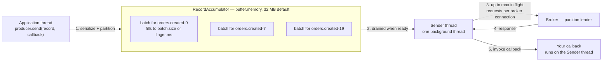

# Producer Failure Modes

Doc 02 answered "was the record replicated." This doc answers the three questions before that:
was it written **at all**, was it written **once**, and was it written **in order**. All three are
decided inside the producer client, mostly by defaults, and mostly before any broker is involved.

## What `send()` actually does

The single most useful thing to know about the Kafka producer is that `send()` does not send
anything. Understanding the buffering model explains five of the eleven failures below without
any further mechanism.




Five things follow from this picture and each one is a production incident waiting for the right
conditions:

1. `send()` **returns before the record leaves the process.** It returns once the record is
  appended to an in-memory batch. If the process dies now, the record is gone with no error
   anywhere. This is `P-01`.
2. `send()` **can block anyway.** If the buffer is full or partition metadata is unknown, the
  calling thread blocks for up to `max.block.ms` (60 s). This is `P-02`, and it surprises people
   who believe `send()` is asynchronous in all circumstances.
3. **The only place you learn the outcome is the callback** (or the returned `Future`). Code that
  ignores both cannot distinguish success from failure.
4. **Batching is per partition,** so records for different partitions are in different batches and
  are sent in different requests, which can succeed and fail independently. Ordering across
   partitions is therefore not merely unguaranteed — it is actively randomised by this design.
5. **Multiple requests can be in flight to the same broker** (`max.in.flight.requests.per.connection`,
  default 5). If request 1 fails and is retried while request 2 succeeded, the records land out of
   order. This is `P-08`, and it is why the idempotent producer exists.


### The timeout model, which is layered and frequently misconfigured

There are three independent clocks, and people routinely set the wrong one:


| Setting               | Default | Covers                                                                          | When it fires                          |
| --------------------- | ------- | ------------------------------------------------------------------------------- | -------------------------------------- |
| `max.block.ms`        | 60,000  | `send()` waiting for buffer space or metadata                                   | Throws from `send()` **synchronously** |
| `delivery.timeout.ms` | 120,000 | Total time from `send()` to final success or failure, **including every retry** | Fails the record via the callback      |
| `request.timeout.ms`  | 30,000  | One network round trip to one broker                                            | Triggers a retry, not a failure        |


The producer enforces `delivery.timeout.ms >= linger.ms + request.timeout.ms` at construction.

⚠️ `retries` **is not the retry control any more.** It defaults to `Integer.MAX_VALUE`, and the
actual bound on retrying is `delivery.timeout.ms`. Setting `retries=3` to "limit retries" is an
anti-pattern from pre-2.1 Kafka: it gives up after three attempts even though you had two minutes
of budget, converting recoverable nine-second broker failures (doc 01, `B-01`) into application
errors. **Leave** `retries` **alone and set** `delivery.timeout.ms` **to how long the caller can wait.**

For `checkout-api`, which has a two-second budget because a mobile client is waiting, the correct
configuration is `delivery.timeout.ms=1500` and an application-level fallback — not a reduced
`retries`. That way the producer uses its whole budget retrying and you get a clean, fast failure
you can handle.

---


## Failure catalogue


| Class                            | The question it answers                      | Scenarios       |
| -------------------------------- | -------------------------------------------- | --------------- |
| **A. It never arrived**          | Did the record reach a broker at all?        | `P-01` … `P-04` |
| **B. It arrived more than once** | Where do duplicates come from?               | `P-05` … `P-07` |
| **C. It arrived out of order**   | Ordering was guaranteed. Was it?             | `P-08` … `P-09` |
| **D. It arrived unevenly**       | One partition is much bigger than the others | `P-10` … `P-11` |


---


## Class A — it never arrived


### P-01 · Fire-and-forget: the callback nobody wrote

**What you see.** Records missing with no errors logged anywhere. Producer metrics show sends
succeeding. The gap correlates with a deployment, a pod eviction, or a crash.

**Mechanism.** This code is wrong, and it is extremely common:

```java
producer.send(new ProducerRecord<>("orders.created", orderId, payload));
// no callback, no future.get(), no flush
```

`send()` appended the record to an in-memory batch and returned. Everything that could fail has
not happened yet: batching, the network request, the broker's replication check, the response.
When the JVM exits — whether from a crash, a `SIGKILL`, or an orderly shutdown that forgot to
close the producer — whatever is still in the accumulator is discarded silently.

The exposure is bounded by `linger.ms` plus whatever is in flight. With `linger.ms=0` that is
small; with `linger.ms=100` for better batching, `checkout-api` at peak has
`3,400/s × 0.1 s = 340 records` buffered at any instant, plus up to five in-flight requests per
connection. A pod eviction loses all of it.

**Confirm it.** Compare what the application believes it sent against what the broker received.
The two producer-side metrics are `record-send-total` (handed to the accumulator) and
`record-error-total`; if your code ignores callbacks, the error metric is still populated, so a
non-zero `record-error-total` alongside no application log lines is the confirmation that you are
dropping error information on the floor.

**Recover and prevent.** Three things, all cheap:

1. **Always pass a callback**, and treat a non-null exception as a failure your application must
  handle — retry to a local buffer, fail the HTTP request, or write to an outbox table:
2. **Close the producer on shutdown.** `producer.close()` flushes and waits. On Kubernetes that
  means a `preStop` hook or a shutdown hook, plus a `terminationGracePeriodSeconds` long enough
   to cover it — the same discipline as doc 01 (`B-01`), for the same reason.
3. **If the caller needs certainty, do not use Kafka as the first write.** Write to your database
  in the same transaction as the business change, then publish from there. That is the outbox
   pattern, and doc 05 (`D-05`) covers it properly.


### P-02 · Buffer exhaustion: the asynchronous producer that blocks

**What you see.** Application request latency rises sharply and uniformly. Thread dumps show many
threads inside `KafkaProducer.send`. After 60 seconds, `TimeoutException: Failed to allocate memory within the configured max blocking time`.

**Mechanism.** `buffer.memory` (32 MB by default) caps the accumulator. When it is full — because
the brokers are slow, a partition has no leader, or the produce rate exceeds what the network can
drain — `send()` has nowhere to put the record, so it blocks the **calling** thread for up to
`max.block.ms`.

This turns a Kafka problem into an application outage, and it does so through a path most people
do not expect, because the producer is described as asynchronous. The asynchrony has a bounded
buffer, and at the bound it becomes synchronous.

How long the buffer lasts once the brokers stop accepting writes is worth computing, because it
tells you how much time you have:

```
checkout-api at peak: 3,400 records/s × 1.8 KB = 6.12 MB/s
buffer.memory = 32 MB
32 MB ÷ 6.12 MB/s ≈ 5.2 seconds
```

**Five seconds.** That is the entire grace period between "brokers stopped accepting writes" and
"every request-handling thread in `checkout-api` is blocked in `send()`." Doc 01's nine-second
broker-fencing window is longer than this buffer, which means an abrupt broker termination can
stall the application unless the producer can fail over to a new leader inside five seconds.

⚠️ The instinct is to raise `buffer.memory`. Doubling it buys five more seconds and doubles the
records lost to `P-01` on a crash. The correct fix is to decide, explicitly, what the application
does when Kafka is unavailable — and blocking the request thread is almost never the answer.

**Confirm it.**

```promql
# Free buffer space, in bytes. Falling towards zero is the leading indicator.
kafka_producer_buffer_available_bytes

# Time the application spent blocked in send(), per second. Non-zero is already a problem.
rate(kafka_producer_buffer_exhausted_total[1m])
rate(kafka_producer_bufferpool_wait_time_total[1m])
```

**Recover.** Fix the broker-side cause. If you need immediate application relief, the honest
lever is `max.block.ms=0`, which makes `send()` throw immediately instead of blocking — converting
a latency outage into an error you can handle in application code.

**Prevent.** Set `max.block.ms` to something the caller can tolerate (for `checkout-api`, a few
hundred milliseconds), and implement the failure path. A circuit breaker around the producer that
sheds or spools to a local outbox when Kafka is unhealthy is the design that keeps a web tier
alive through a Kafka incident.

### P-03 · `RecordTooLargeException` from three different limits

**What you see.** A subset of records failing, correlated with content — large orders, records
with many line items, or an image-carrying `catalog.changes` event.

**Mechanism.** Three limits, in two places, with names similar enough to be regularly confused:


| Limit               | Where      | Default          | Applies to                                      |
| ------------------- | ---------- | ---------------- | ----------------------------------------------- |
| `max.request.size`  | Producer   | 1,048,576 (1 MB) | One record, checked client-side before batching |
| `max.message.bytes` | **Topic**  | inherits broker  | One **compressed batch**, checked by the broker |
| `message.max.bytes` | **Broker** | 1,048,588        | Default for topics that do not override it      |


Two things about this table cause most of the confusion. The topic-level setting is
`max.message.bytes` and the broker-level setting is `message.max.bytes` — the words are the same
in a different order, and they are not interchangeable in a command line. And the broker's check
applies to the **compressed batch**, not to individual records, so a batch of 800 small records
can exceed the limit while every record in it is small. That is why raising `batch.size` can
introduce `RecordTooLargeException` on a topic that was previously fine.

`catalog.changes` at Riverbend carries 12 KB records, so a batch of 100 uncompressed is 1.2 MB —
already over the default. It works only because compression brings it back under. A change to the
serialisation format that reduces compressibility would break it, and the failure would look like
it came from nowhere.

**Confirm it.** The exception message states which limit was hit and the actual size. Check the
topic's effective value:

```bash
kafka-configs.sh --bootstrap-server $BS --describe --entity-type topics \
  --entity-name catalog.changes --all | grep max.message.bytes
```

**Recover.** Raise the limits consistently — producer, topic, and broker default — or, better,
stop putting large payloads in Kafka. The claim-check pattern (put the 12 KB body in S3, put the
key and metadata in Kafka) keeps records small, keeps page-cache residency high (doc 00), and
removes this class of failure entirely. For `catalog.changes` it would reduce the topic from
12 KB to about 300 bytes per record.

**Prevent.** If you do raise the limits, raise them everywhere and check consumer-side
`max.partition.fetch.bytes` too. Modern Kafka returns an oversized first record rather than
stalling, so consumers will not wedge — but memory use per fetch scales with these settings, and
a 10 MB limit across 200 partitions is 2 GB of potential fetch buffer.

### P-04 · Timeouts that fail too early or too late

**What you see.** Either produce failures during every routine broker restart (too early), or
application threads waiting two minutes for a record nobody is waiting for any more (too late).

**Mechanism.** The layered model above. The two common misconfigurations:

**Too early.** `delivery.timeout.ms` shorter than a leader election takes. A broker fenced after
nine seconds (`B-01`) plus metadata refresh plus retry needs roughly 10–15 seconds of budget to
recover transparently. A producer with `delivery.timeout.ms=5000` fails every record during every
broker restart, and the team concludes Kafka is unreliable when the producer simply refused to
wait for a normal recovery.

**Too late.** `delivery.timeout.ms=120000` on a producer inside a synchronous HTTP handler whose
client gave up after two seconds. The producer retries for two minutes, holding a thread and
buffer space, to deliver a record whose caller is gone. Worse, the retry may eventually succeed,
so you have written a record for a request that returned an error to the user — the duplicate
question from the other direction.

**Recover and prevent.** Set `delivery.timeout.ms` from the caller's tolerance, not from a
default, and make the two cases explicit:


| Producer                                   | Caller                    | `delivery.timeout.ms` | Reasoning                                            |
| ------------------------------------------ | ------------------------- | --------------------- | ---------------------------------------------------- |
| `checkout-api` → `orders.created`          | Mobile client, 2 s budget | 1,500                 | Fail fast, fall back to the outbox table             |
| `warehouse-sync` → `inventory.adjustments` | Background job, no user   | 120,000               | Ride out any broker restart transparently            |
| edge collectors → `clickstream.events`     | Nobody                    | 30,000                | Drop rather than hold memory; the data is disposable |


⚠️ If the caller's budget is shorter than a leader election, you have a design problem that
producer configuration cannot fix: you need an outbox or a local queue, so that the synchronous
path does not depend on Kafka's availability at all.

---


## Class B — it arrived more than once


### P-05 · A duplicate from a retry of a write that actually succeeded

**What you see.** Two records with the same business key, at different offsets, milliseconds
apart. `order-processor` writes the order twice, or `orders-db` rejects the second on a unique
constraint and logs an error nobody expected.

**Mechanism.** This is the fundamental, unavoidable behaviour of any at-least-once system, and it
is worth stating precisely because the precise version is what makes the solution obvious.

The producer sends a batch. The broker appends it, replicates it, and sends a response. **The
response is lost** — the connection drops, the broker is fenced mid-response, or
`request.timeout.ms` expires while the response is in flight. The producer has no way to
distinguish "the broker never got it" from "the broker got it and I never heard back." It has
exactly two choices: retry, and risk a duplicate; or do not retry, and risk a loss.

A timeout is not evidence that nothing happened. It is the **absence of information**. Given that
choice, at-least-once (retry) is almost always right, because duplicates can be handled
downstream and losses cannot be reconstructed.

**Confirm it.** Look for records with identical keys and near-identical timestamps at adjacent
offsets:

```bash
kafka-console-consumer.sh --bootstrap-server $BS --topic orders.created \
  --partition 7 --offset 8412880 --max-messages 40 \
  --property print.key=true --property print.offset=true --property print.timestamp=true
```

**Prevent.** The idempotent producer eliminates this specific duplicate (`P-06`). Idempotent
consumers eliminate the rest (doc 05). You need both, and the second matters more, because
idempotence on the producer does not survive a producer restart.

### P-06 · The idempotent producer, and exactly where it stops helping

**What it does.** With `enable.idempotence=true` — **the default since Kafka 3.0** — the producer
requests a **producer ID (PID)** from the broker and stamps every batch with that PID, an epoch,
and a **sequence number per partition**. The broker tracks the last sequence number it accepted
for each `(PID, partition)` pair and:

- accepts a batch whose sequence is exactly the next expected one;
- **silently treats a batch with an already-seen sequence as a success** without appending it
again — this is the deduplication;
- rejects a batch whose sequence skips ahead with `OutOfOrderSequenceException` (`P-07`).

The broker keeps the last **5** batches per `(PID, partition)`, which is precisely why
idempotence requires `max.in.flight.requests.per.connection <= 5`. Idempotence also requires
`acks=all` and `retries > 0`; the producer enforces all three at construction and refuses to
start if you contradict them.

So on Kafka 3.0+, a default-configured producer already gets `acks=all`, exactly-once appends per
partition, and retry-safe ordering. That is a large improvement that arrived by default and that
many teams have not noticed, because they explicitly set `acks=1` years ago and that setting
silently disables idempotence.

**Where it stops.** Two boundaries, both important:

1. **It is per producer session.** The PID is assigned when the producer starts. Restart the
  process and you get a new PID, so the broker cannot recognise a re-sent record from the
   previous life of the application. A pod that crashes after `send()` succeeded but before it
   recorded that fact, then restarts and re-sends, produces a duplicate that idempotence cannot
   detect. Only a **transactional producer** with a stable `transactional.id` fences across
   sessions (doc 05, `D-03`).
2. **Broker-side producer state expires** after `producer.id.expiration.ms` (**1 day** by
  default). A producer that sends nothing for a day and then sends again is treated as new. For
   low-rate producers this is worth knowing about; for `catalog-admin` at 40 records/s it never
   comes up, but for a producer that fires once a week it does.

**Confirm it is on.** Producer logs the resolved configuration at startup. Check for
`enable.idempotence = true` and the absence of `acks = 1`. Audit source for explicit `acks`
settings — that is where the exposure is.

**Prevent.** Do not set `acks` explicitly unless you mean to weaken it, and if you do, add a
comment saying why. This is a case where the default is now correct and explicit configuration is
the hazard.

### P-07 · `OutOfOrderSequenceException`

**What you see.** A producer fails with
`OutOfOrderSequenceException: The broker received an out of order sequence number`, usually right
after a broker incident.

**Mechanism.** The broker expected sequence `n` for this `(PID, partition)` and received something
greater. The gap means a batch that the producer believes it sent successfully is **not in the
broker's log**. That is not a client bug; it is the broker telling you that acknowledged data went
missing.

The realistic causes, in order of likelihood:

1. **Unclean leader election** (doc 02, `R-07`). The new leader's log is shorter, so the producer
  state it holds is behind what the producer sent. This is the common case, and the exception is
   often the *first* symptom anyone notices.
2. **Producer state expiry** — `producer.id.expiration.ms` elapsed and the broker forgot the PID,
  then a retry arrived with a non-zero sequence.
3. **Genuine data loss** from `min.insync.replicas=1` with a subsequent leader failure (doc 02,
  `R-01`).

⚠️ Treat this exception as a **data-loss alarm, not a client error.** The instinct is to catch it
and re-create the producer, which restores throughput and hides the fact that records vanished.
If you do recover this way, record the event loudly and reconcile.

**Confirm it.** Correlate the exception timestamp against
`kafka_controller_controllerstats_uncleanleaderelectionspersec_total` and against ISR history for
the partition. If an unclean election happened, you have your answer and the scope of the loss is
the difference in log end offsets.

**Recover.** The producer cannot resynchronise; it must be re-created, which obtains a new PID.
The missing records must be replayed from an upstream source of truth.

**Prevent.** Everything in doc 02: `min.insync.replicas=2`, `acks=all`, and unclean leader
election off.

---


## Class C — it arrived out of order


### P-08 · Reordering from in-flight requests plus retries

**What you see.** For one key, updates applied in the wrong order. A cancelled order that becomes
active again; an inventory adjustment that applies the older of two values.

**Mechanism.** With `max.in.flight.requests.per.connection=5` and idempotence **disabled**:

1. Requests A (offsets 100–199) and B (offsets 200–299) are both in flight to the same broker.
2. A fails — a transient network error, or a `NotEnoughReplicasException` during an ISR dip.
3. B succeeds and is appended.
4. A is retried and appended *after* B.

The log now holds B's records before A's. Kafka's per-partition ordering guarantee is intact —
the log is the log — but it does not match the order the application produced in, and every
consumer will faithfully apply the wrong sequence.

This is the failure the idempotent producer fixes as a side effect of sequence numbers: the broker
rejects batch B when it arrives with a sequence that skips over A's, so B is retried behind A and
order is preserved. **Idempotence gives you ordering, not just deduplication**, and that is the
better reason to keep it enabled.

Before idempotence existed, the only fix was `max.in.flight.requests.per.connection=1`, which
caps throughput at one request per round trip per broker. For Riverbend at 6 MB/s on
`orders.created` with 2 ms round trips, that is roughly 500 requests/s per connection — workable,
but a large sacrifice for something idempotence gives you for free.

**Confirm it.** Check the producer's effective `enable.idempotence` and `max.in.flight...`. Then
verify empirically: consume a partition and check that a monotonic field your producer sets (an
application sequence number or a creation timestamp) is monotonic per key.

**Prevent.** `enable.idempotence=true` and do not override `acks`. On Kafka 3.0+ this is the
default and the work is making sure nobody has disabled it.

### P-09 · Ordering assumed across partitions

**What you see.** Two events for the same order processed in the wrong order, even though the
producer sent them in the right order and idempotence is enabled.

**Mechanism.** The events went to **different partitions**. Ordering in Kafka exists within a
partition and nowhere else (doc 00), so the moment two related records land on different
partitions, their relative order is decided by which consumer thread gets to them first.

How records end up on different partitions despite a correct-looking producer:

- **The key was null for one of them.** A null key means "any partition," and the partitioner
spreads them. One code path sets the key and another forgot.
- **The keys differ but the entity is the same.** `order_id` for the creation event and
`customer_id` for the cancellation event. Both are reasonable keys; together they break
ordering.
- **The partition count changed.** `murmur2(key) % numPartitions` is stable only while
`numPartitions` is. Growing `orders.created` from 24 to 48 partitions re-maps every key, so
records for one order written before and after the change are on different partitions. Doc 05
(`D-07`) covers this, and case study CS-6 in doc 11 is an incident caused by exactly it.

**Prevent.** Pick the **entity** that defines your ordering requirement and key every event about
that entity with its identifier, in every code path. Write it down in the topic's documentation,
because it is a contract between producers that cannot be enforced by configuration. If ordering
matters, a null key is a bug.

---


## Class D — it arrived unevenly


### P-10 · Key skew and the hot partition

**What you see.** One partition of `inventory.adjustments` several times larger than its peers.
Its leader broker has noticeably higher CPU, disk, and network use. The consumer instance assigned
to it lags while the other seven are idle.

**Mechanism.** Keyed records go to `murmur2(key) % numPartitions`, which distributes *keys*
uniformly but distributes *traffic* according to how uniform your keys are. Flash sales at
Riverbend are the pathological case: one SKU can be 15% of all inventory adjustments.

```
inventory.adjustments peak:        6,000 records/s across 48 partitions
uniform expectation:               6,000 ÷ 48         = 125 records/s per partition
one SKU at 15% of traffic:         6,000 × 0.15       = 900 records/s on one partition
skew factor:                       900 ÷ 125          = 7.2×
```

That partition's consumer must process 900 records/s while its peers handle 125, so the group's
throughput ceiling is set by the hot partition and 47 of 48 consumers are underused. Adding
partitions does not help: `murmur2("sku-88431")` maps to one partition whatever the count is.
Adding consumers does not help either, because one partition is consumed by exactly one member.

⚠️ This is the most common reason "we added partitions and it did not get faster." The constraint
is not partition count; it is that a single key is a serialisation domain and you cannot split one.

**Confirm it.** Compare per-partition sizes and per-partition rates:

```bash
kafka-log-dirs.sh --bootstrap-server $BS --describe --broker-list 1,2,3,4,5,6 \
  | tail -1 | jq -r '.brokers[].logDirs[].partitions[]
      | select(.partition | startswith("inventory.adjustments"))
      | [.partition, .size] | @tsv' | sort -k2 -rn | head
```

```promql
# Per-partition lag within one group — a single spike is skew, uniform lag is capacity
topk(5, kafka_consumergroup_lag{consumergroup="search-indexer-group"})
```

**Recover and prevent.** In increasing order of invasiveness:

1. **Confirm the ordering requirement actually applies to that key.** Often it does not, and a
  null key with the sticky partitioner solves the problem outright.
2. **Add a salt to the key for hot entities only**: `sku-88431#3`, spreading one SKU across four
  partitions. You keep ordering for cold keys and give it up for hot ones, which is usually the
   correct trade because a hot key is one where the last write wins anyway.
3. **Aggregate before producing.** 900 adjustments/s for one SKU almost always represents
  something that could be a single adjustment per 100 ms window. Reducing the rate at the source
   is better than distributing it.
4. **Two-stage processing.** Consume the hot partition with one member that does nothing but
  dispatch to an internal bounded worker pool keyed by a finer identifier. Doc 06 (`L-06`)
   covers the pattern and its ordering caveats.


### P-11 · The sticky partitioner and the short-lived producer

**What you see.** Null-key records piling into one or two partitions instead of spreading evenly.
Most often from serverless functions, CLI tools, or per-request producers.

**Mechanism.** Since Kafka 2.4 (KIP-480) the default partitioner for **null-key** records is
*sticky*: it picks one partition and keeps using it until that batch is sent, then picks another.
This is a significant throughput improvement, because it produces full batches for one partition
instead of many partly-filled batches for many partitions — fewer, larger requests.

The assumption it makes is that the producer is long-lived, so stickiness averages out over many
batch cycles. A producer that sends five records and exits never completes a second cycle: every
invocation picks one partition, sends, and dies. With enough short-lived producers you get
convergence by luck, but the distribution is much lumpier than round-robin, and with a small
number of high-volume invocations it is badly skewed.

Kafka 3.3 refined this further (KIP-794): the built-in partitioner became load-aware, preferring
partitions on brokers that are responding faster. That helps a long-lived producer route around a
slow broker, and it does nothing for the short-lived case.

**Confirm it.** Per-partition record rate on a null-key topic. Uniform-ish is fine; a 5× spread
means this.

**Prevent.** Do not create a producer per request or per invocation — it is expensive for other
reasons too (metadata fetch, connection setup, and no batching at all). Share one long-lived
producer per process. If the deployment model genuinely forbids that, set a key so hashing spreads
the records, or implement a round-robin partitioner explicitly.

---


## Throughput, briefly, because it is the usual reason people weaken durability

Requests to weaken `acks` almost always start as throughput problems, and the batching settings
are a much larger lever with no durability cost:


| Setting            | Default | Effect of raising it                                                                                                                             |
| ------------------ | ------- | ------------------------------------------------------------------------------------------------------------------------------------------------ |
| `linger.ms`        | 0       | Wait up to this long to fill a batch. **The single highest-value producer setting.** 5–20 ms typically multiplies throughput several times over. |
| `batch.size`       | 16,384  | Larger batches per partition. Raise together with `linger.ms`; alone it does little because batches are sent when ready regardless.              |
| `compression.type` | `none`  | `lz4` or `zstd`. Compression is per batch, so it improves with batch size, and it reduces replication and consumer bandwidth as well as disk.    |


`linger.ms=0` means "send as soon as possible," which produces many small requests. At
Riverbend's `clickstream.events` rate, `linger.ms=20` with `compression.type=lz4` typically
reduces request count by more than an order of magnitude and network bytes by half or better. The
cost is 20 ms of added latency and 20 ms more data exposed to `P-01` — which for clickstream is
obviously the right trade, and for `orders.created` is a conversation.

⚠️ Compression interacts with `P-03`: the broker's size check applies to the compressed batch, and
the broker may have to decompress and recompress if the topic's `compression.type` differs from
the producer's. Set the topic to `producer` (the default) so it stores what it receives and skips
that work entirely.

---


## What to take away

1. `send()` **does not send.** It appends to an in-memory batch and returns. Without a callback
  and a `close()` on shutdown, you lose whatever is buffered with no error anywhere.
2. **The asynchronous producer becomes synchronous at the buffer limit.** Riverbend's
  `checkout-api` has 5.2 seconds of buffer at peak; after that, every request thread blocks in
   `send()`.
3. **Set** `delivery.timeout.ms`**, not** `retries`**.** `retries` defaults to effectively infinite and
  the real bound is the delivery timeout. Derive it from what the caller can wait for.
4. **A timeout is the absence of information, not evidence of failure.** That is why at-least-once
  exists, and why duplicates are a permanent property to be handled rather than a bug to be
   fixed.
5. **Idempotence is on by default from Kafka 3.0, and it gives you ordering as well as
  deduplication.** The exposure is producers that explicitly set `acks=1`, which silently
   disables it.
6. **Idempotence is per producer session and expires after a day of silence.** Cross-restart
  deduplication needs a transactional producer or an idempotent consumer.
7. `OutOfOrderSequenceException` **means acknowledged records are missing from the broker.**
  Treat it as a data-loss alarm, not a client error to be swallowed by re-creating the producer.
8. **Ordering requires one key per entity, in every code path, forever.** Null keys, inconsistent
  key choices, and partition-count changes each break it, and none of them can be caught by
   configuration.
9. **Key skew cannot be fixed with more partitions or more consumers.** One key is one
  serialisation domain. Salt it, aggregate it, or dispatch it internally.
10. **Before weakening** `acks` **for throughput, set** `linger.ms` **and compression.** They are a far
  bigger lever and they cost you nothing in durability.

Next: [04-consumer-groups-and-rebalance-failures.md](04-consumer-groups-and-rebalance-failures.md),
which is where the largest share of Kafka operational pain actually lives.