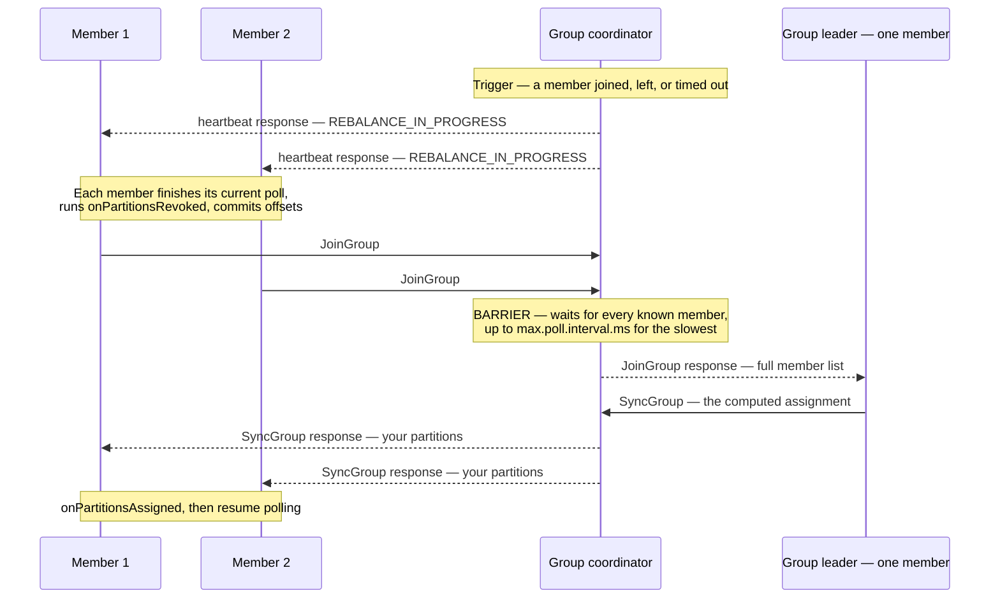

# Consumer Groups and Rebalance Failures

More production Kafka time is spent on rebalances than on every other failure class combined,
and most of that time is spent on two settings whose names suggest they do the same thing and do
not. This doc builds the rebalance protocol first, because the failures are unintelligible
without it, then works through thirteen ways consumer groups go wrong.

## The rebalance protocol, step by step

A **consumer group** is a set of members sharing a `group.id`. One broker — the one leading the
`__consumer_offsets` partition that the group id hashes to — acts as the group's **coordinator**.
The coordinator tracks membership, stores committed offsets, and runs rebalances.

A **rebalance** recomputes which member owns which partition. It is triggered by:

- a member joining (a new pod, or a restarted one);
- a member leaving cleanly (`close()` sends a LeaveGroup request);
- a member failing to heartbeat within `session.timeout.ms`;
- a member failing to call `poll()` within `max.poll.interval.ms`;
- the subscribed topic's partition count changing;
- a new topic matching a subscription pattern appearing.

Here is the classic (pre-KIP-848) protocol, which is what you are running unless you are on
Kafka 4.0 and opted in:




Two properties of this diagram cause most of the pain.

**There is a barrier.** The coordinator will not proceed until every known member has sent
JoinGroup. A member busy inside a long `poll()` loop does not send JoinGroup until it returns.
So the whole group waits for the slowest member, bounded only by `max.poll.interval.ms` — five
minutes by default. One slow consumer stalls every other consumer in the group.

**The assignor is eager by default.** With an eager assignor, every member revokes **all** of its
partitions at step 2 and receives a fresh assignment at the end. For the entire duration, *no
partition in the group is being consumed by anybody*. This is often described as
"stop-the-world," which means exactly that: all processing in the group halts, not just
processing of the partitions that are moving.

⚠️ **The default assignment strategy is still eager.** `partition.assignment.strategy` defaults to
`[RangeAssignor, CooperativeStickyAssignor]`. That list looks like it enables cooperative
rebalancing, and it does not — the list is an upgrade path, and the group negotiates the *first*
strategy all members support, which is `RangeAssignor`. Many teams believe they are running
cooperative rebalancing and are not. `C-02` covers how to actually switch.

### The three timeouts, and the one that matters

This is the highest-value table in the doc. The settings sound interchangeable and detect
completely different failures.


| Setting                 | Default | Detects                                                           | Enforced by                      |
| ----------------------- | ------- | ----------------------------------------------------------------- | -------------------------------- |
| `session.timeout.ms`    | 45,000  | **The process died.** No heartbeat received.                      | A background heartbeat thread    |
| `heartbeat.interval.ms` | 3,000   | — (how often the background thread heartbeats)                    | Should be ≤ ⅓ of session timeout |
| `max.poll.interval.ms`  | 300,000 | **The process is alive but stopped consuming.** No `poll()` call. | The application thread           |


Since Kafka 0.10.1 (KIP-62), heartbeats are sent from a **background thread**, separate from your
processing loop. This decoupling is why the two timeouts exist: the heartbeat thread keeps saying
"I am alive" even while your application thread is stuck in a four-minute database call, so
`session.timeout.ms` cannot detect a wedged consumer. `max.poll.interval.ms` exists precisely to
catch that case — the consumer is alive but not making progress, so its partitions should go to
somebody else.

⚠️ The practical consequence: **raising** `session.timeout.ms` **does nothing for a slow consumer.**
People reach for it because the error message mentions the group, and the setting they actually
need is `max.poll.interval.ms` or `max.poll.records`. This mistake is so common that it is worth
checking first whenever someone reports "we tuned the timeout and it did not help."

### Where offsets live

Committed offsets go to `__consumer_offsets`, an ordinary compacted Kafka topic with 50
partitions by default. A group's offsets all live on one partition, chosen by
`abs(murmur2(group.id)) % 50`, and the broker leading that partition is the group's coordinator.

Two consequences worth holding on to. A group's coordinator moves when that partition's leader
moves, so a broker restart makes some groups briefly re-discover their coordinator. And
`offsets.topic.num.partitions` **cannot be changed after the topic exists** without re-mapping
every group to a different partition and losing their offsets — so it is a decision made once, at
cluster creation, and doc 08 (`S-07`) covers when 50 stops being enough.

---


## Failure catalogue


| Class                                  | The question it answers                        | Scenarios       |
| -------------------------------------- | ---------------------------------------------- | --------------- |
| **A. The group cannot stabilise**      | Why does it keep rebalancing?                  | `C-01` … `C-05` |
| **B. Offsets are wrong**               | The group is stable. Why is the data wrong?    | `C-06` … `C-10` |
| **C. The group looks fine and is not** | Everything is green. Why is nothing happening? | `C-11` … `C-13` |


---


## Class A — the group cannot stabilise


### C-01 · Rebalance storm from `max.poll.interval.ms`

**What you see.** Consumer lag climbing while consumer CPU is low. Logs full of:

```
Member consumer-fraud-scorer-3 sending LeaveGroup request due to consumer poll timeout has expired.
This means the time between subsequent calls to poll() was longer than the configured
max.poll.interval.ms, which typically implies that the poll loop is spending too much time
processing messages.
```

Rebalances every few minutes, indefinitely. Throughput approaches zero even though every pod is
running.

**Mechanism.** This is the single most common Kafka consumer incident, and Riverbend's
`fraud-scorer-group` is built to demonstrate it. Work through the arithmetic:

```
max.poll.records                = 500     (default)
third-party scoring API p99     = 1.4 s   per record, called serially
worst-case time to process one poll batch:
    500 records × 1.4 s         = 700 s   = 11 minutes 40 seconds
max.poll.interval.ms            = 300 s   = 5 minutes
```

The consumer needs almost twelve minutes to process what one `poll()` returned, and the
coordinator evicts it after five. **The group cannot work under load.** Not "might struggle" —
cannot, as a matter of arithmetic, and the configuration guarantees it.

Then it gets worse, because the failure is self-amplifying:

1. Member 3 is evicted. Its 4 partitions are redistributed across the remaining 5 members.
2. Those members now own 4.8 partitions each instead of 4. More partitions means more records
  available per poll, so batches get *fuller* and processing gets *slower*.
3. The next member exceeds the interval and is evicted. Four members now hold 6 partitions each.
4. Meanwhile, member 3 finishes its batch, tries to commit, gets `CommitFailedException`
  (`C-08`), rejoins, and triggers another rebalance.

The group converges on a state where it spends more time rebalancing than consuming. This is a
**rebalance storm**, and left alone it does not recover, because the condition that causes
eviction gets stronger with every eviction.

**Confirm it.**

```bash
# Is the group ever stable? Repeat this a few times.
kafka-consumer-groups.sh --bootstrap-server $BS --describe --group fraud-scorer-group --state
# STATE: PreparingRebalance or CompletingRebalance on repeated checks = storm
```

```promql
# Rebalance rate. Anything sustained above roughly one per hour deserves investigation.
rate(kafka_consumer_coordinator_rebalance_total[5m]) * 3600

# Time between polls, from the client. Compare against max.poll.interval.ms.
kafka_consumer_coordinator_last_poll_seconds_ago
kafka_consumer_fetch_manager_records_lag_max
```

**Recover.** Immediately, reduce the work per poll. This is a client configuration change and
needs a restart, but it is the only thing that stops the storm:

```
max.poll.records = 50
```

Re-derive with the new value: `50 × 1.4 s = 70 s`, comfortably inside the 300 s interval, with
more than 4× headroom for the third-party API degrading. The general rule:

> `max.poll.records × worst-case-per-record-time` should be **under half** of
> `max.poll.interval.ms`.

Half, not just under, because the worst case you measured is not the worst case that exists.

**Prevent.** In order of preference:

1. **Right-size** `max.poll.records` from the arithmetic above. It costs nothing and it is the
  fix that works.
2. **Raise** `max.poll.interval.ms` only if the per-record time is genuinely irreducible. The
  cost is that a genuinely stuck consumer now holds its partitions for that much longer, so you
   are trading detection time for tolerance.
3. **Decouple processing from polling.** Hand records to a bounded internal worker pool and keep
  polling; pause partitions when the pool is full. This is the right architecture for
   `fraud-scorer-group`, and doc 06 (`L-06`) covers it — including the offset-tracking that makes
   it safe, which is the part people get wrong.
4. **Alert on** `rebalance_total`**,** not only on lag. A storm shows up in rebalance rate ten
  minutes before it shows up as lag anyone notices.


### C-02 · A rolling restart that costs 80 rebalances

**What you see.** Deploying `clickstream-rollup-group` (40 pods) produces a long window of
near-zero throughput and a lag spike that takes an hour to drain.

**Mechanism.** With an eager assignor, every membership change stops the entire group. A rolling
deployment of 40 pods produces **two** membership changes per pod — one when it leaves, one when
it rejoins — so **80 rebalances**, each one stopping all 40 members.

Put numbers on it. A well-behaved eager rebalance for a 40-member group takes roughly 3 seconds
if every member responds promptly:

```
80 rebalances × 3 s = 240 s = 4 minutes of total stop-the-world
```

That is the good case. The bad case is when a member is mid-batch when the rebalance is
signalled, so the coordinator waits for it:

```
80 rebalances × 30 s average wait = 2,400 s = 40 minutes
```

And `clickstream.events` arrives at 34,000 records/s regardless, so 40 minutes of stalled
consumption is `34,000 × 2,400 = 81.6 million records` of lag to drain afterwards — which, at
whatever surplus capacity the group has, takes considerably longer than the deployment did.

**Recover and prevent.** Two independent mechanisms, and you want both.

**First, switch to cooperative rebalancing.** `CooperativeStickyAssignor` performs incremental
rebalances: members keep the partitions that are not moving and only the reassigned ones are
revoked. A pod restart then stops consumption on roughly `200 ÷ 40 = 5` partitions instead of all
200.

⚠️ Switching requires a **two-phase rolling upgrade** and cannot be done in one step, because
members must agree on a strategy and a mixed group falls back to the common one:

```
Phase 1 — deploy with both, in this order. The group still uses RangeAssignor.
    partition.assignment.strategy = org.apache.kafka.clients.consumer.RangeAssignor,\
                                    org.apache.kafka.clients.consumer.CooperativeStickyAssignor

Phase 2 — only after every member is on phase 1, deploy with only the cooperative one.
    partition.assignment.strategy = org.apache.kafka.clients.consumer.CooperativeStickyAssignor
```

Doing it in one step makes members unable to agree, and the group will not form.

**Second, use static membership** so a restart does not trigger a rebalance at all. Give each
member a stable `group.instance.id` and make `session.timeout.ms` longer than a pod restart
takes:

```
group.instance.id  = clickstream-rollup-7     # from the StatefulSet ordinal, stable across restarts
session.timeout.ms = 120000                   # longer than a pod restart, shorter than your patience
```

A member that leaves and returns with the same `group.instance.id` inside the session timeout
reclaims its previous assignment with **no rebalance**. A 40-pod rolling restart then costs zero
rebalances instead of eighty.

⚠️ The trade: a member that genuinely dies is not detected for `session.timeout.ms`, so its
partitions are unconsumed for two minutes rather than 45 seconds. For a rollup job that is
obviously correct. For a latency-sensitive consumer it is a real cost, and 120 s may be too long.

⚠️ Static membership requires **genuinely stable and unique** identities. A Deployment with random
pod names cannot provide them — use a StatefulSet, or derive the id from a stable source. Two
members with the same `group.instance.id` is `C-04`.

### C-03 · One slow member stalls the whole group

**What you see.** Every member of the group idle for minutes during a rebalance. Logs on 39 pods
say nothing interesting. The 40th is busy.

**Mechanism.** The barrier in the protocol diagram. The coordinator collects JoinGroup requests
from every known member before computing an assignment, and a member cannot send JoinGroup until
it returns from `poll()` and runs its revocation callback. So the group's rebalance time is the
*maximum* over members, not the average.

Two things commonly make one member slow to rejoin:

- **A long processing batch** — the `C-01` arithmetic, but not yet long enough to trigger
eviction. A member that takes 90 seconds per batch adds 90 seconds to every rebalance the group
performs, whoever triggered it.
- **A slow** `onPartitionsRevoked` **callback.** This runs before JoinGroup, and it typically commits
offsets and flushes state. If it flushes a large in-memory aggregate to a database, that
flush is on the critical path of every other member's rebalance.

**Confirm it.** Compare `rebalance_latency_avg` across members; the one with a much larger value
is the one everyone is waiting for.

```promql
max(kafka_consumer_coordinator_rebalance_latency_avg) by (pod)
```

**Prevent.** Keep `max.poll.records` low enough that a batch is seconds rather than minutes
(`C-01`), and keep revocation callbacks fast — commit offsets there, do not do bulk work. If a
member must flush significant state on revocation, cooperative rebalancing limits the damage,
because only members that are actually losing partitions run the callback.

### C-04 · Duplicate `group.instance.id` — the member that fences itself

**What you see.** After enabling static membership, one pod repeatedly fails with
`FencedInstanceIdException` and crash-loops. Or two pods alternate, each fencing the other.

**Mechanism.** Static membership assumes `group.instance.id` is unique. When a second member
joins with an id that is already present, the coordinator treats the newcomer as the legitimate
owner of that identity and **fences the incumbent**, which then fails permanently — it cannot
rejoin, because rejoining would fence the new one.

The usual causes: the id derived from a value that is not unique (a Deployment's
`metadata.generateName` prefix, a hostname that repeats across zones), or a blue/green deployment
running both versions with the same ids, or a StatefulSet pod that was replaced while the old one
was still terminating.

**Confirm it.**

```bash
kafka-consumer-groups.sh --bootstrap-server $BS --describe --group clickstream-rollup-group \
  --members --verbose
# Look for two rows with the same GROUP-INSTANCE-ID, or a member count below the pod count
```

**Prevent.** Derive `group.instance.id` from a StatefulSet ordinal or another genuinely unique
and stable source, and make deployments that run two generations simultaneously use distinct id
prefixes. ⚠️ Do not enable static membership on a Deployment with generated pod names — the
identity is not stable, so you get the costs of static membership with none of the benefit.

### C-05 · A rebalance triggered by someone else's new topic

**What you see.** `search-indexer-group` rebalances for no local reason, at the same moment an
unrelated team creates a topic.

**Mechanism.** A consumer subscribed by **pattern** — `subscribe(Pattern.compile("catalog\\..*"))`
— re-evaluates its subscription every `metadata.max.age.ms` (5 minutes). Any new topic matching
the pattern joins the subscription and changes the assignment, which is a rebalance. A
too-broad pattern makes your group's stability depend on every topic creation in the cluster.

This also produces a subtler failure: your consumer suddenly starts receiving records in a format
it has never seen, from a topic it was never designed to read, because the name happened to match.

**Prevent.** Subscribe to explicit topic lists wherever the set is known. If a pattern is genuinely
needed, anchor it tightly (`^catalog\.(changes|snapshots)$` rather than `catalog.*`) and treat
"what topics does this pattern match today" as something to assert in a test.

---


## Class B — offsets are wrong


### C-06 and C-07 · `enable.auto.commit`, which loses records *and* duplicates them

**What you see.** Records that were never processed but whose offsets were committed (loss), or
records processed twice after a crash (duplicates). Both, from the same setting, depending on
timing.

**Mechanism.** `enable.auto.commit=true` is the **default**, with `auto.commit.interval.ms=5000`.
The commit does not happen on a timer thread; it happens **inside** `poll()`, and it commits the
position *after the last record the previous* `poll()` *returned*.

Trace it for a loss:

1. `poll()` returns records at offsets 1,000–1,499.
2. Your loop processes 1,000 through 1,199 and writes them to `orders-db`.
3. Five seconds have elapsed, so your code calls `poll()` again. **`poll()` first commits offset
  1,500** — because that is the position after the batch it handed you.
4. The pod is evicted before processing 1,200–1,499.
5. The replacement member starts at 1,500. **Three hundred orders were never processed and never
  will be.**

And for a duplicate: process all 500, crash before the next `poll()`, and the committed offset is
still 1,000, so all 500 are reprocessed.

⚠️ The important observation is that auto-commit does not implement at-least-once *or*
at-most-once. It implements neither, deterministically — you get whichever the timing produces.
Anything that requires a guarantee needs manual commits.

**Recover and prevent.** Turn it off and commit after processing:

```java
props.put("enable.auto.commit", "false");

while (running) {
    ConsumerRecords<String, byte[]> records = consumer.poll(Duration.ofMillis(500));
    for (var record : records) {
        process(record);              // must be idempotent — see doc 05
    }
    consumer.commitSync();            // only now; every returned record is done
}
```

`commitSync()` blocks and retries on retriable errors, which is what you want at the end of a
batch. `commitAsync()` is appropriate for intermediate commits inside a long batch, and the
common pattern is async during the loop plus a final `commitSync()` in a `finally` block so
shutdown does not leave the last batch uncommitted.

⚠️ Committing after processing gives **at-least-once**: a crash between processing and commit
reprocesses the batch. That is the correct trade, and it makes idempotent processing mandatory
rather than optional. Doc 05 is about that.

### C-08 · `CommitFailedException` after the group moved on

**What you see.**

```
CommitFailedException: Offset commit cannot be completed since the consumer is not part of an
active group for auto partition assignment; it is likely that the consumer was kicked out of the
group.
```

**Mechanism.** Between your `poll()` and your `commitSync()`, the group rebalanced and your member
was removed — almost always because processing exceeded `max.poll.interval.ms` (`C-01`). The
coordinator has advanced the group's generation, and a commit carrying the old generation is
rejected.

This is Kafka protecting you: your partitions already belong to someone else, and accepting your
commit would overwrite offsets the new owner is managing.

⚠️ The dangerous part is what happens next in most code. The exception is thrown, the loop catches
it, logs it, and continues — but the records you already processed are now **also** being
processed by the new owner. You have duplicates, and if your processing is not idempotent, you
have double-written them.

**Confirm it.** Correlate the exception with a rebalance in the coordinator's log and with
`last_poll_seconds_ago` exceeding `max.poll.interval.ms` just before.

**Recover and prevent.** Fix the underlying `C-01`. Additionally:

- Implement `ConsumerRebalanceListener.onPartitionsRevoked` to commit before giving up partitions,
so an orderly rebalance does not lose progress.
- ⚠️ Also implement `onPartitionsLost` separately. It is called when the member was fenced and
can no longer commit, and its default implementation delegates to `onPartitionsRevoked` — so a
revocation handler that commits will throw again from inside the handler. `onPartitionsLost`
should discard in-flight work, not commit it.
- Make processing idempotent so the overlap is harmless. That is the only defence that works
under all timings.


### C-09 · Offsets expired while the group was idle

**What you see.** A consumer group restarted after a quiet period — a weekend, a long outage, a
seasonal job — and began reading from the wrong place. Either it reprocessed everything
(`auto.offset.reset=earliest`) or it skipped everything that accumulated
(`auto.offset.reset=latest`).

**Mechanism.** Committed offsets are not kept forever. `offsets.retention.minutes` defaults to
**10,080 minutes (7 days)**, and when it elapses the group's offsets are deleted.

The exact trigger changed in a way worth knowing, because the old behaviour is why this has a bad
reputation. Before Kafka 2.1 the timer ran from the *last commit*, so a group actively consuming
a low-traffic partition could have that partition's offset expire underneath it. Since Kafka 2.1
(KIP-211) the timer starts only when the group becomes **empty** — no members. That is a large
improvement and it means the remaining exposure is specifically: *a group with no members for
longer than the retention*.

Which still happens regularly — a consumer scaled to zero over a holiday, a service disabled
during an incident and re-enabled nine days later, a seasonal pipeline that runs quarterly.

**Confirm it.** Before restarting a long-idle consumer, check whether its offsets still exist:

```bash
kafka-consumer-groups.sh --bootstrap-server $BS --describe --group settlement-group
# "Consumer group 'settlement-group' has no active members" plus CURRENT-OFFSET values = offsets survive
# No rows at all = offsets are gone
```

**Recover.** If the offsets are gone and you know roughly where the group should be, reset by
time rather than guessing:

```bash
kafka-consumer-groups.sh --bootstrap-server $BS --group settlement-group \
  --reset-offsets --to-datetime 2026-09-12T00:00:00.000 --topic payments.settled --dry-run
# Inspect the output, then re-run with --execute (the group must have no active members)
```

**Prevent.** Raise `offsets.retention.minutes` for clusters with intentionally intermittent
consumers, and — more useful — alert on any group that has been empty for more than half the
retention period. That alert catches the problem while it is still a ticket.

### C-10 · `auto.offset.reset=latest` silently skipping data

**What you see.** A gap in processed data that nobody can explain, starting exactly at an
incident boundary.

**Mechanism.** `auto.offset.reset` decides what a consumer does when it has **no valid committed
offset** — either none at all (a new group) or one that is out of range. It has three values and
both common ones fail badly in one direction:


| Value                  | On an invalid offset                  | Failure mode                                                                                 |
| ---------------------- | ------------------------------------- | -------------------------------------------------------------------------------------------- |
| `latest` (**default**) | Jump to the end                       | **Silently skips** everything between the lost offset and now                                |
| `earliest`             | Jump to the start of retention        | **Silently reprocesses** everything retained — for `clickstream.events`, 2.9 billion records |
| `none`                 | Throw `NoOffsetForPartitionException` | The consumer fails to start, and a human decides                                             |


Three situations produce an invalid offset, and all three are incident-adjacent: retention
deleted the data the offset pointed at while the consumer was down (doc 07, `T-01`); an unclean
leader election truncated the log below the committed offset (doc 02, `R-07`); or offsets expired
(`C-09`).

So the default behaviour is: *at the exact moment something went wrong, silently skip whatever
was missed and carry on as though nothing happened.* For `order-processor`, that means orders
that are in `orders.created` and never reach `orders-db`, discovered at month-end reconciliation.

**Prevent.** For any consumer where a gap matters, set `auto.offset.reset=none` and handle
`NoOffsetForPartitionException` by failing to start. A consumer that refuses to start is a page.
A consumer that silently skips six hours of orders is a finance incident three weeks later, and
the first is much cheaper.

For a brand-new group, `none` means you must explicitly seek before the first poll — which is
correct, because "where should a new consumer start" is a decision, not a default.

Riverbend's settings, as an illustration of choosing per consumer:


| Group                      | `auto.offset.reset` | Reasoning                                                                          |
| -------------------------- | ------------------- | ---------------------------------------------------------------------------------- |
| `order-processor-group`    | `none`              | A gap is a lost order. Fail loudly.                                                |
| `settlement-group`         | `none`              | Money.                                                                             |
| `search-indexer-group`     | `earliest`          | The index is rebuildable, and reprocessing a compacted topic is cheap and correct. |
| `clickstream-rollup-group` | `latest`            | Reprocessing 2.9 billion events to recover a gap costs more than the gap.          |


---


## Class C — the group looks fine and is not


### C-11 · More consumers than partitions

**What you see.** Someone scaled the deployment from 12 to 30 pods and throughput did not change.
Eighteen pods are running, healthy, and consuming nothing.

**Mechanism.** A partition is assigned to exactly one member. With 24 partitions and 30 members,
6 members get one partition each... no — 24 members get one partition each and **6 sit idle**.
There is no work-stealing and no partial assignment. Partition count is a hard ceiling on
consumer parallelism.

This is the most common reason scaling a consumer does nothing, and the second most common is
`P-10` (key skew), where scaling does nothing because one partition has all the work.

**Confirm it.**

```bash
kafka-consumer-groups.sh --bootstrap-server $BS --describe --group order-processor-group --members
# Members with 0 partitions are idle
```

**Recover.** Add partitions — but read doc 05 (`D-07`) first, because **adding partitions to a
keyed topic changes which partition each key maps to and breaks per-key ordering for records
either side of the change.** For `orders.created` that is a serious operation. For an unkeyed
topic it is routine.

**Prevent.** Choose partition count from the parallelism you expect to need *at the end of the
topic's life*, not the beginning. Doc 08 (`S-02`) gives the sizing method; the summary is that
over-provisioning partitions is cheap up to a point and adding them later is expensive for keyed
topics.

### C-12 · The `__consumer_offsets` topic as a failure source

**What you see.** Offset commits timing out across many unrelated groups. Consumers unable to find
their coordinator. Groups stuck in `PreparingRebalance` with no obvious cause.

**Mechanism.** `__consumer_offsets` is a real topic with real failure modes, and because every
group depends on it, its failures are cluster-wide:

- **Its partitions can be under-replicated or offline** like any other. A group whose coordinator
partition is offline cannot commit or rebalance at all, while groups on other partitions are
unaffected — which produces the confusing symptom of "some groups are broken."
- **It is compacted, so it depends on the log cleaner.** If the cleaner dies (doc 07, `T-08`),
`__consumer_offsets` grows without bound. On a cluster with many groups committing frequently
this is the fastest-growing topic you have, and it will fill disks.
- `offsets.topic.replication.factor` is applied when the topic is auto-created on first use.
⚠️ If the cluster had fewer brokers than the configured factor at that moment — a common state
during initial provisioning — creation fails or produces a lower factor that persists forever.
A cluster whose `__consumer_offsets` has RF=1 loses every group's offsets when one broker dies.

**Confirm it.**

```bash
kafka-topics.sh --bootstrap-server $BS --describe --topic __consumer_offsets \
  | head -3
# Check ReplicationFactor and look for under-replicated partitions in the per-partition rows
```

**Prevent.** Include `__consumer_offsets` in under-replication alerting rather than filtering out
internal topics — a very common monitoring mistake. Verify its replication factor on every new
cluster as a provisioning step. Monitor log-cleaner health (doc 07).

### C-13 · The zombie consumer that keeps working after revocation

**What you see.** Duplicate processing with no rebalance errors. Two pods writing the same records
to `orders-db` at the same time.

**Mechanism.** A rebalance moved partition 7 from member A to member B. Member B starts consuming
from the last committed offset. Member A, meanwhile, is still inside a long `process()` call for
records it fetched before the revocation, and it does not know it no longer owns the partition —
it will not find out until it next calls `poll()`.

For the duration, **two members are processing the same records**. Kafka does not prevent this,
and it cannot: the ++***broker has no way to interrupt your application thread.***++

This is why "exactly-once" is not achievable by consumer configuration alone. The consumer
protocol guarantees exclusive *assignment*, not exclusive *execution*.

**Prevent.** There are only two real defences and you should use both:

1. **Idempotent processing**, keyed on something stable — `(topic, partition, offset)` or a
  business identifier — so a concurrent duplicate is harmless. This is the general answer and
   doc 05 covers it in detail.
2. **Fencing at the destination.** If the write target supports conditional writes, carry the
  rebalance generation or a monotonic token and reject writes from a stale one. Kafka
   transactions do exactly this for Kafka-to-Kafka pipelines (doc 05, `D-03`); for
   Kafka-to-database you implement it yourself, usually as a version column.

Shortening processing time reduces the window but never closes it. Treat the overlap as
permanent and design for it.

---


## What is changing: KIP-848

Kafka 4.0 makes the **new consumer group protocol** generally available (it is available for
early evaluation in 3.7, which is what Riverbend runs). It is worth knowing about because it
removes the structural cause of several failures above rather than mitigating them.

The change is that **assignment moves from the group leader to the broker-side coordinator**, and
the global synchronisation barrier disappears. Members are told their new assignment
incrementally through their ordinary heartbeats, and they acknowledge when they have acted on it.

What that fixes:

- **No barrier**, so `C-03` — one slow member stalling the group — largely goes away.
- **Rebalances are incremental by default**, so the eager/cooperative migration dance in `C-02` is
unnecessary.
- `session.timeout.ms` **and the assignment strategy move to the broker**, so a fleet cannot
disagree about them.
- `max.poll.interval.ms` still exists and still evicts slow consumers, so `C-01` **does not go
away** — the arithmetic in that scenario is unchanged and you still need to do it.

Adopting it is a client-side opt-in (`group.protocol=consumer`) and requires client libraries
built for it. Plan it as a deliberate migration once you are on 4.0, and do not expect it to
rescue a consumer that is too slow — that remains your problem.

---


## What to take away

1. **Two timeouts, two different failures.** `session.timeout.ms` detects a dead process;
  `max.poll.interval.ms` detects a live process that stopped consuming. Raising the first does
   nothing for a slow consumer, and reaching for it is the most common wrong move.
2. **Do the** `max.poll.records` **arithmetic.** `max.poll.records × worst-case-per-record` must be
  under half of `max.poll.interval.ms`. For `fraud-scorer-group` the default configuration
   guaranteed eviction, by a factor of two.
3. **Rebalance storms amplify themselves.** Every eviction gives the survivors more partitions,
  which makes the next eviction more likely. They do not self-recover.
4. **The default assignor is eager, despite the default list containing a cooperative one.**
  Switching is a two-phase rolling upgrade and cannot be done in a single deploy.
5. **Static membership makes a rolling restart cost zero rebalances** instead of two per pod. It
  requires genuinely stable identities — a StatefulSet, not a Deployment.
6. **Auto-commit implements neither at-least-once nor at-most-once.** It commits offsets for
  records you may not have processed, inside `poll()`. Turn it off and commit after processing.
7. `auto.offset.reset=latest` **silently skips data at the exact moment something went wrong.**
  For consumers where a gap matters, use `none` and fail to start.
8. **Partition count is a hard ceiling on consumer parallelism.** Extra members sit idle, and
  adding partitions to a keyed topic breaks per-key ordering.
9. **Assignment is exclusive; execution is not.** A revoked member keeps working until its next
  `poll()`, so two members can process the same records. Only idempotence and destination-side
   fencing close that.
10. `__consumer_offsets` **is a topic with all the failure modes of a topic,** and every group
  depends on it. Do not exclude internal topics from your monitoring.

Next: [05-delivery-semantics-and-ordering.md](05-delivery-semantics-and-ordering.md), which takes
the duplicates and reordering this doc kept deferring and asks what guarantees are actually
achievable.