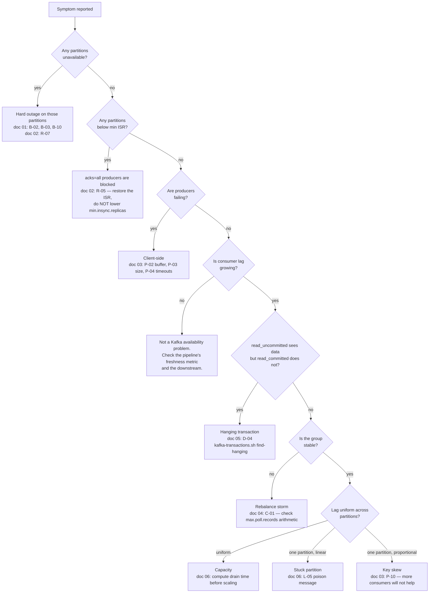

# Operating Playbook and Golden Configuration

The practical doc. Triage order for an incident, the commands worth having memorised, the
procedures that are easy to get wrong, and an annotated configuration you can copy — organised
into three tiers so that a low-stakes topic stays simple.

---

## Triage: the first five minutes

Work top to bottom and stop at the first branch that matches. The order is deliberate: it goes
from "someone's writes are failing right now" to "something is subtly wrong," and it puts the
cheapest discriminating check ahead of the expensive ones.



The three commands at the top of that tree, in order:

```bash
kafka-topics.sh --bootstrap-server $BS --describe --unavailable-partitions
kafka-topics.sh --bootstrap-server $BS --describe --under-min-isr-partitions
kafka-topics.sh --bootstrap-server $BS --describe --under-replicated-partitions
```

They are nested — every unavailable partition is also under-min-ISR, and every under-min-ISR
partition is also under-replicated — so the first one that returns rows is your severity.

And the cheapest discriminating check in the whole collection, worth running early on any
single-group lag problem, because it costs thirty seconds and eliminates the failure that
otherwise costs a day:

```bash
# Does the group see data when isolation is relaxed?
kafka-console-consumer.sh --bootstrap-server $BS --topic payments.settled \
  --partition 4 --offset <group's current offset> --max-messages 1 \
  --isolation-level read_uncommitted
# If this returns and the same command with read_committed hangs → hanging transaction.
```

---

## Command reference

Set `BS` once. Add `--command-config client.properties` to every command on an authenticated
cluster.

```bash
export BS=kafka-1.riverbend.internal:9092,kafka-2.riverbend.internal:9092
```

### Cluster and broker state

```bash
# Which brokers are alive, and what protocol versions do they speak?
kafka-broker-api-versions.sh --bootstrap-server $BS | grep "id:"

# KRaft controller quorum — leader, voters, and per-voter lag
kafka-metadata-quorum.sh --bootstrap-server $BS describe --status
kafka-metadata-quorum.sh --bootstrap-server $BS describe --replication

# Per-broker, per-log-dir sizes, and any log-dir errors
kafka-log-dirs.sh --bootstrap-server $BS --describe --broker-list 1,2,3,4,5,6 \
  | tail -1 | jq -r '.brokers[] | .broker as $b | .logDirs[]
      | [$b, .logDir, (.error // "ok"), ([.partitions[].size] | add)] | @tsv'

# The largest partitions on one broker — disk problems are usually skew problems
kafka-log-dirs.sh --bootstrap-server $BS --describe --broker-list 4 \
  | tail -1 | jq -r '.brokers[].logDirs[].partitions[] | [.partition, .size] | @tsv' \
  | sort -k2 -rn | head -20
```

### Topics

```bash
kafka-topics.sh --bootstrap-server $BS --describe --topic orders.created

# Effective configuration including inherited defaults — --all is the important flag
kafka-configs.sh --bootstrap-server $BS --describe --entity-type topics \
  --entity-name orders.created --all

# Change a topic config. Takes effect immediately, no restart.
kafka-configs.sh --bootstrap-server $BS --alter --entity-type topics \
  --entity-name orders.created --add-config min.insync.replicas=2

# Earliest and latest available offsets — the window a consumer can still reach
kafka-get-offsets.sh --bootstrap-server $BS --topic orders.created --time -2   # earliest
kafka-get-offsets.sh --bootstrap-server $BS --topic orders.created --time -1   # latest
```

### Consumer groups

```bash
kafka-consumer-groups.sh --bootstrap-server $BS --list
kafka-consumer-groups.sh --bootstrap-server $BS --describe --group order-processor-group
kafka-consumer-groups.sh --bootstrap-server $BS --describe --group order-processor-group --state
kafka-consumer-groups.sh --bootstrap-server $BS --describe --group order-processor-group \
  --members --verbose

# Reset offsets. The group must have NO active members. Always --dry-run first.
kafka-consumer-groups.sh --bootstrap-server $BS --group order-processor-group \
  --reset-offsets --topic orders.created --to-datetime 2026-09-18T14:00:00.000 --dry-run
kafka-consumer-groups.sh --bootstrap-server $BS --group order-processor-group \
  --reset-offsets --topic orders.created:7 --to-offset 8412902 --execute
```

⚠️ `--reset-offsets` silently does nothing if the group has active members, and prints what it
*would* have done. Read the output rather than assuming it worked.

### Transactions

```bash
kafka-transactions.sh --bootstrap-server $BS list
kafka-transactions.sh --bootstrap-server $BS describe --transactional-id payments-writer-3
kafka-transactions.sh --bootstrap-server $BS find-hanging --broker-id 3
kafka-transactions.sh --bootstrap-server $BS abort \
  --topic payments.settled --partition 4 --start-offset 4201338
```

### Reading records without disturbing anything

```bash
# A specific offset on a specific partition. No consumer group, no committed offsets.
kafka-console-consumer.sh --bootstrap-server $BS --topic orders.created \
  --partition 7 --offset 8412901 --max-messages 5 \
  --property print.key=true --property print.offset=true \
  --property print.timestamp=true --property print.headers=true
```

---

## Procedures

### Rolling restart

The gate is the procedure. Everything else is detail.

```bash
#!/usr/bin/env bash
set -euo pipefail

wait_for_isr() {
  for _ in $(seq 1 120); do          # 30 minutes maximum
    urp=$(kafka-topics.sh --bootstrap-server "$BS" --describe \
          --under-replicated-partitions | grep -c "Partition:" || true)
    if [ "$urp" -eq 0 ]; then echo "  ISR restored"; return 0; fi
    echo "  waiting: $urp under-replicated partitions"
    sleep 15
  done
  echo "ABORT: ISR not restored after 30 minutes" >&2
  return 1                            # abort the rollout; never proceed on timeout
}

wait_for_isr                          # do not start from a degraded cluster
for broker in 1 2 3 4 5 6; do
  echo "Restarting broker $broker"
  restart_broker "$broker"            # your orchestration
  wait_for_isr
done
```

Two things that make this work and are often missing: it **checks the ISR before starting**, so a
rollout does not begin on an already-degraded cluster, and it **aborts rather than proceeding**
on timeout. An automation that logs a warning and continues is how doc 01's `B-12` happens.

⚠️ If you run Kafka on Kubernetes, the readiness probe must check ISR membership rather than port
reachability. A probe that passes before the broker has rejoined the ISR gives the StatefulSet
controller permission to move on, and the gate above is bypassed entirely.

### Partition reassignment

```bash
# 1. Which topics are moving
cat > topics.json <<'EOF'
{"topics":[{"topic":"orders.created"},{"topic":"payments.settled"}],"version":1}
EOF

# 2. Generate a plan. This respects broker.rack, which is why it beats a hand-written one.
kafka-reassign-partitions.sh --bootstrap-server $BS \
  --topics-to-move-json-file topics.json \
  --broker-list "1,2,3,5,6" --generate > plan-raw.json

# 3. SAVE THE ROLLBACK. The "current partition replica assignment" block is your undo.
sed -n '/Current partition replica assignment/,/^$/p' plan-raw.json > rollback.json
sed -n '/Proposed partition reassignment/,$p' plan-raw.json | tail -n +2 > plan.json

# 4. Execute with a throttle, always. Unthrottled reassignment saturates the same
#    brokers that are already carrying the load.
kafka-reassign-partitions.sh --bootstrap-server $BS \
  --reassignment-json-file plan.json --execute --throttle 50000000    # 50 MB/s

# 5. Poll until complete. --verify is also what REMOVES the throttle.
kafka-reassign-partitions.sh --bootstrap-server $BS \
  --reassignment-json-file plan.json --verify
```

⚠️ Step 5 is not optional. If you never run `--verify`, the throttle configuration stays on the
brokers **permanently**, capping all replication at 50 MB/s. It is invisible unless you look for
it, and it is a frequent cause of "a broker rejoined and never caught up" (doc 02, `R-09`):

```bash
kafka-configs.sh --bootstrap-server $BS --describe --entity-type brokers --entity-name 1 \
  | grep -E "replication.throttled"
```

⚠️ Before executing, check the disk arithmetic. Moving a failed broker's partitions onto the
survivors adds its data to theirs, and doc 01 (`B-02`) shows Riverbend going from 78% to 93% full
by doing exactly that.

### Increasing a topic's replication factor

Replication factor cannot be changed with `kafka-configs.sh` — adding a replica means copying
data, so it is a reassignment:

```bash
cat > increase-rf.json <<'EOF'
{"version":1,"partitions":[
  {"topic":"orders.created.DLQ","partition":0,"replicas":[1,3,5]}
]}
EOF
kafka-reassign-partitions.sh --bootstrap-server $BS \
  --reassignment-json-file increase-rf.json --execute
```

Choose the broker ids so that replicas land in different racks. `--generate` does this for you
and is the safer route for anything larger than a single partition.

### Emergency: reclaiming disk

In order of preference, fastest first:

```bash
# 1. Cut retention on the largest topic. Reclaimed within one retention check (5 min).
kafka-configs.sh --bootstrap-server $BS --alter --entity-type topics \
  --entity-name clickstream.events --add-config retention.ms=43200000    # 12h

# 2. Verify it is actually shrinking before doing anything more invasive
watch -n 30 "kafka-log-dirs.sh --bootstrap-server $BS --describe --broker-list 4 \
  | tail -1 | jq '[.brokers[].logDirs[].partitions[].size] | add'"
```

⚠️ Never delete segment files by hand. The broker's in-memory index and its
`recovery-point-offset-checkpoint` do not know you did, and you will convert a disk-space incident
into a corrupt-log incident.

Remember to restore the retention afterwards, and to tell whoever depends on that topic's history
that twelve hours of it no longer exists.

---

## The three-tier model

Not every topic needs the full treatment. Forcing a strict configuration onto a
low-consequence topic produces either a pointless cost or — worse — a template that people
copy without understanding, which is how `min.insync.replicas=3` ends up on something that gets
restarted weekly.

Classify by **what one lost record costs**.

| | **Tier 1 — Critical** | **Tier 2 — Standard** | **Tier 3 — Bulk** |
|---|---|---|---|
| One lost record costs | Money, or an audit finding | A rebuild or a manual fix | Nothing measurable |
| Riverbend examples | `orders.created`, `payments.settled` | `inventory.adjustments`, `catalog.changes` | `clickstream.events` |
| `replication.factor` | 3 | 3 | 2 |
| `min.insync.replicas` | 2 | 2 | 1 |
| Producer `acks` | `all` | `all` | `1` |
| `enable.idempotence` | `true` | `true` | `true` (default) |
| `unclean.leader.election.enable` | `false` | `false` | **`true`** |
| Consumer `auto.offset.reset` | **`none`** | `earliest` | `latest` |
| Consumer `enable.auto.commit` | `false` | `false` | `false` |
| Dead-letter queue | Required, alerted at depth > 0 | Required | Optional |
| Source of truth outside Kafka | Required (outbox) | Recommended | No |
| Retention derived from | Max consumer outage × 2 | Max consumer outage | Cost |

The rows that differ are the interesting ones, and each encodes a decision:

**`unclean.leader.election.enable=true` on Tier 3** says: if every replica of a clickstream
partition is unavailable, resume collecting events and accept the gap rather than stop
collecting. That is right for telemetry and catastrophic for orders.

**`auto.offset.reset` differs across all three tiers.** `none` on Tier 1 means a consumer with an
invalid offset refuses to start and pages somebody, rather than silently skipping a gap or
silently reprocessing three days. `earliest` on Tier 2 is safe because those topics are compacted
and reprocessing is cheap and correct. `latest` on Tier 3 is right because reprocessing 2.9
billion events to recover a gap costs more than the gap.

**`acks=1` on Tier 3** loses a handful of records per leader election — about 425 at
`clickstream.events`' peak rate — which is genuinely irrelevant against 85,000 records a second,
and it halves produce latency.

---

## Golden configuration

### Broker

```properties
# ---- Identity and roles (KRaft) -------------------------------------------
node.id=4
process.roles=broker
controller.quorum.voters=101@ctrl-1:9093,102@ctrl-2:9093,103@ctrl-3:9093

# ---- Placement -------------------------------------------------------------
# Set this from day one. Rack awareness is NOT retroactive: topics created
# before it keep their original placement forever. (doc 01, B-11)
broker.rack=us-east-1a

# ---- Durability defaults for NEW topics ------------------------------------
# These do not change existing topics. Audit those separately. (doc 02, R-01)
default.replication.factor=3
min.insync.replicas=2
unclean.leader.election.enable=false

# ---- Governance ------------------------------------------------------------
# The single highest-value setting on a platform cluster: a typo in a topic
# name otherwise creates an RF=1 topic that silently accepts writes.
auto.create.topics.enable=false
# Force partition count to be a decision somebody made. (doc 08, S-03)
num.partitions=1
delete.topic.enable=true

# ---- Internal topics -------------------------------------------------------
# offsets.topic.num.partitions CANNOT be changed after the topic is created
# without losing every group's offsets. Decide it now. (doc 08, S-05)
offsets.topic.num.partitions=50
offsets.topic.replication.factor=3
transaction.state.log.replication.factor=3
transaction.state.log.min.isr=2
offsets.retention.minutes=43200        # 30 days; the 7-day default is tight for
                                       # intermittent consumers (doc 04, C-09)

# ---- Storage ---------------------------------------------------------------
log.dirs=/var/kafka-logs
log.retention.hours=168
log.retention.check.interval.ms=300000
log.segment.bytes=1073741824
# 8× faster recovery after an unclean shutdown, free at steady state. (B-04)
num.recovery.threads.per.data.dir=8

# ---- Replication -----------------------------------------------------------
# The default of 1 fetcher thread per peer is the usual reason a restarted
# broker never catches up. (doc 02, R-09)
num.replica.fetchers=4
replica.lag.time.max.ms=30000          # leave this alone; tightening it makes the
                                       # ISR brittle without improving durability

# ---- Threads ---------------------------------------------------------------
num.network.threads=8                  # raise with client count, not with bytes
num.io.threads=16                      # roughly the vCPU count

# ---- Reads -----------------------------------------------------------------
# Lets consumers fetch from a same-zone replica instead of the leader.
# Saves most cross-zone transfer cost. (doc 08, S-09)
replica.selector.class=org.apache.kafka.common.replica.RackAwareReplicaSelector

# ---- Compaction ------------------------------------------------------------
log.cleaner.enable=true
log.cleaner.threads=2
```

JVM: **6 GiB heap** with G1 and `-XX:MaxGCPauseMillis=20`. Kafka's working set lives in the page
cache, outside the JVM; a larger heap makes collections longer and steals memory from the cache,
so you pay twice (doc 01, `B-07`). `nofile` limit at 100,000 or more (`B-08`).

### Topic — Tier 1

```bash
kafka-topics.sh --bootstrap-server $BS --create \
  --topic orders.created \
  --partitions 96 \
  --replication-factor 3 \
  --config min.insync.replicas=2 \
  --config unclean.leader.election.enable=false \
  --config retention.ms=259200000 \
  --config compression.type=producer \
  --config message.timestamp.type=CreateTime \
  --config message.timestamp.before.max.ms=3600000 \
  --config message.timestamp.after.max.ms=3600000
```

96 partitions rather than 24: sized from peak throughput ÷ per-consumer throughput, doubled for
growth and multiplied by 1.5 for skew, then rounded to a number with many divisors (doc 08,
`S-02`). Increasing it later is a data migration, so the headroom is bought now.

`compression.type=producer` stores what the producer sent, so the broker never decompresses and
recompresses.

The timestamp bounds reject records whose clock is more than an hour off, which catches the
backfill-deletes-itself failure loudly instead of silently (doc 07, `T-03`).

### Topic — Tier 3

```bash
kafka-topics.sh --bootstrap-server $BS --create \
  --topic clickstream.events \
  --partitions 600 \
  --replication-factor 2 \
  --config min.insync.replicas=1 \
  --config unclean.leader.election.enable=true \
  --config retention.ms=86400000 \
  --config retention.bytes=18790481920 \
  --config compression.type=producer
```

`retention.bytes` computed **per partition** from the cluster budget, not typed as a round
number (doc 07, `T-04`): 7,000 GB across the cluster ÷ RF 2 ÷ 600 partitions ≈ 5.8 GB each — the
value above is sized for the year-1 200-partition layout and would be recomputed on any partition
change. That recomputation belongs in the partition-change procedure, because nobody remembers it
otherwise.

### Topic — compacted

```bash
kafka-topics.sh --bootstrap-server $BS --create \
  --topic inventory.adjustments \
  --partitions 48 --replication-factor 3 \
  --config min.insync.replicas=2 \
  --config cleanup.policy=compact \
  --config min.cleanable.dirty.ratio=0.2 \
  --config max.compaction.lag.ms=3600000 \
  --config delete.retention.ms=604800000
```

`max.compaction.lag.ms` forces compaction within an hour regardless of the dirty ratio, which is
what turns compaction from a storage optimisation into a **deletion guarantee** you can state
(doc 07, `T-07`).

`delete.retention.ms=604800000` (7 days) rather than the 24-hour default: a consumer that takes
longer than this to read the whole topic can miss a tombstone entirely and keep a deleted key
forever. Seven days costs almost nothing and removes the bug class (doc 07, `T-08`).

### Producer — Tier 1

```properties
# Durability. On Kafka 3.0+ idempotence is the default and forces acks=all —
# the exposure is code that explicitly sets acks=1. (doc 02, R-02)
enable.idempotence=true
acks=all

# Bound the caller's wait, not the retry count. `retries` defaults to
# effectively infinite; delivery.timeout.ms is the real control. (doc 03, P-04)
delivery.timeout.ms=1500          # checkout-api serves a 2 s mobile client
request.timeout.ms=1000
max.block.ms=250                  # never park a request thread for 60 s (P-02)

# Throughput, without touching durability
linger.ms=10
batch.size=65536
compression.type=lz4
```

With `max.block.ms=250` the application **must** have a fallback — the outbox table, or shedding
the request. A producer that can fail fast and a caller that cannot handle the failure is not an
improvement.

### Consumer — Tier 1

```properties
group.id=order-processor-group

# Commit after processing, never inside poll(). (doc 04, C-06)
enable.auto.commit=false

# An invalid offset is a decision, not a default. Fail to start and page. (C-10)
auto.offset.reset=none

# Derive from: max.poll.records × worst-case-per-record < 0.5 × max.poll.interval.ms
max.poll.records=100
max.poll.interval.ms=300000
session.timeout.ms=45000
heartbeat.interval.ms=3000

# Incremental rebalances. Migrating to this from the eager default is a
# TWO-PHASE rolling upgrade — see doc 04, C-02.
partition.assignment.strategy=org.apache.kafka.clients.consumer.CooperativeStickyAssignor

# Zero rebalances on a rolling restart. Requires a genuinely stable, unique id —
# a StatefulSet ordinal, not a Deployment's generated pod name. (C-04)
group.instance.id=order-processor-3

# Fetch from a same-zone replica. (doc 08, S-09)
client.rack=us-east-1a

isolation.level=read_committed
```

---

## Platform enforcement

Configuration that depends on people remembering is configuration that drifts. Four checks, in
increasing order of how much they are worth:

**1. A weekly durability audit, failing a build.** The single highest-value automation in this
collection, because it finds the latent conditions from doc 11's case studies:

```bash
#!/usr/bin/env bash
fail=0
for t in $(kafka-topics.sh --bootstrap-server "$BS" --list | grep -v '^__'); do
  rf=$(kafka-topics.sh --bootstrap-server "$BS" --describe --topic "$t" \
       | awk '/ReplicationFactor/ {for(i=1;i<=NF;i++) if($i=="ReplicationFactor:") print $(i+1)}' | head -1)
  misr=$(kafka-configs.sh --bootstrap-server "$BS" --describe --entity-type topics \
         --entity-name "$t" --all 2>/dev/null \
         | grep -o 'min.insync.replicas=[0-9]*' | head -1 | cut -d= -f2)
  if [ "${rf:-1}" -lt 2 ] || [ "${misr:-1}" -lt 2 ]; then
    echo "EXPOSED  $t  RF=${rf:-?}  min.insync.replicas=${misr:-unset}"
    fail=1
  fi
done
exit $fail
```

Exempt Tier 3 topics by an explicit allow-list, so that a deliberate exception is visible and a
forgotten one is not.

**2. A rack-spread audit.** For each partition, check that its replica set contains no rack
twice. Catches doc 01's `B-11` — placement that predates `broker.rack` — which is invisible until
a zone event.

**3. Topic creation as code.** Declarative topic definitions in a repository, applied by CI, with
`auto.create.topics.enable=false` on the cluster. Required fields: owner, tier, retention
rationale, key semantics, ordering contract. The rationale fields matter as much as the values,
because doc 07's retention question and doc 05's ordering question are both unanswerable a year
later without them.

**4. Default client quotas.** Set at the cluster level so a new client is throttled unless it
negotiates otherwise (doc 08, `S-11`; doc 11, CS-4):

```bash
kafka-configs.sh --bootstrap-server $BS --alter \
  --add-config 'consumer_byte_rate=52428800,producer_byte_rate=52428800,request_percentage=200' \
  --entity-type clients --entity-default
```

---

## The one-page summary

If you keep one page from this collection, this is it.

**Durability.** `min.insync.replicas = replication.factor − 1`, and `acks=all` on every producer.
Acknowledged data survives `M − 1` failures; writes continue through `N − M`.

**Governance.** `auto.create.topics.enable=false`, `num.partitions=1`, topics created through
review.

**Consumers.** `enable.auto.commit=false`. `auto.offset.reset=none` where a gap matters.
`max.poll.records × worst-case-per-record < 0.5 × max.poll.interval.ms`.

**Ordering.** One key per entity, in every code path. Fixed partition count. Retry in place, or
give up ordering and use version-conditional writes instead.

**Duplicates.** Guaranteed, including with transactions, because operators replay topics. Make
processing idempotent; size the dedup TTL from your largest plausible replay.

**Operations.** Gate every rolling restart on `UnderReplicatedPartitions == 0`, and abort rather
than proceed. Always `--verify` a reassignment, which is what removes the throttle.

**Observability.** Instrument the pipeline before the cluster: end-to-end freshness in seconds.
Add the log-cleaner metrics and broker disk read throughput; almost nobody has them, and they
catch the two worst silent failures.

**Scale.** Metadata grows faster than bytes. Rebalance cost converges on the worst case past
about fifty members in a group. `client.rack` pays for itself the moment consumer egress reaches
a few hundred megabytes per second.

**Culture.** Prefer loud failures to silent ones. A wedged partition pages someone tonight; a
dropped record is found at reconciliation in three weeks, and the second is far more expensive.
