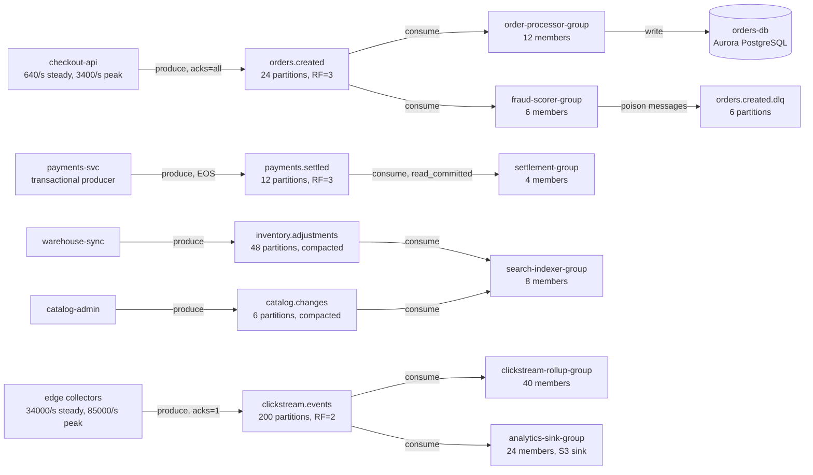

# Kafka Failure Modes — What Breaks, Why, and What Changes at Scale

A staff-level collection on operating Apache Kafka in production: the ways it fails, the
mechanism behind each failure, how to detect and recover from it, and — the part most Kafka
material skips — **how the same failure behaves differently when the cluster is ten times
bigger**. It is broken into numbered docs by **aspect** — brokers and storage, replication and
durability, producers, consumers and rebalances, delivery semantics, lag, retention, scale,
multi-cluster, observability — so each doc can be read on its own and linked to from a review
comment, a postmortem, or a runbook.

The bias throughout: **Kafka does not fail loudly, it fails quietly and correctly.** Almost
every incident in this collection is a case where Kafka did exactly what it was configured to
do, and the configuration encoded a decision nobody remembers making. A broker that drops
acknowledged writes is not a bug; it is `min.insync.replicas=1` behaving as documented. A
consumer group that skips six hours of orders is not corruption; it is `auto.offset.reset=latest`
behaving as documented. So every failure here is explained by first showing the default, then
showing what the default costs you.

## Who this is for

You should read this if you can say yes to two or more of these:

- You run at least one Kafka topic where losing a single record would be a customer-visible or
  auditable event, and you cannot currently state — from configuration, not from memory — how
  many broker failures that topic survives.
- You have had a consumer group rebalance that took long enough for someone to notice, and the
  explanation stopped at "it rebalanced."
- Your cluster has grown by more than 3× since it was designed, and nobody has revisited
  partition counts, instance sizes, or the rolling-restart procedure since.
- You have ever seen consumer lag climb on a topic whose brokers all looked healthy, and the
  first twenty minutes of the investigation were spent deciding where to look.
- You are about to turn on exactly-once semantics, or have been asked whether you should.

If you run one topic with three partitions, one producer, one consumer group, and your data is
reconstructible from a database, you do not need this collection. Read doc 00 for the mental
model, set `acks=all` and `min.insync.replicas=2`, and stop there.

## Start here, in this order

1. **[00-kafka-mental-model-and-failure-taxonomy.md](00-kafka-mental-model-and-failure-taxonomy.md)**
   — start here even if you have run Kafka for years. It builds the vocabulary the rest of the
   collection assumes (log, partition, replica, ISR, high watermark, leader epoch, offset), and
   more importantly it sets out the *taxonomy*: the six places a record can be lost, duplicated,
   reordered, or stalled. Every later doc slots into that taxonomy.
2. **[02-replication-isr-and-durability.md](02-replication-isr-and-durability.md)** — the
   durability contract. If you read only one more doc, read this one, because the majority of
   real data-loss incidents trace back to a misunderstanding in it.
3. Then read in whatever order matches your problem. The docs cross-reference rather than
   assuming you read them in sequence.

If you are here because something is broken right now, start at the failure catalogues — docs
01 through 07 each contain one, with IDs you can cite — and at
**[13-operating-playbook-and-golden-config.md](13-operating-playbook-and-golden-config.md)** for
the commands. If you are here because you are planning capacity or a migration, start at
**[08-how-kafka-breaks-at-scale.md](08-how-kafka-breaks-at-scale.md)**.

## Topics

| Doc | Covers |
|-----|--------|
| [00-kafka-mental-model-and-failure-taxonomy.md](00-kafka-mental-model-and-failure-taxonomy.md) | The log, partitions, replicas, ISR, high watermark, leader epochs, offsets and the offset commit; KRaft vs ZooKeeper; the six-way failure taxonomy every later doc maps onto |
| [01-broker-storage-and-cluster-failures.md](01-broker-storage-and-cluster-failures.md) | `B-01…B-12`: broker loss, disk full, offline log directories, unclean shutdown and log recovery, controller and quorum failures, rolling restarts, rack awareness, network partitions |
| [02-replication-isr-and-durability.md](02-replication-isr-and-durability.md) | `R-01…R-10`: the `acks` / `min.insync.replicas` / RF interaction derived from first principles, ISR shrink and expand, unclean leader election, under-replicated vs under-min-ISR, log divergence and truncation |
| [03-producer-failure-modes.md](03-producer-failure-modes.md) | `P-01…P-11`: the idempotent producer, duplicate and reordering mechanics, `delivery.timeout.ms` versus `request.timeout.ms`, buffer exhaustion, partitioner skew, `OutOfOrderSequenceException` |
| [04-consumer-groups-and-rebalance-failures.md](04-consumer-groups-and-rebalance-failures.md) | `C-01…C-13`: the rebalance protocol step by step, rebalance storms, `max.poll.interval.ms`, eager vs cooperative assignors, static membership, KIP-848, offset commit failures, `__consumer_offsets` |
| [05-delivery-semantics-and-ordering.md](05-delivery-semantics-and-ordering.md) | `D-01…D-09`: at-most/at-least/exactly-once derived rather than asserted, transactions and the last stable offset, hanging transactions, the outbox pattern, every way ordering is silently lost |
| [06-lag-backpressure-and-poison-messages.md](06-lag-backpressure-and-poison-messages.md) | `L-01…L-10`: lag in records versus lag in time, head-of-line blocking, retry topics and dead-letter queues, parallel consumption patterns, the poison message, backpressure that actually propagates |
| [07-retention-compaction-and-schema.md](07-retention-compaction-and-schema.md) | `T-01…T-11`: retention versus lag races, segment rolling, log compaction mechanics, tombstone deletion races, the log cleaner dying, schema evolution breaking consumers |
| [08-how-kafka-breaks-at-scale.md](08-how-kafka-breaks-at-scale.md) | `S-01…S-12`: the scale doc. Riverbend at 6 brokers versus 18, with every breakpoint derived — partitions per broker, rebalance time, controlled shutdown, page cache residency, `__consumer_offsets` load, cross-AZ cost, connection counts |
| [09-multi-cluster-dr-and-migration.md](09-multi-cluster-dr-and-migration.md) | `M-01…M-08`: MirrorMaker 2, offset translation and why consumer failover is the hard part, active/passive versus active/active, stretch clusters, cluster migration without downtime, RPO and RTO you can defend |
| [10-observability-and-slos-for-kafka.md](10-observability-and-slos-for-kafka.md) | The metrics that matter and the ones that mislead, PromQL for each, an SLO for a streaming pipeline, and the alert set that catches the failures in docs 01–07 |
| [11-case-studies.md](11-case-studies.md) | `CS-1…CS-6`: six incidents at Riverbend, walked mechanism → signal → recovery → prevention, including two where the cluster was healthy the whole time |
| [12-staff-interview-questions.md](12-staff-interview-questions.md) | A staff-level question bank with full model answers and the follow-ups a strong answer invites |
| [13-operating-playbook-and-golden-config.md](13-operating-playbook-and-golden-config.md) | Triage order, the commands, partition reassignment, the annotated golden broker/topic/producer/consumer configuration, and a three-tier model so low-stakes topics stay simple |

## The running example used throughout

This collection extends **Riverbend**, the same online marketplace used in
[`K8s/cronJobs`](../K8s/cronJobs/README.md) and [`Observability`](../Observability/README.md).
Those collections already established `checkout-api` producing to a Kafka topic and
`order-processor` consuming from it. This collection is what sits between them: the cluster
itself, and the five other topics that grew around it once Kafka became the default way teams at
Riverbend moved data.

Abstract examples make these docs harder, not easier, so every number below is fixed and reused
across every doc. When doc 08 says "recall that page cache holds about eleven minutes of writes
at peak", it is referring to a number derived from this table.

**The cluster.** `riverbend-events`, 6 brokers on `m5.2xlarge` (8 vCPU, 32 GiB RAM), 2 TB gp3
per broker, spread two brokers per availability zone across three zones. Kafka 3.7 running in
KRaft mode with three dedicated controllers. Broker heap 6 GiB, leaving roughly 24 GiB per broker
for the operating system's page cache.

**The topics.**

| Topic | Partitions | RF | `min.insync.replicas` | Retention | Avg rate | Peak rate | Avg record | Why it is interesting |
|---|---|---|---|---|---|---|---|---|
| `orders.created` | 24 | 3 | 2 | 72 h | 640/s | 3,400/s | 1.8 KB | Keyed by `order_id`. Losing one is a customer-visible incident. Consumed by two groups. |
| `payments.settled` | 12 | 3 | 2 | 7 d | 180/s | 900/s | 2.4 KB | Written by a **transactional** producer and read with `isolation.level=read_committed`. Moves money. |
| `inventory.adjustments` | 48 | 3 | 2 | compacted | 1,200/s | 6,000/s | 400 B | Keyed by `sku`. Compacted, so it is a *table* pretending to be a stream. |
| `catalog.changes` | 6 | 3 | 2 | compacted, 30 d | 40/s | 200/s | 12 KB | Large records, low rate. Feeds `catalog-reindex`. |
| `clickstream.events` | 200 | 2 | 1 | 24 h | 34,000/s | 85,000/s | 1.2 KB | The firehose. 95% of cluster bytes. Deliberately configured for availability over durability — and that decision is revisited in doc 02. |
| `orders.created.dlq` | 6 | 3 | 2 | 14 d | <1/s | 40/s | 1.8 KB | Where poison messages go. Empty until it is not. |

⚠️ One unit to be clear about, because it is easy to misread and every later derivation depends
on it. `orders.created` carries one record per **order-lifecycle event** — created, payment
authorised, line item adjusted, cancelled — and Riverbend averages about **9.6 events per
order**. So 640 events/s is roughly 67 orders/s, which is the 240,000 orders per hour that
`invoice-rollup` aggregates in the [CronJobs collection](../K8s/cronJobs/README.md). The 3,400/s
peak is a flash sale, about five times a normal busy hour.

**The consumer groups.**

| Group | Members | Reads | What it does | Why it is interesting |
|---|---|---|---|---|
| `order-processor-group` | 12 | `orders.created` | Writes confirmed orders to `orders-db` | The well-behaved case. Established in the Observability collection. |
| `fraud-scorer-group` | 6 | `orders.created` | Calls a third-party scoring API, p99 1.4 s | Slow downstream. The `max.poll.interval.ms` case. |
| `search-indexer-group` | 8 | `catalog.changes`, `inventory.adjustments` | Maintains the search index | Multi-topic subscription, so its rebalances are wider than they look. |
| `clickstream-rollup-group` | 40 | `clickstream.events` | Five-minute windowed aggregates | Large group. The rebalance-storm case. |
| `analytics-sink-group` | 24 | `clickstream.events` | Kafka Connect S3 sink | Batches for 10 minutes before committing, so it is permanently and intentionally lagged. |
| `settlement-group` | 4 | `payments.settled` | Reconciles settlements | `read_committed`, so it is blocked by hanging transactions. |

**Derived numbers that recur.** These are computed in doc 00 and reused everywhere; they are
listed here so you can check any claim against them.

| Quantity | Average | Peak |
|---|---|---|
| Cluster ingress from producers | 43 MB/s | 115 MB/s |
| Bytes written per broker, including replication | 14.9 MB/s | 40.5 MB/s |
| Cluster egress to consumers | 85 MB/s | 223 MB/s |
| Page-cache residency window per broker | ~29 min | ~11 min |
| Partition-replicas per broker | 140 | 140 |
| Disk used per broker at steady state | 1.55 TB of 2 TB (78%) | — |

**Riverbend at year three**, used in doc 08 for every scale comparison: 18 brokers on
`m5.4xlarge` with 6 TB each, 340 topics, 11,800 partitions, 31,400 partition-replicas,
`clickstream.events` grown to 600 partitions at 170,000/s average, and 180 consumer groups. The
architecture is unchanged. Only the numbers moved, and doc 08 is about which ones stopped
working when they did.

## Conventions used across docs

- Configuration names are given exactly as Kafka spells them (`min.insync.replicas`, not
  "min ISR") and defaults are stated with the version they apply to, because several important
  defaults changed in Kafka 3.0 and again in 4.0. Where a default changed, the doc says so.
- Assume **Kafka 3.7 in KRaft mode** unless a doc says otherwise. Where ZooKeeper-mode behaviour
  differs and still matters — many organisations are mid-migration — it is called out
  explicitly rather than assumed away. ZooKeeper support was removed entirely in Kafka 4.0.
- Failure scenarios have stable IDs (`R-04`, `C-09`) and are cited by ID across docs. The letter
  identifies the owning doc: **B**roker, **R**eplication, **P**roducer, **C**onsumer,
  **D**elivery, **L**ag, **T**opic retention, **S**cale, **M**ulti-cluster.
- Each scenario follows the same five-part shape: *What you see*, *Mechanism*, *Confirm it*,
  *Recover*, *Prevent*. If you are mid-incident you want the first and third; if you are in a
  design review you want the second and fifth.
- ⚠️ marks a foot-gun that regularly burns experienced engineers — a default that is wrong for
  most people, or a behaviour that contradicts a reasonable assumption.
- "Durability" means a record, once acknowledged to the producer, survives. "Availability" means
  the partition accepts writes. Kafka lets you choose between them per topic, and most of doc 02
  is about making that choice deliberately.
- Commands assume the `kafka-*.sh` scripts from a 3.7 distribution on your `$PATH`, with
  `$BS` set to a bootstrap server list. Substitute your own client configuration file with
  `--command-config` where authentication is required.
- Metric names are JMX MBean attributes as the broker and clients actually expose them, with the
  Prometheus JMX-exporter form given alongside where the two differ. Doc 10 covers the mapping.
