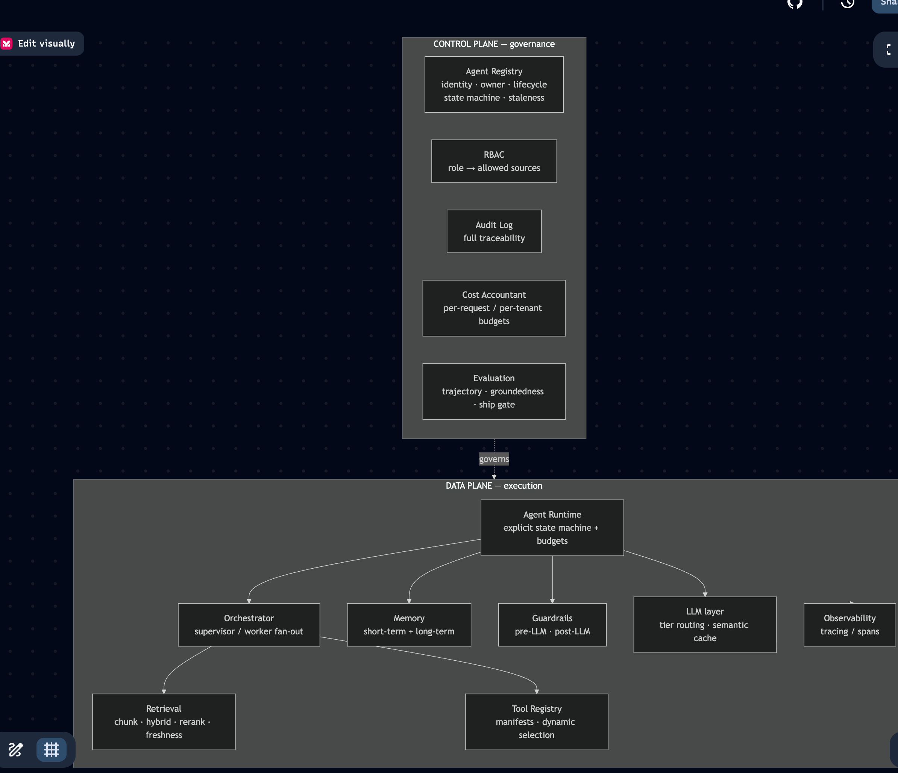
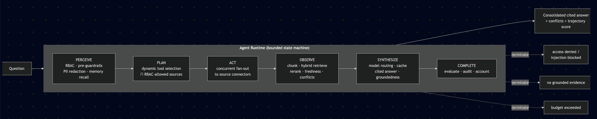
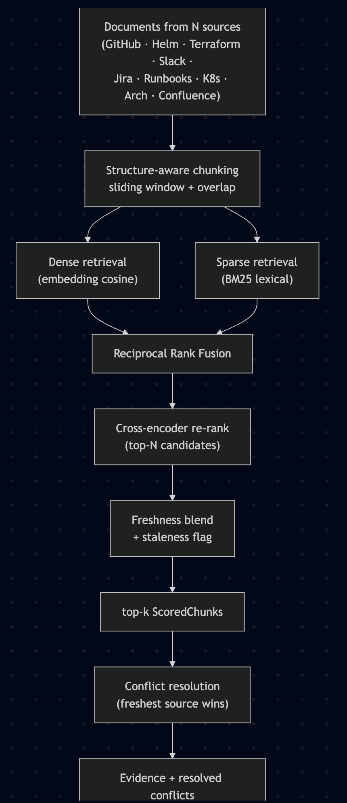

# KnowledgeAgent — Architecture

A RAG-based enterprise knowledge assistant that answers engineering and
operational questions by federating across many internal sources, reasoning over
the results, resolving conflicts, and returning a single **cited** answer.

The design deliberately separates a **control plane** (governance) from a
**data plane** (execution). The control plane *governs* the data plane.

---

## 1. Control plane vs. data plane

A staff-level review usually probes whether these two planes are cleanly
separated, and whether observability, safety, and evaluation were designed in
from the start rather than promised as "later". Here every request is:

* **authorized** by RBAC and **recorded** in the audit log (control plane),
* **executed** as a bounded state machine over federated retrieval (data plane),
* **priced** against per-request / per-tenant budgets (control plane),
* **traced** end-to-end and **scored** by the evaluator (both planes).

---

## 2. Data-plane request pipeline

The runtime is an explicit state machine (not free-form reasoning). Each phase
enforces one concern before handing off to the next.

Termination conditions (access denied, prompt-injection, no evidence, budget
exceeded) short-circuit the machine; step / tool-call / wall-clock budgets cap
runaway loops. State is checkpointable (`RunContext.snapshot`) for resumability.

---

## 3. Retrieval pipeline (the OBSERVE phase)

Federated documents are reduced to a small, precise top-k **before** anything
downstream (LLM, cost) sees them — the bounded handoff that keeps context and
cost from growing non-linearly with the number of sources.

* **Hybrid** search combines dense (semantics) and sparse (exact terms like
  service names / flags) via RRF — fusing by *rank* avoids score-scale tuning.
* **Re-rank** runs a precise cross-encoder-style scorer over only the top-N
  fused candidates (precision at bounded cost).
* **Freshness** applies an exponential-decay weight and flags stale chunks so a
  two-year-old runbook can't quietly override live state.
* **Conflict resolution** aggregates structured claims across sources and
  resolves disagreements by freshness, surfacing the full disagreement.

---

## 4. Module map

| Layer | Module | Responsibility |
|---|---|---|
| Control | `control_plane/registry.py` | Agent identity, owner, lifecycle state machine, staleness |
| Control | `control_plane/rbac.py` | Role → allowed-source policy |
| Control | `control_plane/audit.py` | Append-only audit trail |
| Control | `control_plane/cost.py` | Per-request / per-tenant cost budgets |
| Control | `evaluation/evaluator.py` | Trajectory + groundedness scoring, ship gate |
| Data | `data_plane/runtime.py` | Bounded state-machine execution model |
| Data | `data_plane/orchestrator.py` | Supervisor/worker fan-out, bounded handoff |
| Data | `data_plane/tools/` | Manifests, dynamic selection, connectors |
| Data | `data_plane/memory.py` | Short-term + selective long-term memory |
| Data | `data_plane/guardrails.py` | Pre-LLM PII/injection, post-LLM groundedness |
| Data | `data_plane/conflict.py` | Cross-source conflict resolution |
| Data | `retrieval/` | Chunking, embeddings, BM25, dense, hybrid, rerank, freshness |
| Data | `llm/client.py` | Synthesizer(s), model-tier router, semantic cache |
| Cross | `observability/tracing.py` | Spans/traces over every step |
| Root | `assistant.py` | Composition root wiring control over data plane |

See [flow.md](flow.md) for the request sequence and the safety/governance flows,
and [design_principles.md](design_principles.md) for how each of the eight
system-design principles maps onto the code.
