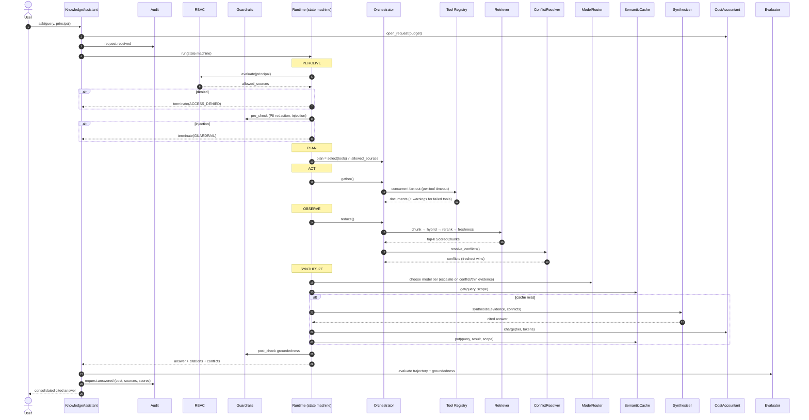
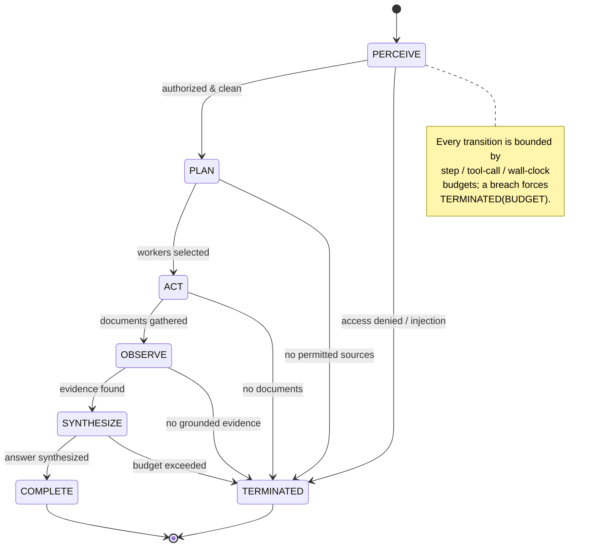
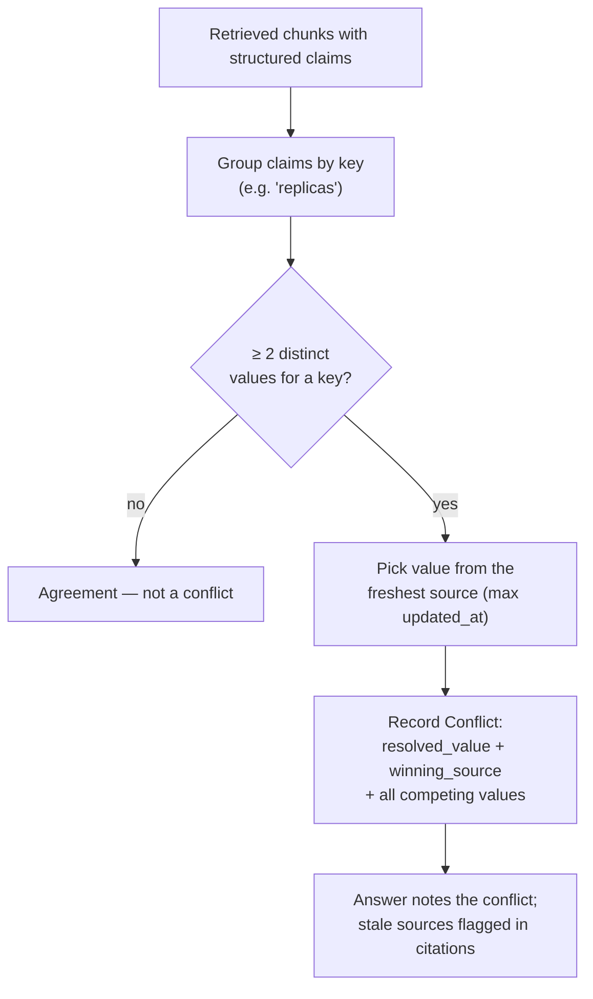
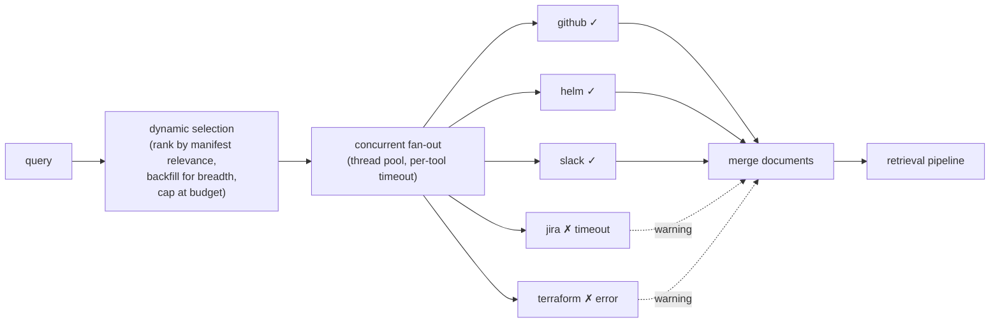

# KnowledgeAgent — Flow Diagrams

## 1. End-to-end request sequence

How a single `assistant.ask(...)` call flows through the control and data planes.

---

## 2. Runtime state machine

---

## 3. Conflict resolution & freshness

Why the stale runbook's `replicas: 3` never wins over live `replicas: 6`.

Example resolution for *"How many replicas does payment-service run in
production?"*:

| Source | `replicas` | Age | Stale? |
|---|---|---|---|
| Helm (values-prod) | **6** | ~15d | no ← **winner (freshest)** |
| Kubernetes (live) | 6 | ~20d | no |
| Runbook | 3 | ~200d | **yes** |

The router also *escalates to the strong model* when a conflict is present,
because conflicting evidence is exactly when careful synthesis matters most.

---

## 4. Tool fan-out with graceful degradation

A tool that errors or times out is recorded as a warning and skipped — a single
dead connector never stalls or fails the whole request.
