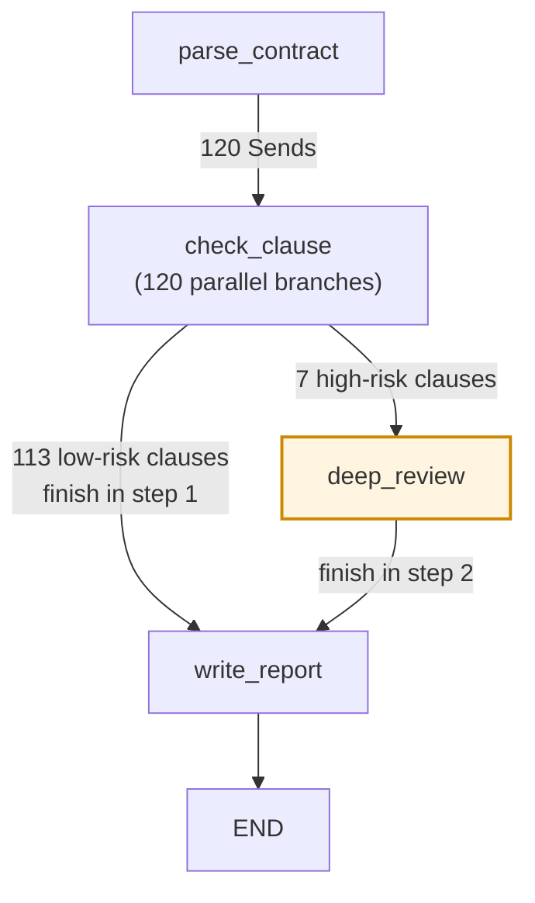
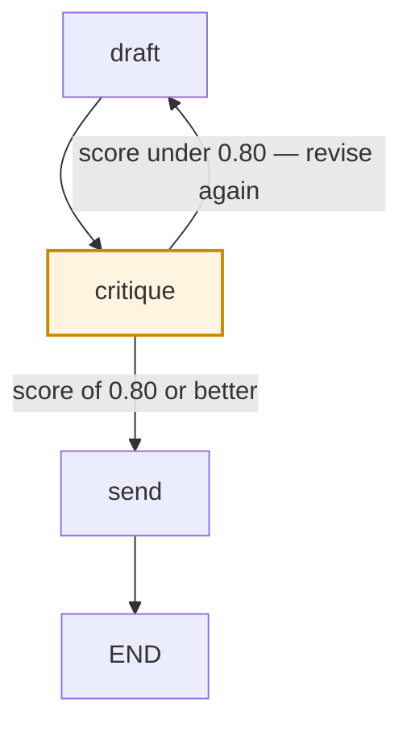

# 02 — Deciding What Runs Next

In [01](01-graphs-and-state.md) you built graphs where the shape was fixed: `triage` runs, then
`billing`, then it stops. Every run took the same path.

Real programs don't work like that — the next step depends on what just happened. This file is every
mechanism LangGraph gives you for that, in the order you'll need them.

You already know: a node is a function that takes state and returns a partial update; an edge says
what runs next; `add_messages` appends to a list channel while a bare type like `str` replaces; and
two nodes writing the same replace-channel at once raises `InvalidUpdateError`. Everything here
builds on those four facts.

---


## Part 1 — Where static edges run out

Three messages that arrived in a support inbox this morning:

```
#4471  "I was charged $49.00 twice on March 3rd."
#4472  "Order 88213 says delivered but nothing arrived."
#4473  "Your API is returning 403 on every request since 09:00 UTC."
```

Three different teams own the answers — Finance, Logistics, Engineering — so you add a `triage` node
and three specialist nodes, `billing`, `orders`, `technical`. Now connect them with what you have:

```python
builder.add_edge("triage", "billing")
builder.add_edge("triage", "orders")
builder.add_edge("triage", "technical")
```

This compiles. It also does something you almost certainly didn't want: **all three run.**

That's not a bug — it's what those three lines mean. `add_edge(a, b)` says "when `a` finishes, `b`
becomes runnable," and LangGraph runs *every* runnable node together, in parallel.

That "together" is worth a name, because the rest of this file leans on it. LangGraph executes in
**super-steps**: it gathers every node that has become runnable, runs them all, merges their state
updates, and only then works out what's runnable next. One super-step, however many nodes it
contained, produces one merged state. So three edges out of `triage` means one super-step containing
three nodes — not three sequential steps.

Which is why #4471 gets handled by Billing (correct), Orders (which finds no order and hallucinates
something reassuring), and Technical (which apologises for an outage that isn't happening). You pay
for three LLM calls and get one usable answer buried in two wrong ones.

There is no argument to `add_edge` that means "only if". The mechanism has nowhere to put a
condition, because the edge is decided at build time and your condition depends on data that doesn't
exist until run time.

That's the gap. Everything below fills it.

---


## Part 2 — Conditional edges: a function that names the next node

`add_conditional_edges` replaces the fixed destination with **a function that returns the
destination**.

```python
def route_by_area(state: SupportState) -> Literal["billing", "orders", "technical"]:
    """Returns the NAME of the node that runs next. Not a state update — a destination."""
    return state["area"]                          # e.g. "billing"

builder.add_conditional_edges(
    "triage",                                     # after this node runs...
    route_by_area,                                # ...call this to pick the next one
    {"billing": "billing", "orders": "orders", "technical": "technical",
     "unknown": "human_handoff"},                 # what each return value maps to
)
```

The third argument is what the function is allowed to return. A plain list of node names works
(`["billing", "orders", "technical"]`), but the dict form above earns its extra typing: the function
can return a *label* from your domain (`"unknown"`) rather than a node name, the whole routing table
is readable in one place, and renaming a node doesn't force you to edit the function.

Message #4471 now runs `triage`, then `billing`, and nothing else.

### The catch: the return value is a destination, and then it's discarded

Look at `route_by_area` again. It returned `"billing"`, LangGraph picked a node, and then **threw the
value away.** There is nowhere for a routing function to put a state update — its return type *is*
the destination.

That matters, because in practice you almost always want to keep the routing decision: for the
specialist's own prompt ("you are handling a **billing** question"), for your metrics dashboard, for
your audit log, and for the next turn so you don't re-classify a conversation that's already been
classified. So you split the work across two places — the node computes and records the label, the
edge reads it:

```python
def triage_fn(state: SupportState) -> dict:
    area = classify(state["messages"][-1].content)     # one LLM call -> "billing"
    return {"area": area}                               # recorded in state

def route_by_area(state: SupportState) -> str:
    return state["area"]                                # pure lookup, no LLM call
```

**This is a good pattern and you'll use it constantly.** But notice: one decision now lives in two
functions that have to agree, and there's a specific bug waiting — the routing function that
classifies *again* (`return classify(state["messages"][-1].content)`) instead of reading the label.

That costs a second LLM call every turn, and on borderline tickets the two calls disagree:
`state["area"]` says `"billing"`, the graph runs `orders`, and everything downstream that reads
`state["area"]` is now describing a path the graph didn't take. Your dashboard says Finance handled
it; your trace says Logistics did. That is a genuinely miserable thing to debug six weeks later.

**Rule of thumb: a routing function should be pure and cheap — a lookup, a comparison, an** `if`**.
Never an LLM call, never an API call, never a side effect.** If a decision requires work, do the work
in a node and route on the result.

---


## Part 3 — `Command`: update state and route in one return

`Command` collapses that split. It's an object a node returns carrying **both** a state update and a
destination.

```python
from langgraph.types import Command

def triage_fn(state: SupportState) -> Command[Literal["billing", "orders", "technical"]]:
    area = classify(state["messages"][-1].content)     # one LLM call
    return Command(
        update={"area": area},                          # merged into state, as usual
        goto=area,                                      # and this node runs next
    )
```

One function, one LLM call, no second place that can disagree. You don't call
`add_conditional_edges` for this node at all — `Command(goto=...)` creates the edge at run time.

Why is combining them the right default? Because **the routing decision usually *is* a piece of
state you want recorded.** "Which specialist is handling this" isn't scaffolding, it's a fact about
the conversation that your prompts, your metrics, and your auditors all need. With a conditional
edge, that fact exists only for the microsecond between the function returning and the framework
reading it. `Command` makes it durable for free.

### Two things about `Command` that cause real bugs

**Annotate the return type with the reachable node names.** That `Command[Literal[...]]` isn't
decoration. Because `goto` is computed at run time, LangGraph has no other way to learn that an edge
from `triage` to `billing` can exist. Omit the annotation and two things silently break: your graph
diagram shows `triage` as a dead end with no outgoing edges, and compile-time validation can't tell
you that you typed `"billng"`. You find out in production.

`Command(goto=...)` ***adds* an edge — it doesn't replace the ones you declared.** If `triage_fn`
returns `Command(goto="billing")` and you also wrote `builder.add_edge("triage", "log_ticket")`, both
fire: `billing` runs *and* `log_ticket` runs. That's the "all three run" surprise from Part 1 arriving
by a different door, and it's easy to create by accident when you convert a node from conditional
edges to `Command` and forget to delete the old `add_edge`. **Pick one routing mechanism per node.**

### When a conditional edge is still better

`Command(goto="billing")` hard-codes `"billing"` inside `triage_fn`. Fine in a small graph; in a large
one the routing table ends up scattered across a dozen node functions as string literals, and if Team
A owns `triage` while Team B owns `billing`, Team B can't rename their node without editing Team A's
code. So: `Command` when the decision is also data you need (usually), a conditional edge with a
`path_map` when the routing table itself is what you want to keep legible.

---


## Part 4 — `Command.PARENT`: getting out of a subgraph

A **subgraph** is a compiled graph used as a node inside another graph:

```python
billing_builder = StateGraph(SupportState)
billing_builder.add_node("look_up_charges", look_up_charges)
billing_builder.add_node("explain",         explain)
billing_builder.add_node("propose_refund",  propose_refund)
billing_builder.add_edge(START, "look_up_charges")
billing_graph = billing_builder.compile()          # compiled = usable as a node

parent = StateGraph(SupportState)
parent.add_node("billing",      billing_graph)     # a whole graph, as one node
parent.add_node("human_review", human_review_fn)
```

You do this for the same reason you extract a function: the parent stays readable, and the billing
team owns `billing_builder` without touching the parent. Because both graphs share the same schema
(`SupportState`), state flows in and out automatically.

Now the problem. Inside the subgraph, `propose_refund` works out the amount — not $49.00 this time
but **$2,400.00**, because the customer was billed for 48 seats they never used. Policy says anything
over $200 needs a human, so it returns `Command(goto="human_review")` — and that fails.

It fails because `human_review` lives in the **parent**. From inside `billing_graph`,
`goto="human_review"` looks among `look_up_charges`, `explain`, `propose_refund` — and finds nothing.

```python
def propose_refund(state: SupportState) -> Command[Literal["human_review"]]:
    amount = compute_refund(state)
    if amount > Decimal("200.00"):
        return Command(
            update={"escalation_reason": "refund $2400.00 exceeds the $200 limit"},
            goto="human_review",
            graph=Command.PARENT,        # resolve `goto` in the PARENT graph, not this one
        )
    return Command(update={"proposed_refund": amount}, goto="explain")
```

`graph=Command.PARENT` says: look `goto` up one level out. This is the mechanism behind every agent
handoff you'll see in the wild — a specialist is a subgraph, and "hand this to someone else" means
jumping to a sibling node that lives in the parent.

**One gotcha: a key that exists in both schemas needs a reducer in the parent.** When the subgraph
node finishes, the parent receives its normal state output; the `Command.PARENT` update is a *second*
write landing on the parent's channels in the same super-step. Two writes, one channel, one step —
and if that channel is a plain `str`, "replace" has no answer for which wins. Same
`InvalidUpdateError`, new door. Simplest fix: don't share the key. Give the escalation reason a name
only the parent uses and there's only ever one writer.

---


## Part 5 — `Send`: running the same node many times, in parallel

You're reviewing a Master Services Agreement before signing. It has **120 numbered clauses**, each
of which has to be checked against your legal team's policy — is the liability cap acceptable, is the
governing law one you'll accept, does the data-processing clause meet your DPA requirements. Clause
14 doesn't depend on clause 92, so you'd like to check all 120 at once.

Nothing you've seen can express that. `add_edge` gives a fixed number of destinations written at
build time. `Command(goto=[...])` can name several nodes, but you don't want 120 *different* nodes —
you want **one** node run 120 times with 120 different inputs. And you don't know it's 120 until
you've parsed the PDF, so you can't even write the list out.

```python
from langgraph.types import Send

def fan_out(state: ContractState) -> list[Send]:
    """One Send per clause. Each schedules a separate run of `check_clause`."""
    return [Send("check_clause", {"clause_id": c.id, "text": c.text, "index": i})
            for i, c in enumerate(state["clauses"])]

builder.add_conditional_edges("parse_contract", fan_out, ["check_clause"])
```

`Send(node_name, payload)` schedules one run of `node_name`. Return a list of 120 and you get 120
parallel runs. The width is decided at run time, from the data.

### The part that trips everyone up: the payload is the node's WHOLE input

Read this twice.

**A node reached by a** `Send` **does not see the shared graph state. It sees the payload, and only the
payload.**

Here's what that costs. The contract state, and the obvious clause checker:

```python
class ContractState(TypedDict):
    contract_id: str                                    # "MSA-2024-0117"
    counterparty: str                                   # "Northwind Logistics GmbH"
    clauses: list[Clause]
    policy_version: str                                 # "legal-policy-v7"
    findings: Annotated[list[Finding], operator.add]

def check_clause(state) -> dict:
    policy = load_policy(state["policy_version"])        # KeyError: 'policy_version'
    return {"findings": [review(state["text"], policy=policy)]}
```

`KeyError: 'policy_version'`. The node got exactly `{"clause_id": ..., "text": ..., "index": ...}` —
the three keys you put in the `Send`, and nothing else. Not `contract_id`, not `counterparty`, not
`policy_version`. Those live in the parent state, which this node cannot see.

The fix is to put everything the branch needs in the payload, and to declare the payload's shape so a
mismatch is a type error in your editor rather than a `KeyError` in production:

```python
class ClauseTask(TypedDict):
    """The COMPLETE input to one branch. If it isn't in here, the branch can't read it."""
    clause_id: str
    text: str
    index: int                                          # for deterministic ordering later
    policy_version: str
    contract_id: str

def fan_out(state: ContractState) -> list[Send]:
    return [
        Send("check_clause", ClauseTask(
            clause_id=c.id, text=c.text, index=i,
            policy_version=state["policy_version"],      # copied in
            contract_id=state["contract_id"],             # copied in
        ))
        for i, c in enumerate(state["clauses"])
    ]

def check_clause(task: ClauseTask) -> dict:
    verdict = review(task["text"], policy=load_policy(task["policy_version"]))
    return {"findings": [(task["index"], verdict)]}       # index travels with the result
```

Now state the asymmetry plainly: **a** `Send` **branch reads a private payload, but it writes to the
shared state.** That `{"findings": [...]}` lands on the parent's `findings` channel like any other
node update. Input isolated, output shared — which is why `findings` is
`Annotated[list[Finding], operator.add]`. 120 branches finish in the same super-step and all 120
write `findings`; without a reducer that's 120 writes to a replace-channel, which is Part 7's error.

Note the `(index, verdict)` tuple. `operator.add` concatenates in whatever order the branches land,
which is *not* the order you sent them. If clause 1 must precede clause 2 in the report, carry the
index and sort in the aggregator. Do not hope.

### Bound the width before it bounds you

120 parallel LLM calls is already a burst that trips a rate limit on most accounts. The day someone
uploads a 4,000-clause consolidated agreement, an unbounded `fan_out` tries 4,000 at once.

```python
def fan_out(state: ContractState) -> list[Send]:
    if len(state["clauses"]) > MAX_CLAUSES:            # MAX_CLAUSES = 250
        raise ValueError(f"{state['contract_id']} has {len(state['clauses'])} clauses, "
                         f"limit {MAX_CLAUSES}. Split it or raise the limit deliberately.")
```

Fan-out width is a capacity decision: write the number down and enforce it, rather than learning it
from a pager at 02:00. When the natural width is genuinely large, send *batches* — one `Send` per 25
clauses, each branch looping over its 25. 4,000 clauses becomes 160 branches instead of 4,000.

---


## Part 6 — The reduce step, and why `defer=True` exists

Fan-out is half a map-reduce. Now the report:

```python
def write_report(state: ContractState) -> dict:
    ordered = [v for _, v in sorted(state["findings"])]      # sort by the index we carried
    return {"report": synthesize(ordered)}

builder.add_edge("check_clause", "write_report")
```

If every branch is exactly one node deep this works. All 120 `check_clause` runs finish in the same
super-step, `write_report` becomes runnable once, and sees all 120 findings.

Real reviews aren't uniform. Of the 120 clauses, **7 come back** `risk="high"` — the liability cap,
the indemnity, termination-for-convenience, and four others. Those need a second, deeper pass that
pulls precedent from your contract archive:

```python
def check_clause(task: ClauseTask) -> Command:
    verdict = review(task["text"], policy=load_policy(task["policy_version"]))
    if verdict.risk == "high":
        # `goto` accepts a Send, so the deeper pass gets its own payload too — otherwise
        # deep_review would run against shared state and not know which clause it has.
        return Command(goto=Send("deep_review", {**task, "first_pass": verdict}))
    return Command(update={"findings": [(task["index"], verdict)]}, goto="write_report")

builder.add_edge("deep_review", "write_report")
```

Note that the static `builder.add_edge("check_clause", "write_report")` from a moment ago is **gone**.
`check_clause` now routes with `Command`, and Part 3's rule applies: one mechanism per node, or the
high-risk branch would fire `deep_review` *and* `write_report` simultaneously.

Your branches now have **two different depths**: 113 are one node deep, 7 are two.




Here is what happens. At the end of super-step 1, 113 branches have written findings and are done.
One of `write_report`'s incoming edges has fired, so it becomes runnable, so it runs — reading
`state["findings"]`, getting **113** entries, and writing a report. The 7 `deep_review` branches are
still going; they finish in super-step 2 and append their findings. Too late.

**The report silently omits the 7 riskiest clauses in the contract.** It doesn't crash. It doesn't
warn. It produces a clean, confident, well-formatted legal review with exactly the seven paragraphs
you needed removed. This is the worst failure mode in this file, and the fix is one keyword:

```python
builder.add_node("write_report", write_report, defer=True)
```

`defer=True` means: don't run this node while any other task in the graph is still pending. It waits
for the fan-out to drain, however uneven the branches are, then runs once with all 120 findings.

That's the entire purpose of `defer=True` — aggregators downstream of branches with different depths.
If all your branches are *provably* the same depth you don't need it, but adding one node deep in a
branch six months from now reintroduces the bug. On an aggregator it's a cheap default.

### `defer=True` doesn't mean "everything succeeded"

Be honest about what you're waiting for. `defer=True` waits for branches to *finish*, and a branch
that failed has finished. If clause 62's LLM call times out and something swallows the error, the
aggregator still runs — with 119 findings, silently. So have the aggregator compare
`len(state["findings"])` against a `clause_count` that `parse_contract` wrote (120 vs 119) and refuse
to report on a mismatch.

Better still, make branch failures *values* rather than exceptions — have `check_clause` catch its
own errors and append `Finding(clause_id="62.1", status="error", detail=...)`. Then the count always
matches and the report can say "clause 62.1 could not be reviewed" instead of pretending it doesn't
exist. A gap you can see is worth ten times a gap you can't.

---


## Part 7 — Concurrent writes during fan-out

You now have graphs where several nodes run in the same super-step. That's exactly where the reducer
rules from [01](01-graphs-and-state.md) stop being trivia.

Take the support agent handling three unrelated problems in one message:

```python
def fan_out_problems(state: SupportState) -> list[Send]:
    return [
        Send("billing", {"task": "check for a duplicate $49.00 charge on Mar 3"}),
        Send("orders",  {"task": "why has order 88213 not shipped"}),
        Send("account", {"task": "why can maria@northwind.example not log in"}),
    ]

def billing(task) -> dict:      # each specialist records who handled it
    return {"messages": [answer], "active_agent": "billing", "cost_usd": 0.031}
```

Three branches, one super-step. Run it:

```
langgraph.errors.InvalidUpdateError: At key 'active_agent': Can receive only one value
per step. Use an Annotated key to handle multiple values.
```

Given this schema:

```python
class SupportState(TypedDict):
    messages:     Annotated[list, add_messages]              # appends, upserts by message id
    findings:     Annotated[list[Finding], operator.add]      # concatenates
    cost_usd:     Annotated[float, operator.add]              # sums
    active_agent: str                                         # REPLACES
    summary:      str                                         # REPLACES
```


| Channel        | Three writes arrive                  | Result                                           |
| -------------- | ------------------------------------ | ------------------------------------------------ |
| `messages`     | 3 message lists                      | Appended — all three answers present             |
| `findings`     | 3 finding lists                      | Concatenated — all present, order not guaranteed |
| `cost_usd`     | `0.031`, `0.019`, `0.024`            | Summed to `0.074`                                |
| `active_agent` | `"billing"`, `"orders"`, `"account"` | `InvalidUpdateError`                             |
| `summary`      | 3 different strings                  | `InvalidUpdateError`                             |


The pattern is simple: a channel whose reducer *combines* handles concurrent writes fine. A channel
that *replaces* cannot, because "replace with three values" is not a defined operation.

### This error is the framework protecting you

It's tempting to read `InvalidUpdateError` as an obstacle and reach for the shortest thing that
silences it. Resist, because here the error is telling you something true about your design.

Ask what `active_agent = "billing"` was supposed to mean while orders and account were *also*
running. There is no honest answer. The field encodes "exactly one specialist is handling this," and
you just built a step where three are. The field and the topology contradict each other, and the
framework noticed before your customer did. Three ways forward, in the order to try them:

**1. Don't write it from the branches.** Usually correct. `active_agent` is a whole-conversation
concept owned by whatever coordinates the fan-out; the branches have no business setting it. Delete
the write and the error goes away *and* the design gets clearer.

**2. Make it per-branch, so each branch writes its own slot.**

```python
def merge_status(old: dict, new: dict) -> dict:
    """Commutative: each branch writes a different key, so merge order can't matter."""
    return {**old, **new}

class SupportState(TypedDict):
    branch_status: Annotated[dict[str, str], merge_status]
    # billing writes {"branch_status": {"billing": "resolved"}}, orders writes
    # {"branch_status": {"orders": "released"}} — three writes, three keys, no collision.
```

**3. Add a combining reducer — but only if combining is meaningful.** `operator.add` on `cost_usd` is
meaningful: money adds up. `operator.add` on `active_agent` gives you `"billingordersaccount"`, which
is not an agent.

**The anti-pattern to avoid:** annotating every field with `operator.add` so nothing can ever raise.
You'll silence the one error that reliably catches genuine parallel-write bugs, and downstream code
expecting a `str` starts receiving a list. Add a reducer when accumulation is what you *mean*, not
when you want quiet. And note that **the framework does not promise the order writes are applied
in**, so a reducer used under fan-out must be commutative (`f(a, b) == f(b, a)`) and associative.
`operator.add` on numbers is both; `operator.add` on lists is associative but the resulting order
tracks completion rather than your `Send` order, which is exactly why Part 5 carried an `index`.

---


## Part 8 — Loops

Cycles are legal. They aren't something you're getting away with — they're the point. Every agent
that thinks, acts, observes, and thinks again is a cycle.

Your support agent drafts a reply, a critic scores it against the tone-and-policy guide, and if the
score is too low it revises:

```python
def critique(state: DraftState) -> dict:
    result = grade(state["draft"])                      # scores 0.0 - 1.0 against the rubric
    return {"score": result.score, "critique": result.notes}

def route(state: DraftState) -> Literal["draft", "send"]:
    return "send" if state["score"] >= 0.80 else "draft"

builder.add_edge("draft", "critique")
builder.add_conditional_edges("critique", route, {"draft": "draft", "send": "send"})
```

`critique` can send control back to `draft`. That's the cycle, in two lines.




### How it fails to terminate

Ticket #4471 arrives — the duplicate $49.00 charge. The rubric has eight items, and item 6 is *"include
the refund reference number so the customer can quote it."*

But the refund hasn't been issued yet; this is the reply that *offers* it. There is no reference
number. There cannot be one. The drafter cannot satisfy item 6 no matter how it rewrites the
paragraph, so the critic caps out at **0.75** forever.

The loop never exits — not because a model is flaky, but because you encoded a requirement the loop
is structurally unable to meet. That's the usual cause, and it's why "make the prompt better" never
fixes it.

### What it costs

LangGraph's default `recursion_limit` is **25 super-steps**, so this doesn't run forever — it raises
`GraphRecursionError`. Count what it burns first.

One iteration is `draft` + `critique` = 2 super-steps and 2 LLM calls. 25 super-steps is about **12
iterations**, so **24 LLM calls**. Say a call is 6,000 input tokens plus 800 output — call it 3 cents
all-in. That's **$0.72 per stuck run**, and the customer waits ~40 seconds to receive an error. If 4%
of 50,000 daily conversations hit an unsatisfiable rubric item, that's 2,000 stuck runs a day:
**$1,440/day, roughly $43,000/month**, spent entirely on drafts nobody read.

And here's the part that makes it worse. The first thing most people do on seeing
`GraphRecursionError` is raise the limit — `{"recursion_limit": 100, "configurable": {...}}`. That's
~50 iterations, ~100 calls, **$3.00 per stuck run, about $6,000/day.** Raising the limit doesn't fix a
loop that can't exit; it makes the same bug four times more expensive.

### Three fixes, doing three different jobs

All three fixes live in `route`. Here they are together, then what each one is actually for:

```python
class DraftState(TypedDict):
    ticket: str
    draft: str
    score: float
    revisions: int                                        # Fix 1 — `draft` increments this
    remaining_steps: RemainingSteps                       # Fix 2 — the framework fills this in
    score_history: Annotated[list[float], operator.add]   # Fix 3 — `critique` appends to this

def route(state: DraftState) -> Literal["draft", "send"]:
    if state["score"] >= 0.80:         return "send"      # succeeded
    if state["revisions"] >= 3:        return "send"      # Fix 1: product cap
    if state["remaining_steps"] <= 2:  return "send"      # Fix 2: out of step budget
    h = state["score_history"]
    if len(h) >= 2 and (h[-1] - h[-2]) < 0.02:            # Fix 3: no real improvement
        return "send"
    return "draft"
```

**Fix 1, the counter, is your product decision.** "Three revisions" says: we'll spend six LLM calls
making a reply better, then we send it. Worst case is now 6 calls, about 18 cents. And note it exits
to `send`, not to an error — the 0.75 draft is a perfectly serviceable reply, while erroring out
gives the customer nothing at all. **Prefer degrading to failing.**

**Fix 2, the step limit, is your safety net.** `RemainingSteps` (from
`langgraph.managed.is_last_step`) is the framework's own budget, exposed in state so you can bail
gracefully instead of raising. The distinction matters: **Fix 1 is domain logic and should fire
routinely. Fix 2 is a backstop and should never fire.** If `GraphRecursionError` shows up in
production, that isn't the limit doing its job — it's a missing domain bound. Alert on it.

**Fix 3, the no-progress check, is what catches the unsatisfiable rubric.** For our stuck ticket the
history is `[0.75, 0.75]`, a delta of `0.00`, under the 0.02 threshold — so it exits after **two**
iterations, 4 calls, about 12 cents, instead of the counter's 6 or the recursion limit's 24. It also
gives you a signal worth logging: *this rubric item is unsatisfiable for this class of ticket*, which
is the actual bug. No counter will ever tell you that.

> **If your graph has no cycles, skip this part.** A linear pipeline cannot loop, and the default
> limit of 25 is fine — you'll never come near it. Counters and no-progress checks would be
> complexity you're paying for nothing.

When the loop is inside an agent (a model calling tools until it's satisfied), LangChain ships
middleware that bounds it for you — `ModelCallLimitMiddleware` and `ToolCallLimitMiddleware`, covered
in [05](05-agents-and-tools.md). The reasoning is identical; you just don't write the counter.

---


## Part 9 — `END`, and having more than one exit

`END` is a sentinel, not a node. `add_edge("send", END)` means "after `send`, stop." `START` is its
mirror: `add_edge(START, "triage")` is the same as `set_entry_point("triage")`. You can reach `END`
from a conditional edge (`return END`) or from a `Command` (`Command(update=..., goto=END)`).

And **a graph can have as many exits as it wants.** Worth saying, because people instinctively funnel
everything through one final node. Four separate `add_edge(..., END)` lines — one from `send_reply`,
one from `escalate_to_human`, one from `close_duplicate`, one from `reject_spam` — are four honest
ways the conversation can be over, and all four are fine. A single `finish` node that every path
passes through is only worth it if `finish` genuinely does something for every path: writes a ledger
row, emits a metric. If it's a pass-through with a four-way `if` inside, you've moved the branching
out of the graph, where the diagram shows it, into a function body, where it doesn't.

---


## Part 10 — Which one do I use?


| You want to...                                      | Use                                                 |
| --------------------------------------------------- | --------------------------------------------------- |
| Always run `B` after `A`                            | `add_edge("A", "B")`                                |
| Pick the next node from a value already in state    | `add_conditional_edges` with a `path_map`           |
| Pick the next node **and** record the decision      | `Command(goto=..., update=...)`                     |
| Jump from inside a subgraph to a node in the parent | `Command(goto=..., graph=Command.PARENT)`           |
| Run **one** node **N** times on N different inputs  | one `Send("node", payload)` per item                |
| Run several **different** nodes at once             | `Command(goto=["a", "b", "c"])`                     |
| Collect fan-out results reliably                    | a reducer channel + an aggregator with `defer=True` |
| Repeat until good enough                            | a cycle + a counter + a no-progress check           |
| Stop                                                | `END`                                               |


Two habits worth forming. **Prefer the least dynamic mechanism that works** — a static edge shows up
in the diagram, so an on-call engineer can predict the path without running anything, while a
`Command(goto=...)` shows up nowhere but the annotation. And **never route with two mechanisms on the
same node.** One node, one way out.

---


## What to take away

**1.** `add_edge` **means "and", not "or".** Three edges out of one node run three nodes in parallel, and
there is no conditional form — the condition depends on data that doesn't exist until run time.

**2. A routing function returns a destination, and the value is discarded.** Keep routing functions
pure and cheap. The moment one makes an LLM call you've created a second decision that can disagree
with the one in state — and then your dashboard and your trace describe different runs.

**3.** `Command` **exists because the routing decision is usually also data you need.** One return value
means nothing can disagree with itself. Annotate it `Command[Literal[...]]` or your diagram and your
validation both go quietly blind.

**4. A** `Send` **payload is the branch's entire input.** It cannot see shared state. Copy in everything
the branch needs, declare the payload as its own TypedDict so a mismatch is a type error rather than
a production `KeyError`, and remember the asymmetry: input private, output shared.

**5. Put** `defer=True` **on aggregators.** Without it an aggregator fires as soon as the *shallowest*
branch reaches it, and deeper branches' results arrive too late — producing a confident report
missing exactly the items that needed the extra step.

**6.** `InvalidUpdateError` **during fan-out is a design question, not an obstacle.** Before adding a
reducer, ask what the field was supposed to mean while three branches were running. Usually the
answer is that the branches shouldn't write it at all.

**7. Bound every loop three ways:** a domain counter that fires routinely, a step limit that should
never fire and should alert when it does, and a no-progress check for the loop that *cannot* succeed.
Exit to a degraded answer, not an exception. And raising `recursion_limit` is not a fix — a loop that
can't terminate at 25 steps can't terminate at 100 either, you've just multiplied the bill by four.

**8. Bound your fan-out width in code.** 120 parallel calls is a burst; 4,000 is an outage. Write the
maximum down, `raise` above it, and batch when the natural width is large.

---

Next: [03 — Pausing, Resuming, and Surviving Restarts](03-persistence.md), which is what makes any of
this survive a deploy.