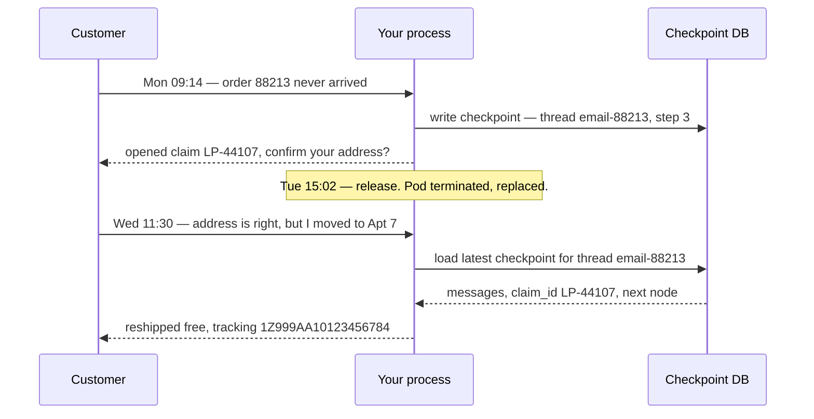
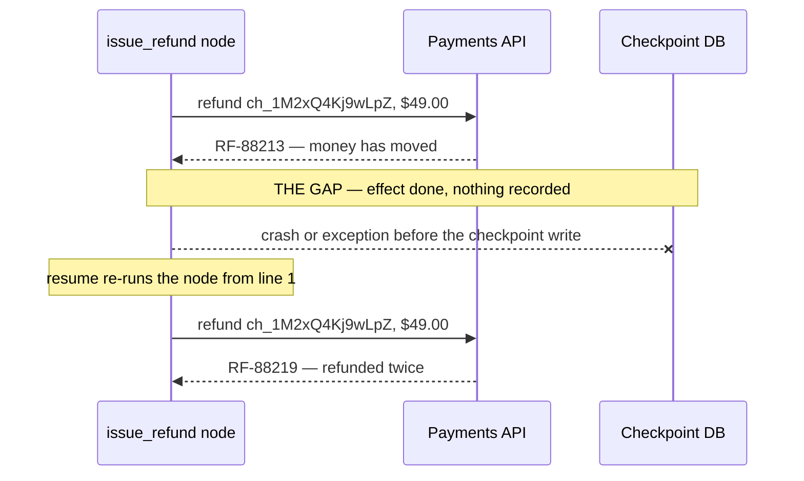

# 03 — Pausing, Resuming, and Surviving Restarts

Everything in [01](01-graphs-and-state.md) and [02](02-control-flow.md) happens inside one
`graph.invoke(...)` call. Start to finish, one process, one request.

This file is about what happens when that isn't good enough — when the work spans days, or the
process dies halfway through. It's also the file where you find out why the graph was worth the
trouble in the first place.

---

## Part 1 — The conversation that takes three days

Here's a real support thread. Times are real, and so is the gap.

```
Mon 09:14  Customer: Order 88213 says delivered but nothing arrived.
Mon 09:14  Agent:    Checked the carrier — scan shows delivery to a Reno hub, not to you.
                     I've opened a lost-parcel claim, LP-44107. Can you confirm the delivery
                     address on file is still 1180 Hillcrest Dr, Apt 4?
Mon 09:15  Agent:    (waiting for the customer)
```

Nothing happens Monday afternoon. Nothing happens Tuesday. Then:

```
Wed 11:30  Customer: Sorry, was travelling. Yes that address is right, but I moved to Apt 7
                     in February.
Wed 11:30  Agent:    That explains it — the carrier delivered to Apt 4 and it wasn't
                     forwarded. I've updated your address and reshipped 88213 free,
                     tracking 1Z999AA10123456784. Claim LP-44107 stays open against
                     the carrier, not you.
```

And in the middle of that gap, at **Tue 15:02**, you shipped a release. Every pod running your agent
was terminated and replaced.

### Why a `while` loop cannot do this

Suppose you wrote the agent the way most people first write one:

```python
def handle_ticket(first_message: str) -> None:
    messages = [first_message]
    claim_id = None
    while True:
        reply = call_llm(messages)
        if reply.needs_tool:
            result = run_tool(reply.tool_call)      # opens LP-44107, sets claim_id
            messages.append(result)
            continue
        send_to_customer(reply.text)
        messages.append(wait_for_customer_reply())  # ...blocks here for two days
```

On Monday at 09:15 this process is sitting inside `wait_for_customer_reply()`. Everything that
matters about the conversation lives in places you cannot reach from outside:

- `messages` is a local variable in a stack frame
- `claim_id` is another local — `"LP-44107"`, the number the customer will need
- "where we are" is *the program counter*, halfway down a `while` body

At Tue 15:02 the pod is killed. All three are gone. Not corrupted, not stale — gone. There is no
file, no row, no key in Redis. When the customer replies on Wednesday your new pod has never heard
of them, so it starts over: "Hi, can you tell me your order number?"

The customer already told you. That is the single most infuriating thing a support bot can do.

### And you can't just save the locals

The obvious patch is to pickle `messages` and `claim_id` into Redis before blocking. That does save
the data. It doesn't save **the position** — and the position is the hard part.

Python gives you no way to say "resume this function at line 9 with these locals." To fake it you'd
have to restructure the loop into explicit named states, store which state you're in, and write a
dispatcher that jumps to the right one on the way back in.

Do that carefully and you will have written a state machine with an external state store and a
resume path. Which is to say: **you will have written LangGraph.** The graph isn't ceremony. It's the
thing that makes "where are we" a value you can write to a database instead of a program counter you
can't.



---

## Part 2 — Checkpointers

A **checkpointer** is an object that writes your graph's state to a database after every super-step —
after every batch of nodes LangGraph ran together, in the sense [02](02-control-flow.md) defined.
That's all it is. You hand one to `compile()` and it starts saving.

```python
from langgraph.checkpoint.memory import InMemorySaver

graph = builder.compile(checkpointer=InMemorySaver())
```

For production, the same thing against Postgres:

```python
from langgraph.checkpoint.postgres import PostgresSaver

with PostgresSaver.from_conn_string("postgresql://localhost/agents") as checkpointer:
    checkpointer.setup()                      # creates the tables — run once, via a migration
    graph = builder.compile(checkpointer=checkpointer)
```

There's a `SqliteSaver` in between, which is the right choice for a local CLI tool or a single-process
script: real persistence, one file, no server.

What gets written is a **checkpoint** — a snapshot of every channel in your state, plus which nodes
run next, plus metadata about which step it was and which node's writes produced it. A run as simple
as `START → A → B → END` produces **four** checkpoints: one for the input, one before `A`, one before
`B`, and a final one. Not one per run — one per step boundary. That number matters later, because
checkpoint writes will be the dominant load on your database.

### The `InMemorySaver` trap

`InMemorySaver` keeps checkpoints in a Python dict. When the process exits, the dict is garbage.

This is **by far** the most common "why doesn't resume work?" confusion, and it's confusing for a
specific reason: `InMemorySaver` works perfectly in every test you write. Your test starts a process,
invokes twice, sees the second call pick up the first call's state, and passes. Resume looks
implemented. Then you deploy, and on the first rolling restart every in-flight conversation forgets
itself — exactly the failure the checkpointer was supposed to prevent, now with a checkpointer in
the code and a passing test suite pointing the wrong way.

`InMemorySaver` is correct for unit tests and for poking at things in a notebook. It is wrong for
anything a real user touches, including your staging environment. It's worth making that structural
rather than remembered — a startup assertion that refuses to boot with `InMemorySaver` when
`ENV != "test"` costs four lines and retires the whole class of incident.

> **If every run of your graph starts and finishes inside one request, you may not need a
> checkpointer at all.** A graph that classifies an incoming ticket in two nodes and returns a label
> has nothing to resume, no conversation to remember, and no human waiting on it. Compiling it
> without a checkpointer skips four database writes per ticket and removes a whole retention and
> privacy surface you'd otherwise have to manage. Everything from Part 3 onward is for work that
> outlives a single call — pauses, multi-turn conversations, expensive multi-step runs. If yours
> doesn't, stop here and come back when it does.

---

## Part 3 — `thread_id`: the identity of a conversation

A checkpointer needs to know *which* conversation's state to save and load. That's the `thread_id`,
and it goes in a config dict:

```python
config = {"configurable": {"thread_id": "email-88213"}}
graph.invoke({"messages": [customer_message]}, config)
```

Same `thread_id`, same conversation. Different `thread_id`, different conversation, completely
isolated. Without a `thread_id` a checkpointer has no key to store under, so nothing is saved and
nothing can resume.

Two mechanical constraints before the interesting part. Keep ids **under 255 characters** —
`PostgresSaver` stores them in a bounded column, so use a UUID or a hash of your natural key rather
than a concatenation of everything you know. And **never reuse a `thread_id` across tenants or
users**: it's the primary key of the conversation, so a collision is a cross-tenant data leak.

### Choosing what a thread *means* is a design decision

This looks like plumbing. It isn't. What you decide a thread represents determines what your agent
can remember, what it forgets, and what breaks under concurrency.

**One thread per email thread** (`thread_id = "email-88213"`). Natural, and it's what our example
uses. The consequence: when the same customer writes a *new* email next month about a different
order, that's a new thread and the agent has no idea who they are. It won't know they had a
lost-parcel claim, or that they moved to Apt 7. Every conversation starts cold. For transactional
support that's often correct and even desirable, but you have to *decide* it, because customers
notice.

**One thread per customer, forever** (`thread_id = "cust-4192"`). Now the agent remembers everything.
Two consequences, and both eventually hurt. First, the message list grows without bound — and since
a checkpoint serializes the whole state at every step, a customer with 400 turns of history is
writing hundreds of kilobytes on every single step of every future conversation. Cost and latency
grow with tenure, so your best customers get your slowest service. Second, concurrency: if that
customer emails about billing at 09:00 and about shipping at 09:01, both runs are on the same thread,
interleaving their state. That's not a rare edge case in a busy queue.

**One thread per case or document** (`thread_id = "claim-LP-44107"`). Usually the best fit for
workflows rather than chats. The thread's lifetime matches the work's lifetime, so it has a natural
end and a natural retention policy — you can delete it when the claim closes.

There's a fourth option worth naming so you don't reach for the wrong tool: if what you want is
"remember this customer's address preference across all their conversations," that is **not** a
thread question. Checkpoints are thread-scoped by design. Cross-conversation memory is a separate
mechanism — a store you read and write from inside nodes, keyed by customer rather than by thread.
Trying to get cross-conversation memory by making the thread huge is how you end up in the second
case above.

One last thing, and it's a security point rather than a design one. A `thread_id` is an identifier,
not a capability. `"email-88213"` is guessable, and even a UUID leaks through logs and URLs.
Authorize thread reads at your API layer — check that *this* user owns *this* thread — rather than
relying on the id being hard to type.

---

## Part 4 — What resume actually does

The clearest way to see it is two invocations:

```python
config = {"configurable": {"thread_id": "email-88213"}}

# Monday
graph.invoke({"messages": [("user", "Order 88213 says delivered but nothing arrived.")]}, config)

# Wednesday — a different process, on a different pod, after a redeploy
out = graph.invoke({"messages": [("user", "Yes that address is right, but I moved to Apt 7.")]},
                   config)

print(len(out["messages"]))       # 4 — both customer messages and both agent replies
print(out["claim_id"])            # "LP-44107" — written on Monday, still here
```

Wednesday's call passed one message. It got back a state containing four, plus `claim_id` from
Monday. Nothing in the process on Wednesday knew about Monday; the state came out of Postgres.

### The mental model

Here's the part worth getting precise, because the wrong model produces the wrong bug reports.

**The graph resumes from the last checkpoint. It does not re-run from the beginning.**

When you invoke on an existing thread, LangGraph loads the most recent checkpoint. That checkpoint
already contains the results of every node that ran before it, so those nodes are simply not
executed — their output is already in the state. Execution picks up at whatever the checkpoint's
`next` says should run.

So `look_up_carrier_scan` does not call the carrier API again on Wednesday. Its answer was
checkpointed on Monday.

### One gotcha that looks like a hang

There are two different things you can pass to `invoke` on an existing thread, and they mean
different things:

```python
# A new turn from the user: pass a plain dict.
graph.invoke({"messages": [("user", "Any update?")]}, config)

# Resuming a paused graph: pass a Command.
graph.invoke(Command(resume="yes"), config)
```

Passing **any** `Command` as input means "resume from the latest checkpoint," not "add this to the
conversation." If the thread has already finished, there's nothing to resume, so
`graph.invoke(Command(update={"messages": [...]}), config)` returns immediately having done nothing
visible. It looks hung. It isn't — you asked it to continue a run that was already over. To add a
turn, pass a dict.

---

## Part 5 — The replay hazard, and the double refund

Resume is a superpower with one sharp edge, and it's the most important thing in this file.

**A node that does not finish re-runs from its first line.** Not from where it stopped — from the
top. Which means anything the node already *did* to the outside world happens again. That's true
whether it was a retry, a crash, or a resume, because none of those can rewind a Python function.

### The concrete scenario

Ticket #4471, the duplicate $49.00 charge. The billing specialist has the customer's OK, so you
issue the refund:

```python
def issue_refund(state: SupportState) -> dict:
    receipt = payments.refund(                       # 1. money moves. External. Irreversible.
        charge_id=state["charge_id"],                #    "ch_1M2xQ4Kj9wLpZ"
        amount=state["refund_amount"],               #    Decimal("49.00")
    )
    email.send(                                      # 2. SMTP call
        to=state["customer_email"],
        subject=f"Refund {receipt.id} issued",
    )
    return {"refund_ref": receipt.id}                # 3. checkpoint written AFTER the node returns
```

Now walk the timeline.

| t | What happens |
|---|---|
| 14:02:11 | `payments.refund(...)` succeeds. `receipt.id == "RF-88213"`. $49.00 is on its way back. |
| 14:02:12 | `email.send(...)` raises `SMTPServerDisconnected` — your mail relay is having a bad afternoon. |
| 14:02:12 | The node failed. **No checkpoint was written**, because the node never returned. |
| 14:02:14 | The retry policy retries the node. Line 1 runs again. |
| 14:02:14 | `payments.refund(...)` succeeds again. `receipt.id == "RF-88219"`. |

The customer has been refunded **$98.00** for a $49.00 charge. Your ledger has two refunds. Nobody
gets paged, because from the graph's point of view the retry *worked*.

The same thing happens without any exception at all. Kill the pod between 14:02:11 and the checkpoint
write and the next pod resumes at `issue_refund`, from the top, and refunds again.



That labelled gap is the whole problem. Any effect you perform inside it can happen more than once,
and no amount of framework configuration closes it — the effect is outside the framework.

### Fix 1: one side effect per node, and nothing else in it

```python
def issue_refund(state: SupportState) -> dict:
    receipt = payments.refund(charge_id=state["charge_id"], amount=state["refund_amount"])
    return {"refund_ref": receipt.id}          # nothing else. no email, no logging call, no cleanup.

def notify_customer(state: SupportState) -> dict:
    email.send(to=state["customer_email"], subject=f"Refund {state['refund_ref']} issued")
    return {"notified": True}
```

Two nodes, so there's a checkpoint boundary between them. Now the SMTP failure retries
`notify_customer`, which sends a duplicate email — annoying, survivable, and not $49.

**Be clear about what this buys you.** It shrinks the gap to the smallest possible window, which is
worth doing on every node with a side effect. It does not close it. A crash in the microseconds
between `payments.refund` returning and the checkpoint landing still double-refunds. This fix is
necessary and insufficient.

### Fix 2: a deterministic idempotency key

Make the *provider* reject the duplicate.

```python
def refund_key(state: SupportState) -> str:
    """Must be identical on every attempt. Derived only from state — never uuid4(),
    never datetime.now(), or the retry generates a fresh key and defeats the point."""
    return f"{state['ticket_id']}:refund:{state['charge_id']}"      # "4471:refund:ch_1M2xQ4Kj9wLpZ"

def issue_refund(state: SupportState) -> dict:
    receipt = payments.refund(
        charge_id=state["charge_id"],
        amount=state["refund_amount"],
        idempotency_key=refund_key(state),      # second call with this key returns the FIRST receipt
    )
    return {"refund_ref": receipt.id}
```

On the retry, `payments.refund` sees a key it has already processed and returns the original
`RF-88213` instead of moving money. One refund, `$49.00`, and the retry is harmless.

The word doing all the work is **deterministic**. `uuid4()` inside the node produces a different key
on every attempt, which is exactly as unsafe as having no key. Derive it from state, put the
derivation in its own named function, and write a test that calls it twice on the same state and
asserts equality. That test has caught this bug for a lot of people.

### Fix 3: write an intent record before the effect

Fix 2 depends on the provider supporting idempotency keys. Plenty don't — internal services,
warehouse APIs, that one billing system from 2011. For those, keep the ledger yourself:

```python
def issue_refund(state: SupportState) -> dict:
    key = refund_key(state)

    prior = refund_log.get(key)                       # your own table, your own transaction
    if prior and prior.status == "done":
        return {"refund_ref": prior.receipt_id}       # already happened — short-circuit
    if prior and prior.status == "attempted":
        # We crashed inside the gap. We do NOT know whether the money moved.
        return {"refund_ref": None, "needs_human_reconciliation": key}

    refund_log.put(key, status="attempted",           # 1. record the INTENT first
                   charge_id=state["charge_id"], amount=state["refund_amount"])
    receipt = payments.refund(charge_id=state["charge_id"],
                              amount=state["refund_amount"])       # 2. then act
    refund_log.put(key, status="done", receipt_id=receipt.id)      # 3. then record the outcome

    return {"refund_ref": receipt.id}
```

Read the `"attempted"` branch again, because it's the honest part. If you crash between steps 1 and
2, the log says `attempted` and you genuinely cannot tell from your own data whether $49.00 left the
account. So you don't guess — you stop and route it to a human with the key.

That's what correctness looks like here. You cannot make a two-system operation atomic from one side.
What you *can* do is guarantee that every ambiguous case is **detectable**, so it becomes one queue
item for a human instead of a silent double refund that a customer finds first.

Use all three together: the effect in its own node, an idempotency key when the provider supports
one, and an intent record when it doesn't. And when a node contains an `interrupt()` — the pause
mechanism covered in [04](04-human-in-the-loop.md) — put every side effect *after* the interrupt or
in a different node entirely, because resuming re-runs that node from the top too.

---

## Part 6 — Reading history, and going back to step 4

Because every step is checkpointed, a thread is an append-only log of snapshots. That gives you two
things most systems don't have.

The motivating case: on ticket #4471 the agent went wrong somewhere in the middle. It classified the
$49.00 seat add-on as a fraudulent charge and offered to file a dispute, which is not what should
have happened. You want to see where it turned, change one thing, and re-run from there — without
replaying the first three steps or bothering the customer.

```python
config = {"configurable": {"thread_id": "conv-4471"}}

snap = graph.get_state(config)          # the latest snapshot
print(snap.values["area"])              # "billing"
print(snap.next)                        # ("propose_dispute",) — () means finished

history = list(graph.get_state_history(config))     # newest first
for s in history:
    print(s.metadata["step"], s.next, [t.name for t in s.tasks])
```

Each snapshot gives you `values` (every channel at that point), `next` (what was about to run),
`metadata["step"]` and `metadata["source"]`, and `tasks` (per-node info including `error` and any
interrupts). That's enough to find the turn:

```python
before = next(s for s in history if s.next == ("classify_charge",))
```

**Replay** — re-run from there with the state unchanged:

```python
graph.invoke(None, before.config)       # `None` input: don't add anything, just continue
```

The `checkpoint_id` inside `before.config` is what makes this a replay rather than a normal
continuation. Nodes before that checkpoint are skipped; everything from it onward executes again.

**Fork** — change something first, then run a new branch:

```python
forked = graph.update_state(before.config, {"charge_kind": "seat_addon"})
graph.invoke(None, forked)
```

Three things about `update_state` that surprise people:

It **creates a new checkpoint** rather than editing the old one. History is append-only, so the
original run is still there, and the fork is marked `metadata["source"] == "update"`.

Its values **pass through your reducers.** `update_state(config, {"messages": [m]})` on an
`add_messages` channel *appends* `m` — it does not replace the list. If you want replacement, wrap it:
`{"messages": Overwrite([m])}` (`Overwrite` comes from `langgraph.types`).

`as_node=` lets you attribute the update to a specific node —
`update_state(config, {"charge_kind": "seat_addon"}, as_node="classify_charge")` — and execution then
resumes at that node's *successors*, as if `classify_charge` had produced that value. This is how you
answer "what would have happened if the classifier had got it right" without touching the classifier.

### The warning that matters

**Replay re-issues side effects.** Everything in Part 5 applies with full force: replaying a thread
that passes through `issue_refund` issues the refund again, for real, on the real customer.

So never replay a live production thread with real tools wired up. Give yourself a copy-thread
operation — read the checkpoints, write them under a fresh `thread_id`, replay that — and a way to
swap the tool registry for stubs in your debugging environment. Debugging on a customer's live thread
is how one incident becomes two.

And note that checkpoint history is PII-bearing. Anyone who can time-travel a thread can read
everything the customer said. Whatever internal console you build for this needs real authorization
and its own audit log.

---

## Part 7 — Durability modes: how often to write

Writing a checkpoint costs a database round trip. Do it after every step and you're safe but slower;
do it less often and you're faster but you can lose work. LangGraph lets you choose per run:

```python
graph.invoke(inputs, config, durability="sync")
```

| Mode | When state is persisted | What a crash costs you |
|---|---|---|
| `"exit"` | Only when the run exits — success, error, or pause | **The entire run.** Resume starts from zero. |
| `"async"` (default) | Written in the background while the next step runs | Usually the last step or two |
| `"sync"` | Written and confirmed before the next step starts | Nothing. Every completed step survives. |

The right choice depends entirely on what a lost step costs, and the numbers differ by orders of
magnitude:

**High-volume classification — use `"exit"`.** Twenty thousand tickets an hour through a two-node
graph that tags each one. A step is one cheap LLM call; losing it costs a fraction of a cent and a
re-run. Writing four checkpoints per ticket, on the other hand, is 80,000 database writes an hour
for no benefit. `"exit"` is right, and honestly you should ask whether these runs need a thread at
all.

**Interactive chat — use `"async"`, the default.** A lost step is one model call the user waits
slightly longer for. The default is the default because it's correct here.

**Anything that moves money or sends mail — use `"sync"`.** Look back at the gap diagram in Part 5.
`"sync"` is what makes the boundary right after `issue_refund` a real boundary rather than a
probabilistic one. The extra write latency is invisible next to the payment API call you just made,
and the failure it prevents is a duplicate refund.

**Long expensive research runs — `"sync"` for the expensive segment.** If a node spends 90 seconds
and $0.40 doing retrieval over 200 documents, you do not want to redo that because the pod moved.

The thing worth internalising: **`durability` is a per-run decision, not a global setting.** If your
run-creation API doesn't expose it, everything gets one compromise value — and that value will be
too slow for your batch jobs and too lossy for your payments. Plumb it through.

---

## Part 8 — The streaming tension

Here's a conflict with no clean resolution, which is worth knowing before it surprises you.

You stream tokens to the user as the model produces them, because a 12-second wait with no output
feels broken. But the checkpoint is written *after* the node completes. So there's a window where
the user has read text that no database has ever seen.

Concretely: the agent is composing the Wednesday reply. At token 300 the user has read *"I've updated
your address and reshipped 88213 free, tracking 1Z999AA1"* — and the pod is terminated.

Two things are now true. The checkpoint has no such message, so as far as your system is concerned
that reply never existed. And when the node re-runs, the model produces a *different* reply, because
models are not deterministic. It might phrase it differently, or pick a different tracking number
format, or — if the reship tool wasn't idempotent — reship again.

From the user's side, text they already read either vanishes or is silently replaced by different
text. That's a genuinely unsettling experience, and it reads as a bug even though every component
behaved correctly.

What you can actually do about it:

**Treat the stream as best-effort and the checkpoint as the truth.** This is the load-bearing
principle. Your UI should render committed state from the checkpoint, and treat streamed tokens as a
*preview* of a message that isn't final yet. Then a vanished stream is a preview being replaced,
which users tolerate, rather than history being rewritten, which they don't.

**Reconnect to the run instead of restarting it.** A long run will outlive TCP connections routinely,
without anything crashing. Use a background run plus a join/rejoin endpoint so a dropped connection
resumes the same stream rather than kicking off new work.

**Never let a streamed token be the record of anything.** If the reply says "$49.00 has been
refunded," the *record* of that refund is the row your action wrote, not the sentence the user read.
Keep those separate, and reconcile against the row. A model that streams a confident claim about
money is not evidence that the money moved.

**Don't stream everything.** Filter token streaming to the node whose output the user should see.
Streaming your classifier's or your critic's tokens widens this window for output that was never
meant to be user-facing anyway.

---

## Part 9 — What not to put in state

Every key in your state schema is serialized and written to a database on every super-step. Once you
hold that sentence in mind, a whole category of mistake becomes obvious.

**Large blobs.** A 4 MB parsed PDF in `state["document"]` is not stored once. If the run has 30
super-steps, that's 30 × 4 MB = **120 MB of database writes for one document review** — and every
one of them also has to be serialized, sent over the wire, and read back on resume. The graph gets
slower and slower for reasons that don't show up in any node's own timing.

**Things that aren't serializable at all.** Database connections, HTTP clients, file handles, open
sockets, thread pools. These fail immediately, which is merciful, and the fix is not to find a
serializer — it's that these are *dependencies*, not data. They belong in the runtime context your
nodes receive, not in the state that gets checkpointed. If you find yourself reaching for
`pickle_fallback=True` to force something into state, stop: that setting couples every stored
checkpoint to your current Python class definitions, so a refactor six months from now makes old
threads unreadable.

**Embeddings and dataframes.** Same arithmetic as blobs, usually worse, and almost never actually
read by more than one node.

### The pattern: store a reference

```python
class ReviewState(TypedDict):
    # NOT the bytes.
    document_uri: str            # "s3://contracts-prod/MSA-2024-0117.pdf"
    page_count: int              # 47
    clause_index_uri: str        # "s3://contracts-prod/MSA-2024-0117.clauses.json"

    findings: Annotated[list[Finding], operator.add]   # small structured results — fine in state
    report_uri: str | None       # the 4 MB output goes to object storage too
```

The node that needs the bytes fetches them from the URI, uses them, and doesn't put them back. State
carries pointers and small structured facts; storage carries payloads. Your checkpoints go from
megabytes to a few kilobytes, and they stop growing with the size of the customer's upload.

A useful test when you're unsure about a field: **would you be comfortable seeing this in a database
dump?** Checkpoints contain everything in state, including every message the customer sent, so they
are a PII surface and a compliance surface, not just a performance one. That's why encryption at rest
and a retention policy on threads are real requirements rather than nice-to-haves — and why "don't
put the raw document in state" is partly a privacy control.

---

## What to take away

**1. The reason to use a graph at all is that "where are we" becomes data.** A `while` loop keeps its
position in a program counter and its facts in local variables, and both die with the process. A
graph keeps both in a row you can write to Postgres. That's the whole trade.

**2. A checkpointer writes state after every super-step — and `InMemorySaver` writes it to a dict
that dies with the process.** It will pass every test you write and fail on your first rolling
restart. Assert against it at startup outside tests.

**3. `thread_id` is a design decision with consequences.** Per email thread means the agent forgets
the customer between conversations. Per customer forever means checkpoint size grows with tenure, so
your longest-standing customers get your slowest service, and two simultaneous emails interleave on
one thread. Per case is usually right for workflows. And cross-conversation memory is a different
mechanism, not a bigger thread.

**4. Resume replays from the last checkpoint, it does not re-run from the start.** Nodes before the
checkpoint are skipped because their results are already in the state. To add a new user turn pass a
plain dict; passing a `Command` means "resume", which on a finished thread looks like a hang.

**5. A node that does not finish re-runs from its first line.** Retry, crash, or resume — none of
them can rewind a Python function, so a node that already charged a card can charge it again. Keep one side effect per node, use a *deterministic* idempotency key (never
`uuid4()` at call time), and write an intent record first when the provider has no key support.

**6. You cannot make a two-system operation atomic — you can make ambiguity detectable.** The
`"attempted"` branch in the intent record is the point: when you genuinely don't know whether the
money moved, stop and hand it to a human rather than guessing. One queue item beats one silent
double refund.

**7. `durability` is per-run, not global.** `"exit"` for high-volume classification, `"async"` for
chat, `"sync"` for anything that moves money. One compromise setting is simultaneously too slow for
your batch jobs and too lossy for your payments.

**8. The stream is best-effort; the checkpoint is the truth.** Render committed state from the
checkpoint and treat streamed tokens as a preview, so a dropped connection replaces a preview instead
of rewriting history. And never let a streamed sentence be the record that money moved.

**9. State holds pointers and small structured facts, never payloads.** A 4 MB document across 30
super-steps is 120 MB of writes for one run. Put the bytes in object storage and the URI in state.
And ask of every field: would you be happy to see this in a database dump?

---

Next: [04 — Human in the Loop](04-human-in-the-loop.md), which uses everything here — `interrupt()`
only works because the graph can be checkpointed and resumed.
