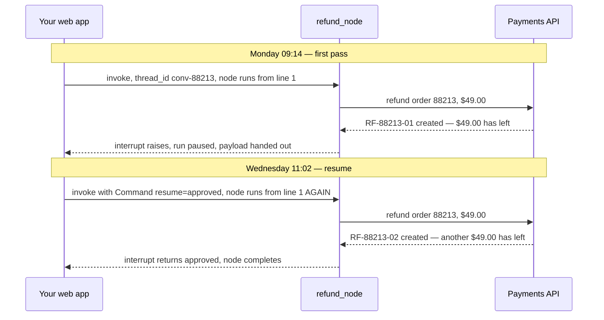
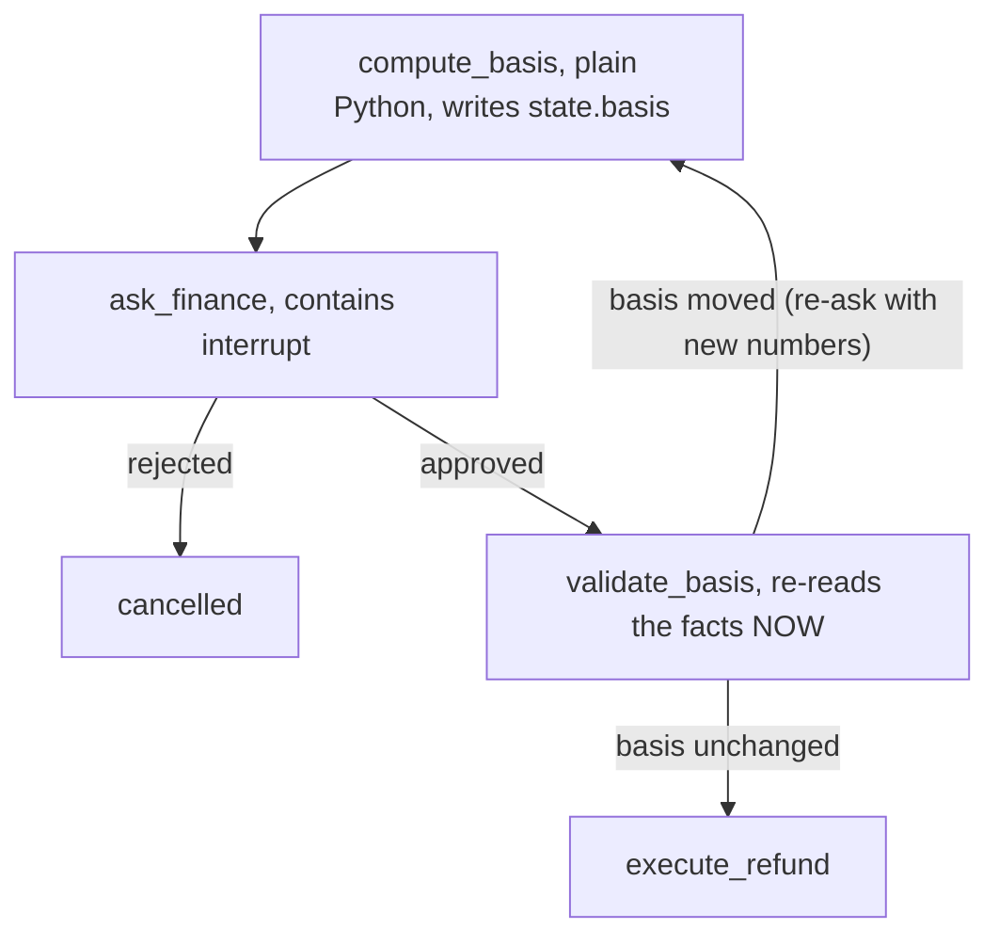
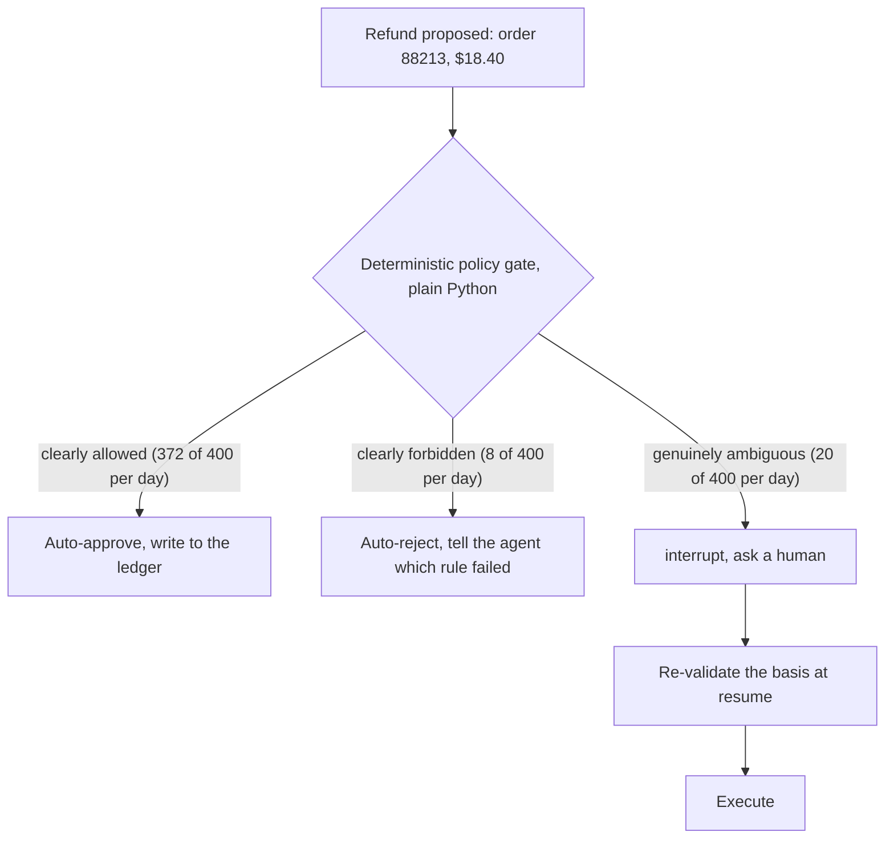

# 04 — Asking a Human and Waiting

By now you can build a graph, route between nodes, and save state so a conversation survives a restart
([01](01-graphs-and-state.md), [02](02-control-flow.md), [03](03-persistence.md)). This file is about
one thing your graph needs to do that a normal Python program cannot: **stop, ask a person a question,
and wait for the answer — for as long as it takes.**

That sounds small. It is the hardest structural problem in this primer, and the mechanism that solves
it comes with a gotcha that has cost real companies real money.

---

## Part 1 — Why a blocking call cannot do this

Here is the situation. Your support agent has worked out that a customer, Priya Raman, is owed a
refund on order #88213. The amount is $49.00. Your finance team has a rule — call it policy FIN-114 —
that any refund over $25.00 needs a human to sign off.

So you write the obvious thing:

```python
def refund_node(state):
    approval = ask_finance_and_wait(          # blocks until someone clicks Approve
        order_id="88213",
        amount_cents=4900,
    )
    if approval.approved:
        payments.refund("88213", 4900)
    return {"done": True}
```

`ask_finance_and_wait` posts to Slack and blocks on a queue read. Simple. Now let's see what happens
when you deploy it.

**It holds a worker for the entire wait.** Suppose your API runs on gunicorn with 16 synchronous
workers. Every conversation sitting in `ask_finance_and_wait` occupies one of those 16 forever. At 17
concurrent pending approvals you have zero workers left — and here is the punchline: the approval UI
finance uses to click Approve is served by the *same* pool. The system deadlocks itself. Scale it up
and it gets sillier: a desk that ends the day with 200 approvals pending overnight needs 200+
processes doing nothing, which at ~120 MB resident per Python worker is 24 GB of RAM whose entire job
is remembering 200 local variables.

**Your deploy kills all of them.** If you ship twice a day, every in-flight approval dies twice a day
— and there is no recovery, because nothing was ever written down. The state was in local variables
in a process you just replaced.

**The HTTP request dies first anyway.** Your load balancer has an idle timeout, typically 60 seconds.
Your approval takes 49 hours.

Step back and look at what we actually need. The requirement is not "block for a long time." It is:

> The program must **stop existing** while it waits, and be **reconstituted exactly where it left
> off** whenever the answer arrives — possibly on a different machine, after a deploy, days later.

That is not a shape a function call can have. A function call keeps its position in a call stack, and
a call stack lives in a process. This needs the position to live in a database.

That is what `interrupt()` is for.

---

## Part 2 — What `interrupt()` does

`interrupt()` is a function you call inside a node. When it runs, three things happen: the whole graph
run **stops**; everything (the state, which node was running, where it stopped) is **saved to your
checkpointer**; and a **payload of your choosing** is handed back out to whoever called
`graph.invoke()`. Then `graph.invoke()` returns, your HTTP handler returns, the worker is free, and no
process is holding anything.

```python
from langgraph.types import interrupt

def ask_finance(state):
    decision = interrupt({                      # <- the graph stops HERE
        "kind": "refund_approval",
        "order_id": "88213",
        "amount_cents": 4900,
        "question": "Approve a $49.00 refund to Priya Raman?",
    })
    # execution resumes here, later, with `decision` set to whatever you resumed with
    return {"approved": decision["approved"], "approver": decision["user"]}
```

The calling side sees the payload:

```python
config = {"configurable": {"thread_id": "conv-88213"}}
result = graph.invoke({"messages": [customer_message]}, config, version="v2")

if result.interrupts:
    pending = result.interrupts[0]
    post_to_slack(pending.value)                 # the dict you passed to interrupt()
    save_row(approval_id="apr_7c31", thread_id="conv-88213",
             interrupt_id=pending.id)            # you need BOTH of these later
```

`version="v2"` is the current return protocol; it is what gives you `result.interrupts` as a list of
`Interrupt` objects, each with a `.value` (your payload) and an `.id`. Pin it.

Two days later, finance clicks Approve, and you resume on the **same** `thread_id`:

```python
graph.invoke(Command(resume={"approved": True, "user": "j.okafor@corp.com"}), config, version="v2")
```

Inside the node, `interrupt(...)` now **returns** `{"approved": True, "user": "j.okafor@corp.com"}`,
and execution carries on from there.

Between Monday 09:14 and Wednesday 11:02 there was no process, no worker, no open connection, and no
memory held. There was a row in Postgres. You can redeploy, scale to zero, and restore from a
snapshot in between, and the resume still works.

### Why the pause survives: the checkpointer is doing all the work

Say this plainly, because people get it wrong: **`interrupt()` does not store anything. The
checkpointer does.** It is a control-flow signal; the durability comes entirely from the checkpointer
you configured in [03](03-persistence.md). The consequences are direct:

- **No checkpointer at all.** A pause you can never resume — there is no saved state to resume *from*.
- **`MemorySaver`.** Survives within the process, not a restart, a deploy, or a second replica. Fine
  for tests; wrong for anything with a human in it, because humans outlast your deploy cadence.
- **A real store (`PostgresSaver`, or the Agent Server's).** Now the pause is a durable fact.

The handle is the `thread_id`. Lose it and the conversation is **orphaned** — the state exists and
nothing can address it. So every notification and every row in your approvals table must carry
`thread_id` *and* the `interrupt.id`. Keep your own table, something like
`(approval_id, thread_id, interrupt_id, asked_at, status)`, because you will need to answer "what is
pending?" and LangGraph will not answer that for you.

The upside: **a paused run costs storage, not compute.** Those 200 overnight approvals are 200 rows,
not 200 workers. That is the trade — you gave up the convenience of a call stack and bought back your
worker pool.

---

## Part 3 — The gotcha that will refund your customer twice

You met the shape of this in [03, Part 5](03-persistence.md): a node that does not finish re-runs from
its first line. There it was triggered by a crash or a retry, which at least feels like an accident.
Here it is triggered by **normal operation**, every single time — which is why this is the most
important section in this file.

`interrupt()` pauses by **raising a special exception**. There is no coroutine suspended mid-function,
no saved program counter, no continuation: the runtime catches that exception, writes a checkpoint,
and hands control back. So **on resume, the node runs again from its very first line**, and when
execution reaches the `interrupt()` call the second time, instead of raising, it returns your resume
value.

Now look at this node — the version almost everyone writes first — and trace it against the clock:

```python
# BROKEN. Read the trace below before you copy this shape anywhere.
def refund_node(state):
    receipt = payments.refund("88213", 4900)          # side effect ABOVE the interrupt
    decision = interrupt({"question": "Approve the $49.00 refund?",
                          "receipt": receipt.id})
    if not decision["approved"]:
        payments.void(receipt.id)
    return {"receipt_id": receipt.id}
```



Priya received $98.00 for a $49.00 refund. And notice how well it hides: the *first* refund happened
before anyone approved anything, and the *second* one happened right after an approval, so your audit
log shows a perfectly ordinary approved refund. The extra $49.00 is only visible in the payments
provider, under a reference number your graph never returned.

### The rule

**A node that contains `interrupt()` must do nothing but ask.** No writes, no payments, no emails, no
ticket creation, no `INSERT`. Read-only lookups are acceptable if they are cheap, because they will
run twice.

The fixed version splits the ask from the act:

```python
def ask_finance(state) -> Command:
    """Asks. That is all it does. Safe to run any number of times."""
    decision = interrupt({
        "kind": "refund_approval",
        "order_id": state["order_id"],
        "amount_cents": state["refund_cents"],
        "question": f"Approve a ${state['refund_cents'] / 100:.2f} refund?",
    })
    if decision["approved"]:
        return Command(goto="execute_refund", update={"approver": decision["user"]})
    return Command(goto="cancelled", update={"reject_reason": decision.get("reason", "")})


def execute_refund(state) -> dict:
    """A separate node. Runs once, after approval. Never replayed by an interrupt."""
    receipt = payments.refund(
        state["order_id"], state["refund_cents"],
        # Belt and braces: if infrastructure retries this node, the provider dedupes
        # on this key. The approval id makes it unique per human decision.
        idempotency_key=f"refund:{state['order_id']}:{state['approval_id']}",
    )
    return {"receipt_id": receipt.id}
```

Two nodes instead of one. The asking node is replay-safe by construction, because it contains nothing
that can happen twice.

Three smaller rules follow from the same mechanism:

- **Never wrap `interrupt()` in a bare `except`.** The pause *is* an exception, so
  `try/except Exception` swallows it and your graph sails past an approval nobody gave. Catch specific
  types, or keep the `interrupt()` outside the `try`.
- **Never make the number or order of `interrupt()` calls in a node conditional.** Resume values match
  `interrupt()` calls **by index**. Change the count between pause and resume and the answers land
  against the wrong questions, silently. More on this below.
- **Only pass JSON-serialisable payloads.** The payload gets checkpointed. A closure or a live DB
  handle fails at pause time — which is to say, in production, at the worst possible moment.

---

## Part 4 — Four things you will actually use this for

### Pattern 1 — approve or reject

The base case, and you have already seen it: the `ask_finance` / `execute_refund` pair above. A human
says yes or no, and the asking node routes with `Command(goto=...)`. One refinement worth adding —
annotate the return type as `Command[Literal["execute_refund", "cancelled"]]`. LangGraph reads that
`Literal` to learn which edges the node can take, so the compiled graph knows about both targets
without you declaring the edges separately.

### Pattern 2 — let the human edit the action before it runs

The agent proposes a $49.00 refund, but order #88213 shipped on Tuesday and Silver-tier returns
deduct $8.50 of return shipping. The correct figure is $40.50; the agent read a stale order status.

You could reject — but then the agent, having learned nothing, proposes $49.00 again. You have built
an infinite loop with a human inside it. So let the approver supply the missing fact:

```python
def ask_finance_editable(state) -> Command:
    proposed = {"amount_minor_units": 4900, "reason_code": "cancelled_before_shipment"}

    answer = interrupt({"kind": "refund_approval", "proposed": proposed,
                        "editable_fields": ["amount_minor_units", "reason_code"],
                        "question": "Approve as proposed, edit the amount, or reject."})

    if not answer["approved"]:
        return Command(goto="cancelled")

    amount = int(answer.get("edits", {}).get("amount_minor_units",
                                             proposed["amount_minor_units"]))

    # The approver is now an input source. Validate them exactly as you would
    # validate a model-supplied argument: a typo of 405000 must not refund $4,050.
    if not 0 < amount <= state["order_total_cents"]:
        return Command(goto="ask_finance_editable",
                       update={"error": f"{amount} is outside 1..{state['order_total_cents']}"})

    return Command(goto="execute_refund", update={"refund_cents": amount})
```

That validation is not paranoia. The edit path widens your input surface from "things a model
proposed" to "things a model proposed, plus whatever a tired human typed into a Slack modal at
17:55." Clamp both.

### Pattern 3 — ask a clarifying question

Sometimes the missing fact is not an approval; it is something only the customer knows. Priya has two
cards on file and the agent needs to know which one to refund. You can put the `interrupt()` straight
inside a tool:

```python
@tool
def choose_refund_destination(order_id: str) -> str:
    """Ask the customer which payment instrument to refund to.

    Use this only when the order has more than one instrument on file.
    """
    instruments = billing.instruments_for_order(order_id)   # read-only, safe to replay
    if len(instruments) == 1:
        return instruments[0].id

    answer = interrupt({"kind": "choose_instrument",
                        "question": "Which card should we refund?",
                        "options": [{"id": i.id, "display": i.display} for i in instruments]})
    return answer["instrument_id"]
```

Two things to notice. The call above the `interrupt()` is a *read*, so replaying it is harmless — this
is exactly the exception the rule allows. And the person answering is the customer, who is probably
sitting in a chat window right now. That changes the calculus, and the last section comes back to it.

### Pattern 4 — gate a tool call without touching the tool

Patterns 1–3 all put `interrupt()` in code somebody has to remember to write. There is a version where
the approval is declared centrally, next to the policy, and applies to a tool whose author never
thought about approvals at all:

```python
from langchain.agents import create_agent
from langchain.agents.middleware import HumanInTheLoopMiddleware

agent = create_agent(
    model="claude-sonnet-4-6",
    tools=[lookup_order, issue_refund, reset_credentials],
    middleware=[HumanInTheLoopMiddleware(interrupt_on={
        "issue_refund": True,                          # always pause and ask
        "reset_credentials": {"allow_edit": True},      # ask, and let the approver fix the args
    })],
    checkpointer=checkpointer,
)
```

Now every `issue_refund` the model proposes pauses before the function body runs, and the team that
owns `issue_refund` cannot forget the gate, because the gate is not in their file.

One real trap: `HumanInTheLoopMiddleware` matches on the tool's **name** — for a `@tool` function,
the function name. Rename `issue_refund` to `submit_refund` and the gate silently stops applying.
Nothing errors. Write a test asserting that the set of gated names equals the set of tools that can
move money, and let it fail the build when they diverge. Middleware gets its proper treatment in
[05](05-agents-and-tools.md).

---

## Part 5 — Approvals go stale between the ask and the execute

Everything so far assumed the world stands still between the question and the answer. It does not,
and this is the failure mode that catches teams who got everything else right.

Concretely. On **Monday 09:14** the agent proposes a full $49.00 refund on order #88213, and it is
right to: the order is `awaiting_pickup` at the Reno warehouse so nothing has shipped, Priya is on the
Silver tier whose policy allows a full pre-shipment cancellation with no fee, invoice `inv_77120` has
$0.00 of credits applied, and there are no open disputes.

The approver is out Monday afternoon and all of Tuesday. They click Approve on **Wednesday 11:02** —
49 hours and 48 minutes later. In between:

| When | What changed | Effect on the refund |
|---|---|---|
| Tue 06:40 | The warehouse released the hold and the order shipped | It is now a *return*, not a cancellation. Silver returns deduct $8.50 of return shipping. |
| Tue 14:10 | Priya downgraded to Free tier, and billing auto-issued a $12.00 prorated credit against `inv_77120` | $12.00 of the money is already back with her. |
| Tue 21:35 | Priya filed a chargeback with her bank for the same $49.00 | If you refund now you pay twice — once by refund, once when the chargeback settles. And a refund issued after a chargeback usually cannot be pulled back. |

Do the arithmetic. The correct refund on Wednesday is $49.00 − $8.50 − $12.00 = **$28.50**, and even
that should wait for the dispute to resolve. Executing the approved $49.00 overpays by $20.50
immediately, and exposes you to a further $49.00 when the chargeback settles: **$69.50 of avoidable
loss on a $49.00 order.**

It is tempting to say "the human approved $49.00, so paying $49.00 is correct — we did what we were
told." That is wrong, and it is worth being precise about why.

> An approval is not a permission token. It is a **statement about a world state.** What the approver
> actually said was: *"given that this order is unshipped, this customer is Silver, no credits have
> been applied and there is no dispute — yes, refund $49.00."* Every one of those clauses is now
> false. The approval was answering a question you are no longer asking.

### The fix: record the basis, re-check it at resume

Write down the facts the decision turned on, show them to the approver, and re-read them before you
act. If they moved, the approval is void.

```python
from dataclasses import dataclass, asdict

@dataclass(frozen=True)
class RefundBasis:
    """The facts the approval decision depends on. If any of these change,
    the approval is meaningless and must be re-asked."""
    order_status: str            # "awaiting_pickup"
    customer_tier: str           # "silver"
    credits_applied_cents: int   # 0
    open_disputes: int           # 0
    policy_max_refund_cents: int # 4900

def read_basis(order_id: str) -> RefundBasis:
    """One pass over orders, billing, disputes and policy. Reads only, no writes."""
```

Then shape the graph so the basis is captured *before* the asking node, so it is committed to state
and does not get re-read by the interrupt replay:



```python
def compute_basis(state) -> dict:
    """Its output is checkpointed, so the interrupt replay inside ask_finance
    cannot overwrite Monday's basis with Wednesday's values."""
    basis = read_basis(state["order_id"])
    return {"basis": asdict(basis), "refund_cents": basis.policy_max_refund_cents}


# ask_finance is unchanged, except that it now puts state["basis"] in the interrupt
# payload — so the approver sees exactly the facts we re-check on their behalf.


def validate_basis(state) -> Command:
    fresh = asdict(read_basis(state["order_id"]))
    if fresh != state["basis"]:
        moved = {k: (state["basis"][k], fresh[k]) for k in fresh if fresh[k] != state["basis"][k]}
        # {"order_status": ("awaiting_pickup", "shipped"),
        #  "customer_tier": ("silver", "free"),
        #  "credits_applied_cents": (0, 1200), "open_disputes": (0, 1)}
        return Command(goto="compute_basis",
                       update={"stale_approval": {"voided": state["approval_id"], "moved": moved}})
    return Command(goto="execute_refund")
```

Because `validate_basis` routes back to `compute_basis`, the re-ask carries Wednesday's numbers:
$28.50, order shipped, dispute open. The approver now gets to make the decision they would have made
if they had been asked on Wednesday — which is probably "hold until the chargeback resolves."

Two honest caveats. **You cannot fingerprint everything** — comparing the entire customer record means
every unrelated edit voids every approval and your approvers revolt, so pick the facts the decision
actually turns on. That set is small, and naming it is a useful exercise in itself: if you cannot say
what an approval depends on, you do not know what you are approving. And **add a blunt TTL as a
backstop** — anything approved more than, say, 4 hours after it was asked gets re-asked regardless of
the basis, because there will always be a fact you forgot to fingerprint. Pick the TTL from how fast
your domain moves, not from the approval SLA.

---

## Part 6 — Multiple interrupts, and resuming the right one

Two situations get conflated here, and they behave differently.

### Two nodes pausing in parallel

Suppose a conversation needs both a refund approval (finance) and a credential reset approval
(identity), and you fanned out to both with `Send` ([02](02-control-flow.md)). Both hit `interrupt()`.
The run surfaces **both** payloads, and you resume **all of them together**, keyed by interrupt id:

```python
result = graph.invoke(inputs, config, version="v2")

for pending in result.interrupts:
    route_to_approver(thread_id="conv-88213",
                      interrupt_id=pending.id,      # needed to answer the right question
                      payload=pending.value)

# ... later, once both approvers have responded ...
graph.invoke(Command(resume={
    "b3f1c2…": {"approved": True,  "user": "j.okafor@corp.com"},     # the refund
    "9ad07e…": {"approved": False, "reason": "customer unverified"},  # the credential reset
}), config, version="v2")
```

The ids are opaque strings — do not parse them, just carry them. Note the operational consequence:
you cannot resume half of this, so your approvals UI has to hold the first answer until the second
arrives, and the SLA for the pair is the *slower* approver. If that is unacceptable, do not fan out —
sequence them so each can proceed independently.

### Two interrupts inside one node

This is where the index-matching rule bites. Resume values are matched to `interrupt()` calls by
**position** within a task. So this is broken:

```python
# BROKEN — the number of interrupts depends on state, which can change between passes.
def ask_approvals(state):
    if state["refund_cents"] > 20_000:
        cfo = interrupt({"question": "CFO sign-off for a refund over $200?"})   # #1, sometimes
    finance = interrupt({"question": "Finance approval?"})                      # #2, or #1
```

On the first pass `refund_cents` is 25,000, so two interrupts are raised and you collect two answers.
Before you resume, an upstream correction drops the refund to 4,050. Now the node replays, the branch
is not taken, there is exactly one `interrupt()` call — and it receives the value at index 0. The
CFO's answer to *"CFO sign-off?"* is handed to the finance question. No exception, no warning, just a
wrong answer to a question nobody asked.

The fix is the same one as everywhere else in LangGraph: **one `interrupt()` per node, and let edges
express the branching.**

```python
def ask_cfo(state) -> Command:
    d = interrupt({"question": "CFO sign-off for a refund over $200?"})
    return Command(goto="ask_finance" if d["approved"] else "cancelled")

builder.add_conditional_edges(
    "compute_basis",
    lambda s: "ask_cfo" if s["refund_cents"] > 20_000 else "ask_finance",
    ["ask_cfo", "ask_finance"],
)
```

Same behaviour, and now the branching is in the graph where you can see it. It is also why you must
never write a `while True:` validation loop around `interrupt()` — the interrupt count becomes
genuinely unpredictable. Use a validation node and a conditional edge back, exactly as
`validate_basis` does above.

---

## Part 7 — What the approver actually needs to see

Treat this as a design requirement, not UX polish, because the reasoning is mechanical:

> The interrupt payload is the **only** thing the approver has. If a fact is not in the payload, the
> approver cannot use that fact. A payload of `{"question": "Approve?"}` does not create an approval
> — it creates a rubber stamp, and a rubber stamp is *worse than no control*, because it manufactures
> a paper trail that says "reviewed."

So the payload is an interface, and it needs seven things.

1. **The exact amount, in minor units and as a display string** — `{"minor_units": 4050, "currency":
   "USD", "display": "$40.50"}`. The minor units are what the machine acts on, the display string is
   what the human read, and storing both lets your audit log prove they matched. "About $40" is not
   an amount.
2. **The destination, described well enough to tell it apart from the alternatives** — not "the
   customer's card" but `"Visa ending 4021, added 2024-11-08"`, because Priya also has a Mastercard
   ending 8890 and refunding the wrong one creates a second support ticket.
3. **The timing and the irreversibility window** — `"settles in 5-7 business days, recallable for 30
   minutes after submission, not after."` An approver who thinks something is reversible approves
   differently from one who knows it is not.
4. **A reference and an idempotency key** — `"will_appear_as": "RF-88213-01"` so the approver can find
   it afterwards, and `"idempotency_key": "refund:88213:4050:apr_7c31"` so the same approval cannot
   fire twice.
5. **How to undo it, or an explicit statement that you cannot** — `"Void within 30 minutes at
   /refunds/RF-88213-01/void. After that: none."` Silence reads as "probably reversible."
6. **The facts the decision turns on** — the `basis` object from the previous section, which does
   double duty as what the approver reasons over and what you re-check at resume, so the two cannot
   drift apart.
7. **Who is asking and under which rule** — `"asked_by": "billing_specialist"`, `"policy_rule":
   "FIN-114: refunds over $25.00 require finance approval"`. Approvers who know which rule fired make
   better decisions, and they are the people who will tell you the rule is miscalibrated.

Two constraints on top of that. **Keep secrets and unnecessary PII out** — the payload is checkpointed
and usually logged and traced, so use `{"id": "cus_4021", "display": "P. Raman"}`, not the customer
record. And **version the schema** — your approval UI, your Slack notification and your audit log all
read this dict, which makes it an API. Put `"schema_version": 3` in it.

---

## Part 8 — When you should not use `interrupt()`

`interrupt()` is the right tool for a narrow shape of problem. Two common cases where reaching for it
is a mistake.

### When the person is already sitting there waiting

Priya is in a live chat. The agent needs to know which of her two cards to refund, and she will
answer in about eight seconds.

`interrupt()` will work. It will also cost a checkpoint write, an ended run, a round trip out through
your API and back, and a full re-execution of the asking node — all to survive a failure window eight
seconds wide. You bought durability you had no use for. The simpler thing is to just *ask in the
conversation*: the agent's turn ends with the question, the customer's next message carries the
answer, and the conversation state was already durable per turn thanks to the checkpointer.

The line to test against is sharp:

> Can the answer arrive **after this HTTP request is dead, or after this process is gone?** If yes,
> you need `interrupt()`. If no, you do not.

An approval by a *different person*, on their own schedule, always crosses that line. A clarification
from the person who is currently typing usually does not — though if your "chat" is email or SMS, the
person typing might answer tomorrow and you are back to needing `interrupt()`. Judge by the channel,
not the role.

None of which is a prohibition: Pattern 3 above is a good design, and interrupt-inside-a-tool is often
the cleanest way to say "this tool needs one more fact." The point is to notice you are *choosing*
durability, rather than reaching for `interrupt()` because it is the HITL feature and this feels like
HITL.

### When a deterministic check should be making the decision

Look at the actual distribution of what you are sending to humans. A plausible refund desk sees 400
approval requests a day, and they are not evenly interesting:



**The auto-approve band** is Gold tier, order shipped inside the 30-day window, refund at or under
$25.00, no refunds in the last 90 days, no open dispute. There is no judgement in that — you wrote the
rule down, and a human comparing five numbers to five thresholds adds nothing but delay.

Sending them to a human anyway does not just add latency; it destroys the control. Suppose your
approver has 40 minutes a day for approvals. Across 400 requests that is 2,400 seconds ÷ 400 =
**6 seconds each**, and the 8 genuinely dangerous ones get the same 6 seconds as the 372 obvious ones.
At a 99.5% approve rate humans stop reading — approval fatigue, a well-documented failure mode rather
than a character flaw. Gate first and the same 2,400 seconds over 20 requests is **120 seconds each**.
Six seconds of attention became two minutes, for free, by not asking questions you already knew the
answer to.

**The auto-reject band** is a refund larger than the order total, an order belonging to a different
customer, a return window closed six months ago, a fourth refund in 30 days. Do not ask a human
whether to violate policy — under time pressure someone eventually says yes, and now the violation has
a signature on it. Reject in code and return the failing rule to the agent so it can explain the
outcome to the customer.

The underlying principle: a rule written in a prompt is a suggestion, a rule written in a check is
enforced — and a rule delegated to a fatigued approver at six seconds per decision is closer to a
suggestion than you would like.

### One more thing you are signing up for

`interrupt()` turns your agent into a workflow engine, and workflow engines have parts you now own: a
queue of pending approvals, notification delivery, SLA timers, escalation when the timer fires, TTLs
on abandoned threads, and — the one people forget — an **index of paused threads so a human can find
them.** Skip that last one and you get the quietest production failure in this file: the thread
pauses, the Slack message scrolls away, nothing ever resumes. No error, no alert, no timeout. The
refund simply never happens, the customer never hears back, and your dashboards are green.

---

## What to take away

1. **`interrupt()` exists because a blocking call cannot survive a deploy.** The requirement is not
   "wait a long time," it is "stop existing and be reconstituted elsewhere" — which needs the
   program's position stored in a database, and that is what a checkpoint is.
2. **The durability is the checkpointer's, not `interrupt()`'s.** No checkpointer, no resumable pause;
   `MemorySaver` gives you a pause that dies with the process, and humans outlast processes.
3. **A node containing `interrupt()` re-runs from its first line on resume,** so it must do nothing but
   ask. Move every side effect into a separate node, and put an idempotency key on the one that moves
   money anyway.
4. **Never make the count or order of `interrupt()` calls conditional.** Resume values are matched by
   index. One interrupt per node, and let edges do the branching — the same conditional-edge pattern
   from [02](02-control-flow.md).
5. **An approval is a statement about a world state, not a permission token.** Record the facts the
   decision turned on, show them to the approver, re-read them before you execute, and void the
   approval if they moved.
6. **The interrupt payload is the approver's entire world.** Exact amount, destination, timing and
   irreversibility, reference and idempotency key, how to undo, the basis, and which rule fired.
   Version it, and keep secrets out of it, because it is checkpointed and logged.
7. **Do not ask a human what a check can decide.** Auto-approve the clearly allowed, auto-reject the
   clearly forbidden, send humans only the residual. That is the difference between an approver with
   two minutes per decision and one with six seconds.
8. **Do not use `interrupt()` for a question the person in front of you will answer in eight
   seconds.** The test is whether the answer can arrive after the request or the process is gone.

---

## Where to go next

[05 — Agents, Tools, and Controlling Them](05-agents-and-tools.md) covers the agent loop, `@tool`, and
middleware — including `HumanInTheLoopMiddleware` from Pattern 4 in its proper context, and the general
principle that a check beats a prompt. The dense reference version of this file's material is
[15 — Human-in-the-Loop & Interrupts](../15-human-in-the-loop-and-interrupts.md).
