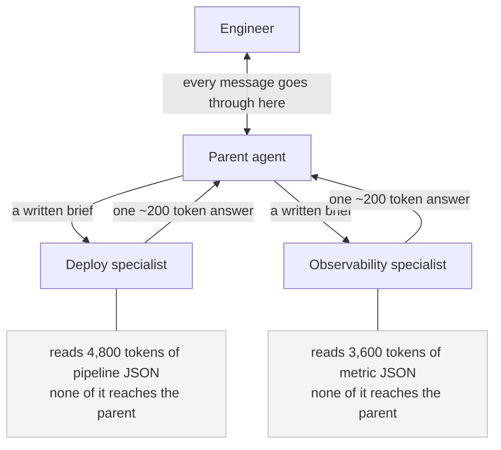
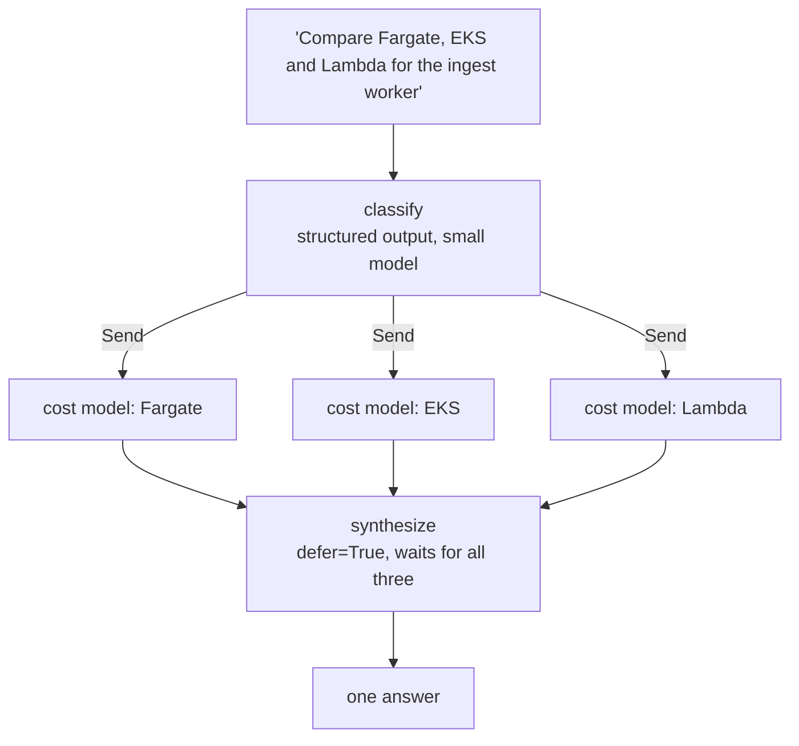

# 06 — When One Agent Isn't Enough

You now have an agent: a model in a loop with tools ([05](05-agents-and-tools.md)). It reads a
request, asks for a tool, reads the result, asks for another, and eventually writes an answer.

This file is about the moment somebody in a meeting says *"we should split this into multiple
agents."*

That decision is the most commonly made and most commonly regretted piece of architecture in this
space. So we're going to spend the first two Parts trying to talk you out of it — with arithmetic,
not vibes. Then we'll look at the four patterns that actually exist, count what each one costs, and
name the costs that never make it into anyone's estimate.

For a single design problem worked all the way down — one product, one measured traffic mix, one
topology chosen and defended against the alternatives — read
[Supervisor vs. Swarm](../../AISystemDesign/SupportAgent/EXPLAINED.md). This file is the survey.
That one is the derivation.

---

## Part 1 — The example we'll use throughout

You're building an internal assistant for a platform engineering team. Engineers ask it questions in
Slack. It has read access to your deploy pipeline, your metrics store, your Terraform state, your
data warehouse, and your secret scanner.

Five areas of knowledge, each with its own rules — how to interpret a stuck deploy, what your SLOs
actually are, which Terraform changes are safe, how the warehouse's freshness contracts work, what
counts as a leaked credential. Written out as prompt text, they come to this:

| Area | Rules, in tokens |
|---|--:|
| Deploys and pipelines | 5,400 |
| Observability and SLOs | 6,200 |
| Infrastructure and Terraform | 3,900 |
| Data warehouse and schemas | 4,600 |
| Security and secrets | 2,900 |
| **All five** | **23,000** |

Two real conversations. Hold onto both — every cost comparison in this file comes back to them.

### Conversation A — one area, four turns

```
Engineer: The nightly job for analytics.orders_daily failed again.
AI:       Run 20713 failed at 03:14 UTC. The model itself is fine — its
          upstream stg_payments returned 0 rows. Want me to trace that?
Engineer: yes
AI:       stg_payments reads raw.payments_stream, which last landed at
          01:02 UTC and then stopped. The Fivetran connector errored with
          "auth token expired". I can reauthorize it, or backfill from the
          read replica. Which?
Engineer: backfill from the replica
AI:       Queued backfill bf-4471 for 01:02–06:00 UTC, ~14.2M rows,
          ETA 22 minutes, then orders_daily reruns automatically.
Engineer: will that beat the 07:00 exec dashboard refresh?
AI:       Yes — backfill finishes ~06:34, orders_daily averages 9 minutes,
          so ~06:43. Seventeen minutes of slack.
```

One area (data warehouse). Four turns. **Each turn depends on the answer to the previous one** — the
assistant genuinely cannot finish in one shot, because it has to ask. The asking *is* the work.

### Conversation B — three areas, one shot

```
Engineer: dpl-88x has been "deploying" for 40 minutes, checkout p99 is up
          to 4.1s, and my terraform plan wants to destroy redis-prod-cache.
          Are these related?
AI:       No, three separate things:
          1. dpl-88x is waiting on a pod disruption budget — the checkout
             deployment has minAvailable: 9 of 9 replicas, so nothing can
             be evicted. Drop it to 8 and the rollout proceeds.
          2. The p99 is the same PDB: you're running 9 pods on 8 nodes'
             worth of headroom since the node pool scaled down at 13:40.
          3. Unrelated. redis-prod-cache was imported into state in March
             and your branch predates the import. Rebase on main.
```

Three areas. One turn. The three problems have almost nothing to do with each other, so you could
work on all three at once. Here, decomposition is the work.

**These two shapes want opposite architectures.** That tension is the whole subject.

---

## Part 2 — Start by not doing this

The baseline is one agent with every tool and every rule in one prompt.

```python
from langchain.agents import create_agent

agent = create_agent(
    model="claude-sonnet-4-6",
    tools=[get_deploy, get_pods, get_slo, query_metrics, terraform_plan_diff,
           get_run_failure, get_model_lineage, get_source_freshness,
           queue_backfill, scan_secrets],
    system_prompt=(DEPLOY_RULES + OBSERVABILITY_RULES + INFRA_RULES +
                   WAREHOUSE_RULES + SECURITY_RULES),   # all 23,000 tokens
)
```

**Both conversations above are handled well by this.** Not adequately — well. A capable model with
good tools handles Conversation A's four dependent turns naturally, and it can emit three parallel
tool calls to start on Conversation B's three problems simultaneously.

So why does anyone build anything else? Three reasons get given. Let's take them one at a time,
because two of them dissolve.

### Reason 1: "the prompt is too big"

Let's price it. Say the assistant needs 11 model calls to get through Conversation A (we'll derive
that number in Part 7). Every one of those calls re-sends the entire system prompt, because that
is how the API works — there is no "you already know the rules" mode.

```
one agent:   23,000 rule tokens × 11 calls = 253,000 in  →  × $3.00/1M = $0.759
specialist:   4,600 rule tokens × 11 calls =  50,600 in
              plus one 900-token triage    =  51,500 in  →  × $3.00/1M = $0.155
```

A saving of $0.60 per conversation, or 80% of the prompt cost. That looks like a strong argument for
splitting.

**It isn't, because one line of middleware recovers the whole thing.** Providers cache a stable
prompt prefix. The 23,000-token rules block is byte-identical on every call, so you pay full price
once to write it into the cache and about a tenth of the price to read it back:

```python
agent = create_agent(model="claude-sonnet-4-6", tools=tools,
                     middleware=[AnthropicPromptCachingMiddleware()])
```

At a cache-write rate of $3.75 per million and a cache-read rate of $0.30 per million:

```
write, 1 call :  23,000 × $3.75/1M = $0.0863
read, 10 calls: 230,000 × $0.30/1M = $0.0690
                             total = $0.155
```

**$0.155 with caching versus $0.155 with a specialist.** The token argument for splitting your agent
is answered, exactly and completely, by a middleware you should be using anyway.

One piece of Reason 1 survives, and it's worth naming honestly: **caching fixes the cost of a huge
prompt, not the quality cost.** A model reading 23,000 tokens of rules of which 19,000 are irrelevant
to this question does get worse — it picks up policy from the wrong section, it hedges, it drags in
constraints that don't apply. That effect is real, and caching doesn't touch it. But notice the fix
for it is *loading fewer rules*, which is the Skills pattern in Part 6, and that's still one agent.

### Reason 2: "we want parallelism"

Weaker than it looks, because a single agent already parallelises.

Modern models emit several tool calls in one response. For Conversation B, the baseline agent's first
model call can request `get_deploy(dpl-88x)`, `query_metrics(checkout p99)` and
`terraform_plan_diff()` together. All three tools execute concurrently. The second model call sees
all three results.

So the single agent finishes Conversation B in three model calls: fan out, read, answer. A router
architecture, as we'll count in Part 7, needs five sequential calls. **The single agent is
faster.**

What a single agent genuinely cannot parallelise is *reasoning chains*. If each of the three problems
needs six dependent tool calls — where call four's arguments come from call three's result — the
single agent interleaves them in one linear conversation and every branch's noise is in the other
branches' context. That's the real limit, and it's a context problem, not a concurrency problem.

And if you want true fan-out without an agent boundary, you already know how
([02](02-control-flow.md)): a node that returns `Command(goto=[Send("worker", ...), ...])` starts one
copy of `worker` per task, and a node added with `defer=True` waits for all of them. One graph, one
prompt, three concurrent branches, no second agent anywhere.

### Reason 3: "five teams need to own five things"

This one is real, and it is not a technical argument at all.

The observability team owns the SLO rules. The data team owns the freshness contracts. They ship on
different weeks. Today they are editing the same Python string in the same file, and neither can test
a change without exercising the other's behaviour. Their eval sets are tangled. A bad merge in one
area silently degrades another.

**That is what genuinely forces an agent boundary: not the model, not the tokens, not the latency —
your org chart.** An agent boundary is a place where one team's prompt, tools, tests and release
cadence stop and another's begin. It buys independent ownership, and you pay for it in model calls,
latency, and interfaces to maintain.

> **If one team owns all five areas, stop here.** Turn on prompt caching, load rules on demand, use
> `Send` for fan-out, and go do something else. Everything from Part 3 onwards is complexity you
> would be paying for with nothing to show. The rest of this file is for the case where five teams own
> five areas and are tripping over each other.

---

## Part 3 — Pattern 1: Subagents, a specialist wrapped in a tool

**The problem it solves:** you want a specialist's work to happen *somewhere else*, so that its
churn — its eight tool calls, its 4,800 tokens of pipeline JSON, its false starts — never lands in
the context of whatever is talking to the user.

**The mechanism** is almost a joke in its simplicity. A specialist is an agent. You wrap it in
`@tool`. Now the parent agent cannot tell it apart from `get_deploy`.

```python
from langchain.agents import create_agent
from langchain.tools import tool

deploy_agent = create_agent(
    model="claude-sonnet-4-6",
    tools=[get_deploy, get_pods, get_pdb, get_rollout_events],
    system_prompt=DEPLOY_RULES,        # 5,400 tokens. Only deploys. This is the win.
)

@tool
def ask_deploys(brief: str) -> str:
    """Ask the deploy specialist about a pipeline or rollout.

    The specialist CANNOT see this conversation. Put everything it needs in
    `brief`: the deploy id, what the engineer observed, what you already ruled out.
    """
    result = deploy_agent.invoke({"messages": [{"role": "user", "content": brief}]})
    return result["messages"][-1].content

parent = create_agent(
    model="claude-sonnet-4-6",
    tools=[ask_deploys, ask_observability, ask_infra, ask_warehouse, ask_security],
    system_prompt="You are a platform assistant. Delegate to specialists. "
                  "Quote their identifiers and numbers verbatim.",
)
```

Read that docstring again — *"the specialist CANNOT see this conversation."* That single sentence is
the whole pattern, and it cuts both ways.

There is also a declarative route (`SubAgentMiddleware`, and `CompiledSubAgent` to register an
arbitrary compiled graph as a subagent) if you'd rather not hand-write the wrapper. The semantics are
the same.



### The worked example

Conversation B, deploy branch. The specialist runs three model calls:

```
call 1  in: 5,400 rules + 350 brief         =  5,750
call 2  in: 5,750 + 120 + 4,800 pod JSON    = 10,670
call 3  in: 10,670 + 110 + 1,900 PDB detail = 12,680
                          input processed   = 29,100 tokens
```

It returns 200 tokens: *"dpl-88x is blocked on the checkout PDB, minAvailable 9 of 9 replicas. Drop
to 8."*

Of that 4,800-token pod JSON, **the parent pays for zero tokens.** Under a single agent, those 4,800
tokens sit in the one context window and get re-sent on every subsequent call for the rest of the
conversation. Over the six calls that follow, that's 28,800 input tokens of JSON nobody needed after
call two.

That's the isolation win, and it compounds with conversation length. It's also why subagents handle
Conversation B well: three specialists churn in three separate windows, concurrently, and the parent
collects 3 × 200 = 600 tokens of summaries instead of 11,000 tokens of raw JSON.

### What breaks it

**You pay an extra model call per turn, in each direction.** One call for the parent to decide to
delegate. One more for the parent to read the answer and write a reply. On Conversation A that's
eight wasted calls across four turns, on a conversation where the routing decision was settled by the
first sentence.

**And you inserted a paraphraser between the specialist and the user.** The specialist produced:

> "Queued backfill bf-4471 for 01:02–06:00 UTC, ~14.2M rows, ETA 22 minutes."

The parent rewrites it in its own words and the engineer gets:

> "I've kicked off a backfill for the missing window, should be done shortly."

The job id is gone — the one thing the engineer needs in order to check on it. The window is gone.
"22 minutes" became "shortly". Paraphrasing layers are systematically worst at exactly the content
that matters most: identifiers, numbers, and caveats. You can patch it ("quote identifiers verbatim",
which is why that line is in the parent's prompt above) but you're patching a structural fact about
the design.

---

## Part 4 — Pattern 2: Handoffs, passing the floor instead of asking a question

**The problem it solves:** the parent agent in Part 3 spends two model calls a turn on a decision
that never changes, and garbles the answer on the way out. What if the specialist just talked to the
engineer directly, and *kept* talking to them?

**The mechanism** is a state variable and a tool that changes it. You met `Command` in
[02](02-control-flow.md); the new part is `graph=Command.PARENT`, which means "this jump applies to
the graph one level up, not the little subgraph I'm running inside."

```python
from typing import Annotated
from langchain.tools import tool, InjectedToolCallId
from langchain_core.messages import ToolMessage
from langgraph.types import Command

@tool
def transfer_to_observability(tool_call_id: Annotated[str, InjectedToolCallId]) -> Command:
    """Hand this conversation to the observability specialist."""
    return Command(
        goto="observability_agent",       # the node to run next...
        graph=Command.PARENT,             # ...in the parent graph, not this subgraph
        update={
            "active_agent": "observability",   # remembered across turns — the whole point
            "messages": [ToolMessage("Handed to observability",
                                     tool_call_id=tool_call_id)],
        },
    )
```

`active_agent` lives in your state with a *replace* reducer, not an append one — one specialist holds
the floor at a time ([01](01-graphs-and-state.md)). On the next turn, your entry node reads
`active_agent` and routes straight there. No classification call. The specialist is still holding the
floor.

### The worked example

Conversation A, turn 2. The engineer says "yes".

Under subagents, that costs: parent decides to delegate (1) + specialist works (3) + parent rewrites
the answer (1) = 5 calls.

Under handoffs, the warehouse specialist is already `active_agent`. The graph routes to it directly —
zero model calls spent deciding — it makes its two tool calls and answers in the engineer's face. **3
calls.** And the engineer gets "raw.payments_stream last landed at 01:02 UTC" rather than a
second-hand summary of it.

Turn 3 is the same. Turn 4 is the same. That is where handoffs win, and it's a large win, because
single-area follow-up turns are the bulk of most real traffic.

Clarification gets cheap in the same way. "I can reauthorize it, or backfill from the replica. Which?"
is just a turn. Under subagents, the specialist has to return "I need to know which remediation they
want" to the parent, which asks, which feeds the answer back down — a full round trip through a
middleman for one question.

### What breaks it

The pattern's weakness is not cost. It's that **you have decentralised control, and control is the
thing you most want centralised.**

**Policy scatters.** Suppose backfills over 10M rows need a data-oncall sign-off. The warehouse
specialist knows that — it's in `WAREHOUSE_RULES`. But the observability specialist can also trigger
a backfill when it finds a metrics gap, and the deploy specialist can replay a pipeline. So the rule
has to appear in three prompts. Which means, in practice, **it is enforced in zero places**, because
a rule in a prompt is a suggestion to a model, not a check. The first time an engineer says "just run
it, I'll take responsibility" and one of the three agrees, you have an incident and no code to point
at. This is not fixable by better prompt wording.

**Loops are unbounded.** Deploy says "that's an observability problem" and hands over. Observability
says "that's a deploy problem" and hands back. Nothing in the mesh is counting. To stop it you need
something *outside* the mesh tracking hops — which is starting to sound like a supervisor again.

**And handoffs are sequential by construction.** One specialist holds the floor. For Conversation B's
three independent problems, control has to visit three specialists one after another, even though
there are no dependencies between them. This is the pattern's worst case, and Part 7 prices it.

**One more that will surprise you in production: handoff amnesia.** When deploy hands to
observability, what does observability receive? Two obvious answers, both bad. *The whole message
history* — now observability re-reads 4,800 tokens of pod JSON it doesn't care about, and you've
destroyed the context isolation that justified separate agents in the first place. *Just the last
message* — now it has no idea what's been established and asks the engineer to start over. The fix is
neither: pass a **structured brief** with the goal, the facts a tool actually confirmed, and the
questions already asked with their answers. That last field is what stops the "I already told you
that" complaint.

---

## Part 5 — Pattern 3: Router, classify then fan out then synthesise

**The problem it solves:** some questions decompose cleanly, up front, into independent pieces.
"Compare Fargate, EKS and Lambda for the ingest worker" is three cost models that don't need to talk
to each other. You know the decomposition before you start, so you don't need an agent to discover
it — you need a classifier and a fan-out.

**The mechanism** is a classification step whose output is a list of destinations, `Send` to start one
copy of each, and a `defer=True` node that waits for all of them.

```python
from typing import Literal
from pydantic import BaseModel
from langgraph.types import Command, Send

class Route(BaseModel):
    destinations: list[Literal["deploys", "observability", "infra",
                               "warehouse", "security"]]

def classify(state) -> Command:
    # A small model with structured output. No tools, no loop — one cheap call.
    route = router_model.with_structured_output(Route).invoke(state["messages"])
    return Command(
        update={"routes": route.destinations},
        goto=[Send(d, {"task": state["messages"][-1].content}) for d in route.destinations],
    )

# defer=True is the load-bearing argument: this node does not run until every
# in-flight branch that leads to it has finished.
builder.add_node("synthesize", synthesize, defer=True)
```



### The worked example

Conversation B. The classifier returns `["deploys", "observability", "infra"]` in one call costing
about 900 input tokens and 30 output tokens — well under a tenth of a cent on a small model. Three
branches run concurrently. `synthesize` receives three ~250-token findings and writes the numbered
answer the engineer saw.

The router's edge over subagents is small but real: the classifier is a single cheap structured-output
call rather than a full agent turn, and when there's exactly one destination you can skip the
synthesis model call entirely and pass the specialist's answer straight through. That saves one call
per single-area turn.

### What breaks it

**No multi-hop.** The classification happens once, before any work. If branch two discovers that the
real question belongs to security, there's no mechanism to go there — the graph's shape was fixed at
classify time. Questions whose decomposition only becomes clear halfway through are the wrong shape
for a router.

**The classifier is a single point of failure with an amplifier attached.** A misclassification
doesn't cost you one cheap call, it costs you the entire fan-out running on the wrong question. In
Part 7's numbers, the classify call is well under 1% of the conversation's cost and everything
downstream of it is the other 99%. That asymmetry is exactly the argument for spending more on the
cheapest node than intuition suggests — see [07](07-production.md) and
[Model Tiering](../../AISystemDesign/ModelTiering/EXPLAINED.md).

**It re-classifies every turn.** Unlike handoffs, nothing is remembered. On a four-turn single-area
conversation you pay for four classifications to reach the same answer four times.

---

## Part 6 — Pattern 4: Skills, one agent loading knowledge on demand

**The problem it solves:** you wanted the prompt-size win from Part 2 without any of the
machinery. There is no second agent here at all. There's one agent, and a tool that loads a domain's
rules into its context when it turns out to need them.

```python
SKILLS = {"warehouse": WAREHOUSE_RULES, "deploys": DEPLOY_RULES,
          "observability": OBSERVABILITY_RULES, "infra": INFRA_RULES,
          "security": SECURITY_RULES}

@tool
def load_skill(area: str) -> str:
    """Load the detailed rules for one area. Load only what this question needs.
    Available: warehouse, deploys, observability, infra, security."""
    return SKILLS[area]

agent = create_agent(
    model="claude-sonnet-4-6",
    tools=[load_skill, get_deploy, query_metrics, get_run_failure, queue_backfill],
    system_prompt=(
        "You are a platform assistant. A one-paragraph summary of each area is below. "
        "Call load_skill before answering anything that needs an area's detailed rules.\n"
        + AREA_SUMMARIES        # ~900 tokens: enough to route, not enough to answer
    ),
)
```

The base prompt carries 900 tokens of area summaries instead of 23,000 tokens of rules — enough for
the model to know *which* skill it needs, not enough to answer. Loading is a tool call, so it costs
one extra model call in the loop, once.

### The worked example

Conversation A, turn 1: the agent calls `load_skill("warehouse")`, gets 4,600 tokens back, and
proceeds. Turns 2, 3 and 4 need nothing new — the rules are already in the message history. So this
is the cheapest pattern for repeated single-area work, and it involves no agent boundary, no handoff
protocol, no brief schema, and no second prompt to own.

### What breaks it

**Accumulation.** The loaded rules are in the message list, and the message list is re-sent on every
call, forever. On turn 4 of Conversation A you are paying for the 4,600-token warehouse skill for the
fourth time. That's fine. But on Conversation B you load three skills — 5,400 + 6,200 + 3,900 =
15,500 tokens — and every call for the rest of the conversation carries all 15,500, including the
observability rules that stopped being relevant four calls ago.

This is the pattern that looks cheapest by call count and most expensive by token count, and if you
only measure calls you will not see it. Mitigations exist —
`ContextEditingMiddleware()` prunes stale tool results, and a summarisation pass will collapse old
turns — but they're mitigations, not a fix. The structural fact is that a skill you load never leaves.

**And it does nothing at all for Reason 3.** Five skills in one file, in one agent, owned by one
deploy. If your actual problem was five teams tripping over each other, skills have not helped you.

---

## Part 7 — Now count the cost yourself

Every number below comes from two stated assumptions. Check them and the rest follows.

**Assumption 1 — what a "call" is.** One request to the model. Tool executions are not calls; they're
cheap and they don't hit the model.

**Assumption 2 — how much work each turn needs.** Counting the actual tool sequences in Conversation
A, a specialist needs 3 model calls on turn 1 (emit tool, read result, emit second tool → answer),
3 on turn 2, 3 on turn 3, and 2 on turn 4. Total: **11 calls of genuine work.**

That 11 is the floor. Every pattern's total is 11 plus its overhead, and the overhead is the whole
story.

### Conversation A — four turns, one area

| Pattern | T1 | T2 | T3 | T4 | Total | Overhead |
|---|--:|--:|--:|--:|--:|---|
| One agent, all tools | 3 | 3 | 3 | 2 | **11** | none |
| Skills | 4 | 3 | 3 | 2 | **12** | 1 skill load, once |
| Handoffs | 4 | 3 | 3 | 2 | **12** | 1 triage, once |
| Router | 4 | 4 | 4 | 3 | **15** | 1 classify × 4 turns |
| Subagents | 5 | 5 | 5 | 4 | **19** | (1 route + 1 relay) × 4 turns |

Verify the totals against the floor: `11 + 1 = 12`, `11 + 4 = 15`, `11 + 8 = 19`. The overhead column
is the entire difference between these architectures on the most common shape of conversation.

Three things to take from this table.

**The single agent wins on call count.** It has no overhead because it has no coordination. If
somebody tells you multi-agent is cheaper, this is the row they didn't run.

**Stateful patterns cost one call more than the baseline; stateless ones cost four or eight more.**
Handoffs and skills pay their overhead once and remember the result. Router and subagents re-derive
the same routing decision on every single turn. `19 − 12 = 7`, and those 7 calls are: 4 relay calls
(one per turn) plus 3 redundant routing calls (turns 2 through 4 — turn 1's routing is work both
patterns must do).

**Handoffs' real advantage over the baseline is tokens, not calls.** 12 versus 11 calls is a loss.
But the handoff specialist carries 4,600 tokens of rules per call and the baseline carries 23,000 —
and, as Part 2 showed, prompt caching closes most of that gap too. Be honest with yourself about
which column you are actually trying to move.

### Conversation B — one turn, three areas

Now the shapes invert. Two numbers matter here and they're different numbers: **total calls** is what
you pay, **sequential calls** is what the engineer waits for.

| Pattern | Total calls | Sequential | What lands in the coordinating context |
|---|--:|--:|---|
| One agent, all tools | 3 | **3** | 11,000 tok of tool JSON + 23,000 tok of rules |
| Skills | 4 | 4 | 11,000 tok of JSON + 15,500 tok of loaded skills |
| Router | 10 | 5 | **600 tok of summaries** |
| Subagents | 10 | 5 | **600 tok of summaries** |
| Handoffs | 11 | **11** | 11,000 tok, if you pass history — or amnesia if you don't |

The derivations:

- **One agent:** call 1 emits three tool calls in parallel, call 2 reads all three results and emits
  two follow-ups, call 3 writes the answer. 3 calls, 3 sequential.
- **Router / subagents:** 1 classify or delegate call, then 3 + 3 + 2 = 8 specialist calls running
  concurrently, then 1 synthesis call. Total 10. Critical path = 1 + max(3, 3, 2) + 1 = **5**.
- **Handoffs:** 1 triage, then deploy does 3 work calls plus 1 call to decide to hand off, then
  observability does the same (4), then infra does 2 and answers. `1 + 4 + 4 + 2 = 11`, and every one
  of them is on the critical path because only one specialist holds the floor at a time.

**Handoffs are 11 sequential calls where a router is 5 — a 2.2× longer critical path** for work with
no dependencies in it. That is the clearest "wrong pattern for the shape" result in this file.

And notice what the parallel patterns actually won. Not latency against the baseline — 5 sequential
calls is *worse* than the baseline's 3, because a single agent parallelises its tool calls for free.
What they won is the last column: **600 tokens of distilled findings in the coordinating context
instead of 11,000 tokens of raw JSON.** That's the context isolation from Part 3, and it is the
honest reason to reach for these patterns. It matters more the deeper the specialist work goes: at
6 tool calls per branch instead of 3, the single agent's window fills with three interleaved
investigations and quality falls off, while three isolated windows each stay clean.

### The three results, stated plainly

1. **Stateful patterns win repeated single-area work.** 12 calls versus 19 — a 37% reduction
   (`(19−12)/19 = 36.8%`) — because the specialist or skill is already loaded and the routing decision
   is already made.
2. **Isolated patterns win multi-area work, on tokens.** 600 tokens in the coordinating window versus
   11,000. They do not win on call count and they may not win on latency against a single agent.
3. **Handoffs are the worst choice for multi-area work**, not marginally but structurally: 11
   sequential calls versus 5, because control is a single token one agent holds at a time.

And the uncomfortable one: **real traffic contains both shapes**, so any fixed choice is wrong for
part of it. That's the problem
[EXPLAINED.md](../../AISystemDesign/SupportAgent/EXPLAINED.md) exists to solve, and its answer —
separate the thing that governs from the thing that converses, because they happen at different
rates — is worth reading in full.

---

## Part 8 — The costs nobody budgets for

Three of them. None appear in the call-count tables and all three have ended projects.

### Every agent boundary is an interface you now version, test and observe

You did not add "a specialist". You added a public API with an untyped contract.

Concretely, `ask_deploys(brief: str) -> str` now needs its own eval set (does it answer deploy
questions correctly *given only a brief*?), a written contract for what a valid brief contains, a
test that the parent produces valid briefs, an owner for its prompt, a version, a deprecation story
for when its return shape changes, and per-agent tracing so that when a run fails you can tell
*which* agent failed instead of staring at one flat trace.

Multiply by five specialists. The rule of thumb: **budget the same effort per agent boundary that
you'd budget for a service boundary**, because that is what it is.

### Delegation quality is the silent failure

This is the one that will actually bite you, because it produces no error anywhere.

The specialist sees only the brief. If the parent writes:

> "Check on the deploy problem."

...then the deploy specialist has no id, no symptom, no timeline. It will not raise an exception. It
will not say "insufficient information". It will pick the most recent deploy, investigate it
competently, and return a confident, well-written, **wrong** answer. The parent has no way to know it
is wrong, so it relays it. The engineer acts on it.

There is no stack trace for this. Your error rate is 0%. Your traces are all green.

The mitigation is a **typed delegation contract** — stop passing prose:

```python
from pydantic import BaseModel

class DeployBrief(BaseModel):
    deploy_id: str                  # required. no default. cannot be forgotten.
    observed_symptom: str
    since: datetime
    already_ruled_out: list[str]
    expected_output: Literal["root_cause", "remediation", "both"]

@tool
def ask_deploys(brief: DeployBrief) -> str:
    """..."""
```

Now a brief without a deploy id fails validation before a single token is spent. You have converted a
silent quality failure into a loud, cheap, testable one. Do this at every boundary.

### Latency compounds multiplicatively

Chains of agents don't add latency, they multiply it, because each hop contains a loop. Four agents at
6 calls each, with a supervisor deciding between them:

```
supervisor decides                    1
agent A                               6
supervisor reads A, decides           1
agent B                               6
supervisor reads B, decides           1
agent C                               6
supervisor reads C, decides           1
agent D                               6
supervisor synthesises                1
                            total =  29 sequential model calls
```

At a modest 1.4 seconds per call that's `29 × 1.4 = 40.6` seconds of model time. Add a 300 ms tool
round trip before each of the 24 specialist calls — `24 × 0.3 = 7.2` seconds — and you're at **~48
seconds**.

A Slack thread has maybe eight seconds of patience before someone gives up and pages a human. You did
not build a slow feature; you built an unusable one, and no individual component is at fault. Each of
the four teams will correctly report that their agent responds in under 9 seconds.

The fixes are the obvious ones and you have to choose them deliberately: parallelise (a router's
critical path is 1 + 6 + 1 = 8 calls, not 29), flatten (fewer hops), or stream partial results so the
engineer sees progress. But the number to hold onto is that **a chain multiplies, so four agents is
not four times the latency of one — it's roughly five times, because of the supervisor's turns
between them.**

---

## Part 9 — Patterns compose

These four are not exclusive options on a menu. They nest, and the useful architectures usually do.

**The worked example: a subagent that is internally a router.** The parent calls
`ask_infra("compare Fargate, EKS and Lambda for the ingest worker")`. Inside that boundary, the infra
specialist is not an agent loop at all — it's the router from Part 5: a classifier that identifies
three platforms, three parallel cost-model branches, and a `defer=True` synthesiser. It returns one
200-token comparison.

**The parent never knows.** From outside the boundary it's a tool that took 4 seconds; inside, it's a
fan-out. And that composition gets you both wins at once: context isolation at the boundary,
parallelism inside it. Neither pattern alone does that.

Two more worth knowing about: a **skill inside a subagent** (the observability specialist owns 6,200
tokens of general SLO rules and calls `load_runbook(service)` to pull exactly one of your 40
per-service runbooks), and **handoffs inside a governed shell** — where specialists may only hand the
floor *back* to a coordinator rather than sideways to each other, and the dangerous tools live behind
a gate no specialist can reach. That second one dissolves most of Part 4's problems, and it's what
[EXPLAINED.md](../../AISystemDesign/SupportAgent/EXPLAINED.md) derives. It is a composition, not a
fifth pattern.

---

## Part 10 — Which pattern for which shape

Read this as a starting hypothesis to test against your own traffic, not an answer.

| If your traffic looks like... | Start with | Because |
|---|---|---|
| Anything, before you've measured | **One agent, all tools** | It has zero coordination overhead and it works |
| One agent, but the prompt is bloating | **Skills** | Same win, no boundary, no protocol |
| Long conversations that stay in one area | **Handoffs** | The specialist is already active; no re-routing, no paraphrase |
| "Compare X, Y and Z" decomposable up front | **Router** | Parallel branches, isolated contexts, cheap classifier |
| Deep work whose churn must not pollute the caller | **Subagents** | Context isolation is the whole product |
| Several teams shipping independently | **Subagents** or **Handoffs** | These are the ones with real ownership boundaries |
| A regulated flow with mandatory stages | **Custom `StateGraph`** with agents as nodes | You need determinism where the model doesn't get a vote |
| Both shapes, in volume | Read [EXPLAINED.md](../../AISystemDesign/SupportAgent/EXPLAINED.md) | A fixed choice is wrong for half your traffic |

---

## What to take away

1. **Find out what is forcing multi-agent before you build it.** Big prompt? Turn on prompt caching —
   it recovered the entire $0.60-per-conversation token advantage in Part 2, exactly. Want
   parallelism? A single agent already emits parallel tool calls, and `Send` gets you fan-out inside
   one graph. Five teams tripping over each other? *That* forces agent boundaries — and notice it's a
   fact about your org chart, not about the model.
2. **The single agent is the cheapest by call count, always.** 11 calls on Conversation A against
   12 for the stateful patterns and 19 for subagents. Coordination is not free and it is never free.
   Anything else has to justify its overhead column.
3. **Pick the pattern from the conversation shape.** Repeated single-area turns want state (handoffs,
   skills). Multi-area one-shots want isolation (router, subagents). Handoffs on multi-area work are
   the worst case in this file — 11 sequential calls against a router's 5 — because control is a
   single token one agent holds at a time.
4. **The parallel patterns' real product is context isolation, not speed.** 600 tokens of findings in
   the coordinating window instead of 11,000 tokens of JSON. On latency they can lose to a single
   agent. Claim the win you actually get.
5. **Type your delegation contracts.** A vague brief produces a confidently wrong specialist, no
   exception, no error rate, no trace to look at. A Pydantic model with a required `deploy_id` turns
   that silent quality failure into a loud, cheap validation error.
6. **Every boundary is a service boundary.** Its own eval set, its own owner, its own version, its own
   traces. Budget for it per agent or it will be paid for out of your team's evenings.
7. **Latency multiplies down a chain.** Four agents with 6-call specialists is 29 sequential calls,
   about 48 seconds — and every individual team will correctly report that their piece is fast.
8. **Patterns compose, and the good designs do.** A router inside a subagent. A skill inside a
   specialist. Handoffs inside a governed shell that owns the dangerous tools.

Next: [07 — Making It Real](07-production.md), where you find out what your agent is actually doing
and what it actually costs.
