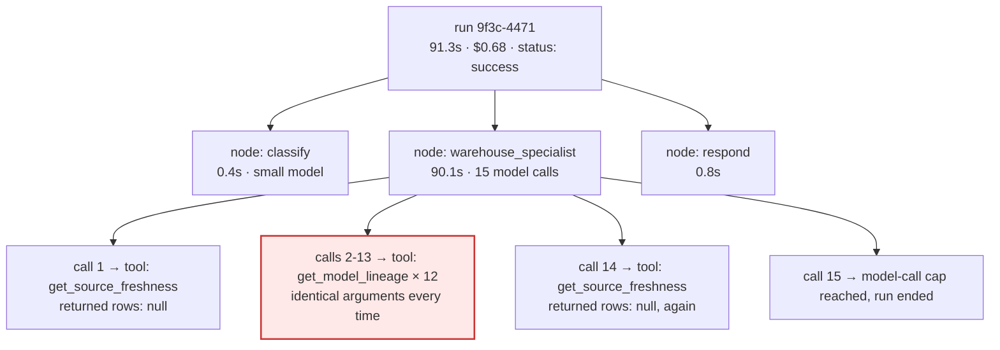
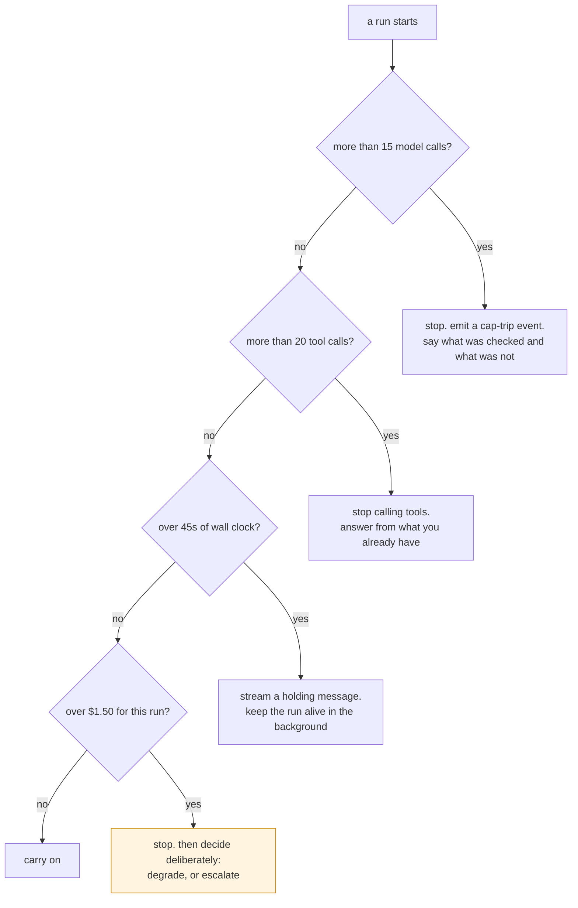

# 07 — Making It Real: Tracing, Testing, Cost

You can build an agent now. This file is about the gap between an agent that works when you try it
and an agent you'd let 200 engineers use — which is mostly a gap in what you can *see*.

We'll keep using the platform-engineering assistant from [06](06-multi-agent.md): five knowledge
areas, a classifier that fans out to specialists, and a synthesis step.

**Prices used throughout.** Large model (`claude-sonnet-4-6`): `$3.00` per million input tokens,
`$15.00` per million output. Small model (`claude-haiku-4-5`): `$1.00` in, `$5.00` out. Caching is
priced as a multiple of the base input rate — a write costs `1.25×` and a read costs `0.1×` — so on
the large model that's `$3.75` to write and `$0.30` to read, per million.

Check your provider's current sheet before you budget anything. The absolute numbers move; the
multipliers and the shape of every conclusion below don't.

---

## Part 1 — Why you cannot debug an agent by reading its output

Tuesday, 14:07. An engineer asks why `analytics.orders_daily` is stale. Ninety-one seconds later they
get this:

> "I wasn't able to determine the cause of the failure. You may want to check the upstream sources."

They close the tab and page the on-call instead.

Now: **what went wrong?** That sentence is the only artifact you have. Read it again. Did the agent
fail to find the right tool? Did a tool return an error it swallowed? Was the model confused by the
prompt? Did it find the answer and then fail to write it down? Did it run out of budget?

You cannot tell. And your monitoring can't either — the request returned HTTP 200 with a
well-formed response body in 91 seconds. Success rate: 100%. Error rate: 0%. Nothing paged. Your
dashboard records one conversation, one answer, no incident.

This is the defining property of agent systems and it takes people a while to internalise: **an agent
fails by producing plausible output, not by throwing.** Every debugging instinct you have — read the
stack trace, check the exception, look at the error log — is built for systems that fail loudly. This
one failed quietly, at length, expensively.

Here is what actually happened. You could only know it from a trace.



The agent called `get_model_lineage` twelve times with identical arguments.

Why? Because `get_source_freshness` returned `{"rows": null}` for a table that had never landed at
all. The model read `null` as *"unknown, I should look somewhere else"* — which is a reasonable
reading! — went to lineage, found nothing conclusive, came back, got `null` again, and looped. The
loop ended only because the model-call cap tripped at 15, and the cap's message got smoothed into
that bland closing sentence.

The cost of learning nothing:

```
15 calls, average 14,400 input tokens  = 216,000 in  × $3.00/1M = $0.648
15 calls, ~150 output tokens each      =   2,250 out × $15.00/1M = $0.034
                                                        total    = $0.682
```

That failed run cost **2.8× a complete, successful three-area conversation** (`$0.682 / $0.243`,
priced in Part 6).

And the fix is two lines in a Python function:

```python
# before: null is ambiguous, and the model resolves the ambiguity by retrying
return {"rows": None}

# after: unambiguous, and terminal
return {"rows": 0, "last_landed_at": None, "status": "never_landed"}
```

**The bug was in your Python, not in the model.** Hold onto that — it's the shape of most agent bugs,
and it's why Part 3 puts your own code at the bottom of the testing pyramid rather than treating
the model as the interesting part.

---

## Part 2 — Tracing: a receipt for every run

A **trace** is the complete record of one run of your graph. A **span** is one nested step inside it —
a node executing, a model being called, a tool running, a subgraph being entered. Spans nest, so a
trace is a tree: the run at the root, nodes below it, model and tool calls below those.

That tree is the thing you were missing in Part 1. It's not "logs, but more of them". Logs record
what you thought to print. A trace records the shape of the execution, including the parts you never
anticipated needing.

LangSmith auto-instruments LangChain and LangGraph, so you get the tree for free:

```bash
export LANGSMITH_TRACING=true
export LANGSMITH_API_KEY=lsv2_...
export LANGSMITH_PROJECT=platform-assistant-prod   # one project per environment
```

### The fields that actually get used

A span carries a lot. These are the ones you will reach for at 3 a.m.:

- **`run_id`** — the one thing that ties a user complaint to a trace. Return it in your API response.
  If a user says "it did something weird an hour ago" and you can't get a `run_id` from them, you're
  searching by timestamp and hoping.
- **node name and parent span** — *where* in the graph, not just *that* it happened.
- **the resolved model** — see below, this one matters more than it looks.
- **input and output tokens**, split by cache status.
- **latency** for the span, separately from its children, so you can tell a slow model call from a
  slow tool.
- **the tool name and arguments** for every tool call, and its return value.
- **your metadata** — tenant, release, run class, experiment arm.

Metadata is the difference between a log viewer and an analytics tool, and the only way to get it
right is to make it impossible to omit. One helper, used everywhere:

```python
GIT_SHA = os.environ["GIT_SHA"]

def build_config(thread_id: str, tenant_id: str, user_id: str,
                 run_class: str = "interactive", arm: str = "control") -> dict:
    """The ONLY way anything in this codebase invokes the graph.

    Nothing calls graph.invoke() with a hand-built config. If it did, that run
    would be missing metadata, and you'd only find out when a dashboard has a
    hole in it three months from now.
    """
    return {
        "configurable": {"thread_id": thread_id, "tenant_id": tenant_id},
        "tags": ["prod", f"tenant:{tenant_id}", f"arm:{arm}"],
        "metadata": {
            "tenant_id": tenant_id,
            "user_id": user_id,
            "release": GIT_SHA,
            "assistant_version": ASSISTANT_VERSION,
            "run_class": run_class,       # "interactive" | "batch" | "eval"
            "experiment_arm": arm,
        },
    }
```

### The three fields you cannot backfill

Most trace data is derivable after the fact. You can always recompute cost from tokens and rates. You
can always recompute the tool sequence from the message list. If you forget to log those, you lose
convenience.

Three fields are different. **They exist only at the moment of the call, and if you don't capture
them then, the questions they answer are closed forever.**

**1. The resolved model version.** You asked for `claude-sonnet-4-6`. The provider served a specific
build of it. Six weeks later, quality drops and you want to know: *did the model under us change on
the 14th?* If every trace records the alias you requested, every trace says the same string, and the
question is unanswerable — not hard, unanswerable. No provider will tell you retroactively which
build served a request you made in the past. Log the resolved identifier the response gives you, per
call.

**2. The prompt-cache split.** Whether an input token was a cache write, a cache read, or plain
uncached input is reported in the response and nowhere else. It is not recoverable from the prompt,
because whether a prefix hit depends on cache state you don't have a record of. So if you didn't log
it, you cannot compute last month's cache-hit rate, which means you cannot answer *"did the prompt
reordering we shipped on the 3rd double the bill?"* — and Part 6 shows that exact change costing
25% of your spend with no other symptom.

**3. The experiment arm.** If a request was served by variant B and the trace doesn't say so, that run
is permanently unattributable. You can never split last week's data by arm. This is why the helper
above stamps `experiment_arm: "control"` on day one, months before you run an experiment: the field
has to already exist in the traces, the queries, and the dashboards, or your first experiment starts
by building a pipeline instead of learning something.

### Traces are a PII store with a nice UI

Everything the user typed is in there. Every tool result about them is in there. Treat the trace
backend as a production data store: retention policy, access control, and redaction *before* data
leaves your process.

```python
from langsmith import Client
from langsmith.anonymizer import create_anonymizer
from langchain_core.tracers.langchain import LangChainTracer

anonymizer = create_anonymizer([
    {"pattern": r"[\w.+-]+@[\w-]+\.[\w.]+", "replace": "<email>"},
    {"pattern": r"\bAKIA[0-9A-Z]{16}\b",    "replace": "<aws-key>"},
])
# Client-side. The raw values never reach the backend at all.
tracer = LangChainTracer(client=Client(anonymizer=anonymizer))
graph = builder.compile().with_config({"callbacks": [tracer]})
```

At real volume, sample rather than dropping tracing: 100% of errors, 100% of runs where a cap tripped,
100% of a canary tenant, and 1–5% of everything else.

---

## Part 3 — Testing something that answers differently every time

Here's the test a normal engineer writes first:

```python
def test_diagnoses_the_failure():
    result = agent.invoke({"messages": [HumanMessage("orders_daily failed")]})
    assert "stg_payments" in result["messages"][-1].content
```

It passes on Monday. On Wednesday the model writes *"the upstream staging table for payments"* and
the test fails — while the agent is completely correct. So someone loosens the assertion, and now the
test passes on a run where the agent called `queue_backfill` twice and double-counted 14.2 million
rows.

**Asserting on model prose gives you a test that is both flaky and blind.** The fix isn't a better
string match. It's three separate kinds of testing, aimed at three different failure classes.

### Level 1: deterministic tests of your own code

**Most of your bugs live here.** Not in the prompt. Not in the model. In your Python. Part 1's
90-second loop was a tool returning `null`.

A partial list of real bugs that need no model to catch:

- A tool returning `None` instead of `[]` on an empty result, so the model concludes "unknown" and
  retries — Part 1, exactly.
- A tool that trusts a `deploy_id` the *model* chose instead of scoping to the session's tenant, so
  any user can read any tenant's deploy by mentioning its id.
- A reducer that replaces where it should append, so the agent forgets the conversation each turn.
- A node that makes an API call *above* an `interrupt()`, so resuming re-runs it and you queue the
  backfill twice ([04](04-human-in-the-loop.md)).
- Middleware ordering, so redaction runs after summarisation and the summary contains the PII.

For the ones that need the graph to actually execute, **fake the model, not the graph.** Script what
the model says and let your real nodes, real routing and real tools run:

```python
from langchain_core.language_models.fake_chat_models import GenericFakeChatModel
from langchain_core.messages import AIMessage

def test_terminates_when_source_never_landed():
    model = GenericFakeChatModel(messages=iter([
        AIMessage(content="", tool_calls=[{"id": "1", "name": "get_source_freshness",
                                           "args": {"table": "raw.payments_stream"}}]),
        AIMessage(content="raw.payments_stream has never landed."),
    ]))
    agent = create_agent(model, tools=[get_source_freshness])
    result = agent.invoke({"messages": [HumanMessage("why is orders_daily stale")]})

    # The assertion is about SHAPE, not prose. This is the whole trick.
    tool_names = [c["name"] for m in result["messages"]
                  for c in getattr(m, "tool_calls", [])]
    assert tool_names == ["get_source_freshness"]      # exactly one lookup, no loop
```

The common mistake is mocking `create_agent` itself. That tests nothing — you've replaced the system
under test with a stub. Script the model's *outputs* and let the loop run.

These tests are fast, free, and never flaky. They should be the large majority of your suite, and
they should block every commit.

### Level 2: golden-trajectory replay

Record a real run's tool responses once, into a fixture. Replay it against a new prompt or a new model
and compare the path taken.

This catches the regressions you'd otherwise ship blind: a prompt edit that makes the agent skip the
freshness check, a middleware change that reorders tool schemas and changes which tool gets picked, a
model upgrade that adds three redundant calls per run.

**And here is the thing replay cannot catch, which people discover the hard way: a change that alters
*which* tool would be called.**

Your recording contains responses for `get_connector_status`, because that's what the old version
called. The new version calls `get_connector_health` instead. Replay has no recorded response for it,
and every option is bad:

- **Fail the test.** Now every legitimate improvement is a red build, and within a month people ignore
  the suite.
- **Return an error for the unknown tool.** You are now testing the agent's error-handling path, not
  the change you made. The test result is meaningless and looks meaningful.
- **Fall through to the real tool.** You just lost determinism, and if `queue_backfill` isn't in your
  recording, you wrote to production from a test.

State it plainly: **replay is a regression detector for behaviour you have already seen. It is not a
correctness check for behaviour you haven't.** A new tool path needs a new recording, and deciding
whether that new path is *better* is a human judgment or a judge call. It is never a replay result.

### Level 3: LLM-as-judge for the subjective parts

Some properties genuinely resist assertion. "Was the answer grounded in the tool results, or did it
add a plausible detail nothing returned?" "Did it tell the engineer what to do next?" "Did it admit
what it couldn't check?"

Those are real quality properties, they're what users notice, and you can't regex them. Use a model
to score them — carefully, which is the next section.

---

## Part 4 — LLM-as-judge, honestly

A judge is a model with its own error rate, its own version, and its own bad days. Treat it as a piece
of measurement equipment that needs calibration, not as ground truth.

```python
from agentevals.trajectory.llm import (
    create_trajectory_llm_as_judge, TRAJECTORY_ACCURACY_PROMPT,
)

judge = create_trajectory_llm_as_judge(
    model="anthropic:claude-opus-4-8",  # PINNED to one id. Never a floating alias.
    prompt=TRAJECTORY_ACCURACY_PROMPT,  # version this like source code
)
```

**Judge drift.** If you point the judge at a floating alias, the provider updates it and your quality
score moves while nothing in your code changed. You will spend two days looking for a regression that
isn't there. Pin the judge to one specific model id, treat the judge prompt as versioned code, and
record `judge_model` and `judge_prompt_version` alongside every score. Then when the number moves you
can tell whether the *agent* moved or the *ruler* moved.

One more consideration on which model to pin: a judge tends to score output from its own family a
little generously. If the result is going to gate a merge, using a different model as the judge than
the one under test removes that bias for free.

**Judge flakiness.** Run the same judge on the same output twice and you may get different verdicts.
Measure it before you trust any threshold: run the judge five times over 20 fixed outputs and count
how often the five runs agree. If it disagrees with itself on 3 of 20, your self-agreement is **85%**,
and a 4-point difference between two experiments is *inside the noise floor*. Set your regression
threshold above the noise or you will chase ghosts every week.

**Calibration against humans.** Have a person label 50 outputs pass/fail. Run the judge on the same
50. Say it agrees on **43 of 50 = 86%**. The interesting part is the 7 disagreements, and they are
almost never random — it'll be one systematic thing, like the judge failing correct-but-terse answers
because the prompt implies thoroughness is good. Fix the prompt, re-run, re-measure. Recalibrate
whenever you change the judge model or prompt, and at least quarterly regardless.

**Judges cost money, and it adds up faster than people expect.** A 200-example suite:

```
200 examples × ($0.243 agent run + $0.006 judge call) = $49.80 per full run
30 pull requests a week × $49.80                      = $1,494 / week
                                                      ≈ $6,470 / month
```

That is more than the production agent costs. The fix is boring and works: a 25-example fast subset
per PR (`25 × $0.249 = $6.23`) and the full suite nightly (`30 × $49.80 = $1,494/month`), with the
full suite gating model, prompt, and middleware changes specifically.

---

## Part 5 — Evaluate the trajectory, not just the answer

An agent that reaches the right answer via 14 tool calls and one policy violation is not correct. It
got lucky, and it will not get lucky next Tuesday.

```python
from agentevals.trajectory.match import create_trajectory_match_evaluator

evaluator = create_trajectory_match_evaluator(trajectory_match_mode="subset")
evaluation = evaluator(outputs=result["messages"], reference_outputs=reference)
assert evaluation["score"] is True
```

The four modes answer four different questions, and picking the wrong one gives you a test that
passes for the wrong reason:

- **`strict`** — the same tool calls in the same order. Use it where order is policy. In our
  assistant, `check_source_freshness` **must** precede `queue_backfill`, because backfilling from a
  replica that's also stale silently produces wrong data with no error anywhere. That ordering is a
  correctness requirement, so it gets a strict test.
- **`unordered`** — the same set of calls, any order. For independent lookups where order genuinely
  doesn't matter.
- **`subset`** — the agent used *only* tools from the reference. This is your **scope-containment**
  check, and it's the one that catches an agent reaching for `queue_backfill` on a read-only question.
- **`superset`** — the agent used *at least* the reference tools. A minimum-required-actions check.

### The metrics to track per version

Four numbers, all cheap, all computable from traces you're already collecting:

- **Tool calls per run, p50 and p95.** The p95 is where runaway loops live; the p50 hides them.
- **Redundant-call rate** — the same tool with the same arguments twice in one run. This is the single
  best confusion signal you can compute, and it's what would have caught Part 1 automatically:
  twelve identical `get_model_lineage` calls in one run is not a subtle pattern.
- **Recovery rate** — of the runs where a tool returned an error, what fraction still finished
  correctly?
- **Cap-trip rate** — how often you hit a budget ceiling. Part 1's run tripped one and nobody
  noticed, because the trip wasn't an event.

Recovery is the one people skip and it's the interesting one, because you cannot measure it from
production traces alone — tools mostly work, so you have almost no samples. You have to inject the
failure:

```python
def test_recovers_from_a_flaky_tool():
    calls = {"n": 0}
    def flaky_connector_status(connector: str) -> dict:
        calls["n"] += 1
        if calls["n"] == 1:
            return {"error": "upstream timeout"}      # first call fails
        return {"status": "auth_expired", "last_ok": "2026-08-22T01:02:00Z"}
    ...
```

A good agent retries once, or says clearly what it couldn't check. A bad one hallucinates a connector
state and reports it with confidence. **In a recording, the tool always worked, so replay will never
tell you which of those you built.**

---

## Part 6 — Where the money actually goes

Conversation B from [06](06-multi-agent.md): a stuck deploy, a latency spike, and a Terraform
surprise. One classify call, three specialists in parallel, one synthesis. Ten model calls.

| Step | Model | Calls | Input tok | Output tok | Cost |
|---|---|--:|--:|--:|--:|
| `classify` | small | 1 | 900 | 30 | $0.0011 |
| deploy specialist | large | 3 | 29,100 | 490 | $0.0947 |
| observability specialist | large | 3 | 29,350 | 510 | $0.0957 |
| infra specialist | large | 2 | 11,240 | 440 | $0.0403 |
| `synthesize` | large | 1 | 1,950 | 380 | $0.0116 |
| **Total** | | **10** | **72,540** | **1,850** | **$0.2433** |

The arithmetic, so you can check it: large-model input is `29,100 + 29,350 + 11,240 + 1,950 = 71,640`
tokens at `$3.00/1M` = `$0.2149`. Large-model output is `1,820` tokens at `$15.00/1M` = `$0.0273`. The
small classify call is `900 × $1.00/1M + 30 × $5.00/1M` = `$0.0011`. Total **$0.2433**.

Now, before reading on: which step did you expect to be expensive?

Most people say `synthesize`, because it's the "smart" step that reads everything and writes the
answer. **It is $0.0116 — 4.8% of the bill.** The three specialists are `$0.0947 + $0.0957 + $0.0403
= $0.2307`, which is **94.8%**.

The money is in the fan-out, and it always is. Not in the clever step — in the wide step, or in the
long loop. That's the first counterintuitive thing.

Here's the second. Look inside one specialist. The deploy specialist processed **29,100 input
tokens**. But its unique content — rules, brief, pod JSON, PDB detail, its own messages — comes to
**12,680 tokens**. You paid to process `29,100 / 12,680 = 2.3×` the content that exists, because the
agent loop re-sends the entire conversation on every call. Three calls, three re-sends, growing each
time.

And note what *isn't* expensive: output. 490 output tokens against 29,100 input. Even at 5× the rate,
output is `$0.00735` of the specialist's `$0.0947` — **7.8%**. Agent cost is an input-token problem
wearing an output-token costume.

### Prompt caching, and the way it silently breaks

The deploy specialist's 5,400-token rules block is byte-identical on all three calls. Cache it, and
you pay a 25% write premium once (`$3.75` vs `$3.00` per million) to get a 90% discount on every read
(`$0.30` vs `$3.00`):

```
write premium:  5,400 × ($3.75 − $3.00)/1M         = $0.00405
read saving:    2 calls × 5,400 × ($3.00 − $0.30)/1M = $0.02916
                                        net saving = $0.02511   (26.5% of $0.0947)
```

Same calculation on the other two specialists (6,200 tokens over 3 calls, 3,900 over 2) gives
`$0.02883` and `$0.00761`. Total saved: **$0.0615**, taking the conversation from `$0.2433` to
`$0.1817` — a **25.3%** cut for one middleware line.

What is cacheable is anything stable and *at the front*: the system prompt, the tool schemas, the
domain rules. What churns is everything after it: the brief, the tool results, the growing message
list.

**And here's the trap.** Caching depends on a byte-identical *prefix*. If someone adds a request id or
a timestamp to the top of the system prompt —

```python
system_prompt = f"Current time: {datetime.now().isoformat()}\n" + DEPLOY_RULES   # 💥
```

— then every call is a cache miss, the bill goes straight back to `$0.2433`, and **there is no other
symptom.** No error, no latency change, no quality change. At 4,000 conversations a month that's
`4,000 × $0.0615 = $246/month` leaking; at 40,000 it's `$2,460`. This is why cache-hit rate belongs
on a dashboard with an alert, not in a doc you read once — and why the cache split is one of Part
2's non-backfillable fields.

### Model tiering, in one paragraph

The `classify` call is `$0.0011` — **0.43%** of the conversation. It already uses the small model. But
notice the leverage: everything downstream of it costs `$0.2422`, so a classification error wastes
`$0.2422 / $0.0011 = 231×` its own cost, and produces a confidently wrong three-part answer nobody
flags. That inverts the intuitive assignment — the interesting question isn't *"which step is hard?"*
but *"which step, if it's wrong, costs the most downstream and is least likely to be caught?"* The
full treatment, including why the cheapest node often deserves the most expensive model and why the
highest-volume node can be tiered down, is in
[Model Tiering](../../AISystemDesign/ModelTiering/EXPLAINED.md).

### Per-tenant attribution has to be set at call time

"Which tenant is burning the budget" is not answerable retroactively unless the tag was on the call.
That's what `build_config` in Part 2 is for. Once every run carries `metadata.tenant_id`, you can
group spend by tenant, spot the one team funnelling batch jobs through the interactive path, and show
each tenant their own usage. Without it you have one number and no way to divide it.

The single best composite metric to track, per release: **cost per *successfully completed* task.**
Cost per run rewards the agent that gives up early. Part 1's run was cheap per token and infinitely
expensive per outcome.

---

## Part 7 — Budgets and runaway protection

Part 1's loop was stopped by a cap. That cap saved you real money and you should have four more.



The five caps, what each catches, and what should happen when it trips:

| Cap | Catches | On trip |
|---|---|---|
| **Model calls** per run and per thread | Reasoning loops — Part 1 | End the run with a message saying what *was* and *was not* checked, and emit an event |
| **Tool calls**, total and per tool | A single tool called repeatedly, e.g. 12 lineage lookups | Stop the tool loop, answer from what's in context, flag it as partial |
| **Tokens** per run | A context that grew without anyone noticing | Summarise and continue, or stop — but never silently truncate the middle |
| **Wall clock** | A slow tool that burns your SLO without burning tokens | Stream a holding message and move the run to the background |
| **Dollars** per tenant per period | The thing finance actually asks about | Degrade to a cheaper tier, then refuse — with a message that says why |

```python
from langchain.agents.middleware import ModelCallLimitMiddleware, ToolCallLimitMiddleware

middleware = [
    ModelCallLimitMiddleware(thread_limit=60, run_limit=15),
    ToolCallLimitMiddleware(thread_limit=40, run_limit=20),
    # the per-tool cap that would have stopped Part 1's twelve identical calls
    ToolCallLimitMiddleware(tool_name="get_model_lineage", run_limit=3),
]
```

Two rules about trips. **A trip must be an event, not a silence.** Part 1's cap fired and nobody
found out for a week, because the only trace of it was a vague sentence to the user. Emit a metric,
tag the trace, and alert on the rate. **And a trip must be honest to the user.** "I checked the run
history and the model lineage but could not check source freshness" is useful. "I wasn't able to
determine the cause" is not.

### The trap: escalation is the most expensive thing your agent can do

This one catches good engineers, because it's an optimisation that measures as a win.

Price your worst case. A single run, capped at 15 model calls, at the largest context you permit
(40,000 input tokens):

```
15 × 40,000 in  = 600,000 × $3.00/1M  = $1.80
15 ×    600 out =   9,000 × $15.00/1M = $0.135
                             worst case ≈ $1.94
```

**$1.94 is the most a capped run can possibly cost you.** Now price the escape hatch. Escalating hands
the thread to a platform on-call engineer. Your team measures an assisted ticket at 18 minutes; at a
fully loaded `$95/hour`:

```
18/60 × $95 = $28.50 per escalation
```

**Escalating costs 14.7× the worst possible runaway** (`$28.50 / $1.94`).

So watch what happens when you build a budget governor whose objective is "reduce model spend". It
notices expensive-looking runs and escalates them. Suppose it escalates 5% more conversations at
4,000/month:

```
200 extra escalations × $28.50 = $5,700 / month  spent
200 runs never completed × $1.94 = $  388 / month  saved
                                  net loss = $5,312 / month
```

And it will report as a **success**, because the model-spend line went down and the `$5,700` landed on
an engineering-time line nobody attributed to the agent.

The lesson generalises: **a budget governor must price its own escape hatch, or it will optimise
itself into mass escalation.** Put the escalation cost in the same objective function as the token
cost, alarm on escalation *rate* next to spend, and treat a falling model bill with a rising
escalation rate as an incident rather than a win.

---

## Part 8 — Deployment: platform, or roll it yourself

If you skipped to here: the LangGraph Agent Server (self-hosted or managed) gives you four things
that are individually unremarkable and collectively a quarter of engineering work.

**Durable execution.** A run is a row in Postgres claimed by a worker under a lease. A redeploy
mid-run doesn't lose it; another worker picks it up. Building this yourself means a durable queue with
lease renewal, orphan detection, and graceful drain.

**A managed checkpoint store.** The server injects the checkpointer and store into your graph. You
don't write the schema, the serialization, the migrations, or the TTL sweeper. (Corollary, and it bites
people: **do not compile your own checkpointer into a graph you deploy there.** It shadows managed
persistence and quietly breaks TTLs, the thread APIs, Studio, and time travel.)

**Streaming across processes.** Tokens are produced by a worker and consumed by a browser talking to a
different API server. That needs a pub/sub hop — Redis, in this architecture — plus reconnection so a
dropped connection can rejoin an in-flight run.

**Scheduling and background runs.** Crons, plus create-a-run-and-return-immediately with `join` to
collect the result later, so you're not holding an HTTP connection open for five minutes.

Two more that are easy to undervalue: **assistants**, which are versioned configuration over a
deployed graph — so a prompt change is a config promotion with instant rollback rather than a code
deploy — and **double-texting policies** (`enqueue`, `reject`, `interrupt`, `rollback`) for when a
second message arrives while a run is still going.

### How to decide

Ask these in order and stop at the first yes:

1. **Does any run need to survive a process restart?** If every run finishes in under ten seconds and
   a retry is acceptable, you do not need durable execution. A plain web service and a Postgres table
   is the right answer and you should take it.
2. **Does a human ever pause a run for hours or days?** ([04](04-human-in-the-loop.md).) Then you need
   durable checkpoints with correct resume semantics, and you should not be writing that yourself.
3. **Do you need per-tenant prompt configuration with independent rollback?** Assistants are exactly
   this. Rolling it yourself means building a config service plus a versioning story.
4. **Do you have air-gap or data-residency constraints?** Then it's self-hosted, and the question is
   only whether you self-host this or self-host your own.

The honest summary: the platform's value is proportional to how long your runs live. Short, stateless,
retryable runs barely benefit. Runs that pause for human approval and resume on Thursday benefit
enormously, and the parts you'd have to build are exactly the parts that are subtle to get right.

---

## Part 9 — The day-one checklist

Do these before you have users. Items 1–5 are impossible or near-impossible to retrofit — the data
simply won't exist for the period before you added them. Items 6–10 are merely expensive later.

1. **Tracing on in every environment**, including dev, with one project per environment.
2. **One `build_config()` helper that is the only way anything invokes the graph** — so metadata
   cannot be missing, ever, by construction.
3. **The resolved model version recorded per call**, not the alias you asked for.
4. **The cache read / cache write / uncached split recorded per call.**
5. **`experiment_arm` stamped on every run**, set to `"control"`, months before your first experiment.
6. **Token usage accumulated into a state channel and onto trace metadata**, so cost per run exists
   from run number one.
7. **An anonymizer**, before a single real user's text reaches the trace backend.
8. **Hard caps on model calls, tool calls and wall clock, and a metric that fires when one trips.**
9. **A golden dataset file with ten examples in it.** Ten. Not two hundred. It only has to exist so
   that every incident can add a case to it — that's the mechanism that actually grows it.
10. **One dashboard**: cost per successful task, p95 latency, error rate by node, cap-trip rate, and
    escalation rate side by side. That last pairing is what catches Part 7's trap.

---

## What to take away

1. **An agent fails by producing plausible output, not by throwing.** Part 1's run returned HTTP
   200, a well-formed answer, and a 0% error rate, while looping twelve times and costing `$0.68` to
   learn nothing. Your existing monitoring will not see this class of failure. Tracing is not optional
   instrumentation here; it is the only way to observe the system at all.
2. **Three trace fields are not backfillable: the resolved model version, the prompt-cache split, and
   the experiment arm.** Every other field you can recompute later. These three exist only at the
   moment of the call, so "log it now or lose that question forever" is literal.
3. **Most of your bugs are in your Python, not your prompt.** A tool returning `null` instead of
   `{"rows": 0, "status": "never_landed"}` caused a 90-second loop. Deterministic tests of your own
   nodes, tools and reducers should be the bulk of your suite. Fake the model, not the graph.
4. **Replay catches regressions, not correctness.** It structurally cannot evaluate a change that
   alters *which* tool gets called, because your recording has no response for the new one. Every
   available fallback is wrong in a different way.
5. **A judge is measurement equipment.** Pin its model, version its prompt, measure its self-agreement
   (85% means a 4-point delta is noise), and calibrate against human labels (86% agreement means look
   hard at the other 7 cases).
6. **The money is in the fan-out or the loop, not the clever step.** `synthesize` was 4.8% of the
   bill; the three specialists were 94.8%. And you paid 2.3× the tokens that exist, because the loop
   re-sends the conversation on every call.
7. **Prompt caching is a 25% cut and it breaks silently.** One timestamp at the top of a system prompt
   turns every call into a cache miss with no error, no latency change, and no quality change. Alert
   on cache-hit rate.
8. **Escalating to a human costs 14.7× your worst possible runaway** — `$28.50` against `$1.94`. A
   budget governor that doesn't price its own escape hatch will optimise itself into mass escalation
   and report it as a win. Watch escalation rate and model spend on the same dashboard.
9. **Judge trajectories, not answers.** Right answer via 14 calls and a policy violation is not
   correct. And measure recovery from tool failures by *injecting* them — production traces won't give
   you the samples.
10. **The platform's value scales with how long your runs live.** Ten-second retryable runs barely
    benefit. Runs that pause for a human and resume on Thursday benefit enormously, and the parts
    you'd have to build are exactly the subtle ones.

---

That's the primer. From here, the two worked designs are where these concepts turn into engineering
judgment: [Supervisor vs. Swarm](../../AISystemDesign/SupportAgent/EXPLAINED.md) for topology, and
[Model Tiering](../../AISystemDesign/ModelTiering/EXPLAINED.md) for which model goes where. The
30 reference notes in [`LangChain/`](../00-README.md) are the lookup layer underneath both, and they
now assume nothing you don't know.
