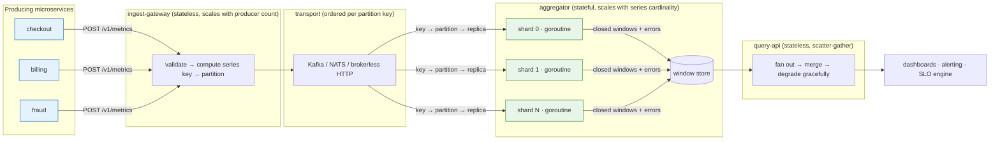

# MetricsProcessor

A real-time metrics aggregation platform in Go: three microservices that ingest
metrics from many producing services, fold them into time windows with **minimal
latency**, **preserve event order where order changes the answer**, **contain
partial failures instead of propagating them**, and **return aggregates together
with the errors encountered producing them**.

Everything here compiles, runs, and is covered by tests that fail if the
guarantees break.

```bash
go run ./cmd/demo      # all three services in one process, with injected failures
go test -race ./...    # the guarantees are concurrency claims, so -race is the gate
```

---

## Architecture



| Service | State | Scales with | Failure blast radius |
| --- | --- | --- | --- |
| [`ingest-gateway`](cmd/ingest-gateway) | none | producer count, request rate | one batch; producers retry |
| [`aggregator`](cmd/aggregator) | in-flight windows | **series cardinality** | the partitions that replica owns |
| [`query-api`](cmd/query-api) | none | query rate | one query, degraded not failed |

The split is drawn along the axis that actually matters: **ingest scales with how
many things are talking, aggregation scales with how many distinct series
exist.** Those two numbers move independently and one of them requires memory
proportional to it, so fusing them into one service would mean scaling the
expensive tier for the cheap tier's reasons.

---

## The three questions, answered briefly

### Concurrency management

The aggregation core is a **sharded, single-writer pipeline**. Series are mapped
to shards by a deterministic hash of the series key; each shard is one goroutine
that owns its state exclusively for its whole lifetime. There is no mutex, no
atomic, and no shared map anywhere on the fold path — not because locks were
optimized away, but because **exclusive ownership by one goroutine is the
concurrency-control mechanism**, and a lock would only be evidence that ownership
had been violated.

Producers compute the shard index on their own goroutine and send directly into
that shard's buffered channel: one hop from `Submit` to fold, with no dispatcher
goroutine in between adding a scheduling hop to every point. `Submit` costs
**~72 ns and zero allocations** ([benchmark](#measured)).

Channels are used for the two things Go channels are actually good at — handing
work to a specific owner, and expressing backpressure — and nothing else.
Full detail: [docs/02-concurrency-model.md](docs/02-concurrency-model.md).

### Data consistency

Ordering is a **per-series** guarantee, not a global one. A global total order
across independent producers is neither achievable (there is no global clock) nor
useful (nobody asks "did checkout's request precede billing's?"). What is both
achievable and necessary is that one series' points fold in order, because:

- a **cumulative counter** that restarts reads as a decrease, and telling "reset"
  from "out-of-order delivery" is impossible without order;
- a **gauge** is last-write-wins, and "last" is meaningless without order.

Three mechanisms enforce it end to end, and all three must agree or the guarantee
evaporates at a process boundary:

1. **Same partition function everywhere** — FNV-1a over the series key, written
   out longhand rather than taken from `hash/maphash`, because maphash is seeded
   randomly per process and gateway and aggregator would silently disagree.
2. **Sequence numbers per `(source, series)`** with a bounded reorder buffer,
   which repairs network-level reordering that partitioning alone cannot.
3. **Event-time watermarks** with epoch-aligned tumbling windows, so every shard,
   replica, and restart agrees on window boundaries with no coordination — which
   is what makes aggregates *mergeable* and scatter-gather reads correct.

Consistency model: **eventual, monotonic, and never retracted.** A published
window is immutable; a straggler that arrives after its window closed is counted
and reported rather than folded in behind the reader's back.
Full detail: [docs/03-ordering-and-consistency.md](docs/03-ordering-and-consistency.md).

### Error handling

Errors are **values that travel with results**, never control flow that unwinds a
stage. `Result` carries both:

```go
type Result struct {
    Aggregates []model.Aggregate  // what we computed
    Err        *merr.MultiError   // every way it was incomplete
    Reason     CloseReason        // watermark | idle | shutdown
}
```

A non-nil `Err` never means the aggregates are wrong; it means they are
incomplete in specific, enumerated ways (`validation`, `sequence_gap`,
`duplicate`, `late`, `panic`, `backpressure`, `quarantine`, `downstream`).

Containment is layered so that the blast radius of any failure is the smallest
unit that can own it: one **point** for a bad value or a panicking transform, one
**stream** for a lost sequence number, one **producer** for a poisoned source
(error-budget breaker), one **window** for a store write failure. Nothing escalates
to "the shard stops folding".

Error *collection* is bounded too — a poisoned producer emitting millions of bad
points a second must not turn an input problem into an out-of-memory outage, so
past a cap the collector keeps exact per-category counts and drops the detail.
Full detail: [docs/04-error-handling.md](docs/04-error-handling.md).

---

## Repository layout

```
cmd/
  ingest-gateway/   query-api/   aggregator/   demo/
internal/
  gateway/          query/       aggregator/   httpx/  config/
pkg/
  pipeline/   the aggregation core: shards, reorder buffers, windows, watermarks
  model/      Point, Aggregate, Sketch, series keys, window alignment
  merr/       partial-failure values: codes, bounded collector, MultiError
  bus/        transport seam: ordered-per-key contract + in-proc and HTTP impls
  store/      bounded window storage with retention
  client/     producer SDK: sequencing, batching, order-preserving retry
deploy/       Dockerfile, docker-compose, Kubernetes manifests
docs/         design documents
```

## Documentation

| | |
| --- | --- |
| [01 · Architecture](docs/01-architecture.md) | service boundaries, why this split, request lifecycle |
| [02 · Concurrency model](docs/02-concurrency-model.md) | sharding, ownership rules, channel topology, shutdown |
| [03 · Ordering & consistency](docs/03-ordering-and-consistency.md) | the ordering guarantee, watermarks, windows, merge semantics |
| [04 · Error handling](docs/04-error-handling.md) | failure taxonomy, containment layers, the error contract |
| [05 · Latency & backpressure](docs/05-latency-and-backpressure.md) | the latency budget, overflow policy, shedding |
| [06 · API reference](docs/06-api-reference.md) | HTTP endpoints and Go APIs |
| [07 · Scaling & operations](docs/07-scaling-and-operations.md) | capacity model, rebalancing, SLOs, runbook |
| [08 · Alternatives considered](docs/08-alternatives-considered.md) | what was rejected, and what it would have cost |

## Measured

Apple M5 Pro, Go 1.26, 8 shards, 64 series, `RunParallel`:

```
BenchmarkSubmit-18    49347747    72.36 ns/op    281 B/op    2 allocs/op
```

Both allocations are the benchmark's own `&model.Point{}`; `Submit` itself
allocates nothing on the fast path. That is ~13.8M points/sec of ingest headroom
per instance before the fold becomes the bottleneck.

The `go run ./cmd/demo` run injects a scrambled 5-point stream (arrival order
3,1,4,2,2-replayed, containing a counter reset) and the aggregator reports
`delta = 210` — the correct answer. An unordered fold of the same points reports
350. That difference is what the ordering machinery buys.
