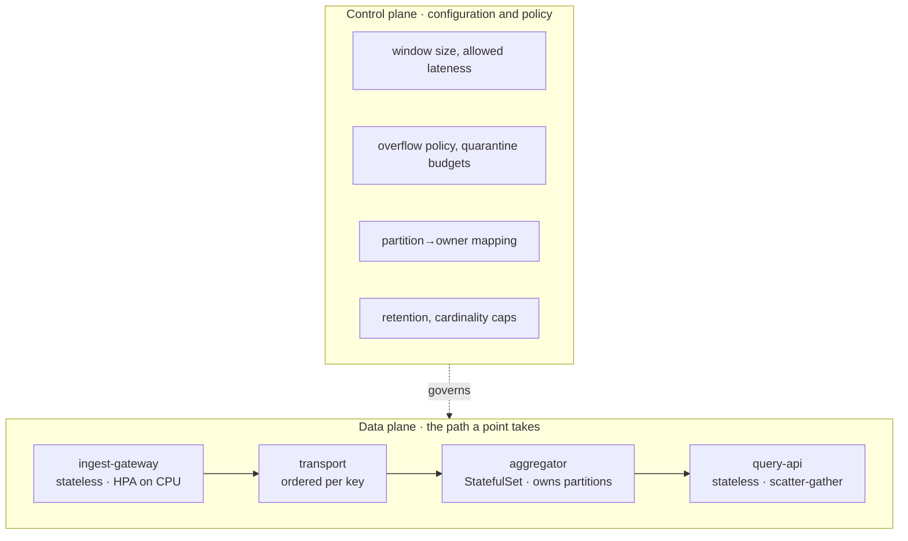

# 01 · Architecture

## Why three services and not one

A single "metrics service" is the obvious first design, and it is wrong for a
reason that shows up the first time it needs to scale: **its two workloads grow
along different axes and only one of them is memory-bound.**

| Workload | Grows with | Resource | State |
| --- | --- | --- | --- |
| Accepting metrics | number of producer instances × emission rate | CPU, connections | none |
| Folding metrics | **number of distinct series** (cardinality) | memory | in-flight windows |
| Serving metrics | query rate × time range | CPU, I/O | none |

Deploying a thousand new pods multiplies the first number and leaves the second
almost unchanged. Adding one high-cardinality label multiplies the second and
leaves the first unchanged. Fused into one service, you scale the memory-hungry
tier every time someone deploys more replicas, and you cannot scale ingest during
a traffic spike without also rehashing aggregation state.

So the boundaries are drawn where the scaling axes are:



The control plane is configuration, not a service: everything that decides
*policy* — how wide a window is, how much lateness to tolerate, whether to block
or shed under pressure, which replica owns which partition — is declared in the
deployment and read at start-up. The data plane contains no policy decisions of
its own. That separation is what makes the behaviour of a production incident
predictable: you can read the policy off the manifest.

---

## The life of a point

```mermaid
sequenceDiagram
    autonumber
    participant App as producing service
    participant SDK as client SDK
    participant GW as ingest-gateway
    participant T as transport
    participant SH as aggregator shard
    participant ST as store
    participant Q as query-api

    App->>SDK: Count("orders_total", 42, {route:"/pay"})
    Note over SDK: sequence assigned under<br/>the buffer lock, at emission
    SDK->>SDK: buffer until MaxBatch or FlushInterval
    SDK->>GW: POST /v1/metrics (batch)
    GW->>GW: validate each point independently
    GW->>GW: series key = service|name|sorted labels
    GW->>T: publish, grouped by key, order preserved
    T->>SH: partition → the one replica that owns it
    SH->>SH: reorder buffer restores sequence order
    SH->>SH: advance watermark; close due windows
    SH->>SH: fold into (series, window) state
    SH-->>ST: Result{aggregates, errors} on window close
    Q->>ST: scatter to every replica
    Q->>Q: merge partial views, mark degraded if any missed
```

Steps 5–7 are where the design's substance is. Everything else is plumbing.

---

## Service responsibilities

### ingest-gateway — [`internal/gateway`](../internal/gateway/gateway.go)

Validates, keys, partitions, publishes. Deliberately dumb: it holds no
aggregation state, so it can be killed, scaled, and rolled at will.

Two decisions worth naming:

- **Per-point outcomes, not per-batch.** A batch of a thousand points with three
  bad ones returns `207 Multi-Status` with 997 accepted and three itemized
  errors. Rejecting the whole batch would punish a producer for one bad label,
  and accepting it silently would hide a broken producer indefinitely.
- **The series key is computed here, once.** It is the partition key, so it must
  be computed before routing anyway; memoizing it on the point means the
  aggregator never re-sorts labels on the hot path.

### aggregator — [`internal/aggregator`](../internal/aggregator/aggregator.go)

Owns the pipeline, the in-flight windows, and the store. This is the only
stateful tier, which drives its deployment shape: a **StatefulSet** with stable
per-pod DNS, because the gateway addresses a specific partition owner rather than
"any healthy replica". A Deployment's random pod names would reshuffle partition
ownership on every rollout.

Both transport styles converge on one method, `Ingest`:

- **pull** — subscribe to a broker (`bus.Bus.Subscribe`)
- **push** — receive on `POST /v1/ingest` (brokerless HTTP transport)

so the service behaves identically either way and the transport choice is a
deployment concern rather than a code fork.

### query-api — [`internal/query`](../internal/query/query.go)

Aggregation state is partitioned across replicas, so no single replica can answer
a query. The read tier scatters to all of them and merges. This works only
because aggregates are **mergeable** — a decision made back in the data model, not
a convenience discovered at the read tier.

Its availability posture is explicit: a query reaching nine of ten replicas
returns nine tenths of the data, marked `degraded: true`, with the replica counts
in the response. Failing the whole request because one replica is mid-rollout
would make the read tier less available than the thing it reads from.

---

## The transport seam

[`pkg/bus`](../pkg/bus/bus.go) exists to make one requirement explicit and
testable: **the transport must preserve order per partition key.** Per-series
ordering inside the aggregator is worth nothing if the hop before it reorders.

Three implementations, one contract:

| Implementation | Durable | Replay | Use |
| --- | --- | --- | --- |
| `InProc` | no | no | single binary, tests, the demo |
| `HTTPPublisher` | no | no | brokerless small deployments; runnable without Kafka |
| Kafka / JetStream | yes | yes | production |

Mapping to Kafka is mechanical: `Envelope.Key` is the record key, `Partitions` is
the topic partition count, `Subscribe`'s group is the consumer group — and
critically, the producer partitioner must be configured to the same FNV-1a
function in [`pipeline.PartitionFor`](../pkg/pipeline/pipeline.go), or the broker
and the aggregator will disagree about who owns a series.

The Kafka adapter is not implemented here. It is roughly 200 lines against
`franz-go` and adds one genuinely new concern — offset commit placement, which
must happen *after* a window closes, not after a point is submitted, or a restart
silently loses the in-flight fold.

## Storage

[`pkg/store`](../pkg/store/store.go) is a narrow interface with a bounded
in-memory implementation. In production this is a TSDB (Mimir, ClickHouse,
Prometheus remote-write); the in-memory one makes the service runnable and
testable standalone while enforcing the same limits a real backend would:
time-based retention and a hard series-cardinality cap that returns
`ErrCardinalityExceeded` rather than growing without bound.

Writes **merge** rather than overwrite, which makes the write path idempotent: a
replica that restarts mid-window and re-emits a partial view combines with what
is already stored instead of clobbering it.
