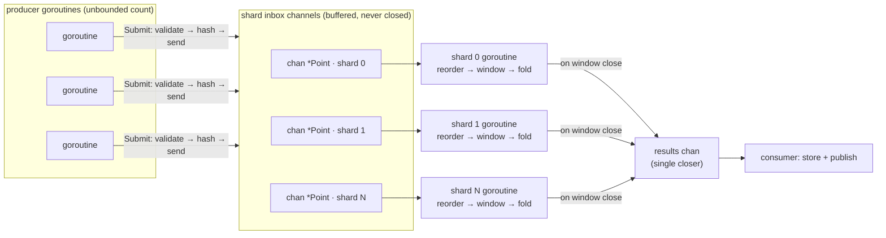

# 02 · Concurrency model

> The whole design follows from one choice: **partition the state, don't share
> it.** Everything below — no locks, guaranteed ordering, contained failures,
> clean shutdown — is a consequence of that, not a separate feature.

## Topology



Fan-out by key, fan-in by result. **One hop** from a producer's `Submit` to the
goroutine that folds the point.

## Why there is no dispatcher goroutine

The textbook shape puts a dispatcher between producers and workers: producers
send to one channel, a dispatcher reads it and routes to shards. It is one extra
channel, one extra goroutine, and — the part that matters — one extra scheduler
handoff **on every single point**. At millions of points per second that is a
queue's worth of latency and a guaranteed single-threaded bottleneck.

Instead the producer's own goroutine computes the shard index and sends directly:

```go
sh := p.shards[PartitionFor(pt.SeriesKey(), len(p.shards))]
select {
case sh.in <- pt:      // fast path: one channel op
    return nil
default:               // slow path only when the queue is full
}
```

The hash is a few nanoseconds of FNV-1a over a string the gateway already
computed. Paying that on the caller's goroutine is strictly cheaper than paying a
context switch to have someone else pay it.

**Measured:** 72 ns/op, 0 allocations attributable to `Submit`.

## Ownership rules

These three rules are the whole concurrency model. Every other property is
downstream of them.

### 1. A shard's state belongs to its goroutine

`windows`, `streams`, `budget`, `errs`, the watermark, every `seriesState` — all
plain Go maps and structs, no synchronization, because exactly one goroutine ever
touches them, for the shard's entire lifetime.

The only atomics in the shard are `shardCounters`, and they exist solely because
`Stats()` is read from a different goroutine (an HTTP handler). They are
observability, not coordination — nothing in the fold path reads them back.

```go
// series.go
type seriesState struct {
    count uint64
    sum, min, max float64
    prev  float64   // last cumulative counter value, in event order
    ...
}
```

No mutex, and there must never be one. A mutex appearing here would not be an
optimization opportunity; it would be evidence that the ownership rule had been
broken somewhere and the fix belongs at that call site.

### 2. Shard inbox channels are never closed

Go's rule is "only the sender closes a channel". With an unbounded number of
concurrent senders there is no single sender to appeal to, and any closing scheme
races: a producer that checked `closed` and then sent panics if the close landed
in between.

So shutdown is signalled **out of band** and the channels are simply abandoned:

```go
p.closed.Store(true)   // Submit starts rejecting
close(p.quit)          // workers drain what is queued, then flush
```

A `Submit` that races past the `closed` check either lands in the buffer (nobody
reads it, it is garbage collected — harmless) or blocks on a full buffer, where
the blocking `select` also watches `p.quit` and returns. No panic, no leak, and
no lock on the hot path to prevent either.

### 3. The results channel has exactly one closer

One goroutine, running only after every shard has exited:

```go
go func() {
    p.wg.Wait()        // every producer into p.results has returned
    close(p.results)   // the only channel close in the package
    close(p.done)
}()
```

"Send on closed channel" is structurally impossible rather than avoided by
discipline.

## The shard event loop

```go
for {
    select {
    case p := <-s.in:   s.ingest(p)
    case <-t.C:         s.maintain(now); t.Reset(interval)
    case <-s.quit:      s.shutdown(); return
    }
}
```

Three inputs, one goroutine. Two details:

**Window closing happens inline on the data path**, not on the timer. The moment
a point arrives belonging to a later window, the watermark advances and every
window it passed is emitted — before the new point is folded. The timer is a
*liveness fallback* for idle series, not the emission mechanism. That is what
keeps emission latency at "one inter-arrival gap" instead of "up to one tick", and
[`TestWindowClosesOnWatermarkNotOnTimer`](../pkg/pipeline/pipeline_test.go) sets
`MaintenanceInterval` to an hour to prove the timer is not doing the work.

**Timers are jittered per shard.** `time.NewTimer(rand(0, interval))` on start.
Sixteen shards waking on the same instant to allocate and emit turns a smooth load
into a sawtooth, both in this process and in whatever consumes the results.

## Backpressure as a design surface

Every queue in the system is bounded, and each one has an explicit, different
answer for what happens when it fills:

| Queue | Full behaviour | Why |
| --- | --- | --- |
| producer SDK buffer | drop **oldest** | live telemetry: fresh data beats a stale backlog |
| transport partition | block the gateway | the gateway can shed with a status code; the transport cannot |
| shard inbox | policy: shed or block | see below |
| results channel | **always block** | see below |

**Shard inbox — `PolicyDropNewest` by default.** Monitoring should degrade before
the thing it monitors does. If the aggregator blocks, that backpressure travels
up the producer SDK into request-handling goroutines of the services being
observed, and the metrics system becomes the outage. `PolicyBlock` is available
for pipelines where every point is load-bearing (billing, SLO burn), and
`Collect()` forces it because a bounded batch has a known end.

**Results channel — always block.** Dropping a closed window discards the folded
result of potentially millions of points; dropping one incoming point discards
one point. Different magnitudes, different answer. A stalled result consumer
becoming ingest backpressure is the correct behaviour, and it is documented as a
caller obligation: *drain `Results()` until it closes.*

## Shutdown

```mermaid
sequenceDiagram
    participant K as SIGTERM
    participant M as main
    participant H as HTTP server
    participant P as Pipeline
    participant S as shards
    participant R as reaper

    K->>M: signal
    M->>P: BeginDrain (readiness fails → LB stops sending)
    M->>H: Shutdown(grace) — finish in-flight requests
    H-->>M: drained
    M->>P: Close(ctx)
    P->>P: closed = true (Submit rejects)
    P->>S: close(quit)
    S->>S: drain inbox non-blocking
    S->>S: release parked reorder buffers
    S->>S: flush open windows as Reason=shutdown, Partial=true
    S-->>R: wg.Done
    R->>R: close(results); close(done)
    P-->>M: Close returns
```

The order is load-bearing. Draining the pipeline before the HTTP server would
flush every window and then keep accepting points that nothing would ever flush.
Kubernetes needs `terminationGracePeriodSeconds > WINDOW_SIZE + ALLOWED_LATENESS
+ SHUTDOWN_GRACE`, or SIGKILL arrives mid-flush.

Windows flushed at shutdown are marked `Partial: true` and `Reason: shutdown`, so
a consumer can tell "this window is genuinely complete" from "this is what we had
when the pod went away" — rather than seeing an unexplained dip in a dashboard.

If `Close`'s context expires, `abandon` is closed, shards stop waiting to deliver,
and the count of lost windows appears in `Stats().DroppedResults`. Data loss
during a forced shutdown is acknowledged and counted rather than silent.

## Goroutine budget

| Goroutines | Count | Lifetime |
| --- | --- | --- |
| shard workers | `Shards` (default `GOMAXPROCS`) | pipeline |
| reaper | 1 | pipeline |
| result consumer | 1 | service |
| bus consumers | `Partitions` (pull transport only) | subscription context |
| HTTP handlers | per request, bounded by the server | request |

Fixed and proportional to configuration, never to traffic. There is no
`go func()` per point, per batch, or per window anywhere in the pipeline — the
one pattern that turns a load spike into an OOM.

## What the tests actually prove

`go test -race ./...` is the gate, because every claim above is a claim about
concurrent behaviour:

| Test | Claim |
| --- | --- |
| `TestConcurrentProducersLoseNothing` | 8 producers × 500 points, exact total, small queues to force blocking |
| `TestShardAssignmentIsStickyPerSeries` | a series is folded on exactly one shard |
| `TestWindowClosesOnWatermarkNotOnTimer` | the timer is off the critical path |
| `TestCloseIsIdempotentAndRejectsLateSubmits` | double `Close` is a no-op, not a double-close panic |
| `TestShutdownFlushesOpenWindowsAsPartial` | in-flight aggregation survives shutdown, marked partial |
| `TestDropNewestShedsInsteadOfBlocking` | a wedged shard never blocks a producer |
