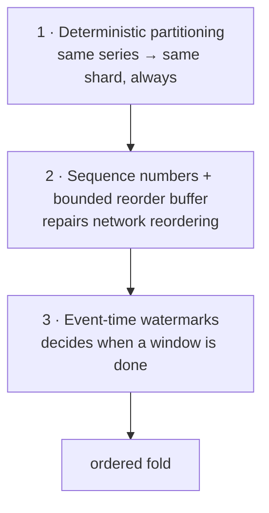

# 03 · Ordering and consistency

## Why order matters at all

"Preserve the order of events" is easy to state and expensive to deliver, so it
is worth being precise about where the cost buys something. Of the three metric
kinds, only two care:

| Kind | Fold | Order-sensitive? |
| --- | --- | --- |
| counter | cumulative → delta, with reset detection | **yes** |
| gauge | last-write-wins | **yes** |
| histogram | add to a sketch | no — commutative |

The counter case is the sharpest. Producers emit *cumulative* counters; the useful
quantity is the increase, which only exists between adjacent points. A pod that
restarts resets its counter to zero, which arrives as a decrease:

```go
if p.Value >= s.prev {
    s.delta += p.Value - s.prev     // normal increase
} else {
    s.delta += p.Value              // counter reset: attribute the new value
    s.resets++
}
```

Out of order, this does not degrade gracefully — it produces confident garbage.
Values `10, 20, 5(reset), 15` fold to a true increase of **25**. Shuffled to
`10, 5, 20, 15` the same code reports **35** and two phantom resets: every
backwards step is indistinguishable from a restart. There is no way to tell them
apart after the fact, which is why order has to be restored *before* the fold
rather than corrected after it.

Both cases are pinned by tests, including the negative control:

- `TestOrderingRestoredBySequenceNumbers` — scrambled arrival, `delta == 25`
- `TestUnorderedFoldProducesWrongCounterDelta` — same points, reordering
  disabled, asserts the answer is **wrong**. If someone makes the unordered path
  accidentally correct, this test fails and tells them the guarantee is no longer
  being exercised.

## What is guaranteed, and what is not

> **Guaranteed:** for a given `(source, series)` stream, points are folded in the
> order that source emitted them, up to a bounded repair window.
>
> **Not guaranteed:** any ordering between different sources, different series, or
> events separated by more than the reorder bound.

Global total ordering is rejected deliberately. It requires a global clock or a
consensus sequencer, it serializes the entire pipeline through one point, and
nobody consuming metrics has a question whose answer depends on whether
checkout's request preceded billing's. Buying it would cost throughput and
availability to answer a question no one asks.

## The three mechanisms

Ordering is an **end-to-end property**. All three of these must agree, and a
mismatch in any one silently destroys the guarantee at a process boundary.



### 1 · Deterministic partitioning

```go
func PartitionFor(key string, n int) int {   // FNV-1a, written out longhand
    h := uint64(offset64)
    for i := 0; i < len(key); i++ { h ^= uint64(key[i]); h *= prime64 }
    return int(h % uint64(n))
}
```

Longhand rather than `hash/maphash` for a specific reason: **maphash is seeded
randomly per process.** Gateway and aggregator would compute different partitions
for the same series, a series would arrive at two different shards, and neither
would see the full ordered stream. The bug would look like intermittently wrong
counter rates with no error anywhere — the worst kind. Partitioning must be a pure
function of the key, stable across processes, restarts, and releases.

The series key itself is canonicalized with **sorted labels**, so two producers
emitting the same logical series with different map iteration order land on the
same shard. `TestPartitionIsStableAndDeterministic` covers both properties.

### 2 · Sequence numbers and the reorder buffer

Partitioning routes points to the right owner; it says nothing about the order
they *arrive* in. Retries, parallel connections, and broker rebalances all
reorder. Sequence numbers are the only ordering information that survives those
hops.

**Sequence numbers are scoped to `(source, series)` — not to the producer.** This
is the subtle part. A per-producer counter arrives at each shard full of holes
(that shard only owns some of the producer's series), and the reorder buffer would
spend its life declaring gaps that were not gaps. The
[client SDK](../pkg/client/client.go) maintains `map[streamKey]uint64` and assigns
the sequence *under the same lock that orders the buffer*, at emission time —
because the sequence exists to encode the order in which the producer observed
reality, and assigning it later at flush time would let two racing goroutines be
numbered in an order that does not match what they saw.

The buffer is bounded in two dimensions, because an unbounded reorder buffer is a
memory leak with a deadline:

| Bound | Default | Effect when hit |
| --- | --- | --- |
| `ReorderDepth` | 64 points | declare a gap, skip forward |
| `MaxReorderDelay` | 250 ms | declare a gap, skip forward |

Hitting either emits a `sequence_gap` error, marks the affected window `Partial`,
and **continues**. A permanently lost point degrades one series' completeness
rather than stalling its stream forever — the ordering guarantee is explicitly
subordinate to liveness, and the `Partial` flag is how that trade is disclosed to
the consumer instead of hidden.

**Stream start-up.** The buffer cannot assume the first point to *arrive* is the
first point in the stream — that is the very reordering it exists to repair — nor
that sequences start at 1, since it may be joining mid-stream after a restart. So
it parks points until a bound tells it enough have been seen, then adopts the
lowest sequence as the origin. That start-up delay is the price of a correct
origin and is paid once per stream.

Replays (`Seq < next`) are discarded, which is what makes the fold **idempotent**
under the at-least-once delivery every real transport provides.

### 3 · Event-time watermarks

Windows are keyed on **event time** — when the thing happened — not processing
time. Processing-time windows silently reassign data whenever the pipeline
hiccups, so the same input produces different output depending on how busy the
system was, which makes every historical comparison a lie.

```
watermark = max(event_time seen by this shard) − AllowedLateness
```

A window closes when `window_end <= watermark`. Because the watermark advances on
the data path, a busy window closes on the first point of the next window — one
inter-arrival gap, not one tick.

Three defences around this:

- **Per-shard watermarks**, not global. A global watermark would need
  coordination between shards on every point, reintroducing exactly the shared
  state the design removed.
- **Future-skew rejection.** One producer with a broken clock could otherwise drag
  the watermark hours forward and force-close every open window on its shard,
  silently truncating everyone else's data. `MaxFutureSkew` rejects those points
  at `Submit` (`TestFutureSkewCannotForceCloseOtherWindows`).
- **Wall-clock idle close.** The watermark cannot advance without data, so a
  series that stops emitting would hold its last window open forever. The
  maintenance tick closes windows whose wall-clock time has passed, with
  `Reason: idle` so consumers can distinguish it.

### Window alignment

Windows are **epoch-aligned** (`WindowStart(t, size)` snaps down to a multiple of
the size), never aligned to process start. Every shard, every replica, and every
restart therefore agree on boundaries with zero coordination — which is the
precondition for aggregates being mergeable.

## Consistency model

> **Eventual, monotonic, never retracted.**

- **Eventual** — a window is visible once it closes, roughly
  `WindowSize + AllowedLateness` after the events it covers.
- **Monotonic** — a published aggregate is immutable. A point arriving after its
  window closed is counted as `late` and reported; it is **not** folded in behind
  a reader's back. Retracting a published value would break every downstream
  consumer that already alerted on it.
- **Mergeable** — the fold is designed so that partial views combine:
  counts/sums/deltas add, min/max take extremes, sketches sum bucket-wise, and
  `Last` resolves by event time. This is what makes scatter-gather reads correct
  and lets a restarted replica's partial window combine with what was already
  stored instead of clobbering it.

### The completeness/latency dial

`AllowedLateness` is the one knob that trades them off, and there is no setting
that avoids the trade:

| Setting | Freshness | Completeness |
| --- | --- | --- |
| 0 | window closes immediately | every straggler is `late` |
| 2 s (default) | +2 s | tolerates normal producer skew |
| 30 s | +30 s | tolerates a GC pause or a network blip |

What the design *can* do is make the consequence visible rather than silent:
every aggregate carries `Late`, `Gaps`, `OutOfOrder`, and `Partial`, so a consumer
can decide for itself whether a window is trustworthy instead of having that
decided for it upstream.

## Failure-mode summary

| Situation | Response | Signal |
| --- | --- | --- |
| Points arrive out of order, within bounds | reordered, folded correctly | none |
| Point permanently lost | gap declared after bound, stream continues | `sequence_gap`, `Partial`, `Gaps` |
| Point replayed (at-least-once) | discarded, fold stays idempotent | `duplicate` |
| Point arrives after its window closed | counted, not folded | `late`, `Late` |
| Producer clock far in the future | rejected at `Submit` | `validation` |
| Series stops emitting | window closed on wall clock | `Reason: idle` |
| Replica restarts mid-window | partial window flushed, merged on read | `Partial`, `Reason: shutdown` |
