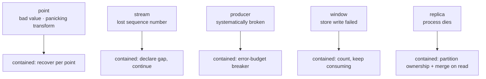

# 04 · Error handling

## The principle

> A failure that affects one point, one series, or one producer must never stop
> the aggregation of everything else.

In an aggregation pipeline, `return err` is almost always the wrong instinct.
Unwinding a stage to report one bad point throws away the fold of every good
point that shared it. So errors here are **values that travel alongside results**,
not control flow that propagates upward.

## The contract

```go
type Result struct {
    Shard       int
    WindowStart, WindowEnd time.Time
    Aggregates  []model.Aggregate  // what we computed
    Err         *merr.MultiError   // every way it was incomplete
    Reason      CloseReason        // watermark | idle | shutdown
    ClosedAt    time.Time
}
```

**A non-nil `Err` never means the aggregates are invalid.** It means they are
incomplete in specific, enumerated ways. The two are delivered together, in one
value, because a consumer needs both to decide what to trust:

- `Aggregates` with `Err == nil` — complete
- `Aggregates` with `Err != nil` — usable, with named caveats
- `Aggregates` empty with `Err != nil` — everything failed, and here is why

The synchronous API mirrors it. `Collect()` returns a `Snapshot` holding both, and
its `error` return is reserved for "the pipeline could not be built at all":

```go
snap, err := pipeline.Collect(ctx, cfg, points)  // err: configuration failure only
snap.Aggregates                                   // the million points that worked
snap.Err                                          // the three that did not
```

`TestPartialFailuresDoNotStopAggregation` asserts exactly this shape: ten good
points aggregate, one panicking point and one rejected point are reported, and a
*different series on the same shard* is untouched.

## The failure taxonomy

Categories exist so operators can alert on classes rather than on message text,
and so the pipeline can apply a different policy per class.

| Code | Cause | Policy | Retryable |
| --- | --- | --- | --- |
| `validation` | malformed point; transform rejected it | drop the point | no |
| `sequence_gap` | reorder bound exceeded; a point is missing | skip forward, mark window `Partial` | no |
| `duplicate` | at-least-once replay | discard, keeping the fold idempotent | no |
| `late` | arrived after its window closed | count, do not fold | no |
| `panic` | the fold or transform panicked | contain to that point | no |
| `backpressure` | shard queue full | shed or block per policy | **yes** |
| `quarantine` | source exceeded its error budget | shed the source until cooldown | after cooldown |
| `downstream` | store write or publish failed | count, keep folding | **yes** |
| `overflow` | the error collector itself hit its cap | keep counts, drop detail | n/a |

`*merr.Error` wraps its cause and `*merr.MultiError` implements
`Unwrap() []error`, so `errors.Is` and `errors.As` see through the whole tree:

```go
errors.Is(snap.Err, model.ErrNoService)   // a specific validation cause
errors.Is(err, merr.ErrBackpressure)      // should the producer retry?
```

## Containment layers

The blast radius of a failure is the smallest unit that can own it. Nothing
escalates to "the shard stops folding".



### Point — panic isolation

```go
defer func() {
    if rec := recover(); rec != nil {
        st.partial = true          // the fold may have been interrupted mid-update
        s.stats.panics.Add(1)
        s.errs.Add(&merr.Error{Code: merr.CodePanic, ...})
    }
}()
```

Without this, one malformed input inside a user-supplied `Transform` kills the
shard goroutine and with it the in-memory state of **every series that hashes to
that shard** — turning a data problem into an availability problem. The test
forces `Shards = 1` precisely to measure that worst case.

It costs a deferred call per point. That is a real cost on a hot path, so it is a
config flag (`PanicIsolation`, default on) rather than a hardcoded assumption —
and the branch is taken *before* the `defer` is set up, so disabling it removes
the cost entirely rather than merely skipping the recover.

The series is marked `Partial` on a panic, because a fold interrupted midway may
have incremented `count` without updating `sum`.

### Stream — bounded reorder

Covered in [03](03-ordering-and-consistency.md): after `ReorderDepth` points or
`MaxReorderDelay`, the buffer declares a gap and moves on rather than stalling the
stream forever behind one lost packet. Liveness beats completeness, and `Partial`
discloses the trade.

### Producer — the error-budget breaker

A systematically broken producer — wrong schema after a bad deploy, corrupt
payloads — otherwise burns pipeline capacity indefinitely and floods the error
path.

```go
if total >= QuarantineMinSamples && bad/total > QuarantineErrorRate {
    quarantine(source, now.Add(QuarantineCooldown))
}
```

Three deliberate details:

- **Per source, not global.** One broken pod does not shed a healthy one, even
  when they share a shard. The test asserts the healthy producer still succeeds.
- **A minimum sample count**, so a source's first bad point cannot shed it.
- **Exponentially decayed counters** (halved on each maintenance tick), so the
  breaker reflects the recent past rather than accumulated history — a producer
  that was broken an hour ago and has been fine since is not still being punished.

Rejection happens at `Submit`, before the point costs a shard slot, and the
breaker state lives in a `sync.Map`: written rarely (a trip), read on every
`Submit`. An `RWMutex` would put every submitting goroutine on one contended cache
line.

Quarantine is **conservative by design**: any shard observing a bad enough rate
sheds the source globally.

### Window — downstream failures

A store write failure must not stall the result consumer, because a stalled
consumer backpressures into the shards and from there into ingest. So it is
counted, recorded, logged, and consumption continues.

### Replica — process death

Partition ownership plus mergeable aggregates. A replica that dies loses its
in-flight windows for its partitions only; a replica that restarts and re-emits a
partial window merges with what is stored rather than clobbering it.

## Bounded error collection

The error path is a resource like any other, and treating it as free is how an
input problem becomes an out-of-memory outage. A poisoned producer emitting a
million bad points per second would, with naive collection, allocate a million
error objects per second.

`merr.Collector` retains at most `MaxErrorsPerWindow` detailed errors per shard
per window. Past the cap it keeps **exact per-category counts** and drops the
detail:

```
301 partial failures (quarantine=1 validation=300); first: validation
source=poison-pod series=fraud/scores: transform rejected point:
unparseable payload from poison-pod; 237 further details dropped
```

Counts stay exact — so alerting thresholds still work — while memory stays
constant. The demo output shows this happening under load.

The collector is also **deliberately not goroutine-safe**. One per shard means
recording an error is a plain slice append with no lock, consistent with the rest
of the ownership model. Per-shard collectors are merged only when a window closes.

## Errors across service boundaries

Partial failure is not just an in-process concept; each hop preserves it.

**Producer SDK → gateway.** `207 Multi-Status` with per-point errors. A batch of
1000 with 3 bad points reports 997 accepted and itemizes the 3. Rejecting the
batch would punish a producer for one bad label; accepting silently would hide a
broken producer forever.

**Gateway → transport.** Publish failure returns `503` and the producer retries.
At-least-once only works if the producer is told when we did *not* get the data —
and the duplicate suppression downstream is what makes those retries safe.

**Transport → aggregator.** Only plausibly-transient failures (backpressure) ask
for redelivery. Permanently invalid data is dropped rather than redelivered
forever, because redelivering it blocks the partition and takes down every
healthy series behind it. After `MaxAttempts` an envelope is dead-lettered, with a
hook so at-least-once does not quietly become at-most-once.

**Aggregator → query-api.** A query reaching 9 of 10 replicas returns 9/10 of the
data with `degraded: true` and the replica counts, at `200` or `206` depending on
the configured completeness floor; `503` only when *no* replica answered.

## Operator surface

| Endpoint | Purpose |
| --- | --- |
| `GET /v1/stats` | counters: accepted, folded, late, duplicates, gaps, panics, backpressure, shed |
| `GET /v1/errors` | bounded sample of recent partial failures, with codes and sources |
| `GET /v1/quarantine` | currently shed producers and their cooldown expiry |

Suggested alerts, in rough priority order:

- `rate(panics) > 0` — always a bug; the pipeline survived, but something is wrong
- `rate(backpressure) / rate(accepted) > 0.01` — the aggregator is undersized
- `rate(late) / rate(folded) > 0.05` — `AllowedLateness` is too tight, or a
  producer's clock is drifting
- `quarantines > 0` — a producer is broken; the label names it
- `dropped_results > 0` — a shutdown deadline was too short and data was lost
