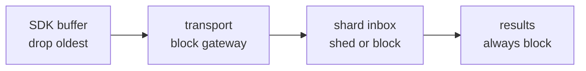

# 05 · Latency and backpressure

## Where the latency actually is

"Minimal latency" is only meaningful once you say latency of *what*. Two very
different numbers get conflated:

| | | Default |
| --- | --- | --- |
| **Ingest latency** | producer calls `Submit` → point is folded | tens of microseconds |
| **Emission latency** | event happens → its window is queryable | `WindowSize + AllowedLateness` |

The second dominates by four orders of magnitude, and it is dominated by
*semantics*, not by code: a 10-second window cannot be emitted in under 10
seconds without changing what it means. Optimizing the fold path from 72 ns to
40 ns changes nothing a user can perceive. Knowing which number is which is what
keeps optimization effort pointed at the right term.

### Budget, event → queryable

| Stage | Default | Notes |
| --- | --- | --- |
| SDK buffer | 0–100 ms | `FlushInterval`; the largest tunable term |
| HTTP + validation + partition | ~0.5 ms | |
| Transport | ~1 ms in-proc, 5–20 ms brokered | |
| Reorder buffer | 0–250 ms | only for a stalled stream; 0 in the common case |
| Window fill | 0–`WindowSize` | semantic, not overhead |
| Watermark wait | `AllowedLateness` | semantic; the completeness dial |
| Fold + close + store | < 1 ms | |

To make it faster, turn down `FlushInterval`, `WindowSize`, and
`AllowedLateness` — in that order. Nothing in the code path is worth touching
first.

## What was done for the fast path anyway

Ingest latency still matters, because it is paid on the caller's goroutine inside
the services being monitored.

- **One hop, no dispatcher.** The caller hashes and sends directly to the owning
  shard. A dispatcher goroutine would add a scheduler handoff per point.
- **No locks on the fold path.** Exclusive per-goroutine ownership rather than
  synchronization ([02](02-concurrency-model.md)).
- **Memoized series keys.** Computed once at the gateway (it needs the key to
  partition anyway) and reused; the aggregator never re-sorts labels.
- **Non-blocking fast path.** A `select` with `default:` — the slow path with its
  timers and error construction is behind a taken branch.
- **Inline window closing.** A window closes on the first point of the next
  window, not on a timer tick.
- **No per-point allocation.** Verified by the benchmark.

```
BenchmarkSubmit-18    49347747    72.36 ns/op    281 B/op    2 allocs/op
```

Both allocations are the benchmark's own `&model.Point{}`. `Submit` itself
allocates nothing: ~13.8M points/sec of headroom per instance.

## Backpressure policy

Every queue is bounded, and each has a deliberate and *different* answer for
overflow. Uniformity here would be a bug, because the value of what is queued
differs by orders of magnitude.



### SDK buffer — drop oldest

For live telemetry, fresh data is worth more than a backlog nobody will look at.
Dropping the newest would mean that during an incident — exactly when the
gateway is most likely to be struggling — your dashboard shows old data. The
client counts drops and exposes them, because a producer silently dropping points
is invisible from the server side, which only ever sees what arrived.

Retries put the failed batch back at the **front**, not the tail: appending would
ship newer points before older ones and hand the aggregator a reordering that
maximizes reorder-buffer stalls.

### Shard inbox — `PolicyDropNewest` by default

> Monitoring should degrade before the thing it monitors does.

If the aggregator blocks, that backpressure travels up through the SDK into the
request-handling goroutines of the services being observed. The metrics system
becomes the outage. So the default sheds, returns `merr.ErrBackpressure`, and
counts it.

`PolicyBlock` is the right choice when points are load-bearing — billing events,
SLO burn — where a missing point is worse than added latency. It waits up to
`SubmitTimeout` and then sheds anyway, so it is bounded blocking, not unbounded.

`Collect()` forces `PolicyBlock`, because a bounded batch has a known end and
waiting for capacity is strictly better than shedding.

### Results channel — always block

Dropping a closed window discards the folded result of potentially millions of
points; dropping one incoming point discards one point. Different magnitudes,
different answers.

A stalled result consumer becoming ingest backpressure is correct, and it is a
documented caller obligation: **drain `Results()` until it closes.** The only
escape is `abandon`, closed when `Close`'s context expires, and the windows lost
that way are counted in `Stats().DroppedResults`.

## Tuning by workload

| Workload | `WindowSize` | `AllowedLateness` | `Overflow` | Notes |
| --- | --- | --- | --- | --- |
| Live dashboards | 5–10 s | 1–2 s | drop_newest | freshness over completeness |
| Alerting / SLO | 30–60 s | 5–10 s | drop_newest | longer windows are less noisy |
| Billing / metering | 60 s | 30–60 s | **block** | completeness is the product |
| Batch backfill | 5 m | 0 | block (`Collect`) | data is already historical |

Sizing:

- **`Shards`** — default `GOMAXPROCS`. More shards than cores buys nothing (each
  is one goroutine) and costs memory: every shard keeps its own window maps.
- **`ShardQueueSize`** — sized to absorb a burst, not to be durable. Total
  buffered points is `Shards × ShardQueueSize`; at ~200 B/point, 8 × 8192 is about
  13 MB of burst absorption.
- **`ReorderDepth`** — how much reordering the transport actually produces.
  In-process is zero; a brokered path with retries can be dozens. Too large wastes
  memory, too small declares false gaps.

## Failure signatures

| Symptom | Likely cause | Action |
| --- | --- | --- |
| `backpressure` rising | aggregator undersized, or a slow store | add replicas; check `store_failures` |
| `late` rising | producer clock drift, or `AllowedLateness` too tight | check NTP; widen lateness |
| `gaps` rising | transport dropping, or `ReorderDepth`/`MaxReorderDelay` too small | check transport; widen bounds |
| `queue_depth` pinned at capacity | a shard is wedged | check `panics`; profile the transform |
| `open_windows` climbing | watermark not advancing; a series went idle | check for stalled producers |
| `dropped_results` > 0 | shutdown deadline too short | raise `terminationGracePeriodSeconds` |
