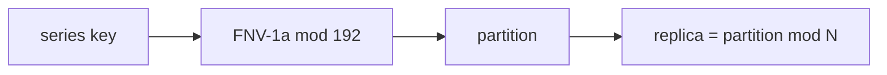

# 07 · Scaling and operations

## Capacity model

Each tier is bounded by a different quantity, which is the whole reason they are
separate services.

### ingest-gateway — CPU-bound, trivially horizontal

Roughly 30–50 µs of CPU per point (JSON decode, validate, key, publish). One core
handles ~25k points/sec, so a 2-core pod is ~50k/sec. Stateless: scale on CPU with
an HPA. Nothing to rebalance.

### aggregator — memory-bound by cardinality

This is the number to model. Per open `(series, window)`:

| | bytes |
| --- | --- |
| `seriesState` | ~150 |
| map overhead | ~50 |
| histogram sketch (sparse, ~20 buckets) | ~350 |

```
memory ≈ active_series × open_windows × ~550 B
```

`open_windows` is normally 2 (the current one plus the one waiting on the
watermark), so:

| Active series | Steady-state | Recommended limit |
| --- | --- | --- |
| 100k | ~110 MB | 1 Gi |
| 1M | ~1.1 GB | 4 Gi |
| 10M | ~11 GB | shard across replicas |

Plus reorder-buffer state: `active_streams × ReorderDepth × ~200 B` **worst case**
— but only for streams actually experiencing reordering, which is normally near
zero. Idle streams are evicted after `IdleStreamTTL`.

Set `GOMEMLIMIT` to ~90% of the container limit. Go's GC is heap-proportional; a
container limit it does not know about means the OOM killer arrives before a
collection does.

### query-api — bound by fan-out

Every query costs one request per aggregator replica. At 3 replicas that is 3×
amplification; at 30 replicas it is 30× and the read tier needs its own cache.

## Scaling the aggregator

The stateful tier is the one with a real cost, because **partition ownership is
part of the data model**.



`BUS_PARTITIONS` is deliberately much larger than the replica count (192 for 3
replicas). Partitions are the unit of ownership transfer; keeping many of them
means adding a replica re-maps partitions rather than rehashing every series.

**Changing the replica count moves ownership.** During the transition a series may
be folded by both the old and the new owner. This is survivable rather than
catastrophic, and only because of decisions made earlier:

- windows are **epoch-aligned**, so both replicas agree on boundaries;
- aggregates are **mergeable**, so the query tier's `MergeAggregates` reassembles
  the two partial views into the correct answer;
- the store **merges on write** rather than overwriting.

What *is* lost during a rebalance: reorder-buffer state (the new owner restarts
cold and re-establishes stream origins) and any in-flight window on a replica that
did not shut down gracefully. Hence `OrderedReady` pod management, a
`PodDisruptionBudget` of `maxUnavailable: 1`, and a grace period long enough to
flush.

**Rebalance during a quiet period.** With `WINDOW_SIZE=10s`, aggregate
completeness is briefly degraded for about one window per moved partition.

## Backfill and replay

The synchronous `Collect()` API runs the identical fold over historical points,
with `AllowedLateness: 0` (the data is already historical) and `PolicyBlock` (a
bounded batch has a known end). Because windows are epoch-aligned and aggregates
merge, backfilled windows combine correctly with live ones.

With a durable transport, replay from an offset is the operational recovery path;
duplicate suppression in the reorder buffer is what makes replaying a range safe
rather than double-counting.

## SLOs

| | Target | Measure |
| --- | --- | --- |
| Ingest availability | 99.9% | non-5xx `/v1/metrics` |
| Freshness | p99 < `WindowSize + AllowedLateness + 5s` | event time → queryable |
| Completeness | > 99.9% of accepted points folded | `folded / accepted` |
| Query availability | 99.9% non-degraded | `degraded == false` |

Completeness deliberately measures **accepted**, not emitted: points shed at
`Submit` under backpressure are a capacity failure and belong in a different
budget from points lost after acceptance, which is a correctness failure.

## Runbook

### `backpressure` climbing

The aggregator cannot keep up. Check `queue_depth` against `queue_capacity` and
`store_failures` first — a slow store backpressures through the result channel
into the shards and presents exactly like an undersized aggregator. If the store
is fine, add replicas or raise `SHARD_QUEUE_SIZE` (buys burst absorption, not
throughput).

### `late` climbing

Producer clocks or a genuinely slow path. Check NTP on the producers named in
`/v1/errors`; the message carries the event time and the closed window end, so the
skew is readable directly. If the skew is real and unavoidable, widen
`ALLOWED_LATENESS` — freshness is the price.

### `panics` non-zero

Always a bug, never expected. The pipeline survived (that is what isolation is
for) and `/v1/errors` names the series and source. Reproduce with `Collect()` over
the offending points.

### A producer is quarantined

`GET /v1/quarantine` names the source and its cooldown expiry; `/v1/errors` has
the underlying failures. This is nearly always a bad producer deploy. Fixing the
producer is the remedy — quarantine lifts automatically after
`QuarantineCooldown`. To lift it early, restart the aggregator replica (the table
is in-memory).

### `dropped_results` non-zero

A shutdown deadline expired while windows were still being delivered, and that
data is gone. Raise `terminationGracePeriodSeconds` above
`WINDOW_SIZE + ALLOWED_LATENESS + SHUTDOWN_GRACE`, and check whether the result
consumer was wedged (`store_failures`).

### Cardinality explosion

`store.rejected_cardinality > 0` means `MAX_SERIES` was hit — almost always a
producer putting an unbounded value (request ID, user ID, timestamp) in a label.
`/v1/query` will show the offending metric name. Fix the producer; the point-level
`MaxLabels` cap bounds one dimension of this, but not label *values*.

## Observability wiring

The service exposes its own health as JSON counters at `/v1/stats` rather than in
Prometheus exposition format, to keep the core dependency-free. Wiring it up in
production is a small adapter — the counters are already the right shape (all
monotonic, all safe to scrape at any rate, all reset-by-restart).

What matters more than the format: **this service must not be monitored solely by
itself.** Export `client.Stats()` from producers through an independent path, or a
total ingest failure looks identical to zero traffic.
