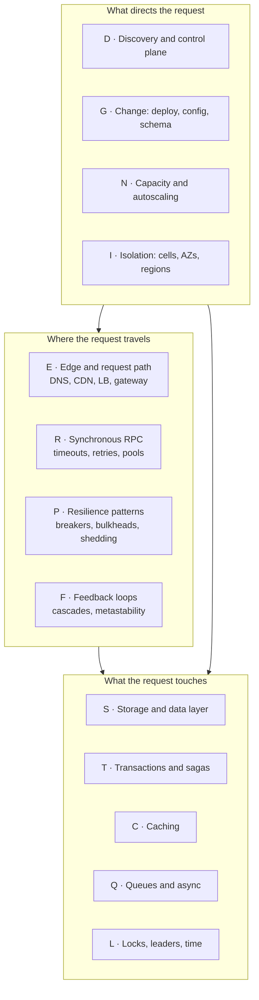

# What a Point of Failure Actually Is

Start with the question people usually ask, because it is the wrong question and seeing why it
is wrong is most of the value of this doc.

> "What are the single points of failure in this architecture?"

Someone asks this in a design review. The answer that comes back is a list of boxes that only
exist once: the primary database, the single Redis instance, the one API gateway. The team makes
each of those redundant. Six months later the system has an outage that lasts four hours, and
not one of the redundant components failed. Every database replica was up. Every gateway
instance was healthy. Every pod was `Running`. And the site was down.

That happens because the question assumed a *point of failure* is a component, and it is not. A
point of failure is a **place where one thing going wrong changes the behaviour a user sees.**
Some of those places are components. Most of them are not. They are:

- The *arrows* between components — a timeout, a retry policy, a connection pool.
- The *shared resources* underneath components that the diagram does not draw — the same thread
  pool, the same NAT gateway, the same rack, the same deployment pipeline.
- The *control systems* that decide what the components do — the service registry, the
  configuration service, the feature-flag system, the autoscaler.
- The *assumptions* the design encoded — that this dependency is fast, that this cache is warm,
  that these two failures are independent.

This doc builds the vocabulary for talking about all four precisely. Everything after it uses
these words without redefining them.

## First, the property that makes distributed systems different

A single program has two outcomes when it calls a function: it returns, or it throws. A
distributed system has three, and the third one is the whole problem.

When `checkout-api` sends an HTTP request to `payment-service` and the request times out,
`checkout-api` knows exactly one thing: it did not receive a response. It does **not** know
whether:

1. The request never arrived, and no payment was taken.
2. The request arrived, `payment-service` charged the card, and the response was lost.
3. The request arrived, `payment-service` is still working on it, and it will charge the card in
   another two seconds — after `checkout-api` has already given up and told the customer the
   purchase failed.

This is called **partial failure**, and it is the defining property of a distributed system: *you
can always find out that something went wrong, and you can never reliably find out what.* A
single-process program does not have this problem, because a function call and its return travel
over the same stack frame. A network call does not have that guarantee, and no amount of
engineering creates it — this is a proven limitation, not an implementation gap.

Everything in this collection descends from that one fact. Retries exist because you do not know
whether the first attempt happened. Idempotency keys exist because retries mean the request may
now happen twice. Sagas exist because you cannot atomically commit across two systems that can
independently fail. If you ever find yourself designing something that requires knowing whether a
remote call succeeded, stop — you are designing around a guarantee you cannot have, and the
correct move is to make the outcome not matter (idempotency) or to make the uncertainty
explicit (a state machine with a `PENDING` state).

## Availability, stated as arithmetic

Before naming failure classes, get a number on the table, because the number explains why
microservices have a failure problem that monoliths do not.

Suppose a service is available 99.9% of the time. That is a common target and sounds strong: 43
minutes of downtime per month. Now suppose serving one request requires **all** of five services
to work, each independently at 99.9%. The probability that all five work is:

```
0.999 ^ 5 = 0.99500...
```

That is 99.5%, or **3 hours 39 minutes of downtime per month** — five times worse than any
individual service. Nobody made a mistake. Each team hit its target. The composition did not.

Push it to a realistic depth. A Riverbend checkout request touches, synchronously, in the
critical path: the gateway, auth, cart, pricing, promotions, inventory, tax, payment, fraud, and
the order writer. Ten services:

```
0.999 ^ 10 = 0.99004  →  99.0%,  about 7 hours 18 minutes per month
```

And a Corridor feed load fans out to roughly 30 downstream calls per request across ranking,
profile hydration, notification counts, and ads:

```
0.999 ^ 30 = 0.97045  →  97.0%,  about 21 hours 40 minutes per month
```

Three conclusions follow, and they shape every design decision in this collection.

**First, serial dependency depth is itself a point of failure.** Not any one of the thirty
services — the fact that there are thirty of them in series. The highest-leverage reliability
work is often removing a hop, not hardening one.

**Second, availability targets do not compose upward, so they must be *allocated* downward.** If
the feed must hit 99.9%, you cannot give thirty dependencies 99.9% each. You either give them
99.997% each (which nobody can do), or — the real answer — you make most of the thirty
dependencies **not required**.

**Third, that is what "graceful degradation" actually means, and it is arithmetic, not
sentiment.** If 27 of the 30 calls are optional (their failure produces a feed with a missing
badge rather than an error page), then only the 3 required calls multiply:

```
0.999 ^ 3 = 0.99700  →  99.7%
```

Going from 30 required calls to 3 required calls plus 27 optional ones moved the service from
97.0% to 99.7% — a 10× reduction in downtime — **with no change to the reliability of any
individual service.** This is why doc 03 spends so long on fallbacks. The classification of a
dependency as required or optional is the single most consequential reliability decision in a
microservice design, and it is usually made accidentally by whoever wrote the first version of
the client code.

### Hard and soft dependencies, defined

Give those two categories names, since the rest of the collection uses them constantly.

A **hard dependency** is one whose failure makes the operation impossible. You cannot complete a
purchase without charging the card. Payment is a hard dependency of checkout.

A **soft dependency** is one whose failure degrades the operation but does not prevent it. You
can complete a purchase without recording a recommendation event. Recommendations are a soft
dependency of checkout.

The critical discipline: **a soft dependency is only soft if the code actually treats it that
way, under the failure conditions that really occur.** A recommendation call wrapped in
`try/catch` looks soft. If that call has a 30-second timeout and no bulkhead, then when the
recommendation service hangs, every checkout thread blocks for 30 seconds waiting for a
dependency you classified as optional, and your checkout throughput goes to zero. The dependency
was soft in the exception handler and hard in the thread pool. Doc 03 (`P-06`) is that failure,
and it is one of the most common serious outages in this collection.

So the test for a soft dependency is not "is there a fallback?" It is: **if this dependency stops
responding entirely — not errors, hangs — does my service's throughput change?** If yes, it is
hard, whatever your code comments say.

## Failure domains and blast radius

A **failure domain** is a set of things that fail together. Not things that *might* fail at the
same time — things whose failures are caused by the same event.

Real failure domains in a typical cloud deployment, from smallest to largest:

| Domain | What shares it | What takes it out |
|---|---|---|
| Process | One container | OOMKill, panic, deadlock |
| Pod | Containers in a pod | Node pressure, eviction |
| Node | All pods on one VM | Kernel panic, hardware failure, node drain |
| Rack / placement group | Nodes sharing a top-of-rack switch or power | Switch failure, PDU failure |
| Availability zone | Everything in one data centre | Power, cooling, network partition, fibre cut |
| Region | All zones in a geography | Rare; usually a control-plane or DNS event, not physical |
| Cell / shard | A slice of users or tenants | A poison request, a hot tenant, a bad shard config |
| Deployment unit | Every instance running the same build | A bad deploy |
| Configuration scope | Every instance reading the same config | A bad config push |
| Dependency | Every caller of one service | That service's outage |
| Account / quota | Everything under one cloud account or quota | Hitting an API rate limit or a service quota |

Notice that the bottom five are not physical. They are the ones people forget, and they are the
ones that cause the multi-hour outages. Your three availability zones give you nothing against a
bad deploy, because **all three zones run the same build**. Deployment is a failure domain that
spans every physical domain you carefully separated.

**Blast radius** is the answer to: when this failure domain fails, what fraction of users, or
requests, or data, is affected? It is the number that turns a failure into a severity.

Work it through on Lumen. 500M daily active users. Suppose Lumen runs 3 regions, each with 3
availability zones, and within each region the user base is split into 16 cells.

- One pod dies: blast radius ≈ 0, other pods absorb it.
- One AZ fails: one ninth of capacity, but if you provision N+1 per region, blast radius is
  elevated latency, not errors. ~0% of users see an error, 33% of one region's traffic re-routes.
- One cell fails: 1/16 of one region ≈ 2% of users, but **100% affected for those users.**
- A bad deploy rolled to all cells: **100% of users.**
- A bad config push read by every service: **100% of users, in under a minute, with no bad code
  deployed anywhere.**

That last line is the point of doc 11. Configuration propagates faster than code and is reviewed
less, which makes it the highest-blast-radius change mechanism most organisations have.

### Correlated failure: why three replicas are sometimes one replica

Redundancy only helps if the failures are **independent**. Two replicas each 99% available give
you 99.99% *only if* the events that take them down are unrelated:

```
P(both down) = 0.01 × 0.01 = 0.0001   →  99.99%
```

If instead the two replicas fail for the same reason 80% of the time, the arithmetic collapses:

```
P(both down) = 0.80 × 0.01 + 0.20 × (0.01 × 0.01)
             = 0.008 + 0.00002
             = 0.00802                →  99.2%
```

Two replicas bought you 99.2%, not 99.99%. The correlation term dominates completely — the
independent term (0.00002) is 400× smaller than the correlated term (0.008) and does not matter
at all.

This is the most important arithmetic in the doc, because **every real system has correlation and
almost every capacity plan assumes independence.** Where does correlation come from?

- **Same code.** All replicas hit the same null-pointer bug on the same malformed input. This is
  why a poison request can take down an entire fleet in seconds while every host is healthy —
  see `F-07`.
- **Same config.** All replicas read the same feature flag, and it was flipped wrong.
- **Same dependency.** All replicas call the same database, whose failover took 40 seconds.
- **Same load.** All replicas receive the same traffic spike, so they saturate simultaneously —
  and worse, as each one dies its load moves to the survivors, which accelerates the rest. This
  is the load-redistribution death spiral of `F-03`.
- **Same time.** All replicas started at the same moment, so their TTLs expire at the same
  moment, so their caches all miss at the same moment (`C-01`), so their certificates expire at
  the same moment, so their tokens refresh at the same moment.
- **Same physical substrate.** All three "zones" of your managed database are in one building
  because of a placement setting nobody checked.

A useful habit in review: for every redundant component, ask **"name the failure that takes out
all of them at once."** There is always one. Sometimes it is acceptable. It is never absent, and
if the team cannot name it, they have not thought about it and the redundancy is a guess.

## Gray failure: the state your health check cannot see

A **binary failure** is a component that is up or down. Health checks find those. A **gray
failure** is a component that is *partially* or *intermittently* or *asymmetrically* broken, and
it is far more damaging, because every automated mechanism you have is built to detect binary
failures.

Concrete examples, all of which have caused real multi-hour outages:

- A node whose disk is failing: 95% of I/O completes in 2 ms, 5% takes 30 seconds. Health checks
  read a small file and pass. Throughput through that node drops 20× and it stays in the load
  balancer pool.
- A network path that drops 3% of packets in one direction only. TCP retransmits, so nothing
  errors; p50 latency is unchanged and p99 goes from 40 ms to 3 seconds.
- A database replica that is up, accepting connections, and 45 minutes behind. Every query
  succeeds and returns stale data. This is a *correctness* failure presenting as full health
  (`S-06`).
- A service instance that responds instantly with HTTP 200 and an empty body because its
  downstream cache client failed to initialise. Fastest instance in the pool, so least-request
  load balancing sends it **more** traffic. The load balancer actively routes toward the broken
  host. Doc 05 (`D-04`) covers this; it is nicknamed the black-hole instance and it is the reason
  "fast" must never be the only health signal.
- An availability zone whose network is degraded but not partitioned. Cross-zone calls are slow;
  intra-zone calls are fine. Every zone reports healthy. Whether you see the problem depends
  entirely on which zone your client is in.

The defining property of a gray failure is **differential observability**: the system's own view
of its health disagrees with the users' view. Your dashboard is green because your dashboard
measures what the component says about itself; the users are measuring the answer they got.
Doc 14 is largely about closing that gap, and the single most valuable technique is to make your
primary health signal a *client-side* success rate rather than a *server-side* one.

## Availability failures and correctness failures are different things

Distinguish these early, because they need opposite treatment and confusing them produces bad
designs.

An **availability failure** means the user did not get an answer. An error page, a timeout, a
spinner. It is loud: the user knows, your error-rate metric knows, and an alert fires.

A **correctness failure** means the user got an answer and the answer was wrong. Stale price.
Double-charged card. An order acknowledged and never created. A seat sold twice. It is silent:
error rate is zero, latency is fine, dashboards are green, and you learn about it from customer
support, a reconciliation job, or a regulator.

| | Availability failure | Correctness failure |
|---|---|---|
| How you find out | Alert, in seconds | Reconciliation or a complaint, in hours to weeks |
| Cost of one occurrence | One annoyed user, one retry | Money, trust, sometimes a legal obligation |
| Blast radius over time | Stops when you fix it | Keeps growing; already-written bad data persists |
| Repair | Restart, fail over, scale up | Find every affected record, decide what the truth was, correct it |
| Right default | Fail fast, retry, degrade | **Refuse to proceed** |

The design rule that falls out of this table, and it is the philosophy running through the whole
collection: **when you must choose, convert a possible correctness failure into a certain
availability failure.** Riverbend would rather reject a checkout it cannot verify inventory for
than accept it and oversell. Gateline would rather show 10,000 users a "please wait" page than
sell the same seat twice. An error is recoverable by a retry. A wrong answer that has been
committed to a database and emailed to a customer is a project.

This is the same principle as the Kafka collection's "turn silent failures into loud ones" (see
[`../Kafka/README.md`](../Kafka/README.md)), and it is why `NotEnoughReplicasException` is
described there as good news.

The exception — and it is a real one, not a hedge — is when the data is inherently approximate.
Waypoint's driver-location stream (`750,000 writes/s`) is allowed to lose records, because a
location fix that is 4 seconds stale is replaced by a fresher one in 4 seconds and nobody can
tell. Waypoint's trip ledger is not allowed to lose anything. **The same company, the same
request path, two opposite correctness policies** — and doc 19 is about the seam between them,
which is where its interesting failures live.

## Control plane and data plane

This distinction determines how a system behaves during its worst hour, so it is worth being
precise.

The **data plane** is everything that serves a user request: the proxies, the services, the
caches, the databases. If the data plane stops, users see errors immediately.

The **control plane** is everything that tells the data plane what to do: the service registry,
the configuration service, the certificate authority, the scheduler, the autoscaler, the
deployment system, the feature-flag service, the DNS management layer. If the control plane
stops, *nothing happens immediately* — the data plane keeps doing whatever it was last told.

Northlight's mesh is the clearest example. 100,000 Envoy sidecars are the data plane. The xDS
servers that stream routing configuration to them are the control plane. A sidecar that loses
its xDS connection keeps routing traffic using its last-known-good configuration, indefinitely.

That property has a name: **static stability**. A statically stable system continues to operate
correctly, in its current configuration, when its control plane is unavailable. It does not adapt
— it cannot scale, deploy, fail over, or reroute — but it does not break.

The failure mode that makes this critical is: **control-plane failures and data-plane failures
are correlated in the worst possible direction.** The moment you most need the control plane is
during a data-plane incident — you need to fail over, scale out, shift traffic, roll back — and
that is exactly when the control plane is under the most load, because every component in the
data plane is simultaneously re-registering, re-resolving, and re-requesting configuration. Doc
05 (`D-09`) walks this: an AZ fails, 30,000 sidecars reconnect to xDS at once, the control plane
is overwhelmed, and now the healthy zones cannot get updated routing either. The initial failure
was one third of capacity; the outcome was total.

Three rules follow, and they are the ones this collection will keep coming back to:

1. **The data plane must survive the control plane being gone.** Cache configuration on local
   disk. Serve stale service-discovery data rather than an empty list. Never treat "I cannot
   reach the registry" as "there are no healthy backends" — that inversion is `D-05` and it turns
   a control-plane blip into a total outage.
2. **Control-plane recovery must be rate-limited.** When it comes back, everything reconnects at
   once. Jittered reconnect, connection rate limits, and admission control on the control plane
   itself. This is the "recovery stampede" and it is why some incidents have two outages in them.
3. **Pre-provision for the failure you plan to survive.** Static stability in its stronger form:
   if your plan for losing an AZ is "the autoscaler adds capacity in the other two", your plan
   depends on the control plane and the cloud provider's capacity at the exact moment both are
   stressed. Running N+1 instead means the failover requires no action from anything. It costs
   more. It works.

## Fail-open, fail-closed, fail-static

When a component cannot reach a dependency it needs in order to decide something, it has to
decide anyway. There are three postures, and choosing between them is a per-dependency judgement
that must be made deliberately.

- **Fail-closed** (also called fail-safe or fail-secure): deny. If the authorisation service is
  unreachable, reject the request. Correct for anything security- or money-related; it converts
  a possible correctness failure into a certain availability failure, which is the rule above.
- **Fail-open**: allow. If the rate-limiter service is unreachable, let the request through.
  Correct for protective mechanisms whose failure should not itself be an outage — but note the
  danger: a fail-open rate limiter that fails during a traffic spike removes your protection at
  precisely the moment it was needed.
- **Fail-static**: keep using the last known good answer. If the config service is unreachable,
  use the config you already have. Usually the best of the three, and it is available far more
  often than people realise, because it just requires caching the last successful response.

The judgement is per-dependency, and getting it wrong in either direction is a documented
outage class:

| Dependency | Posture | Why |
|---|---|---|
| AuthN / AuthZ | Fail-closed | An unauthenticated request served is unrecoverable |
| Payment authorisation | Fail-closed | Never ship goods on an unverified charge |
| Inventory check | Fail-closed | Overselling is a correctness failure |
| Feature flags | **Fail-static**, with a compiled-in default | Both fail-open and fail-closed are wrong; you want the last known value |
| Service discovery | **Fail-static** | Empty list means total outage (`D-05`) |
| Rate limiting | Fail-open, with a local fallback limiter | Do not make the protection the outage — but keep a per-instance limit so you are not fully unprotected |
| Recommendations | Fail-open (omit the section) | Soft dependency by definition |
| Fraud scoring | Fail-closed above a value threshold, fail-open below | The cost of being wrong scales with transaction size |
| Audit logging | Fail-closed if regulated, otherwise buffer to disk | "We cannot log it" often legally means "we cannot do it" |

That fraud row is worth pausing on, because it is the general pattern: **the right posture often
depends on the request, not only on the dependency.** Gateline fails closed on seat reservation
for a $4,000 front-row seat and could reasonably fail open on the loyalty-points lookup for the
same purchase. Encoding that as one global setting per dependency loses the distinction.

## The thirteen POF classes

Here is the taxonomy the rest of the collection is organised around. It is not the only possible
carving, but it has one property that matters: **each class has a distinct detection signal and a
distinct remedy**, so knowing which class you are in tells you where to look and what to do.



| Class | The question it answers | Signature symptom | Typical remedy shape |
|---|---|---|---|
| **E** Edge and request path | Can the request reach a healthy instance at all? | Errors before any of your code runs; regional or ISP-specific | Redundant resolution and routing, health-aware failover, static fallbacks |
| **R** Synchronous RPC | Does a slow dependency become my outage? | My latency equals my slowest dependency's latency; thread or connection exhaustion | Timeouts tied to a budget, bounded retries, isolated pools |
| **P** Resilience patterns | Did my protection become the problem? | Breaker stuck open after recovery; shedding good traffic; limiter rejecting at 10% load | Correct the pattern's own parameters; half-open probes; per-class limits |
| **F** Feedback loops | Why is it not recovering now that the trigger is gone? | Removing the cause does not fix it; recovery requires reducing load below the original level | Break the loop: shed, drain, cold-start with reduced traffic |
| **D** Discovery and control plane | Do my instances know where to send traffic, and is that knowledge true? | Traffic to dead hosts, or no traffic anywhere; healthy hosts idle | Fail-static caches, health checks that test the real path, rate-limited recovery |
| **S** Storage and data layer | Is the data available, current, and evenly distributed? | One shard hot; replication lag; pool exhaustion; failover write loss | Shard key design, read-your-writes routing, pool sizing from Little's law |
| **T** Transactions and sagas | Did this multi-step operation complete, or half-complete? | Records that exist in one system and not another; double charges | Outbox, idempotency keys, explicit state machines, compensations |
| **C** Caching | Is the cache absorbing load or has it become load-bearing? | Origin sees 100× traffic after a cache event; stale data served confidently | Request coalescing, jittered TTL, negative caching, capacity to run cold |
| **Q** Queues and async | Is work being processed, and can I tell? | Growing lag with zero errors; DLQ filling; ordering violated | Lag SLOs, poison handling, consumer scaling, end-to-end tracing across the queue |
| **L** Locks, leaders, time | Are two things doing the job of one? | Duplicate side effects; split brain; expiry logic wrong by hours | Fencing tokens, leases with fencing, monotonic clocks, quorum |
| **G** Change | Did we do this to ourselves? | Onset coincides with a deploy, flag flip, or config push | Progressive rollout, automated rollback, config as code, expand-contract migration |
| **N** Capacity | Do we have enough, and can we get more in time? | Saturation metrics rising ahead of latency; scale-up slower than failure | Headroom, scaling on the right signal, pre-warmed pools, correct limits |
| **I** Isolation | Does one tenant's or one cell's problem reach everyone? | Blast radius far larger than the fault | Cells, shuffle sharding, per-tenant quotas, region independence |

When you are handed an incident, working out which class you are in is the first useful act,
because each class has a different *first question*:

- **E**: Is it everyone, or one region / ISP / client version?
- **R**: Which dependency's latency moved first?
- **P**: Is a protective mechanism currently active, and should it be?
- **F**: If I remove load, does it recover? (If no, it is F, and only F.)
- **D**: Does the set of endpoints being used match the set of healthy endpoints?
- **S**: Is it all shards or one? All queries or one shape?
- **T**: Are the two systems that should agree, disagreeing?
- **C**: What is the hit rate, and when did it change?
- **Q**: Is the lag growing, flat, or shrinking, and what is the rate of change?
- **L**: How many processes believe they hold this responsibility?
- **G**: What changed in the last 60 minutes? (Ask this *first*, always — see doc 11.)
- **N**: What is saturated, and how long does more capacity take to arrive?
- **I**: What is the affected set, and does it match a boundary we designed?

## A worked classification

Take one real-shaped incident and walk it through the taxonomy, because the classes compose and
the composition is where the difficulty is.

**The incident.** On a Tuesday at 14:02, Riverbend's checkout success rate drops from 99.95% to
71%. It stays there. At 14:20 it drops to 12%. At 14:41, after someone disables the promotions
service, it recovers to 99.9% within 90 seconds.

**Walking it.** The onset was sharp, so ask the **G** question first: what changed? A promotions
configuration was pushed at 14:01 adding a new campaign. Valid config, no code deploy. That is
the trigger, class **G**.

The campaign's eligibility rule required a per-customer lookup that had previously been cached
in aggregate. Hit rate on `promo-eligibility-cache` fell from 94% to 6%. The origin — a
PostgreSQL query — went from 180 queries/s to 2,800 queries/s. That is class **C**, a cache that
stopped absorbing.

At 2,800 queries/s the promotions database's connection pool (60 connections, average query 22
ms, so a capacity of 60 / 0.022 ≈ 2,727 queries/s) saturated. Queries queued. Latency at the
promotions service went from 30 ms to the client timeout of 2 seconds. Class **S**.

`checkout-api` calls promotions synchronously with a 2-second timeout and 3 retries. Each
checkout now spent up to 6 seconds in promotions, and generated 4 requests where it used to
generate 1 — so the offered load on the already-saturated database became 11,200 queries/s.
Class **R** for the timeout-and-retry design, and the amplification puts it into class **F**.

`checkout-api`'s own worker pool is 200 threads. At 6 seconds per request and 640 req/s offered,
Little's law says it needs 640 × 6 = 3,840 concurrent workers and it has 200. Every thread is
blocked on promotions, so requests that do not need promotions at all — the ones from customers
with no eligible campaigns — also fail. Class **P**: the absence of a bulkhead made a soft
dependency hard.

And the reason it did not recover on its own between 14:20 and 14:41, even though the original
config had been in place the whole time and nothing further changed, is the retry amplification:
the system was now generating enough load to keep itself saturated regardless of the trigger.
That is the definition of **metastable failure**, class **F**, and it is why the fix had to be
"remove the dependency" rather than "wait."

**Six classes, one incident, one trigger.** This is normal. The trigger is almost always a single
class — usually **G** — and the *duration* is almost always **F**. Understanding the taxonomy is
useful not because incidents are single-class, but because it tells you that the fix for the
trigger and the fix for the duration are different pieces of work, and skipping the second one
means the next trigger produces the same four-hour outage.

Every piece of that walkthrough is picked up in detail later: the config push in doc 11, the
cache collapse in doc 08, the pool arithmetic in doc 06, the retry multiplier in doc 02, the
missing bulkhead in doc 03, and the metastability in doc 04. Riverbend's full version of it is
incident `RB-1` in doc 16.

## What to take away

1. **A point of failure is a place where one thing going wrong changes user-visible behaviour** —
   and most of those places are arrows, shared resources, control systems, and assumptions, not
   boxes on the diagram. Listing components misses the ones that cause outages.
2. **Partial failure is the irreducible property.** You can learn that a call failed; you can
   never reliably learn whether it took effect. Design so that the answer does not matter
   (idempotency) or is explicitly represented (a `PENDING` state), never so that you need to
   know.
3. **Availability multiplies down a serial path.** Ten hard dependencies at 99.9% each give you
   99.0%. Dependency depth is itself a point of failure, and removing a hop often beats hardening
   one.
4. **Graceful degradation is arithmetic.** Converting 27 of 30 dependencies from hard to soft
   took a service from 97.0% to 99.7% with no other change. Classifying each dependency as hard
   or soft is the highest-leverage reliability decision in a design.
5. **A dependency is only soft if it is soft in the thread pool, not just in the exception
   handler.** The test is: if it hangs entirely, does my throughput change?
6. **Redundancy helps only against independent failures, and the correlation term dominates.**
   Two replicas that fail together 80% of the time give 99.2%, not 99.99%. For every redundant
   component, be able to name the failure that takes out all of them at once.
7. **Your real failure domains include deployment, configuration, and dependency** — which are
   not physical and therefore span every physical boundary you paid for. Three AZs give you
   nothing against one bad config push.
8. **Gray failures defeat every automated mechanism you have**, because those mechanisms detect
   binary failure. The defence is to measure health from the client's point of view, not the
   component's.
9. **Availability failures and correctness failures need opposite treatment.** When you must
   choose, convert a possible correctness failure into a certain availability failure — unless
   the data is genuinely approximate, in which case say so explicitly and write it down.
10. **The control plane is the largest hidden point of failure**, and it fails at the worst
    moment because control-plane load spikes during data-plane incidents. Build the data plane to
    survive without it (fail-static), and rate-limit its recovery.
11. **Fail-open, fail-closed, and fail-static are a per-dependency and sometimes per-request
    decision.** The default for configuration and discovery is fail-static; the default for money
    and identity is fail-closed; and an empty service-discovery result must never be interpreted
    as "no healthy backends."
12. **The trigger and the duration of an outage are usually different classes.** The trigger is
    most often a change (`G`); the duration is most often a feedback loop (`F`). Fixing only the
    trigger leaves the next incident the same length.

Next: [01-the-request-path-and-where-it-breaks.md](01-the-request-path-and-where-it-breaks.md),
which takes one request from a phone to a database page and marks every failure point on the way
— and then shows how the read path, the write path, the async path, and the streaming path each
break differently.
