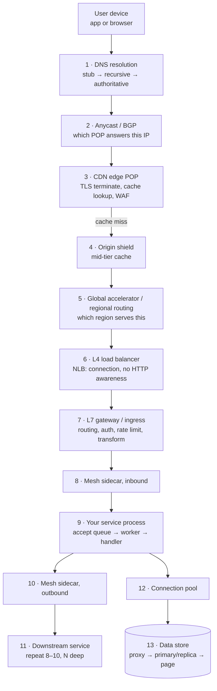

# The Request Path, Hop by Hop, and Where Each Hop Breaks

Most reliability work happens inside the service — the code you wrote, the database you chose.
But a request has already survived eight to twelve hops before your code runs, and every one of
those hops is a place it can die. Worse, when it dies there, **your metrics do not see it.** Your
service's error rate is 0.00% and a quarter of your users cannot load the page.

This doc walks the full path from a phone to a database page, naming the failure point at each
hop, and then does the thing most treatments skip: it shows that there is not *one* path. A read
and a write and an event and a streaming connection travel different routes through the same
architecture, fail in different ways, and need different defences. A design that is safe for the
read path can be catastrophic for the write path.

## The path, drawn



Thirteen hops before a byte of user data is read. Each one is a failure point with its own
symptoms and its own owner — and in most organisations, hops 1 through 7 belong to a different
team than hops 8 through 13, which is why the handoff during an incident is so often the slowest
part.

Before the catalogue, one observation that makes the rest of the doc easier to hold: **the
failure points divide into three kinds by *who* sees them.**

- **Hops 1–5 fail for a subset of users**, usually geographically or by ISP, and your servers see
  reduced traffic rather than errors. A traffic *drop* is the signal, not an error spike.
- **Hops 6–8 fail for all users of one region or one route**, and you see it as 5xx from
  infrastructure you did not write.
- **Hops 9–13 fail for the requests your code handles**, and these are the only ones your
  application metrics see natively.

If your only alerting is on hops 9–13 — and for most teams it is — then an entire class of
outage is invisible to you and you find out from Twitter.

## Hop 1: DNS resolution

DNS is the first hop and the one with the weakest failure semantics in the whole stack, because
it is a distributed cache with no invalidation that you do not control any layer of.

A resolution involves at least four parties: the application's own resolver, the operating
system's stub resolver, a recursive resolver (the ISP's, or `8.8.8.8`, or a corporate one), and
your authoritative nameservers. **You control the last one.** Everything in front of it caches
your answers according to rules it decides, and some of those parties ignore your TTL entirely.

### E-01 · The TTL you set is not the TTL in effect

**What you see.** You change a DNS record to fail away from a broken region. Traffic to the
broken region falls by 80% in five minutes, then declines slowly for two hours, and a residual
2–5% is still arriving a full day later. Those users are getting errors the whole time.

**Mechanism.** Your record's TTL is 60 seconds. The recursive resolver honours it. But:

- Java's default `networkaddress.cache.ttl` with a security manager installed used to be
  *forever*; many JVM services still cache a resolved IP for the life of the process. A
  long-running service resolved your hostname at startup and will never look again.
- Some corporate and ISP resolvers enforce a minimum TTL — 300 s or 3600 s is common — and
  simply override yours.
- Browsers keep their own DNS cache, typically 60 s but pinned longer while a connection to that
  host is open.
- HTTP keep-alive means an established connection is not re-resolved at all. A client with a
  10-minute idle timeout holds the old IP for 10 minutes *after* its resolver has the new one.

The 2–5% residual after 24 hours is almost always long-lived processes with cached resolution and
persistent connections.

**Confirm it.** Ask the authoritative side and the client side separately.

```bash
# What are you actually publishing, and with what TTL?
dig +noall +answer api.riverbend.example

# What does a specific recursive resolver believe, and how long has it held it?
# The TTL in the answer counts DOWN, so a value below your configured TTL tells you
# how long this resolver has been caching it.
dig @8.8.8.8 +noall +answer api.riverbend.example
dig @1.1.1.1 +noall +answer api.riverbend.example
```

Then check whether the traffic still arriving is from long-lived connections rather than new
ones: on the load balancer, compare new-connection rate against request rate for the region you
are draining. If requests are flat while new connections are near zero, keep-alive is holding
them, not DNS.

**Recover.** DNS failover cannot be made fast, so recover at a layer you control:

1. Make the *old* endpoint proxy to the new one rather than error. A region you are evacuating
   should forward, not refuse — that converts a user-visible failure into added latency for the
   stragglers.
2. Force connection turnover by having the draining side send `Connection: close` or a HTTP/2
   `GOAWAY`. This releases keep-alive holders within one request.
3. If the endpoint is genuinely gone, you are waiting out the caches. Say so in the incident
   channel rather than repeatedly re-pushing the record.

**Prevent.** Do not use DNS as a failover mechanism for anything that needs to fail over in less
than several minutes. Use it for coarse, slow, planned movement — region weighting, blue/green
at the day scale — and put fast failover somewhere you control:

- **Anycast plus BGP or a global accelerator**: the IP does not change, so no cache is involved;
  the network routes to a different POP. Failover in seconds.
- **Health-checked load balancing behind a stable IP**: the name resolves to the same address
  forever, and the balancer chooses healthy backends.
- **Client-side endpoint lists**: mobile apps fetch a list of endpoints and fail over within it.
  Northlight and Waypoint both do this, because a mobile client on a degraded network is the
  hardest case and the only party with a full view of what is actually reachable.

Set short TTLs anyway (30–60 s) so that the resolvers that *do* honour them move quickly, and
accept that a tail will not.

### E-02 · Losing the authoritative nameservers

**What you see.** Total outage for new resolutions, worldwide, with your servers completely
healthy and your traffic falling off a cliff as caches expire. There is no error to look at,
because no request arrives.

**Mechanism.** All of your NS records point to one provider, and that provider has an outage —
this has happened to every major DNS provider at least once, usually via a volumetric attack on
their anycast network. Your zone becomes unresolvable. Existing cached answers keep working
until their TTL expires, which is why the outage *ramps in* over your TTL rather than starting
instantly, and why short TTLs make this failure worse.

**Confirm it.**

```bash
# Query each authoritative nameserver directly, bypassing all caching
for ns in $(dig +short NS riverbend.example); do
  echo "--- $ns"
  dig @"$ns" +noall +answer +time=2 +tries=1 api.riverbend.example || echo "NO ANSWER"
done
```

If every nameserver in the list belongs to one provider, you have found the point of failure
whether or not it is today's problem.

**Recover.** If you have a second provider pre-configured but not delegated, add its nameservers
to the parent zone's NS set. The change has to propagate through the TLD, which takes as long as
the TLD's TTL (often 172,800 s / 48 h for the NS record itself, though resolvers usually pick up
new NS records faster). **⚠️ This is not a same-hour fix**, which is exactly why it must be done
in advance.

**Prevent.** Two providers, both live, both carrying the full zone, delegated in the parent. The
zone must be kept in sync automatically — a second provider with a zone six months out of date
is worse than none, because resolvers will use it and serve wrong answers. Cost is roughly
double your DNS bill, which is typically a rounding error against the outage it prevents.

### E-03 · Negative caching turns a brief misconfiguration into a long one

**What you see.** A record was briefly missing or wrong — someone ran a migration script, or a
zone transfer failed for 90 seconds. The record is fixed within two minutes. Users keep getting
`NXDOMAIN` for the next hour.

**Mechanism.** Negative answers are cached too, and the TTL for a negative answer comes from the
`SOA` record's minimum field, not from the record's own TTL (which does not exist, because the
record does not exist). A common `SOA` minimum is 3600. So a 90-second mistake is cached for an
hour by every resolver that asked during those 90 seconds.

**Confirm it.** `dig +noall +authority riverbend.example SOA` and read the last number in the
`SOA` record — that is the negative cache TTL.

**Prevent.** Set the `SOA` minimum to 60–300 seconds. There is no benefit to a long negative TTL
for a zone that changes, and there is a large cost.

## Hop 2: Anycast and BGP

Your edge IPs are announced from dozens or hundreds of locations, and the internet's routing
protocol decides which one a given user reaches. You control the announcement; you do not
control the decision.

### E-04 · A POP withdraws and users fail over to a distant one

**What you see.** Latency for users in one metropolitan area jumps from 12 ms to 140 ms, error
rate is unchanged, and p99 for anything with multiple round trips gets much worse than 140 ms
because each round trip pays the new distance. Nothing in your system changed.

**Mechanism.** Anycast failover is a feature: when a POP withdraws its announcement, BGP
reconverges and traffic lands at the next-closest POP. That is the design working. The cost is
that the next-closest POP may be 3,000 km away, and it is now serving its own traffic plus the
failed POP's traffic — so you have simultaneously a latency problem and a capacity problem in
the same place.

The subtle version, which is worse: **BGP reconvergence breaks TCP connections**, because the
new POP has no state for them. Every in-flight request fails, and every client reconnects at
once. If your clients reconnect without jitter, the receiving POP gets the entire failed POP's
client population arriving in the same second (`E-15`).

**Confirm it.** Compare per-POP request rate and per-POP latency in your CDN's analytics, and
check RIPE RIS or a looking glass for the announcement. Your own servers will show a shift in
traffic origin, not an error.

**Prevent.** Provision POPs so that any single one's traffic can be absorbed by its neighbours —
which in practice means running each POP at well under 50% of capacity in its region. This is
the static-stability principle from doc 00 applied at the edge: the failover must require no
scaling action.

### E-05 · A route leak sends your traffic somewhere else entirely

**What you see.** A subset of users — often one ISP or one country — gets connection timeouts or
TLS errors. Everyone else is fine. Your edge sees no traffic from those users at all.

**Mechanism.** Another network announces your prefix, accidentally or deliberately, and some
portion of the internet believes them. Traffic for your IPs is delivered to a network that has
nothing to serve it. You cannot see this from inside your system, because the traffic never
arrives; you see a traffic drop from a region.

**Confirm it.** External monitoring is the only way. BGP monitoring services will alert on
unexpected origin ASNs for your prefixes; synthetic probes from multiple networks will show
reachability failures that your own metrics cannot.

**Prevent.** RPKI ROAs for all your prefixes, so that networks doing origin validation will
reject the bogus announcement. This does not stop everyone, but it stops most of the internet's
large transit providers. Plus: **external synthetic monitoring from networks you do not own** —
this is the only mechanism in the whole collection that detects "the internet cannot reach us",
and it is the cheapest high-value monitoring most teams do not have.

## Hop 3: The CDN edge

### E-06 · Cache key explosion collapses the hit rate

**What you see.** Origin traffic multiplies by 10× to 100× with no change in user traffic. Origin
saturates. Everything behind it — gateway, services, database — sees the amplified load.

**Mechanism.** The CDN caches by a key derived from the URL plus whatever headers and query
parameters you told it to vary on. If anything *high-cardinality* enters that key, every request
becomes unique and the cache stops existing. Real causes, all seen in production:

- A new analytics library appends `?utm_source=…&utm_campaign=…&fbclid=…` and the CDN is
  configured to vary on the full query string. Every share link is now a distinct cache entry.
- Someone adds `Vary: User-Agent` to fix a rendering bug on one browser. There are hundreds of
  thousands of distinct User-Agent strings. The hit rate goes to near zero for that path.
- A personalisation header is added to a previously anonymous endpoint.
- Session cookies begin being forwarded to origin on a static path.

Put a number on it with Riverbend's catalogue. Steady state is 5,000 catalogue reads/s with a
96% edge hit rate, so origin sees 200/s. Drop the hit rate to 6%:

```
5,000 req/s × (1 − 0.06) = 4,700 req/s to origin
4,700 / 200 = 23.5× increase
```

The origin was provisioned for 200/s with headroom to maybe 600/s. It is now receiving 4,700/s.
It does not degrade; it stops.

**Confirm it.** Cache hit ratio by path, from the CDN's own logs, over the last 24 hours. Then
count distinct cache keys per path — a path whose distinct-key count tracks its request count is
uncacheable by construction.

```
# Conceptually, on your CDN log export:
SELECT path,
       count(*)                          AS requests,
       count(DISTINCT cache_key)         AS distinct_keys,
       countIf(cache_status='HIT') / count(*) AS hit_rate
FROM cdn_logs
WHERE ts > now() - INTERVAL 1 HOUR
GROUP BY path
ORDER BY requests DESC
LIMIT 20
```

`distinct_keys / requests` approaching 1.0 is the diagnosis.

**Recover.** Normalise the key at the edge — strip known tracking parameters, restrict `Vary` to
an allowlist. Most CDNs can do this with an edge function or a cache-key configuration change
that takes effect in under a minute, which is far faster than scaling origin.

**Prevent.** Make the cache key an **allowlist**, never a denylist: explicitly name the query
parameters and headers that are part of the key, and drop everything else. A denylist is
guaranteed to be incomplete, because the next tracking parameter has not been invented yet. Alert
on hit-rate drop per path with a tight threshold — a 5-point hit-rate drop is a 2× origin load
change at high hit rates, so this metric deserves paging sensitivity.

### E-07 · The certificate expires

**What you see.** Total failure, for everyone, instantly, at a round-numbered time. Browsers show
a security warning; API clients fail TLS handshake. No traffic reaches origin.

**Mechanism.** It expired. There is no mechanism beyond that, which is why it keeps happening:
it is not a technically interesting failure, it is a calendar failure, and calendars are not
anybody's on-call rotation.

The versions that get past teams who "have automated renewal":

- The automation renews the cert but the service does not reload it. The file on disk is
  current; the process has the old one in memory since startup.
- The cert is renewed on the load balancer but a *second* copy exists on an internal service for
  mTLS, managed by a different team on a different schedule.
- The renewal requires an ACME HTTP-01 challenge, and a WAF rule added three months ago blocks
  `/.well-known/acme-challenge/`. Renewal has been failing silently since then.
- An intermediate CA certificate in the chain expires, which your monitoring of *your* cert does
  not catch.

**Confirm it.** Check the certificate the server is actually presenting, not the file on disk:

```bash
echo | openssl s_client -connect api.riverbend.example:443 -servername api.riverbend.example 2>/dev/null \
  | openssl x509 -noout -dates -subject -issuer
```

And check the whole chain, which is where the intermediate problem hides:

```bash
echo | openssl s_client -connect api.riverbend.example:443 \
  -servername api.riverbend.example -showcerts 2>/dev/null \
  | awk '/BEGIN CERT/,/END CERT/' \
  | openssl storeutl -noout -text -certs /dev/stdin 2>/dev/null \
  | grep -E 'Subject:|Not After'
```

**Prevent.** Three layers, because any one of them fails:

1. Automated renewal (ACME or your cloud provider's managed certificates).
2. **Monitoring that checks the presented certificate over the network**, from outside, on every
   public and internal endpoint, alerting at 30 days and paging at 7. This catches all four
   failure variants above because it tests the thing users test.
3. A short certificate lifetime (90 days or less). Counter-intuitively this makes expiry *less*
   likely, because renewal runs often enough that a broken renewal is discovered in weeks rather
   than in the last hour of a two-year cert.

### E-08 · TLS handshake cost under a connection flood

**What you see.** CPU on the termination layer saturates while request throughput is far below
normal. Latency for *new* connections is terrible; existing connections are fine.

**Mechanism.** A full TLS handshake with RSA-2048 costs roughly 1–2 ms of server CPU; an ECDSA
P-256 handshake is much cheaper, on the order of 0.1 ms. A resumed session costs almost nothing.
So your capacity in handshakes per second is a completely different number from your capacity in
requests per second, and they are usually measured and provisioned as if they were the same.

Gateline at sale open is the extreme case. 10 million users arrive in the first two minutes.
Almost none of them have a resumable session, because they have not visited in months. If each
does a full handshake:

```
10,000,000 handshakes over 120 s   = 83,300 handshakes/s
At 1.5 ms CPU each                 = 125 CPU-seconds of handshake work per second
                                   = 125 cores fully occupied, doing nothing but TLS
```

125 cores of pure handshake load, before a single byte of application work. This is why Gateline
terminates TLS at the CDN across hundreds of POPs rather than at a regional load balancer — the
handshake cost is spread across the provider's global fleet, which has that capacity already.

**Confirm it.** New-connection rate versus request rate at the termination layer, plus CPU
attributable to TLS (most proxies expose handshake counters). A rising connections-per-request
ratio during an incident means clients are not reusing connections, which multiplies this cost.

**Prevent.** ECDSA certificates, TLS 1.3 (one round trip instead of two), session resumption
tickets with a shared key across the fleet so resumption works after re-balancing, and terminate
as far out as you can. Also: make sure clients use keep-alive — the biggest handshake savings is
not doing them.

## Hops 5–6: Regional routing and the L4 balancer

### E-09 · The health check tests the wrong thing

**What you see.** Either (a) traffic continues to a broken instance, or (b) all instances are
marked unhealthy simultaneously and the balancer has nowhere to send traffic. Both are common;
(b) is worse.

**Mechanism.** There are two kinds of health check and using only one of them is a failure either
way.

A **shallow check** (`GET /healthz` returning 200 if the process is alive) tests that the process
is running. It does not test that the process can do its job. An instance whose database
connection pool is exhausted, whose cache client failed to initialise, or whose disk is full will
pass a shallow check and fail every real request. Case (a).

A **deep check** (`GET /ready` which queries the database, pings the cache, and verifies a
downstream) tests the real path — and therefore **fails for every instance at once when the
shared dependency fails.** The database has a 20-second failover; every instance's deep check
fails; the load balancer removes all of them; now there are zero healthy targets and the
balancer returns 503 for the full 20 seconds *plus* however long it takes for checks to pass and
instances to be re-added. The database failover would have caused 20 seconds of elevated errors;
the deep health check turned it into 90 seconds of total outage. Case (b).

**Confirm it.** For (a): compare per-instance error rate against health-check status — an
instance with 100% errors and a passing check is the diagnosis. For (b): check whether the
healthy-target-count metric went to zero, and whether it went to zero *before* or *after* the
dependency alerted. Before means the check caused it.

**Recover.** For (b), the immediate action is to make the balancer stop removing targets — most
load balancers have a "minimum healthy targets" or "failopen" behaviour where, if all targets
fail their check, traffic is sent to all of them anyway on the theory that a broken backend beats
no backend. Enable it. ⚠️ Do not simply relax the check threshold during the incident; you will
then not notice when the dependency recovers.

**Prevent.** The distinction that resolves the dilemma:

| Check | Tests | Consequence of failure | Should include dependencies? |
|---|---|---|---|
| **Liveness** | Is this process wedged? | Restart the container | **No.** Never. A dependency outage must not restart your fleet. |
| **Readiness** | Should this instance receive traffic? | Remove from the pool | **Only dependencies that are unique to this instance** — its own disk, its own warmed cache — never shared ones |
| **Startup** | Has initialisation finished? | Withhold traffic until ready | Yes; this is where warm-up belongs |

The rule: **a readiness check may test anything this instance has that its siblings might not.
It must never test anything all instances share.** If every instance would fail it at the same
time, it does not belong in a readiness check — it belongs in an alert.

And always configure fail-open at the "all targets unhealthy" boundary. See `D-05`, which is the
same error one layer up in service discovery.

### E-10 · Ephemeral port and connection table exhaustion

**What you see.** New connections fail with `EADDRNOTAVAIL` or simply time out, while existing
connections work fine. Often affects one NAT gateway, one node, or one proxy instance, so the
failure is partial and confusing.

**Mechanism.** A TCP connection is identified by the 4-tuple (source IP, source port,
destination IP, destination port). From one source IP to one destination IP:port, the number of
simultaneous connections is limited by the ephemeral port range — typically 28,232 ports on
Linux defaults (32768–60999), and closed connections hold their port in `TIME_WAIT` for 60
seconds.

So the *sustainable new-connection rate* through one source IP to one destination is:

```
28,232 ports / 60 s TIME_WAIT = 470 new connections/s
```

470 per second. That is far lower than most people expect, and it is why a service that opens a
fresh connection per request hits a wall at a few hundred requests per second per source — a wall
that looks nothing like a capacity problem, because CPU and memory are idle.

Riverbend's gateway calling `pricing-service` at 3,400 req/s during a flash sale, with no
connection pooling, needs 3,400 new connections/s and can sustain 470. It fails at 14% of the
required rate.

The same limit applies to a NAT gateway shared by a whole subnet, which is why this often
presents as "all pods on these nodes broke at once."

**Confirm it.**

```bash
# How many are in TIME_WAIT, and to where?
ss -tan state time-wait | awk '{print $4}' | cut -d: -f1 | sort | uniq -c | sort -rn | head

# What is the range, and how much of it is used?
sysctl net.ipv4.ip_local_port_range
ss -tan | wc -l
```

On Kubernetes, check the NAT gateway's `ErrorPortAllocation` metric (AWS) or equivalent; on the
node, `nf_conntrack_count` against `nf_conntrack_max` — conntrack table exhaustion produces the
same symptom and is very common on busy nodes.

**Recover.** Widen the range (`net.ipv4.ip_local_port_range = 10000 65535` gives 55,535 ports,
roughly doubling the rate) and enable `net.ipv4.tcp_tw_reuse=1` for outbound connections. These
are mitigations, not fixes.

**Prevent.** **Connection pooling with keep-alive**, everywhere, is the actual fix, and it
changes the arithmetic completely: 200 pooled connections carrying 3,400 req/s means 17
requests per connection per second and a new-connection rate of approximately zero. Doc 02
(`R-09`) sizes pools properly. Also add more source IPs where you cannot pool — multiple NAT
gateways, or one per AZ, which you want anyway for the AZ-isolation reasons in doc 13.

## Hop 7: The L7 gateway

The gateway is where the most concentrated blast radius in the request path lives, because every
route's configuration shares one process.

### E-11 · One route's configuration breaks every route

**What you see.** All APIs return 500 or 404, including ones nobody touched, immediately after a
routing change to a single unrelated endpoint.

**Mechanism.** Gateways compile all routes into a single configuration snapshot and apply it
atomically. A configuration that is syntactically valid but semantically wrong — an overlapping
path prefix, a regex that matches more than intended, a plugin misconfiguration — either fails to
load (so the gateway keeps or loses its entire config) or loads and shadows other routes.

The classic version: someone adds a route for `/api/v2/*` with a higher priority than the
existing `/api/v2/orders`, intending it as a catch-all for a new service. Every `/api/v2/orders`
request now goes to the new, empty service. The change looks tiny and touches one team's
namespace.

**Confirm it.** Diff the gateway's *effective* configuration before and after, not the source.
Most gateways expose a config dump (`envoy`'s `/config_dump`, `nginx -T`, the Kong admin API).
Check route match order explicitly.

**Prevent.** Three things:

1. **Validate against the merged configuration, not the fragment.** A CI check that loads the
   full route table with the proposed change and asserts that every existing route still resolves
   to the same backend. This catches shadowing, which no schema validation can.
2. **Progressive rollout of gateway config**, same as code: apply to one gateway instance, watch
   its error rate for two minutes, then proceed. Gateway config changes are deployed like
   configuration (instantly, everywhere) and have the blast radius of code.
3. **Consider splitting the gateway by criticality.** Riverbend runs a separate gateway for the
   checkout path from the one serving browse and partner APIs. It costs an extra fleet. It means
   a partner-API routing mistake cannot stop checkout — and given that checkout is 100% of
   revenue and the partner API is 2% of traffic, that is an easy trade.

### E-12 · An in-path gateway plugin makes an external call

**What you see.** Gateway latency and error rate track a service that is not in your dependency
diagram — an identity provider, a rate-limit service, a bot-detection vendor.

**Mechanism.** Gateway plugins run *in the request path*. An authentication plugin that validates
a token by calling an identity provider adds that provider's availability and latency to
**every request through the gateway**, including requests to endpoints that do not require
authentication. You have made a third party a hard dependency of your entire API surface, and it
does not appear in any architecture diagram because it is configuration, not code.

Do the availability arithmetic from doc 00. If the identity provider is 99.9% and it is in the
path of all requests, your gateway's ceiling is 99.9% regardless of anything else you do.

**Confirm it.** Enumerate every plugin on every route and ask, for each, "does this make a
network call?" Then check the gateway's per-plugin latency histograms if it has them, or measure
by comparing a route with the plugin against one without.

**Prevent.**

- **Validate tokens locally.** JWT signature verification with cached JWKS is a local CPU
  operation; it turns a network dependency into a key-refresh dependency that is fail-static.
- **Cache authorisation decisions** with a short TTL, accepting bounded staleness of
  permissions.
- **Make the plugin fail-static or fail-open according to doc 00's table**: a rate-limit plugin
  should fail open to a local limiter; an auth plugin should fail closed but should also be
  using cached keys so that it almost never has to.
- **Never put a vendor's synchronous API in the path of every request.** Sample it, run it
  asynchronously, or run it at a layer whose failure is survivable.

### E-13 · Deployment drops in-flight requests

**What you see.** A burst of 502s and connection resets on every deploy. Small — maybe 0.02% of
requests — but it happens every time, and during a rollback under pressure it happens on every
pod at once.

**Mechanism.** Two independent races.

*Race one — the endpoint removal race.* When a pod is terminating, Kubernetes sends `SIGTERM` to
the container **and** removes the pod from the Service's endpoints, and these are concurrent, not
ordered. Endpoint removal must propagate to kube-proxy or the gateway's endpoint watcher, which
takes hundreds of milliseconds to seconds. If the process exits on `SIGTERM` immediately, it is
gone while load balancers are still sending it traffic.

*Race two — the keep-alive race.* The proxy holds an idle keep-alive connection to a backend. The
backend's idle timeout is 5 seconds; the proxy's is 60 seconds. At second 5 the backend closes.
If the proxy dispatches a request in the same instant, the request goes onto a socket the backend
has already closed, and the proxy sees a reset it cannot safely retry (it may not know whether
the request was processed).

**Confirm it.** For race one: plot 502s against pod termination timestamps; a spike within one
second of each termination is the diagnosis. For race two: 502s at a steady low rate
*independent* of deploys, concentrated on connections that have been idle — compare your
backend's `keepalive_timeout` against the proxy's idle timeout. If the backend's is shorter, this
is happening.

**Recover.** Nothing to recover; this is chronic. Fix it.

**Prevent.** For race one, a `preStop` hook that sleeps longer than endpoint propagation, and a
`terminationGracePeriodSeconds` that exceeds the sleep plus the longest in-flight request:

```yaml
lifecycle:
  preStop:
    exec:
      # Do NOT exit yet. Keep serving while the endpoint removal propagates.
      command: ["/bin/sh", "-c", "sleep 10"]
terminationGracePeriodSeconds: 45   # 10s drain + up to 30s in-flight + margin
```

The application must also handle `SIGTERM` by stopping *new* work and finishing in-flight work,
rather than exiting. And its readiness probe should start failing immediately so nothing new is
routed to it.

For race two, the rule is: **the client's idle timeout must be shorter than the server's.**
Whoever closes first should be the one that knows it is not mid-request. Set the backend's
keep-alive timeout comfortably above the proxy's (e.g. proxy 60 s, backend 75 s), and have the
backend use HTTP/2 `GOAWAY` or `Connection: close` for graceful turnover instead of a silent
idle close.

## Hops 8–13: Into your own system

These hops get full docs of their own — doc 02 for the RPC itself, doc 06 for the data layer —
so this section covers only what is specific to the *path* rather than to the component.

### E-14 · The accept queue, the invisible buffer

**What you see.** Latency at the client is 3 seconds; the server's own request-duration
histogram says p99 is 40 ms. Both are correct, and the gap is where the problem is.

**Mechanism.** Between the kernel accepting a TCP connection and your handler running, there is a
queue: the socket's accept backlog (`somaxconn`, commonly 4096). Your application measures from
the moment it *dequeues* the request. Time spent waiting in the accept queue is invisible to
application metrics and fully visible to users.

A service with 200 worker threads, each handling a request in 40 ms, has a service rate of:

```
200 workers / 0.040 s = 5,000 requests/s
```

Offer it 6,000 req/s. The excess 1,000/s accumulates in the accept queue. Within 4 seconds the
queue holds 4,000 requests, and a request arriving then waits 4,000 / 5,000 = 0.8 s before its
timer even starts. The server reports 40 ms. Users see 840 ms and rising.

**Confirm it.** The accept queue is directly observable:

```bash
# Recv-Q on a LISTEN socket is the current accept-queue depth;
# Send-Q is the configured maximum.
ss -lnt '( sport = :8080 )'
# State   Recv-Q  Send-Q  Local Address:Port
# LISTEN  3812    4096    0.0.0.0:8080        ← 3,812 connections waiting to be accepted
```

Also: `nstat -az TcpExtListenOverflows` counts connections dropped because the queue was full,
and `TcpExtListenDrops`. Any nonzero rate is requests being silently discarded before your
process sees them.

**Prevent.** Two independent things:

1. **Measure queue time.** Record the timestamp at the proxy (`X-Request-Start` or the
   equivalent) and compute queue time as `handler_start − proxy_receive`. Alert on it separately
   from handler duration. This is the single highest-value latency metric most services lack.
2. **Bound the queue and shed, rather than buffering.** A short accept backlog with explicit load
   shedding (doc 03, `P-08`) fails fast, which lets clients retry elsewhere. A deep queue
   converts a capacity problem into a latency problem, and a latency problem into timeouts — and
   timeouts into retries, which is the cascade in doc 04.

### E-15 · Long-lived connections and the reconnect storm

**What you see.** A brief network blip or a proxy restart is followed by a much larger, longer
outage than the blip itself, with the connection-establishment path saturated.

**Mechanism.** Waypoint holds a persistent connection from each of 3 million drivers, and pushes
trip updates to 260,000 riders over server-sent events. Lumen holds WebSocket connections for
direct messaging. When a proxy instance holding 50,000 of these connections restarts, all 50,000
clients reconnect. If they reconnect immediately:

```
50,000 reconnects in ~1 s, each requiring a TLS handshake and an auth call
= 50,000 handshakes/s  (versus a steady-state rate of maybe 200/s)
= 250× the normal connection-establishment load
```

The remaining proxies cannot absorb 250×, so they fail, dropping *their* connections, which
produces more reconnects. This is a cascade with a built-in amplifier, and it is the reason
long-lived-connection systems have a distinct reliability discipline.

**Confirm it.** Connection-establishment rate versus steady state, and the count of connections
per proxy instance. A sawtooth in connections-per-instance means you are in a reconnect loop.

**Prevent.** All of these, together:

- **Exponential backoff with full jitter on the client**, mandatory. `sleep = random(0, min(cap,
  base × 2^attempt))`. The `random(0, …)` is the important part: backoff without jitter merely
  moves the stampede later and makes it sharper, because all clients wait the same interval.
- **Spread connection lifetime deliberately.** Give each connection a maximum lifetime of, say,
  30 minutes ± 25% random, so turnover is continuous rather than synchronised. This means you are
  always reconnecting a trickle, which also means you are always testing the reconnect path.
- **Admission control on connection establishment**, separate from request admission. The proxy
  should accept new connections at a bounded rate and reject the excess quickly, so that existing
  connections keep working.
- **Cap connections per instance** below what the instance can serve, so that one instance's
  share of a fleet-wide reconnect is survivable.
- **Roll long-lived-connection proxies slowly** — one instance at a time with a pause, not a
  standard rolling update.

## Four paths, four failure profiles

The single most useful thing in this doc: **there is not one request path.** There are at least
four, they traverse different components, and a defence appropriate to one is harmful to another.

| | **Read path** | **Write path** | **Async path** | **Streaming path** |
|---|---|---|---|---|
| Example | Lumen feed load | Riverbend checkout | Corridor tracking event | Waypoint driver location |
| Hops | Cache-heavy, shallow; often 2–3 hops | Deep, 8–12 synchronous hops | 2 hops to a broker; processing is decoupled | 1 persistent hop, then fan-out |
| Latency budget | Tight (p99 500 ms) | Loose (users accept 2–3 s) | None user-facing | Tight but per-message tiny |
| **Safe to retry?** | **Yes, freely** — idempotent by nature | **No** — needs an idempotency key first | Yes, but produces duplicates the consumer must handle | Not applicable; next message supersedes |
| **Safe to shed?** | Yes — serve stale or degrade | **No** — a shed write is a lost order | Yes, if the producer buffers | Yes — this data is replaceable |
| Dominant failure | Cache collapse (`C-01`), fan-out amplification | Partial completion (`T-01`), lock contention (`L-03`) | Silent backlog (`Q-01`), poison message (`Q-05`) | Reconnect storm (`E-15`), hot shard (`S-03`) |
| Correct degradation | Stale data, fewer items, no personalisation | **Refuse cleanly**; queue for later if the domain allows | Buffer at the edge, drop lowest-value classes | Reduce frequency, coalesce updates |
| Detection signal | Hit rate, origin load | Success rate, reconciliation gaps | Consumer lag | Connection count, message age |

Three rules come straight out of that table and they are worth stating explicitly, because
violating them is common:

**Rule 1: never apply a read-path defence to a write path.** "Retry on timeout" is correct for a
feed load and catastrophic for a payment. "Serve stale on error" is correct for a product
description and catastrophic for an inventory count. Retry policies configured globally at the
mesh or gateway level violate this constantly, because the mesh does not know which route is
which — see `R-04`.

**Rule 2: the write path should be as shallow as you can make it.** Riverbend's checkout touches
ten services synchronously and is therefore capped at 99.0% by dependency arithmetic alone. The
fix is not to make each service better; it is to move work off the synchronous path. Reserve
inventory synchronously (must be correct, must be now); compute loyalty points asynchronously
(can be eventually consistent). Every service you move from the synchronous write path to an
event consumer raises the write path's availability ceiling.

**Rule 3: the async path's failure is silent by construction, so its monitoring must be
different.** There is no user waiting, no error rate to spike, no latency alert. A consumer that
stops has *zero* errors — it has no requests. The only signal is age: how old is the oldest
unprocessed item, and is that number growing? Doc 09 (`Q-01`) is entirely about this, and it is
the failure class most likely to run for six hours before anyone notices.

## Tracing a request across all thirteen hops

You cannot debug this path without distributed tracing that starts at the edge, and "starts at
the edge" is the part usually missing. A trace that begins at your gateway cannot see hops 1–6,
which is where a third of the failures in this doc live.

What to propagate, and from where:

- **The CDN generates the trace ID** and injects it as a `traceparent` header (W3C Trace
  Context). Every downstream hop propagates it unchanged. If your trace IDs are generated at the
  gateway, everything before the gateway is invisible.
- **Each hop records its own receive and dispatch timestamps.** The gap between hop N's dispatch
  and hop N+1's receive is the network plus queueing between them — which is exactly where `E-14`
  hides.
- **The client reports its own view.** Real-user monitoring that records DNS time, connect time,
  TLS time, time-to-first-byte and total, tagged with the trace ID, is the only way to see hops
  1–3. For mobile, this is the only way at all.
- **Sample by outcome, not just by rate.** Head-based sampling at 1% will miss almost every
  failure. Sample all errors and all requests over a latency threshold (tail-based sampling), and
  1% of the rest.

The one measurement to add if you add nothing else: **client-observed total time minus
server-reported handler time**, per route, as a distribution. That difference is the sum of all
thirteen hops' overhead, and when an incident is invisible in your service metrics, that number
is where it shows up. Doc 14 builds this out.

## What to take away

1. **A request survives eight to thirteen hops before your code runs**, and your application
   metrics see none of them. An entire class of outage is invisible if you only alert on your
   own service's error rate.
2. **Failures divide by who sees them**: hops 1–5 affect a subset of users and show up as a
   *traffic drop*, not an error spike; hops 6–8 affect a region or a route; hops 9–13 are the
   only ones your metrics see natively. Alert on traffic drops.
3. **DNS is not a failover mechanism.** The TTL you set is not the TTL in effect — JVM caches,
   resolver minimums, and keep-alive connections all extend it. Use anycast, a stable IP with
   health-checked balancing, or client-side endpoint lists for anything that must move in
   seconds.
4. **Use two DNS providers, both live and synchronised**, and set the `SOA` minimum to 60–300 s
   so a brief mistake is not cached for an hour.
5. **Cache keys must be an allowlist.** One tracking parameter or one `Vary: User-Agent` turns a
   96% hit rate into 6% and multiplies origin load by 23×. Alert on per-path hit rate; at high
   hit rates a 5-point drop is a 2× origin change.
6. **Certificate expiry is a calendar failure, so monitor it over the network** — check what the
   server presents, including the intermediate chain, from outside, on every endpoint. Automated
   renewal that nobody verifies fails silently.
7. **Liveness checks must never test dependencies; readiness checks must never test shared
   dependencies.** A deep readiness check turns a 20-second database failover into a 90-second
   total outage by removing every target at once. Configure fail-open when all targets are
   unhealthy.
8. **Without connection pooling you are limited to about 470 new connections per second per
   source IP**, from the ephemeral port range divided by `TIME_WAIT`. This wall arrives while CPU
   and memory are idle and looks nothing like a capacity problem.
9. **The gateway is the most concentrated blast radius in the path.** Validate config against the
   merged route table (to catch shadowing), roll it progressively like code, and consider a
   separate gateway fleet for the revenue path.
10. **An in-path gateway plugin that makes a network call adds that dependency's availability to
    every request on every route.** Validate tokens locally with cached keys instead.
11. **The accept queue is an invisible buffer.** Server-reported latency excludes it, so a service
    can report 40 ms while users see 840 ms. Measure queue time explicitly; bound the queue and
    shed rather than buffering deeply.
12. **Long-lived connections amplify every blip into a reconnect storm.** Full jitter, randomised
    connection lifetimes, separate admission control for connection establishment, and slow
    rolls.
13. **Read, write, async, and streaming are four different paths with four different correct
    defences.** Never apply a read-path defence (retry freely, serve stale) to a write path, and
    never expect an error-rate alert to detect an async failure — only age of oldest unprocessed
    work will.

Next: [02-synchronous-call-failures.md](02-synchronous-call-failures.md), which takes the single
hop from one service to another and derives why a dependency that gets slow — not one that fails
— is the most dangerous thing that can happen to you.
