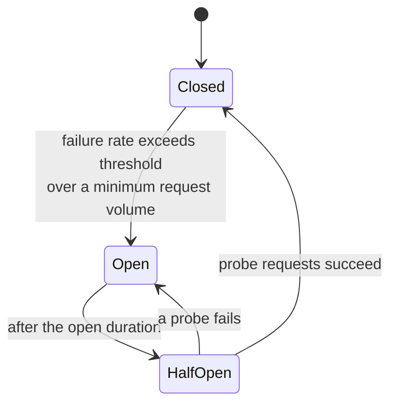
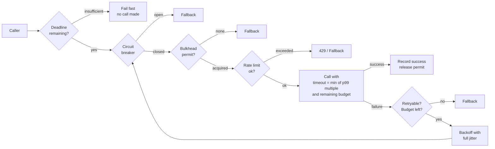

# Resilience Patterns, and How Each One Becomes the Failure

Doc 02 ended by recommending circuit breakers, bulkheads, and load shedding. This doc takes each
of them seriously enough to show where it breaks.

That is not a contrarian framing. It is the practical reality: **every resilience mechanism is
itself a piece of software with configuration, state, and failure modes, placed directly in your
critical path.** A circuit breaker is a component that can deny 100% of your traffic. A rate
limiter is a component that can reject requests you had capacity to serve. A fallback is a code
path that is, by construction, almost never exercised — which makes it the least tested code you
have, running at the worst moment you have.

So for each pattern this doc does four things: derives it from the problem it solves, states its
mechanics precisely enough to configure, shows the specific ways it turns against you, and gives
the settings that avoid those.

The organising question to carry through: **when this mechanism activates, what exactly happens
to a user?** If you cannot answer that for each pattern in your stack, you have installed
machinery you have not reasoned about.

## The problem each pattern solves

Lay them out together first, because they are frequently confused and used interchangeably when
they do completely different jobs.

| Pattern | The problem | What it does | What it costs |
|---|---|---|---|
| **Timeout** | A call may never return | Bounds the time one call can consume | Fails some healthy slow requests |
| **Retry** | A call may fail transiently | Tries again | Amplifies load (doc 02) |
| **Circuit breaker** | Calling a broken dependency wastes resources and delays failure | Stops calling it for a while | Denies traffic during recovery; can be wrong |
| **Bulkhead** | One dependency's slowness consumes all your concurrency | Partitions concurrency per dependency | Lower peak utilisation; more tuning |
| **Load shedding** | More work arrives than you can do | Rejects some work immediately | Rejects work you might have completed |
| **Rate limiting** | One caller can consume everything | Caps each caller's share | Rejects work when capacity existed |
| **Fallback** | A dependency's answer is unavailable | Substitutes a degraded answer | The answer may be wrong |
| **Backpressure** | Producers outpace consumers | Slows the producer | Latency propagates upstream |

Two distinctions worth nailing down because mixing them up produces bad designs:

**Load shedding versus rate limiting.** Shedding is about *your* capacity: you reject because you
cannot keep up, regardless of who is calling. Rate limiting is about *fairness and abuse*: you
reject because this caller has had its share, regardless of whether you have capacity. A system
needs both, they trigger on different signals, and using one for the other's job fails —
rate limits set low enough to protect capacity will reject during normal traffic growth, and
shedding alone lets one caller starve everyone else.

**Circuit breaking versus bulkheading.** A breaker stops you calling a broken dependency.
A bulkhead limits the damage while you are still calling it. The breaker is the reaction; the
bulkhead is the containment. **The bulkhead is the more important of the two**, and that ordering
surprises people. A bulkhead works against a failure mode no breaker detects (the slow
dependency returning 200s, `R-14`), it requires no threshold tuning, and it has no false
positives. If you can only build one, build the bulkhead.

## Circuit breakers

### Deriving it

`checkout-api` calls `promotions-service`. Promotions is down — every call fails after the full
250 ms timeout. What is the cost of continuing to call it?

- 640 req/s × 250 ms = 160 threads occupied waiting for a failure you already know is coming.
- Every user waits an extra 250 ms for a result that will be discarded.
- `promotions-service`, if it is struggling rather than dead, receives 640 req/s of load that
  prevents it recovering.

All three are pure waste. The circuit breaker's insight: **once you know a dependency is failing,
stop asking.** Fail immediately, locally, in microseconds. You free the threads, you remove the
latency, and you give the dependency room to recover.

### The mechanics, precisely

Three states:



- **Closed** — normal. Requests pass through. Outcomes are recorded in a rolling window.
- **Open** — requests fail immediately without a network call. No load reaches the dependency.
- **Half-open** — after a cooldown, a limited number of probe requests are allowed through. If
  they succeed, close. If any fails, open again.

The parameters that matter, and what each one actually controls:

| Parameter | Typical | What it controls |
|---|---|---|
| `failureRateThreshold` | 50% | How bad it must be to trip |
| `minimumNumberOfCalls` | 20–100 | Below this volume, never trip — prevents 1-of-2 failures reading as 50% |
| `slidingWindowSize` | 100 calls or 60 s | How much history the rate is computed over |
| `waitDurationInOpenState` | 5–30 s | How long before probing |
| `permittedCallsInHalfOpen` | 3–10 | How many probes |
| `slowCallDurationThreshold` | your p99 | **A call slower than this counts as a failure** |
| `slowCallRateThreshold` | 50% | Trip on slowness, not only errors |

Those last two rows are the ones most often left at defaults or unavailable, and they are the
ones that matter most, because of `R-14`: the dangerous failure is the dependency that returns
200s slowly. A breaker that counts only errors will sit closed while your service dies.

### P-01 · A breaker tuned so it never trips

**What you see.** The dependency is failing 40% of requests and the breaker is closed. Threads
are consumed, users wait, and the dashboard shows the breaker in a healthy state.

**Mechanism.** `failureRateThreshold: 50%` and the real failure rate is 40%. Or
`minimumNumberOfCalls: 100` against a sliding window of 60 s on a route that gets 30 calls a
minute, so the breaker never has enough data to evaluate. Or the window is 10 minutes, so a
sudden total failure takes minutes of accumulated history to move the rate past the threshold.

The `minimumNumberOfCalls` interaction is the subtle one. A low-traffic route is
*permanently* below the minimum, meaning it has no breaker at all — and low-traffic routes are
often the internal administrative ones whose failure modes nobody thinks about.

**Confirm it.** Export breaker state as a metric and put it on a dashboard next to the
dependency's error rate. Any dependency with a sustained error rate above 20% and a closed
breaker is misconfigured. Also export the *evaluated* call count, so you can see routes that
never reach the minimum.

```
# Dependencies failing materially with the breaker still closed
(sum by (target) (rate(rpc_requests_total{outcome="error"}[5m]))
 / sum by (target) (rate(rpc_requests_total[5m]))) > 0.2
and on (target) circuit_breaker_state == 0
```

**Prevent.** Set the threshold from what the dependency's failure *means* to you, not from a
default. If 20% failures make your service unusable, trip at 20%. For low-volume routes, use a
time-based window with a low minimum (10 calls over 5 minutes) and accept slower detection, or
accept that the route has no breaker and rely on the bulkhead instead — which is the honest
answer for most low-traffic routes.

### P-02 · A breaker too sensitive, tripping on noise

**What you see.** Intermittent, short-lived total failures of a feature. Error rate graph looks
like a square wave. The dependency was fine the whole time.

**Mechanism.** A 5-second window with a 10-call minimum on a route doing 3 calls/s: a burst of 5
errors out of 8 calls is 62% and trips the breaker for 30 seconds, during which 100% of requests
fail. The dependency had a momentary blip affecting 5 requests; the breaker converted that into
90 failed requests.

The general form: **a breaker amplifies a partial failure into a total one for the duration of
the open state.** That is the trade you are making, and it is only worth it if the alternative —
continuing to call — is worse. For a cheap, fast dependency with a tight timeout and a bulkhead,
it frequently is not.

**Confirm it.** Compare the number of requests failed *by the breaker* against the number that
would have failed had they been attempted. If the dependency's error rate during open periods
(measured by the probes) is well below your threshold, the breaker is over-tripping.

**Prevent.** Longer windows, higher minimum call counts, and — the important one — **ask whether
this dependency needs a breaker at all.** A breaker is worth having when calls are expensive
(slow timeout, scarce threads, costly to the dependency). For a 5 ms local cache lookup with a
20 ms timeout, the breaker's false positives cost more than the calls it saves.

### P-03 · Per-instance breaker state converges slowly and inconsistently

**What you see.** Some users get errors and some do not, randomly, for minutes. Retrying "works"
about half the time. Impossible to reason about from logs.

**Mechanism.** Breaker state is per-process. `checkout-api` runs 40 pods, each with its own
rolling window. When promotions fails, each pod independently accumulates evidence and trips at
a different moment. During convergence, a user's experience depends on which pod they hit. After
recovery, each pod independently half-opens and closes, so recovery is equally staggered.

This is usually *acceptable and even desirable* — independent breakers are a form of isolation,
and a shared breaker would be a shared point of failure — but you must understand it or the
behaviour looks like chaos. And there is one case where it is genuinely harmful: a **low-traffic
service with many instances**, where each instance individually sees too few calls to reach
`minimumNumberOfCalls`, so no breaker ever trips even though the fleet collectively has
overwhelming evidence.

**Prevent.** Accept per-instance state as the default. Where instance-level volume is too low,
either reduce instance count (often the right answer for a low-traffic service) or use an
**adaptive concurrency limit** instead of a breaker — limits work at any volume because they
respond to latency continuously rather than to a rate crossing a threshold.

### P-04 · The half-open stampede

**What you see.** A dependency comes back, gets knocked over again within seconds, and the cycle
repeats — sometimes for hours. Each recovery attempt fails slightly faster than the last.

**Mechanism.** The dependency has been down for 30 seconds. 40 caller pods, each with a breaker,
all opened at roughly the same time, so all of their `waitDurationInOpenState` timers expire at
roughly the same time. All 40 simultaneously enter half-open and send probes. If
`permittedCallsInHalfOpen` is 10, that is 400 concurrent requests arriving at a service that just
restarted with cold caches, empty connection pools, and an unwarmed JIT.

It fails. All 40 breakers open again for another 30 seconds. And because they all reopened
together, they will all half-open together again.

This is the general **recovery stampede** pattern (doc 00's control-plane version, `D-09`) and
it appears everywhere in this collection. It is the reason some incidents have a flat bottom
lasting hours with no progress.

**Confirm it.** A sawtooth in the dependency's request rate with a period equal to
`waitDurationInOpenState`. If you can read the configured wait duration off the graph, this is
what is happening.

**Prevent.**

- **Jitter the open duration**: `waitDuration × random(0.5, 1.5)`. Same principle as retry
  jitter, and most breaker libraries do not do it by default — you have to supply it.
- **Small probe counts**: `permittedCallsInHalfOpen: 1` is often right. One pod, one request. If
  it succeeds, ramp.
- **Ramp rather than snap.** Rather than going from 0% to 100% traffic on the first success,
  close gradually: 1%, 5%, 25%, 100%, with a check between each. Some libraries call this a
  "gradual closer"; if yours does not have it, an adaptive concurrency limit gives you the same
  behaviour naturally.
- **The recovering service should protect itself**, since it cannot rely on its callers. Load
  shedding (`P-08`) plus a warm-up period during which it advertises reduced capacity means the
  stampede is rejected cheaply rather than accepted and dropped expensively.

## Bulkheads

### Deriving it

The name is from ships: a hull divided into watertight compartments so that a breach floods one
compartment instead of sinking the vessel.

The problem, restated from doc 02: `checkout-api` has 200 worker threads shared across nine
dependencies. `promotions` gets slow. Within seconds, all 200 threads are waiting on promotions,
and requests that need only `payment` and `inventory` cannot get a thread. **A soft dependency
consumed the resource that the hard dependencies needed.**

The bulkhead partitions the resource:

```
Total worker capacity: 200

  payment       : 60   (hard, critical)
  inventory     : 50   (hard, critical)
  pricing       : 40   (hard)
  tax           : 20   (hard)
  promotions    : 10   (soft)
  recommendations: 5   (soft)
  loyalty       :  5   (soft)
  fraud         : 10   (hard above threshold)
```

Now when promotions hangs, it can occupy at most 10 units of concurrency. The 11th concurrent
promotions call is rejected immediately, and the caller applies the fallback (no promotion).
Checkout keeps working at full throughput. The failure is contained to the feature that failed.

Sizing each partition is the same Little's law calculation as before, per dependency:

```
promotions: 640 req/s × 0.024 s (p50) = 15.4 in flight at p50
            640 req/s × 0.088 s (p99) = 56 in flight if everything is at p99
```

So 10 is aggressive — it will reject some promotions calls during ordinary latency variation.
That is a deliberate choice: **promotions is soft, so rejecting it costs a discount, and the
bulkhead's job is to be small enough that the failure cannot hurt.** For `payment`, which is
hard, you size generously:

```
payment: 640 req/s × 0.180 s (p99) = 115 in flight at p99
```

which is more than the 60 allocated — meaning at peak, payment calls will queue on the bulkhead.
That is the finding: either payment needs a bigger allocation, or `checkout-api` needs more
capacity, or payment's p99 needs to come down. The bulkhead arithmetic surfaced a capacity
problem that the shared pool was hiding by degrading everything equally.

### Two implementations, and when each is right

**Thread-pool bulkhead**: a separate thread pool per dependency. The calling thread hands work to
the pool and waits with a timeout.

- ✅ True isolation: a hung dependency cannot block the caller's thread.
- ✅ Adds a natural timeout at the queue boundary.
- ❌ Context-switching cost and memory (each pool has threads, each thread ~1 MB stack).
- ❌ Loses thread-local context (trace IDs, security context) unless propagated explicitly.

**Semaphore bulkhead**: a counter. Before calling, acquire a permit; release after. No extra
threads.

- ✅ Nearly free.
- ✅ Keeps the calling thread and its context.
- ❌ **Does not isolate the calling thread** — it still blocks. So it bounds *concurrency* but not
  *your thread pool consumption*, which is only equivalent if you also have a timeout.

The practical guidance: **in a thread-per-request runtime (Java servlet, Rails, Django), use
semaphore bulkheads plus strict timeouts** — the timeout is what makes them equivalent to thread
pools, and it must be present. **In an async runtime (Go, Node, async Python, Netty, virtual
threads), semaphores are the natural and correct choice** because there is no thread to isolate;
a blocked goroutine costs 8 KB, not 1 MB.

### P-05 · No bulkhead at all

**What you see.** The scenario from doc 02: a single slow dependency collapses total throughput,
and requests that do not use it fail too.

**Mechanism.** One shared pool, no partitioning.

**Confirm it.** Look for the signature: your service's error rate is near 100%, but the error
rates *by endpoint* show that endpoints with no relationship to the failing dependency are also
failing. That pattern means a shared resource, and the shared resource is almost always the
thread pool or the connection pool.

**Prevent.** Bulkhead every outbound dependency. The cheapest version — one semaphore per
dependency, sized from Little's law, plus the timeout you already have — takes an afternoon and
prevents a large fraction of the outages in this collection.

### P-06 · Too many bulkheads, or bulkheads sized without arithmetic

**What you see.** Either resource exhaustion at a much lower total load than expected (over-
allocated), or constant spurious rejections of healthy traffic (under-allocated).

**Mechanism.** The over-allocation case: thread-pool bulkheads for 30 dependencies at 50 threads
each is 1,500 threads, roughly 1.5 GB of stack, and enough context switching to consume
meaningful CPU doing nothing. Worse, the *sum* of the allocations exceeds what the machine can
actually run, so the isolation is notional — under simultaneous pressure they all compete for
the same cores.

The under-allocation case: someone sizes each bulkhead at the p50 concurrency, so at p99 latency
everything rejects. The bulkhead becomes a random 20% error rate in steady state.

**Prevent.** Two rules:

1. **Size from `λ × W` at p99, per dependency, and then check that the sum is affordable.** If
   the sum exceeds what the instance can run, you do not have a bulkhead problem — you have a
   capacity problem or a dependency-count problem, and the bulkhead exercise revealed it.
2. **Bulkhead by criticality class, not by dependency, when there are many dependencies.** Three
   pools — critical, standard, optional — with dependencies assigned to them, gives most of the
   benefit with a fraction of the tuning surface. Riverbend's 30 dependencies become three pools
   of 120 / 60 / 20.

### P-07 · A semaphore bulkhead without a timeout

**What you see.** The bulkhead is configured, its metrics look sensible, and a hung dependency
still takes the service down.

**Mechanism.** A semaphore bounds *how many* concurrent calls, not *how long* each may take. Ten
permits held forever is ten threads blocked forever, and the eleventh caller either blocks
waiting for a permit or fails. If the permit acquisition itself has no timeout, callers queue on
the semaphore unboundedly — you have moved the queue, not bounded it.

**Prevent.** Every semaphore bulkhead needs two timeouts: the call timeout (so permits are
released) and the **acquire timeout** (so callers do not queue forever). The acquire timeout
should be short — often zero, meaning "if no permit is available, fail immediately and use the
fallback." For a soft dependency, an acquire timeout of zero is exactly right: there is no point
waiting for permission to do something optional.

## Load shedding

### Deriving it, and the counter-intuitive part

A service can do 5,000 requests/s. It is offered 8,000/s. What should it do with the extra
3,000/s?

The instinctive answer is "queue them and get to them as soon as possible." Work through what
that produces. The queue grows at 3,000/s. After 10 seconds it holds 30,000 requests. A request
entering the queue now waits `30,000 / 5,000 = 6 seconds` before being served. The client's
timeout is 3 seconds.

So the server spends 100% of its capacity serving requests **whose clients have already given
up**. Goodput — useful work completed — is zero. The server is fully utilised and producing
nothing, and it will stay that way until the offered load drops below 5,000/s, which it will not,
because every abandoned request is being retried.

This is **congestive collapse** and it is the core of doc 04. The fix has to be at the entry
point: **reject work you cannot complete in time, immediately, rather than accepting it and
failing slowly.**

Two refinements make shedding much more effective than it first appears:

**Serve the queue LIFO, not FIFO.** This feels unfair and is dramatically better. Under overload,
FIFO serves the oldest requests — the ones most likely to have already timed out. LIFO serves
the newest — the ones most likely to still have a client waiting. Under overload, FIFO produces
near-zero goodput while LIFO produces near-maximum goodput. (Under normal load the two are
indistinguishable, because the queue is empty.) Facebook's and Google's production queueing both
use this.

**Shed on queue *time*, not queue *depth*.** A fixed depth limit is wrong because the right depth
depends on service time, which changes. The CoDel-inspired rule: if the oldest item in the queue
has been waiting longer than a target (say 5 ms) continuously for an interval (say 100 ms), start
dropping. This adapts automatically as service time changes and needs no tuning per service.

### P-08 · No shedding: the queue of dead requests

**What you see.** 100% CPU, zero successful responses, latency climbing without bound. Reducing
traffic slightly does not help; you have to reduce it a lot, and then it recovers suddenly.

**Mechanism.** Derived above. Every unit of capacity is spent on work nobody is waiting for.

**Confirm it.** The decisive measurement is **request age at the moment work starts**. If you
record the time a request was received and compare it to the time the handler begins, and that
gap exceeds the client's timeout, you are doing work for nobody.

```
# Fraction of requests that were already doomed when we started them
sum(rate(requests_started_total{queue_age_over_client_timeout="true"}[1m]))
  / sum(rate(requests_started_total[1m]))
```

If this is above a few percent, shedding will help immediately.

**Recover.** The emergency version of shedding is a fixed concurrency cap applied at the gateway.
Set max concurrent requests per backend to a number you know it can serve, and let the gateway
reject the rest with 503. This can usually be done in seconds without a deploy.

**Prevent.** Build it in:

1. At entry, compute the request's remaining budget from its deadline (doc 02). If it is below
   the time this endpoint typically needs, **reject immediately with 503** and a `Retry-After`.
2. Maintain a concurrency limit — fixed, or adaptive (Netflix's `concurrency-limits`, or the
   Vegas/gradient algorithms). Reject beyond it.
3. Use LIFO for any internal queue.
4. Make the rejection *cheap*: no logging per rejection at full volume, no database lookup, no
   serialisation of a large error body. A rejection that costs as much as a request is not
   shedding.

### P-09 · Shedding on the wrong signal

**What you see.** The service sheds while CPU is at 30%, or fails to shed while queueing badly.

**Mechanism.** CPU is a poor overload signal for an I/O-bound service — the service can be
completely saturated on concurrency (all threads blocked on a database) with CPU near idle.
Conversely, a CPU-bound service can be at 95% CPU and perfectly healthy, serving everything
within SLO.

The right signals, in order of usefulness:

1. **Queue time** (how long requests wait before being handled) — directly measures whether you
   are behind.
2. **Concurrency versus limit** — the adaptive-limit approach.
3. **Latency versus a target** — the gradient approach: if current latency is much above the
   observed minimum, you are queueing somewhere.
4. **CPU or memory** — only for resources that are genuinely the bottleneck, and as a backstop.

**Prevent.** Shed on queue time or adaptive concurrency. Keep a CPU/memory guard as a last-resort
backstop, set high, so that a runaway does not OOM.

### P-10 · Shedding indiscriminately

**What you see.** Under load you shed 40% of requests, and the 40% includes checkouts while
health-check pings and analytics beacons get through.

**Mechanism.** The shedder has no notion of value. Every request is equally droppable.

**Prevent.** Assign every request a **criticality class** at the edge, propagate it as a header,
and shed from the bottom up. A workable four-tier scheme:

| Class | Examples at Riverbend | Shed at |
|---|---|---|
| `CRITICAL_PLUS` | Payment capture, order write, health checks between infrastructure | Never — if you cannot serve these, fail over |
| `CRITICAL` | Checkout page, cart operations, login | 95% utilisation |
| `SHEDDABLE` | Product browse, search | 85% utilisation |
| `SHEDDABLE_PLUS` | Recommendations, "recently viewed", analytics beacons, prefetch | 70% utilisation |

Two important details. First, **criticality must be assigned at the edge and propagated**, not
decided by each service, so that a background batch job's calls to `pricing-service` are shed
before a user's checkout even though both look identical at `pricing-service`. Second,
**retries inherit a lower criticality than the original**: a retried `SHEDDABLE` request is shed
before a first-attempt `SHEDDABLE` request, which automatically damps retry amplification under
load.

## Rate limiting

### P-11 · The global rate limiter as a synchronous dependency

**What you see.** The rate-limit service has an incident, and every API in the company returns
errors — or, if configured the other way, every limit disappears at once.

**Mechanism.** A global rate limiter (one shared service that all gateways consult) is the only
way to enforce a precise fleet-wide limit, because per-instance limits cannot know the total.
Northlight runs one, consulted by 100,000 sidecars. But consulting it means **a synchronous
network call on every request to a service whose failure is now your failure.** By doc 00's
arithmetic, your API's availability ceiling is now the rate limiter's availability.

**Prevent.** The standard resolution is a two-tier design:

1. **A local limiter in every instance**, enforcing `global_limit / instance_count × 1.2`. No
   network call, no dependency, approximate. Catches the large majority of abuse.
2. **The global limiter consulted asynchronously or on a sample**, correcting the local
   limiters' shared view every few hundred milliseconds. Precision where precision matters.
3. **Fail-open to the local limiter** when the global one is unreachable. You lose precision,
   not protection — which is the right trade, per doc 00's fail-open table.

The residual risk is that a burst shorter than the sync interval can exceed the global limit.
Accept it, or, for limits that genuinely must not be exceeded (a paid third-party API quota, a
regulatory cap), keep the synchronous call and accept the availability coupling — but then that
limiter needs the same reliability investment as the service it protects.

### P-12 · Per-instance limits that break on scale events

**What you see.** After an autoscaling event the effective limit changes by 2×, either letting
abuse through or rejecting legitimate traffic. Nobody changed a limit.

**Mechanism.** `global_limit / instance_count` is only correct if `instance_count` is current. If
it is hardcoded, or read at startup, or updated by a slow control loop, then scaling from 20 to
40 instances doubles the effective global limit at exactly the moment you scaled because you
were under pressure.

The reverse is equally bad: scaling *down* from 40 to 20 halves each instance's share if the
count updates instantly but connections have not rebalanced, so the surviving instances —
carrying double traffic — reject half of it.

**Prevent.** Derive the divisor from live instance count (the same source your service discovery
uses), recompute on change, and add a generous fudge factor (1.2–1.5×) so that transient
miscounts fail toward permitting. Precision is not the point of the local tier; containment is.

## Fallbacks and degradation

### P-13 · The fallback that has never run

**What you see.** The dependency fails, the fallback engages, and the fallback fails too — or is
slower than the thing it replaced, or returns data that breaks the caller.

**Mechanism.** By construction, the fallback path runs approximately never. It is therefore:

- Not covered by integration tests that exercise the happy path.
- Not covered by load tests, so its performance is unknown.
- Possibly calling the same dependency by a different route (a fallback to "the last known price
  from the cache" that, on a cache miss, reads the same database that just failed).
- Possibly returning a shape the caller does not handle — an empty list where the caller assumes
  at least one element, a null where the caller dereferences.

The worst version, and it happens: **the fallback is slower than the primary.** A fallback that
reads from a cold secondary store takes 2 seconds where the primary took 30 ms. Under the failure
conditions that triggered it, every request now takes 2 seconds, and you have reproduced the
slow-dependency collapse of doc 02 using your own protection mechanism.

**Confirm it.** Ask, for each fallback: when did it last execute in production? If the answer is
"I do not know", it does not work. Emit a metric on every fallback invocation, and make "fallback
invocation rate is zero over 30 days" a finding, not a comfort.

**Prevent.**

1. **Exercise fallbacks continuously.** Force a small fraction of requests (0.1%) down the
   fallback path in production, permanently. This is the only way to know it works. It costs a
   tiny amount of degraded experience and buys certainty.
2. **Fallbacks must be strictly cheaper and faster than the primary**, and must not share the
   primary's failure domain. A fallback to a static in-memory default is ideal. A fallback to
   "the same data from a different database" is usually not, because the two databases fail
   together more often than you think (doc 00's correlation).
3. **Type the degraded response explicitly.** Return `PromotionResult{applied: false, reason:
   UNAVAILABLE}`, not `null` and not an empty success. Callers should be able to distinguish
   "no promotion applies" from "we could not check", because those may deserve different
   behaviour — and in a financial or compliance context they certainly do.
4. **Chaos-test them** (doc 15): fail each dependency in a controlled way and assert that the
   service still meets its SLO.

### P-14 · Degradation with no exit, and degradation that hides the outage

**What you see.** Two failure shapes. Either the system degraded weeks ago and nobody noticed, or
the dependency recovered and the system is still degraded.

**Mechanism.** Graceful degradation is the right design and it has a specific hazard: **it
converts a loud failure into a quiet one.** That is its purpose — users keep working — and it is
also how a broken subsystem runs for three weeks. Lumen serves feeds without the "suggested
accounts" module for 19 days because the module's service has been failing and the fallback is
to omit it. Zero errors. Zero alerts. A revenue line quietly at zero.

The no-exit version: degradation is often implemented as a flag ("disable promotions") flipped by
a human during an incident, and nobody flips it back, because everything is working.

**Prevent.**

- **Alert on degradation itself**, at a lower severity than an outage but at *some* severity. A
  ticket, not a page: "the promotions fallback has been active for more than 15 minutes."
- **Track feature availability as its own SLI**, separate from request success. "Percentage of
  feed loads that included the recommendations module" is a number that goes to zero when the
  module breaks, and no error-rate metric will show you that.
- **Make manual degradation expire.** A kill switch flipped during an incident should have a TTL
  — it reverts in 24 hours unless renewed. This turns "somebody must remember" into "somebody
  must decide", which is a problem organisations solve reliably and the other one is not.
- **Record degradations in the same place as incidents**, so that "we have been running without
  fraud scoring for a week" is visible to someone whose job it is to care.

## Putting the patterns in order

The patterns compose, and the order they are applied in matters. A single outbound call, fully
defended, looks like this:



Read the order off the diagram, because each stage exists to make the next one cheaper:

1. **Deadline check first** — the cheapest possible rejection, and it eliminates work that is
   provably useless.
2. **Circuit breaker second** — also free, and it avoids consuming a bulkhead permit for a call
   that will fail.
3. **Bulkhead third** — bounds the damage of whatever happens next.
4. **Rate limit fourth** — fairness, once you have decided you are willing to make the call.
5. **Timeout on the call itself** — the minimum of your derived value and the remaining budget.
6. **Retry last**, under a budget, with jitter, only on retryable errors, and re-entering the
   breaker so that a broken dependency is not retried into.

Getting this order wrong has real consequences. A bulkhead permit consumed before the breaker
check means an open breaker still occupies concurrency. A timeout that ignores the deadline means
the caller has already gone. A retry that bypasses the breaker means the breaker cannot protect
anything.

Most good client libraries let you compose these in order (Resilience4j decorators, Polly
policies, gRPC service config plus interceptors, Envoy filter chains). **Do this once, in a
shared library or in the mesh, and not thirty times in thirty services** — the consistency is
worth more than the per-service tuning, and it is the only way the retry-amplification exponent
stays knowable.

## What to take away

1. **Every resilience mechanism is software in your critical path with its own failure modes.**
   For each one you install, be able to answer: when this activates, what exactly happens to a
   user?
2. **The bulkhead matters more than the circuit breaker.** It handles the failure no breaker
   detects (slow successes), needs no threshold tuning, and has no false positives. If you build
   one thing, build this.
3. **Configure breakers to trip on slowness, not only on errors.** `slowCallDurationThreshold` set
   to your p99 is the setting that makes a breaker useful against the dangerous failure mode.
4. **A breaker converts a partial failure into a total one for the duration of the open state.**
   That trade is only worth making when calls are expensive. Low-traffic routes often cannot
   support a breaker at all — use a bulkhead there instead.
5. **Jitter the open duration and use a single probe.** Otherwise every caller half-opens
   simultaneously and re-kills the recovering dependency, producing a sawtooth that can last for
   hours.
6. **Size bulkheads from `λ × W` at p99, per dependency, then check the sum is affordable.** If
   there are too many dependencies to tune, bulkhead by criticality class — three pools, not
   thirty.
7. **A semaphore bulkhead without a call timeout and an acquire timeout is not a bulkhead.** For
   soft dependencies, an acquire timeout of zero is correct.
8. **Under overload, an unbounded queue produces zero goodput** — you spend all your capacity on
   requests whose clients have left. Shed at entry, serve LIFO, and shed on queue *time* rather
   than depth.
9. **Shed by criticality, assigned at the edge and propagated**, and treat retries as lower
   criticality than first attempts. That single rule damps retry amplification automatically.
10. **Shed on queue time or adaptive concurrency, not CPU.** An I/O-bound service is saturated
    with CPU at 30%.
11. **A global rate limiter is a synchronous dependency of everything.** Use a local limiter as
    the first tier and fail open to it; reserve the strict synchronous version for limits that
    genuinely must not be exceeded.
12. **A fallback that has never run does not work.** Force 0.1% of traffic down it permanently,
    make it strictly cheaper than the primary, ensure it does not share the primary's failure
    domain, and return an explicit degraded type rather than a null or an empty success.
13. **Degradation converts a loud failure into a quiet one, which is its purpose and its
    hazard.** Alert on degradation, track per-feature availability as its own SLI, and give
    manual kill switches an expiry.
14. **Compose the patterns in one place, in this order**: deadline check, breaker, bulkhead, rate
    limit, timed call, budgeted retry. Doing it once in a shared library is worth more than
    tuning it thirty times.

Next: [04-cascading-and-metastable-failures.md](04-cascading-and-metastable-failures.md), which
is about what happens when these mechanisms are absent or misconfigured — the feedback loops that
turn a five-minute problem into a five-hour one, and why the system does not recover when you
remove the cause.
