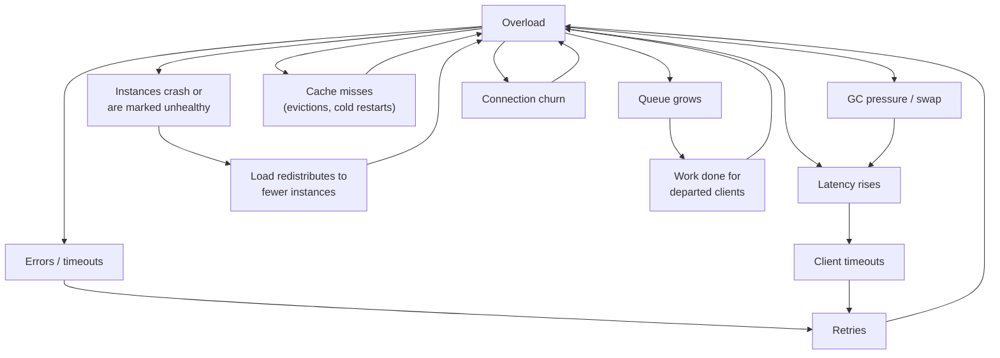

# Cascading and Metastable Failure — Why It Does Not Recover When You Fix the Cause

Here is the experience this doc explains, because almost everyone who has been on call for a
large system has had it and it is genuinely disorienting the first time.

At 09:14 a deploy introduces a slow query. At 09:16 the service starts failing. At 09:21 you roll
back the deploy. The slow query is gone. **The service is still failing.** At 09:40 it is still
failing. You add capacity — you double the fleet — and it is still failing. At 10:05 someone
takes the service out of the load balancer entirely for ninety seconds, puts it back, and it is
instantly, completely healthy at full traffic.

Nothing about that sequence makes sense under the mental model "the system is broken because
something is broken." The deploy was rolled back at 09:21; the system stayed broken for 44 more
minutes; and the thing that fixed it was *removing all traffic*, which is not a repair.

It makes complete sense under a different model, and this doc builds that model.

## Two kinds of failure

**A cascading failure** is a failure that propagates: A fails, which causes B to fail, which
causes C to fail. The chain is directional and it stops when it runs out of things to break. If
you fix A, the cascade unwinds.

**A metastable failure** is a failure that *sustains itself*. There is a feedback loop: the
system's response to being overloaded is something that increases the load. Once the loop is
running, it does not need the original trigger. Fixing the trigger changes nothing, because the
trigger is no longer what is causing the problem — the system is.

The distinction is the whole doc:

| | Cascading | Metastable |
|---|---|---|
| Shape | A chain | A loop |
| Removing the trigger | Fixes it | **Does nothing** |
| Adding capacity | Usually helps | Often does not (the loop scales too) |
| Recovery | Automatic once the cause is gone | Requires an external intervention |
| Duration | Minutes | Hours |
| Typical exit | Fix the root cause | **Reduce load below the original level**, then ramp |

Real incidents are usually both: a cascade that happens to contain a loop. The cascade explains
the first five minutes; the loop explains the next four hours. Understanding which part you are
in tells you what to do, and doing the cascade thing during the loop phase (adding capacity,
fixing the root cause) wastes the hours.

## The vocabulary, precisely

Three terms, from the research literature on this (Bronson, Huang, Kumar and others named this
pattern and the terms are worth using because they make incidents discussable):

**Trigger.** The event that pushed the system into the bad state. A deploy, a traffic spike, a
dependency blip, a cache flush. Triggers are usually brief.

**Sustaining effect.** The feedback loop that keeps the system in the bad state after the trigger
is gone. This is the thing you have to break, and it is almost always one of: retries, queue
growth, cache misses, connection churn, or load redistribution.

**Metastable state.** A state the system can remain in indefinitely, which it would never have
entered on its own, and which it cannot leave on its own.

The word "metastable" is borrowed from physics, where it describes a state that is stable against
small perturbations but not against large ones — a ball resting in a shallow dip partway down a
hill. Small nudges leave it where it is. A big enough nudge sends it to the bottom. Here, the
system has two stable states — healthy and collapsed — and a trigger large enough to cross
between them leaves it in the collapsed one, where it is also stable.

## Deriving the loop: the goodput curve

This is the arithmetic that makes everything else make sense. Bear with the derivation; it pays
off.

Take a service with a capacity of 5,000 requests/s. Plot **goodput** — successfully completed
requests whose client was still waiting — against **offered load**.

The naive expectation:

```
offered 1,000 → goodput 1,000
offered 4,000 → goodput 4,000
offered 5,000 → goodput 5,000
offered 8,000 → goodput 5,000     (saturated, excess rejected)
```

A ramp that flattens. Under that model, overload is uncomfortable but stable: you serve what you
can, you drop the rest, and when load falls you recover.

Now add retries. Say clients retry up to 3 times on failure or timeout. At offered load `λ` with
capacity `C`, the fraction that fails is `(λ − C) / λ`, and each failure produces up to 2 more
attempts. Total attempts arriving:

```
attempts = λ × (1 + f + f²)      where f is the failure fraction
```

Work through a few points, iterating until it settles:

| Original load | Failure fraction | Attempts arriving | New failure fraction | Converges to |
|---|---|---|---|---|
| 4,000 | 0 | 4,000 | 0 | **Healthy, 4,000 goodput** |
| 5,500 | 0.09 | 6,045 | 0.17 | 6,700 attempts, 0.25 fail → 7,300 … climbing |
| 6,000 | 0.17 | 7,180 | 0.30 | Climbs to the 3× ceiling: **18,000 attempts** |

Past a threshold, the retries generated by failures cause more failures than the original load
did, and the system runs away to the retry ceiling. And here is the part that matters: **once it
is at 18,000 attempts/s, reducing the original load back to 4,000 does not fix it.**

```
Original load reduced to 4,000/s
But retries still in flight and being generated: the system is serving 5,000/s of a
  backlog whose clients have timed out, so those clients retry
4,000 original + retries from a 100%-failing backlog ≈ 12,000 attempts/s
12,000 > 5,000 capacity → still failing → still retrying
```

The system is at 4,000 offered requests/s — a load it handled comfortably an hour ago — and it is
still completely down. Because the sustaining effect (retries against a backlog) generates more
load than the original traffic does.

Draw the goodput curve properly and the shape is unmistakable:

```
goodput
  ↑
5k│      ╭────────╮
  │     ╱          ╲
  │    ╱            ╲
  │   ╱              ╲
  │  ╱                ╲____________
0 └─┴──────┴───────────┴─────────────→ offered load
  0       5k          6k           20k
              ↑          ↑
        peak goodput   collapse point
```

Goodput *falls* past a point. That is the entire phenomenon. A system whose goodput falls as load
rises has a collapse point, and past it the system is in a state where it produces nothing and
sustains itself there.

### Hysteresis: the two thresholds are different

The load at which the system collapses and the load at which it recovers are **not the same
number**, and the gap between them is the whole problem.

- **Collapse threshold**: ~6,000 req/s. Above this, the loop runs away.
- **Recovery threshold**: ~1,500 req/s. Below this, the loop dies out.

Between 1,500 and 6,000 there are two possible states and which one you are in depends on your
history. This is hysteresis, and it produces the single most important operational rule in this
doc:

> **To recover from a metastable failure, you must reduce load far below the level at which it
> started — often to a small fraction — and then ramp back up slowly.**

Restoring traffic to the pre-incident level does not work, because the pre-incident level is
above the recovery threshold. This is why "we took it out of the load balancer for ninety seconds
and put it back" works: it dropped load to zero, which drained the backlog, killed the in-flight
retries, and reset the system to the healthy branch. And it is why adding capacity often does not
work: doubling capacity to 10,000/s is still below the 18,000/s the loop is generating.

## The seven feedback loops

Every metastable failure in this collection is one of these seven, or a combination. Learn to
recognise them by shape, because the exit is different for each.



| Loop | Mechanism | Fastest exit |
|---|---|---|
| **Retry** | Failures generate retries generate failures | Disable retries |
| **Timeout** | Latency exceeds client timeouts; abandoned work still consumes capacity | Shed by request age |
| **Redistribution** | Instances die; their load moves to survivors; survivors die | Stop health-check-driven removal; add capacity *and* shed |
| **Resource** | GC/swap/CPU-throttle makes everything slower, which increases concurrency, which increases memory | Restart with reduced traffic |
| **Cache** | Misses increase origin load, which slows origin, which increases misses | Block traffic, warm the cache, ramp |
| **Queue** | Deep queues mean all work is stale, so all work is wasted | Drop the queue |
| **Connection** | Churn costs more than the work; handshakes crowd out requests | Rate-limit connection establishment |

## The failure catalogue

### F-01 · The retry storm

**What you see.** Offered load at a dependency is 10–80× normal. Reducing user traffic barely
helps. Every layer's dashboards show high error rates, and nobody can identify who is generating
the traffic.

**Mechanism.** Doc 02's `a^n` amplification, running in a closed loop. The key property that
makes it metastable rather than merely amplifying: **the amplification factor is a function of
the failure rate**, so it grows as the situation worsens. At a 1% failure rate with 3 attempts,
amplification is 1.02×. At a 100% failure rate it is 3×. The system's response to being in
trouble is to push harder.

**Confirm it.** Attempts versus logical requests, per dependency (doc 02, `R-05`). A ratio above
2 means retries are material; above 5 they are your traffic.

```
sum(rate(rpc_attempts_total[1m])) / sum(rate(rpc_requests_total[1m]))
```

Then confirm the loop is self-sustaining: **compare current offered load to load before the
incident.** If offered load is higher now while user traffic is lower, the system is generating
its own load.

**Recover.** In order:

1. **Turn retries off.** Globally, at the mesh or client-config level, without a deploy. This is
   the single highest-value emergency lever in this entire collection and most teams do not have
   it wired up. Wire it up.
2. If you cannot turn them off, **turn the retry budget down** to 1%.
3. ⚠️ **Do not add capacity first.** Capacity added while a retry loop is running gets consumed
   by retries and you learn nothing, having spent ten minutes and a scaling event.

**Prevent.** Everything in doc 02: single-layer retry, retry budget at 10%, full jitter, correct
error classification. Plus the structural defence: **retries should be shed before first
attempts** (doc 03, `P-10`), which makes the loop self-damping rather than self-amplifying.

### F-02 · The thundering herd

**What you see.** A sharp, synchronised load spike at a regular interval, or immediately after
some event. The spike is far above steady-state load and is served by nothing.

**Mechanism.** A large population of clients does the same thing at the same instant. Sources of
synchronisation, and this list is worth reading closely because most of them are accidental:

- **Synchronised TTLs.** 50,000 cache entries written during a deploy all expire 3,600 seconds
  later, to the second. See `C-01`.
- **Cron on the hour.** Every scheduled job in the company runs at `0 * * * *`. Riverbend has 412
  CronJobs and a large fraction are on the hour (see [`../K8s/cronJobs`](../K8s/cronJobs/README.md)).
- **Backoff without jitter.** Discussed at length in doc 02; the backoff schedule *creates* the
  synchronisation.
- **A restart.** Every instance of a service restarts together during a rolling deploy that is
  not actually rolling, and all of them initialise, resolve DNS, warm caches, and open
  connections at once.
- **An external event.** A push notification to 10 million users. A televised advertisement. A
  sale that starts at 10:00:00. Gateline's entire design problem is this one.
- **Recovery.** Anything coming back causes everything that was waiting for it to proceed at
  once. See `F-09`.

**Confirm it.** Request rate at 1-second resolution. Thundering herds are invisible at 1-minute
resolution — a 50× spike lasting 2 seconds averages away to a 1.7× blip over a minute. If your
dashboards only have minute granularity you cannot see this class of failure at all, which is a
finding in itself.

**Prevent.** Desynchronise, at the source:

- Jitter every TTL: `ttl × random(0.8, 1.2)`.
- Jitter every schedule: a CronJob at `7 * * * *` instead of `0 * * * *`, chosen per job.
- Full jitter on every backoff.
- Randomised connection and session lifetimes (`E-15`).
- For genuinely synchronised external events (Gateline's sale open), you cannot desynchronise the
  users — so you must **admit them in a controlled order**, which is the virtual waiting room in
  doc 18.

### F-03 · The load-redistribution death spiral

**What you see.** Instances failing one after another, at an accelerating rate, with the interval
between failures shortening. Eventually the whole fleet is down. Adding instances does not stop
it — the new instances also die.

**Mechanism.** This is the loop with the cleanest arithmetic, so work it through.

A fleet of 10 instances, each able to serve 1,000 req/s, receiving 7,000 req/s total — 700 each,
70% utilisation. Comfortable.

One instance dies (any reason). The load balancer redistributes:

```
7,000 / 9 = 778 req/s each   →  78% utilisation
```

Still fine. But suppose the cause of the first failure was load-related — a memory leak that
triggers at high throughput, or a timeout to a dependency. At 78% the next instance is more
likely to fail than the first one was. It does:

```
7,000 / 8 = 875 req/s   →  88%
7,000 / 7 = 1,000 req/s →  100%  ← at capacity
7,000 / 6 = 1,167 req/s →  117%  ← overloaded, failures begin
7,000 / 5 = 1,400 req/s →  140%
```

From the fourth failure onward, every remaining instance is overloaded, so they fail rapidly and
the intervals collapse. The fleet goes from "one instance died" to "total outage" in under two
minutes.

Why adding capacity does not save you: a new instance starts cold — empty caches, unwarmed JIT,
cold connection pools — so its real capacity for the first 30–60 seconds is maybe 200 req/s, not
1,000. It receives 1,400 req/s from a round-robin balancer that has no idea, is instantly
overloaded, fails its health check, and is removed. **You have added a target for the spiral, not
capacity.** This is `F-10`.

**Confirm it.** Healthy instance count over time, with per-instance request rate overlaid.
A staircase down with accelerating steps is definitive.

**Recover.**

1. **Shed load first, capacity second.** Get offered load below what the *surviving* instances
   can handle. Gateway-level concurrency caps, or turning off a non-critical caller.
2. **Then add capacity, and ramp its traffic in.** New instances must receive a small share
   initially (slow start / least-request with a warm-up weight) and grow over 60 seconds.
3. ⚠️ **Do not raise the health-check failure threshold to "stop instances being removed."** You
   will keep sending traffic to dead instances and learn nothing. If the instances are genuinely
   alive but slow, that is a different fix (shed load).

**Prevent.**

- **Run with real headroom.** If you cannot lose 2 instances from 10 without exceeding 85%
  utilisation on the rest, you do not have N+2; you have a spiral waiting for a trigger. The
  headroom calculation must be done against `N − k` for the failures you intend to survive, not
  against `N`.
- **Load shedding on every instance** (doc 03, `P-08`) so an overloaded instance rejects cheaply
  rather than dying. A shedding instance stays in the pool and keeps contributing its real
  capacity; a dying instance contributes nothing and donates its load to its neighbours.
- **Slow start on the load balancer** so new and recovering instances ramp.
- **Least-request or least-outstanding load balancing** rather than round-robin, so a struggling
  instance naturally receives less. Round-robin is actively harmful here: it sends the same rate
  to a dying instance as to a healthy one.

### F-04 · Congestive collapse

**What you see.** 100% CPU, zero goodput, unbounded latency. Load reduction of 20% does nothing;
load reduction of 90% fixes it instantly.

**Mechanism.** Derived in doc 03 (`P-08`): the queue grows past the client timeout, so every
request the server completes is for a client that has gone, and the effort is wasted. Goodput is
zero at full utilisation.

The loop closes because the departed clients retry, so the arrival rate does not fall.

**Confirm it.** The decisive signal, again, is **queue age at start of work** versus client
timeout. A secondary signal that is easy to check: the ratio of responses your server sends to
responses your clients receive. If the server reports 5,000 responses/s and clients report 200
successful responses/s, 4,800/s are going into the void.

**Recover.** Drop the queue. Literally: restart the process, or configure the queue limit to
something tiny for sixty seconds. Then ramp traffic back.

**Prevent.** Doc 03's shedding section: bounded queues, LIFO ordering, shed on age, deadline
propagation so requests carry their own expiry and can be dropped on sight.

### F-05 · The resource death spiral (GC, swap, throttling)

**What you see.** Latency degrading smoothly over minutes rather than spiking, then a sudden
cliff. CPU high but application throughput low. In the JVM, GC time climbing toward 100%.

**Mechanism.** The generic shape: overload increases the amount of concurrent in-flight work,
which increases memory or CPU pressure, which slows everything down, which increases concurrency
further (Little's law: same arrival rate, higher latency, more in flight).

The three concrete versions:

*GC spiral (JVM, .NET, Go).* More in-flight requests means more live objects. More live objects
means each collection has more to trace and less to reclaim. Collections become more frequent and
longer. In the extreme the JVM spends 95%+ of CPU in GC while reclaiming almost nothing — a state
the JVM will eventually throw `OutOfMemoryError: GC overhead limit exceeded` for, but only after
a long time in which it is alive and useless.

*Swap spiral.* Memory pressure causes the kernel to swap. Swapped pages are 1,000× slower to
access. Latency increases, concurrency increases, memory pressure increases. A machine in swap
death is typically unrecoverable without a reboot and often unreachable over SSH. This is why
**swap should be disabled on every server** — Kubernetes requires it disabled by default for
exactly this reason.

*CFS throttle spiral (containers).* A container with `cpu.limit: 1` gets 100 ms of CPU per 100 ms
period. A multi-threaded runtime with 8 worker threads can burn that quota in 12.5 ms and is then
**throttled for the remaining 87.5 ms** — not slowed, stopped. Latency for anything in flight
during the throttle window increases by up to 87.5 ms. Higher latency means more in flight means
more threads means faster quota burn. Doc 12 (`N-06`) covers this in detail; it is one of the
most common and least understood Kubernetes failures.

**Confirm it.**

```
# JVM: fraction of wall time in GC. Above 0.1 is trouble; above 0.5 is the spiral.
sum(rate(jvm_gc_pause_seconds_sum[1m])) / 60

# Container CPU throttling: fraction of periods throttled. Any sustained nonzero is a problem.
rate(container_cpu_cfs_throttled_periods_total[1m])
  / rate(container_cpu_cfs_periods_total[1m])

# Swap
node_memory_SwapFree_bytes / node_memory_SwapTotal_bytes
```

**Recover.** Restart the affected instances **with reduced traffic**, one at a time. A restarted
instance returned to full traffic immediately re-enters the spiral within a minute.

**Prevent.** Concurrency limits (doc 03) are the general answer — they cap in-flight work, which
caps memory. Specifically: disable swap; set `GOMEMLIMIT` or `-XX:MaxRAMPercentage` so the
runtime knows its ceiling and collects before the kernel kills it; set container CPU *requests*
generously and consider omitting CPU *limits* entirely for latency-sensitive services (doc 12
argues this properly, including when it is wrong).

### F-06 · The connection storm

**What you see.** After any event that breaks connections — a proxy restart, an AZ failover, a
deploy — the system is unable to recover because it is spending all its capacity on connection
establishment rather than on requests.

**Mechanism.** `E-15`, closing a loop. 50,000 clients reconnect at once. Each reconnect costs a
TLS handshake (`E-08`: ~1.5 ms of CPU) plus an authentication call plus connection-pool setup.
The receiving fleet saturates on handshakes, so some reconnects time out, so those clients
reconnect again.

The nasty property: **handshake work is not cancellable and not sheddable by normal means.** Your
application-level load shedder runs after the connection exists. You need admission control at
the connection layer, which most stacks do not have by default.

**Confirm it.** New connections/s versus requests/s. In a healthy system with keep-alive this
ratio is tiny (0.001 or less). During a storm it approaches 1, and CPU attributable to TLS
dominates.

**Recover.** Rate-limit accepts. Most proxies support a maximum connection rate or a maximum
concurrent-connection count (`envoy`'s connection limit filter, nginx's `limit_conn`); set it to
something the fleet can genuinely handle and let the excess fail fast. Clients with full jitter
will spread out; clients without it will hammer, which is why the client-side fix matters too.

**Prevent.** Full jitter on reconnect, randomised connection lifetimes so turnover is continuous,
session resumption so reconnects are cheap, and connection-establishment admission control as a
first-class limit separate from request admission.

### F-07 · The poison request that kills the fleet

**What you see.** Every instance of a service crashes within seconds of each other. They restart
and crash again. The crash loop continues until the traffic stops.

**Mechanism.** This is a correlated failure (doc 00) with a restart loop, and it is the fastest
total outage in this collection — seconds, not minutes.

A single request contains input that triggers a crash: an unhandled panic, a stack overflow from
deep recursion, an allocation that exceeds the memory limit, an assertion failure. The request is
retried (by the client, or by the load balancer) to another instance. That instance crashes.
Retried again. The request works its way through the entire fleet, killing each instance.

Then the orchestrator restarts them, the request is *still* in a queue or still being retried,
and the cycle repeats.

The version with a queue is worse and slower to diagnose: a poison message in Kafka is redelivered
after the consumer crashes, because the offset was never committed. The consumer group crash-loops
forever on one message, and the topic's lag grows indefinitely while the consumer looks like it is
"processing." See `Q-05` and [`../Kafka/06-lag-backpressure-and-poison-messages.md`](../Kafka/06-lag-backpressure-and-poison-messages.md).

**Confirm it.** Correlate crash timestamps across instances — near-simultaneous crashes across
independent hosts is the signature, and it rules out hardware. Then find the common input: the
last request logged before each crash, or the message at the consumer's current offset.

```bash
# Kubernetes: the previous container's final output, which is where the crash is
kubectl logs <pod> --previous --tail=50
# Across the whole deployment, look for a common request ID or payload shape
for p in $(kubectl get pods -l app=pricing -o name); do
  kubectl logs "$p" --previous --tail=5 2>/dev/null | tail -2
done | sort | uniq -c | sort -rn
```

**Recover.** Stop the request reaching the service. In order of speed: block it at the gateway by
path/user/pattern; if it is a queued message, skip the offset; if you cannot identify it, stop all
traffic briefly so the retry expires.

**Prevent.**

- **Never let an unhandled error in request-scoped code terminate the process.** Recover at the
  request boundary, log, return 500. In Go, a `recover()` in the HTTP middleware; in Java, a
  catch-all handler. This turns a fleet-killer into a single failed request.
- **Bound everything derived from input**: request body size, JSON nesting depth, array lengths,
  recursion depth, regex complexity (a catastrophically backtracking regex on user input is a
  classic poison request).
- **Do not retry 500s** (doc 02, `R-07`). The retry is what spreads it.
- **For queues, cap redelivery attempts and route to a DLQ.** A message that has failed 3 times
  is not going to succeed on the 4th.
- **Crash-loop backoff is a defence, not just a nuisance.** Kubernetes' exponential
  `CrashLoopBackOff` limits how fast the loop can run. Do not "fix" it by setting an aggressive
  restart policy.

### F-08 · Autoscaler oscillation and the scaling-too-slow gap

**What you see.** Either instance count sawtoothing every few minutes with latency spikes at each
scale-down, or a load spike that is over before capacity arrives.

**Mechanism.** Two distinct failures with the same root: the autoscaler is a control loop whose
response time is much longer than the disturbance it is responding to.

*Oscillation.* Scale up on CPU > 70%. Adding instances drops CPU to 50%. Scale down. CPU returns
to 75%. Scale up. The loop's period is the sum of the metric window, the evaluation interval, and
the instance start time — typically 3–8 minutes — and each scale-down event causes a latency
spike as connections are drained and caches are lost.

*The gap.* Gateline's sale opens at 10:00:00 and traffic goes from 5,000 QPS to 500,000 QPS in
ten seconds. A container takes 45 seconds to start and 30 more to warm. **Autoscaling cannot
respond to a 10-second event**, no matter how it is configured. The autoscaler will faithfully
add capacity for a spike that peaked seven minutes ago.

Put the numbers together for a realistic case:

```
Metric scrape interval          15 s
HPA evaluation period           15 s
Metric window (avg over)        60 s   → a spike is half-visible for 30 s
Pod scheduling + image pull     20 s
Container start + readiness     45 s
Cache warm to useful hit rate   60 s
                                ────
Total time to useful capacity   ~3 min 35 s
```

Three and a half minutes is the floor. Any failure faster than that must be survived by headroom,
not by scaling.

**Confirm it.** Overlay instance count, the scaling signal, and latency. Oscillation is visually
obvious. For the gap, measure the interval from "signal crossed the threshold" to "new pod serving
traffic at normal hit rate" — most teams have never measured this and are shocked by it.

**Prevent.**

- **Asymmetric scaling policies**: scale up fast and aggressively, scale down slowly and
  conservatively. A stabilisation window of 300 s on scale-down and 0 s on scale-up removes most
  oscillation. Scaling down too eagerly saves pennies and costs incidents.
- **Scale on a leading signal**, not a lagging one. Queue depth and concurrency lead; CPU and
  latency lag. For Riverbend's `order-processor`, Kafka consumer lag is the correct signal and
  CPU is not.
- **Pre-scale for known events.** Gateline scales to full capacity 30 minutes before a sale and
  holds. This is not a failure of autoscaling; it is the correct use of a schedule, because the
  event is known.
- **Headroom for anything faster than your scale-up time.** This is the static-stability principle
  again: if losing an AZ requires scaling, you will be down for the scale-up duration.
- **Over-provisioned "pause pods"** (low-priority placeholder pods that real workloads evict) turn
  a 3-minute scale-up into a 20-second one, at the cost of paying for idle nodes.

### F-09 · The recovery stampede

**What you see.** A dependency recovers, is immediately knocked over again, and the cycle repeats.
Or: an AZ comes back and the *healthy* AZs fail.

**Mechanism.** Everything that was blocked proceeds at once. This appears at every layer and it
is worth cataloguing because the cases look different and are the same:

- Circuit breakers half-opening together (`P-04`).
- Clients retrying together after a backoff window (`R-06`).
- Sidecars reconnecting to a recovered control plane together (`D-09`).
- Consumers resuming and replaying a large backlog at maximum rate into a downstream that was
  sized for steady state (`Q-04`).
- A database failover completing, and 800 application connections re-establishing simultaneously,
  each running its connection-init queries (`S-09`).

The general form: **any queue that builds during an outage drains at a rate limited only by the
consumer, and the consumer's maximum rate is far above the downstream's capacity.**

That last sentence is the one to remember. During the outage, work accumulated. When the block
clears, the accumulated work is released as fast as the releasing component can go, which is
much faster than steady state, into a system sized for steady state.

**Confirm it.** Request rate immediately after recovery compared to before the incident. A ratio
above 3 is a stampede in progress.

**Prevent.** Rate-limit the recovery on the *consuming* side, because the producing side is you:

- Ramp traffic back in: 1%, 5%, 25%, 50%, 100%, with a health check between steps. This should be
  an automated procedure, not a human at a keyboard.
- Cap the drain rate of any backlog to, say, 1.5× steady state — slower recovery, guaranteed
  recovery. Doc 09 (`Q-04`) works through the arithmetic of how long that takes, which is a number
  you want before the incident, not during.
- Jitter everything that resumes.
- Have the recovering component advertise reduced capacity while it warms, so callers naturally
  send less.

### F-10 · The cold-start capacity cliff

**What you see.** A restarted or newly added instance performs at a small fraction of a warm
instance's capacity for the first 30–120 seconds. Fleet-wide restarts produce an outage even
though instance count never dropped.

**Mechanism.** A "warm" instance's capacity depends on state it accumulated:

| Warm-up cost | Typical duration | Capacity impact while cold |
|---|---|---|
| Local cache population | 30–300 s | Every request is a miss; downstream load 10–50× |
| JIT compilation (JVM, V8) | 30–120 s | 5–20× slower for the hot paths |
| Connection pool establishment | 1–10 s | Every request pays connect + TLS |
| DNS and discovery resolution | 1–5 s | First requests block |
| Page cache / mmap warmth | minutes | Disk reads instead of memory reads |
| ML model load | 10–120 s | Requests block or fail |

A JVM service that serves 1,000 req/s warm may serve 80 req/s for its first minute. Restart the
whole fleet at once and total capacity drops by 92% for a minute, which is an outage — and it is
an outage produced by a deployment where instance count was never below target and every readiness
probe passed.

**Confirm it.** Per-instance request latency versus instance age. Plot p99 against
`time() - process_start_time_seconds`. The warm-up curve will be obvious, and its duration is a
number you need for `F-03`'s slow-start configuration and for your deploy strategy.

**Prevent.**

- **Readiness probes that require warmth**, not just liveness. Do not accept traffic until the
  cache hit rate is above a threshold or a synthetic warm-up request has completed at target
  latency.
- **Load balancer slow start** — ramp an instance's weight over its warm-up duration.
- **Warm-up on startup**: replay a sample of recent requests against the new instance before it
  joins the pool, or pre-load the top-N cache keys.
- **Never restart more than a small fraction of the fleet at once.** `maxUnavailable: 1` or a
  percentage well below your headroom, with a pause between batches at least as long as the
  warm-up.
- **Persist the cache across restarts** where feasible (a local disk cache reloaded at startup,
  or an external cache tier), which eliminates the largest term.

### F-11 · Missing backpressure: the unbounded buffer

**What you see.** Memory growth to OOM in a component that is "just passing data through". Or a
queue that grows for hours with no error anywhere.

**Mechanism.** In any producer/consumer chain, if the consumer is slower than the producer, one of
three things must happen: the producer slows down (backpressure), work is dropped (shedding), or
work accumulates (buffering). If you did not choose one of the first two, you chose the third,
and buffering is only viable if the buffer is bounded and the imbalance is temporary.

Unbounded buffers hide in ordinary places:

- An async HTTP framework with no in-flight limit (doc 02, `R-13`).
- A Go channel created with a large or unbounded capacity, or a goroutine per item with no
  semaphore.
- A batching writer that accumulates until a flush that never keeps up.
- A logging or metrics library buffering to a backend that is down.
- A Kafka producer's `buffer.memory` — bounded, but when it fills, `send()` blocks for
  `max.block.ms`, which surprises people who thought producing was asynchronous.

**Confirm it.** Find every queue in the path and check that each has a maximum. Then check what
happens *at* the maximum: block, drop, or error? All three are valid; not knowing which is not.

**Prevent.** Every buffer bounded, and at the bound a deliberate policy. The chain of bounded
buffers is what propagates backpressure end to end: a full buffer blocks its producer, whose
buffer fills, which blocks *its* producer, until the pressure reaches the edge and the edge
sheds. That is the design working. A single unbounded buffer anywhere in the chain breaks the
whole mechanism, because pressure stops propagating there and accumulates instead.

### F-12 · The second outage, caused by the recovery

**What you see.** The incident is resolved. Forty minutes later, a different, often worse outage.

**Mechanism.** The recovery actions themselves. The catalogue of ways this happens:

- Capacity added during the incident is scaled back down too fast, re-triggering the original
  overload.
- A backlog that accumulated during the outage is now being processed, and its processing load —
  concentrated into a short window — exceeds what downstreams can take (`F-09`).
- A cache was flushed as part of recovery, so the system is running cold (`F-10`).
- A rate limit or circuit breaker was disabled during the incident "temporarily" and never
  restored, so the next blip has no protection.
- Retries that were disabled are re-enabled all at once, and a backlog of failed operations
  retries simultaneously.
- The rollback reverted a schema migration that newer data depends on.

**Prevent.** Treat recovery as a change with its own risk. Specifically: **write down every
temporary change made during the incident, and close each one out explicitly** before declaring
the incident resolved. This is a checklist item, not a memory exercise. The incident is not over
when the graph is green; it is over when the system is back in the configuration you can reason
about.

## How to get out of a metastable failure

A procedure, because under pressure people try things in the wrong order and waste the window.

**Step 0: determine whether you are in a loop at all.** The test: *if the trigger has been removed
and the system is still failing, you are in a loop.* If you are not in a loop, fix the cause — the
rest of this procedure does not apply and will make things worse.

**Step 1: identify which loop.** Use the table at the top of the doc. The fastest discriminators:

- Attempts/requests ratio > 2 → **retry loop**.
- Queue age > client timeout → **queue/timeout loop**.
- Healthy instance count declining → **redistribution loop**.
- Cache hit rate collapsed → **cache loop**.
- New connections/s ≈ requests/s → **connection loop**.
- GC time or CPU throttle fraction high → **resource loop**.

**Step 2: break the loop, which almost always means reduce offered load — hard.** Not 20%. Aim
for 90%, or to zero if you can. Options, roughly in order of how fast they can be applied:

1. Turn off retries (fastest, often sufficient).
2. Concurrency cap at the gateway.
3. Disable the largest non-critical caller (a batch job, an internal consumer, a prefetch).
4. Shed by criticality if you have it.
5. Remove the service from the load balancer entirely for 30–60 seconds.

⚠️ Remember hysteresis: **the load you need to drop to is well below the load at which the
incident started.** Dropping to "normal" traffic will not exit the loop.

**Step 3: verify the loop has stopped before restoring anything.** The loop indicator —
attempts/requests, queue age, healthy count — must be back to baseline. If you restore traffic
while the loop is still running, you have spent the intervention for nothing and you now have less
information.

**Step 4: ramp back in stages, with a check at each.** 1% → 5% → 25% → 50% → 100%, waiting long
enough at each step for the system to reach steady state (at least one cache TTL, at least one
autoscaling period). If a step fails, go back two steps, not one.

**Step 5: only now fix the root cause**, if it has not already been fixed. The trigger was never
what was keeping you down.

**Step 6: close out every temporary change** (`F-12`).

## What to take away

1. **A cascading failure is a chain; a metastable failure is a loop.** The test that distinguishes
   them: if you have removed the trigger and the system is still failing, it is a loop, and none
   of the things you do to a chain will help.
2. **Goodput falls past a threshold.** A system whose response to overload generates more load has
   a collapse point, past which it produces nothing and sustains itself there.
3. **Collapse and recovery thresholds are different numbers** (hysteresis). A system that
   collapsed at 6,000 req/s may only recover below 1,500. **Restoring pre-incident traffic will
   not work.** Drop to a small fraction and ramp.
4. **There are seven loops**: retry, timeout, redistribution, resource, cache, queue, connection.
   Each has a distinct indicator and a distinct fastest exit. Identify which one you are in before
   acting.
5. **Turning off retries is the highest-value emergency lever in this collection.** Make sure you
   can do it without a deploy, and practise it.
6. **Do not add capacity first during a loop.** The loop scales with you, and you have spent ten
   minutes.
7. **The load-redistribution spiral is pure arithmetic**: 7,000 req/s across 10 instances is
   comfortable and across 5 is 140% of capacity. Compute your headroom against `N − k`, not `N`,
   and make sure instances shed rather than die.
8. **Adding capacity during a spiral can make it worse**, because cold instances have a fraction
   of warm capacity and the balancer does not know. Slow start is not optional.
9. **Autoscaling takes about 3.5 minutes to deliver useful capacity.** Anything faster than that
   must be survived with headroom. Scale up fast, scale down slowly, scale on a leading signal.
10. **Every queue that builds during an outage drains at the consumer's maximum rate into a
    downstream sized for steady state.** Rate-limit recovery deliberately; a slower guaranteed
    recovery beats a fast one that re-breaks.
11. **A single unbounded buffer anywhere in a chain breaks end-to-end backpressure**, because
    pressure stops propagating there. Every buffer bounded, and a deliberate policy at the bound.
12. **A poison request kills an entire fleet in seconds** because the failure is correlated and
    the retry spreads it. Recover at the request boundary so a bad input cannot terminate a
    process, and never retry 500s.
13. **The recovery is a change with its own risk.** Write down every temporary mitigation and
    close each out explicitly; the incident ends when the configuration is back to one you can
    reason about, not when the graph turns green.

Next: [05-service-discovery-and-the-control-plane.md](05-service-discovery-and-the-control-plane.md),
which covers the systems that tell your services where to send traffic — and why they are the
largest hidden point of failure in most architectures.
