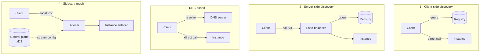

# Service Discovery and the Control Plane — The Largest Hidden Point of Failure

Every request in a microservice system begins with a question that nobody puts on the
architecture diagram: **where is the thing I am about to call?**

In a monolith that question does not exist; a function call has an address at compile time. In a
microservice system, the answer changes constantly — instances start, stop, move between nodes,
get drained, get evicted, come back with a different IP — and something has to keep track. That
something is the control plane, and this doc argues that it is the largest point of failure most
architectures have, for three reasons:

1. **Its blast radius is everything.** A wrong answer from service discovery affects every
   request to every service. There is no bulkhead around it.
2. **It fails at the worst moment.** Control-plane load is highest during data-plane incidents,
   because that is when everything is re-registering and re-resolving.
3. **Nobody tests it.** Teams test "what if the database is down." Almost nobody tests "what if
   the service registry is down", because it feels like infrastructure rather than a dependency.

By the end you should be able to answer, for your system: what happens to a running request if
the registry is unreachable for ten minutes? If you do not know, that is the finding.

## What discovery has to do, and the four ways to do it

The problem, stated concretely with Riverbend numbers. `checkout-api` runs 40 pods. It calls
`pricing-service`, which runs 24 pods spread over 3 availability zones. Pod IPs change on every
deploy, on every node replacement, on every scale event — Riverbend deploys roughly 30 times a
day across its 240 services, so somewhere in the cluster an endpoint set changes every few
seconds.

`checkout-api` needs, at the moment it makes a call:

- The set of `pricing-service` addresses.
- Which of them are healthy.
- Preferably, which are in its own availability zone (cross-zone traffic costs money and adds
  latency — doc 13 works out both).
- An answer fast enough that it does not add to request latency.

Four architectures answer that, and they have genuinely different failure profiles.



| | Client-side | Server-side (LB) | DNS | Sidecar / mesh |
|---|---|---|---|---|
| Example | Eureka + Ribbon, gRPC name resolver | AWS ALB/NLB, kube-proxy | Kubernetes `Service`, Cloud Map | Envoy + xDS |
| Who knows the endpoints | Every client | The balancer | The resolver | The sidecar |
| Extra network hop | No | Yes | No | Yes (localhost) |
| Load-balancing quality | Best — client sees all endpoints and their latency | Good | Poor — round-robin at best, and see `D-12` | Best |
| Failure if the registry dies | Clients use cached endpoints if written to | Balancer keeps last config | Resolvers cache, then fail | Sidecars use last config — **fail-static by design** |
| Language coupling | High — a library per language | None | None | None |
| Change propagation | Seconds (poll) or ms (watch) | Seconds | TTL-bound, often 30–60 s | Sub-second (streaming) |
| Main failure mode | Stale client caches, library version skew | The balancer is a shared failure domain | TTL and caching lies (`E-01`) | Control-plane outage or bad config (`D-09`, `D-10`) |

The mesh column is why Northlight moved from Eureka+Ribbon to Envoy+xDS: 2,500 services in
several languages each needed a correct, current, well-tuned discovery client, and getting a fix
into all of them took quarters. Moving it to the sidecar made it one team's problem and one
deployment. Doc 21 covers what that cost.

## How a registry knows an instance is alive

Whatever the architecture, something maintains the set of live instances, and there are exactly
three mechanisms. Their failure modes are different, so the choice matters.

**Self-registration with heartbeat (Eureka, Consul agent).** The instance registers itself and
sends a heartbeat every `N` seconds. The registry expires entries not heard from within a TTL.

- Detects: process death, network partition from the registry.
- Misses: **a process that is alive and heartbeating but cannot serve requests.** The heartbeat
  thread is independent of the request path, so a service with an exhausted database pool
  cheerfully heartbeats while failing every request. This is `D-04`.
- Timing: detection takes up to the TTL. Eureka's defaults — 30 s heartbeat, 90 s TTL, plus a 60 s
  eviction sweep — mean a dead instance can be advertised for **up to 150 seconds**. That surprises
  people and it is the single most-cited Eureka complaint.

**Registry-initiated health checks (AWS target groups, Consul HTTP checks, Kubernetes probes).**
The registry actively probes each instance.

- Detects: anything the probe covers.
- Misses: whatever the probe does not cover (`E-09`), and it introduces the deep-check hazard —
  a shared-dependency failure removes every instance at once.
- Timing: `interval × unhealthy_threshold`. A 10 s interval with a threshold of 3 is 30 s.
- Cost: `instances × checkers / interval` probes per second. At Northlight's scale this is a real
  traffic source — 100,000 instances at one check per 10 s is 10,000 checks/s, and if every
  checker checks every instance it is quadratic.

**Orchestrator-driven (Kubernetes endpoints).** The orchestrator already knows which pods it
scheduled and what their probe status is, and it publishes `EndpointSlice` objects derived from
that.

- Detects: everything the orchestrator knows, which is a lot.
- Misses: the same probe blind spots, plus the orchestrator's own propagation delay.
- Timing: probe detection plus propagation through the API server, the endpoint controller, and
  every watcher — typically 1–5 s in a small cluster, and **much longer in a large one**, which is
  `D-03`.

In practice the strongest designs combine them: the orchestrator or agent registers, an active
check verifies the real path, and the client independently ejects endpoints that fail it —
three layers, each catching what the others miss. That last one deserves emphasis because it is
often missing: **outlier detection at the client (or sidecar) is the only mechanism that reacts
in under a second, because it uses the actual request outcomes rather than a separate probe.**

## The failure catalogue

### D-01 · The registry is unavailable

**What you see.** Depends entirely on the client implementation, and the range is enormous — from
"nothing happens" to "total outage." Which one you get is decided by code written years ago.

**Mechanism.** The registry (Eureka cluster, Consul servers, etcd, the Kubernetes API server, the
xDS control plane) becomes unreachable — a network partition, a quorum loss, an overload, a bad
deploy of the registry itself.

What happens next is entirely determined by how clients handle it:

| Client behaviour | Result |
|---|---|
| Uses its last-known-good endpoint list indefinitely | **Nothing happens.** Requests keep flowing. New instances are not discovered and dead ones are not removed, so it degrades slowly over hours. |
| Uses the cache, but with an expiry | Works until the expiry, then falls off a cliff |
| Returns an empty list | **Total outage in seconds** (`D-05`) |
| Blocks waiting for the registry | **Total outage, with thread exhaustion** (`R-01` on top) |

The last two are common defaults. They should be considered bugs.

**Confirm it.** During the incident: are requests still flowing? Check whether the client's
endpoint cache is populated. Most clients expose this (`envoy`'s `/clusters` endpoint, gRPC's
channelz, Eureka's client status page).

**Recover.** If clients have failed closed, the fastest path is usually to bypass discovery
entirely — point clients at a static endpoint list or a stable VIP via an emergency
configuration. This is worth having pre-built: a **break-glass static endpoint file** that a
client will use when discovery is unavailable.

**Prevent.** Fail-static, made explicit:

1. **Cache the last good result on local disk**, not just in memory, so a process restart during
   a registry outage still has endpoints. Envoy does this with its persistent xDS cache; most
   hand-rolled clients do not.
2. **Never expire the cache due to registry unavailability.** Expire entries because the registry
   told you to, not because you could not ask.
3. **Serve stale with a warning metric.** Emit `discovery_cache_age_seconds` and alert when it
   exceeds a few minutes. You want to know you are flying on stale data; you do not want to stop
   flying.
4. **Test it.** Block the registry in staging for 15 minutes and confirm traffic continues. This
   is a 30-minute experiment that most teams have never run and that frequently finds a total
   outage waiting to happen.

### D-02 · Stale entries: traffic to instances that are gone

**What you see.** A steady background rate of connection-refused errors, concentrated right after
deploys and scale-down events. Usually 0.1–2% of requests, so it hides under the error budget and
nobody investigates.

**Mechanism.** An instance terminated, and the registry has not noticed or the news has not
propagated. The window is the sum of:

```
detection (heartbeat TTL or probe interval × threshold)
+ registry propagation
+ client cache refresh interval
+ in-flight connection lifetime
```

For a Eureka-style setup with defaults:

```
90 s TTL + 60 s eviction sweep + 30 s client refresh = up to 180 seconds
```

Three minutes of advertising a dead instance. At 640 req/s across 24 instances, that is
`640 / 24 × 180 ≈ 4,800 requests` sent to a host that does not exist.

**Confirm it.** Correlate connection-refused errors with pod termination timestamps. Also compare
the client's endpoint list against reality:

```bash
# What the sidecar believes
curl -s localhost:15000/clusters | grep 'pricing-service.*::health_flags'
# What is actually there
kubectl get endpointslices -l kubernetes.io/service-name=pricing-service -o wide
```

**Recover.** Nothing; this is chronic. Reduce the window.

**Prevent.** Attack each term:

- **Graceful shutdown that outlives propagation** (`E-13`): the instance keeps serving for longer
  than the deregistration takes, so the stale entry still works.
- **Explicit deregistration on shutdown**, so you do not wait for a TTL. A `preStop` hook that
  calls the registry's deregister API, then sleeps.
- **Client-side outlier ejection**: a client that gets connection-refused from an endpoint should
  stop using it immediately, without waiting for the registry. This is the most effective single
  fix because it operates in milliseconds rather than seconds, and it also covers the case where
  the registry is simply wrong.
- **Retry on connection-refused** — this is the one error class that is unambiguously safe to
  retry even for non-idempotent operations (doc 02's table), because nothing was processed.
  A retry to a different endpoint makes the stale entry invisible to users.

### D-03 · Deregistration lag at scale

**What you see.** In a large cluster, endpoint changes take tens of seconds to propagate instead
of one or two. Deploys produce far more errors than they do in staging.

**Mechanism.** Kubernetes endpoint propagation is a chain, and each link scales differently:

```
pod terminates
  → kubelet updates pod status            (~1 s)
  → API server writes it                  (etcd write, ~10 ms, but under contention much more)
  → endpoint-slice controller recomputes  (batched; under churn, seconds)
  → every watcher receives the update     (N watchers × object size)
  → kube-proxy rewrites iptables/IPVS     (O(services × endpoints) for iptables!)
  → the rule takes effect
```

The step that bites is kube-proxy in `iptables` mode: it rewrites the **entire** rule set on any
change, and the rule set is proportional to total services times endpoints. At 240 services
averaging 20 endpoints, that is ~4,800 endpoint rules, and a full resync takes hundreds of
milliseconds to seconds. In a cluster with thousands of services it can take **tens of seconds**,
during which the node's routing is stale for everything.

`IPVS` mode uses a hash table and updates incrementally, so it is `O(1)` per change — this is the
main reason large clusters move to IPVS or to eBPF-based dataplanes (Cilium).

**Confirm it.** Measure propagation directly: delete a pod and time how long until a client stops
receiving that endpoint. Also watch the endpoint-slice controller's queue depth and kube-proxy's
`sync_proxy_rules_duration_seconds`.

```
histogram_quantile(0.99, rate(kubeproxy_sync_proxy_rules_duration_seconds_bucket[5m]))
```

Anything above a second means your effective deregistration window is at least that long on top
of everything else.

**Prevent.** IPVS or eBPF dataplane; `EndpointSlice` rather than the legacy `Endpoints` object (it
was introduced precisely to stop shipping a single huge object on every change); graceful
shutdown windows sized from the *measured* propagation time, not from a default; and client-side
ejection so you do not depend on propagation for correctness.

### D-04 · The black-hole instance

**What you see.** An instance that is fast, healthy, and wrong. It receives *more* traffic than
its peers and fails everything it receives.

**Mechanism.** This is the most instructive failure in the doc because two mechanisms conspire.

An instance starts. Its connection to the cache or database fails to initialise — a transient DNS
failure at startup, a secret not yet mounted, a race with an init container. The code catches
the error, logs it, and continues, because "the service should start even if the cache is down."
Every request now returns an error or an empty result **in 2 milliseconds** instead of 40.

Now the load balancer: it is configured with **least-request** or **least-outstanding-requests**
balancing, which is normally the best choice. The broken instance always has zero outstanding
requests, because it completes everything instantly. So the balancer sends it every new request
it can. One broken instance out of 24 absorbs a wildly disproportionate share of traffic — in
the worst case, most of it.

The health check passes, because the health check is shallow and the process is fine.

**The load balancer is actively routing traffic toward the broken host, at an accelerating rate,
because it is broken.** That is why this is worth naming.

**Confirm it.** Per-instance request rate against per-instance success rate. The signature is one
instance with high rate and low success. Also useful: per-instance latency — a host much *faster*
than its peers during an incident is suspicious, and "suspiciously fast" is a signal almost no
dashboard shows.

```
# Instances whose success rate is far below the fleet median
(sum by (instance) (rate(requests_total{code=~"2.."}[5m]))
 / sum by (instance) (rate(requests_total[5m])))
< 0.5 * quantile(0.5, sum by (instance) (rate(requests_total{code=~"2.."}[5m]))
 / sum by (instance) (rate(requests_total[5m])))
```

**Recover.** Remove the instance. Then find out why it started broken.

**Prevent.**

1. **Fail to start rather than start broken.** If a required dependency cannot be reached at
   startup, exit non-zero. The orchestrator will retry, and a pod in `CrashLoopBackOff` receives
   no traffic — which is exactly right. "Start anyway and degrade" is correct for *optional*
   dependencies and dangerous for required ones.
2. **Outlier detection at the client or sidecar.** Envoy's `outlier_detection` ejects a host after
   N consecutive 5xx or after its error rate deviates from the fleet's. This catches the case
   regardless of why it happened, in seconds, with no registry involvement:

```yaml
outlier_detection:
  consecutive_5xx: 5
  interval: 10s
  base_ejection_time: 30s
  max_ejection_percent: 50        # never eject more than half — see D-06
  split_external_local_origin_errors: true
```

   `max_ejection_percent` is the important guard: without it, a fleet-wide failure ejects every
   host and you have built `E-09` case (b).

3. **Readiness that tests the instance's own unique state**, per the `E-09` table — its own cache
   client, its own pool — while never testing shared dependencies.

### D-05 · The empty-list inversion

**What you see.** Total outage, instantly, when the registry has a problem. Every client reports
"no healthy upstream" while every backend is running fine.

**Mechanism.** The single most damaging line of code in service discovery:

```python
endpoints = registry.get_endpoints("pricing-service")   # returns [] on error
if not endpoints:
    raise NoHealthyUpstreamError()
```

The registry returned an empty list because it could not answer, and the client interpreted that
as "there are zero healthy instances." Those are completely different statements, and conflating
them converts a control-plane problem into a data-plane outage.

The same inversion appears in many places once you look for it:

- A health-check system that marks all targets unhealthy when the *checker* loses network.
- A DNS query returning `SERVFAIL` treated as "no such host."
- A config service returning an empty allowlist, interpreted as "allow nothing."
- A feature-flag service returning `{}`, interpreted as "all flags off" — which turns off a
  feature that has been on for two years and whose off-path no longer works.

**Prevent.** The discipline is to **distinguish "I know there are none" from "I do not know"**, at
every layer, and to make them different types in the code:

```python
match registry.get_endpoints("pricing-service"):
    case Ok(endpoints) if endpoints:
        use(endpoints)
    case Ok([]):                     # the registry genuinely says zero
        fail_fast()                  # correct: the service is scaled to zero
    case Err(_):                     # we could not ask
        use(last_known_good())       # fail-static
```

This is a small amount of code and it is the difference between a five-minute registry blip and a
company-wide outage. It generalises: **any component whose absence is indistinguishable from an
empty answer must return a three-valued result.**

Additionally, at the load-balancer layer, configure the "all hosts unhealthy" behaviour
explicitly. Envoy's `panic_threshold` (default 50%) does exactly this: if fewer than 50% of hosts
are healthy, it **ignores health status entirely and load-balances across all of them**, on the
theory that a possibly-broken backend beats a certainly-absent one. That default is correct and
people disable it because it looks wrong.

### D-06 · Health-check flapping

**What you see.** Instances oscillating between healthy and unhealthy. Capacity fluctuating.
Latency spiking each time an instance is added back (`F-10`).

**Mechanism.** The health check sits near a threshold. Under load, some checks time out; the
instance is removed; its load moves to peers; it recovers; it is added back; it receives load
again; it fails again. The check is measuring a condition that the check's own action changes,
which is a control loop with positive feedback.

**Prevent.** Asymmetric thresholds — quick to remove, slow to re-add (unhealthy after 2 failures,
healthy after 5 successes) — plus a generous check timeout relative to the check's normal
duration, plus slow start on re-add so the instance is not immediately re-saturated. And
`max_ejection_percent` so flapping cannot cascade into total ejection.

### D-07 · Version skew between control plane and data plane

**What you see.** After a control-plane upgrade, a subset of clients behaves differently —
different load balancing, ignored configuration, or rejected config.

**Mechanism.** In a mesh, the control plane emits configuration and the sidecars consume it. The
sidecar fleet is never uniform: Northlight has 100,000 sidecars across 2,500 services, deployed
at different times, so at any moment there are several Envoy versions running. A control plane
emitting a newer xDS resource type or field will have it silently ignored by older sidecars —
or, worse, **NACKed**, meaning the sidecar rejects the entire configuration update and keeps its
previous one.

The dangerous part of a NACK is that the sidecar keeps working with old config, so nothing looks
broken. It simply stops receiving updates. Weeks later, that sidecar is routing to endpoints that
were decommissioned.

**Confirm it.** Every xDS control plane exposes ACK/NACK counts per resource type and per client.
This is the metric to alert on, and most teams do not:

```
# Sidecars rejecting config
sum by (type_url) (rate(xds_nack_total[5m])) > 0

# Sidecars whose last successful config update is old
max by (node_id) (time() - xds_last_ack_timestamp_seconds) > 600
```

**Prevent.** Version-gate config generation: the control plane knows each sidecar's version (it is
in the node metadata) and should emit only what that version understands. Alert on NACK rate and
on config staleness per node, not just in aggregate. And enforce a maximum sidecar age so the
fleet's version spread is bounded — Northlight requires a sidecar restart within 30 days, which
also exercises the restart path continuously.

### D-08 · A bad configuration push reaches every proxy in 30 seconds

**What you see.** A total, instantaneous, global outage immediately after a routing or policy
change. No code was deployed.

**Mechanism.** The control plane's job is to propagate configuration quickly, everywhere. That is
the feature. It means a wrong configuration propagates quickly, everywhere.

Northlight's own description of the benefit — "an SRE can change a timeout in the control plane
and push it to every sidecar in under 60 seconds without a redeploy" — is precisely the risk
statement with a positive framing. The mechanism that makes the mesh valuable is the mechanism
that gives one mistake a 100,000-sidecar blast radius.

Real examples of pushes that are valid and catastrophic:

- An mTLS policy set to `STRICT` for a namespace where one workload has no sidecar. That
  workload becomes unreachable instantly.
- An authorisation policy with a typo in the principal, denying everything.
- A timeout lowered from 3 s to 300 ms fleet-wide, so every p99 request now fails.
- A retry policy added globally, producing `R-04` (duplicates on non-idempotent endpoints) and
  `F-01` (amplification) simultaneously.
- A locality-weighted routing change that sends all traffic to one zone.

**Prevent.** Treat control-plane configuration exactly as you treat code, which almost nobody
does:

1. **Staged rollout by scope.** Apply to 1% of sidecars, then one service, then one zone, then
   one region, then everything — with an automated health gate at each step. The control plane
   must support this natively (selecting a subset of nodes), and if it does not, that is a gap
   worth closing.
2. **Automatic rollback** on error-rate regression during the rollout. This is the single most
   valuable control: the window between "bad push" and "rolled back" should be measured by a
   machine, in tens of seconds, not by a human noticing.
3. **Validation and simulation**: dry-run the config against the current endpoint state and
   assert invariants (every existing route still resolves; no route's timeout drops by more than
   50%; no policy denies a currently-allowed principal).
4. **Two-person review for global-scope changes**, with scope explicit in the change itself — a
   change that says "applies to: all" should look different from one that says "applies to:
   namespace=search".
5. **A tested emergency bypass**: the ability to freeze config distribution, so that a bad push
   stops spreading while you fix it, and the data plane continues on last-known-good.

Doc 11 generalises all of this to every kind of change.

### D-09 · The control plane collapses during a data-plane incident

**What you see.** A partial failure (one AZ, one service) becomes a total failure, and the
timeline shows the control plane saturating a minute or two after the initial event.

**Mechanism.** The correlation described in doc 00, with numbers.

Northlight loses one availability zone: roughly 33,000 of 100,000 sidecars disappear. The
surviving 67,000 sidecars all need updated endpoint information, because a third of every
service's endpoints just vanished. And the workloads from the failed zone are being rescheduled
into the surviving zones, so 33,000 *new* sidecars start up and each opens a fresh xDS stream and
requests a full configuration snapshot.

```
Steady state:   ~100 endpoint mutations/s across the fleet
During the AZ loss:
  33,000 endpoint removals, in seconds
  × fanned out to 67,000 sidecars that care about some of them
  + 33,000 new sidecars each requesting a full initial snapshot
```

A full snapshot for a service with 200 upstream clusters is megabytes. 33,000 of them
concurrently is tens of gigabytes of configuration to generate, serialise, and push, at the same
moment as the largest endpoint-update fanout the system has ever done.

The control plane saturates. Now the *surviving* sidecars cannot get updated routing either, so
they keep sending traffic to endpoints in the dead zone. **The blast radius went from 33% to
100%, and the mechanism was the recovery.**

**Confirm it.** Control-plane CPU, xDS stream count, and config-push latency, plotted against the
incident timeline. Push latency (time from an endpoint change to the last sidecar acknowledging
it) is the key metric and is frequently not measured.

**Prevent.**

- **Shard the control plane** so no server handles more than a bounded number of sidecars.
  Northlight's rule is ~50,000 per xDS server with per-region, per-service-group partitioning.
  Sharding also bounds the blast radius of a control-plane bug.
- **Delta xDS / incremental updates.** Sending only the changed endpoints rather than the full
  snapshot reduces the update volume by orders of magnitude — a 10,000-endpoint cluster churning
  50 endpoints/s sends 50 updates, not 10,000.
- **Admission control on the control plane.** Rate-limit new stream establishment and full-snapshot
  requests. A sidecar that has to wait 20 seconds for its initial config is fine (it is not
  serving yet); a control plane that falls over is not.
- **Jittered reconnect on the sidecar side** with a cap, so 33,000 sidecars do not arrive in the
  same second.
- **Fail-static everywhere**, so that a slow control plane degrades adaptability rather than
  availability.
- **Capacity-plan the control plane for the failure case, not the steady state.** The design load
  for an xDS fleet is "one AZ just died", not "Tuesday afternoon."

### D-10 · Partial configuration: the sidecar has endpoints but not routes

**What you see.** A sidecar returns 404 or "no route" for a service whose endpoints it clearly
has, or routes correctly to an empty cluster.

**Mechanism.** xDS delivers several resource types — listeners (LDS), routes (RDS), clusters
(CDS), endpoints (EDS) — and they reference each other. A route points at a cluster; a cluster is
populated by endpoints. If they arrive out of order or partially, the sidecar can hold a route to
a cluster it does not know, or a cluster with no endpoints.

This is exactly why **ADS (Aggregated Discovery Service)** exists: a single gRPC stream carrying
all resource types in a defined order, so the sidecar never sees an inconsistent intermediate
state. Using separate streams per resource type — which is the simpler thing to build and what
several homegrown control planes do — reintroduces the problem.

**Prevent.** Use ADS. Enforce the make-before-break ordering (CDS → EDS → LDS → RDS on addition;
the reverse on removal). Alert on clusters with zero endpoints and on routes referencing unknown
clusters, both of which are detectable from the sidecar's own config dump:

```bash
curl -s localhost:15000/config_dump | jq -r '
  .configs[] | select(.["@type"] | test("ClustersConfigDump")) |
  .dynamic_active_clusters[]?.cluster.name' > /tmp/clusters
curl -s localhost:15000/config_dump | jq -r '
  .configs[] | select(.["@type"] | test("RoutesConfigDump")) |
  .. | .cluster? // empty' | sort -u > /tmp/route_targets
comm -13 <(sort -u /tmp/clusters) /tmp/route_targets   # routes with no cluster
```

### D-11 · DNS-based discovery hits its own limits

**What you see.** Only a subset of backends receives traffic. Or resolution latency dominates
request latency. Or a Kubernetes cluster's DNS becomes the bottleneck for everything.

**Mechanism.** DNS is the most widely available discovery mechanism and the weakest, for reasons
that compound:

- **TTL is advisory** (`E-01`), so propagation is unbounded.
- **A UDP response is limited to 512 bytes** without EDNS0, which fits roughly 25 A records. A
  service with 200 endpoints cannot be represented; the resolver gets a truncated subset, or
  falls back to TCP, which many clients handle poorly. The 24 pods of `pricing-service` fit; the
  200 pods of Lumen's feed service do not.
- **No health signalling.** A DNS record says an address exists, not that it works.
- **No weighting** in A records (SRV has priority and weight, and almost nothing uses SRV
  correctly).
- **Clients cache unpredictably** — this is `E-01` again, now on the internal path.

And the Kubernetes-specific one that catches everybody: **`ndots:5`**. The default
`/etc/resolv.conf` in a pod contains `options ndots:5`, meaning any name with fewer than 5 dots
is first tried with each search domain appended. Resolving `pricing-service` becomes:

```
pricing-service.checkout.svc.cluster.local.   ← the one that works
pricing-service.svc.cluster.local.
pricing-service.cluster.local.
pricing-service.ec2.internal.
pricing-service.                              ← finally, the literal name
```

Five queries, each for A and AAAA, so **ten DNS lookups per resolution**. An external name like
`api.stripe.com` (2 dots, below 5) suffers the same, and all four failed lookups go to upstream
DNS. At Riverbend's scale this turns CoreDNS into a top-three source of cluster traffic, and when
CoreDNS is slow, every service is slow in a way that looks like a network problem.

**Confirm it.**

```bash
# Count the actual queries for one resolution
kubectl exec -it <pod> -- sh -c 'cat /etc/resolv.conf; time getent hosts pricing-service'
# CoreDNS request rate and latency
# sum(rate(coredns_dns_requests_total[1m]))
# histogram_quantile(0.99, rate(coredns_dns_request_duration_seconds_bucket[5m]))
```

**Prevent.** Use fully-qualified names with a trailing dot (`pricing-service.checkout.svc.cluster.local.`)
so the search list is skipped entirely — this one change typically removes 80% of internal DNS
queries. Set `ndots:1` in the pod's `dnsConfig` where you control the names. Run NodeLocal
DNSCache so lookups are served from the node. And for anything needing real load balancing or
health awareness, do not use DNS as the discovery mechanism at all — use endpoints directly, via
the orchestrator's API or a mesh.

### D-12 · Discovery leaks across isolation boundaries

**What you see.** Traffic crossing zones, cells, or regions that was supposed to stay local.
Latency higher than designed; cross-AZ data transfer costs much higher than budgeted; and, worst,
a failure in one cell affecting another.

**Mechanism.** The registry returns *all* healthy instances, and the client uses them. Unless
something restricts the set, discovery is global by default — which means your carefully designed
cell boundaries (doc 13) exist on the diagram and not in the routing.

Typical causes: locality metadata not populated on some instances (so they are "everywhere");
locality-aware routing configured but falling back to global when local endpoints drop below a
threshold, with the threshold set too high; a new service deployed without the cell label.

The cost is measurable. Riverbend at 640 req/s with 2 KB responses, if two thirds of traffic
crosses zones:

```
640 req/s × 2 KB × 0.67 = 858 KB/s = 2.2 TB/month crossing zones
At $0.01/GB each way ≈ $45/month for this one service
```

Small per service, and Riverbend has 240 services — and the latency and blast-radius costs are
larger than the dollar cost.

**Prevent.** Make locality a required label, validated at admission. Configure zone-aware routing
with an explicit overflow policy (Envoy's locality-weighted load balancing degrades gracefully:
it sends the overflow proportion to the next locality rather than abandoning locality entirely).
Alert on cross-zone traffic fraction as a first-class metric. And for cells, enforce the boundary
at the *network* level (network policy, separate VPCs) rather than relying on routing
configuration, because configuration drifts and a network boundary does not.

### D-13 · The registry itself loses quorum

**What you see.** The registry is up but read-only or unavailable for writes. No new registrations.
Existing data is served (or not, depending on the system).

**Mechanism.** Consul, etcd, and ZooKeeper are consensus systems needing a majority. A 3-node
cluster survives 1 failure; a 5-node cluster survives 2. Losing quorum means no writes, and
depending on configuration, possibly no consistent reads.

The specific way this bites: **`etcd` is the Kubernetes API server's only datastore.** Losing etcd
quorum means no pod scheduling, no endpoint updates, no deployments, no scaling — the entire
control plane stops. The data plane keeps running (this is Kubernetes' static stability, and it
is genuinely good), but nothing can change, which during an incident means nothing can be fixed.

etcd's most common quorum loss is not node failure but **disk latency**: etcd requires fsync
latency in single-digit milliseconds, and a slow disk causes leader elections, which cause more
load, which causes more elections. Running etcd on network-attached storage with variable
latency is a well-known way to produce this.

**Confirm it.**

```bash
etcdctl endpoint status --write-out=table --cluster
etcdctl endpoint health --cluster
# The metric that predicts it:
# histogram_quantile(0.99, rate(etcd_disk_wal_fsync_duration_seconds_bucket[5m])) > 0.025
```

**Prevent.** Odd-sized clusters (3 or 5) spread across failure domains; **local NVMe** for etcd,
never network storage; alert on fsync p99 above 25 ms and on leader-election rate above zero;
keep the database small (etcd is not a general datastore — large objects and high write rates
from custom controllers are a common cause); and regularly test restore from backup, since the
recovery path from total quorum loss is a restore and it is not a path you want to discover under
pressure.

## The one test that matters

If you take one action from this doc, make it this experiment, in a pre-production environment
that receives realistic traffic:

> **Block all traffic to the service registry / control plane for 15 minutes. Do not tell the
> services. Watch what happens.**

The possible outcomes and what each means:

| Outcome | Verdict |
|---|---|
| Nothing changes; requests flow normally | Correct. You are fail-static. |
| Requests flow, but new deployments hang | Correct and expected. Adaptability is gone; availability is not. |
| Error rate rises gradually as caches expire | Partial. Find the expiry and remove it. |
| Immediate errors | **You have a total-outage-grade single point of failure.** Fix `D-05`. |
| Services crash or thread-exhaust | Worse: you have `D-05` plus `R-01`. |

Then run the harder version: **unblock it and watch the recovery** (`D-09`). If the control plane
falls over when 100% of clients reconnect at once, you have found the second half of the problem,
and it is the half that turns a blip into an outage.

## What to take away

1. **Service discovery has the widest blast radius of anything in your system** and usually the
   least testing. A wrong answer affects every request to every service, and there is no bulkhead
   around it.
2. **Discovery has four architectures with genuinely different failure profiles.** The mesh/xDS
   model is fail-static by design and removes per-language client duplication; it pays for that
   with a control plane whose failures are global.
3. **A heartbeat proves a process is running, not that it can serve.** Eureka's defaults advertise
   a dead instance for up to 150 seconds. Combine registration with active checks and, most
   importantly, with client-side outlier ejection, which is the only mechanism that reacts in
   under a second.
4. **"The registry said zero" and "I could not reach the registry" are different facts.** Conflating
   them (`D-05`) converts a control-plane blip into a total outage, and it is a handful of lines
   of code to fix. Any component whose absence looks like an empty answer needs a three-valued
   result.
5. **Fail-static is the default posture for the whole control plane**: cache last-known-good on
   local disk, never expire it because you could not ask, emit cache age as a metric, and alert on
   it.
6. **The black-hole instance is actively attracted traffic by least-request balancing** because it
   fails instantly. Fail to start rather than start broken, and run outlier detection with
   `max_ejection_percent` set.
7. **Deregistration is a chain and each link scales differently.** Measure the real propagation
   time in your cluster; size graceful-shutdown windows from that measurement; and use IPVS or
   eBPF rather than iptables kube-proxy past a few hundred services.
8. **Control-plane load peaks during data-plane incidents**, which is how a one-AZ failure becomes
   a total outage. Shard the control plane, use delta/incremental updates, admission-control new
   streams, jitter reconnects, and capacity-plan for the failure case rather than for Tuesday.
9. **A config push has the blast radius of a deploy and none of the process.** Stage it by scope,
   gate each stage on health, roll back automatically, validate against current state, and keep a
   tested freeze mechanism.
10. **Use ADS, not separate xDS streams**, so a sidecar never holds an inconsistent partial
    configuration. Alert on NACK rate and per-node config staleness.
11. **DNS is the weakest discovery mechanism**: advisory TTLs, a ~25-record UDP limit, no health,
    no weights. Inside Kubernetes, `ndots:5` turns one resolution into ten queries — use fully
    qualified names with a trailing dot and run a node-local cache.
12. **Discovery is global unless something restricts it**, so cell and zone boundaries that exist
    only in routing configuration will leak. Enforce isolation at the network layer and alert on
    cross-boundary traffic fraction.
13. **Run the experiment**: block the registry for 15 minutes in pre-production, then unblock it
    and watch the recovery. Both halves find real problems, and most teams have run neither.

Next: [06-data-layer-failure-points.md](06-data-layer-failure-points.md), which moves from
"where is the service" to "where is the data", and covers the failure points in the layer that
cannot simply be made stateless.
