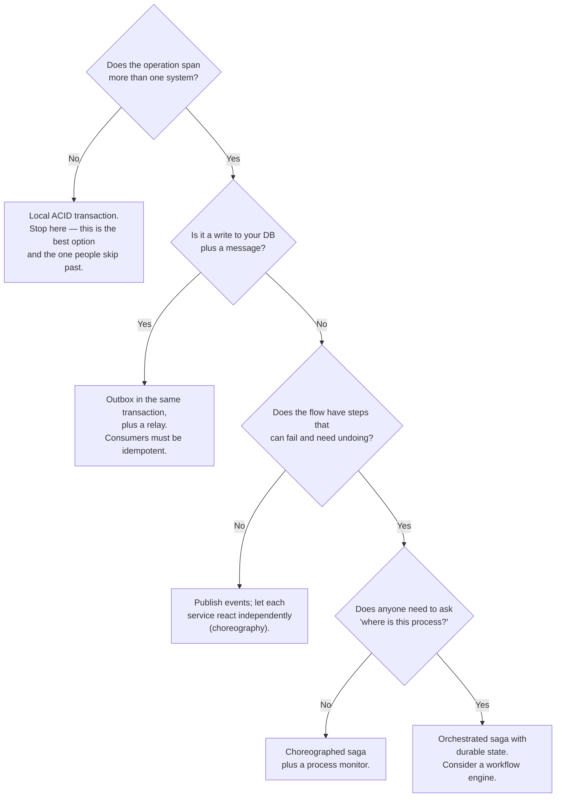

# Transactions, Sagas, and the Dual-Write Problem

Here is the problem this doc exists for, stated as small as it goes.

`checkout-api` must do two things when an order is placed: write the order row to `orders-db`,
and publish an `order.created` event to Kafka so that fulfilment, notifications, and analytics
find out. Two systems. Two writes.

```python
db.insert(order)                       # 1
kafka.publish("order.created", event)  # 2
```

There is no ordering of those two lines that is correct.

- **Database first**: the process crashes between line 1 and line 2. The order exists and nobody
  is ever told. It is never fulfilled. The customer's card is charged and no warehouse ever sees
  it.
- **Kafka first**: the publish succeeds and the database insert fails. Fulfilment ships a product
  for an order that does not exist. Analytics counts revenue that was never earned.
- **Either order, with a timeout**: the second operation times out. You do not know whether it
  happened (doc 00's partial failure). You cannot safely retry it and you cannot safely skip it.

You cannot solve this by being careful, by ordering the writes differently, by adding a retry, or
by wrapping it in a `try/finally`. **There is no atomic commit across two independent systems
without a protocol designed for it**, and the protocols designed for it have costs that make them
unsuitable for most microservice architectures.

So this doc is about what you *can* buy, what each option costs, and the specific ways each
option is implemented incorrectly.

## Why not just use a distributed transaction?

Two-phase commit (2PC) does solve this, formally. A coordinator asks every participant to
prepare; if all say yes, it tells them all to commit. It is correct, it is well understood, and
XA implementations exist.

It is also almost never the right answer in a microservice architecture, for four specific
reasons:

**1. It is a blocking protocol with a single point of failure at the worst moment.** A participant
that has voted "prepared" has promised to be able to commit. It holds its locks and waits. If the
coordinator crashes after collecting votes and before sending the decision, every participant is
stuck holding locks, unable to commit (it might be an abort) and unable to abort (it might be a
commit), until the coordinator returns. **The blocked resources are the hottest rows in the
system**, because those are the ones the transaction touched.

**2. Availability multiplies down, and it multiplies the wrong way.** By doc 00's arithmetic, a
transaction across 4 participants each at 99.9% succeeds 99.6% of the time — and unlike a
read path, you cannot make participants optional. Worse, 2PC's *latency* is two round trips to
the slowest participant plus two durable log writes, so a transaction across services in
different availability zones costs 4–8 ms of pure protocol on top of the work.

**3. Locks are held for the whole protocol, not for the local work.** A local transaction holds
row locks for the 2 ms it takes to write. A 2PC transaction holds them for the 20 ms of protocol.
That is a 10× reduction in throughput on contended rows, by Little's law.

**4. Most of what you want to coordinate does not support it.** Kafka is not an XA participant in
any useful sense. Neither is a payment provider's HTTP API, an email service, or a third-party
inventory system. 2PC requires every participant to implement the protocol, and the interesting
ones do not.

There is a narrow case where 2PC is right: **a small number of participants, all under your
control, all in one data centre, all supporting XA, with a highly available coordinator, where
the alternative is unacceptable.** Some financial cores work this way and are correct to. Most
systems are not that.

What follows is what everybody else does.

## The two mechanisms that actually work

Everything in this doc reduces to two ideas, and it is worth stating them before the details
because the details are easier once you see the shape.

**Idea 1: make one of the two writes local, so a single transaction covers both.** You cannot
atomically write to the database and to Kafka. You *can* atomically write to two tables in the
same database. So write the event to a table, in the same transaction as the order, and have a
separate process move it to Kafka afterwards. That is the **outbox pattern**, and it converts an
impossible problem (atomicity across systems) into a solved one (at-least-once delivery from a
durable queue).

**Idea 2: make every operation idempotent, so "did it happen?" stops being a question you need to
answer.** If applying the same operation twice has the same effect as applying it once, then you
can retry freely, and partial failure becomes survivable rather than fatal. This is why
idempotency keys appear everywhere in this doc.

Almost every correct design in this space is those two ideas composed.

## The failure catalogue

### T-01 · The dual write

**What you see.** Two systems disagreeing. Orders with no events; events with no orders; a payment
with no order; an order marked paid that was never charged. The rate is low — a fraction of a
percent — and it is discovered weeks later by finance, by a customer complaint, or by a
reconciliation job if you have one.

**Mechanism.** The opening of this doc. Two independent writes, no atomicity.

Quantify the exposure so it is not abstract. Riverbend does 67 orders/s. Suppose the window
between the two writes is 15 ms and the probability of a process crash, pod eviction, or network
failure in any given 15 ms window is small — say the pod restarts once a day for deploys and
evictions, so roughly one restart per 86,400 seconds:

```
Orders in flight during a restart: 67 orders/s × 0.015 s = 1 order
Restarts per day across 40 pods:   ~40 (deploys) + evictions
Orders at risk per day:            ~40
Per year:                          ~14,600
```

Fourteen thousand orders a year in an inconsistent state, from a code pattern that looks
completely normal in review. And that is only the crash case; timeouts on the second write are
far more frequent than crashes.

**Confirm it.** You need a reconciliation query, and if you do not have one you cannot know your
rate. The general shape:

```sql
-- Orders with no corresponding published event, older than the expected propagation window
SELECT o.order_id, o.created_at
FROM orders o
LEFT JOIN order_events_published e ON e.order_id = o.order_id
WHERE e.order_id IS NULL
  AND o.created_at < now() - interval '5 minutes'
  AND o.created_at > now() - interval '7 days';
```

Running this for the first time is how most teams discover they have this problem.

**Prevent.** The outbox pattern (`T-03`), or CDC (`T-04`). Those are the two answers. Everything
else — retries, `try/finally`, ordering the writes differently, "we'll just make the second write
very reliable" — reduces the rate and does not eliminate the class.

### T-02 · The saga that cannot be undone

Before the outbox mechanics, the other half of the problem: even with reliable messaging, a
multi-step business operation across services has no rollback.

**What you see.** A failure mid-way through a multi-step operation, and no way to get back to a
clean state. Money moved and goods not shipped, or the reverse.

**Mechanism.** Riverbend's checkout is five steps across five services:

```
1. Reserve inventory          (inventory-service)
2. Authorise payment          (payment-service → third party)
3. Create the order           (order-service)
4. Capture payment            (payment-service → third party)
5. Notify fulfilment          (fulfilment-service)
```

Step 4 fails. Steps 1–3 already happened. There is no `ROLLBACK` — each step committed in a
different database, and some of them called third parties.

The **saga** pattern accepts this: instead of rolling back, you run **compensating actions** that
semantically undo each completed step, in reverse order.

```
Compensate 3: cancel the order        (mark CANCELLED, not DELETE)
Compensate 2: void the authorisation
Compensate 1: release the reservation
```

The essential and frequently-missed point: **a compensation is not a rollback.** A rollback makes
it as if the operation never happened. A compensation makes a *new* change that offsets the
previous one, and the intermediate state was visible to the world.

That difference has real consequences:

- The customer may have received an order-confirmation email at step 3. You cannot un-send it.
  You must send a cancellation, which is a different customer experience.
- The inventory reservation was visible to other customers, who saw "out of stock" during the
  window and left.
- Analytics counted the order. Financial reporting may have included it.
- **Compensations can fail.** Voiding an authorisation requires calling the payment provider,
  which may be the thing that is down.

**Prevent** — or rather, design for, since this is inherent:

1. **Order the steps so the hardest-to-compensate step is last.** Payment capture before order
   creation is wrong; order creation before capture is right, because cancelling an order is
   cheap and reversing a capture is a refund with fees and a customer-visible transaction.
2. **Prefer reservations to commitments.** Authorise (reversible) rather than capture
   (expensive to reverse). Reserve inventory (expires) rather than decrement it.
3. **Make compensations idempotent and retryable forever.** A compensation that cannot be
   completed must be retried until it can, because the alternative is permanent inconsistency.
   Put it on a durable queue with no maximum retry, and alert when one has been retrying for more
   than an hour.
4. **Accept that some compensations are manual.** A "compensation failed and cannot be
   automatically resolved" state that pages a human is a better design than one that silently
   gives up. Make it a first-class state in the state machine, not an exception log line.

### T-03 · The outbox implemented in a separate transaction

**What you see.** You implemented the outbox pattern, and you still have the dual-write problem.

**Mechanism.** The outbox works like this, and the detail that makes it work is easy to get
wrong:

```python
with db.transaction():                    # ONE transaction
    db.insert(orders, order)              # the business write
    db.insert(outbox, event)              # the event, in the SAME transaction
# commit — both or neither

# Separately, asynchronously:
#   a relay reads unpublished rows from `outbox`, publishes to Kafka,
#   and marks them published
```

Both writes are in the same database and the same transaction, so they are atomic. The relay
provides at-least-once delivery to Kafka. There is no window.

The implementations that do not work:

- **A separate transaction for the outbox insert.** `with db.transaction(): insert(order)` then
  `with db.transaction(): insert(outbox_row)`. This is the original problem with extra steps.
- **Writing to the outbox after the commit.** Same thing.
- **An outbox in a different database** from the business data. Also the same thing.
- **An ORM that opens a new session or connection for the outbox insert**, which silently makes
  it a separate transaction. This one is invisible in the code and is the most common real cause.

**Confirm it.** Read the code for the transaction boundary, and then verify empirically: kill the
process between the two writes (a test that injects a crash after the business insert) and assert
that neither row exists.

**Prevent.** Same connection, same transaction, verified by a test. And because the relay
delivers at-least-once, **every consumer must be idempotent** (`T-05`) — the outbox solves
atomicity, not duplication.

Two implementation choices for the relay:

| Approach | How | Trade |
|---|---|---|
| **Polling publisher** | `SELECT * FROM outbox WHERE published_at IS NULL ORDER BY id LIMIT 100 FOR UPDATE SKIP LOCKED` | Simple, no extra infrastructure. Adds query load; latency is the poll interval; the outbox table needs cleaning up. |
| **Log tailing (CDC)** | Read the database's WAL/binlog with Debezium and publish changes | No query load, sub-second latency, catches writes made outside the application. More infrastructure; `T-04`'s failure modes. |

Polling is the right default. Use `FOR UPDATE SKIP LOCKED` so multiple relay instances can run
concurrently without contending, poll every 100–500 ms, and delete or archive published rows
(an outbox table that grows forever becomes `S-11`).

### T-04 · CDC lag and the connector that broke on a schema change

**What you see.** Events stop flowing, or arrive minutes late, and the source database looks
perfectly healthy.

**Mechanism.** Change data capture reads the database's replication log. Its failure modes are
its own:

- **Connector failure with a retained slot.** Debezium holds a PostgreSQL replication slot. If the
  connector stops, the slot retains WAL, and the primary's disk fills (`S-14`). A CDC outage
  becomes a database outage.
- **Schema changes.** A column is dropped or retyped. The connector's schema registry entry no
  longer matches, and either the connector fails or downstream deserialisation does.
- **Snapshot on restart.** Some configurations re-snapshot the entire table when the connector
  restarts without a valid offset, which republishes every row — millions of duplicate events
  into a downstream that may not be idempotent.
- **Leaked internals.** CDC publishes your *database schema* as your event contract. Rename a
  column for internal reasons and you have broken every consumer. This is the strongest argument
  for the outbox over raw CDC: the outbox row is a deliberately designed event, while a CDC row
  is an implementation detail.

**Prevent.** Alert on connector status and on replication-slot retained bytes with a hard
`max_slot_wal_keep_size` backstop. Use a schema registry with compatibility enforcement. Prefer
**CDC *of the outbox table*** rather than of business tables — you get log-tailing's low latency
and no query load, while keeping the event contract explicitly designed. This combination is the
best-of-both option and is what Debezium's own outbox event router is built for.

### T-05 · Idempotency keys done wrong

**What you see.** Duplicates despite having "implemented idempotency". Or the opposite: legitimate
repeat operations being rejected as duplicates.

**Mechanism.** Idempotency is simple in concept and has five independent details that are each
commonly wrong.

**The concept.** The client generates a unique key per logical operation and sends it with every
attempt. The server, on seeing a key it has processed, returns the stored result instead of
processing again.

```
POST /orders
Idempotency-Key: 8f2a91c4-6d3e-4b1a-9f7c-2e5d8a0b3c61
```

**Detail 1 — who generates the key.** It must be the **client**, once, before the first attempt,
and reused across retries. A server-generated key is useless (the retry gets a new one). A key
derived from the request body is fragile (two genuinely separate identical orders collide — a
customer buying the same item twice in a minute is legitimate). A key generated inside the retry
loop is the most common bug and it is invisible in review:

```python
# WRONG — a new key on every attempt
for attempt in range(3):
    post("/orders", headers={"Idempotency-Key": uuid4()}, json=order)

# RIGHT — one key for the logical operation
key = uuid4()
for attempt in range(3):
    post("/orders", headers={"Idempotency-Key": key}, json=order)
```

**Detail 2 — the scope of the key.** Keys must be scoped per API-key or per customer, not global,
or one tenant's key collision affects another. And the *operation* must be part of the scope:
the same key for `POST /orders` and `POST /refunds` must not collide.

**Detail 3 — concurrency.** Two retries can arrive simultaneously — the client's timeout fired at
exactly the moment the first request was completing. A naive check-then-act has a race:

```python
if store.get(key):        # both requests see nothing
    return stored
process()                 # BOTH process
store.put(key, result)
```

The fix is an atomic insert that fails on conflict, performed *before* processing:

```sql
INSERT INTO idempotency_keys (key, scope, status, created_at)
VALUES ($1, $2, 'IN_PROGRESS', now())
ON CONFLICT (scope, key) DO NOTHING
RETURNING key;
-- Zero rows returned means someone else has it.
```

**Detail 4 — what to do when the first attempt is still in progress.** The second request sees
`IN_PROGRESS`. It must not process, and it must not return success (the first one may fail). The
correct response is **HTTP 409 Conflict with a `Retry-After`**, meaning "this operation is
underway, ask again shortly." Returning 200 with no result is wrong; blocking and waiting ties up
a thread and can deadlock with the first request.

**Detail 5 — storing the result, and expiry.** The stored record must include the **response**,
so a replay returns the same answer, not just "already done." And it needs a TTL — 24 hours is
typical, matching or exceeding the maximum plausible retry window. Too short and a late retry
duplicates; forever and the table grows without bound.

One more, which catches people in audits: **the idempotency record and the business effect must
be written in the same transaction.** Otherwise you can complete the order and crash before
recording the key, and the retry duplicates — you have reintroduced `T-01` inside your solution
to it.

```sql
BEGIN;
  UPDATE idempotency_keys SET status='DONE', response=$1 WHERE scope=$2 AND key=$3;
  INSERT INTO orders (...) VALUES (...);
  INSERT INTO outbox  (...) VALUES (...);
COMMIT;
```

### T-06 · Natural idempotency, and when you do not need a key

Not everything needs the machinery above. It is worth knowing which operations are already safe,
because adding idempotency keys where they are unnecessary is its own complexity cost.

| Operation shape | Idempotent? | Note |
|---|---|---|
| `SET quantity = 3` | **Yes** | Absolute assignment. Retry freely. |
| `quantity = quantity - 1` | **No** | Relative. Needs a key or a version check. |
| `INSERT` with a client-supplied primary key | **Yes** | The second insert conflicts; treat conflict as success. |
| `INSERT` with a server-generated key | **No** | Two rows. |
| `DELETE WHERE id = X` | **Yes** | Second delete affects zero rows, which is fine. |
| State transition `PENDING → PAID` guarded by current state | **Yes** | `UPDATE ... WHERE status='PENDING'` affects zero rows on replay. |
| Publishing an event with a deterministic ID | **Yes, for the consumer** | The consumer dedupes on the ID. |
| Charging a card | **No** | Needs a key, and the provider must support it. |
| Sending an email | **No** | Needs a key, and most providers do support one. |

The pattern that generalises best: **guard every state transition by the expected current
state.** `UPDATE orders SET status='PAID' WHERE order_id=$1 AND status='PENDING'` returns a row
count. One means you did it; zero means someone else already did, or it was in an unexpected
state — and those two cases are distinguishable with one extra read. This gives you idempotency
and optimistic concurrency in the same statement, and it costs nothing.

### T-07 · The reservation with no expiry

**What you see.** Inventory or seats that are "held" forever by sessions that ended long ago.
Sellable stock declining without sales. At Gateline: an event that shows as sold out with 12,000
seats never purchased.

**Mechanism.** Step 1 of a saga reserves something. The saga fails or the user abandons at step 3.
The compensating release never runs — the process crashed, the message was lost, the user just
closed the tab.

Without an expiry, the reservation is permanent. And since reservations are created constantly
and released only on the happy path, the leak is monotonic: **you lose inventory at the rate of
your abandonment rate**, forever.

Gateline makes the arithmetic vivid. Sale opens; 200,000 users hold seats for 10 minutes each;
roughly 60% abandon:

```
120,000 abandoned holds
If holds never expire: 120,000 seats permanently unsellable — the venue has 100,000
```

The entire event sells out to nobody within minutes.

**Prevent.** **Every reservation has an expiry, enforced by the holder of the resource, not by
the requester.** Two implementations:

```sql
-- Option A: expiry column, checked on read and swept
UPDATE seats SET held_by=$1, held_until = now() + interval '10 minutes'
WHERE seat_id=$2 AND (held_by IS NULL OR held_until < now());
-- Availability queries use: WHERE held_by IS NULL OR held_until < now()
```

```
# Option B: a TTL in the storage layer
SET seat:E1234:A17 held_by_session_xyz EX 600 NX
```

Option A is better for anything where the truth must be queryable and auditable; Option B is
better for very high rates. Either way:

- **The expiry is checked on read**, so an expired hold is invisible immediately even before any
  sweeper runs.
- **A sweeper reclaims expired holds** so the data does not accumulate — but correctness does not
  depend on the sweeper running.
- **The hold duration is short** and can be extended by an active session (a heartbeat), rather
  than being long "to be safe." A long hold is inventory you cannot sell.
- **Confirming the purchase must check the hold is still valid**, because it may have expired
  between the user's last action and their payment completing. The failure message ("your hold
  expired, the seat is gone") is a much better outcome than selling a seat twice.

### T-08 · Choreography with no visibility

**What you see.** A business process that sometimes does not complete, and no single place shows
its state. Debugging requires reading logs from six services and reconstructing the sequence.

**Mechanism.** There are two ways to coordinate a saga, and this is the failure mode of one of
them.

**Choreography**: each service listens for events and reacts. `order.created` → inventory service
reserves and emits `inventory.reserved` → payment service charges and emits `payment.captured` →
fulfilment ships. No central coordinator.

- ✅ No single point of failure, services are decoupled, easy to add a new participant.
- ❌ **The process exists nowhere.** No service knows the whole flow. There is no state to query,
  no way to ask "where is order 8f2a91?", and adding a step means changing several services'
  event subscriptions.
- ❌ Cycles and unintended triggers are easy to create and hard to see.
- ❌ Compensations are very hard: which service is responsible for noticing that step 4 failed and
  triggering the compensation of steps 1–3? Usually the answer is "nobody", which is `T-02`.

**Orchestration**: a coordinator service calls each participant and tracks progress in a durable
state machine.

- ✅ **The process is a first-class object** with a state you can query, an audit trail, and an
  obvious place to implement compensation and timeouts.
- ✅ Adding a step is one change in one place.
- ❌ The orchestrator is a dependency of the flow (`T-09`).
- ❌ More coupling: the orchestrator knows about every participant.

**The guidance.** Use choreography for *notification* — fan-out where nobody needs to know the
outcome. `order.created` going to analytics, recommendations, and the email service is
choreography and should be. Use orchestration for anything that is a **transaction with an
outcome that matters**, which is any flow with compensations, deadlines, or a state a customer
can ask about.

Riverbend's checkout is orchestrated; the eleven things that happen *after* an order is confirmed
are choreographed. That split is the usual right answer.

**Prevent** (for existing choreographed flows you cannot rewrite): build a **process monitor** —
a consumer that listens to all the events, reconstructs the state machine, and alerts on flows
that have not reached a terminal state within their expected time. This gives you the visibility
of orchestration without the rewrite, and it is often the highest-value thing you can add to an
event-driven system.

### T-09 · The orchestrator loses its state

**What you see.** In-flight sagas are abandoned when the orchestrator restarts. Some complete some
steps and never the rest.

**Mechanism.** An orchestrator that holds saga state in memory — a coroutine, a thread, an
in-process state machine — loses every in-flight process when its pod is replaced. At 40
concurrent checkouts and a deploy every hour, that is 40 abandoned sagas per deploy, each of
which may have reserved inventory (`T-07`) and authorised a payment.

**Prevent.** **The saga's state must be durable and the orchestrator must be resumable.** Every
state transition is written before the next step is attempted, so a new instance can pick up any
saga from its last recorded state. The pattern:

```sql
-- One row per saga instance; the step and its status are the durable state
CREATE TABLE checkout_saga (
  saga_id        uuid PRIMARY KEY,
  order_id       text NOT NULL,
  current_step   text NOT NULL,     -- RESERVING | AUTHORISING | CREATING | CAPTURING | DONE
  step_status    text NOT NULL,     -- PENDING | IN_PROGRESS | SUCCEEDED | FAILED
  compensating   boolean NOT NULL DEFAULT false,
  attempt_count  int NOT NULL DEFAULT 0,
  next_attempt_at timestamptz,
  payload        jsonb NOT NULL,
  updated_at     timestamptz NOT NULL DEFAULT now()
);
CREATE INDEX ON checkout_saga (next_attempt_at) WHERE step_status <> 'SUCCEEDED';
```

A sweeper picks up rows whose `next_attempt_at` has passed and resumes them. Combined with
idempotent participants (`T-05`), resuming a step that may have already succeeded is safe — which
is the whole reason idempotency is non-negotiable here.

This is what workflow engines (Temporal, Cadence, AWS Step Functions, Camunda) give you out of
the box, and it is a good reason to use one: durable execution, retries, timeouts, compensation,
and visibility are the entire product. **Building this yourself is a six-month project that looks
like a two-week project.** Doc 22 covers when to buy versus build.

### T-10 · Events applied out of order

**What you see.** A record in the wrong final state. An order showing `PENDING` after being
`SHIPPED`. A profile reverting to an old value.

**Mechanism.** Two events for the same entity are processed out of order. Causes:

- Different partitions. Kafka guarantees order **within a partition only**. If `order.updated`
  events are partitioned by a key other than `order_id` (or use the default partitioner with no
  key), two updates for the same order can land on different partitions and be consumed
  concurrently.
- Retries. Event A fails and is retried; event B succeeds meanwhile; A is applied after B.
- Parallel consumers within a partition (a worker pool fanning out messages for throughput).
- Multiple producers, each with its own view of time.

**Prevent.**

1. **Partition by the entity key.** Every event about `order_8f2a91` goes to the same partition,
   so it is consumed by one consumer in order. This is the primary mechanism and it is free.
   (It also creates the hot-partition risk of `S-01` if one entity is very active.)
2. **Make the application order-independent** using a version or timestamp: the consumer applies
   an event only if its version is greater than the stored version.

```sql
UPDATE orders SET status = $1, version = $2
WHERE order_id = $3 AND version < $2;   -- zero rows means we already have newer data
```

   This is the more robust mechanism because it survives everything — reordering, duplication,
   replay — and it is the same statement as the optimistic-concurrency guard in `T-06`. Use a
   monotonic version supplied by the producer, not a wall-clock timestamp, because of `L-10`.
3. **Ship state, not deltas, where you can.** An event carrying "the order is now `SHIPPED` with
   version 7" is safe to apply out of order (apply the highest version, ignore the rest). An event
   carrying "increment shipped_count by 1" is not. Where a delta is unavoidable, deduplicate by
   event ID.

### T-11 · The lost update

**What you see.** Two concurrent changes, one silently overwriting the other. A customer edits
their address in two tabs and one change vanishes. Two services update an order and one's fields
are gone.

**Mechanism.** Read-modify-write without concurrency control:

```
T1: read  order (status=PENDING, notes="")
T2: read  order (status=PENDING, notes="")
T1: write order (status=PAID,    notes="")
T2: write order (status=PENDING, notes="fragile")   ← overwrites T1's status
```

`READ COMMITTED` — the default in PostgreSQL and the practical default in MySQL — does **not**
prevent this. It prevents dirty reads, not lost updates. Many engineers believe a transaction
prevents this; it does not, at the default isolation level.

**Prevent.**

- **Optimistic concurrency**: a `version` column, incremented on write, with the write conditioned
  on the version read. Zero rows affected means someone else won; re-read and retry. Costs one
  column and correct handling of the retry, and works across services because the version travels
  in the API.
- **Pessimistic locking**: `SELECT ... FOR UPDATE`. Correct, and it holds a lock — so never across
  a network call (`S-10`).
- **Do not read-modify-write at all.** `UPDATE orders SET notes = $1 WHERE order_id = $2` updates
  only the field it means to, and a partial-update API (`PATCH` semantics) avoids the whole class.
  A great many lost updates come from an API that accepts a whole object and writes all its
  fields, including the ones the caller never looked at.

### T-12 · Cross-service referential integrity

**What you see.** Orphaned records. An order referencing a customer that was deleted. A shipment
for an order that does not exist. Reports that do not add up.

**Mechanism.** A foreign key enforces integrity within one database. Across services there is no
foreign key — `order-service` holds `customer_id` values that `customer-service` owns and can
delete without telling anybody.

**Prevent.** There is no mechanism that gives you referential integrity across services, so the
design has to accommodate its absence:

1. **Do not hard-delete referenced entities.** Soft-delete with a status. A deleted customer
   becomes `status=DELETED`, and their orders still resolve. This is also usually a legal
   requirement for financial records.
2. **Publish deletion as an event** and let downstream services react on their own terms
   (anonymise, archive, or reject new references).
3. **Denormalise the fields you need at the time you need them.** An order stores the customer's
   name and address *as they were at purchase*, not a reference to be resolved later. This is not
   a workaround — it is correct, because the shipping address on an order should not change when
   the customer moves house.
4. **Tolerate dangling references in read paths.** A UI that cannot resolve a customer shows
   "unknown customer" rather than erroring. Doc 00's soft-dependency rule.
5. **Reconcile** (`T-13`), because some will happen anyway.

### T-13 · No reconciliation, so divergence is invisible

**What you see.** Nothing. That is the problem. Then a quarterly financial close finds a
discrepancy of unknown age and unknown cause.

**Mechanism.** Every mechanism in this doc is best-effort under some failure. Outbox relays can
be stopped for a day. Compensations can permanently fail. Idempotency windows can expire before a
very late retry. A schema bug can drop a field. **Divergence between two systems is not a
possibility to be prevented; it is a certainty to be detected and corrected.**

A system that does not reconcile does not have less divergence. It has the same divergence and no
knowledge of it.

**Prevent.** Build reconciliation as a first-class, scheduled, alerting component — the same way
you build monitoring. The questions it should answer, for every pair of systems that must agree:

| Check | Riverbend example | Frequency | Action on mismatch |
|---|---|---|---|
| Count match | Orders created vs `order.created` events published | Every 5 min | Alert; republish from outbox |
| Sum match | Sum of order totals vs sum of payment captures | Hourly | Page; this is money |
| State match | Orders `PAID` vs charges `SUCCEEDED` | Hourly | Investigate each |
| Orphan check | Payments with no order; orders with no payment | Hourly | Auto-refund or auto-cancel per rule |
| Stuck check | Sagas not in a terminal state after 30 min | Every 5 min | Resume or escalate |
| Inventory | Physical count vs reserved + available | Daily | Adjust and investigate |

Three properties make reconciliation work rather than just exist:

- **It must have an action, not just an alert.** "Orders with no event: 14" that goes to a
  dashboard nobody reads is theatre. Republish them automatically, and alert only on what could
  not be resolved.
- **It must run often enough that the mismatch window is small.** Discovering a problem five
  minutes after it starts means a handful of records; discovering it at the quarterly close means
  a project.
- **The expected mismatch count is zero, and a nonzero count is an incident.** Teams that
  normalise a steady background of mismatches lose the signal entirely. If there is a legitimate
  reason for a class of mismatch, exclude that class explicitly so the remainder can be zero.

This is the same philosophy as the rest of the collection: **turn the silent failure into a loud
one.** Reconciliation is how you do it for correctness failures, which is the only class where
monitoring your own request path tells you nothing.

### T-14 · The exactly-once illusion

**What you see.** A design document that says "exactly-once delivery" and an implementation that
duplicates.

**Mechanism.** Worth being precise about, because the phrase causes real design errors.

**Exactly-once *delivery* over a network is impossible.** The sender cannot know whether a message
arrived; if it does not retry it may lose the message, and if it does retry it may duplicate it.
There is no third option. This is partial failure again and it is not an engineering gap.

**Exactly-once *processing* is achievable**, and it means something specific: the *effect* of the
message is applied once, even if the message is delivered many times. That is at-least-once
delivery plus an idempotent consumer. The deduplication has to happen somewhere, and the only
question is where:

| Where dedup happens | Mechanism | Scope of the guarantee |
|---|---|---|
| The broker | Kafka's idempotent producer, producer ID + sequence number | One producer session to one partition. Not across restarts with a new producer ID, and not across topics. |
| A transaction | Kafka transactions: consume-process-produce atomically | Only within Kafka. **Does not extend to your database.** |
| The consumer's store | Idempotency key or version guard in the same transaction as the effect | **Everything.** This is the one that actually works. |

The last row is the answer, and it is why `T-05` and `T-10` are the load-bearing entries in this
doc. Kafka's exactly-once semantics are genuinely useful within Kafka — a stream processor
reading, transforming, and writing back to Kafka gets real atomicity, and
[`../Kafka/05-delivery-semantics-and-ordering.md`](../Kafka/05-delivery-semantics-and-ordering.md)
derives it properly. But the moment your consumer writes to a database, calls an API, or sends an
email, you are outside the transaction and you need consumer-side idempotency.

**So say what you mean.** "At-least-once delivery with idempotent consumers" is accurate,
buildable, and tells the reader what they must implement. "Exactly-once" tells them they need not
bother, which is how the duplicates get in.

## Choosing between the approaches



The branch people skip is the first one. **A very large fraction of distributed-transaction
problems are self-inflicted by a service boundary drawn in the wrong place.** If `order-service`
and `inventory-service` must always change together, atomically, under contention, then they are
one transactional boundary wearing two service costumes, and the correct fix is to merge them —
not to build a saga. Doc 22 argues this properly; it is the single most effective and least
popular answer in this collection.

## What to take away

1. **There is no atomic commit across two independent systems**, and no ordering of the two
   writes is correct. The dual write is a certainty at some rate, not a risk — Riverbend's is
   roughly 14,600 inconsistent orders a year from code that looks entirely normal.
2. **Two-phase commit is correct and almost always wrong here**: it blocks holding locks when the
   coordinator dies, it multiplies availability down with no optional participants, and the
   interesting participants (Kafka, payment providers, email) do not implement it.
3. **Everything that works is one of two ideas**: make one write local so a single transaction
   covers both (the outbox), or make the operation idempotent so "did it happen?" stops mattering.
4. **The outbox works only if the event row is written in the same transaction as the business
   row.** An ORM that opens a separate session for it silently reintroduces the problem, and this
   is the most common real cause of "we implemented the outbox and still have duplicates."
5. **Prefer CDC of the outbox table over CDC of business tables.** Raw CDC publishes your schema
   as your contract, so an internal rename breaks every consumer.
6. **A compensation is not a rollback.** The intermediate state was visible, emails were sent, and
   compensations themselves can fail. Order steps so the hardest-to-undo one is last, prefer
   reservations to commitments, and make "compensation failed" a first-class state that pages a
   human.
7. **Idempotency keys have five details and each is commonly wrong**: client-generated once (not
   inside the retry loop), correctly scoped, inserted atomically before processing, returning 409
   while in progress, and stored *with the response* in the same transaction as the effect.
8. **Guard every state transition by its expected current state.** `UPDATE ... WHERE
   status='PENDING'` gives you idempotency and optimistic concurrency in one statement, at no
   cost.
9. **Every reservation needs an expiry enforced by the resource holder**, checked on read so
   correctness does not depend on a sweeper. Without it you lose inventory at your abandonment
   rate, permanently.
10. **Orchestrate anything with an outcome someone will ask about; choreograph pure notification.**
    A choreographed flow exists nowhere and cannot be queried — if you have one, build a process
    monitor that reconstructs its state and alerts on flows that never terminate.
11. **Saga state must be durable and resumable**, or every deploy abandons the in-flight ones. A
    workflow engine gives you this and it is a legitimate buy-versus-build decision.
12. **Partition by entity key for ordering, and apply with a version guard for correctness.** The
    version guard survives reordering, duplication, and replay; partitioning alone does not.
13. **`READ COMMITTED` does not prevent lost updates.** Use a version column, or do not
    read-modify-write.
14. **Reconciliation is not optional.** Divergence is a certainty; a system without reconciliation
    has the same divergence and no knowledge of it. Run it every few minutes, give it an
    automatic corrective action, and treat a nonzero mismatch as an incident.
15. **"Exactly-once delivery" is impossible; "exactly-once processing" is at-least-once delivery
    plus an idempotent consumer.** Say the second thing, because the first tells people they need
    not implement the part that does the work.

Next: [08-caching-failure-points.md](08-caching-failure-points.md), which covers the layer that
makes everything fast and, when it stops, makes everything fail at once.
