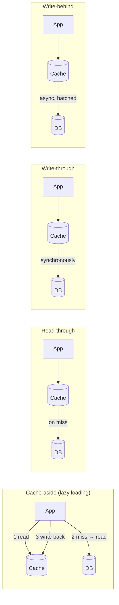

# Caching — The Layer That Hides Your Real Capacity

A cache is the only component in your architecture whose *purpose* is to hide how much load your
system can actually take. That is not a criticism; it is what caching is. And it produces a
specific and dangerous property:

> **Your system's capacity is a function of your cache hit rate, and your cache hit rate is not a
> thing you control.**

Riverbend's catalogue serves 5,000 reads/s at a 96% hit rate, so origin sees 200/s. Origin is
provisioned for maybe 600/s. If the hit rate drops to 50% — not to zero, to *half* — origin sees
2,500/s, which is four times its capacity. A cache problem is never a cache problem; it is
immediately a total outage of everything behind the cache.

So the questions this doc keeps returning to are: **what makes the hit rate change, how fast can
it change, and can the thing behind the cache survive it?** The last one is the important one and
it is almost never answered before the incident.

## The patterns, and what each one's failure looks like

Four ways to wire a cache. They are often used interchangeably in conversation and they have
different consistency and failure properties.



| Pattern | Who reads the DB on a miss | Consistency | Characteristic failure |
|---|---|---|---|
| **Cache-aside** | The application | Eventual; races on concurrent write (`C-08`) | Stampede on miss (`C-01`); every caller implements it slightly differently |
| **Read-through** | The cache layer | Same as aside, but centralised | Cache becomes a hard dependency; its failure is total |
| **Write-through** | — (writes go through) | Cache always current | Every write pays cache latency; a cache failure blocks writes |
| **Write-behind** | — | **Cache is ahead of the DB** | **Data loss on cache failure** — acknowledged writes exist only in memory |

Cache-aside is the default and the right default for most things, because a cache failure
degrades you to origin rather than stopping you. Write-behind is the one to be careful with: it
makes the cache a *system of record* for the duration of the write-behind window, which means a
Redis failure loses acknowledged data. That is fine for a view counter and not fine for anything
else, and the distinction gets lost when someone enables it for performance.

## The failure catalogue

### C-01 · The cache stampede

**What you see.** A cache entry expires and origin receives hundreds or thousands of identical
simultaneous requests for the same thing. Origin slows, so the requests take longer, so more
pile up.

**Mechanism.** The arithmetic is the point, so work it through with Lumen's numbers.

A celebrity account's post timeline is cached with a 5-minute TTL. It receives **167,000
reads/s** (from the reference notes: 50 million reads over 5 minutes). The origin query takes
800 ms.

At the instant the TTL expires:

```
Requests arriving during the 800 ms it takes to recompute:
  167,000 req/s × 0.8 s = 133,600 concurrent requests
Every one of them finds an empty cache and issues the same origin query.
```

**133,600 identical concurrent database queries** for one key. The database does not survive
that. And because it does not survive it, the recompute takes longer than 800 ms, so more
requests pile in, so it takes longer still. The stampede is self-amplifying — it is `F-04` with a
cache as the trigger.

Note what makes it so severe: it is not that the load increased, it is that **a single key's
worth of work was multiplied by the number of concurrent readers**. The origin was never sized
for 133,600 concurrent anything.

**Confirm it.** Origin request rate per cache key, or origin QPS correlated with cache-miss
events. The signature is a spike of *identical* queries — if your slow-query log shows the same
query text thousands of times within a second, that is a stampede.

**Recover.** Populate the key manually (run the query once, write the result in) and the
stampede ends instantly. That is worth knowing under pressure: you do not need to fix the
mechanism to stop the bleeding, you just need one successful write.

**Prevent.** Three techniques, and you generally want all three because they cover different
cases.

**1. Request coalescing (single-flight).** Only one request per key goes to origin; the others
wait for its result. This is a per-process lock keyed by the cache key:

```go
// Go's golang.org/x/sync/singleflight
var g singleflight.Group

func GetTimeline(ctx context.Context, userID string) (Timeline, error) {
    v, err, _ := g.Do("timeline:"+userID, func() (interface{}, error) {
        return loadTimelineFromDB(ctx, userID)   // runs exactly once per key, per process
    })
    return v.(Timeline), err
}
```

Per process. With 200 Lumen feed-service instances, this reduces 133,600 concurrent queries to
**200** — one per instance. That is a 668× reduction from twenty lines of code, and it is the
highest-value single technique in this doc.

For the remaining 200, add a distributed lock (`SET lock:key token NX EX 10`): the winner
recomputes, the losers wait briefly and re-read. That takes it to 1. But note the cost — a
distributed lock introduces `L-01`'s failure modes — so most systems stop at per-process
coalescing plus the next technique, which is cheaper and safer.

**2. Probabilistic early recomputation.** Instead of expiring at a fixed moment, each reader
independently decides to refresh early with a probability that rises as the TTL approaches. The
standard form (known as XFetch) is:

```
refresh if:  now - delta * beta * ln(random(0,1))  >=  expiry
    where delta = how long the last recompute took
          beta  = tuning factor, 1.0 default
```

The effect: for a key that takes 800 ms to compute, some reader will typically refresh it a
second or two before it expires, while it is still being served from cache. **The key never
actually expires under load.** No stampede, because the refresh happens while the old value is
still available.

**3. Serve stale while revalidating.** Store the value with two timestamps: `soft_expiry` and
`hard_expiry`. Past the soft expiry, return the stale value immediately and trigger a background
refresh. Past the hard expiry, block. This is HTTP's `stale-while-revalidate` and it is the
easiest to reason about:

```
value, soft_exp, hard_exp = cache.get(key)
if value and now < soft_exp:      return value                    # fresh
if value and now < hard_exp:      refresh_async(key); return value  # stale but fine
                                  # nothing usable — must compute
```

Combine: soft expiry + coalescing means only one background refresh runs, and nobody ever waits.

### C-02 · Synchronised expiry: the whole cache expires at once

**What you see.** A sudden, complete collapse in hit rate at a round interval — often exactly one
TTL after a deploy or a cache flush. Not one key: all of them.

**Mechanism.** `C-01` multiplied across every key.

A deploy restarts all instances; they repopulate the cache over the next two minutes; every entry
gets `TTL = 3600`. **One hour later, to the second, all of them expire together.** Origin receives
a full cold-cache load for every key simultaneously.

Riverbend's catalogue: 5,000 reads/s at a 96% hit rate. At the synchronised expiry moment, the
hit rate goes to 0% for the few seconds it takes to repopulate:

```
5,000 req/s to origin instead of 200 req/s = 25× 
Origin capacity ~600 req/s
```

Origin is at 8× capacity. It collapses, so repopulation fails, so the cache stays empty, so the
load continues. What began as a correct TTL is now an outage with no trigger anyone can point to
— and it recurs every hour until someone notices the periodicity.

**Confirm it.** Hit rate over time, at fine resolution. Periodic cliffs are unmistakable. Also
look at the distribution of remaining TTLs across keys — a healthy cache has them spread
uniformly; a synchronised one has them clustered.

```bash
# Redis: sample TTLs and look at the distribution
redis-cli --scan --count 1000 | head -500 | while read k; do redis-cli ttl "$k"; done \
  | sort -n | uniq -c | tail -20
```

**Prevent.** Jitter every TTL. Always. Without exception:

```python
ttl = base_ttl * random.uniform(0.8, 1.2)     # ±20% is plenty
```

This spreads a synchronised population of 500,000 keys over a 24-minute window for a one-hour
base TTL, which turns a 25× spike into a barely visible ripple. It is one line and it prevents an
entire failure class.

Also: **jitter is needed for the population event, not only the expiry.** If instances all start
simultaneously and populate in the same order, the keys are written in the same order and expire
in the same order, so even with jitter you get waves. Randomising the order of warm-up helps.

### C-03 · The hot key that saturates one cache node

**What you see.** One Redis or Memcached node at 100% CPU while the others are at 15%. Cluster
capacity looks fine in aggregate.

**Mechanism.** The same shape as `S-01`, one layer up. A cache cluster shards by key hash, so a
single key lives on a single node. A key receiving 167,000 reads/s is 167,000 reads/s on one
node.

Redis is single-threaded for command execution. A single node handles roughly 80,000–120,000
simple `GET`s per second, and that is with small values on a fast network. 167,000 exceeds it, and
if the value is large (a 200 KB serialised timeline) the limit is network bandwidth instead:

```
167,000 reads/s × 200 KB = 33 GB/s
```

which is far beyond any single node's network interface — a 25 Gbps NIC delivers about 3 GB/s.
So this key cannot be served from one cache node regardless of how fast Redis is.

**Confirm it.**

```bash
# Redis: what is hot right now
redis-cli --hotkeys                       # requires maxmemory-policy allkeys-lfu
redis-cli --bigkeys                       # large values, which turn reads into bandwidth
redis-cli info commandstats | head -20
# Per-node metrics: ops/sec and network out, compared across the cluster
```

**Prevent.**

- **A local (in-process) cache in front of the shared cache.** This is the single most effective
  fix. 200 Lumen instances each holding the hot key locally for 1 second reduces shared-cache
  reads from 167,000/s to 200/s — an 835× reduction. The cost is up to 1 second of staleness and
  a small amount of memory per instance, and for the overwhelming majority of hot keys (which are
  hot precisely because they are popular *read-mostly* data) that is a trivial cost.
- **Replicate the hot key.** Write it under N suffixed names (`timeline:celebrity:0` …
  `timeline:celebrity:15`) and have readers pick one at random. Sixteen nodes share the load. The
  cost is 16× the memory for that key and 16 writes on update, which is fine for a small number
  of hot keys.
- **Client-side hot-key detection.** Some clients track per-key request rates and promote hot keys
  to a local cache automatically. This is the productised version of the first bullet.

### C-04 · The cache became load-bearing

**What you see.** A cache incident is a total outage. The origin cannot serve even a fraction of
traffic.

**Mechanism.** Over time, traffic grew and origin capacity did not, because the cache absorbed
the growth. The hit rate climbed from 85% to 99.2% and everyone was pleased. What actually
happened:

```
Year 1:  1,000 req/s, 85% hit rate → origin serves 150 req/s (origin sized for 400)
Year 3:  5,000 req/s, 99.2% hit rate → origin serves 40 req/s
         Origin was never scaled; it is still sized for 400 req/s
         A full cache loss means origin receives 5,000 req/s against a capacity of 400
```

**The cache stopped being an optimisation and became a load-bearing component**, and nobody made
that decision. It happened by not making one.

The question that exposes this, and which belongs in every design review: **"What is the maximum
origin load this system can survive, and what hit rate does that correspond to?"** For most
mature systems the honest answer is "we can survive a hit rate above about 94%, and we normally
run at 99.2%", which means a 5-point hit-rate drop is an outage. That is a *very* thin margin for
a number that is not under your control.

**Prevent.** Decide, deliberately, which category the cache is in, and design accordingly:

| Category | Requirement | How to hold the line |
|---|---|---|
| **Optimisation** | Origin can serve 100% of traffic, just slower | Load-test origin with the cache disabled, quarterly. This is the test that proves the category. |
| **Load-bearing** | Origin cannot serve cold; the cache is a tier of the system | Treat it as a database: replication, failover, capacity planning, backup/warm standby, and an explicit cold-start procedure |

Most systems should be honest that they are in the second category, and then give the cache the
engineering attention a database gets. The common failure is to be in the second category while
believing you are in the first.

Two mechanisms make a load-bearing cache survivable:

- **A cold-start procedure that works**: admit traffic at a small percentage and ramp as the hit
  rate climbs, rather than admitting 100% into an empty cache (`F-10`). This should be a runbook
  with a script, not an improvisation.
- **Aggressive load shedding at origin** (doc 03, `P-08`), so that a cold cache produces degraded
  service rather than a collapse. Origin serving 600 req/s and shedding 4,400 is a bad afternoon;
  origin accepting 5,000 and collapsing is an outage.

### C-05 · Cold start after a restart or a flush

**What you see.** Every deploy of the cache tier, or every Redis failover, causes a latency and
error spike lasting minutes.

**Mechanism.** `F-10` applied to the cache. An empty cache means 100% miss, which means origin
sees full traffic, which means everything is slow, which means the repopulation is slow.

The duration is computable and is worth computing before you need it:

```
Lumen feed cache: 400 million keys, 4 TB
Repopulation rate limited by origin: say origin can serve 50,000 computes/s
400,000,000 / 50,000 = 8,000 seconds = 2 hours 13 minutes to fully warm
```

Two hours at degraded performance, after any total cache loss. That number should be on a wall
somewhere.

In practice the working set is much smaller than the key count — perhaps 5% of keys serve 80% of
requests — so the *useful* warm-up is faster. Measure it: plot hit rate against time after a
flush in a test environment.

**Prevent.**

- **Never flush the whole cache.** `FLUSHALL` should not be available to anyone in production.
  Invalidate by key or by prefix.
- **Persistence for restarts.** Redis RDB/AOF means a planned restart reloads the dataset from
  disk in seconds rather than repopulating from origin over hours. This alone converts the most
  common cause of cold start into a non-event.
- **Replica promotion instead of restart.** A failover to a warm replica keeps the data.
- **Multiple cache tiers with different failure domains**, so the L1 loss falls back to a warm L2
  rather than to origin.
- **Warm the cache before taking traffic** — replay a sample of recent keys against the new tier
  and only admit traffic once the hit rate is acceptable.

### C-06 · No negative caching: the miss that repeats forever

**What you see.** Origin load dominated by requests for things that do not exist. Often triggered
by a crawler, a broken client, or an attack.

**Mechanism.** A cache-aside implementation that only caches *found* values never caches "not
found." So every request for a nonexistent key is a cache miss and an origin query, forever.

The attack version is called **cache penetration**: an attacker requests random nonexistent IDs.
Every request bypasses the cache entirely and hits the database. A cache with a 99% hit rate
provides zero protection against traffic deliberately aimed at keys that are not in it.

```
Attacker at 10,000 req/s for random product IDs
Hit rate for those requests: 0%
Database receives 10,000 req/s of "SELECT ... WHERE id = <nonexistent>"
```

The benign version is more common and just as damaging: a client bug requesting a deleted
resource in a loop.

**Prevent.**

- **Cache the negative result** with a short TTL (30–60 s, shorter than positive TTLs because a
  thing that does not exist may start existing). Store a sentinel value, not an empty string, so
  you can distinguish "cached: absent" from "not cached."
- **A Bloom filter of existing keys** in front of the cache for very high-cardinality spaces. A
  Bloom filter for 100 million keys at a 1% false-positive rate is about 120 MB and answers
  "definitely not present" in microseconds. It never says "definitely present", which is exactly
  the direction you need.
- **Validate the key format before looking anything up.** A product ID that does not match the
  expected shape needs no database query.
- **Rate-limit by miss rate, per client.** A client whose requests miss 100% of the time is either
  broken or hostile, and either way should be slowed down.

### C-07 · Caching an error as if it were a value

**What you see.** A transient failure is served from cache for the full TTL, long after the
underlying problem is fixed.

**Mechanism.** The cache-aside code does not distinguish "origin returned nothing" from "origin
failed":

```python
value = db.get(key)         # raises or returns None on a timeout, depending on the driver
cache.set(key, value, ttl)  # caches the failure as if it were the answer
```

A five-second database blip now produces an hour of wrong answers. The blast radius of a
transient failure was multiplied by the TTL.

The inverse also happens and is worse: an error response with a *long* TTL cached at the CDN,
where you cannot easily purge it, serving a 500 page to a region for hours.

**Prevent.** Only cache values you positively obtained. Make the distinction explicit in types
(`Ok(Some(v))`, `Ok(None)`, `Err(e)` — cache the first two, never the third). At the HTTP layer,
set `Cache-Control: no-store` on error responses explicitly, because some CDNs will cache a 500
with a default TTL if you do not tell them otherwise.

### C-08 · The cache-aside write race

**What you see.** A cache entry that is stale indefinitely — not until a TTL, but until the next
write. Reproducible only under concurrency and therefore never found in testing.

**Mechanism.** This is the classic and it is worth walking step by step, because the fix people
reach for first does not work.

The interleaving:

```
t=0   Reader R: cache miss for key K
t=1   Reader R: reads DB, gets value V1
                                          t=2  Writer W: writes V2 to DB
                                          t=3  Writer W: deletes K from cache
t=4   Reader R: writes V1 into cache      ← stale value, written AFTER the invalidation
```

The cache now holds `V1` while the database holds `V2`, and nothing will correct it until the
TTL expires or someone writes again. If the TTL is long or absent, it is wrong forever.

The window is small — it requires the read to be slow and the write to land inside it — so this
occurs at a low rate, which is exactly what makes it hard to find. At Riverbend's 2,400 reads/s
against a 50 ms read latency, the window is open constantly, so a few of these happen every hour.

Now, why the obvious fixes do not work:

- **"Update the cache instead of deleting it"** makes it worse: two concurrent writers can apply
  their cache updates in the opposite order from their database updates, so the cache holds the
  older value permanently. Deleting is strictly safer than updating.
- **"Delete before writing the DB instead of after"** just moves the window: a reader can
  repopulate from the old DB value between the delete and the write.

**Prevent**, in increasing order of strength:

1. **Delete-after-write plus a short TTL.** The TTL bounds the damage. This is what most systems
   do and it is adequate when bounded staleness is acceptable — which it usually is.
2. **Delayed double delete.** Delete the key, write the DB, then delete again after a short delay
   (longer than a typical read). The second delete removes anything a racing reader wrote. Simple,
   effective, and not airtight.
3. **Versioned cache entries.** Store `(value, version)` and only accept a write into the cache
   if its version is greater than what is there. Redis can do this atomically with a Lua script.
   This is the same version-guard idea as `T-10` and it actually closes the race.
4. **Invalidate from the change log, not from the application.** A CDC consumer reading the
   database's WAL invalidates cache keys in commit order. Because it is downstream of the
   commit, it cannot race with it. This is the strongest option and it is why large systems tend
   to end up here.

### C-09 · Invalidation that silently fails

**What you see.** Stale data with no pattern. Some keys correct, some not, with no TTL to explain
it.

**Mechanism.** Invalidation is a side effect and side effects fail:

- The delete is issued after the transaction commits but the process crashes in between.
- The cache is unreachable at that moment; the delete is dropped; the error is logged and
  swallowed.
- The key used to invalidate does not match the key used to populate — a different serialisation,
  a missing tenant prefix, a trailing slash. The most common cause, and it produces *permanent*
  staleness because the correct key is never touched.
- The entry exists in multiple tiers (local, shared, CDN) and only one is invalidated.

**Prevent.**

- **A TTL on everything.** Even where you invalidate explicitly. The TTL is the backstop for
  failed invalidation, and a cache entry with no TTL is a promise that your invalidation is
  perfect, which it is not. If you catch yourself setting no expiry because "we always
  invalidate", that is the bug.
- **One function that builds cache keys**, used by both the read path and the invalidation path.
  Key-construction divergence is a top cause and it is entirely preventable by construction.
- **Invalidate from the change log** (`C-08` option 4), which makes invalidation a consequence of
  the commit rather than a separate best-effort action.
- **Multi-tier invalidation with an explicit fan-out**: publish invalidations on a pub/sub channel
  that every tier subscribes to, so a local cache in 200 instances is also cleared. Without this,
  local caches (the `C-03` fix) become the `C-09` problem, which is a real trade — accept it by
  keeping local TTLs very short (1–5 s).

### C-10 · Eviction pressure collapses the hit rate

**What you see.** Hit rate declining gradually over weeks, or dropping sharply when a new feature
starts caching something large.

**Mechanism.** The cache is full. Every write evicts something. If the working set exceeds
capacity, entries are evicted before they are re-read, and the hit rate falls non-linearly — not
proportionally to the shortfall, but off a cliff, because a cache that holds 90% of the working
set still serves most requests, while one that holds 40% serves very few.

Causes, in order of frequency: organic data growth; a new feature caching large objects in the
same instance; a TTL that was raised; a bug writing unbounded key variants (`C-11`).

The eviction policy matters here, and the default often does not match the intent:

| Policy | Behaviour | When it is right |
|---|---|---|
| `noeviction` | Writes fail when full | When the cache is a system of record — and then you must monitor memory closely |
| `allkeys-lru` | Evict least recently used | General caching. The usual right answer. |
| `allkeys-lfu` | Evict least *frequently* used | Better when there is a stable hot set; resists a scan polluting the cache |
| `volatile-lru` | Evict only keys with a TTL | **Dangerous**: if some keys have no TTL, they accumulate and eventually there is nothing evictable, and writes fail |

`volatile-lru` with a mix of TTL and non-TTL keys is a common and confusing production failure:
memory fills with immortal keys and the cache starts returning write errors while looking
half-idle.

**Confirm it.**

```bash
redis-cli info stats | grep -E 'keyspace_hits|keyspace_misses|evicted_keys|expired_keys'
redis-cli info memory | grep -E 'used_memory_human|maxmemory_human|mem_fragmentation_ratio'
```

A rising `evicted_keys` rate alongside a falling hit rate is the diagnosis. `evicted_keys` should
normally be near zero: eviction means the cache is too small for its working set, and `expired`
(not `evicted`) is the healthy way for entries to leave.

**Prevent.** Alert on eviction rate, not just on memory usage — memory sits at 100% by design in
an LRU cache, so memory usage is not the signal. Size from working set rather than key count.
Separate caches (or separate Redis databases/clusters) for workloads with very different value
sizes and access patterns, so a large-object feature cannot evict the small hot set.

### C-11 · Key cardinality explosion

**What you see.** Hit rate collapse with no change in traffic. Memory full of keys read once.

**Mechanism.** The same as `E-06` at the CDN, and the causes are identical one layer down: a key
that includes a timestamp, a request ID, a full query string, a locale that was previously
defaulted, or a user ID on something that used to be shared.

The insidious version: a cache key built by serialising a struct whose field order or whose
optional fields vary. Two logically identical requests produce two keys.

**Confirm it.** Count distinct keys against request count, and sample key names for
high-cardinality components:

```bash
redis-cli --scan --count 1000 | head -10000 \
  | sed -E 's/[0-9a-f]{8,}/<HEX>/g; s/[0-9]{4,}/<NUM>/g' \
  | sort | uniq -c | sort -rn | head -20
```

That collapses IDs into placeholders so you can see the *shapes* of your keys and how many
there are of each. A shape whose count equals your request count is not cached.

**Prevent.** Build keys from an explicit allowlist of components, in a single function, with a
canonical ordering. Include a schema version in the key so a change in value format does not
serve old data to new code (and so a deploy invalidates cleanly rather than deserialising
garbage).

### C-12 · Large values turn the cache into a bandwidth problem

**What you see.** Cache latency high, cache CPU moderate, network saturated. Or p99 spikes that
correlate with specific keys.

**Mechanism.** A cache is usually thought of in operations per second, but past a certain value
size the binding constraint is bytes per second, and the crossover is lower than people expect.

Lumen caches a rendered feed page at 200 KB:

```
A 25 Gbps NIC ≈ 3.1 GB/s
3.1 GB/s ÷ 200 KB = 15,500 reads/s per node
```

Fifteen thousand — versus the 100,000+ operations/s Redis could do with small values. The node is
bandwidth-bound at one seventh of its operation capacity.

Redis has a second problem with large values: it is single-threaded, so serving one 10 MB value
blocks every other command for the duration of the transfer. A handful of multi-megabyte keys
produces latency spikes across the whole node that look like random jitter.

Deserialisation is the third cost and it is on the *client*: parsing 200 KB of JSON takes
milliseconds of CPU, per request, in your application. A cache hit that costs 4 ms of CPU to
deserialise is not obviously better than a 6 ms database query.

**Prevent.** Cache smaller units and compose them (cache the 20 post objects, not the rendered
feed). Compress large values (LZ4 or Zstandard: typically 3–5× on JSON for well under a
millisecond). Use a compact binary format rather than JSON. And for genuinely large objects, do
not use a shared cache — use a local cache or object storage with a CDN. The reference notes'
[`caching/handlingLargeStructuresInCache.md`](../../../system-design-notes/caching/handlingLargeStructuresInCache.md)
goes deeper on this.

### C-13 · Multi-tier incoherence

**What you see.** Different users see different versions of the same data, persistently. Refreshing
sometimes changes the answer and sometimes does not.

**Mechanism.** The fix for `C-03` (a local in-process cache) creates this. With 200 instances,
there are 200 independent caches plus the shared one plus the CDN. An invalidation that clears
the shared cache leaves 200 local copies intact. A user whose requests are load-balanced across
instances sees whichever copy that instance holds.

**Prevent.** Accept bounded incoherence and bound it tightly:

- **Local caches get very short TTLs** (1–5 s). This makes the incoherence window small enough to
  be invisible for most data, and it preserves nearly all of the hot-key benefit — a 1-second
  local TTL on a key read 167,000 times/s still removes 99.9% of shared-cache load.
- **Publish invalidations on a pub/sub channel** that every instance subscribes to, for data where
  even seconds of staleness is unacceptable. Note that this is best-effort — an instance that
  missed the message keeps its copy — so the short TTL is still the backstop.
- **Do not put user-specific or write-heavy data in a local cache.** Local caches are for hot,
  shared, read-mostly data. That restriction is what makes them safe.

### C-14 · The cache that quietly became a database

**What you see.** A Redis failover loses data that mattered. Or the system cannot be rebuilt from
its databases because some state only ever existed in the cache.

**Mechanism.** Session data is put in Redis (reasonable). Then rate-limit counters (reasonable).
Then a distributed lock (`L-01`). Then a work queue. Then a feature writes something to Redis and
never to a database, because "it is just a counter." Then the counter is used for a business
decision.

Redis is now a system of record and nobody wrote that down. Its durability settings are the
defaults (RDB snapshots every few minutes, AOF probably off), so a failover loses up to several
minutes of writes.

**Confirm it.** For each key pattern in the cache, ask: **if this were deleted right now, could
the system reconstruct it from another source?** Anything answering "no" is not a cache.

**Prevent.** Separate the tiers explicitly — different Redis clusters for *cache* (evictable,
reconstructible, `allkeys-lru`, no persistence needed) and for *data* (durable, `noeviction`, AOF
with `appendfsync everysec`, replicated, backed up, monitored like a database). The separation
makes the distinction impossible to blur by accident, and it lets you configure each correctly,
because the correct configurations are opposites.

### C-15 · The cache client is the failure

**What you see.** Cache is healthy; application is failing on cache operations.

**Mechanism.** The cache client is a network client, so everything in doc 02 applies — and cache
clients are configured with less care than database clients because "it is just a cache":

- **No timeout on cache operations.** A Redis node under pressure takes 3 seconds to respond, and
  your 200 threads are all waiting on it. The cache, whose job is to make things fast, is now
  `R-01`.
- **No circuit breaker**, so the failure persists for the whole outage rather than falling back
  to origin after a few failures.
- **The cache treated as a hard dependency**: `cache.get()` throws, the exception propagates, the
  request fails. **A cache failure must never fail a request** — it should produce a miss. This is
  a one-line fix that is missing surprisingly often.
- **Connection pool too small**, so the cache becomes a queueing point (`R-09`).

**Prevent.** Treat the cache client with the full doc 02/03 discipline: a tight timeout (cache
operations are sub-millisecond; a 50 ms timeout is generous), a circuit breaker that falls back
to origin, a bulkhead, and — the one that matters most — **catch every cache exception and treat
it as a miss**:

```python
def get_cached(key):
    try:
        return cache.get(key)         # 50ms timeout
    except CacheError:
        metrics.increment("cache.error")
        return None                   # a miss, not a failure
```

⚠️ With one caveat that must be stated: **if the cache is load-bearing (`C-04`), falling back to
origin for 100% of traffic is the outage.** In that case the fallback must be combined with load
shedding at origin, so a cache failure produces degraded service rather than a collapse. Which
fallback is correct depends on which category the cache is in — which is why `C-04`'s question
is the one that matters.

## What to take away

1. **Your capacity is a function of your hit rate, and your hit rate is not under your control.**
   A 5-point drop at a 99% hit rate is a 6× origin load change. Know what hit rate your origin
   can survive; for most mature systems the margin is far thinner than the team believes.
2. **A stampede multiplies one key's work by the number of concurrent readers.** Lumen's hot
   timeline generates 133,600 identical concurrent queries at expiry. Per-process request
   coalescing alone reduces that by 668×, in about twenty lines.
3. **Use all three anti-stampede techniques**: coalescing (one origin call per key per process),
   probabilistic early recomputation (the key never actually expires under load), and
   stale-while-revalidate (nobody ever waits).
4. **Jitter every TTL, without exception.** Synchronised expiry turns a correct TTL into a
   recurring hourly outage with no trigger anyone can point to.
5. **A hot key cannot be served from one cache node** — Redis is single-threaded and a large value
   makes it bandwidth-bound at ~15,000 reads/s. The fix is a 1-second in-process local cache,
   which gives an 800× reduction for negligible staleness.
6. **Ask in every design review: can origin serve 100% of traffic?** If not, the cache is a tier
   of the system, not an optimisation, and needs a database's engineering attention — including a
   tested cold-start procedure and load shedding at origin.
7. **Never `FLUSHALL`.** Enable persistence so restarts reload from disk, fail over to warm
   replicas, and know your full-warm time (Lumen's is over two hours).
8. **Cache negative results** with a short TTL, or a caller requesting nonexistent keys bypasses
   your cache entirely — accidentally or deliberately.
9. **Never cache an error as a value.** A five-second blip becomes an hour of wrong answers, and
   at the CDN it becomes an hour you cannot easily purge.
10. **The cache-aside write race is real and the obvious fixes do not work.** Updating instead of
    deleting is worse; deleting before the write just moves the window. Use short TTLs plus
    delayed double delete, or — properly — version guards or invalidation driven from the change
    log.
11. **Put a TTL on everything, even where you invalidate explicitly.** A key with no TTL is a
    claim that your invalidation is perfect. Build cache keys in exactly one function used by
    both the read and the invalidate path.
12. **Alert on eviction rate, not memory usage** — an LRU cache sits at 100% memory by design.
    And check your eviction policy: `volatile-lru` with a mix of TTL and non-TTL keys eventually
    makes writes fail while the cache looks half idle.
13. **Separate "cache" Redis from "data" Redis** into different clusters with opposite
    configurations, so nothing drifts into being a system of record by accident.
14. **A cache failure must produce a miss, never a request failure** — with a tight timeout, a
    breaker, and a bulkhead. Unless the cache is load-bearing, in which case the fallback must be
    paired with origin-side shedding, or the fallback *is* the outage.

Next: [09-asynchronous-and-event-driven-failures.md](09-asynchronous-and-event-driven-failures.md),
which covers the path where there is no user waiting — and therefore no error rate, no latency
alert, and no natural way to notice that it stopped.
