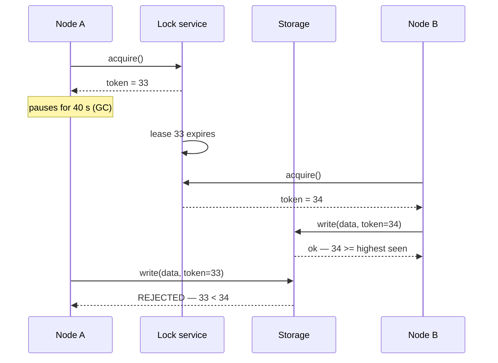
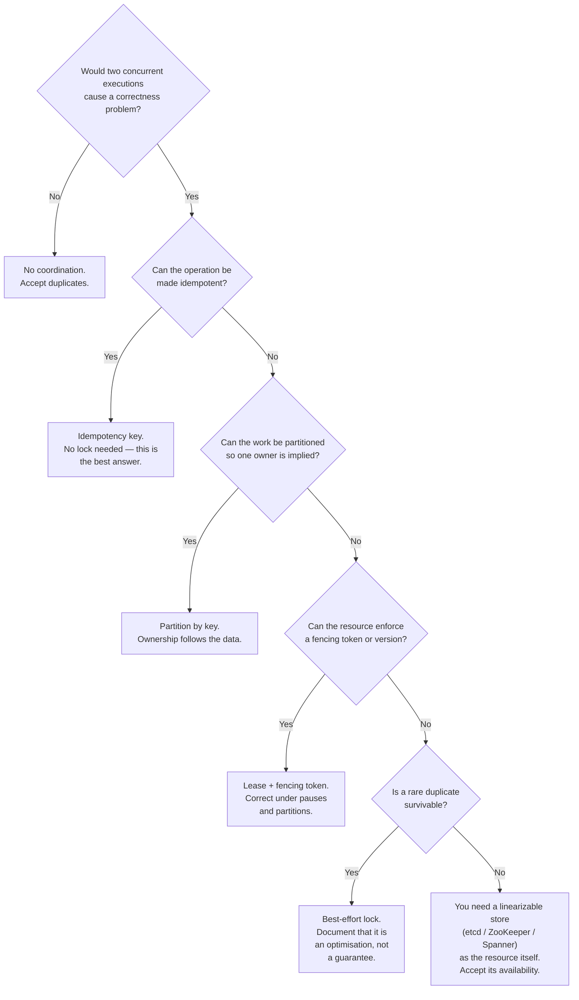

# Locks, Leaders, and Time — When Two Processes Both Think They Are In Charge

Every failure in this doc is a variation on one sentence:

> **Two processes each believe they are the only one doing something, and they are both wrong.**

That produces double-charges, double-shipments, seats sold twice, two writers corrupting each
other's state, and — the most expensive version — two nodes each believing they are the primary
database.

The thing that makes this hard, and the reason this doc exists separately from the others, is
that **the mechanisms people reach for do not work the way they appear to work.** A distributed
lock acquired with `SETNX` and a TTL looks exactly like a mutex and is not one. A leader election
that completed successfully does not mean there is one leader. A timestamp comparison between
two machines is not a valid ordering. Each of these is correct most of the time, which is the
problem: the failure appears only under conditions you cannot reproduce on demand.

## Why the obvious mechanism does not work

Start with the thing almost everyone builds first. Riverbend needs to ensure `invoice-rollup`
runs once per hour even though it is deployed on three nodes for redundancy.

```python
# Acquire
if redis.set("lock:invoice-rollup", my_id, nx=True, ex=300):   # 5 minute TTL
    try:
        run_invoice_rollup()      # takes about 7 minutes at peak
    finally:
        redis.delete("lock:invoice-rollup")
```

This looks correct. `SET NX` is atomic, so only one process can acquire. The TTL means a crashed
holder does not block forever. The `finally` releases it.

It is wrong in at least four independent ways, and each one is a real incident.

**Wrong 1: the TTL is shorter than the work.** `invoice-rollup` takes 7 minutes at peak; the TTL
is 5. At minute 5 the lock expires while node A is still working. Node B acquires it and starts a
second rollup. **Two rollups running concurrently is double-billing 240,000 orders.**

**Wrong 2: `delete` deletes someone else's lock.** Continuing the above, node A finishes at
minute 7 and runs `redis.delete("lock:invoice-rollup")` — deleting the lock **node B currently
holds.** Node C acquires it. Now three processes have run or are running. The release must be
conditional on ownership, which requires a compare-and-delete, which `DEL` is not:

```lua
-- Release only if we still hold it. This must be atomic, hence Lua.
if redis.call("GET", KEYS[1]) == ARGV[1] then
  return redis.call("DEL", KEYS[1])
else
  return 0
end
```

**Wrong 3: a process pause makes any TTL insufficient.** This is the deep one. Suppose you fix
the TTL to 15 minutes. Node A acquires the lock and begins work. Then:

- A JVM full GC pauses the process for 40 seconds. Or
- The VM is live-migrated and stops for 90 seconds. Or
- The node is under memory pressure and A is swapped out for two minutes. Or
- A network partition isolates A from Redis for three minutes while A keeps computing.

During the pause, A is not running — but it also does not know it was paused. From A's point of
view, one line of code took a long time. The lock expires. B acquires it. A resumes and continues
writing, **completely unaware that it no longer holds the lock.**

There is no TTL that fixes this, because there is no upper bound on how long a process can be
paused. You can make it unlikely. You cannot make it impossible.

**Wrong 4: Redis replication is asynchronous.** A single-node Redis is a single point of failure.
A replicated one loses the lock on failover: A acquires the lock on the primary, the primary
dies before replicating that write, the replica is promoted without the lock, and B acquires it
from the replica. Two holders, and no bug anywhere.

(This is what the Redlock algorithm attempts to address by acquiring on a majority of independent
Redis instances. It is genuinely contested whether it provides the guarantee it claims, and the
disagreement is precisely about problem 3 — timing assumptions. The practical position: if you
need a lock for *efficiency*, a single Redis lock is fine; if you need it for *correctness*, you
need fencing, and once you have fencing the lock service's exact guarantees matter much less.)

### What fixes it: fencing tokens

The insight that resolves all of this: **the lock cannot prevent a stale holder from acting, so
the resource must reject the stale holder's actions.**

Give each lock acquisition a monotonically increasing number — a **fencing token**. The holder
passes it with every write. The resource remembers the highest token it has seen and rejects
anything lower.



Node A's pause no longer matters. It can write whenever it wakes up; the write is refused. **The
correctness guarantee moved from the lock to the resource**, which is the only place it can
actually live, because the resource is the thing that observes the conflicting actions.

In practice you often already have the mechanism:

- **A version column** on the row, which is `T-11`'s optimistic concurrency. `UPDATE ... WHERE
  version = $expected` is a fencing check.
- **A conditional write**: DynamoDB's condition expressions, S3's `If-Match`, Cassandra's
  lightweight transactions.
- **`zxid`** in ZooKeeper, the **`ModRevision`** in etcd, the **lease ID** in etcd — all are
  monotonic and usable as tokens.
- **A leader epoch**, which is exactly this applied to leadership (and what Kafka uses; see
  [`../Kafka/02-replication-isr-and-durability.md`](../Kafka/02-replication-isr-and-durability.md)).

The rule to take away: **if you cannot fence, your lock is an optimisation, not a guarantee.**
That is often fine — say so explicitly and design for the duplicate.

## The failure catalogue

### L-01 · A lock used for correctness without fencing

**What you see.** Rare duplicates of something that "cannot" happen twice, at a rate of maybe one
in ten thousand, concentrated around GC pauses, node pressure, and network blips.

**Mechanism.** Derived above.

**Confirm it.** Correlate duplicate events with pause indicators on the holder: GC pause
duration, `container_cpu_cfs_throttled_seconds_total`, node memory pressure, and network errors
to the lock service. A duplicate that coincides with a multi-second pause is this.

**Prevent.** Fencing tokens, as above. If you cannot add them, then make the *work* idempotent
(doc 07, `T-05`) so a second execution is harmless — which is a better answer anyway, because it
removes the dependency on the lock being correct.

### L-02 · A lock held longer than its lease

**What you see.** Concurrent execution of something designed to be exclusive. Often discovered by
its effects rather than directly.

**Mechanism.** The work took longer than the TTL. Causes: the work grew (Riverbend's
`invoice-rollup` took 3 minutes when the TTL was set and takes 7 now); the downstream got slower;
it is a bad day and everything is 3× slower.

**Prevent.**

- **Renew the lease while working** (a heartbeat from a separate thread, renewing at TTL/3), so
  the TTL only bounds how long a *dead* holder blocks others, not how long work may take.
- **Check you still hold the lock before each significant step**, and abort if you do not.
- ⚠️ **The renewal thread must not be blocked by the work.** A renewal running on the same thread
  as the work, or on a thread pool the work has exhausted, will not renew. This is a common and
  subtle bug: the lock expires because the process is busy, which is exactly when it most needs
  the lock. Use a dedicated thread.
- **Set the TTL from measured runtime**: `p99_runtime × 3`, re-derived when the workload changes.
  And alert when actual runtime exceeds TTL/2, which is the leading indicator.

### L-03 · Lock contention as a throughput ceiling

**What you see.** Throughput plateaus at a number unrelated to CPU, memory, or I/O. Adding
instances does not help; it makes latency worse.

**Mechanism.** A lock serialises. Throughput through a lock is Little's law again:

```
max_throughput = 1 / lock_hold_time
```

Gateline's seat reservation, if it locks the whole event:

```
Hold time: 40 ms (read seat map, select, write, commit)
Maximum:   1 / 0.040 = 25 reservations/s
```

Twenty-five per second, for an event with 100,000 seats and 500,000 QPS of demand. Selling out
would take 4,000 seconds — over an hour — with every other request queued or rejected. The lock
is the entire system's capacity, and no amount of hardware changes it.

**Prevent.** Reduce hold time, or reduce the scope of what is locked. Usually both.

*Reducing scope* is the bigger lever. Locking one seat instead of the whole event:

```
100,000 independent seat locks
Each seat is contended only by the few users who want that exact seat
Aggregate throughput: bounded by the database, not by the lock — thousands/s
```

This is **lock striping** or fine-grained locking, and it is the single most effective technique
for contention. Doc 18 works through Gateline's full design.

*Reducing hold time*: never hold a lock across a network call (`S-10`); do the expensive
computation outside the critical section and only the state change inside it; use optimistic
concurrency (no lock at all — try, detect conflict, retry) when conflicts are rare.

**The choice between optimistic and pessimistic follows directly from the conflict rate:**

| Conflict rate | Use | Why |
|---|---|---|
| Low (< 5%) | **Optimistic** (version check, retry) | No lock overhead in the common case; the occasional retry is cheap |
| High (> 20%) | **Pessimistic** (lock, or queue) | Retries dominate; optimistic degenerates into a livelock where everyone retries and nobody wins |

Gateline's front-row seats during a sale have a conflict rate near 100%, which is why optimistic
concurrency is exactly wrong there and a queue per seat is exactly right.

### L-04 · Lock ordering and deadlock

**What you see.** Two operations both hang. The database reports a deadlock and kills one. Under
load, the deadlock rate climbs non-linearly.

**Mechanism.** Transaction 1 locks row A then row B. Transaction 2 locks row B then row A. Each
holds what the other needs.

```
T1: lock(account_7)  →  lock(account_3)
T2: lock(account_3)  →  lock(account_7)
```

A money transfer between two accounts, written the obvious way (lock the sender, then the
receiver), deadlocks whenever two transfers between the same pair run in opposite directions.

**Prevent.** **Acquire locks in a globally consistent order** — sort by the primary key before
locking:

```python
for account_id in sorted([from_account, to_account]):
    lock(account_id)
```

This makes deadlock structurally impossible for this operation, and it costs one `sorted()`. It
generalises: define a total order over lockable resources and never violate it.

Additionally: keep transactions short; set a `deadlock_timeout` and retry on deadlock (databases
detect and kill one participant, so a retry usually succeeds); and prefer a single statement that
does the whole update where possible, since one statement cannot deadlock with itself.

### L-05 · Leader election that produces two leaders

**What you see.** Two instances both performing the leader's duties. Duplicate work, conflicting
writes, doubled outbound calls.

**Mechanism.** Leader election is a distributed lock with a longer lease and the same problem.
Node A is elected. A network partition isolates it. The election service's lease expires and node
B is elected. A, still running and still able to reach the *database* (the partition was only
between A and the election service), continues acting as leader.

Note the asymmetry that makes this so common: **the partition that isolates a node from the
coordination service does not necessarily isolate it from the resources it is coordinating
access to.** This is the same failure as `S-08`'s split brain, and it happens for the same
reason.

**Prevent.** Everything from `L-01`, plus:

- **A leader epoch that increments on each election, carried on every action.** Downstreams
  reject actions from a stale epoch. This is what Kafka's controller does and it is the
  reference implementation of the idea.
- **A demotion path**: a leader that cannot renew its lease must **stop acting as leader
  immediately**, before the lease expires, not after. The safe rule is to stop at
  `lease_duration − max_clock_error − network_round_trip`, giving a safety margin so the old
  leader has stopped before the new one starts.
- **Prefer no leader at all.** Many "leader" designs exist only to prevent duplicate work, and
  can be replaced by partitioning (each instance owns a hash range, no coordination needed) or
  by making the work idempotent. **A design with no leader has no split brain.**

### L-06 · The lease renewed through the thing it protects

**What you see.** A leader that holds its lease during exactly the outage where it should have
lost it, or loses it during a blip where it should have kept it.

**Mechanism.** A subtle design error worth naming. If the leader renews its lease by writing to
the same database it is the leader *of*, then a database problem causes lease loss (unnecessary
failover during a database blip — now you have a database problem *and* a failover), while a
network partition that isolates the leader from everyone *except* the database lets it keep the
lease while being unreachable to clients.

The renewal path and the work path are coupled, and they should not be.

**Prevent.** Renew the lease through an independent coordination service (etcd, ZooKeeper,
Consul) whose failure domain is separate from the resource. And make the health signal for
leadership reflect *the ability to do the leader's job*, not just liveness — a leader that cannot
reach its downstream should voluntarily step down.

### L-07 · Quorum loss, and the minority that keeps serving

**What you see.** A coordination cluster that is up but refuses writes. Or, worse, two halves of
a partitioned cluster both serving.

**Mechanism.** A quorum system of `N` nodes requires `⌊N/2⌋ + 1` to agree. A 3-node cluster
tolerates 1 failure; 5 tolerates 2. Below quorum, writes must stop — that is the design working,
and it is why you are using a quorum system.

The failure modes:

- **Even-sized clusters.** A 4-node cluster tolerates 1 failure, exactly like a 3-node cluster,
  while costing more and having a *higher* probability of some failure occurring. Use odd
  numbers. A 2-node cluster is the worst case: it tolerates zero failures and a partition
  deadlocks it.
- **All voters in one failure domain.** Three etcd nodes in one availability zone tolerate one
  node failure and zero zone failures.
- **Reads served from a minority.** Consensus systems distinguish *linearizable* reads (which go
  through consensus and are correct) from *local* reads (fast, and possibly stale — from a node
  that has been partitioned off and does not know it). A client doing local reads from a
  partitioned minority node gets stale data with no error. If you are using a consensus store
  for correctness, use linearizable reads, and know that it costs a round trip.
- **The stale read after leader change** in systems with leader leases: an old leader can serve
  reads from its local state for the remainder of its lease after a new leader has been elected.
  Bounded, but nonzero.

**Prevent.** Odd-sized clusters spread across failure domains; linearizable reads for anything
correctness-critical; alert on leader-election rate (a healthy cluster elects a leader rarely —
any ongoing election rate means instability, usually disk latency per `D-13`); and keep the data
small, because these systems degrade sharply with size.

### L-08 · Clock skew as a correctness input

**What you see.** Records with timestamps in the future. Events that appear to happen before
their causes. Tokens rejected as expired immediately after being issued. Rate limits that let
through twice the allowance.

**Mechanism.** Two machines' clocks disagree. With good NTP, skew is typically under 10 ms and
occasionally much worse — a machine whose NTP daemon died can drift by seconds per day, and a VM
resumed from a snapshot can be wrong by hours.

Where this becomes a correctness bug:

- **"Last write wins" conflict resolution by timestamp.** Cassandra's default. If node A's clock
  is 200 ms ahead, A's writes always win, including when they are logically older. **Data is
  silently lost**, deterministically, in favour of whichever node has the fastest clock.
- **Token expiry.** A JWT issued with `exp = now + 300` by a server whose clock is 30 s ahead is
  rejected as expired by a validator 30 s behind... or accepted 30 s after it should have been.
  This is why validators should allow a small clock-skew tolerance (60 s is conventional).
- **Distributed rate limiting** over time windows: two limiters with skewed clocks disagree about
  which window a request belongs to, so a client can get two windows' allowance at the boundary.
- **Ordering events from multiple producers** by timestamp (`L-10`).
- **Lease expiry computed by comparing a remote expiry time against a local clock.** The leader
  thinks it has 4 seconds left; the coordinator thinks the lease expired 1 second ago.

**Confirm it.**

```bash
chronyc tracking      # offset, and whether it is actually synchronised
chronyc sources -v
timedatectl status    # "System clock synchronized: yes"
```

Alert on clock offset across the fleet — `node_timex_offset_seconds` from node-exporter — with a
threshold around 100 ms. This is a metric almost nobody alerts on and it is cheap.

**Prevent.** The general rule: **never use a wall clock for anything where correctness depends on
ordering or exclusivity.** Use instead:

| Instead of | Use |
|---|---|
| Comparing timestamps from different machines | A logical clock: a version counter, a Lamport timestamp, or a hybrid logical clock (HLC) |
| Last-write-wins by wall clock | Explicit versioning, CRDTs, or application-level merge |
| Timeouts computed from wall clock | A **monotonic** clock (`CLOCK_MONOTONIC`, `System.nanoTime()`, Go's `time.Since`) |
| Lease expiry across machines | Duration-based leases where the holder measures elapsed time locally with a monotonic clock, plus a safety margin |
| Ordering events | A sequence number from the producer, or a single sequencer |

A **hybrid logical clock** is worth knowing about because it is the practical middle ground: it
is a wall-clock timestamp adjusted so that it is always monotonic and always respects causality,
so it is both human-interpretable and safe to compare. CockroachDB and YugabyteDB use it;
Spanner's TrueTime is the stronger version that uses atomic clocks and GPS to bound the
uncertainty and then *waits out* the uncertainty interval before committing. Most of us cannot
buy atomic clocks, which is exactly why the rule above matters.

### L-09 · Wall clock where a monotonic clock belongs

**What you see.** A timeout that fires immediately, or never. A rate limiter that lets through a
burst. Usually right after an NTP correction.

**Mechanism.** The wall clock can jump — backwards on an NTP step correction, forwards on a
resume from suspend, and (historically) sideways during a leap second. Code that measures a
duration by subtracting two wall-clock readings gets a wrong answer, and possibly a negative one:

```python
start = time.time()            # wall clock — WRONG for durations
do_work()
elapsed = time.time() - start  # can be negative, or wildly large
```

A negative elapsed time in a timeout check means "we have infinite time left"; a large one means
"we already timed out." Both have produced production incidents.

**Prevent.** Use the monotonic clock for every duration measurement:

```python
start = time.monotonic()
do_work()
elapsed = time.monotonic() - start    # always non-negative, unaffected by NTP
```

```go
start := time.Now()
// Go's time.Since reads the monotonic component embedded in time.Now(), so this
// is correct — but only if the Time value has not been round-tripped through
// serialisation, which strips it.
elapsed := time.Since(start)
```

That Go caveat is worth knowing: a `time.Time` that has been marshalled to JSON and back loses
its monotonic reading and silently becomes wall-clock-based.

And configure NTP to **slew rather than step** (`chrony`'s `makestep` limited to startup only),
so the clock is adjusted gradually rather than jumping. A stepping clock in production is a
correctness hazard for anything that got the monotonic question wrong.

### L-10 · Ordering by timestamp across producers

**What you see.** Events processed in the wrong causal order. A "cancelled" applied before the
"created" it cancels.

**Mechanism.** `L-08` applied to event ordering. Two services each timestamp their events with
their own clock. A consumer sorts by timestamp. The sort is wrong by the skew.

Worse, the skew is not constant — it changes as NTP corrects — so the same pair of events could
sort differently on different days. The bug is not reproducible.

**Prevent.** Never order across producers by wall-clock timestamp:

- **Single sequencer**: all events for one entity go through one producer or one partition, which
  assigns a sequence number. This is what partitioning by entity key gives you (`Q-08`).
- **Causal metadata**: each event carries the version it was derived from, and the consumer
  applies only in causal order.
- **Version guard at apply time** (`T-10`): the robust answer, because it makes ordering
  irrelevant rather than correct.

Keep the wall-clock timestamp for humans and for analytics. Just do not compute with it.

### L-11 · The process pause that breaks every assumption

**What you see.** Impossible-looking behaviour: a lock held by two processes, a lease that
expired while the holder thought it was fine, a health check that failed for a process that was
never unhealthy.

**Mechanism.** The general form of `L-01`'s problem 3, worth stating on its own because it
invalidates reasoning throughout a distributed system.

**A process can stop for an arbitrary duration without knowing it happened.** Sources, with
realistic magnitudes:

| Cause | Typical | Worst seen |
|---|---|---|
| JVM full GC (large heap, CMS/parallel) | 100–500 ms | **tens of seconds** |
| Go GC | < 1 ms | a few ms (Go's GC is genuinely low-pause) |
| Container CPU throttling (`F-05`) | up to 87.5 ms per 100 ms period | seconds under heavy throttle |
| Swap / memory pressure | 100 ms | minutes |
| VM live migration | 100 ms | **seconds** |
| Hypervisor steal time on a noisy host | 10 ms | seconds |
| `SIGSTOP` from a debugger or an orchestrator | — | unbounded |
| Slow disk blocking a synchronous write | 10 ms | **tens of seconds** on degraded storage |

From inside the process, all of these look identical: one line of code took a long time. There is
no callback for "you were paused."

**Prevent.** You cannot prevent the pause. You can make the system correct despite it:

- **Fencing tokens** so a resumed process's writes are rejected.
- **Check the lease after the work, before committing.** The check is not sufficient on its own
  (a pause can occur between the check and the commit) but combined with fencing it closes the
  practical window.
- **Idempotent operations** so a duplicate is harmless.
- **Reduce pause length**: a smaller heap, a low-pause collector (ZGC, Shenandoah, G1 with a
  pause target), `GOMEMLIMIT`, no swap, generous CPU requests and careful use of CPU limits (doc
  12).
- **Monitor pause duration** as a first-class metric and alert on it. A service with 8-second GC
  pauses will violate every timing assumption in the system, and nobody will connect the two
  unless the metric exists.

### L-12 · Coordination used where partitioning would do

**What you see.** A coordination service in the critical path of every request, adding latency
and a dependency, for a problem that did not need it.

**Mechanism.** Not a runtime failure but a design failure that causes them. Teams reach for a
distributed lock when the actual requirement is "do not do this work twice", and there are
usually cheaper ways to get that:

| Requirement | Coordination-free alternative |
|---|---|
| Process each item once | **Partition** the item space; each worker owns a range. Kafka consumer groups do exactly this. |
| One instance runs the scheduled job | A `CronJob` with the orchestrator handling singleton semantics, or a database row with a conditional update: `UPDATE jobs SET run_at=now() WHERE name=$1 AND run_at < now() - interval '1 hour'` — one row wins, no lock service |
| Unique ID generation | Snowflake-style IDs from a per-instance node ID, or UUIDs. No coordination at all. |
| Rate limiting | Per-instance limits with a shared approximate counter (doc 03, `P-11`) |
| Don't send the email twice | An idempotency key checked at the point of sending |
| Only one writer per entity | Route all writes for an entity to one shard by key — the writer is determined by the data, not by an election |

The conditional-update trick in row two deserves emphasis because it replaces a lock service with
a database row and is correct: the update is atomic, only one caller gets a nonzero row count,
and the `run_at` timestamp is both the lock and the record. No lease, no expiry, no fencing
needed, because the state change *is* the acquisition.

**Prevent.** In design review, ask of every lock: **what would break if two ran?** If the answer
is "nothing, it would just be wasteful", you want a cheap optimisation, not a correctness
mechanism, and you should say so in the code — because someone will later rely on it for
correctness.

### L-13 · Coordination that does not survive its own dependency

**What you see.** A coordination service outage that stops everything, including things that
could have continued.

**Mechanism.** Doc 05's control-plane argument applied to coordination. If every request acquires
a lock from etcd, etcd's availability is your availability, and etcd is a consensus system whose
availability is lower than a stateless service's by construction (it stops on quorum loss, by
design).

**Prevent.** Keep coordination off the request path. Acquire leadership rarely and hold it (a
leader elected once an hour, not per request). Cache the leadership decision locally with a
lease. Degrade to "all instances act independently and idempotently" if the coordination service
is unreachable, where the work permits it — and where it does not, fail closed and say so.

## The decision procedure



The two branches worth internalising: **idempotency beats locking**, because it removes the
requirement rather than satisfying it; and **if the resource cannot fence, no lock service can
give you a correctness guarantee**, so the choice is between making the duplicate harmless and
moving the state into a linearizable store.

## What to take away

1. **Every failure here is "two processes each believe they are the only one."** Locks, leaders,
   and clocks are three ways to get that wrong.
2. **`SETNX` with a TTL is not mutual exclusion.** It has four independent defects: the TTL can
   be shorter than the work, `DEL` can delete someone else's lock, a process pause defeats any
   TTL, and async replication loses the lock on failover.
3. **No TTL is long enough**, because there is no bound on how long a process can be paused, and
   from inside the process a 40-second GC pause is indistinguishable from a slow line of code.
4. **Fencing tokens are the fix**, because they move the guarantee from the lock to the resource —
   the only place that can observe the conflict. A version column, a conditional write, or a
   leader epoch all work. **If you cannot fence, your lock is an optimisation, not a guarantee**,
   and you should write that down.
5. **Release must be conditional on ownership** (compare-and-delete via Lua or equivalent), and
   the lease must be renewed from a dedicated thread that the work cannot starve.
6. **Throughput through a lock is `1 / hold_time`.** Gateline locking a whole event caps it at 25
   reservations/s. Stripe the lock to the finest granularity the domain allows; that is the single
   biggest lever.
7. **Optimistic concurrency below ~5% conflict rate, pessimistic above ~20%.** At near-100%
   contention, optimistic degenerates into everyone retrying and nobody winning.
8. **Acquire locks in a globally consistent order** (sort by key) and deadlock becomes
   structurally impossible for that operation.
9. **A leader is a lock with a longer lease and the same problems.** Use epochs, step down
   *before* the lease expires with a safety margin, and renew through a service independent of the
   resource being led. Best of all, design so there is no leader.
10. **Odd-sized quorum clusters across failure domains**, linearizable reads where correctness
    depends on it, and alert on leader-election rate — an ongoing election rate means instability.
11. **Never compare wall-clock timestamps from different machines for correctness.** Last-write-
    wins by timestamp silently discards data in favour of the fastest clock. Use logical clocks,
    version counters, or a single sequencer; keep wall clocks for humans.
12. **Use the monotonic clock for every duration.** A wall-clock subtraction can return a negative
    elapsed time after an NTP step, which reads as "infinite time remaining."
13. **Alert on clock offset across the fleet** (~100 ms threshold) and on GC/pause duration. Both
    are cheap, both invalidate timing assumptions system-wide, and almost nobody has either.
14. **Ask of every lock: what breaks if two run?** Idempotency, partitioning, and a conditional
    database update replace most locks, and each of those removes a dependency rather than adding
    one.

Next: [11-deploys-config-and-schema-change.md](11-deploys-config-and-schema-change.md), which
covers the cause of more outages than everything in this collection so far combined — the changes
we make ourselves.
