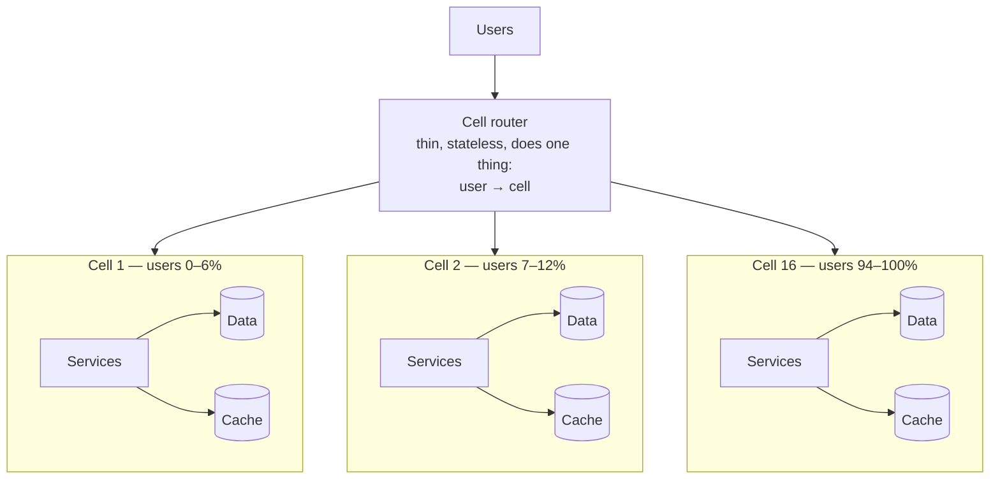

# Isolation — Cells, Zones, Regions, and Bounding the Blast Radius

Everything in this collection so far has been about preventing specific failures. This doc is
about the failures you will not prevent.

That is not defeatism; it is arithmetic. You can enumerate and defend against the failure modes
you know. The ones that cause your worst outages will be the ones nobody listed — a bug in a
library you did not write, an interaction between two changes neither of which was wrong, a
cloud provider behaviour nobody documented. **Against unknown failures, the only defence is
structural: make sure that whatever goes wrong, it goes wrong for a bounded fraction of your
users.**

That is what isolation is, and it is the single most valuable architectural investment for
reliability at scale, because its benefit does not depend on predicting anything.

The trade is explicit and worth stating up front: **isolation costs efficiency.** Every boundary
means duplicated capacity, duplicated caches, duplicated operational overhead, and less
statistical multiplexing. A single shared fleet is always cheaper than eight isolated ones. You
are buying a bound on the worst case by giving up efficiency in the normal case, and whether
that is worth it depends on what a total outage costs you.

## The two questions that define a blast radius

For any failure, two numbers:

- **Scope**: what fraction of users, requests, or data is affected?
- **Severity**: how badly, for those affected?

A failure affecting 100% of users with 2% elevated latency and one affecting 2% of users
completely are very different events, and a single "availability" number hides the difference.
This matters because **isolation trades scope for severity**: without cells, a bad request
degrades everyone slightly and then kills everyone; with cells, it kills one cell completely and
leaves the rest untouched. Most businesses prefer the second, and some — anything where a partial
service is worthless — prefer the first. Know which you are.

## What a failure domain actually is

Doc 00 listed them. The critical follow-up is that **most teams' real failure domains are much
larger than their intended ones**, because the intended boundary is drawn on the diagram and
something crosses it invisibly.

For every boundary you believe you have, find the things that span it:

| Intended boundary | Commonly spans it anyway |
|---|---|
| Availability zone | A single-zone database; a NAT gateway in one zone; a control plane; the deploy |
| Cell | A shared cache, a shared database, a shared identity service, a shared feature-flag service |
| Region | DNS; the global load balancer; the CI/CD pipeline; the observability stack; the auth service |
| Service | The shared client library; the shared base image; the shared node pool |
| Tenant | A shared thread pool; a shared connection pool; a shared rate limiter's backing store |
| Deployment | Nothing — every instance gets the same code. This boundary does not exist. |

The exercise that produces the most value in a design review: **for each boundary, name the
failure that crosses it.** There always is one. Naming it converts an assumed isolation into a
measured one.

## Cell-based architecture

A **cell** is a complete, independent instance of your system — its own services, its own data
store, its own cache — serving a defined subset of users. A user belongs to exactly one cell and
all their requests are served there.



What cells give you that nothing else does:

- **A bounded blast radius for any failure**, including ones you did not anticipate. A cell of
  1/16 means any single-cell failure affects 6.25% of users, whatever its cause.
- **A bounded deploy blast radius.** Roll to one cell, watch, proceed. This converts the
  deployment failure domain — the one that spans everything — into a bounded one, which is the
  single largest benefit.
- **A known unit of scale.** You scale by adding cells, not by making a cell bigger, so the
  performance characteristics of a cell stay constant and known.
- **Testable capacity.** You load-test one cell to destruction and know exactly what a cell can
  take.
- **Isolation of poison inputs.** A request that crashes the fleet (`F-07`) crashes one cell.

What they cost:

- **Duplicated fixed overhead** per cell: minimum replica counts, database instances, cache
  clusters. With 16 cells and a 3-node minimum per component, you are running 48 of everything.
- **Worse cache hit rates**: 16 caches each holding 1/16 of the traffic have lower hit rates than
  one cache holding all of it, because the long tail of keys gets fewer hits per cache.
- **More operational surface**: 16 of everything to monitor, patch, and reason about. This is the
  cost that actually bites, and it is why cells only make sense with strong automation.
- **Cross-cell operations become hard** (`I-05`).

### I-01 · The cell boundary that leaks

**What you see.** A "cell" failure affects users in other cells.

**Mechanism.** Something is shared. The usual culprits, in descending order of frequency:

- **A shared database** for one "small" thing — a user-to-cell mapping, a configuration table, a
  global sequence.
- **A shared cache** because someone wanted better hit rates.
- **A shared identity or auth service**, because "everyone needs auth" — which is exactly the
  argument for why it must not be shared.
- **A shared feature-flag or config service** (`G-06`).
- **Shared infrastructure underneath**: the same node pool, the same NAT gateway, the same subnet.
- **A shared observability pipeline**, which does not affect users but blinds you across all
  cells at once.

**Prevent.** A written, enforced rule: **a cell may not depend on anything outside itself except
the cell router and genuinely global, statically-stable services.** Enforce it at the network
layer — network policies or separate VPCs — rather than by convention, because convention does
not survive a deadline. And audit it: a periodic job that inspects actual network flows per cell
and reports any egress outside the allowed set finds the leaks that code review does not.

For the things that genuinely must be global (identity, billing), the rule is that they must be
**fail-static from the cell's perspective**: the cell caches what it needs and continues working
when the global service is unavailable. A global service the cell cannot survive without is a
cell boundary that does not exist.

### I-02 · The cell router as the new single point of failure

**What you see.** Everything is down, and every cell is healthy.

**Mechanism.** Every request passes through the router that maps user to cell. It is a single
shared component with 100% blast radius — which is exactly what cells were supposed to eliminate.

**Prevent.** The router must be the simplest, most boring, least-frequently-changed component in
the system:

- **It does one thing**: look up a user's cell and forward. No business logic, no enrichment, no
  authentication decisions.
- **Its mapping is essentially static.** Users move between cells rarely and deliberately. The
  mapping can therefore be cached everywhere, for a long time, and served from a read-only
  replica or even a static file distributed to edge locations.
- **It fails static**: if the mapping store is unreachable, use the cached mapping. If a user is
  unknown, use a deterministic default (`hash(user_id) % n_cells`) rather than failing.
- **It is deployed on a different, slower schedule** than everything else, with the highest
  scrutiny.
- **Cell assignment can be pushed to the client** where possible — a mobile app or a cookie that
  remembers the cell endpoint means the router is not in the steady-state path at all, only on
  first contact. This is the strongest version, and it is what several large systems do.
- **DNS-per-cell** as a fallback path: `cell-7.api.example.com` resolvable directly, so a router
  outage can be bypassed by clients that know their cell.

### I-03 · Cells sized wrong

**What you see.** Either the blast radius is still too large (too few cells) or the operational
and fixed cost is unmanageable (too many).

**Mechanism.** Cell count is a trade between blast radius and overhead:

```
blast_radius  = 1 / n_cells
fixed_cost    ∝ n_cells
```

| Cells | Blast radius | Fixed overhead |
|---|---|---|
| 2 | 50% | 2× minimums |
| 4 | 25% | 4× |
| 8 | 12.5% | 8× |
| **16** | **6.25%** | 16× |
| 64 | 1.6% | 64× |

The returns diminish sharply: going from 4 to 8 cells halves the blast radius from 25% to 12.5%,
a 12.5-point improvement. Going from 32 to 64 improves it from 3.1% to 1.6% — 1.5 points — for
double the overhead. **Somewhere between 8 and 16 is where most systems land**, because that is
where the marginal blast-radius reduction stops being worth the marginal overhead.

The other constraint, which often dominates: **a cell must be large enough to be efficient and
small enough to be fully load-testable.** If a cell's database is under-utilised at its minimum
viable size, you have too many cells. If you cannot generate enough load in a test environment
to saturate one cell, you have too few.

**Prevent.** Size a cell by **maximum capacity**, then divide: "a cell can serve 50,000 users at
peak; we have 600,000 users; therefore 12 cells, rounded up to 16 for headroom and growth." And
crucially: **when growth exceeds a cell's capacity, add a cell — never grow the cell.** The whole
value of the model is that a cell's characteristics are known and constant. A cell that has
quietly grown to 3× its tested size is an untested configuration.

### I-04 · Shuffle sharding, and the poison tenant

Cells with contiguous assignment have a weakness: if user X's behaviour breaks their cell, every
other user in that cell is affected. With 16 cells, one bad tenant takes down 6.25% of users —
better than 100%, and still 6.25% who did nothing wrong.

**Shuffle sharding** does much better, and the combinatorics are worth deriving because the
result is surprising.

Instead of assigning each customer to one cell, assign each customer to a **random subset** of
workers. With 8 workers and 2 per customer, the number of distinct assignments is:

```
C(8,2) = 8! / (2! × 6!) = 28 distinct pairs
```

Now suppose one customer sends traffic that breaks whatever worker handles it. That customer's
two workers go down.

- Customers assigned to **neither** of those two workers: completely unaffected.
- Customers assigned to **one** of them: their other worker still works. With retries or
  client-side failover, they are fine.
- Customers assigned to **both**: fully affected. That is 1 combination out of 28, so **3.6% of
  customers**.

With 8 workers and 2 each, one poison customer fully affects 3.6% of the population instead of
the 25% that a simple 1-in-4 partition would give. And the effect improves rapidly with more
workers:

| Workers | Shard size | Combinations | Fully affected by one bad tenant |
|---|---|---|---|
| 8 | 2 | 28 | 3.6% |
| 16 | 2 | 120 | 0.83% |
| 26 | 2 | 325 | 0.31% |
| 100 | 5 | 75,287,520 | **0.0000013%** |

That last row is the striking one: 100 workers with 5 each gives 75 million distinct
combinations, so the probability that any two specific customers share their entire shard is
essentially zero. **With 100 workers and shards of 5, a bad tenant affects one customer — the bad
one.**

The requirements for shuffle sharding to work:

1. **The customer must tolerate partial capacity.** If 1 of their 2 workers is down, they must
   still function (at reduced throughput). This means the client must retry to another worker,
   which means the workers must be interchangeable — so this works well for stateless request
   handling and poorly for stateful sharded data.
2. **The assignment must be stable**, so a customer's shard does not change (which would spread
   their poison around).
3. **You need enough workers** for the combinatorics to work. With 4 workers and 2 each there are
   only 6 combinations, and the benefit is small.

This is the technique behind AWS Route 53's and several other large multi-tenant services'
resilience to per-customer problems, and it is dramatically under-used elsewhere.

### I-05 · Cross-cell operations

**What you see.** An operation involving two users in different cells is slow, unreliable, or
impossible.

**Mechanism.** Cells are independent by design, so anything spanning them breaks the model.
Riverbend: a marketplace transaction between a buyer in cell 3 and a seller in cell 11. Lumen: a
comment by a user in cell 2 on a post by a user in cell 9.

**Prevent.** Choose the partition key so that cross-cell operations are rare, and handle the rest
asynchronously:

- **Partition by the entity most operations are about.** For Lumen, the *post's* author
  determines the cell, so all interactions with a post are in one cell even when the interacting
  users are elsewhere. The user's own data (their feed) lives in their cell. This means a user's
  actions may touch two cells, and it means neither operation is a synchronous cross-cell
  transaction.
- **Asynchronous cross-cell communication only.** A cross-cell interaction publishes an event;
  the other cell consumes it. Eventually consistent, no synchronous coupling, no cross-cell
  availability multiplication.
- **Never a synchronous cross-cell transaction.** That is doc 07's distributed transaction with
  the additional property that it defeats the isolation you built the cells for.
- **Accept some duplication.** Storing the seller's display name in the buyer's cell is
  denormalisation and it is correct here, because the alternative is a cross-cell read on every
  page load.

## Availability zones

### I-06 · Zone imbalance after a zone failure

**What you see.** A zone fails and the surviving zones are unevenly loaded, or one service's
pods all end up in one zone.

**Mechanism.** Three separate causes that look the same:

- **Pods were never spread properly** (`N-01`'s `ScheduleAnyway` trap).
- **Rescheduling concentrates them.** When zone C fails, its pods are rescheduled — and the
  scheduler places them wherever there is room, which may be all in zone A.
- **Cross-zone load balancing is disabled**, so a load balancer node in zone A only sends to
  targets in zone A. If zone A has 40% of the targets and 33% of the traffic, its targets are
  under-loaded and zone B's are over-loaded.

**Prevent.** `topologySpreadConstraints` with `DoNotSchedule` for zones; a descheduler that
rebalances after a recovery; and a deliberate decision on cross-zone load balancing — it costs
data transfer but it is the thing that makes zone-level imbalance self-correcting.

### I-07 · Cross-zone latency and cost

**What you see.** Higher-than-expected latency and a surprising data-transfer bill.

**Mechanism.** Cross-AZ round trips are typically 0.5–2 ms versus 0.1–0.3 ms intra-AZ. For a
single call that is irrelevant. For a request that makes 30 sequential downstream calls, all
crossing zones:

```
30 calls × 1.5 ms extra = 45 ms added to every request
```

Forty-five milliseconds of pure network, on a 500 ms budget, from nothing but placement.

And the cost, at Riverbend's scale with 240 services:

```
Assume 2 GB/s of inter-service traffic, two thirds crossing zones:
1.33 GB/s × 86,400 s = 115 TB/day = 3.5 PB/month
At $0.01/GB each way = $0.02/GB total ≈ $70,000/month
```

Seventy thousand dollars a month, invisible in any service's budget, produced by a routing
default.

**Prevent.** Zone-aware routing (Envoy's locality-weighted load balancing, Kubernetes'
`service.kubernetes.io/topology-mode: Auto`), which prefers same-zone endpoints and overflows
proportionally rather than abandoning locality when local capacity is short.

⚠️ And the trade to make deliberately: zone-aware routing **reduces your resilience to a partial
zone degradation**, because a service in a slow zone will keep calling other services in that
same slow zone. Combine it with outlier detection (`D-04`) so a degraded zone's endpoints are
ejected on their merits.

Also: alert on cross-zone traffic fraction as a first-class metric. It drifts upward silently as
services are added.

## Multi-region

Multi-region is the largest, most expensive isolation boundary, and it is the one most often
built and least often verified.

### The three postures

| | Active–passive (warm standby) | Active–active | Active–active with regional data |
|---|---|---|---|
| Traffic | 100% to one region | Split across regions | Split, by user home region |
| Data | Async replication to standby | Multi-master, conflict resolution needed | Each region owns its users' data |
| RTO | Minutes to hours | ~Zero | ~Zero for unaffected users |
| RPO | Replication lag (seconds to minutes) | Near zero, with conflicts | Near zero within a region |
| Cost | ~1.6× (standby is smaller) | ~2.2× | ~2.2× |
| Complexity | Moderate | **High** — conflicts are a permanent design problem | Moderate–high |
| **Main failure mode** | The standby does not work (`I-08`) | Conflict resolution is wrong (`I-12`) | Cross-region users |

The honest guidance: **active–active is much harder than it looks and most systems that claim it
are actually running active–active for reads and active–passive for writes**, which is a
reasonable and much simpler design. Be precise about which you have, because the difference
determines your RPO during a regional failure.

### I-08 · The passive region that does not work

**What you see.** A regional failover is attempted and the standby region cannot serve traffic.

**Mechanism.** A standby that never serves traffic accumulates undetected problems:

- **Capacity is scaled down** to save money, and scaling up takes longer than the failover
  window — or the cloud does not have capacity in that region at that moment (`N-11`).
- **Configuration has drifted.** A change made in the primary region six months ago was never
  applied to the standby.
- **Certificates, secrets, and credentials have expired**, because rotation automation only
  targeted the active region.
- **The deploy pipeline does not actually deploy there**, or has been silently failing.
- **Everything is cold** (`F-10`) — caches, JIT, connection pools — so real capacity on arrival
  is a fraction of nominal.
- **A dependency is only in the primary region.** The standby's services call back to the
  primary for something, so a primary outage takes the standby with it.

**Prevent.** There is exactly one reliable mechanism: **serve real production traffic from the
standby, continuously.** Even 5% is enough to detect all of the above, because everything that is
broken becomes visible immediately rather than during a failover.

If you genuinely cannot, then: regular full failover exercises (quarterly at minimum, with
production traffic, not a tabletop), continuous configuration drift detection, synthetic traffic
exercising every path, and an explicit inventory of every cross-region dependency.

The test that settles it: **when did you last serve real user traffic from the standby region?**
If the answer is "during the last failover test six months ago" or "never", you have a plan, not
a capability.

### I-09 · Partial failover

**What you see.** A failover is initiated and half the system moves. Requests bounce between
regions, latency is terrible, and data is written in both places.

**Mechanism.** A failover is a coordinated change across many components — DNS, global load
balancer, database promotion, cache warming, queue consumers, scheduled jobs, third-party
webhook endpoints — each with its own mechanism and its own timing. Some are automatic, some are
manual, some are in a runbook someone wrote two years ago.

The specific bad state: application traffic moves to region B while the database primary is still
in region A. Every write is now a cross-region round trip (80 ms instead of 2 ms), so throughput
collapses by Little's law. Or the reverse: the database is promoted in B while traffic is still
served from A, and A's writes fail.

**Prevent.**

- **One failover switch**, not fifteen. A single control that moves everything, in the correct
  order, automatically. Building it is a project; not having it means the failover takes an hour
  and goes wrong.
- **Explicit ordering**, written and automated: drain traffic → confirm replication caught up →
  promote data → redirect traffic → move consumers and scheduled jobs → verify.
- **Fail over at the cell or service level where possible**, rather than all-or-nothing, so a
  partial failover is a *designed* state rather than an accident.
- **Rehearse it.** The value of a rehearsal is almost entirely in discovering the components
  nobody remembered.

### I-10 · The gray regional failure, and deciding whether to evacuate

**What you see.** A region is degraded but not down. Error rate 8%, latency doubled. Is this a
failover?

**Mechanism.** This is the hardest operational decision in this doc, and it is hard because both
choices are bad:

- **Failing over is not free.** It takes minutes, during which availability is worse than the
  degradation you are escaping. It risks `I-09`. It may lose data up to your RPO. And if the
  problem is not actually regional — a bad deploy, a poison input — **it follows you to the new
  region**, and you have now failed over for nothing and made the incident worse.
- **Not failing over** means an extended period of degraded service, and if it turns out to be a
  real regional failure you have lost the time.

**Prevent** — or rather, decide in advance:

1. **Write the criteria down, before the incident.** "Evacuate if error rate exceeds 25% for more
   than 5 minutes, or if p99 exceeds 3× baseline for more than 10 minutes, and the cause is not
   a change we made in the last hour." Having the threshold in advance removes the decision from
   the moment of maximum pressure and minimum information.
2. **Verify it is regional before evacuating.** The check: is the other region healthy *with the
   same code and configuration*? If both regions are running the version deployed 20 minutes ago
   and only one is broken, it is regional. If the healthy region has not received the change yet,
   failing over just moves you to a region that is about to break.
3. **Make partial evacuation possible** — shift 50% of traffic rather than 100%. This is a much
   less frightening decision, it is reversible, and it gives you information (does the other
   region handle it?) before you commit.
4. **Automate the shift, with a human decision.** The decision should be a human's; the execution
   should not be, because manual execution under pressure is `I-09`.

### I-11 · Failback

**What you see.** Returning to the original region causes a second incident.

**Mechanism.** Failback is a failover with extra problems. The recovered region has stale data
(it missed everything written during the outage), cold caches, and configuration that may have
diverged during the incident (emergency changes were made in the surviving region). And there is
schedule pressure, because everyone wants to be back to normal.

**Prevent.** Treat failback as a planned change, not as an unwind:

- **Do it during business hours, deliberately, days later** — not at 3 a.m. immediately after the
  incident. There is no urgency; the surviving region is serving traffic fine.
- **Re-replicate fully and verify** before moving anything.
- **Warm it** before taking traffic, and ramp (`F-09`).
- **Reconcile configuration** between the regions first, so you are not failing back into a
  divergent state.
- **Close out the emergency changes** (`F-12`) as part of the procedure.

### I-12 · Conflicting writes across regions

**What you see.** Data that disagrees between regions, with no obvious correct answer.

**Mechanism.** Active–active with writes in both regions means two users can modify the same
entity concurrently in different regions, and neither region knows about the other's write until
replication catches up. Something must decide.

The options, and their failure modes:

| Resolution | How | Fails when |
|---|---|---|
| **Last write wins by timestamp** | Higher timestamp wins | **Clock skew silently discards data** (`L-08`). The default in several systems and almost always wrong. |
| **Region priority** | One region always wins | Deterministic, and it discards real writes from the other region |
| **CRDTs** | Data types that merge deterministically | Only works for types expressible as CRDTs (counters, sets, some maps) — not arbitrary business objects |
| **Application merge** | Custom logic per entity | Correct, and it is real work per entity type, and someone must define what "merge" means for an order |
| **Avoid it: single-writer per entity** | Each entity has a home region; writes route there | **The right answer for most systems.** Cross-region writes pay latency; there are no conflicts. |

The last row deserves emphasis. **Partitioning writes by entity home region eliminates the
conflict problem entirely**, at the cost of higher write latency for users away from home. For
most applications — where a user writes overwhelmingly to their own data — that cost is small and
the simplification is enormous. Multi-master with conflict resolution should be a deliberate
choice for a specific reason, not a default.

### I-13 · The global control plane defeats regional isolation

**What you see.** A regional architecture where a single global component's failure affects all
regions.

**Mechanism.** The components that are hardest to regionalise are exactly the ones with global
blast radius:

- **DNS** — global by nature (`E-02`).
- **The global load balancer** or traffic manager.
- **Identity and authentication** — usually global, usually synchronous, usually in every request
  path.
- **The deployment pipeline** — a bad deploy reaches every region.
- **Configuration and feature flags** (`G-03`, `G-06`).
- **The observability stack** — its failure does not break users, and it blinds you everywhere at
  once, which during an incident is nearly as bad.
- **Billing, licensing, and quota services.**

**Prevent.** For each global component, one of:

1. **Regionalise it**, so each region has its own instance with its own data. The strongest
   option, and the most work.
2. **Make it fail-static** so a region continues on cached state when the global component is
   unavailable. This is achievable for identity (cached public keys and local JWT validation),
   configuration (cached values), and discovery (cached endpoints), and it is the highest
   value-per-effort option.
3. **Regionalise the *rollout*** even if the component is global: never change a global component
   in all regions at once. Region-by-region rollout with gating turns a global component into a
   bounded change risk, which addresses the most likely failure (a change) if not the
   least likely (an outage).

For the deployment pipeline specifically, the rule that matters: **a deploy must reach regions
sequentially with a soak period between them.** A pipeline that deploys to all regions in
parallel has converted your multi-region architecture into a single failure domain for the most
common failure cause there is.

### I-14 · The cost of isolation, and when not to pay it

Everything in this doc costs money and complexity. It is worth being explicit about when it is
not worth it.

```
Single shared fleet:           1.0× cost
+ Multi-AZ with real headroom: ~1.5× (the 47% utilisation requirement)
+ 16 cells:                    ~1.8× (fixed minimums per cell, worse cache hit rates)
+ Warm standby region:         ~2.5×
+ True active–active:          ~3.2×
```

So a fully isolated architecture costs roughly three times a naive one. That is justified when a
total outage costs more than the difference, and not otherwise.

**When to skip it:**

- **Below a certain scale, cells are pure overhead.** If your whole system fits in 12 instances,
  16 cells means 16 sets of minimums and you have made reliability worse, not better, by
  multiplying the operational surface faster than your team's capacity to manage it.
- **If you cannot operate one cell well, you cannot operate sixteen.** Cells require automation —
  automated deploys, automated per-cell monitoring, automated cell creation. Without it, 16 cells
  is 16× the manual work and you will make 16× the mistakes.
- **Multi-region for availability is often the wrong purchase.** Single-region multi-AZ, done
  properly, delivers very high availability, and a large fraction of real outages are not
  regional anyway — they are bad deploys and bad configs, which multi-region does not help with
  and can make worse. **Cells within one region often buy more availability per dollar than a
  second region**, because they bound the blast radius of the failures that actually happen.
  Multi-region is the right answer for latency (serving users near them), for data residency, and
  for genuine disaster recovery requirements — and those are different arguments.

**The sequence that gives the most reliability per unit of effort, in order:**

1. Progressive deployment with automated rollback (doc 11) — addresses the most common cause.
2. Multi-AZ with genuine `N − k` headroom (doc 12).
3. Load shedding and bulkheads (doc 03) — bounds the damage of overload.
4. Cells — bounds the damage of everything else.
5. A second region.

Most organisations attempt them in roughly the reverse order, because a second region is a
project you can name and progressive deployment is a habit you have to build.

## What to take away

1. **Isolation is the only defence against the failures you did not anticipate**, which are the
   ones that cause your worst outages. Its value does not depend on predicting anything.
2. **Blast radius has two dimensions — scope and severity — and isolation trades one for the
   other.** Without cells, a failure degrades everyone; with cells, it destroys one cell. Know
   which your business prefers.
3. **For every boundary you believe you have, name the failure that crosses it.** There always is
   one. The deployment boundary does not exist at all: every instance gets the same code.
4. **A cell must depend on nothing outside itself** except the router and fail-static global
   services. Enforce it with network policy and audit actual flows, because convention does not
   survive a deadline.
5. **The cell router is the new single point of failure.** Keep it trivial, static, cached, and
   slowly-changed — or push cell assignment to the client so it is not in the steady-state path
   at all.
6. **8–16 cells is where most systems land**: the blast-radius return diminishes sharply and the
   overhead does not. Size a cell by tested capacity, and **add cells rather than growing them**.
7. **Shuffle sharding is dramatically better than partitioning and dramatically under-used.** 8
   workers with 2 each gives 28 combinations, so one poison tenant fully affects 3.6% instead of
   25%. At 100 workers with 5 each it is effectively zero.
8. **Cross-cell operations must be asynchronous.** A synchronous cross-cell call defeats the
   isolation you paid for.
9. **Cross-zone traffic costs real latency and real money** — 45 ms on a 30-hop request, and
   $70,000/month at Riverbend's scale. Use zone-aware routing, but pair it with outlier detection,
   because it also reduces your resilience to a partially degraded zone.
10. **A standby region that does not serve production traffic does not work**, and you will find
    out during the failover. Send it 5% continuously. The settling question is: when did you last
    serve real users from it?
11. **Build one failover switch, not fifteen.** Partial failover — traffic in one region, database
    primary in the other — is worse than either state.
12. **Write your evacuation criteria before the incident**, verify the failure is regional and not
    a change that will follow you, and make partial shifts possible so the decision is reversible.
13. **Failback is a planned change for a weekday, not an unwind at 3 a.m.**
14. **Eliminate cross-region write conflicts by giving each entity a home region.** Last-write-
    wins by timestamp silently discards data in favour of the fastest clock.
15. **Global components must be regionalised, fail-static, or at minimum rolled out
    region-by-region** — especially the deployment pipeline, which otherwise turns a multi-region
    architecture into one failure domain for the most common failure cause.
16. **Full isolation costs roughly 3×.** Below a certain scale, cells are pure overhead, and
    **cells within one region often buy more availability per dollar than a second region**,
    because they bound the blast radius of the failures that actually happen.

Next: [14-observability-for-failure-points.md](14-observability-for-failure-points.md), which
covers how you find out which of these is happening — and why the dashboard being green is
sometimes the most important symptom.
