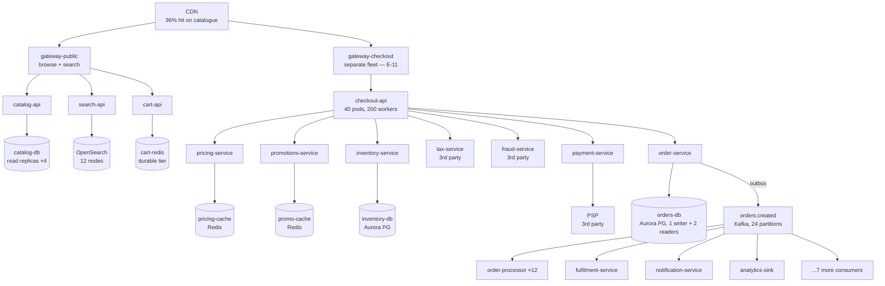

# Case Study — Riverbend, an Online Marketplace

**The defining problem: correctness under contention.**

Riverbend's failure surface is not dominated by volume. At 640 requests/s on the checkout path it
is a small fraction of the traffic Lumen or Corridor handle. What makes it hard is that **the
answers have to be right.** An inventory count that is wrong oversells. A price that is stale
charges the wrong amount, which in several jurisdictions is a legal matter, not a bug. A payment
that is taken twice is a refund, a support contact, and a chargeback. A promotion applied after
it expired is money.

And unlike a feed, **the checkout path cannot degrade the way the browse path can.** Lumen can
serve a feed with three missing items and nobody notices. Riverbend cannot sell you a product at
an approximately correct price.

So this case study is mostly about the seam between two halves of one system that need opposite
engineering: a browse path optimised for availability and throughput, and a checkout path
optimised for correctness, sharing infrastructure, sharing a team, and sharing a deployment
pipeline.

## The system

Riverbend is the running example used across
[`../K8s/cronJobs`](../K8s/cronJobs/README.md),
[`../Observability`](../Observability/README.md), and [`../Kafka`](../Kafka/README.md). Those
collections established the pieces; this one is the service graph.

**Platform.** EKS, control plane 1.29. 240 services across 38 namespaces. 412 CronJobs. Three
availability zones in one region, with a warm standby region that serves 5% of read traffic
continuously (per doc 13's `I-08` rule).

**Scale, today.**

| Path | Rate | Peak | Latency target |
|---|---|---|---|
| Catalogue reads (browse, search) | 5,000/s | 42,000/s | p50 < 80 ms, p99 < 300 ms |
| `checkout-api` requests | 640/s | 3,400/s | p50 < 200 ms, p99 < 500 ms |
| Orders created | 67/s | 350/s | p99 < 2 s end to end |
| Cart mutations | 1,900/s | 12,000/s | p99 < 200 ms |
| `orders.created` events | 640/s | 3,400/s (9.6 per order) | processed within 60 s |

**Scale, at the Amazon-shaped comparison** used throughout this doc to show what changes. From
[`../../../system-design-notes/ecommerce/ecommerce-system-design.md`](../../../system-design-notes/ecommerce/ecommerce-system-design.md):
20M orders/day (230/s average), **5,000 orders/s at flash-sale peak**, 500,000 page views/s,
**5,000,000 catalogue reads/s**.

That is a 75× step on catalogue reads and a 14× step on order writes. Section "What changes at
100×" works through which failure modes survive the jump and which are replaced.

**The services that matter for failure analysis.**



**Numbers that recur.** `orders-db`: Aurora PostgreSQL `db.r6g.4xlarge`, 16 vCPU / 128 GiB,
`max_connections` 600, ~180 in use, fronted by PgBouncer in transaction mode (per `S-09`).
`checkout-api`: 40 pods × 200 worker threads. `pricing-cache` hit rate 98.7%. Third-party PSP
p99 380 ms. Tax service p99 240 ms and a hard contractual rate limit of 500 req/s.

## The four paths, and why they need opposite designs

Doc 01's central claim, made concrete.

| | **Browse** | **Checkout** | **Fulfilment** | **Catalogue sync** |
|---|---|---|---|---|
| Path type | Read | Write | Async | Batch/stream |
| Volume | 5,000/s (42,000 peak) | 640/s (3,400 peak) | 640 events/s | 40/s |
| Hops | CDN → gateway → 1–2 services | 10 synchronous services | Kafka → 11 consumers | CronJob → index |
| **Retry on timeout?** | **Yes, freely** | **Only with an idempotency key** | Yes (consumers idempotent) | Yes |
| **Shed under load?** | **Yes** — this is the first thing to shed | **No** — a shed checkout is lost revenue | Yes (it buffers) | Yes |
| Serve stale? | Yes, with a bound (`C-08`) | **Never for price or stock** | N/A | N/A |
| Dominant POF | Cache collapse (`C-01`, `C-02`), hot key | Partial completion (`T-01`), lock contention (`L-03`), dependency depth | Silent backlog (`Q-01`), drain stampede (`Q-04`) | Overlap (`K8s/cronJobs`) |
| Availability ceiling | 99.99% (2 hard deps) | **99.0%** (10 hard deps) | N/A | N/A |
| Correct degradation | Fewer facets, no personalisation, stale prices with a displayed timestamp | Refuse cleanly with a retry token | Buffer; drop nothing | Serve the previous index |

Two things fall out of this table that drive Riverbend's whole architecture.

**First, the checkout path's availability ceiling is 99.0% from dependency depth alone** (doc 00's
`0.999^10`). That is 7 hours 18 minutes of downtime per month, and no amount of making each
service more reliable fixes it — the arithmetic is structural. The only fix is to reduce the
number of *hard* synchronous dependencies. Riverbend's programme to do that is the single
highest-value reliability work it has done, and it is covered in "Reducing the checkout path"
below.

**Second, the two paths must not share a fate**, which is why they have separate gateway fleets
(`E-11`), separate node pools (`N-10`), separate Redis clusters, and separate deploy pipelines.
The browse path is 87% of requests and 0% of revenue; the checkout path is the reverse. Sharing
infrastructure between them means a browse-path incident stops sales.

## The POF map

Every class from this collection, located in Riverbend, with the specific instance.

| Class | Where it lives at Riverbend | Severity |
|---|---|---|
| `E` Edge | CDN cache key on catalogue URLs (`E-06`); one gateway fleet per path; ALB health checks on `checkout-api` doing a deep DB check (`E-09` case b) | High |
| `R` Sync RPC | 10 hops on checkout; the PSP's 380 ms p99 with a 20 s configured timeout (`R-02`); no deadline propagation until 2026 | **Critical** |
| `P` Patterns | No bulkhead on `promotions` for two years — the cause of `RB-1` | **Critical** |
| `F` Feedback | Retry amplification across gateway → checkout → pricing: `3^3 = 27×` | **Critical** |
| `D` Discovery | Kubernetes-native; the risk is endpoint propagation lag at 240 services (`D-03`) | Medium |
| `S` Storage | `orders` partitioned by `created_date` — the hot-partition problem (`S-01`, `S-02`); `inventory` row contention | **Critical** |
| `T` Transactions | Order write + Kafka publish: outbox, correctly implemented; the checkout saga across 5 services | **Critical** |
| `C` Cache | `pricing-cache` at 98.7% — load-bearing (`C-04`); the price-staleness contract (`C-09`) | **Critical** |
| `Q` Async | 11 consumers on `orders.created`, 35× amplification (`Q-11`); the DLQ | High |
| `L` Locks | Inventory reservation; `invoice-rollup` singleton | High |
| `G` Change | Promotions config, pricing rules, feature flags — all changeable without a deploy | **Critical** |
| `N` Capacity | Flash-sale peak is 5.3× steady; autoscaling cannot cover it | High |
| `I` Isolation | No cells. One region + warm standby. Tenant isolation for sellers is logical only | Medium |

The four **critical** ones are the ones that have produced incidents, and the next five sections
are those incidents.

## RB-1 · The promotions configuration push

**What happened.** Tuesday 14:02. Checkout success rate fell from 99.95% to 71%, then to 12% at
14:20. It recovered to 99.9% at 14:41, ninety seconds after someone disabled `promotions-service`
entirely. Total: 39 minutes, roughly 156,000 failed checkouts, an estimated £1.1M of deferred or
lost revenue.

**The chain**, walked with the arithmetic. (Doc 00 uses an abbreviated version of this; here it
is in full.)

**14:01 — the trigger (`G-03`).** A merchandiser published a new promotion through the campaign
admin UI. Valid configuration, schema-checked, approved by a category manager. No code deploy, no
engineer involved, no change-management record, live in 30 seconds across all 40 pods.

The campaign's eligibility rule was new: *"20% off for customers whose lifetime order count is
above 12 and who have not used a promotion in 90 days."* Previous campaigns had segment-level
eligibility — a customer's segment is computed nightly and cached in aggregate. This one required
a **per-customer** lookup.

**14:02 — the cache collapse (`C-11`, then `C-01`).** `promo-cache` keys had been of the form
`promo:eligibility:{campaign_id}:{segment_id}` — a few hundred distinct keys, 94% hit rate, 180
origin queries/s. The new rule's key became
`promo:eligibility:{campaign_id}:{customer_id}`.

```
Distinct keys before:  ~400
Distinct keys after:   ~2.8 million (one per active customer)
Hit rate:              94% → 6%
Origin queries:        180/s → 640 req/s × 0.94 × 4.7 promo-checks per checkout ≈ 2,800/s
```

A 15.6× increase in load on the promotions database, produced by a configuration change whose
diff was eleven lines of JSON.

**14:03 — the pool saturates (`R-09`).** `promotions-db` had a pool of 60 connections; the
eligibility query averaged 22 ms.

```
Pool capacity = 60 / 0.022 = 2,727 queries/s
Offered:        2,800 queries/s
```

Two point seven percent over capacity. Queries began queueing on the pool. Acquire time went from
0.4 ms to 1,100 ms; total promotions latency went from 30 ms to the client timeout.

**14:04 — the timeout is not a budget (`R-03`).** `checkout-api` called `promotions` with a
**2-second** timeout — a round number set in 2021 against a p99 of 88 ms, so 23× too high. Every
checkout now spent up to 2 seconds in promotions.

**14:05 — no bulkhead (`P-05`).** `checkout-api` had one shared worker pool of 200 threads across
all nine downstream calls. Little's law:

```
Before: L = 640 req/s × 0.310 s = 198 threads  (already at the edge of 200)
After:  L = 640 req/s × 2.310 s = 1,478 threads needed
Available: 200
Effective throughput = 200 / 2.310 = 87 req/s
```

Checkout throughput fell from 640/s to 87/s — a 86% drop — **including for the 71% of customers
with no eligible promotion at all**, because the threads were the shared resource.

**14:06 — retry amplification (`R-05`, `F-01`).** Three layers each retried 3 times: mobile client
→ gateway → checkout → promotions. Offered load on the already-saturated promotions database
became `2,800 × 3^2 = 25,200 queries/s`, against a capacity of 2,727. Nine times over.

**14:20 — metastability (`F-04`).** At 12% success, the system was generating enough of its own
load to remain saturated regardless of user traffic. Reducing incoming traffic (an
inadvertent test, when the mobile app's own circuit breaker opened for some users) produced no
improvement, because the backlog of retries filled the gap. **This is why it did not recover
between 14:20 and 14:41 even though nothing further changed.**

**14:41 — the exit.** An engineer set `promotions.enabled=false` in the feature-flag service.
`checkout-api`'s promotions call became a no-op. Threads released. Full recovery in 90 seconds.

**What made this a 39-minute outage rather than a 3-minute one.** Three things, in order of
contribution:

1. **No bulkhead.** With a 10-permit semaphore on promotions, the blast radius would have been
   "no discounts applied", not "no checkouts". This is the single fix that would have prevented
   the incident entirely.
2. **A 2-second timeout on a soft dependency with an 88 ms p99.** At 250 ms the throughput drop
   would have been 640 → 358 req/s, uncomfortable rather than fatal.
3. **No deploy-style process for configuration.** A 1% staged rollout with a health gate would
   have caught it at 14:01:30 with a blast radius of 1%.

**What was fixed.**

- Semaphore bulkheads on all nine `checkout-api` dependencies, sized from `λ × W` at p99, with
  criticality classes: `payment`/`inventory`/`order` critical (generous), `promotions`/
  `recommendations`/`loyalty` optional (10 permits, acquire timeout 0).
- Timeouts re-derived from measured p99 across all dependencies; a CI check that fails the build
  if any configured timeout exceeds 5× the dependency's measured p99.
- Deadline propagation via `X-Request-Deadline`, enforced in the shared client library.
- Retry budget of 10% per dependency, single-layer retry at the gateway only.
- **Promotion configuration moved into the same pipeline as code**: version control, a semantic
  validation step that estimates cache-key cardinality for the proposed rule, and a 1% → 25% →
  100% staged rollout with automatic rollback on checkout success-rate regression.
- A `promo_cache_distinct_keys` metric with an alert on a 10× increase in an hour.

## RB-2 · Oversell during a flash sale

**What happened.** A flash sale on a single SKU with 500 units in stock sold 847. 347 orders had
to be cancelled, refunded, and apologised for.

**Mechanism (`T-11` lost update, `L-03` contention, `S-01` hot row).** The original inventory
check was a read-modify-write with no concurrency control:

```python
stock = db.query("SELECT available FROM inventory WHERE sku = %s", sku)
if stock >= qty:
    db.execute("UPDATE inventory SET available = available - %s WHERE sku = %s", qty, sku)
```

At `READ COMMITTED`, two concurrent transactions both read `available = 1` and both decrement it.
The database did exactly what it was asked.

The reason it produced 347 oversells rather than 3: at the flash-sale peak, roughly 1,200
concurrent checkout attempts targeted the same SKU. Every one of them read a stale value within
the same few-millisecond window.

**Why the first fix failed.** The team's first attempt was `SELECT ... FOR UPDATE`, which is
correct and serialises:

```
Lock hold time (read, check, update, commit, plus the network hop to the app): 45 ms
Maximum throughput on one SKU: 1 / 0.045 = 22 reservations/s
```

Twenty-two per second, against 1,200 concurrent attempts. Correct and unusable: no oversell, and
the sale took 23 seconds per 500 units while every other request queued, and the queueing blew
out `checkout-api`'s worker pool exactly as in `RB-1`.

**The design that worked.** Three changes together:

1. **A conditional update with no read** — atomic, no lock held across a read, and it returns
   whether it succeeded:

```sql
UPDATE inventory
   SET available = available - $qty
 WHERE sku = $sku AND available >= $qty
RETURNING available;
-- Zero rows = insufficient stock. One row = reserved. No race.
```

   Hold time drops to a single statement, roughly 3 ms, so throughput on one SKU rises to
   ~330/s. That is enough for most SKUs and not for a flash sale.

2. **Stock splitting for hot SKUs** (`S-01`'s add-entropy technique). A SKU's 500 units are
   split across 20 rows of 25:

```sql
UPDATE inventory_shard
   SET available = available - $qty
 WHERE sku = $sku AND shard = $random_shard AND available >= $qty
RETURNING available;
```

   Contention on any one row drops 20×, so aggregate throughput becomes ~6,600/s. If the chosen
   shard is empty, try another (up to 3 attempts, then fall through to a scan of shards with
   stock). The cost is that the last few units are hard to find — acceptable, and handled by the
   fallback scan.

3. **A reservation with an expiry, not a decrement** (`T-07`). Checkout reserves; payment
   confirms; an unconfirmed reservation expires in 15 minutes and is checked on read so
   correctness does not depend on the sweeper:

```sql
-- availability, always computed with expiry applied
SELECT sum(available) FROM inventory_shard WHERE sku = $1;
-- reservations that have expired are reclaimed by a sweeper AND ignored by readers
```

**The trade that was accepted.** Riverbend deliberately allows a **small oversell risk on the
final units** in exchange for not serialising. The sharded design can, in a narrow window,
reserve one or two units more than exist across shard boundaries during a rebalance. The business
decision: a 0.02% oversell rate that produces an apologetic email is cheaper than a 22/s ceiling
that produces a failed sale. **That decision is written down**, which is the point — the earlier
version had the same risk and nobody had decided it.

## RB-3 · The price that was stale in three places

**What happened.** A pricing correction moved a product from £249 to £189. For 47 minutes, some
customers saw £249, some saw £189, and — the serious part — **some saw £189 and were charged
£249**, because the display path and the charge path read different sources.

Roughly 2,100 customers were affected. The remediation was to honour the lower price, refund the
difference, and publish a notice.

**Mechanism.** Price existed in five places with five staleness semantics — the core point of
[`../../../system-design-notes/ecommerce/stalePricingCache.md`](../../../system-design-notes/ecommerce/stalePricingCache.md):

| Layer | TTL | Invalidated on price change? |
|---|---|---|
| CDN (product page HTML) | 300 s | No — TTL only |
| `catalog-api` local in-process cache | 60 s | No |
| `pricing-cache` (Redis) | 600 s | Yes, by an event consumer |
| `catalog-db` read replica | — | Replication lag, p99 80 ms |
| `pricing-db` primary | — | Source of truth |

The invalidation consumer cleared `pricing-cache` correctly. Nothing cleared the CDN or the
in-process caches, so for up to 300 seconds the product page showed the old price while checkout
— which read `pricing-cache` — used the new one. And in the reverse direction, when the price
went *up* later, customers saw the old lower price and were charged the new higher one.

**The fix, which is a contract rather than a cache change.** The insight from the reference note:
the question is not "how do I invalidate every layer" — you cannot, reliably — but **"what is the
binding contract between the displayed price and the charged price?"**

Riverbend's answer:

1. **Every displayed price carries a signed price token**: `(sku, price, currency, valid_until,
   signature)`, valid for 30 minutes. The token is generated by `pricing-service` and travels
   with the item into the cart.
2. **Checkout charges the token's price**, not a freshly-read price, provided the token is
   valid, signed, and unexpired. **The displayed price is the charged price, always.** That
   eliminates the class of failure entirely.
3. **If the token has expired**, checkout re-prices and — if the price changed — shows an explicit
   "the price of this item changed from £249 to £189" interstitial requiring confirmation. That
   is an honest UX for a real situation, and it converts a silent wrong charge into a visible,
   correct interaction.
4. **A price-change ceiling**: if the token's price is more than 30% below the current price, the
   token is rejected regardless of validity, to bound the exposure from a pricing error or a
   forged token. That case shows the interstitial.
5. **Price changes are scheduled, not immediate.** A change takes effect at a stated future time
   (at minimum, now + the longest TTL in the stack, 300 s), and all layers are warmed with the new
   value before the effective moment. This turns a race into a scheduled transition.

The remaining staleness — some customers briefly see an old price on a product page — is now a
**display** inconsistency with a bounded window and no financial consequence, which is a category
of problem Riverbend can live with and had to name explicitly in order to stop trying to solve
it perfectly.

## RB-4 · The double charge nobody's metrics saw

**What happened.** Discovered by a finance reconciliation five weeks after it began: 1,847
customers charged twice for one order, spread over six weeks, at roughly 44 per day.

**Mechanism (`R-02` nested timeouts, `T-01` dual write).** Three configuration values that were
each individually defensible:

```
gateway → checkout-api        timeout: 10 s
checkout-api → payment-service timeout: 20 s
payment-service → PSP          timeout: 25 s
```

The gateway gave up at 10 seconds and returned a 502. The mobile client, seeing a 502, retried
(correctly — 502 is retryable per doc 02's table). Meanwhile `payment-service` was still waiting
on the PSP, which completed successfully at 14 seconds and charged the card.

The retry created a second order, with a second payment, which also succeeded.

**Why nothing detected it for five weeks.** Every component reported success or a legitimate
error:

- The gateway logged a 502 — expected under a slow downstream.
- `checkout-api` logged a timeout — expected.
- `payment-service` logged a **successful charge** — expected.
- The client retried — correct behaviour.
- Error-rate dashboards showed a small elevation in 502s during PSP slowness, which was already
  a known and accepted condition.

**There was no metric anywhere whose value was wrong.** This is doc 14's row `T`: the only
detector is reconciliation, and Riverbend did not have one on this pair.

**The fix.**

1. **Idempotency keys** generated by the client, once per checkout attempt, carried through
   `checkout-api` → `payment-service` → the PSP (which supports them). A retry with the same key
   returns the original charge rather than creating a new one. The five details from `T-05` all
   applied: client-generated outside the retry loop, scoped per customer, inserted atomically
   before processing, 409 while in progress, response stored in the same transaction as the
   effect.
2. **Deadline propagation** so that `payment-service` never has a longer budget than its caller.
   With `X-Request-Deadline` honoured, `payment-service` would have abandoned the PSP call at the
   9.8-second mark and — critically — would have recorded the attempt as `UNKNOWN`, not as
   `FAILED`.
3. **A `PENDING`/`UNKNOWN` state in the payment state machine.** A charge whose outcome is unknown
   is not "failed"; it is unknown, and it is resolved by querying the PSP for that idempotency key
   rather than by assuming. This is doc 00's rule: make the uncertainty explicit rather than
   designing as if you could know.
4. **Reconciliation, every 5 minutes**, between orders and charges, with automatic refund of
   orphaned charges below a threshold and a page above it:

```sql
-- Charges with no corresponding order: auto-refund below £50, page above
SELECT c.charge_id, c.amount, c.created_at
FROM payment_charges c
LEFT JOIN orders o ON o.idempotency_key = c.idempotency_key
WHERE o.order_id IS NULL
  AND c.status = 'SUCCEEDED'
  AND c.created_at < now() - interval '5 minutes';

-- And the reverse: orders with no charge
SELECT o.order_id FROM orders o
LEFT JOIN payment_charges c ON c.idempotency_key = o.idempotency_key
WHERE c.charge_id IS NULL AND o.status = 'PAID'
  AND o.created_at < now() - interval '5 minutes';
```

The second query is the one that finds the more expensive failure: goods shipped and not paid
for.

## RB-5 · The consumer that stopped on a Saturday

**What happened.** `fulfilment-service`, one of eleven consumers of `orders.created`, stopped
processing at 02:14 on a Saturday and resumed at 13:20 on Sunday — **35 hours**. 84,000 orders
were paid for and not sent to the warehouse. Discovered by a customer-service escalation, not by
monitoring.

**Mechanism (`Q-01` silent backlog, then `Q-05` poison message).** An order containing a product
with a 4,200-character gift message hit a downstream warehouse API's 4,000-character field limit.
The API returned 400. The consumer's error handling retried — because the retry policy retried
all non-2xx — and the offset was never committed.

The consumer was in a tight retry loop on one message. Its CPU was low, its pods were `Running`,
its readiness probe passed, and its error rate — as measured by the request-serving metrics the
team had — was zero, because it served no requests.

Head-of-line blocking meant only partition 7 was stuck. The other 23 partitions kept flowing, so
**96% of orders were fulfilled normally**, which is why nobody noticed sooner and why the eventual
symptom (some orders not shipping) looked like a warehouse problem rather than a pipeline one.

**The fix.**

1. **Age-of-oldest-message alerting** on every consumer group, paging at 5 minutes for
   `orders.created`. This is the alert that would have caught it in 5 minutes instead of 35 hours.
2. **Error classification**: a 4xx from the warehouse API is permanent. It goes to the DLQ on the
   first attempt, not after infinite retries. Only 5xx and timeouts are retried.
3. **Bounded retries** (3 attempts with backoff) then DLQ, for everything.
4. **DLQ depth alerting at > 0.**
5. **Input validation at the producer**: `checkout-api` now rejects a gift message over 4,000
   characters at the point of entry, with a clear message to the customer, rather than accepting
   it and discovering the constraint four services downstream. This is the general lesson —
   **validate at the boundary where the constraint can be explained to whoever can fix it.**
6. **A per-partition progress metric**, so a single stuck partition is visible rather than hidden
   in a group-level average.

## Reducing the checkout path: the 99.0% problem

Riverbend's most valuable reliability work was not any of the incident fixes. It was reducing the
number of hard synchronous dependencies in checkout from ten to four.

**The original ten**, with the classification exercise:

| Dependency | Was | Should be | How |
|---|---|---|---|
| `auth` | Hard | **Hard** | Unavoidable. But: validate the JWT locally with cached JWKS, so the *service* is not called (`E-12`). Now it is a hard dependency on a key refresh, which is fail-static. |
| `cart` | Hard | **Hard** | The order's contents. Unavoidable. |
| `pricing` | Hard | **Soft** | The price token (`RB-3`) is already in the cart. Checkout validates the signature locally — no call. |
| `promotions` | Hard | **Soft** | Bulkheaded, 10 permits, acquire timeout 0, fallback: no discount. |
| `inventory` | Hard | **Hard** | Overselling is a correctness failure. Must be synchronous. |
| `tax` | Hard | **Soft** | Cache tax rates per jurisdiction with a 24-hour TTL; the rates change rarely and are published in advance. Fall back to the cached rate; if the cache is empty, fall back to the highest rate in the jurisdiction and refund the difference. |
| `fraud` | Hard | **Conditional** | Hard above £250, soft below. Below the threshold, a failed fraud check means "accept and review asynchronously". This is doc 00's per-request posture. |
| `payment` | Hard | **Hard** | Unavoidable. |
| `order` | Hard | **Hard** | The write itself. |
| `loyalty` | Hard | **Removed** | Moved entirely to an `orders.created` consumer. Points are awarded within 60 seconds instead of synchronously, which no customer has ever noticed. |

**The arithmetic, before and after:**

```
Before: 10 hard dependencies at 99.9% each
        0.999^10 = 0.99004  →  99.0%,  7h 18m/month

After:  4 hard dependencies (auth-as-local-validation, cart, inventory, payment, order
        — payment and order are 2 of the 4 plus cart and inventory; auth is now local)
        0.999^5 = 0.99501   →  99.5%,  3h 39m/month
        ...and the soft ones now degrade instead of failing.
```

Then the second-order effect, which is larger: with bulkheads, the soft dependencies cannot
consume checkout's concurrency, so a soft-dependency failure costs a feature rather than the
path. The measured availability went from 99.0% to 99.87% over two quarters, and **no individual
service's reliability improved.**

That is the lesson worth generalising: **the cheapest reliability work in a microservice
architecture is usually reclassifying dependencies, not hardening services.**

## What changes at 100×

The Amazon-shaped comparison: 5,000,000 catalogue reads/s and 5,000 orders/s. Which of
Riverbend's failure modes survive, and which are replaced?

| Concern | At Riverbend scale | At 100× | Verdict |
|---|---|---|---|
| **CDN hit rate** | 96%, origin sees 200/s | 96%, origin sees **200,000/s** | Same failure, far worse consequence. Origin must be able to serve cold, or a hit-rate event is unsurvivable. Requires multi-tier caching with an origin shield. |
| **Checkout path depth** | 99.0% ceiling | Identical — depth does not scale with volume | **Same.** This is why the dependency-reduction work matters most; it is scale-independent. |
| **Orders table partitioning** | `created_date` partitioning is a hot partition (`S-02`) | At 5,000 writes/s it is **fatal** — one partition, one WAL stream, one index right edge | **Replaced.** Must shard by `hash(order_id)` with a secondary time dimension. See [`hotPartition.md`](../../../system-design-notes/ecommerce/hotPartition.md). |
| **`orders-db` as one Aurora cluster** | 16 vCPU handles 350 writes/s peak | 5,000 writes/s exceeds any single primary | **Replaced.** Horizontal sharding by customer or order ID, with a lookup table (`S-04`). |
| **Inventory row contention** | 20 shards per SKU gives 6,600/s | A flash sale at 5,000 orders/s on one SKU needs more | **Same technique, more shards.** 200 shards per hot SKU, plus a queue-per-SKU for the extreme case (Gateline's approach, doc 18). |
| **Cart in Redis** | 10M carts, 50,000 updates/s | Same order of magnitude — carts do not scale with orders as steeply | **Same.** See [`cartUpdates.md`](../../../system-design-notes/ecommerce/cartUpdates.md). |
| **Kafka `orders.created`** | 24 partitions, 3,400 events/s peak | 5,000 orders/s × 9.6 = **48,000 events/s** | **Same design, more partitions** (256+) and more brokers. The 35× consumer amplification (`Q-11`) becomes 1.7M deliveries/s, which requires pruning consumers. |
| **No cells** | Acceptable; blast radius is one region | **Unacceptable.** A single bad deploy affects 20M orders/day | **Replaced.** Cells become mandatory somewhere around 10× — the blast radius of a total outage crosses the threshold where isolation pays for itself. |
| **Retry amplification `3^3`** | 27× on a small base | 27× on 5,000 orders/s is 135,000/s of retries | **Same mechanism, must be fixed first.** Retry budgets become non-optional rather than good practice. |
| **Autoscaling for flash sales** | 5.3× step, ~3.5 min to scale | 100× step in seconds | **Replaced.** Pre-scaling on a schedule plus a virtual waiting room (doc 18). |

The pattern across that table: **failures of *depth* (dependency chains, retry multipliers,
correctness contracts) are scale-invariant and must be fixed regardless. Failures of *volume*
(partitioning, sharding, cell isolation) are the ones that change.** A team preparing for 10×
should fix the first category first, because the second category's fixes are expensive and the
first category's are not.

## Stack choices and their POF profile

| Concern | Riverbend's choice | POF it buys | POF it creates | Alternative considered |
|---|---|---|---|---|
| Orders store | Aurora PostgreSQL | ACID within an order; joins; mature operations | Single-writer ceiling; hot partition; failover lost-write window | DynamoDB — removes the write ceiling, removes joins, makes the saga harder |
| Inventory store | PostgreSQL with sharded rows | Atomic conditional decrements | Row contention on hot SKUs | Redis with Lua — faster, and a durability question you must answer (`C-14`) |
| Cart store | Redis with AOF, separate "data" cluster | Fast, expiring, high write rate | Durability on failover; `C-14` risk if not separated | PostgreSQL — durable, and 50,000 writes/s of mostly-disposable data is expensive |
| Catalogue | PostgreSQL + OpenSearch + CDN | Rich queries; fast search; cheap reads | Three copies, three staleness semantics (`RB-3`) | Search-only — loses transactional catalogue edits |
| Events | Kafka | Durable fan-out; replay; ordering per key | Partition-count ceiling on consumer parallelism; operational weight | SNS/SQS — simpler, no replay, no ordering |
| Sync RPC | gRPC internally, REST at the edge | Deadlines native; efficient; typed | HTTP/2 defeats L4 balancing (`R-11`) | REST everywhere — simpler, no native deadlines |
| Discovery | Kubernetes-native | Nothing extra to run | Endpoint propagation lag (`D-03`) | A mesh — better balancing and fault injection, one more control plane (doc 21) |
| Payment | A third-party PSP | Compliance, fraud, coverage | An external hard dependency with its own availability | Two PSPs with failover — real resilience, and doubles the reconciliation work |
| Saga | Orchestrated, durable state in `orders-db` | Queryable process state; compensation in one place | The orchestrator is on the path | Temporal — better, and another platform to run (doc 22) |

The two choices Riverbend would revisit: **the orders partitioning scheme** (chosen for analytics
read patterns and wrong for writes, which is exactly the trap in
[`hotPartition.md`](../../../system-design-notes/ecommerce/hotPartition.md)), and **the decision not
to adopt cells**, which is defensible today and will not be at 10×, and which is far cheaper to
adopt before the system is large.

## What to take away

1. **Riverbend's hardest problem is correctness, not volume.** The checkout path cannot degrade
   the way the browse path can, and building both on shared infrastructure means a browse
   incident stops sales. Separate gateways, node pools, caches, and pipelines.
2. **The checkout path's 99.0% ceiling comes from having ten hard synchronous dependencies**, and
   no amount of hardening individual services fixes it. Reclassifying six of them to soft or
   asynchronous moved measured availability from 99.0% to 99.87% with no service becoming more
   reliable.
3. **`RB-1` was one missing bulkhead.** A 10-permit semaphore on an optional dependency would have
   turned a 39-minute, £1.1M outage into a missing discount.
4. **Configuration changed by non-engineers, live in 30 seconds, with no staged rollout, is the
   highest-risk change channel most commerce systems have.** It needs the code pipeline.
5. **A cache-key cardinality change is a load change.** Eleven lines of JSON produced a 15.6×
   increase in database load. Alert on distinct-key growth per pattern.
6. **`SELECT ... FOR UPDATE` on inventory is correct and caps you at 22 reservations/s.** The
   working design is a conditional update with no read, plus row-level stock splitting, plus
   expiring reservations — and an explicitly written, deliberately accepted small oversell risk on
   the final units.
7. **The price contract, not the cache, is the fix for price staleness.** A signed price token
   makes the displayed price the charged price by construction, and turns the residual
   inconsistency into a harmless display issue you can stop trying to solve.
8. **`RB-4` ran for five weeks with every metric reporting correctly**, because both sides
   succeeded and they disagreed. Reconciliation is the only detector for that class, and the
   more expensive direction is orders with no charge, not charges with no order.
9. **A consumer stopped for 35 hours with zero errors, zero CPU, and passing probes.** Age of
   oldest unprocessed message is the only alert that would have caught it, and per-partition
   progress is needed because a group-level average hides one stuck partition out of 24.
10. **Validate at the boundary where the constraint can be explained.** A 4,000-character limit
    enforced four services downstream becomes a poison message; enforced at the form, it becomes
    a helpful error.
11. **Failures of depth are scale-invariant; failures of volume are not.** Dependency chains,
    retry multipliers, and correctness contracts must be fixed at any size. Partitioning,
    sharding, and cells are what change at 100×. Fix the first category first — it is cheaper and
    it does not get easier later.

Next: [17-case-social-feed-lumen.md](17-case-social-feed-lumen.md), where the volume is 1,000×
higher, the correctness requirements are far weaker, and the whole failure surface is therefore
completely different.
