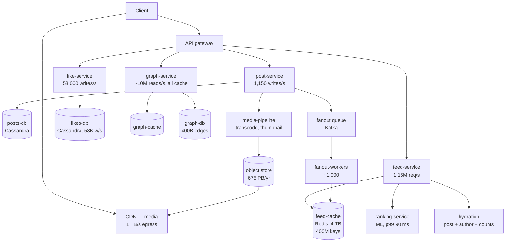

# Case Study — Lumen, Photo and Video Sharing at 500M Daily Users

**The defining problem: fan-out amplification.**

Riverbend's problem was that answers must be right. Lumen's is almost the opposite: **almost
nothing needs to be exactly right, and the volume is so large that any per-user work is
multiplied by hundreds of millions.**

A Lumen feed can omit three posts, show a like count that is nine seconds stale, or rank
imperfectly, and no user will ever know. That freedom is what makes 1.15 million feed reads per
second affordable. What is *not* affordable is the amplification: one action by one user causing
work proportional to that user's follower count. A single post by an account with 400 million
followers is, structurally, a self-inflicted denial-of-service attack that the system must
absorb on schedule, several times a day.

So every interesting failure at Lumen is a variation on: **something that is cheap per user
became expensive because it was multiplied by a very large number.**

## The system

From [`../../../system-design-notes/instagramHLD.md`](../../../system-design-notes/instagramHLD.md).

**Scale.**

| | Value | Derived |
|---|---|---|
| Monthly active users | 2 billion | |
| Daily active users | 500 million | |
| Peak concurrent | ~50 million | |
| Posts/day | 100 million | **1,150 writes/s** |
| Stories/day | 500 million | 5,800/s |
| Likes/day | ~5 billion | **58,000 writes/s** |
| Comments/day | ~500 million | 5,800/s |
| Feed reads | 500M DAU × 10 sessions × 20 posts | **1.15M reads/s average** |
| Peak feed reads | 2–3× average | **3–5M reads/s** |
| Follow edges | 2B users × ~200 following | **400 billion edges** |
| Peak egress | 5M QPS × 200 KB | **1 TB/s** |
| Media stored | | 675 PB/year |
| Latency target | Feed p50 < 200 ms, p99 < 500 ms | |

**The read/write ratio is the whole story:**

```
1,150,000 reads/s ÷ 1,150 writes/s = 1,000 : 1
```

A thousand reads per write. Every design decision follows from that ratio: it is worth doing an
enormous amount of work at write time to make reads cheap, **except** when the write is by
someone with 400 million followers, at which point the arithmetic inverts.

**The services.**



## The fan-out decision, and why both answers are wrong

This is the architectural choice that determines Lumen's entire failure surface, so it is worth
deriving rather than asserting.

**Option A — fan-out on write (push).** When a user posts, write the post ID into every
follower's precomputed feed list.

Read cost: one Redis `LRANGE`. Roughly 1 ms. Perfect for a 1000:1 read/write ratio.

Write cost: proportional to follower count.

```
Median user: 200 followers  → 200 Redis writes per post. Trivial.
Average across all posts:    ~200 writes × 1,150 posts/s = 230,000 Redis writes/s. Fine.
An account with 400M followers: 400,000,000 Redis writes for ONE post.
```

At 100,000 Redis writes/s per fan-out worker:

```
400,000,000 / 100,000 = 4,000 seconds = 66 minutes for one post
```

Spread across 1,000 workers, with each doing 100,000 writes/s, it is 4 seconds of the entire
fan-out fleet doing nothing else. Which is survivable once and not survivable when three
celebrities post within a minute of each other, which happens daily.

And the waste is enormous. Only about 40% of DAU opens the app on any given day, so:

```
60% of every fan-out write is into a feed nobody will read before it is evicted.
Of the 400M writes, roughly 240M are pure waste.
```

Plus the storage:

```
500M DAU × 1,000 post IDs cached per feed × 8 bytes = 4 TB of Redis, continuously
```

**Option B — fan-out on read (pull).** Store the post once. When a user loads their feed, fetch
recent posts from each of the ~200 accounts they follow and merge.

Write cost: one write. Perfect for celebrities.

Read cost: 200 lookups, merged and ranked, per feed load.

```
1.15M feed loads/s × 200 author lookups = 230 million lookups/s
```

Two hundred and thirty million lookups per second is not a number you engineer around; it is a
number that tells you the design is wrong. And the tail is worse: with 200 lookups, the chance
that all of them hit cache at a 99% hit rate is `0.99^200 = 13%` — so **87% of feed loads hit at
least one cache miss** and pay a database round trip (doc 06's `S-03` scatter-gather arithmetic).

**The resolution — hybrid, with a threshold.** Push for normal accounts, pull for large ones:

```
if follower_count < 100,000:
    fan out on write      # 99.99% of accounts; cheap, and reads stay 1 ms
else:
    do not fan out        # ~10,000 accounts; readers pull at read time
```

A feed load then becomes: read the precomputed list (1 Redis call) **plus** pull from the handful
of large accounts this user follows (typically 0–5, each a single heavily-cached lookup), then
merge and rank.

The cost is complexity — two code paths, a merge, and an account whose follower count crosses the
threshold has to be migrated — and it is the only design that works. **Both pure options fail at
the extremes, and the extremes are where the traffic is.**

## The POF map

| Class | Where it lives at Lumen | Severity |
|---|---|---|
| `E` Edge | 1 TB/s of media egress through the CDN; a hit-rate change is a bandwidth event | High |
| `R` Sync RPC | Feed hydration fans out to 20+ services per load; tail latency dominates (`S-03`) | **Critical** |
| `P` Patterns | Everything on the feed path must be soft — the feed renders with whatever arrived in time | High |
| `F` Feedback | Push-notification thundering herds; cache stampedes at 167K reads/s on one key | **Critical** |
| `D` Discovery | Thousands of instances per service; endpoint churn is continuous | Medium |
| `S` Storage | Celebrity partitions in the graph and the likes table (`S-01`); 400B edges | **Critical** |
| `T` Transactions | Very few. A like is not transactional. This class is nearly absent, which is the point | Low |
| `C` Cache | 4 TB feed cache; 167K reads/s on hot keys; a cold feed cache is unrecoverable in under 2 hours | **Critical** |
| `Q` Async | The fan-out queue is the system's backbone; a backlog is invisible to users until it is 10 minutes deep | **Critical** |
| `L` Locks | Almost none. Counters use sharded increments, not locks | Low |
| `G` Change | A ranking-model change alters load characteristics across the whole fleet | High |
| `N` Capacity | Diurnal peak is 3×, and predictable; event-driven peaks are not | High |
| `I` Isolation | Cells by user ID; media is global | Medium |

Compare this to Riverbend's map. **`T` and `L` are near-absent at Lumen and critical at
Riverbend; `C` and `Q` are critical at both but for opposite reasons** (Riverbend's cache
failures are correctness issues, Lumen's are capacity issues). That contrast is the most useful
thing in this doc: the same thirteen classes, weighted completely differently by what the system
does.

## LM-1 · The celebrity post that ate the fan-out fleet

**What happened.** An account with 310 million followers posted at 19:04 on a Friday — peak
traffic. Because of a bug in the threshold logic, the account was classified as a normal account
and fan-out-on-write was triggered. Feed delivery latency for **all** users went from a p99 of 8
seconds to 41 minutes. It took 71 minutes to drain.

**Mechanism.** A configuration change three days earlier had changed the follower-count threshold
from a hardcoded 100,000 to a value read from a config service. The config service returned the
value in a different unit — 100,000 was interpreted as 100,000,000 — so accounts up to 100M
followers were fanned out on write, and the code's `>` comparison let a 310M-follower account
through a stale cached follower count of 94M that had not been refreshed.

Two bugs, and neither would have mattered alone.

**The arithmetic of the backlog.**

```
310,000,000 fan-out writes enqueued as work items
Fan-out fleet capacity: 1,000 workers × 100,000 Redis writes/s = 100,000,000 writes/s
Time for this post alone: 310M / 100M = 3.1 seconds of the ENTIRE fleet

But the fleet also has normal work: 1,150 posts/s × 200 followers = 230,000 writes/s
And the queue is FIFO, so the 310M items are ahead of everything else.
```

Three seconds of total fleet occupancy sounds survivable. What made it 71 minutes:

1. **The work was not evenly distributed.** The 310M writes hashed to feed-cache shards
   proportionally to where followers lived, and the top shards received 40× their normal write
   rate. Those shards saturated at roughly 15% of the nominal fleet throughput, so effective
   capacity was 15,000,000 writes/s, not 100,000,000. That alone takes 3.1 seconds to 20 seconds.
2. **Redis write saturation caused timeouts, which caused retries** (`F-01`), tripling the
   offered write load against saturated shards.
3. **The queue was FIFO**, so every normal post published in the following minutes queued behind
   the backlog (`Q-05`'s head-of-line blocking, without a poison message). By the time the
   celebrity work drained, 71 minutes of normal fan-out had accumulated behind it.

**The fixes.**

1. **The threshold check moved to a hard-coded ceiling in addition to the configured value.**
   `min(configured_threshold, 1_000_000)`. A configuration error can lower the threshold, never
   raise it above a value the fleet can survive. **This is the general pattern: config may make
   a system more conservative, never less.**
2. **Follower count read from the source at fan-out decision time**, not from a cache. The
   decision is made 1,150 times/s, so one uncached read is affordable; getting it wrong is not.
3. **Separate queues by fan-out size.** Small (< 10k followers), medium, and large each get their
   own queue and their own worker pool. A large fan-out can no longer block a small one. This is
   bulkheading (doc 03, `P-05`) applied to a queue, and it is the structural fix.
4. **Rate-limit per fan-out job.** A single post's fan-out is capped at 5% of fleet throughput,
   so one post can never occupy the fleet regardless of follower count. It takes longer; it does
   not take everything.
5. **Priority: users who are currently online first.** Since only ~40% of DAU will open the app
   today anyway, fan out to *active* sessions first and to everyone else lazily. This turns a
   400M-write job into a 15M-write job for the part that matters, with the rest done at leisure
   or not at all.

That last one is worth generalising: **when 60% of the work is provably wasted, the best
optimisation is not to do it faster.**

## LM-2 · The cache stampede on one key

**What happened.** A celebrity's post-timeline cache entry expired during peak traffic. 133,000
concurrent identical database queries hit one Cassandra partition. The partition's replica set
saturated; the query took 14 seconds instead of 800 ms; more requests piled in. The key stayed
uncached for 6 minutes, during which the affected account's profile was unloadable and the
Cassandra nodes holding that partition were unusable for anything else.

**Mechanism.** Doc 08's `C-01`, with Lumen's real numbers. From the reference notes: a celebrity
post timeline receives **50 million reads in 5 minutes = 167,000 reads/s.**

```
Recompute time: 800 ms
Requests arriving during recompute: 167,000 × 0.8 = 133,600
All find an empty cache. All issue the same query.
```

**Why the standard fixes were each insufficient alone.**

- **Per-process single-flight** reduced 133,600 to the number of feed-service instances — but
  Lumen runs roughly 4,000 feed-service instances, so 4,000 concurrent identical queries still
  killed the partition.
- **A distributed lock** would reduce it to 1, and adds `L-01`'s failure modes plus a round trip
  on every cache miss across the whole system — for a key that misses once every 5 minutes. The
  cost is paid by every read and the benefit accrues to a handful.

**The design that worked.** Three layers:

1. **A local in-process cache with a 1-second TTL** in front of the shared cache (`C-03`). For a
   key read 167,000 times/s across 4,000 instances, each instance reads the shared cache once per
   second:

```
Shared-cache reads: 4,000 instances × 1/s = 4,000/s instead of 167,000/s
A 42× reduction, and the shared cache stops being the bottleneck.
```

2. **Probabilistic early recomputation** on the shared cache entry (`C-01`'s XFetch). For a key
   this hot, some reader refreshes it a second or two before expiry, while the old value is still
   being served. **The key never actually expires under load**, so there is no stampede moment.
3. **Stale-while-revalidate as the backstop.** If a recompute is needed and one is already in
   flight, serve the stale value. Nobody ever waits for a recompute of a hot key.

Combined: the origin sees one recompute every 5 minutes for a key serving 167,000 reads/s, and no
reader ever blocks.

**The general rule Lumen adopted**: *for any key above 1,000 reads/s, the cache entry must never
be allowed to expire while it is being read.* Expiry-on-a-timer is a design that only works for
cold keys.

## LM-3 · The push notification that DDoSed the feed

**What happened.** A product team sent a push notification about a new feature to 180 million
users, in one batch, at 18:00 UTC. Within 90 seconds, feed request rate went from 1.15M/s to
4.1M/s. The feed tier's autoscaler could not respond (doc 12, `N-03`). p99 went from 480 ms to
11 seconds. Roughly 12 minutes of degraded service.

**Mechanism.** `F-02`, from the most reliable synchroniser there is: an external event that makes
a large population act simultaneously.

```
180,000,000 notifications delivered over ~90 seconds
Click-through rate: ~8%
14,400,000 app opens in 90 seconds = 160,000 app opens/s
Each app open = 1 feed load + ~20 media fetches + profile hydration

Feed load rate: 1.15M/s baseline + 160,000/s = 1.31M/s   ← manageable
But an app COLD open does more work than a warm feed refresh:
  - full feed load, not an incremental one
  - session establishment
  - 20 media fetches, many missing from the device cache
Effective multiplier on backend work: ~2.6×
Actual observed feed-tier load: 4.1M/s
```

**Why the autoscaler could not help.** The load arrived over 90 seconds. Doc 12's floor for
useful capacity is 3–5 minutes. By the time capacity arrived the spike was over — and then the
autoscaler had to scale back down, which it did too eagerly and caused a second, smaller latency
event (`N-04`).

**The fixes.**

1. **Notification sends are rate-limited and jittered by default.** A campaign to 180M users is
   delivered over **at least 30 minutes**, with per-user random offsets. That turns a 160,000/s
   arrival rate into 8,000/s, which is inside normal diurnal variation.
2. **The notification service must consult a capacity budget** before sending. Large campaigns
   check the feed tier's current headroom and slow down if it is below a threshold. This is
   backpressure (`F-11`) applied to a system that does not naturally have it, because the
   notification service was not aware it was a load generator.
3. **Pre-scale for scheduled campaigns.** Campaigns are scheduled in advance, so the capacity is
   provisioned in advance — the same argument as Gateline's sale (doc 18) and Riverbend's flash
   sale.
4. **A standing rule**: any action that can cause more than 10,000 users/s to open the app
   requires capacity sign-off. This is an organisational control, and it works because the
   failure is organisational — a product team took an action whose systems impact was invisible
   to them.

## LM-4 · The like counter that melted one partition

**What happened.** A post received 1 million likes in 5 minutes. All 2,778 writes/s went to a
single Cassandra partition. Write latency on that partition went to 8 seconds; the coordinator
nodes for that partition shed load for everything else they served.

**Mechanism.** `S-01`, with the reference notes' arithmetic:

```
1,000,000 likes / 300 seconds = 3,333 writes/s peak, ~2,778/s sustained
All to partition key post_id = <the post>
A single Cassandra partition handles a few thousand writes/s before the replica set saturates
```

**The fix — sharded counters**, which is the canonical hot-key technique and worth showing
concretely:

```
Write path:
  shard = random(0, 99)
  INSERT INTO like_counts (post_id, shard, count) VALUES (?, ?, 1)
    -- or a counter column increment on (post_id, shard)

  2,778 writes/s ÷ 100 shards = 28 writes/s per partition   ← trivial

Read path:
  SELECT sum(count) FROM like_counts WHERE post_id = ?
    -- reads all 100 shards for that post
```

The read is now 100× more expensive, which sounds bad and is not, because:

- Like *counts* are read far less often than likes are written on a viral post, and the count is
  displayed approximately anyway.
- The summed value is cached with a 5-second TTL. At 167,000 profile reads/s, the sum is computed
  0.2 times/s.
- A count that is 5 seconds stale on a post with a million likes is indistinguishable from a
  correct one.

**The generalisable rule**: *when a write rate concentrates on one key, add entropy to the key
and pay for it on read — then cache the read.* This works because hot keys are hot in one
direction, and the expensive direction is almost always cheaper to cache.

**What Lumen deliberately did not do**: make the like count exactly correct. Likes are eventually
consistent, may be counted twice in rare cases, and may briefly go down. That is an accepted
correctness compromise, written down, and it is what makes 58,000 writes/s affordable. Riverbend
could not make the same compromise about inventory — **the same technical situation with a
different correctness requirement produces a different design**, which is the point of having
both case studies.

## LM-5 · The follower list that could not be read

**What happened.** The graph service's cache for a 400-million-follower account was evicted
during a memory-pressure event. Reconstructing it required reading 400 million edges. The read
took 11 minutes, during which every operation involving that account — profile views, "do I
follow them?", fan-out decisions — failed or timed out.

**Mechanism.** `S-01` and `C-05` together. The follower list of a very large account is not a
cacheable object: at 8 bytes per edge it is 3.2 GB for one key, which exceeds any sensible cache
value size (`C-12`) and cannot be recomputed quickly.

**The fix — never materialise the whole list.** The operations the system actually needs are:

| Operation | Naive | What it should be |
|---|---|---|
| "Does A follow B?" | Load B's follower list, search | A **point lookup** on `(follower=A, followee=B)` — 1 ms, no list |
| "How many followers does B have?" | `count(*)` | A **maintained counter**, sharded (`LM-4`) |
| "Show B's followers, page 1" | Load all, paginate | A **paginated query** on the edge table, 50 at a time |
| "Fan out B's post" | Load all followers | **Stream** the edge table in pages; and for B, do not fan out at all |

None of the four operations requires the whole list. The materialised list existed because
somebody once wrote "get followers" as a function that returned a list, and everything else was
built on it.

**The general lesson, and it is the most transferable thing in this doc**: *a data structure that
is fine at the median and impossible at the maximum should not exist as a single object.* The
right question is not "how do we cache the 400M-follower list" but "what operations do we
actually perform, and can each be done without materialising it?" Almost always, yes.

## What Lumen can degrade, and what it cannot

Because the correctness requirements are weak, Lumen has an unusually rich degradation ladder.
This table is the practical output of doc 00's hard/soft classification for a read-dominated
system, and it is worth studying as a template.

| Load level | What is disabled | User-visible effect |
|---|---|---|
| Normal | — | Full experience |
| +20% | Personalised ranking → chronological | Slightly worse ordering |
| +40% | "Suggested accounts", "recent activity" modules | Missing sidebar content |
| +60% | Like and comment counts served from a 60 s cache instead of live | Counts slightly stale |
| +80% | Feed page size 20 → 10; no prefetch of page 2 | More scrolling |
| +100% | Media served at lower resolution; video autoplay off | Visibly lower quality |
| +150% | Stories ring not loaded; explore tab static | Features missing |
| +200% | **Read-only mode**: no posting, no liking, no commenting | The app works; you cannot contribute |
| Extreme | Serve a cached feed up to 30 minutes old | Stale feed, no errors |

Two things to notice.

**Every step is a capacity reduction, not a failure.** At each level the system is still serving
every user, just less. Contrast Riverbend, where the checkout path has essentially two states.

**Read-only mode is the last resort and it is a real design.** Posting is 1,150/s against reads
of 1.15M/s — writes are 0.1% of traffic — but a write triggers fan-out, ranking invalidation,
notification, and media processing, so it consumes far more than 0.1% of capacity. **Disabling
0.1% of requests frees a disproportionate fraction of the system.** That asymmetry is worth
checking for in any read-heavy system.

## Stack choices and their POF profile

| Concern | Lumen's choice | POF it buys | POF it creates | Why not the alternative |
|---|---|---|---|---|
| Feed storage | Redis lists, 4 TB, 400M keys | 1 ms reads; simple | Cold start is 2+ hours (`C-05`); memory cost; eviction | A database — reads become 20 ms and 1.15M/s of them is not affordable |
| Likes / posts | Cassandra | Linear write scaling; no right-edge contention (`S-02`) | Hot partitions (`S-01`); tombstones; no joins | PostgreSQL — 58,000 writes/s to one table is not survivable on a single primary |
| Social graph | Sharded store + an aggressive cache tier | 10M reads/s served from memory | Celebrity keys (`LM-5`) | A graph database — the query patterns are trivial; the scale is not |
| Media | Object store + CDN | 1 TB/s egress at CDN prices | Hit-rate sensitivity; cache-key discipline (`E-06`) | Serving from origin — physically impossible at 1 TB/s |
| Fan-out | Kafka + worker fleet, split by size | Durable, replayable, scalable | Backlog invisible to users (`Q-01`); head-of-line blocking (`LM-1`) | Synchronous fan-out — a post would take 66 minutes to return |
| ID generation | Snowflake-style, 1,024 machines × 4,096 IDs/ms | 4M IDs/ms, no coordination (`L-12`) | Clock dependence (`L-08`) | A central sequence — a coordination point at 1,150 writes/s × many entity types |
| Ranking | A separate ML service with a 90 ms p99 and a hard timeout | Quality; independently deployable | A soft dependency that must degrade to chronological | In-process ranking — couples model deploys to service deploys |
| Consistency | Eventual, everywhere except auth and payments | Affordability at 1.15M reads/s | Counts drift; ordering is approximate | Strong consistency — would multiply cost by an order of magnitude for no user-visible benefit |

## What to take away

1. **A 1000:1 read/write ratio justifies doing enormous work at write time — until the writer has
   400 million followers, at which point the arithmetic inverts.** The hybrid threshold exists
   because both pure fan-out strategies fail at opposite extremes.
2. **Pure fan-out-on-write costs 400 million Redis writes for one post** and roughly 60% of them
   are never read, because only 40% of DAU opens the app. When most of the work is provably
   wasted, the fix is to not do it, not to do it faster.
3. **Pure fan-out-on-read means 230 million lookups/s and an 87% chance of at least one cache
   miss per feed load** (`0.99^200`). Scatter-gather tail arithmetic rules it out.
4. **Configuration may make a system more conservative, never less.** `LM-1` was a config value
   that raised a safety threshold by 1,000×; the fix was a hard-coded ceiling that config cannot
   exceed.
5. **Split queues by work size.** One 310-million-item fan-out job in a FIFO queue blocked 71
   minutes of normal work behind it. Separate queues and per-job rate limits are bulkheading
   applied to async work.
6. **For any key above ~1,000 reads/s, the cache entry must never be allowed to expire while it
   is being read.** Local caches with 1-second TTLs plus probabilistic early recomputation plus
   stale-while-revalidate; expiry-on-a-timer only works for cold keys.
7. **A 1-second local cache in front of a shared cache gives a 42× reduction** at Lumen's
   instance count, for one second of staleness that nobody can perceive.
8. **A push notification is a load generator, and the team sending it usually cannot see that.**
   Rate-limit and jitter campaign delivery by default, make the notification service consult a
   capacity budget, and require sign-off above a threshold — the failure is organisational, so
   part of the fix must be too.
9. **Sharded counters turn 2,778 writes/s on one partition into 28/s on a hundred**, and the
   100× more expensive read is cached down to 0.2 reads/s. Hot keys are hot in one direction, and
   the expensive direction is almost always the cacheable one.
10. **A data structure that is fine at the median and impossible at the maximum should not exist
    as a single object.** None of the four operations on a follower list actually need the list.
11. **Weak correctness requirements are a capability, not a compromise** — but only when they are
    stated. Lumen's like counts are explicitly allowed to be stale and occasionally wrong, which
    is what makes 58,000 writes/s affordable. The same technical situation at Riverbend
    (inventory) has the opposite answer.
12. **Writes are 0.1% of Lumen's requests and a much larger fraction of its capacity**, because
    each one triggers fan-out, ranking invalidation, and notification. Read-only mode is
    therefore a powerful last-resort lever — check for that asymmetry in any read-heavy system.

Next: [18-case-ticketing-gateline.md](18-case-ticketing-gateline.md), which has Riverbend's
correctness requirements and a load profile more extreme than Lumen's — 100× in ten seconds, on
a schedule.
