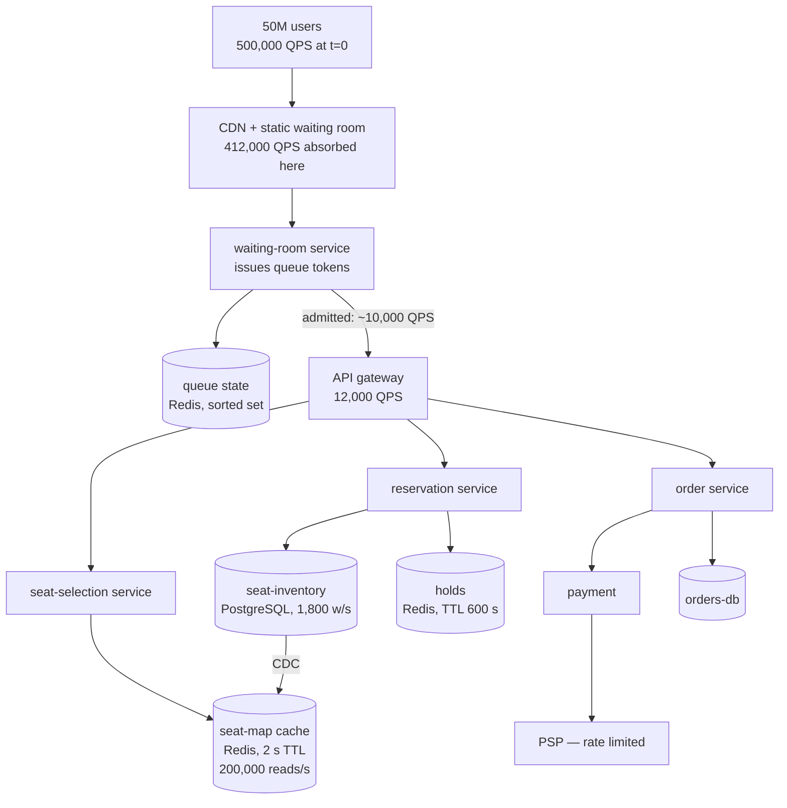

# Case Study — Gateline, Mega-Event Ticketing

**The defining problem: a 100× step function, on a schedule, against a fixed and contended
inventory.**

Gateline is the hardest of the six systems, and it is worth saying why precisely, because it is
not simply "high traffic."

Lumen handles 3–5 million requests per second, which is far more than Gateline's peak. But
Lumen's traffic is smooth, predictable, and almost entirely read. Riverbend needs correctness
under contention, but its contention is spread across millions of SKUs. Gateline combines the
hardest properties of both:

- **A 100× step in ten seconds**, from 5,000 QPS baseline to **500,000 QPS** — faster than any
  autoscaler can respond, so all capacity must be present in advance.
- **Fixed, indivisible inventory.** 100,000 seats. Each one must sell exactly once. There is no
  "approximately correct" seat.
- **Maximum contention.** 50 million people want the same 100,000 things at the same instant.
  Front-row seats have a contention ratio approaching 500:1.
- **A scheduled adversary.** Bots, resellers, and scripted clients are trying to win, and they
  are better engineered than most of the legitimate clients.
- **Zero tolerance for unfairness**, because the user experience of losing is acceptable only if
  it was a fair loss. This is a reliability requirement expressed as a social one.

And the whole thing happens at a publicly announced minute, several times a month, with a
regulator and a press cycle watching.

## The system

From [`../../../system-design-notes/ticketBookingHLD.md`](../../../system-design-notes/ticketBookingHLD.md).

**Scale.**

| | Value |
|---|---|
| Baseline traffic | **5,000 QPS** |
| Interested users for a mega-event | 50 million globally |
| Users hitting "buy" in the first 2 minutes | ~10 million |
| Initial page load | 10M requests in ~30 s = **333,000 req/s** |
| Absolute peak, first 10 seconds | **~500,000 QPS** |
| Seats in the venue | 100,000 |
| Seat-availability reads | 200,000/s (must never touch the database) |
| Backend QPS after the waiting room | **~10,000 QPS** |
| Observed booking conflict rate | 12.3% |
| Hold expiry rate (healthy) | < 4% |
| Database writes at peak | ~1,800/s |

The three numbers that define the architecture: **500,000 QPS arrives; 10,000 QPS is what the
booking system can safely handle; 100,000 seats exist.** Everything below is about how you get
from the first number to the second without lying to users.



## The admission-control derivation

This is the core of Gateline's design and it is worth deriving from first principles, because the
naive alternatives all fail in instructive ways.

**Naive option 1: just serve everyone.** 500,000 QPS against a booking system that can do 10,000.
Result: doc 04's congestive collapse (`F-04`) within seconds. Everyone gets errors, everyone
retries, nobody buys anything, and the system stays down until traffic stops. **This is the
failure mode that made ticketing sites notorious**, and it is entirely a capacity-mismatch
problem.

**Naive option 2: rate-limit and reject.** Accept 10,000 QPS, return 503 to the other 490,000.
Better for the system and terrible for users and for fairness: rejection is random, so whether
you get a ticket depends on retry luck and connection speed. **This actively advantages bots**,
which retry faster and from more IPs than any human. It also generates a retry storm (`F-01`)
because 490,000 rejected users all retry immediately.

**Naive option 3: scale up.** 500,000 QPS is achievable for a stateless tier. But the *booking*
path is bounded by seat contention (`GL-3` below), not by web capacity, so scaling the web tier
just delivers 500,000 QPS to a database that can do 1,800 writes/s. You have moved the collapse
one layer down, where there is no admission control at all.

**The resolution: a virtual waiting room.** Convert an unbounded, unfair, retry-generating
rejection into a **bounded, fair, retry-free queue**.

```
1. Every user hitting the sale page is redirected to a static waiting-room page
   served entirely from the CDN. No backend involved.
   → 412,000 of the 500,000 QPS terminate at the CDN and never reach an origin.

2. On first arrival, the user is issued a queue token with a position, from a
   lightweight service that does one atomic operation:
       ZADD queue:event123 <arrival_timestamp> <token>
   This is the only backend call in the entire waiting experience.

3. The waiting-room page polls for its position — but the poll is served from the
   CDN with a 3-second TTL on a per-bucket basis, so 10 million pollers produce
   a few thousand origin requests per second, not 3 million.

4. An admission controller releases tokens at a rate the booking system can
   actually absorb:
       release_rate = booking_capacity × safety_factor
                    = 10,000 QPS of booking work
   measured against real backend health, not a fixed number.

5. An admitted user gets a session valid for 10 minutes and enters the real
   application, where they are one of a few thousand concurrent users — a load the
   system handles every day.
```

**The arithmetic that makes it work:**

```
Without the waiting room:
  500,000 QPS → booking backend (capacity 10,000) → collapse

With it:
  412,000 QPS → CDN, static page, $0 marginal, no origin
   78,000 QPS → position polling, CDN-cached, ~2,000 QPS to origin
   10,000 QPS → admitted to the real application
                                      ↑ this is Tuesday's traffic
```

The reference notes put the reduction as backend QPS falling from 2 million/s to about 10,000/s.
**The waiting room is not a queue management feature; it is the load-shedding mechanism** (doc
03, `P-08`) with a user experience attached, and the user experience is what makes shedding
socially acceptable.

Three properties make it fair, and all three matter:

- **Position is assigned by arrival time and does not change.** Refreshing does not help;
  retrying does not help. This removes the entire advantage of a fast client or a bot that
  hammers.
- **The token is bound to the session** and cannot be transferred, shared, or parallelised. One
  human, one position.
- **The wait is visible.** "You are number 184,203 of 512,880; estimated wait 26 minutes" is a
  much better experience than an error, and — the operationally important part — **a user who
  can see their position does not retry.** The UX is a load-control mechanism.

## The POF map

| Class | Where it lives at Gateline | Severity |
|---|---|---|
| `E` Edge | The CDN absorbs 82% of peak traffic; a CDN misconfiguration at t=0 is total. TLS handshake cost at 83,000/s (`E-08`) | **Critical** |
| `R` Sync RPC | Short paths by design; the PSP is the long pole with a contractual rate limit | High |
| `P` Patterns | The waiting room *is* the load shedder; its admission rate is the single most important tuning parameter | **Critical** |
| `F` Feedback | Retry storms from rejected users; the release stampede when the waiting room opens (`GL-2`) | **Critical** |
| `D` Discovery | Standard; the risk is scaling events changing endpoint sets during the peak | Medium |
| `S` Storage | Seat rows are the contention point; 100,000 rows with a 500:1 demand ratio on the hot ones | **Critical** |
| `T` Transactions | Hold → pay → confirm is a saga with a strict expiry (`T-07`). A leaked hold is an unsold seat | **Critical** |
| `C` Cache | Seat map at 200,000 reads/s with a 2 s TTL; everything is cold at t=0 (`GL-4`) | **Critical** |
| `Q` Async | Post-purchase: ticket delivery, email, entitlements. Bursty by construction | Medium |
| `L` Locks | Per-seat exclusion at ~100% contention. The one place in this collection where pessimistic locking is right | **Critical** |
| `G` Change | Absolute freeze for 72 hours before a mega-event; everything is pre-warmed and verified | High |
| `N` Capacity | 100× step in 10 s. Autoscaling is irrelevant; everything must be pre-provisioned | **Critical** |
| `I` Isolation | One event must not affect another. Per-event cells are the natural boundary | High |

The row that distinguishes Gateline from every other system here is `N`: **autoscaling is
irrelevant.** Doc 12's 3–5 minute floor is 20× longer than the entire ramp. Every capacity
decision must be made and executed before the sale opens, which changes the character of the
whole operation from reactive to rehearsed.

## GL-1 · The event that sold out to nobody

**What happened.** A 100,000-seat event showed as sold out 14 minutes after the sale opened.
62,000 tickets had actually been purchased. 38,000 seats were held by sessions that had been
abandoned, and the holds never expired. Those 38,000 seats were unsellable for the remaining
life of the event, and the resulting press coverage was worse than the technical incident.

**Mechanism.** `T-07`, exactly. The reservation flow was:

```
1. User selects seat        → INSERT INTO holds (seat_id, session_id)
2. User enters payment      → (2–8 minutes of human time)
3. Payment succeeds         → UPDATE seats SET sold_to = ...; DELETE FROM holds
4. User abandons            → a "release" call fired by the front end on page unload
```

Step 4 is the bug. Release depended on the *client* telling the server it had gone, and clients
do not reliably do that: a closed tab, a lost network connection, a crashed browser, a phone
going to sleep, and a user who simply walks away all produce a hold with no release.

```
200,000 users admitted, each holding seats for an average of 6 minutes
Observed abandonment rate: ~60%
120,000 abandoned holds against a 100,000-seat venue
```

The venue was over-subscribed by abandoned holds before it was sold out by purchases.

**The fix — expiry enforced by the holder of the resource, checked on read.**

```sql
-- The hold IS the seat row's state, with an expiry. There is no separate holds table.
UPDATE seats
   SET held_by = $session, held_until = now() + interval '8 minutes', version = version + 1
 WHERE seat_id = $seat
   AND sold_to IS NULL
   AND (held_by IS NULL OR held_until < now())     -- expired holds are invisible
RETURNING version;
-- Zero rows = someone else holds it, or it is sold.
```

Four properties, and each one matters:

1. **Expiry is checked on read**, so an expired hold is available immediately without any sweeper
   running. Correctness does not depend on a background job.
2. **A sweeper still runs**, to keep the data tidy and to emit metrics, but it is not load-
   bearing.
3. **The hold duration is short (8 minutes) and extendable by an active session.** A user
   actively typing their card details sends a heartbeat that extends the hold; a user who has
   gone does not. This is the key improvement over a long "safe" duration — a long hold is
   inventory you cannot sell.
4. **The purchase re-checks the hold.** Between the user pressing "pay" and the payment
   completing, the hold may have expired. Confirming a purchase on an expired hold would
   double-sell, so the confirm step revalidates and — if the hold is gone — fails with an honest
   message. Losing a seat you held is a bad experience; being one of two people sold the same
   seat is worse.

**The metric that now exists**: `hold_expiry_rate`, alerted above 4%. A healthy sale has a small
fraction of holds expiring; a rate above 4% means either the funnel is broken (users cannot
complete payment) or holds are leaking. It is a leading indicator of both.

## GL-2 · The waiting room that became the bottleneck

**What happened.** The waiting room worked — it absorbed 500,000 QPS and admitted 10,000 QPS.
Then, 40 minutes into the sale, the admission controller's rate was raised manually from 10,000
to 25,000 because "the backend looks fine." Within 90 seconds the booking system was in
congestive collapse, and the waiting room — now unable to get health signals from the backend —
kept admitting at 25,000.

**Mechanism.** Two failures compounding.

*The admission rate was a fixed number, set by a human.* It should be a function of measured
backend health. A backend that "looks fine" at 10,000 QPS with a 12.3% conflict rate is not
necessarily fine at 25,000 QPS, because conflict rate is superlinear in concurrency: more
concurrent users selecting seats means more of them collide on the same seats, means more retries
per successful booking, means the effective work per booking rises.

```
At 10,000 admitted/s:  12.3% conflict → 1.14 attempts per booking
At 25,000 admitted/s:  observed 47% conflict → 1.89 attempts per booking
Effective backend work: 25,000 × 1.89 / (10,000 × 1.14) = 4.1× 
```

Raising admission 2.5× raised backend work 4.1×.

*The controller failed open.* When the backend health signal became unavailable (because the
backend was saturated and not answering the health endpoint), the controller continued at its
last rate instead of backing off. It should have failed **closed** — a controller that cannot
measure the thing it is protecting must assume the worst.

**The fix.**

1. **The admission rate is computed, not set.** A closed-loop controller:

```
target_concurrency = the number of in-flight booking sessions the backend can serve
                     (measured, in a load test, as the point of peak goodput — doc 15 level 2)

admission_rate = (target_concurrency − current_concurrency) / mean_session_duration
                 clamped to [0, max_safe_rate]

Adjusted every 5 seconds from:
  - current in-flight sessions
  - backend p99 latency vs target
  - conflict rate
  - seat-reservation success rate
```

2. **Fail closed.** If any input signal is stale by more than 15 seconds, the admission rate
   drops to 25% of its last value and keeps halving. Admitting nobody is recoverable; admitting
   too many is not.
3. **A hard ceiling that no manual override can exceed** — the same principle as Lumen's
   `LM-1`: configuration and human action may make the system more conservative, never less.
4. **The manual control that remains is a *multiplier* in [0, 1]**, not an absolute rate. An
   operator can slow admission; they cannot speed it past what the controller computed.

## GL-3 · The seat-lock throughput ceiling

**What happened.** A first attempt at the reservation system used `SELECT ... FOR UPDATE` on the
event's seat map to guarantee exclusivity. Throughput was 22 reservations/s. Selling 100,000
seats would have taken 76 minutes of pure serialisation, and every waiting user's request queued.

**Mechanism.** Doc 10's `L-03`, with the numbers:

```
Hold time per reservation: read seat map, choose, lock, write, commit ≈ 45 ms
Throughput through one lock = 1 / 0.045 = 22/s
```

**Why optimistic concurrency was also wrong.** Doc 10's table says: optimistic below 5% conflict,
pessimistic above 20%. For front-row seats at a mega-event the conflict rate approaches 100% —
500 users are trying for the same seat. Optimistic concurrency there means 500 attempts, 1
success, 499 retries, and the retries collide again. It degenerates into a livelock where the
system does enormous work and makes almost no progress.

**The design that worked — three mechanisms layered.**

**1. Per-seat granularity, not per-event.** The lock is on one seat row, not the map. 100,000
independent locks:

```
Contention per seat = (users wanting THAT seat), not (users wanting any seat)
For a typical seat: a handful of concurrent attempts → optimistic works
For a front-row seat: hundreds → needs mechanism 3
```

**2. A single atomic conditional update, no read-then-write.** The `UPDATE ... WHERE held_by IS
NULL` from `GL-1`. Hold time drops from 45 ms to ~3 ms because there is no read, no round trip,
and no lock held across application logic:

```
Per-seat throughput = 1 / 0.003 = 333/s     (irrelevant for most seats)
Aggregate throughput = bounded by the database, ~8,000 reservations/s
```

**3. Best-available allocation, which removes the contention entirely for most users.** The key
product insight: **the overwhelming majority of buyers do not want a *specific* seat; they want
*good* seats together.** So the default flow does not let users pick from a map at all:

```
POST /reserve  { event: E123, quantity: 2, tier: "lower_bowl" }
→ The service allocates the best available pair from a pre-computed, pre-sharded
  pool for that tier, using the same atomic conditional update on whichever seats
  it picks first.
→ Contention is now on the POOL, not on individual seats, and the pool is sharded
  into 100 buckets (S-01's add-entropy technique).
```

```
Contention per bucket = total demand / 100
At 10,000 admitted/s with 8,000 reservation attempts/s:
  80 attempts/s per bucket → trivial
```

Seat-map picking remains available for users who insist, and it is where the 12.3% conflict rate
comes from — but it is a minority of traffic, and its contention is bounded to the specific seats
being fought over rather than to the whole event.

**4. For genuinely hot individual seats, a queue per seat.** At 500:1 contention on seat A1,
neither optimistic nor a simple lock is right. A small FIFO queue per hot seat, with the first
holder given an exclusive window, is the correct structure: it is fair, it is bounded, and it
gives users a definite answer ("you are 4th in line for A1; estimated 3 minutes") instead of a
lottery. This is the waiting room applied at the seat level, and it is the same principle for the
same reason.

## GL-4 · Everything is cold at t=0

**What happened.** At a sale open, the first 90 seconds had a p99 of 14 seconds and a 22% error
rate, despite capacity having been correctly pre-provisioned. By 02:00 into the sale everything
was healthy. The pattern repeated at every sale and was accepted as "the first minute is always
bad" until someone measured it.

**Mechanism.** `F-10` at its most extreme, because Gateline's baseline traffic is 1% of its peak,
so *everything* is cold in a way that a steadily-loaded system never experiences:

| Cold thing | Effect in the first 90 s |
|---|---|
| Seat-map cache (`C-05`) | 100% miss; 200,000 reads/s hitting PostgreSQL instead of Redis |
| Connection pools | Every request pays connect + TLS to the database |
| JIT compilation | JVM services at ~10% of warm throughput |
| CDN edge caches | The waiting-room page itself is not yet in every POP |
| TLS session cache (`E-08`) | 83,000 full handshakes/s, 125 cores of pure handshake work |
| OS page cache on the database | Seat rows read from disk, not memory |
| DNS resolution in clients | First-request resolution latency for 10M clients |
| Autoscaled pods just added | Started 20 minutes ago but never served a request |

The team had done the hard part — provisioning 100× capacity — and then delivered the traffic to
a fleet that had never done any work.

**The fix — a pre-warm protocol, executed on a timeline.**

```
T−60 min  Scale every tier to full sale capacity. Do not wait for the autoscaler.
T−45 min  Warm the seat-map cache: load the complete seat map for the event into
          Redis and into every service instance's local cache.
T−40 min  Warm connection pools: every instance opens its full pool and runs a
          no-op query on each connection.
T−35 min  Synthetic load at 20% of expected peak against every tier, for 15
          minutes. This drives JIT compilation, fills page caches, populates CDN
          POPs, and — critically — VERIFIES the capacity is real.
T−20 min  Verify: p99 at 20% load is within target on every tier. If not, the
          sale is delayed. This is a go/no-go gate with a named owner.
T−15 min  Freeze. No deploys, no config changes, no scaling events (see below).
T−10 min  Open the waiting room. Users begin queueing. The room itself is now
          under real load and warm before the sale opens.
T−0       Begin admitting.
```

Two things about this protocol are worth generalising beyond ticketing.

**The synthetic load at T−35 is the most valuable step**, because it converts "we believe we have
capacity" into "we have observed this capacity serving requests." Doc 15's argument in its most
concrete form. It has caught: a node pool that scaled but whose pods were `Pending` on IP
exhaustion (`N-11`), a database parameter group change that had not been applied, an expired
certificate on an internal service, and a new pod version that was 3× slower than the old one.

**The T−20 go/no-go gate with a named owner** is what makes it real. A warm-up protocol with no
gate is a checklist that gets skipped under time pressure.

**Freezing autoscaling during the sale**, at T−15, is the counter-intuitive one. Autoscaling
during the event is actively harmful: it adds cold instances into a maximally-loaded system
(`F-03`), and scale-down events during a lull remove warm capacity that will be needed in
minutes. Gateline sets `minReplicas = maxReplicas` for the duration of the sale. **Capacity is
a decision made at T−60, not a control loop running during the event.**

## GL-5 · Fairness, bots, and the queue-position leak

**What happened.** For one high-profile sale, a large fraction of the best seats went to
automated buyers within 40 seconds. Investigation found that the waiting-room position endpoint
returned the user's exact position *and* the current admission cursor, so a script could compute
precisely when it would be admitted and pre-warm a session — while a human, polling a page every
3 seconds, arrived late.

**Mechanism.** An information leak that converted a fair queue into an unfair one. The queue was
correct; the *observability of the queue* was the vulnerability.

More generally, the anti-bot problem at Gateline is a reliability problem, not only a fairness
one: bots generate far more load per acquired ticket than humans, so a sale that is 40% bot
traffic has substantially higher backend cost per ticket sold.

**The mitigations, and their costs.**

| Mitigation | Effect | Cost |
|---|---|---|
| **Return a coarse position band** ("top 5%") rather than an exact number | Removes the timing oracle | Slightly worse UX; users like precision |
| **Bind the queue token to a verified account** created more than N days ago | Raises the cost of a fake identity | Excludes legitimate new users; needs an appeals path |
| **Device and behavioural fingerprinting** at the waiting-room page | Detects scripted clients | Privacy considerations; false positives on unusual but legitimate clients |
| **A proof-of-work challenge** before token issuance | Makes parallel identities expensive | Drains mobile batteries; penalises low-end devices |
| **Randomised admission within a time band** rather than strict FIFO | Removes precise predictability | Slightly less "fair" in the strict sense, and users must be told |
| **Per-account and per-payment-instrument purchase limits**, enforced at reservation | Caps the value of winning repeatedly | Requires identity linking across accounts |
| **Delayed allocation**: collect all requests in a window, then allocate by lottery | **Removes speed as a factor entirely** | A completely different product experience; no instant gratification |

The last row is the only one that fully solves it, and it is a product decision rather than an
engineering one. Several ticketing systems have moved to it for the highest-demand events,
precisely because no amount of engineering makes a speed-based allocation fair when one side has
better engineering.

⚠️ And the mechanism Gateline explicitly does **not** use: CAPTCHAs on the critical path. They
add latency, they are defeated by solving services, they fail for users with accessibility needs,
and at 500,000 QPS the CAPTCHA provider becomes a hard dependency of the entire sale (`E-12`).

## What Gateline can degrade, and what it cannot

A much shorter ladder than Lumen's, because most of the system is correctness-critical.

| Load level | Degradation | Note |
|---|---|---|
| Any | Seat map shows counts, not individual seats | Cheap, and most users use best-available anyway |
| Elevated | Best-available only; interactive seat picking disabled | Removes the highest-contention path (`GL-3`) |
| High | Recommendations, related events, upsells disabled | Standard soft dependencies |
| High | Order confirmation email and ticket delivery deferred to a queue | The purchase is complete; the artefact arrives later |
| **Never** | **Reduce the admission rate below zero seats sold** | The sale must progress, slowly, rather than stopping |
| **Never** | **Relax seat exclusivity** | Double-selling is unrecoverable |
| **Never** | **Skip payment authorisation** | Obvious, and worth writing down |

The "never" rows are the point. **Gateline's degradation ladder runs out very quickly**, because
almost everything on the critical path is correctness-critical. That is exactly why the load
shedding has to happen at the front door (the waiting room) rather than being distributed through
the system: there is very little the inner system can safely give up.

## Stack choices and their POF profile

| Concern | Gateline's choice | POF it buys | POF it creates | Why not the alternative |
|---|---|---|---|---|
| Waiting-room page | 100% static, CDN | Absorbs 82% of peak with zero origin cost | A CDN misconfiguration at t=0 is total | Dynamic page — 412,000 QPS to origin is the failure the room exists to prevent |
| Queue state | Redis sorted set | O(log N) position, millions of members | Durability on failover — a lost queue is a public incident | A database — 500,000 inserts in 10 s is not survivable |
| Seat inventory | PostgreSQL, one row per seat | Atomic conditional updates; auditable; a real source of truth | 1,800 writes/s ceiling per event | Redis — faster, and seat allocation is a financial record that needs durability (`C-14`) |
| Holds | The seat row itself, with `held_until` | One source of truth; expiry checked on read | Tied to database write capacity | A separate Redis holds table — two sources of truth for "is this seat available", which is `T-01` |
| Seat-map reads | Redis, 2 s TTL, CDC-updated from PostgreSQL | 200,000 reads/s without touching the database | Up to 2 s of staleness, so a user may select a just-taken seat | Read from the database — 200,000 reads/s is not survivable |
| Payment | One PSP with a contractual rate limit | Compliance and coverage | A hard external dependency with a hard cap | Multiple PSPs — real resilience, doubles reconciliation work; Gateline is adding this |
| Isolation | One cell per event | An event's problems cannot affect another event | Uneven cell sizes; a mega-event needs a big cell | A shared fleet — one mega-event would starve every other event on the platform |
| Autoscaling | **Disabled during sales** | No cold instances entering a hot system | Capacity must be right at T−60 | Autoscaling — 20× too slow for a 10-second ramp, and harmful during the event |

The per-event cell is the choice most worth copying. **The natural isolation boundary is
whatever unit your load spikes arrive in.** For Gateline that is an event; for Riverbend it would
be a flash-sale SKU; for a SaaS product it is a tenant. Aligning the cell boundary with the spike
boundary means a spike is contained by construction.

## What to take away

1. **Gateline is hard not because of peak QPS but because of the combination**: a 100× step in
   ten seconds, fixed indivisible inventory, near-total contention, an engineered adversary, and
   a fairness requirement. Any one of those is manageable.
2. **The waiting room is load shedding with a user experience attached**, and the user experience
   is what makes shedding acceptable. It converts 500,000 QPS into 10,000 QPS of real work, and
   82% of the peak terminates at the CDN.
3. **A visible queue position stops users retrying**, which is a load-control mechanism disguised
   as UX. Rejection without a position produces a retry storm; a position produces patience.
4. **Position must be assigned on arrival and never change.** That single property removes the
   advantage of a fast client, and it is what makes the queue fair.
5. **Admission rate must be computed from measured backend health and fail closed**, not set by a
   human. Raising it 2.5× raised backend work 4.1×, because conflict rate is superlinear in
   concurrency.
6. **Configuration and human overrides may make the system more conservative, never less.** Both
   `GL-2` and Lumen's `LM-1` are the same lesson from opposite directions.
7. **A hold without an expiry enforced by the resource holder loses inventory at your abandonment
   rate.** 120,000 abandoned holds against a 100,000-seat venue. Check expiry on read so
   correctness does not depend on a sweeper, keep holds short and extend them with a heartbeat,
   and revalidate at purchase.
8. **`SELECT ... FOR UPDATE` on the event caps you at 22 reservations/s.** The working design is
   per-seat granularity, a single atomic conditional update with no read, a sharded
   best-available pool that removes contention for most users, and a per-seat queue for the
   genuinely contested ones.
9. **Optimistic concurrency at near-100% contention degenerates into a livelock.** This is one of
   the few places in this collection where a queue or a lock is genuinely the right answer.
10. **When baseline is 1% of peak, everything is cold at t=0** — caches, pools, JIT, TLS sessions,
    CDN POPs, page cache. The pre-warm protocol with synthetic load at T−35 and a go/no-go gate at
    T−20 is what converts "we believe we have capacity" into "we have observed it."
11. **Disable autoscaling during the event.** It adds cold instances to a hot system and removes
    warm ones during lulls. Capacity is a decision made an hour before, not a control loop.
12. **The queue's observability can be the vulnerability.** Returning an exact position and the
    admission cursor gave scripts a timing oracle. Coarse bands, randomisation within a band, and
    — if fairness genuinely matters most — lottery allocation, which removes speed as a factor
    entirely and is a product decision rather than an engineering one.
13. **Align the isolation boundary with the spike boundary.** One cell per event means a
    mega-event cannot starve the rest of the platform, and it is the choice most transferable to
    other domains.

Next: [19-case-ride-hailing-waypoint.md](19-case-ride-hailing-waypoint.md), where a deliberately
lossy path carrying 750,000 writes per second runs alongside a financial ledger that may lose
nothing — inside the same request.
