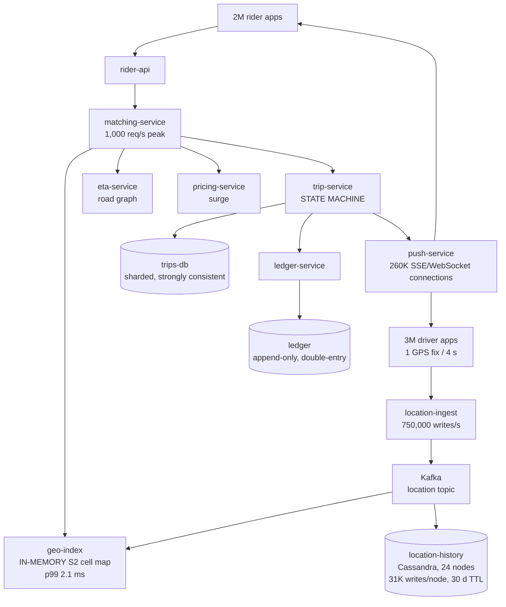

# Case Study — Waypoint, Ride Hailing

**The defining problem: two opposite correctness philosophies inside one request path.**

Waypoint carries **750,000 location writes per second** that are allowed to be lost, reordered,
duplicated, and delayed — because a GPS fix that is four seconds stale is replaced by a fresher
one in four seconds and nobody can tell the difference. Losing a million of them would be
invisible.

Waypoint also carries a **trip state machine and a financial ledger** where losing one record is
a driver who was not paid, a rider who was charged for a trip that did not happen, or a
regulatory reporting failure. At 25 million trips a day and roughly $40 of value each, a 0.01%
loss rate is $100,000 a day.

**Both run through the same services, the same clusters, the same on-call rotation, and often
the same request.** A rider tapping "request ride" triggers a geospatial query against
approximate, lossy, in-memory data and then creates a durable, auditable, financially
consequential record. The interesting failures live on the seam between them, and the most
common architectural mistake is applying one half's philosophy to the other.

## The system

From [`../../../system-design-notes/uberHLD.md`](../../../system-design-notes/uberHLD.md).

**Scale.**

| | Value | Derived |
|---|---|---|
| Monthly active riders | 130 million | |
| Monthly active drivers | 5 million | |
| Peak concurrent drivers | ~3 million | |
| Peak concurrent riders | ~2 million | |
| Trips per day | 25 million | **290 trips/s average** |
| Peak trip requests | | **~1,000/s** (Friday night, New Year) |
| Concurrent active trips | **260,000** | |
| Location updates | 3M drivers × 1 per 4 s | **750,000 writes/s** |
| Rush-hour peak | | **1.2 million writes/s** |
| Location data volume | | 6.5 TB/day, 30-day TTL |
| Geo-index query | | p50 0.3 ms, **p99 2.1 ms** |
| Trip database write | | p50 4 ms, p99 22 ms |

**The ratio that defines the architecture:**

```
750,000 location writes/s  ÷  290 trip writes/s  =  2,586 : 1
```

Two and a half thousand lossy writes for every durable one. If both were treated the same way,
either the location path would be unaffordable or the trip path would be unsafe. The entire
design is about keeping them separate while letting them interact.

**The services.**



## The two philosophies, stated explicitly

This table is the most useful thing in the doc, because the whole system is an exercise in not
mixing the two columns up.

| | **The location path** | **The trip and money path** |
|---|---|---|
| Volume | 750,000/s | 290/s |
| Durability | **None required.** Losing a fix is invisible | **Absolute.** Every record is auditable |
| Ordering | Not required — the newest wins | **Required** — a state machine |
| Consistency | Eventual, seconds | **Strong**, within a trip |
| Idempotency | Irrelevant (writes are overwrites) | **Mandatory** |
| Retry on failure | **Do not bother** — the next fix arrives in 4 s | **Retry until it succeeds** |
| On overload | **Drop** | **Never drop.** Queue, degrade, or refuse — never silently discard |
| Storage | In-memory index + Cassandra with a TTL | Sharded relational, replicated synchronously |
| Failure mode if wrong | Slightly worse matching | **Money, regulation, trust** |
| Backpressure | Shed at the edge | Propagate upstream |

The mistake that produces the most incidents at Waypoint is applying the left column's
engineering to something in the right column. Every one of `WP-1` through `WP-5` is a version of
that.

## The POF map

| Class | Where it lives at Waypoint | Severity |
|---|---|---|
| `E` Edge | 3M persistent driver connections and 260K rider streams. A reconnect storm is `E-15` at full scale | **Critical** |
| `R` Sync RPC | The match path is short by design (geo + ETA + pricing), but it has a 2-second user-facing budget | High |
| `P` Patterns | Location ingest must shed; the trip path must not. Two shedding policies in one system | **Critical** |
| `F` Feedback | Surge pricing is a literal feedback loop with real economic dynamics (`WP-3`) | **Critical** |
| `D` Discovery | Geo-index instances are stateful and partitioned by geography; discovery must be locality-aware | High |
| `S` Storage | 750,000 writes/s against a 24-node Cassandra ring at 31K/node against a ~50K ceiling | **Critical** |
| `T` Transactions | Trip completion writes to the trip store, the ledger, and the payment provider | **Critical** |
| `C` Cache | The geo-index *is* a cache and it is load-bearing in the strongest sense (`C-04`) | **Critical** |
| `Q` Async | The location topic is the backbone; trip events feed billing and analytics | High |
| `L` Locks | Driver assignment must be exclusive — one driver, one trip (`WP-2`) | **Critical** |
| `G` Change | A pricing or matching algorithm change alters system behaviour city by city | High |
| `N` Capacity | Predictable diurnal and weekly peaks; unpredictable weather and event peaks | High |
| `I` Isolation | **Natural geographic cells.** A city is a nearly perfect isolation boundary | Medium (because it is well solved) |

The row worth noticing: `I` is **Medium** at Waypoint and **Critical** at Riverbend, because
Waypoint's domain hands it a cell boundary for free. A trip happens in one city; a driver in
Lisbon is irrelevant to a rider in Osaka. **Geography is the cleanest isolation boundary any of
these six systems has**, and Waypoint's reliability benefits enormously from something it did not
have to design.

## Why the geo-index is in memory, derived

The most consequential design decision at Waypoint, and it is worth deriving because the naive
alternative is not obviously wrong until you do the arithmetic.

**The requirement.** 750,000 location writes/s, each of which must update a spatial index, and
1,000 queries/s of the form "which drivers are within 3 km of this point?" with a p99 under a
few milliseconds.

**Option A — a database with a spatial index.** PostGIS, or Cassandra with geohash keys, or
DynamoDB with an S2 cell as the partition key.

```
750,000 writes/s to any database requires:
  - a durable write path (WAL, commit, replication)
  - index maintenance per write
Best case on a well-tuned distributed store: ~50,000 writes/s per node
  → 15+ nodes doing nothing but location index updates
And the read: a radius query is a multi-cell scan, typically 10–30 ms p99.
```

Thirty milliseconds against a 2.1 ms requirement, and 15 nodes of infrastructure whose entire
content is discarded and replaced every 4 seconds. **You are paying for durability on data that
is worthless in 4 seconds.**

**Option B — an in-memory hash map keyed by S2 cell.** The world is divided into S2 cells (a
hierarchical spherical grid). Each cell maps to the set of drivers currently in it.

```
Write: compute the S2 cell from lat/lon (~200 ns), update two hash-map entries
       (remove from the old cell, add to the new).
       750,000 writes/s × 200 ns = 150 ms of CPU per second = 15% of one core
Read:  compute the covering set of cells for the query radius (typically 4–20
       cells), union their driver sets.
       p50 0.3 ms, p99 2.1 ms
Memory: 3M drivers × ~200 bytes = 600 MB. Trivially fits.
```

Fifteen percent of one core, versus fifteen nodes. **The in-memory design is not an
optimisation; it is three orders of magnitude cheaper**, and it is only possible because the data
is allowed to be lost.

**What makes it acceptable to lose.** If a geo-index instance restarts, its map is empty. It
refills within **4 seconds**, because every driver sends a fix every 4 seconds. The recovery time
of the entire index is one update interval. There is nothing to restore, nothing to replicate,
and nothing to back up.

That property — **state that reconstructs itself from the natural traffic in bounded time** — is
worth looking for in other systems. It converts a stateful service into something with a
stateless service's operational profile.

**And the durable copy exists separately**: the same Kafka stream feeds Cassandra with a 30-day
TTL, for trip reconstruction, disputes, and regulatory requests. **The lossy path and the durable
path are fed by the same events and have completely different service levels**, which is the
pattern the whole system is built on.

## WP-1 · The geo-index that was quietly stale

**What happened.** For 40 minutes in one metropolitan area, matching quality degraded badly:
riders were matched to drivers 8–12 minutes away instead of 2–4, cancellation rate tripled, and
ETAs were wrong. No errors anywhere. Every service reported healthy.

**Mechanism.** A gray failure (doc 00) in the most load-bearing cache in the system.

The geo-index consumes from Kafka. One of the four consumer instances covering that city had
stopped committing offsets — a `Q-01` silent backlog — because it was stuck retrying a
malformed location message (`Q-05`). Its in-memory map continued to serve queries from data that
was, by the end, 40 minutes old.

The index did not report itself as stale. It had drivers in it. They were in the wrong places.

```
The index answers "who is near point X" with drivers who WERE near X 40 minutes ago.
Matching picks the closest of those.
The driver is dispatched, discovers they are 11 minutes away, and often cancels.
```

**Why nothing caught it.** Every check the team had was a liveness or availability check:

- The consumer's pods were `Running`. ✓
- The geo-index answered queries in 1.9 ms p99. ✓ (Faster than usual, in fact — a smaller,
  staler working set.)
- Matching-service error rate: 0%. ✓
- Trip creation rate: normal. ✓

The only signals that moved were *business* signals — cancellation rate, average pickup ETA,
driver-to-rider distance — and those were on a dashboard nobody was paged from.

**The fix — freshness as a first-class, enforced property.**

1. **Every entry carries the timestamp of the fix that produced it**, and the index reports the
   **age of its newest entry** and the **p50 age of all entries** as metrics.

```
# The alert that would have caught this in 90 seconds
max by (city, instance) (geo_index_newest_entry_age_seconds) > 30
```

2. **The index refuses to serve if it is stale.** If the newest entry is older than 30 seconds,
   the instance fails its readiness check and is removed from the pool. **This is the correct use
   of a readiness check under doc 01's `E-09` rule**, because the staleness is specific to *this
   instance* — its siblings are consuming other partitions and may be fine. It does not test a
   shared dependency.
3. **Queries filter by age.** A driver whose last fix is older than 60 seconds is excluded from
   match candidates regardless of index freshness, because a driver who has not reported in a
   minute has probably lost signal or gone offline.
4. **Business-metric alerting was promoted to paging.** Median pickup distance, per city, is now
   a paging alert. It is the only signal that detects a whole class of quality failures that
   produce no errors — and it is the signal that would have detected this in the first two
   minutes.

**The generalisable lesson**: *a cache whose staleness produces bad answers rather than errors
must measure and enforce its own freshness, and must refuse to serve when it cannot.* And **for
systems whose failures degrade quality rather than availability, a business metric is the only
detector.**

## WP-2 · The driver assigned to two trips

**What happened.** During a network partition between the matching service and its coordination
store, 340 drivers were each assigned two concurrent trips over an 8-minute window. Riders were
left waiting; drivers received conflicting navigation; the ledger recorded two trips with
overlapping times for the same driver, which failed a regulatory consistency check.

**Mechanism.** Doc 10's `L-01` and `L-05` together.

Matching worked like this: the service finds candidate drivers from the geo-index, picks the
best, and acquires a lock on that driver ID before dispatching:

```python
if redis.set(f"driver_lock:{driver_id}", trip_id, nx=True, ex=30):
    dispatch(driver_id, trip_id)
```

Three defects, all from doc 10:

1. **No fencing token.** The lock could not prevent a stale holder from acting.
2. **A 30-second TTL** against a dispatch flow that could take longer when the driver's app was
   slow to acknowledge.
3. **Redis replication is asynchronous**, so during the partition, a promoted replica did not
   have some locks that the old primary had granted.

During the partition, two matching-service instances in different availability zones each
acquired what they believed was an exclusive lock on the same driver, from what they believed was
the authoritative Redis.

**The fix — move the guarantee to the resource.**

The insight from doc 10: the lock cannot prevent the conflict, so **the trip state machine must
reject it**. Driver assignment became a conditional state transition on the driver's own record,
in the strongly-consistent trip store:

```sql
UPDATE drivers
   SET current_trip_id = $trip_id,
       assignment_epoch = assignment_epoch + 1,
       assigned_at = now()
 WHERE driver_id = $driver_id
   AND current_trip_id IS NULL          -- the fencing condition
RETURNING assignment_epoch;
-- Zero rows returned = this driver is already on a trip. Pick another.
```

Properties:

- **No lock service is involved.** The database row *is* the exclusion, and it is strongly
  consistent because the trip store is.
- **It is correct under partition, pause, and replica promotion**, because the guarantee lives in
  the thing being protected.
- **The `assignment_epoch`** is carried in every subsequent message to the driver app, which
  ignores messages from a stale epoch — so even a dispatch that was already in flight when the
  assignment was superseded cannot confuse the client.
- Redis is still used, as a **fast pre-filter** to avoid attempting the database write for
  drivers that are obviously busy. It is an optimisation with no correctness role, and that is
  written in the code comment so nobody later depends on it.

**The generalisable lesson, which is doc 10's thesis in one sentence**: *if you cannot fence, the
lock is an optimisation; put the exclusivity in the resource's own state transition.*

## WP-3 · The surge-pricing feedback loop

**What happened.** During a rainstorm, surge pricing in one district oscillated between 1.0× and
4.8× with a period of roughly 6 minutes for two hours. Riders saw prices double and halve while
deciding. Drivers drove back and forth between districts chasing surge that had disappeared by
the time they arrived. Completed trips in the affected area fell 30% below what demand should
have produced.

**Mechanism.** A control loop whose response time is comparable to its period — doc 04's `F-08`,
except that the actuators are humans in cars and the delay is a physical journey.

```
t=0    Demand in district D rises. Supply/demand ratio triggers surge 3.2×.
t=0    The surge is displayed to drivers in adjacent districts.
t=1m   Drivers begin moving toward D. (They have not arrived. Supply is unchanged.)
t=2m   Surge recalculated: demand still high, supply still low → surge rises to 4.8×.
t=4m   Drivers arrive. Supply in D jumps sharply — more drivers arrived than were needed,
       because the incentive was applied for 4 minutes to everyone within range.
t=5m   Surge recalculated: supply now exceeds demand → surge falls to 1.0×.
t=6m   Drivers, seeing no surge, leave for adjacent districts (some of which now show
       surge, because their supply just left).
t=8m   Supply in D collapses. Demand is still elevated. Surge rises again.
```

The loop has three properties that guarantee oscillation, and they are the classic ones from
control theory:

- **Dead time**: the 3–4 minutes between the signal and the supply response.
- **Over-correction**: the incentive is broadcast to everyone in range, so the response is much
  larger than needed.
- **No damping**: the controller recomputed from instantaneous state with no memory.

**The fix — treat it as a control system, because it is one.**

1. **Damping.** Surge changes at most 0.3× per update, and updates are every 3 minutes rather
   than every 30 seconds. The system responds more slowly than the dead time, which is the
   standard requirement for stability.
2. **Hysteresis.** Surge rises when the supply/demand ratio crosses one threshold and falls only
   when it crosses a different, lower one. This is doc 04's hysteresis used deliberately as a
   stabiliser rather than suffered as a failure.
3. **Commitment.** A driver who begins moving toward a surge area has the surge multiplier
   **locked for their next trip for 10 minutes**. This decouples the driver's incentive from the
   instantaneous price, so they do not turn around, and it means the system is not lying to them.
4. **Forecast rather than react.** The predicted supply — drivers currently en route — is counted
   in the supply figure. This directly removes the dead time from the controller's view, which is
   the actual root cause. It is the single most effective change.
5. **A cap on the rate of change visible to riders**, so a quoted price does not move while
   someone is deciding.

**The generalisable lesson, which applies well beyond pricing**: *any system where an output
influences a future input is a control loop, and it needs damping, hysteresis, and a way to
account for in-flight effects.* Autoscaling (`N-04`), circuit breakers (`P-04`), load shedding,
and cache admission are all control loops, and they all oscillate for the same three reasons.

## WP-4 · The push migration and the 3-million-client reconnect

**What happened.** Waypoint migrated rider trip updates from polling to server-sent events. The
migration worked. Six weeks later, a routine rolling deploy of the push service produced a
14-minute outage of trip updates for 260,000 active trips.

**Mechanism.** `E-15` and `F-06`, at full scale.

First, the reason for the migration, which is sound arithmetic from the reference notes:

```
Polling: 260,000 active trips × 1 poll / 4 s = 65,000 requests/s
         Each poll is a full request: TLS (if not kept alive), auth, a trip lookup.
         Most polls return "nothing changed."
Push:    260,000 persistent connections, a message only when something changes.
         Actual update rate: ~3,000 messages/s.
         A 20× reduction in work and a large latency improvement.
```

Then the failure. The push service ran 40 instances, each holding ~6,500 connections. A rolling
deploy replaced them one at a time. Each replacement dropped 6,500 connections, and:

```
6,500 clients reconnect simultaneously
Each reconnect: TLS handshake (1.5 ms CPU) + auth token validation +
                a trip-state fetch to rebuild the client's view
Cost per reconnect: ~15 ms of backend work across services
6,500 × 15 ms = 97 seconds of work, arriving in about 1 second
```

The remaining 39 instances absorbed that. Then instance 2 was replaced, and instance 3. By
instance 9, the accumulated reconnect load had pushed the auth service over its capacity, its
latency rose, reconnects began timing out, and timed-out clients **reconnected again** — the
feedback loop. Now instances were being replaced *and* clients were reconnecting repeatedly.
Connection count per surviving instance rose past its limit, those instances shed connections,
and those clients reconnected too.

**The fix.**

1. **Graceful connection migration.** Before terminating, an instance sends a `GOAWAY`-equivalent
   with a **randomised delay per connection** spread over 120 seconds. 6,500 clients reconnect at
   54/s instead of 6,500/s.
2. **Randomised connection lifetime** (`E-15`): every connection is retired after 45 minutes
   ± 25%. Turnover is continuous, so the reconnect path is exercised constantly and there is
   never a synchronised population.
3. **Full jitter on client reconnect**, mandatory, with a cap.
4. **Admission control on connection establishment**, separate from request admission. The push
   service accepts new connections at a bounded rate and rejects the excess immediately with a
   `Retry-After`, so existing connections are protected.
5. **Cheaper reconnects.** The trip-state fetch on reconnect was replaced by a resumable stream:
   the client sends the last sequence number it received, and the server sends only what is
   missing. A reconnect for a client that was away for 3 seconds now costs almost nothing.
6. **Slow rolls for connection-holding services**: one instance at a time with a 3-minute pause,
   not the standard rolling update. A deploy of the push fleet now takes two hours, and that is
   the correct trade.

## WP-5 · The city that could not be isolated

**What happened.** A bad configuration push to the pricing service (`G-03`) caused it to return
errors for one country's currency. Because pricing is a hard dependency of matching, ride
requests failed in that country. That was expected and bounded. What was not expected: matching
service instances *worldwide* began failing, because the shared matching fleet's workers were
consumed by requests retrying against the failing pricing service.

One country's configuration error became a global outage for 11 minutes.

**Mechanism.** Waypoint has beautiful natural isolation — geography — and had not used it. The
matching fleet was global, so a failure affecting one geography consumed a globally shared
resource (`P-05`, no bulkhead; `I-01`, a boundary that existed conceptually and not
structurally).

**The fix — make geography a real boundary.**

1. **Regional cells.** Matching, geo-index, pricing, and ETA services are deployed per region,
   with no cross-region calls on the request path. A rider in Lisbon is served entirely by
   European infrastructure. This is doc 13's cell architecture with the cell boundary handed to
   Waypoint by the domain.
2. **Per-city bulkheads within a region.** Even inside one region, a city's requests get a
   bounded share of the matching fleet's concurrency, so a city-specific problem cannot consume
   the region.
3. **Configuration scoped and rolled out by cell.** A currency configuration change applies to
   one region and rolls out 1% → 100% within it. It cannot reach another region without a
   separate, deliberate action.
4. **The trip and ledger stores are sharded by city**, so a shard problem affects one city's
   history, not the global record.

**What is deliberately global**, and how each is made safe:

| Global component | Why it must be | How it is made safe |
|---|---|---|
| Rider and driver identity | A person travels between cities | Fail-static: cached credentials and locally-validated tokens (`E-12`) |
| The ledger's chart of accounts | One financial system | Read-mostly, cached, changed rarely with heavy review |
| Payment provider integrations | Contracts are global | Per-region rate limits and per-region circuit breakers so one region cannot exhaust the shared quota |
| Fraud and trust signals | A bad actor moves between cities | Asynchronous: signals are replicated, never queried synchronously across regions |

**The generalisable lesson**: *if your domain hands you a natural isolation boundary, use it
structurally, not just conceptually.* Waypoint had "cities" as a concept in its data model for
years while running one global fleet. The concept is not the boundary; the deployment is.

## Handling 750,000 writes/s — and what changes at 2.5 million

The reference notes work through the growth case, and it is the clearest scaling derivation in
any of the six systems.

**Today:**

```
750,000 writes/s ÷ 24 Cassandra nodes = 31,250 writes/node
Cassandra's practical per-node ceiling: ~50,000 writes/s
Headroom: 1.6×
```

Which sounds comfortable and is not, because of doc 12's `N − k` rule:

```
Lose one availability zone (8 of 24 nodes):
  750,000 ÷ 16 = 46,875 writes/node  → 94% of the ceiling
Lose a zone at rush hour (1.2M writes/s):
  1,200,000 ÷ 16 = 75,000 writes/node → 150% of the ceiling. Not survivable.
```

**So the real constraint is not today's load; it is rush-hour load minus one zone**, and by that
measure the ring is already under-provisioned. The correct size is:

```
1,200,000 writes/s ÷ 16 surviving nodes ÷ 0.70 target utilisation = 107,000/node needed
At a 50,000/node ceiling: 1,200,000 / (50,000 × 0.70) = 35 nodes minimum,
  and to survive a zone loss: 35 × 3/2 = 53 nodes
```

**At 2.5 million writes/s** (the reference notes' growth case):

```
2,500,000 ÷ 50,000 = 50 nodes at 100% utilisation
With the 70% target and zone-loss headroom: 2,500,000 / (50,000 × 0.70) × 1.5 = 107 nodes
```

And at that size, three things change qualitatively rather than quantitatively:

1. **The in-memory geo-index no longer fits the write rate on one instance per region.** 2.5M
   writes/s × 200 ns = 500 ms of CPU per second — half a core, still fine for the hash-map work
   — but the *network* ingest of 2.5M messages/s per instance is not. The index must be
   partitioned by S2 cell prefix across instances, which introduces a routing layer and the
   question of what happens at cell boundaries (a query near a partition boundary must consult
   two instances).
2. **Cassandra tombstones from the 30-day TTL become the dominant compaction cost** (`S-11`).
   6.5 TB/day × 30 days = 195 TB live, with every row expiring. This requires
   `TimeWindowCompactionStrategy` sized to the TTL, and getting it wrong produces read latency
   that grows steadily for a month before anyone connects it to the cause.
3. **The cost of writing everything becomes the design question.** At 2.5M writes/s of data whose
   only purpose is dispute resolution and regulatory retrieval, the correct answer may be to
   downsample: keep every fix for active trips (260,000 trips × 1 per 4 s = 65,000 writes/s,
   which is 2.6% of the volume) and keep one fix per 30 seconds for idle drivers. **A 96%
   reduction in durable write volume with no loss of the data anybody actually retrieves.**

That third point generalises: **when a write path is expensive, ask what fraction of the data is
ever read.** Waypoint's answer was 2.6%.

## Stack choices and their POF profile

| Concern | Waypoint's choice | POF it buys | POF it creates | Why not the alternative |
|---|---|---|---|---|
| Geo-index | **In-memory S2 cell hash map** | p99 2.1 ms; 15% of one core for 750K writes/s; rebuilds in 4 s | Stale silently if ingest stalls (`WP-1`); no durability | A spatial database — 30 ms p99 and 15 nodes, for data worthless in 4 s |
| Location durability | Cassandra, 30-day TTL, `LOCAL_QUORUM` | Linear write scaling; no right-edge contention | Tombstone load at TTL scale; per-node ceiling | PostgreSQL — 750K writes/s of monotonic data is `S-02` at its worst |
| Location transport | Kafka | Decouples ingest from consumers; replay; one stream feeds both paths | A consumer stall is silent (`WP-1`) | Direct writes — couples the index's availability to ingest |
| Trip state | Sharded relational, synchronous replication | ACID state machine; auditable; strong consistency | Lower write ceiling — which is fine at 290/s | Eventual consistency — a trip state machine cannot be eventually consistent |
| Driver exclusivity | **A conditional update on the driver row** | Correct under partition and pause; no lock service | Requires the trip store on the match path | A Redis lock — `WP-2` |
| Ledger | Append-only double-entry | Auditable; immutable; reconcilable | Storage growth; no updates | Mutable balances — unreconcilable and not auditable |
| Rider updates | SSE over persistent connections | 20× less work than polling; low latency | Reconnect storms (`WP-4`) | Polling at 65,000 req/s of mostly-empty responses |
| Isolation | Regional cells + per-city bulkheads | A configuration or code problem is bounded by geography | Cross-region users need explicit handling | A global fleet — `WP-5` |
| Surge pricing | A damped control loop with commitment | Stable prices; drivers are not misled | Slower response to genuine demand shifts | Instantaneous recomputation — `WP-3` |

## What to take away

1. **Waypoint runs two opposite correctness philosophies in one request path**: 750,000
   deliberately-lossy writes per second alongside a ledger that may lose nothing. The most common
   architectural mistake is applying one half's engineering to the other, and every incident here
   is a version of that.
2. **The in-memory geo-index is three orders of magnitude cheaper than a database** for this
   workload — 15% of one core versus 15 nodes — and it is only possible because the data is
   allowed to be lost.
3. **State that reconstructs itself from natural traffic in bounded time gives a stateful service
   a stateless operational profile.** The geo-index rebuilds in 4 seconds because every driver
   reports every 4 seconds. Look for this property; it is transformative where it exists.
4. **The lossy path and the durable path are fed by the same events with completely different
   service levels.** One Kafka stream, two consumers, two philosophies.
5. **A cache whose staleness produces bad answers rather than errors must measure and enforce its
   own freshness** — report entry age, fail readiness when stale, and filter by age at query
   time. `WP-1` served 40-minute-old data at a *better* p99 than usual.
6. **For quality failures that produce no errors, a business metric is the only detector.**
   Median pickup distance per city is a paging alert at Waypoint, and it is the only thing that
   would have caught `WP-1` in two minutes.
7. **Put exclusivity in the resource's own state transition, not in a lock service.** A
   conditional update on the driver row is correct under partition, pause, and replica promotion;
   a Redis lock is not. Keep the lock as a labelled optimisation if it helps, and say so in the
   code.
8. **Any system where an output influences a future input is a control loop** and needs damping,
   hysteresis, and accounting for in-flight effects. Surge pricing oscillated for exactly the
   reasons autoscalers oscillate, and the effective fix was to count drivers already en route.
9. **Polling 260,000 clients every 4 seconds is 65,000 req/s of mostly-empty responses**; push is
   a 20× reduction and a completely different failure surface. Connection-holding services need
   randomised lifetimes, jittered reconnects, connection-establishment admission control,
   resumable streams, and deploys measured in hours.
10. **A natural isolation boundary is only real if it is structural.** Waypoint had "city" in its
    data model for years while running one global matching fleet, and one country's config error
    became a global outage.
11. **Capacity must be sized for peak load minus one failure domain, not for average load.**
    Waypoint's 24-node ring is comfortable at 750K/s and 150% over its ceiling at rush hour minus
    one zone — which is the number that matters.
12. **When a write path is expensive, ask what fraction of the data is ever read.** Only 2.6% of
    Waypoint's location writes are for active trips; downsampling the rest is a 96% reduction
    with no loss of anything anybody retrieves.

Next: [20-case-professional-network-corridor.md](20-case-professional-network-corridor.md), where
the failure is neither an error nor a slowdown but a silently stale artefact produced by a
pipeline nobody was watching.
