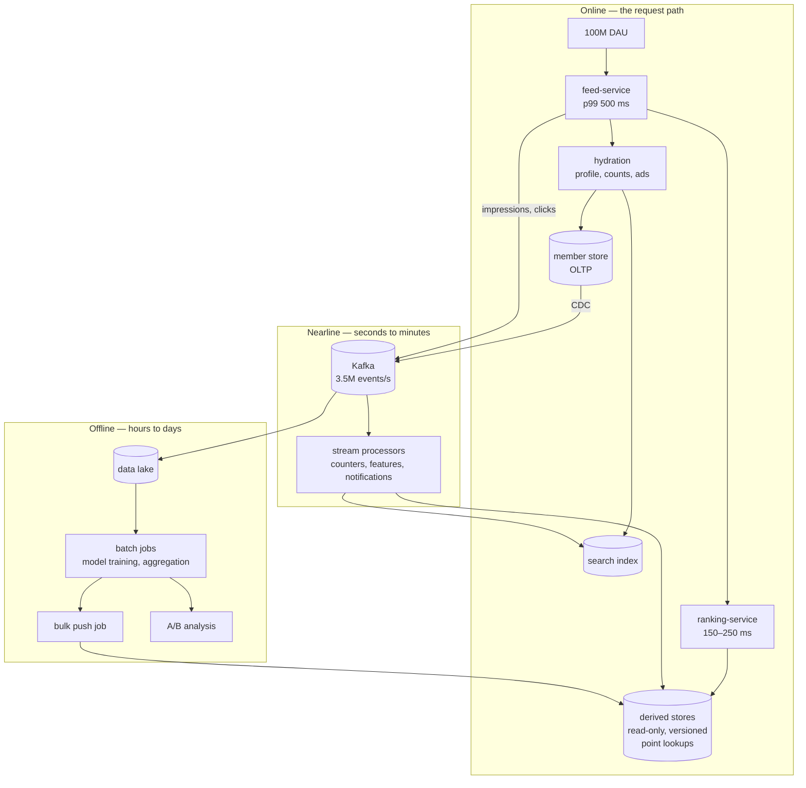

# Case Study — Corridor, a Professional Network Built on Derived Data

**The defining problem: the failure is a stale artefact, and it produces no error for hours.**

Every system so far fails in a way something can observe. Riverbend's checkouts error. Lumen's
feeds get slow. Gateline's sale collapses. Waypoint's matches get worse, and even that — a
quality failure — shows up in a business metric within minutes.

Corridor's characteristic failure shows up in **nothing**. A ranking model is nine days old
instead of nine hours. A derived dataset was pushed with 60% of its rows. A search index is
missing a shard. In every case:

- Request success rate: 100%.
- Latency: normal, sometimes better than normal.
- Every service: healthy.
- Every queue: empty.
- Users: served, promptly, with answers that are quietly worse.

The system is working perfectly and producing the wrong output, and it will keep doing so
indefinitely because nothing in the request path can tell.

This is the failure class that defeats every technique in docs 01 through 15, because all of them
assume that a failure eventually manifests as an error, a delay, or a saturated resource. This
doc is about the class that does not.

## The system

From [`../../../system-design-notes/LinkedIn`](../../../system-design-notes/LinkedIn/README.md).

**Scale.**

| | Value |
|---|---|
| Members | 1 billion |
| Monthly active | 300 million+ |
| Daily active | ~100 million |
| Feed views/day | tens of billions |
| Cards rendered per view | ~25 |
| Card impressions/day | **hundreds of billions** |
| **Tracking events/day** | **hundreds of billions** |
| Posts/day | tens of millions |
| Reactions and comments/day | hundreds of millions |
| Followers per member | median ~50, p90 ~500, influencers in the millions |
| Feed p99 (server side) | **500 ms**, of which ranking is 150–250 ms |
| Publish-to-visible p99 | **< 60 seconds** |

**The number that defines the architecture is the last-but-two: hundreds of billions of tracking
events per day.**

```
300,000,000,000 events/day ÷ 86,400 s ≈ 3,500,000 events/s
```

Three and a half million events per second, none of which is user-facing. Every one of them
exists to feed something offline — a ranking model, a recommendation index, an A/B analysis, a
notification decision, a search relevance signal, a fraud model. **Corridor's data volume is
dominated by data that no user ever sees and that is nonetheless the substance of the product.**

**The shape.**



Three tiers with completely different time constants: **online** (milliseconds), **nearline**
(seconds to minutes), **offline** (hours to days). The online tier is well instrumented and
well understood. **Almost every serious Corridor incident originates in the other two**, and
surfaces — if at all — in the first.

## Why derived data is a different failure class

A derived dataset is an artefact: a versioned, immutable blob produced by a pipeline and served
read-only. Corridor's derived-data platform works the way Venice does — a batch job builds a new
**version** of a store, the servers consume it, and when every partition has caught up a
controller **flips the active version**.

That model has excellent properties. Pushes are atomic from the reader's point of view. Rollback
is a version flip back. Readers never see a partial dataset.

And it has one property that creates this whole doc: **the previous version keeps serving,
perfectly, indefinitely, if the next push never arrives.**

```
Day 0:  push v41. Readers serve v41. ✓
Day 1:  the nightly job fails. No push. Readers serve v41. ✓ (no error)
Day 2:  the job fails again. Readers serve v41. ✓
Day 9:  readers are still serving v41.
        Success rate: 100%. Latency: normal. Recommendations: nine days stale.
```

The system is behaving exactly as designed at every step. The design's fault-tolerance — keep
serving the last good version — is precisely what hides the failure.

Compare the failure signatures:

| | An online failure | A derived-data failure |
|---|---|---|
| Symptom | Errors, latency | **None** |
| Detected by | Alerting, in seconds | A human noticing worse results, in days |
| Blast radius | Requests during the outage | **Every request until it is fixed** |
| Duration | Minutes | **Days to weeks** |
| Cost | Failed requests | Degraded product quality, wrong decisions, lost revenue |
| Recovery | Restart, fail over | Re-run the pipeline — which takes as long as the pipeline takes |

The row that matters most is duration. **An online outage is bounded by how fast you notice; a
derived-data failure is bounded by nothing.**

## The POF map

| Class | Where it lives at Corridor | Severity |
|---|---|---|
| `E` Edge | Standard; well solved | Low |
| `R` Sync RPC | Feed hydration fans out to ~30 services in a 500 ms budget (`S-03` tail arithmetic) | High |
| `P` Patterns | Everything on the feed path must be soft — a card that cannot be hydrated is dropped | High |
| `F` Feedback | Ranking changes alter engagement, which alters training data, which alters ranking (`CD-5`) | **Critical** |
| `D` Discovery | Standard | Low |
| `S` Storage | Member store is OLTP and well understood; derived stores are the risk | Medium |
| `T` Transactions | Few — the product is not transactional | Low |
| `C` Cache | Heavy caching; well understood | Medium |
| `Q` Async | 3.5M events/s. A pipeline stall is the primary incident source | **Critical** |
| `L` Locks | Few | Low |
| `G` Change | A ranking-model change is a deploy with no code and no rollout gate (`CD-1`) | **Critical** |
| `N` Capacity | Offline capacity contention between jobs (`CD-4`) | High |
| `I` Isolation | Regional; well solved online. **Offline pipelines are global and shared** | High |

Compare with Riverbend's and Lumen's maps. **Corridor's `T`, `L`, and `E` are nearly empty and
its `Q`, `G`, and `F` are critical**, because its product is not a transaction, it is a
continuously-recomputed opinion. The classes that matter are the ones about *change* and
*pipelines*, not the ones about *state* and *contention*.

## CD-1 · The ranking model that was nine days old

**What happened.** Feed engagement declined by 4% over nine days. It was attributed to
seasonality, then to a competitor, then to a product change. On day nine someone checking an
unrelated dashboard noticed the model version string had not changed since the 2nd.

The nightly training pipeline had been failing since day 1. Nine days of stale ranking.
Reconstructed revenue impact: roughly $2.4M.

**Mechanism.** The chain of non-detection is worth walking, because every link is a reasonable
engineering decision.

1. **The training job failed** on day 1, with a genuine error: a schema change in an upstream
   tracking event broke a feature-extraction step (`Q-12`).
2. **The job's failure alert went to a team distribution list**, where it joined the roughly 40
   daily alerts from the several thousand batch jobs Corridor runs. Nobody triaged it.
3. **The push job never ran**, because there was nothing to push. **No push means no error** —
   the push system correctly reported that it had not been asked to do anything.
4. **The serving tier kept serving v41.** Healthy. Fast. 100% success rate.
5. **Ranking quality metrics** — which Corridor does compute — declined gradually, within the
   range of normal daily variation, and no single day crossed a threshold.
6. **The 4% engagement decline** was real and visible and was attributed to three other causes
   before anyone checked the pipeline, because the pipeline was not on the list of things that
   could cause it.

**No component failed in a way anything was watching.** The job failed, and the job's failure
was an email.

**The fix — staleness as a first-class, enforced SLO.**

1. **Every derived store declares a maximum age**, and the *serving* tier — not the pipeline —
   enforces and reports it:

```
# The alert that would have caught this on day 1
max by (store) (time() - derived_store_active_version_created_timestamp_seconds)
  > derived_store_max_age_seconds
```

   The critical design point: **the consumer measures freshness, not the producer.** A producer
   that has died cannot report that it died. This is the same principle as doc 09's
   age-of-oldest-message: measure the age of what you have, not the health of what should be
   producing it.

2. **Freshness has tiers, and each tier has a defined action:**

| Store | Max age | Action when exceeded |
|---|---|---|
| Ranking model | 36 h | Page. Ranking is the product. |
| "People you may know" | 7 d | Ticket. Degrades slowly. |
| Search relevance features | 48 h | Page. |
| Company page aggregates | 7 d | Ticket. |
| Trending topics | 30 min | Page, and fall back to a non-personalised list. |

3. **Degrade explicitly past the limit.** A model older than 36 hours is not silently used; the
   service **falls back to the previous known-good simpler model** and emits a metric saying so.
   The failure becomes visible in the product's behaviour rather than hidden in it.

4. **Pipeline failure alerts routed to an owner with an SLA**, not to a list. And the honest
   organisational fix: with several thousand batch jobs, per-job alerting does not scale and will
   always be ignored. **The scalable signal is the artefact's age, because there are far fewer
   artefacts than jobs and each one has a consumer who cares.**

That last point generalises well beyond Corridor: **alert on the output, not on the process.**
Thousands of jobs produce hundreds of artefacts consumed by dozens of services. Monitor at the
narrowest layer.

## CD-2 · The push that completed with 60% of the data

**What happened.** A derived store holding member-to-skill mappings was pushed with 340 million
rows instead of 570 million. The push completed successfully and the version was flipped. For 14
hours, 40% of members had no skills — so they did not appear in skill-based searches, did not
receive relevant job recommendations, and were not matched by recruiters.

Success rate: 100%. Latency: better than usual (a smaller dataset).

**Mechanism.** The upstream Spark job read from a partitioned data-lake path. A partition had not
landed because *its* upstream job was late. The Spark job read the partitions that existed,
completed successfully, and produced a smaller — but structurally valid — dataset.

The push job validated what push jobs validate: that every partition was consumed, that
checksums matched, that no server lagged. **All of those passed.** The data was internally
consistent and externally wrong.

Then the controller flipped the version, because that is what it does when a push completes.

**The fix — validate the artefact against expectations, not only against itself.**

```
Gates before a version flip, all of which must pass:

1. Row count within 5% of the previous version.
   (340M vs 570M = 40% below. This alone catches it.)
2. Row count within 20% of the same day last week.
   Catches gradual drift that a day-over-day check misses.
3. Key-space coverage: a sample of 10,000 known keys must be present.
   Catches a missing partition even when the total count looks fine.
4. Value distribution: mean, p50, p99 of numeric fields within a tolerance
   of the previous version. Catches a unit change or a broken transform.
5. Null rate per column within tolerance.
6. Input completeness: every expected input partition present before the job
   starts, not discovered missing afterwards.
7. Shadow read: serve the new version to 1% of traffic and compare output
   quality metrics against the current version for 30 minutes.
```

Gate 6 is the one that would have prevented this entirely, and it is the cheapest: **a job that
depends on partitions should refuse to start until they exist, rather than processing what is
there.** The default behaviour of most data tooling is the opposite — read what you find — and
that default is wrong for anything that will be served.

Gate 7 is the strongest and is doc 11's canary applied to data. It catches the class of problem
where the data is complete and the *content* is wrong, which no structural check can find.

**And rollback must be one action.** Corridor's derived platform keeps the previous three
versions, so recovery is a version flip that takes seconds. **That property — an instantly
revertible artefact — is worth more than any amount of validation**, because validation catches
what you thought to check and rollback catches everything else.

## CD-3 · The tracking backlog that corrupted six weeks of decisions

**What happened.** A tracking pipeline fell behind by up to 9 hours for five days during a
capacity crunch. Events were not lost — they arrived, late. Nobody noticed, because the events
are not user-facing.

But A/B experiment analysis ran on a daily schedule over "yesterday's" data, which was
incomplete. Late-arriving events were disproportionately from users in one timezone band and from
mobile clients on slow networks — **a systematically biased sample.**

Six experiments were concluded during that window. Two were shipped based on results that were
wrong. One was a feed-ranking change that degraded engagement for three weeks before being
reverted.

**Mechanism.** The most damaging version of this failure class, because the corrupted output is
**a decision**, not a dataset. You can re-run a pipeline; you cannot un-ship a product change
someone made on bad evidence, and the wrongness of the evidence is discovered — if ever — long
after the decision.

Three specific properties made it invisible:

1. **The lag did not produce errors.** Consumers were consuming, just behind (`Q-01`).
2. **The analysis had no completeness check.** It queried "all events where `date = yesterday`"
   and got an answer. A smaller answer than usual, and an answer.
3. **The bias was not random.** If 20% of events had been missing uniformly at random, the
   experiment conclusions would mostly have survived. Missing 20% concentrated in specific user
   segments changes the result.

**The fix — completeness as a precondition for analysis.**

1. **Watermarks.** Every pipeline stage publishes a watermark: "all events with timestamp ≤ T
   have been processed." Downstream consumers **block until the watermark passes their window**
   rather than reading whatever has arrived:

```
Experiment analysis for 2026-09-14 does not run until
  watermark(tracking_pipeline) >= 2026-09-15T00:00:00Z + late_arrival_allowance
```

   The analysis is late instead of wrong. **That is always the right trade for a decision input**,
   and it is worth stating as a rule because the instinctive engineering preference is the
   opposite.

2. **Completeness metrics on every analysis.** The report states what fraction of expected events
   it saw, compared against the same weekday historically, **broken down by the dimensions the
   experiment segments on** — because an aggregate completeness of 95% can hide 60% completeness
   in one segment.

3. **Event-time, not processing-time, windows.** An event that arrives late is still attributed
   to the window it belongs to, so a re-run after the backlog clears produces the correct answer.
   Processing-time windowing makes late data permanently mis-attributed.

4. **Automatic re-run on watermark advance.** When late data arrives, affected analyses re-run,
   and **a changed conclusion generates an alert to the decision owner.** This is the one that
   closes the loop: it means a decision made on incomplete data is eventually contradicted by
   the system rather than by a person noticing.

5. **Lag SLOs on the tracking pipeline with paging alerts**, because a pipeline feeding decisions
   is a production system regardless of whether users touch it.

**The generalisable lesson**: *the most expensive consequence of a data-pipeline failure is
usually not the bad data; it is the decision made from it.* Systems that produce decision inputs
need completeness guarantees, not just eventual correctness.

## CD-4 · The search index that lost a shard

**What happened.** One of 64 search-index shards failed to build during a nightly rebuild. The
index was deployed with 63 shards. For 31 hours, roughly 1.6% of members were unfindable by
search — including, by chance, several enterprise customers' recruiters, which is how it was
discovered.

Search latency: improved. Search error rate: zero. Result counts: slightly lower, within normal
variation.

**Mechanism.** `S-03` inverted. A scatter-gather query over 64 shards *tolerates* a missing shard
by design — the system returns results from the shards that answered, because that is the correct
behaviour when one shard is slow. Applied to a shard that does not exist, the same tolerance
silently returns incomplete results.

**The design tension is real**: a search that fails entirely because one shard of 64 is slow is a
worse product than one that returns 98.4% of results. Partial results are the right default. The
problem is that **"partial because a shard is slow right now" and "partial because a shard has
not existed for 31 hours" are the same thing to the query layer** and completely different
things to the operator.

**The fix — distinguish transient partiality from structural partiality.**

1. **The query response carries a completeness figure**: `shards_queried / shards_expected`.
   `shards_expected` comes from the index's manifest, not from what is registered — so a missing
   shard is missing rather than unknown.
2. **Alert on sustained incompleteness.** A shard missing for 30 seconds is a transient event; a
   shard missing for 10 minutes is an incident. The alert is on duration, not occurrence.
3. **The index build is atomic across shards.** A build that produces 63 of 64 shards **does not
   deploy**. This is the same version-flip discipline as `CD-2`: an artefact is complete or it is
   not published.
4. **Per-shard freshness monitoring**, so a shard that built but is stale is also caught.
5. **A synthetic query set** — 10,000 known documents, one per shard-range, queried every minute.
   If any is not found, a shard is missing or broken. This is the search equivalent of
   `CD-2`'s key-space coverage gate, running continuously.

## CD-5 · The dependency graph nobody could see

**What happened.** A change to how one tracking event's `member_id` field was populated — a
one-line change in a mobile client, shipped through the normal process — caused, over the
following two weeks: a notification volume drop of 12%, a "people you may know" quality
regression, a broken company-analytics dashboard, and an anomaly in an ads-targeting segment.

Nobody connected the four to each other or to the original change for eleven days.

**Mechanism.** The offline dependency graph. One tracking event feeds a dozen pipelines, each
producing artefacts consumed by more pipelines, which produce artefacts served online. Nobody
owns the graph; each team owns their node.

```
mobile client: profile_view event
  → 14 pipelines consume it directly
    → 9 produce derived artefacts
      → 23 downstream pipelines consume those
        → 41 derived stores
          → ~60 online services read them
```

A change at the root has a blast radius nobody can see, propagating over **days**, because each
layer's schedule delays the effect. The four symptoms appeared on days 2, 4, 7, and 11 — far
enough apart that nothing looked correlated.

**This is the `G`-class problem (doc 11) with a multi-day propagation delay**, which defeats the
"what changed in the last 60 minutes?" heuristic completely. The change was fourteen days ago and
it was in a mobile client.

**The fix — treat the data graph as an architectural artefact.**

1. **Lineage tracking.** Every pipeline declares its inputs and outputs; the graph is built
   automatically and is queryable. "What depends on `profile_view`?" must be answerable in
   seconds. Without this, impact analysis is impossible and nobody attempts it.
2. **Contract tests on event schemas** (`Q-12`). A tracking event is a contract with dozens of
   consumers who do not know each other. Changing the semantics of a field — **not the type, the
   semantics** — is a breaking change and the schema registry cannot catch it. Corridor's answer:
   a required `semantic_version` on every event field, and a consumer-declared expectation.
3. **Change impact analysis in review.** A pull request touching a tracking event's population
   shows the downstream graph and requires acknowledgement from the owners of the first tier of
   consumers. This is expensive and it is proportionate to a change with a 60-service blast
   radius.
4. **Anomaly detection on every derived artefact's statistical profile**, not just its freshness.
   Row count, null rates, cardinality, and value distributions, compared against history. This
   catches the effect even when nobody predicted the cause — and it was what eventually found
   this, on day 11, by accident.
5. **A long lookback in incident review.** For quality regressions, the question is not "what
   changed in the last hour" but "what changed in the last **month**, anywhere in the lineage of
   this artefact." Corridor's incident template now includes the lineage query.

## The feedback loop in the product itself

Worth its own short section, because it is the strangest failure mode in the collection and it
appears in every ranked-content system.

Corridor's ranking model is trained on engagement data. Engagement data is produced by users
interacting with content that the ranking model chose. **The model's output becomes its own
training input.**

```
The model ranks content type A highly
  → users see more A
    → users engage with more A (because they see more of it)
      → training data shows A has high engagement
        → the model ranks A even more highly
```

This is a positive feedback loop with a training-cycle time constant of one day, and it produces
real pathologies: content diversity collapses; a small initial bias amplifies over weeks; and a
new content type can never gain traction because it is never shown enough to generate the
engagement data that would justify showing it.

It is doc 04's metastability in a system where the feedback path runs through human behaviour
and a daily retraining job.

**The mitigations are the same shape as every other control-loop fix in this collection:**

- **Exploration**: a fraction of impressions are deliberately randomised, generating unbiased
  training data. This is the damping term, and it costs measurable short-term engagement to buy
  long-term model quality — a trade that has to be defended repeatedly.
- **Inverse-propensity weighting**: training examples are weighted by the inverse of the
  probability the model would have shown them, which corrects for the selection bias
  mathematically rather than behaviourally.
- **Diversity constraints** applied at serving time, as a hard constraint the model cannot
  optimise away.
- **Holdout populations** that never receive the model's output, providing a clean baseline. A
  permanent 0.5% holdout is the only way to know what the model is actually doing over months.

The generalisable point, which extends `WP-3`: **any system whose output influences its future
input is a control loop, and if the feedback path includes a training job, its period is days and
its instability is invisible for weeks.**

## Stack choices and their POF profile

| Concern | Corridor's choice | POF it buys | POF it creates | Why not the alternative |
|---|---|---|---|---|
| Derived serving | Versioned read-only store with atomic version flips | Atomic pushes; instant rollback; predictable read latency | **Serves stale forever if pushes stop** (`CD-1`) | Live-updated store — no atomic snapshot, no rollback, partial states visible |
| Event transport | Kafka at 3.5M events/s | Durable, replayable, decoupled | Lag is silent (`Q-01`); schema is a contract with unknown consumers | Direct writes — couples every producer to every consumer |
| Nearline | Stream processors with local state | Seconds-fresh counters and features | State restoration on rebalance; checkpointing cost | Batch only — publish-to-visible would be hours, not 60 s |
| Analytics serving | A columnar real-time OLAP store | Sub-second aggregations over billions of rows | Segment management; ingestion lag | A data warehouse — minutes, not milliseconds, for member-facing analytics |
| CDC | Log-based change capture from the member store | Derived stores follow the source without dual writes (`T-01`) | Connector failure retains WAL (`S-14`); schema coupling | Application dual writes — the failure mode doc 07 exists to prevent |
| Ranking | A separate service with a hard timeout and a simpler fallback model | Independently deployable; degrades to a working answer | A soft dependency that must be genuinely soft | In-process — couples model deploys to service deploys |
| Feed hydration | ~30 parallel calls, all soft, with a completeness figure | Renders whatever arrived within budget | Silent quality degradation if a hydrator is down | Sequential or all-required — `S-03` tail arithmetic makes both unusable |

## What to take away

1. **Corridor's characteristic failure produces no error, no latency change, and no saturation.**
   It is a stale or incomplete artefact served perfectly. Every technique in docs 01–15 assumes
   failures eventually manifest; this class does not.
2. **A versioned derived store's fault tolerance — keep serving the last good version — is
   exactly what hides the failure.** The previous version serves indefinitely if the next push
   never arrives, and an online outage is bounded by how fast you notice while this is bounded by
   nothing.
3. **The consumer must measure freshness, not the producer.** A pipeline that died cannot report
   that it died. Age of the artefact you are serving is the signal, and it is the same principle
   as age-of-oldest-message in doc 09.
4. **Alert on the output, not the process.** Thousands of jobs produce hundreds of artefacts
   consumed by dozens of services — monitor at the narrowest layer, because per-job alerting at
   that count is guaranteed to be ignored.
5. **Every derived store needs a declared maximum age, a paging or ticketing tier, and an
   explicit degradation past the limit.** A model older than its limit must fall back visibly,
   not be used silently.
6. **Validate artefacts against expectations, not only against themselves.** A push that is
   internally consistent and 40% short passes every structural check. Row count versus history,
   key-space coverage, value distributions, and — cheapest and most effective — **refuse to start
   a job whose input partitions have not landed.**
7. **An instantly revertible artefact is worth more than any amount of validation**, because
   validation catches what you thought to check and rollback catches everything else.
8. **The most expensive consequence of a pipeline failure is usually the decision made from it**,
   not the data. Six experiments concluded on a biased sample; two shipped; one degraded the
   product for three weeks.
9. **Analyses must block on a watermark rather than reading what has arrived.** Late is always
   better than wrong for a decision input, and completeness must be reported per segment — an
   aggregate 95% can hide 60% in the segment the experiment measures.
10. **Partial results are the right default for scatter-gather and they hide structural
    failures.** Distinguish "a shard is slow right now" from "a shard has not existed for 31
    hours" by carrying `shards_queried / shards_expected` and alerting on sustained
    incompleteness, and never deploy an index build that produced 63 of 64 shards.
11. **The offline dependency graph has a blast radius nobody can see and a propagation delay of
    days**, which defeats "what changed in the last 60 minutes?" entirely. Lineage must be
    automatic and queryable, and quality-regression investigations need a month-long lookback
    across the lineage.
12. **A tracking event is a contract with dozens of consumers who do not know each other**, and
    changing a field's *semantics* is a breaking change no schema registry can catch.
13. **A ranked-content system trains on data its own output produced**, which is a positive
    feedback loop with a period of one day and instability that is invisible for weeks.
    Exploration, propensity weighting, diversity constraints, and a permanent holdout are the
    damping terms — and the holdout is the only one that tells you what is actually happening.

Next: [21-case-service-mesh-northlight.md](21-case-service-mesh-northlight.md), which is about
the platform layer that removes a hundred failure points from application code and creates six
new ones, all of them global.
