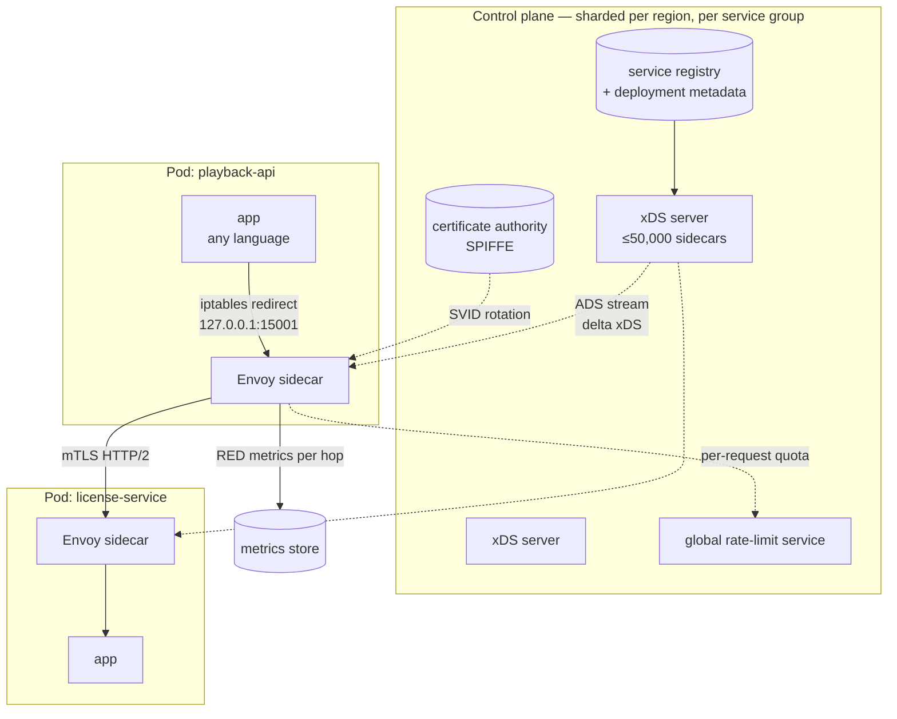

# Case Study — Northlight, a 100,000-Sidecar Service Mesh

**The defining problem: the mesh removes a hundred failure points from application code and
creates six new ones, all of them global.**

Every technique in docs 02 and 03 — timeouts, retries with budgets, circuit breakers, outlier
ejection, bulkheads, load balancing, mTLS, deadline propagation — has to be implemented
somewhere. In a 2,500-service polyglot estate, "somewhere" means either **2,500 implementations
in a dozen languages, each configured by a different team**, or **one implementation in a proxy
next to every process.**

Northlight chose the proxy. This doc is about what that bought and what it cost, because both
are large and the cost is rarely stated as clearly as the benefit.

The short version: the mesh made Northlight's resilience *uniform, correct, and centrally
improvable*, which is worth an enormous amount at 2,500 services. It also created a control plane
whose bad day is every service's bad day, and moved a class of failure from "one team's service"
to "the platform."

## The system

From [`../../../system-design-notes/serviceMeshNetflixScale.md`](../../../system-design-notes/serviceMeshNetflixScale.md).

**Scale.**

| | Value |
|---|---|
| Sidecars (Envoy) | **100,000+**, each holding an xDS stream |
| Services | ~2,500 |
| Upstream clusters per service | 5–200 |
| Aggregate route entries | millions |
| Endpoint mutations, fleet-wide | ~100/s steady state |
| Sidecar latency overhead | **~0.3–0.5 ms typical, p99 target < 5 ms** |
| Sidecars per xDS server | **≤ ~50,000** (a hard sharding rule) |
| Config propagation | change → every sidecar in **< 60 s** |
| Outlier ejection | 5 consecutive 5xx → eject for 30 s, with backoff |

**The topology.**



**The request path through two sidecars**, which is the thing to hold in mind for the rest of
the doc:

```
app makes a plain HTTP call to "license-service"
  → iptables redirects the outbound socket to the local Envoy on 127.0.0.1:15001
  → Envoy matches the route (RDS), picks a cluster (CDS), picks an endpoint (EDS)
  → applies: timeout, retry policy, circuit breaker, outlier ejection, rate limit
  → presents its SPIFFE identity, establishes/reuses an mTLS HTTP/2 connection
  → the destination's inbound Envoy terminates mTLS, applies RBAC
  → forwards to the app on localhost:<port>
  → both sidecars emit RED metrics with the route, cluster, and upstream host
```

The application made an unencrypted, unauthenticated, un-retried, un-timed-out HTTP call to a
hostname. Everything else happened in the proxies. **That is the entire value proposition**, and
it is genuinely large.

## What the mesh bought, quantified

Not abstractly. These are the specific problems from earlier docs that the mesh solves *by
construction* for all 2,500 services.

| Problem | Before the mesh | With the mesh |
|---|---|---|
| `R-01` missing timeouts | Every client in every language, configured by 2,500 teams | A default timeout on every route, enforced by the proxy. Impossible to omit. |
| `R-05` retry amplification | Uncoordinated, invisible, `a^n` | One retry policy, one budget, measurable fleet-wide |
| `R-11` HTTP/2 defeats L4 balancing | Every gRPC shop's surprise | The sidecar balances per-request across all endpoints |
| `P-01` breaker misconfiguration | Per-language libraries with different semantics | One implementation, one set of semantics |
| `D-04` the black-hole instance | Undetected until someone noticed | Outlier ejection after 5 consecutive 5xx, in seconds, everywhere |
| `E-12` in-path auth calls | Each service rolls its own | mTLS identity at the transport layer; no per-request call |
| Observability gaps | Every service instruments differently, or not at all | Identical RED metrics per hop, for every hop, with no application change |
| Fault injection (doc 15) | Requires application support | One config change, scoped to a subset, reversible in seconds |
| Traffic shifting (doc 11) | Custom per service | Weighted routing, native |

**The number that justifies it.** Before the mesh, a tail-latency fix in the shared client
library took **quarters** to reach the fleet: a library release, then 2,500 teams upgrading on
their own schedules, in a dozen languages, with several languages having no shared library at
all. After the mesh, a sidecar image bump reaches every service in **days**, and a configuration
change in **under 60 seconds**.

That is a 100× improvement in the rate at which the organisation can improve its own resilience,
and it compounds — every fix after the first also lands in days.

**And the honest cost of the alternative.** The reason Northlight moved was not elegance. With
2,500 services in Java, Node, Python, Go, and a long tail of others, the pre-mesh state was:
the JVM services had excellent resilience (a mature in-process library), and everything else had
whatever its team had written. **The mesh's real achievement was raising the floor**, not the
ceiling.

## What the mesh cost, quantified

This is the part usually left out.

### The latency tax

Two sidecar hops per call. At 0.3–0.5 ms each, that is **0.6–1.0 ms added per hop** in the steady
state, and the p99 target is 5 ms.

For a request that makes 12 downstream calls in a chain:

```
12 calls × 0.8 ms = 9.6 ms added at p50
12 calls × 5 ms   = 60 ms added at p99 in the worst case
```

Ten milliseconds of p50 on a request whose budget might be 200 ms is 5% — acceptable. Sixty
milliseconds of p99 is not always. **The mesh tax is proportional to call depth**, which means it
penalises exactly the architectures that are already fragile (doc 00's availability arithmetic),
and it is an argument for reducing hops that has nothing to do with the mesh.

### The resource tax

An Envoy sidecar at Northlight's configuration uses roughly 100–150 MiB of memory and 0.1–0.3
vCPU at moderate throughput. At 100,000 sidecars:

```
Memory: 100,000 × 125 MiB  = 12.5 TiB
CPU:    100,000 × 0.2 vCPU = 20,000 vCPU
```

**Twelve and a half terabytes of memory and twenty thousand cores** doing nothing but proxying.
For a fleet of that size the mesh is typically 5–15% of total infrastructure cost, and it is a
line item that has to be justified against the alternative — which is 2,500 teams' worth of
engineering effort, so it usually justifies itself. But it should be computed, not assumed.

The memory figure is the one that surprises people, because it is per-pod and therefore scales
with pod count rather than with traffic. A service with 500 tiny pods pays 62 GiB of sidecar
memory regardless of how little traffic it serves. **Sidecar overhead makes many-small-pods
deployments disproportionately expensive**, which is a real architectural pressure the mesh
introduces.

### The complexity tax

The mesh does not remove the failure modes from docs 02 and 03; it **moves them into a system
whose configuration language, failure modes, and debugging tools are different from the
application's**. When a request fails, the question "is this the app or the mesh?" is now a
question, and answering it requires knowing Envoy.

Northlight's measured effect: the mean time to diagnose a request-path failure went **up** in the
first year after mesh adoption and down thereafter, as the platform team built mesh-aware
tooling and engineers learned to read `/config_dump`. That first year is a real cost and it is
worth planning for rather than being surprised by.

## The POF map

| Class | Where it lives at Northlight | Severity |
|---|---|---|
| `E` Edge | The sidecar is now part of every request path, including the edge | High |
| `R` Sync RPC | Solved uniformly — the mesh's core value | **Low** (was critical) |
| `P` Patterns | Solved uniformly, and **misconfigurable globally** (`NL-3`) | Medium |
| `F` Feedback | Retry budgets are enforced, so amplification is bounded — a large win | Low |
| `D` Discovery | **The control plane is the single largest POF in the system** (`NL-2`) | **Critical** |
| `S` Storage | Unchanged; the mesh does not help with data | — |
| `T` Transactions | Unchanged, and the mesh's default retries can *create* duplicates (`NL-3`) | Medium |
| `C` Cache | Unchanged | — |
| `Q` Async | Unaffected — the mesh handles synchronous traffic only, which is a gap (see below) | — |
| `L` Locks | Unchanged | — |
| `G` Change | **A config push reaches 100,000 sidecars in under 60 seconds** (`NL-1`) | **Critical** |
| `N` Capacity | The resource tax; control-plane capacity for the failure case | High |
| `I` Isolation | Control-plane sharding is the isolation boundary that matters | High |

**The shape of this map is the whole story**: the mesh moved severity *out of* `R`, `P`, and `F`
— the per-service classes — and *into* `D` and `G` — the platform classes. It traded many small
failure points for a few large ones.

Whether that is a good trade depends on a question worth asking explicitly: **would you rather
have 2,500 independent mediocre implementations or one excellent implementation with a global
blast radius?** At 2,500 services the answer is clearly the second. At 20 services it is just as
clearly the first.

## NL-1 · The mTLS policy that isolated a workload

**What happened.** A security team enabled `STRICT` mTLS for a namespace, as part of a
well-planned rollout. Within 45 seconds, one service in that namespace became completely
unreachable. It carried 8% of playback session initiations. Total outage for that function: 22
minutes, most of which was diagnosis.

**Mechanism.** `STRICT` mTLS means the destination sidecar rejects any connection that does not
present a valid client certificate. That is the correct and desired behaviour.

One workload in the namespace had **no sidecar**. It was a legacy service running on VMs outside
the orchestrator, brought into the namespace's logical grouping for organisational reasons but
never injected. It called services in the namespace with plain HTTP. Under `PERMISSIVE` mode
(the previous setting) those calls were accepted. Under `STRICT` they were rejected instantly.

The policy was valid. The rollout was planned. The inventory of who was in the namespace was
based on the orchestrator's view, and the VM-based workload was not in it.

**Why it took 22 minutes to diagnose.** The symptom was `upstream connect error or disconnect/
reset before headers. reset reason: connection failure` — an Envoy message that looks like a
network problem. The application logs showed a connection reset. Nothing said "TLS handshake
rejected due to policy", because from the client's perspective there was no TLS.

**The fix.**

1. **Never go straight to `STRICT`.** The sequence is: enable `PERMISSIVE`, **wait and measure**,
   confirm that the fraction of plaintext traffic is zero, then enable `STRICT`. The measurement
   step is the one that gets skipped, and it is the only one that matters.

```
# The metric that gates the STRICT rollout
sum by (destination_service) (
  rate(istio_requests_total{connection_security_policy="none"}[1h])
) > 0
# Must be zero for the full observation window before STRICT is applied.
```

2. **An inventory that includes non-mesh workloads.** The mesh's view of a namespace is not the
   same as the organisation's, and the gap is exactly where this failure lives.
3. **Staged by scope, with a gate** (doc 05, `D-08`): apply to 1% of destination workloads, then
   one service, then the namespace — with an automated abort on error-rate regression at each
   step. A 45-second, namespace-wide application of a security policy has the blast radius of a
   deploy and none of the process.
4. **Better error attribution.** Northlight added a policy-rejection counter and made the Envoy
   response include a distinguishable code for RBAC and mTLS rejections, so "network problem"
   and "you are not allowed" stop looking the same.

## NL-2 · The control plane that collapsed during an AZ failure

**What happened.** An availability zone failed, taking roughly a third of the fleet. Expected
impact: a third of capacity, absorbed by headroom, with elevated latency. Actual impact: a
**complete, fleet-wide** routing failure lasting 9 minutes, in all zones, including the healthy
ones.

**Mechanism.** Doc 05's `D-09`, in full, with Northlight's numbers.

```
t=0     AZ-C fails. ~33,000 of 100,000 sidecars disappear.
t=0–5s  Every remaining sidecar needs updated endpoint information, because a
        third of every service's endpoints just vanished.
        Endpoint mutations: ~33,000 removals in seconds, versus a steady state
        of ~100/s. A 300× spike in control-plane work.
t=5s    The orchestrator begins rescheduling AZ-C's workloads into AZ-A and AZ-B.
t=30s   ~33,000 NEW sidecars start. Each opens an xDS stream and requests a full
        initial configuration snapshot.
        A snapshot for a service with 200 upstream clusters is several MiB.
        33,000 × ~3 MiB = ~100 GiB of configuration to generate, serialise, and push.
t=45s   xDS servers saturate: CPU at 100%, push latency climbing from
        milliseconds to tens of seconds.
t=60s   The 67,000 SURVIVING sidecars cannot get their endpoint updates, so they
        keep routing to endpoints in the dead zone.
        → 33% of requests now go nowhere, in every zone.
t=90s   Outlier ejection partially compensates (dead endpoints get ejected after
        5 consecutive failures), but max_ejection_percent caps it at 50% and
        the ejections expire after 30 s, so traffic returns to the dead endpoints
        repeatedly.
t=9m    Control plane recovers as the snapshot backlog drains. Routing corrects.
```

**The blast radius went from 33% to 100%, and the mechanism was the recovery.**

Two details make it worse than the bare description suggests. First, **the surviving sidecars'
failure was silent from their own perspective** — they had configuration, it was just wrong.
Second, the outlier ejection that partially saved things also caused a 30-second oscillation
(`P-04`), because ejected endpoints were periodically re-tried.

**The fix — all of doc 05's prescriptions, applied.**

1. **Control-plane sharding**, with the rule that no xDS server serves more than ~50,000
   sidecars, partitioned per region and per service group. A saturated shard affects its shard's
   sidecars, not the fleet. **This is cell architecture (doc 13) applied to the control plane**,
   and it is the highest-value fix.
2. **Delta xDS**, so an endpoint change sends the changed endpoints rather than the full cluster.
   A 10,000-endpoint cluster churning 50 endpoints/s sends 50 updates, not 10,000. This reduced
   steady-state control-plane traffic by roughly two orders of magnitude and, more importantly,
   made the failure-case traffic tractable.
3. **Admission control on the control plane.** New xDS stream establishment is rate-limited. A
   sidecar that waits 30 seconds for its initial configuration is fine — it is not serving yet —
   while a control plane that falls over is not. This inverts the priority correctly: **existing
   sidecars' updates outrank new sidecars' snapshots.**
4. **Jittered reconnect on the sidecar**, with a cap, so 33,000 sidecars do not arrive in the
   same second.
5. **Warm snapshot caching**: the control plane pre-computes and caches snapshots per service
   version, so a new sidecar for a known service gets a cached blob rather than a fresh
   computation.
6. **Capacity-planned for the failure case.** The control plane is sized for "one AZ just died",
   not for Tuesday. That is a 300× difference in peak work and it costs real money, and it is the
   correct expenditure.
7. **Fail-static verified continuously.** Sidecars persist last-known-good configuration to local
   disk and never expire it because the control plane is unreachable. Northlight runs the doc 15
   experiment — block the control plane for 15 minutes — monthly.

## NL-3 · The fleet-wide retry policy

**What happened.** A platform engineer enabled a default retry policy — 3 attempts on
`5xx,gateway-error,connect-failure` — for all routes, to improve resilience. It did improve
resilience for most services. It also produced, over the following three weeks, duplicate
charges in the billing service and doubled entitlement grants.

**Mechanism.** Doc 02's `R-04`, at platform scale. A fleet-wide retry default applies to `POST`
and `PUT` routes that are not idempotent. The mesh cannot know which routes are safe to retry;
only the service owner can.

And simultaneously, `R-05`: the mesh's retries composed with retries the applications were
already doing, so the amplification exponent increased by one everywhere at once.

**Why it took three weeks to find.** Doc 14's row `T`: both the original and the retry succeeded,
so no error metric moved. It was found by billing reconciliation.

**The fix.**

1. **Retries are opt-in per route, never a fleet default.** Non-idempotent methods (`POST`,
   `PATCH`) get no retries unless the route explicitly declares itself idempotent — and that
   declaration requires the service owner's sign-off, recorded in the route configuration.
2. **`retryOn` excludes `5xx` by default**, keeping only `connect-failure`, `refused-stream`, and
   `reset` — the cases where the request provably did not reach the application (doc 02's error
   table). A 500 means the app ran and failed; retrying it reproduces the failure and adds load.
3. **A retry budget** (`retry_budget`), capping retries at 10% of active requests per cluster.
   Enforced by the mesh, which is the right place for it because only the mesh sees all the
   traffic.
4. **The `x-envoy-retry-on` header is stripped at the edge**, so a client cannot request retry
   behaviour the service owner did not authorise.
5. **Amplification monitoring**: `envoy_cluster_upstream_rq_retry / envoy_cluster_upstream_rq`
   per cluster, alerted above 0.1. The mesh makes this measurable fleet-wide for the first time,
   which is itself a significant benefit.

**The general lesson, and it is the central tension of platform engineering**: *a platform
default is applied to systems the platform team does not understand.* Defaults must be the safe
choice, and safety here means the conservative one — no retries — with opt-in for the cases where
the owner knows better. **A platform default that is right for 90% of services and catastrophic
for 10% is a bad default**, because the 10% is where the money is.

## NL-4 · The sidecar lifecycle races

**What happened.** Two recurring, low-grade failures that together accounted for a steady 0.3%
error rate nobody could explain.

*Race one — startup.* A pod starts. The application container is ready in 400 ms and immediately
makes an outbound call. The Envoy sidecar takes 2 seconds to receive its initial configuration.
The iptables rules are already in place, so the call is redirected to a sidecar that has no
route for it. The application sees a connection refused, logs an error, and — depending on its
startup logic — either retries or crashes.

*Race two — shutdown.* A pod terminates. `SIGTERM` goes to all containers. Envoy exits
immediately. The application, which is finishing an in-flight request that requires an outbound
call, finds the sidecar gone. The request fails.

Both races are structural: **the sidecar and the application are separate containers with
independent lifecycles, and the application depends on the sidecar for all networking.**

**The fix.**

1. **Startup ordering.** Kubernetes native sidecars (an `initContainer` with `restartPolicy:
   Always`) guarantee the sidecar starts and becomes ready before application containers start.
   Before that feature existed, the workaround was a `holdApplicationUntilProxyStarts` setting or
   an application-level retry loop on startup — and both are worse.
2. **Shutdown ordering.** The sidecar must outlive the application:

```yaml
# The application's preStop drains first; the sidecar exits last.
# Envoy is configured with a drain period longer than the app's grace period.
lifecycle:
  preStop:
    exec:
      command: ["/bin/sh", "-c", "sleep 15"]   # app: stop accepting, finish in-flight
terminationGracePeriodSeconds: 60
# Sidecar: EXIT_ON_ZERO_ACTIVE_CONNECTIONS + a drain duration > the app's grace
```

3. **Never make the application depend on the sidecar for liveness.** A liveness probe that goes
   through the sidecar will fail during sidecar restarts and restart a healthy application
   container — doc 01's `E-09` rule, applied to the pod's own internals.

These races are the most common operational complaint about sidecar meshes, and they are entirely
solvable. They are also the reason sidecar-less approaches (per-node proxies, eBPF-based
dataplanes, gRPC's proxyless xDS) exist and are gaining ground — they trade these races, and the
per-pod resource tax, for a coarser failure domain.

## NL-5 · The configuration that froze for six weeks

**What happened.** A subset of sidecars — roughly 4,000 of them — stopped receiving configuration
updates. They kept working, routing to a snapshot of the world from six weeks earlier. The
failure was discovered when one of those services began sending traffic to a decommissioned
cluster whose IP range had been reassigned.

**Mechanism.** Doc 05's `D-07`. The control plane began emitting a field that older Envoy
versions did not understand. Those sidecars **NACKed** the configuration — rejected the update
and kept their previous one.

A NACK is a correct, defensive behaviour: better to keep a known-good configuration than to
apply one you cannot parse. And it means the sidecar silently stops updating, forever, while
appearing completely healthy.

**Why nobody noticed.** The sidecars were serving traffic successfully. Their metrics were
normal. The control plane's aggregate ACK rate was 96%, which nobody had an alert on because
nobody had thought about what the other 4% meant.

**The fix.**

1. **Alert on NACK rate and on per-node config staleness**, which are the two metrics that
   detect this:

```
# Any rejection is a problem
sum by (type_url, node_version) (rate(envoy_cluster_manager_cds_update_rejected[5m])) > 0

# And the consequence: nodes whose last successful update is old
max by (node_id) (time() - xds_last_successful_update_timestamp_seconds) > 600
```

   The second one is the more important, because it catches staleness whatever the cause — the
   same "measure the artefact's age, not the producer's health" principle as Corridor's `CD-1`.

2. **Version-gated config generation.** The control plane knows each sidecar's Envoy version from
   its node metadata, and emits only fields that version understands. This is expand–contract
   (doc 11, `G-08`) applied to a wire protocol.
3. **A maximum sidecar age.** Northlight requires every sidecar to be restarted within 30 days,
   which bounds the version spread the control plane must support **and** continuously exercises
   the restart path — two benefits from one policy.
4. **A canary fleet of the oldest supported version** that receives every config change first, so
   an incompatible field is caught by a machine rather than by a decommissioned IP range being
   reassigned.

## NL-6 · What the mesh does not cover

Worth a short section, because the gap causes real incidents at organisations that assume the
mesh handles everything.

| Not covered | Why | What fills the gap |
|---|---|---|
| **Asynchronous traffic** | The mesh handles synchronous connections. Kafka producers and consumers do not go through it in any useful way | Doc 09's discipline, implemented in client libraries — and it therefore has all the per-language duplication the mesh was adopted to remove |
| **Database connections** | Technically proxyable, and the mesh has no useful notion of a query, a transaction, or a connection pool | Doc 06: pooling, proxies like PgBouncer, application-level discipline |
| **Application-level correctness** | The mesh sees requests, not meaning. It cannot know about idempotency, sagas, or reconciliation | Doc 07 |
| **Cache behaviour** | Not in the mesh's model at all | Doc 08 |
| **The retry/idempotency interaction** | The mesh can retry; only the application knows whether that is safe | `NL-3`'s opt-in discipline |
| **Cost of the call** | The mesh treats all requests as equal; a request costing 400 ms of CPU and one costing 1 ms get the same budget | Application-level criticality and cost accounting (doc 03, `P-10`) |

The first row is the most consequential. **Northlight's mesh covers its synchronous traffic
beautifully and its asynchronous traffic not at all**, so the event-driven half of the estate
still has 2,500 teams' worth of inconsistent client configuration. Several organisations are
working on extending mesh-like policy to messaging; none of it is mature. If your system is
predominantly event-driven, a mesh solves a smaller fraction of your problem than the marketing
suggests.

## When to adopt a mesh, and when not to

The honest decision procedure.

**Adopt a mesh when most of these are true:**

- **More than roughly 50 services**, or more than two or three languages. Below that, a shared
  client library is cheaper, simpler, and has no control plane.
- **You cannot get consistent resilience into applications.** This is the real test. If you have
  one language and a good shared library that teams actually use, you already have most of the
  mesh's benefit.
- **You need mTLS everywhere** for compliance and cannot do it in every application.
- **You need uniform, per-hop observability** and cannot get it by instrumenting applications.
- **You have a platform team that can operate a control plane.** This is a hard prerequisite: the
  mesh moves failures from application teams to the platform team, and if there is no platform
  team, the failures simply have no owner.

**Do not adopt a mesh when:**

- You have fewer than about 20 services. The control plane is more complexity than it removes.
- You are predominantly event-driven. The mesh covers the wrong half.
- Your latency budget cannot absorb 0.6–1.0 ms per hop, multiplied by your call depth.
- You do not yet have progressive deployment, load shedding, and basic observability. **A mesh
  amplifies whatever discipline you have**, including its absence — adopt it after doc 13's
  ordering, not before.
- Nobody will own it. An unowned mesh is a global single point of failure operated by nobody, and
  that is strictly worse than no mesh.

**The middle options, which are often the right answer and are under-considered:**

| Option | What it gives | What it costs |
|---|---|---|
| **A shared client library** | Consistent resilience, zero latency tax, zero control plane | One per language; slow to update; teams can opt out |
| **Proxyless xDS** (gRPC's built-in xDS client) | Mesh control-plane benefits with no sidecar hop and no per-pod overhead | gRPC only; language support varies |
| **Per-node proxy** instead of per-pod | Much lower resource tax (one proxy per node, not per pod) | A coarser failure domain — one proxy's failure affects every pod on the node |
| **eBPF dataplane** | No sidecar; lower latency and overhead | Less mature for L7; kernel version constraints; harder to debug |
| **Mesh for L4/mTLS only**, resilience in the app | Identity and encryption without the L7 complexity | Two places to reason about |

Northlight uses a full sidecar mesh because 100,000 instances across 2,500 services in a dozen
languages is the case it is designed for. **Most organisations asking the question are not that,
and the middle options deserve more consideration than they usually get.**

## What to take away

1. **A mesh does not remove failure points; it relocates them.** Northlight's severity moved out
   of `R`, `P`, and `F` — the per-service classes — and into `D` and `G` — the platform classes.
   Many small failure points became a few large ones.
2. **The decision is: 2,500 mediocre implementations, or one excellent implementation with a
   global blast radius?** At 2,500 services the second is clearly right. At 20 services the first
   is.
3. **The mesh's real achievement is raising the floor, not the ceiling.** Northlight's JVM
   services already had good resilience; everything else had whatever its team wrote.
4. **The quantified benefit is the improvement rate**: a resilience fix went from quarters to
   days, and a configuration change to under 60 seconds. That compounds.
5. **The quantified cost is 0.6–1.0 ms per hop, 12.5 TiB of memory, 20,000 cores, and a year of
   worse diagnosis time.** All four are real and all four should be computed before adoption, not
   discovered after.
6. **Sidecar memory scales with pod count, not traffic**, which makes many-small-pods deployments
   disproportionately expensive and is an architectural pressure the mesh introduces.
7. **Never apply `STRICT` mTLS without first measuring that plaintext traffic is zero**, and
   remember that the mesh's view of a namespace is not the organisation's — the workloads without
   sidecars are exactly where this fails.
8. **A config push with a 100,000-sidecar blast radius needs staged rollout, health gating, and
   automated rollback** — the same process as a deploy, because it has the same blast radius and
   far less friction.
9. **The control plane must be sharded (≤50,000 sidecars each), use delta updates, admission-
   control new streams, and be capacity-planned for "an AZ just died" rather than for Tuesday.**
   Otherwise a 33% failure becomes 100%, and the mechanism is the recovery.
10. **Existing sidecars' updates must outrank new sidecars' initial snapshots.** A new sidecar
    waiting 30 seconds is fine; a stale surviving sidecar routing to a dead zone is not.
11. **A platform default is applied to systems the platform team does not understand**, so it
    must be the conservative choice. Fleet-wide retries produced duplicate charges for three
    weeks with no metric moving — retries must be opt-in per route, exclude `5xx`, and run under
    a budget.
12. **A NACKed config is a silent permanent freeze.** Alert on NACK rate and on per-node config
    staleness, version-gate config generation, cap sidecar age at 30 days, and canary against the
    oldest supported version.
13. **Sidecar startup and shutdown races are structural and solvable** — native sidecar ordering,
    a drain period longer than the app's grace period, and never routing a liveness probe through
    the sidecar.
14. **The mesh covers synchronous traffic and not asynchronous, database, cache, or
    correctness concerns.** If your estate is predominantly event-driven, it solves a smaller
    fraction of your problem than it appears to.
15. **Adopt after progressive deployment, shedding, and observability — not before.** A mesh
    amplifies whatever discipline you have, including its absence, and an unowned mesh is a global
    single point of failure operated by nobody.

Next: [22-tech-stack-choices-and-tradeoffs.md](22-tech-stack-choices-and-tradeoffs.md), which
generalises the "stack choices" sections of all six case studies into a decision procedure.
