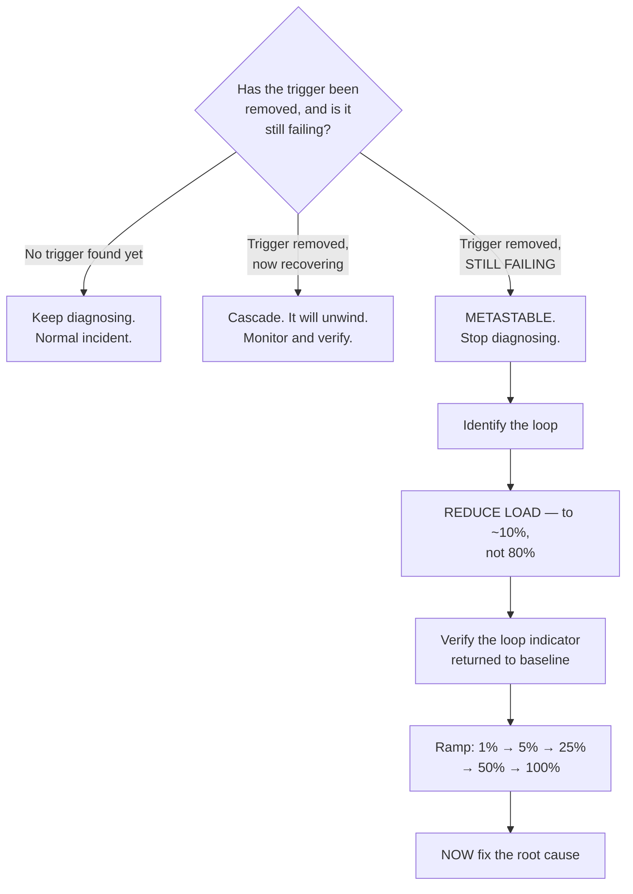

# Playbook, Checklists, and Golden Defaults

The operational companion to the rest of the collection. Everything here is meant to be used
under time pressure or in a meeting, not read for understanding — the understanding is in docs
00 through 23, and each item here cites where it came from.

Four sections: **triage** (what to do in the next ten minutes), **golden configuration** (the
annotated defaults), **checklists** (design review, new service, production readiness), and the
**three-tier model** so that a low-stakes service is allowed to stay simple.

---

## Part 1 — Triage

### The first ten minutes

In order. Each step either identifies the failure class or eliminates several, and the ordering
is by cost: the cheap, high-yield checks come first.

**Minute 0–1 · What changed?**

Deploys, configuration pushes, feature-flag flips, infrastructure changes, dependency releases —
in the last 90 minutes, across every change channel, not just code. If something changed and the
onset correlates, **roll it back before diagnosing further.** Understanding can come afterwards;
the outage cannot.

⚠️ The exception: if the change crossed a one-way boundary — a destructive migration, a data
format change — do not roll back blind. Check first. (`G-02`)

**Minute 1–2 · Is it everyone, or a subset?**

```
sum by (region, zone, cell, client_version, tenant) (rate(requests_total{code=~"5.."}[5m]))
  / sum by (region, zone, cell, client_version, tenant) (rate(requests_total[5m]))
```

A subset that matches a boundary you designed (`I` class) is very different from one that does
not. And check `min by (instance)`, not the mean — one instance at 100% failure hides inside a
4% fleet average. (`D-04`)

**Minute 2–3 · Is traffic arriving at all?**

Compare request rate against the same hour last week. **A traffic drop with a flat error rate
means requests are dying before they reach you** — DNS, CDN, load balancer, or the accept queue
— and none of your service dashboards apply. An external synthetic probe settles it. (`E` class)

**Minute 3–4 · Are we generating our own load?**

```
sum(rate(rpc_attempts_total[1m])) / sum(rate(rpc_requests_total[1m]))
```

Above 2 means retries are material; above 5 they are your traffic. **This does not tell you the
cause; it tells you to reduce load before looking for one**, which is a different and more urgent
decision. (`F-01`)

**Minute 4–6 · What is saturated, and is it us or downstream?**

Compare, in this order: queue time, handler time, and per-dependency time. Whichever rose first
is where to look.

```
histogram_quantile(0.99, sum by (le) (rate(http_queue_time_seconds_bucket[1m])))
histogram_quantile(0.99, sum by (le, target) (rate(rpc_duration_seconds_bucket[1m])))
```

High queue time with normal handler time means you are behind, not broken. (`E-14`, `N`)

**Minute 6–8 · Is anything stale?**

Replication lag, cache hit rate, consumer lag, config age, derived-artefact age. **Staleness
produces successful responses containing wrong data**, so it is invisible in every other check.
(`S-05`, `C-09`, `Q-01`, `CD-1`)

**Minute 8–10 · Is a protective mechanism active?**

A breaker open, a bulkhead rejecting, a shedder shedding, a limiter limiting. These are "working
as designed" and are also an outage for whoever is being rejected. (`P` class)

### The decision that changes your strategy



The critical property: **hysteresis.** A system that collapsed at 6,000 req/s may only recover
below 1,500. Restoring traffic to the pre-incident level will not work. (`F-04`, doc 15 level 2
tells you your actual numbers.)

### Loop identification

| Indicator | Loop | Fastest exit |
|---|---|---|
| `attempts/requests` > 2 | **Retry** | Turn retries off |
| Queue age > client timeout | **Queue** | Drop the queue; shed by age |
| Healthy instance count declining in steps | **Redistribution** | Shed load *then* add capacity with slow start |
| Cache hit rate collapsed | **Cache** | Stop traffic, warm, ramp |
| New connections/s ≈ requests/s | **Connection** | Rate-limit accepts |
| GC time or CFS throttle fraction high | **Resource** | Restart with reduced traffic |

### Emergency levers

Ordered by how fast they can be applied. **Verify that each of these works before you need it** —
a lever you have never pulled is a lever that does not exist.

| Lever | Time to apply | Effect | Where |
|---|---|---|---|
| **Turn retries off** fleet-wide | Seconds | Removes the largest amplifier | Mesh config, or a client-library flag |
| **Concurrency cap at the gateway** | Seconds | Bounded admission; fail fast | Gateway config |
| **Disable a non-critical caller** | Seconds | Removes a load source | Feature flag |
| **Feature kill switch** | Seconds | Removes a code path | Flag service |
| **Remove the service from the LB** for 60 s | Seconds | Drains queues; resets the loop | Load balancer |
| **Shed by criticality** | Seconds | Protects valuable traffic | Shedder config |
| **Drop the admission rate** | Seconds | Protects the backend | Admission controller |
| **Roll back the deploy** | 2–10 min (**measure yours**) | Removes the trigger | Deploy tool |
| **Scale up** | 3–10 min | More capacity — useless during a loop | Autoscaler |
| **Fail over a region** | 10–30 min | Escapes a regional fault; follows you if not regional | Failover switch |

⚠️ Two things that feel right and are usually wrong during a metastable failure: **adding
capacity** (the loop scales with you, and cold instances make it worse) and **raising the
health-check threshold** so instances stop being removed (you keep sending traffic to dead hosts
and learn nothing).

### Symptom → class → where to read

| Symptom | Likely class | Doc |
|---|---|---|
| Errors before any of my code runs; one region or ISP | `E` | [01](01-the-request-path-and-where-it-breaks.md) |
| My latency equals my slowest dependency's | `R` | [02](02-synchronous-call-failures.md) |
| Thread or connection pool exhausted | `R`, `P` | [02](02-synchronous-call-failures.md), [03](03-resilience-patterns-and-their-own-failures.md) |
| Breaker stuck open; shedding good traffic | `P` | [03](03-resilience-patterns-and-their-own-failures.md) |
| Not recovering after the cause is gone | `F` | [04](04-cascading-and-metastable-failures.md) |
| Traffic to dead hosts, or no traffic anywhere | `D` | [05](05-service-discovery-and-the-control-plane.md) |
| One shard hot; replication lag; failover write loss | `S` | [06](06-data-layer-failure-points.md) |
| Two systems disagree; double charges | `T` | [07](07-transactions-sagas-and-dual-writes.md) |
| Origin load spiked with no traffic change | `C` | [08](08-caching-failure-points.md) |
| Growing lag with zero errors | `Q` | [09](09-asynchronous-and-event-driven-failures.md) |
| Duplicate side effects; split brain; wrong-by-hours logic | `L` | [10](10-state-coordination-and-time.md) |
| Onset coincides with a deploy, flag, or config push | `G` | [11](11-deploys-config-and-schema-change.md) |
| Saturation rising; scaling too slow; strange p99 | `N` | [12](12-capacity-autoscaling-and-noisy-neighbours.md) |
| Blast radius much larger than the fault | `I` | [13](13-isolation-cells-regions-and-blast-radius.md) |
| Everything green, users complaining | Any | [14](14-observability-for-failure-points.md) |

---

## Part 2 — Golden configuration

Defaults that are correct for most services. **Every one of them should be overridable with a
written reason** — the value of a default is that deviation becomes a decision.

### Outbound calls

```yaml
# Per dependency. Derive from MEASURED p99, not from this template.
dependency:
  connect_timeout: 200ms            # connecting is fast or it is not happening
  request_timeout: 3 × measured_p99 # NOT a round number. Re-derive quarterly.
  deadline_propagation: required    # min(request_timeout, remaining_budget)

  retry:
    enabled: <per-route decision>   # DEFAULT OFF for POST/PATCH
    max_attempts: 2                 # one retry, not two
    budget_percent: 10              # retries ≤ 10% of request volume
    backoff: full_jitter            # random(0, min(cap, base × 2^n))
    base: 100ms
    cap: 20s
    retry_on: [connect-failure, refused-stream, reset, 503, 429]
                                    # NOT 500 — the app ran and failed
  bulkhead:
    max_concurrent: λ × W_p99       # Little's law, per dependency
    acquire_timeout: 0ms            # soft deps: fail immediately, use the fallback
                                    # hard deps: 50–200ms
  circuit_breaker:
    failure_rate_threshold: 50%
    slow_call_duration: measured_p99   # ← the setting that matters most
    slow_call_rate_threshold: 50%
    minimum_calls: 20
    window: 60s
    open_duration: 10s × random(0.5, 1.5)   # JITTERED
    half_open_permitted: 1                   # one probe, not ten
```

The three lines that do the most work: **`slow_call_duration`**, because the dangerous failure
returns 200s slowly (`R-14`); **`budget_percent`**, because it keeps retry load flat as the
failure rate rises (`R-08`); and **the jitter on `open_duration`**, because without it every
caller half-opens simultaneously and re-kills the recovering dependency (`P-04`).

### Inbound handling

```yaml
server:
  max_concurrent_requests: target_throughput × acceptable_latency   # explicit, always
  queue: LIFO                       # under overload, serve the newest
  shed_when: queue_age > 0.5 × client_timeout
  shed_order: by criticality class  # assigned at the edge, propagated
  accept_backlog: 1024              # small. Deep queues convert capacity problems
                                    # into latency problems (E-14)
  keepalive_timeout: 75s            # MUST exceed the proxy's idle timeout (E-13)
```

### Connection pools

```yaml
pool:
  max_size: ceil(throughput × hold_time × 3)    # Little's law. Usually SMALL.
  min_idle: 2                                   # not max_size — avoids connection storms
  acquire_timeout: 1s                           # NOT 30s. Fail fast.
  max_lifetime: 30min × random(0.8, 1.2)        # jittered, so turnover is continuous
  validation_query_timeout: 1s
```

⚠️ Check the total: `instances × max_size` must be well under the server's connection limit.
Past a few dozen instances, put a connection proxy in front (`S-09`, `R-09`).

### Kubernetes workload

```yaml
spec:
  replicas: <from N−k headroom, not from current load>
  strategy:
    type: RollingUpdate
    rollingUpdate:
      maxSurge: 25%
      maxUnavailable: 0             # never drop below current capacity
  minReadySeconds: 30               # ≥ warm-up time; the pause that catches a bad build
  progressDeadlineSeconds: 600
  template:
    spec:
      terminationGracePeriodSeconds: 60
      topologySpreadConstraints:
        - maxSkew: 1
          topologyKey: topology.kubernetes.io/zone
          whenUnsatisfiable: DoNotSchedule      # NOT ScheduleAnyway (N-01)
          labelSelector: {matchLabels: {app: <name>}}
        - maxSkew: 1
          topologyKey: kubernetes.io/hostname
          whenUnsatisfiable: ScheduleAnyway
      containers:
        - name: app
          resources:
            requests: {cpu: "1",  memory: "2Gi"}
            limits:   {memory: "2Gi"}    # memory limit == request (incompressible)
                                          # CPU limit OMITTED for latency-sensitive
                                          # services — see N-06
          env:
            - name: GOMEMLIMIT
              value: "1800MiB"            # ~90% of the limit; tell the runtime
            # Go: import _ "go.uber.org/automaxprocs"
            # JVM: -XX:MaxRAMPercentage=75
          lifecycle:
            preStop:
              exec:
                command: ["/bin/sh","-c","sleep 10"]   # outlive endpoint propagation
          readinessProbe:               # instance-specific state ONLY
            httpGet: {path: /ready, port: 8080}
            periodSeconds: 5
            failureThreshold: 2         # quick to remove
            successThreshold: 3         # slow to re-add (anti-flap)
          livenessProbe:                # NEVER tests dependencies
            httpGet: {path: /healthz, port: 8080}
            periodSeconds: 10
            failureThreshold: 6
---
apiVersion: policy/v1
kind: PodDisruptionBudget
spec:
  minAvailable: 80%
  selector: {matchLabels: {app: <name>}}
```

### Autoscaling

```yaml
spec:
  minReplicas: <survives N−k without scaling>
  maxReplicas: <bounded by what the DOWNSTREAM can take>   # N-13
  metrics:
    - type: Pods                       # concurrency, not CPU, for request services
      pods:
        metric: {name: http_inflight_requests}
        target: {type: AverageValue, averageValue: "40"}
    - type: Resource                   # CPU as a backstop only
      resource: {name: cpu, target: {type: Utilization, averageUtilization: 80}}
  behavior:
    scaleUp:
      stabilizationWindowSeconds: 0
      policies: [{type: Percent, value: 100, periodSeconds: 30}]
    scaleDown:
      stabilizationWindowSeconds: 600  # slow. Asymmetric on purpose.
      policies: [{type: Percent, value: 10, periodSeconds: 60}]
```

### PostgreSQL roles

```sql
-- On every application role. "Unlimited" is not a default; it is a decision nobody made.
ALTER ROLE app_service SET statement_timeout = '30s';
ALTER ROLE app_service SET idle_in_transaction_session_timeout = '60s';
ALTER ROLE app_service SET lock_timeout = '3s';

-- On the migration role specifically — fail fast rather than queueing behind a long read
ALTER ROLE migrator SET lock_timeout = '2s';
ALTER ROLE migrator SET statement_timeout = '300s';

-- Prevent a dead replication slot filling the disk (S-14)
ALTER SYSTEM SET max_slot_wal_keep_size = '100GB';

-- Per-transaction durability where it matters, not globally
-- (in the money path): SET LOCAL synchronous_commit = on;
```

### Cache

```yaml
cache:
  ttl: base × random(0.8, 1.2)        # JITTER, always (C-02)
  negative_ttl: 60s                   # cache absence too (C-06)
  key: allowlist of components only   # never a denylist (C-11)
  key_includes_schema_version: true   # so a deploy invalidates cleanly
  client:
    timeout: 50ms                     # cache ops are sub-millisecond
    on_error: treat_as_miss           # NEVER fail the request
    circuit_breaker: enabled
  hot_keys:
    local_cache_ttl: 1s               # in-process tier in front (C-03)
  stampede:
    single_flight: enabled            # one origin call per key per process
    early_recompute: enabled          # probabilistic; hot keys never expire
    serve_stale_while_revalidate: true
```

### Kafka consumer

```yaml
consumer:
  max_poll_interval_ms: 300000
  max_poll_records: <bounded so a batch completes well inside max_poll_interval>
  enable_auto_commit: false           # commit after processing, explicitly
  isolation_level: read_committed     # if transactional producers exist
  error_handling:
    permanent_errors: [deserialization, 4xx_from_downstream] → DLQ on first attempt
    transient_errors: retry 3 with backoff → DLQ
  drain_rate_limit: 2 × steady_state  # Q-04 — the recovery, not the failure
alerts:
  - oldest_unprocessed_age > SLO      # THE alert. If you add one, add this.
  - lag_derivative > 0 for 15m
  - successful_process_rate == 0 for expected_quiet_period
  - dlq_depth > 0
  - rebalance_rate > 1 per 10m
```

### The minimum metric set

If a service exports nothing else, these.

| Metric | Detects | Doc |
|---|---|---|
| Request rate, error rate, duration (per route) | The baseline | [Observability](../Observability/01-the-red-method.md) |
| **Queue time** (proxy receive → handler start) | `E-14`, `N`, `F-04` | [01](01-the-request-path-and-where-it-breaks.md) |
| **Per-dependency client-side latency and attempts** | `R`, `F-01` | [02](02-synchronous-call-failures.md) |
| In-flight requests vs limit | `R-13`, `N` | [02](02-synchronous-call-failures.md) |
| Breaker state, bulkhead rejections, shed count | `P` | [03](03-resilience-patterns-and-their-own-failures.md) |
| Pool: active, max, **acquire time** | `R-09` | [02](02-synchronous-call-failures.md) |
| **Per-instance success rate** (as `min`, not mean) | `D-04` | [05](05-service-discovery-and-the-control-plane.md) |
| Cache hit rate **per key pattern**; eviction rate | `C` | [08](08-caching-failure-points.md) |
| **Age of oldest unprocessed message**; DLQ depth | `Q` | [09](09-asynchronous-and-event-driven-failures.md) |
| Replication lag (from a heartbeat table) | `S-05` | [06](06-data-layer-failure-points.md) |
| **Reconciliation mismatch count** | `T` | [07](07-transactions-sagas-and-dual-writes.md) |
| **Derived-artefact age** | `CD-1` | [20](20-case-professional-network-corridor.md) |
| CFS throttled fraction; GC pause; working set / limit | `N-06`, `N-07`, `F-05` | [12](12-capacity-autoscaling-and-noisy-neighbours.md) |
| Config / discovery staleness per node | `D-07` | [05](05-service-discovery-and-the-control-plane.md) |
| Clock offset | `L-08` | [10](10-state-coordination-and-time.md) |
| **Per-feature availability** | `P-14` | [03](03-resilience-patterns-and-their-own-failures.md) |

---

## Part 3 — Checklists

### Design review

Twenty questions. A design that cannot answer them is not finished; a design that answers them
badly is a decision, which is progress.

**Dependencies**

1. List every synchronous dependency. For each: **hard or soft?**
2. For each soft one: *if it hangs entirely, does throughput change?* If yes, it is hard.
3. What is the availability ceiling? `0.999^(hard dependency count)`.
4. Which dependencies could be moved off the synchronous path entirely?
5. For each: timeout derived from its measured p99? Bulkhead sized from `λ × W`? Fallback that
   has actually run?

**Failure propagation**

6. How many layers retry? What is `a^n`? Is there a budget?
7. Is there a deadline propagated from the edge, and does every hop honour it?
8. What happens when this service is overloaded — does it shed, queue, or die?
9. Are there cycles in the call graph?

**Data**

10. What is the shard key, and which queries does it make scatter-gather?
11. Which reads tolerate staleness, and is that explicit in the code?
12. Is there a dual write anywhere? (Any write to two systems, including a database plus a
    queue.)
13. For every multi-step operation: what happens if it half-completes? Who compensates?
14. Is every retryable operation idempotent, with a key generated once outside the retry loop?
15. **What reconciles, how often, and what does it do when it finds a mismatch?**

**Change and blast radius**

16. What is the blast radius of a bad deploy? Of a bad config push?
17. Can this be rolled back? What is the measured rollback time?
18. Is every change backward compatible with the version before it?

**Capacity and isolation**

19. What is utilisation after losing the failure domain you claim to survive (`N − k`)?
20. For every redundant component: **name the failure that takes out all of them at once.**

### New service

**Before the first deploy**

- [ ] Timeouts on every outbound call (connect **and** request); no infinite defaults anywhere
- [ ] Deadline honoured from the inbound request and propagated outbound
- [ ] Retries opt-in per route; off for non-idempotent methods; budgeted; full jitter
- [ ] One connection pool per dependency, sized from `λ × W`, with an acquire timeout
- [ ] Bulkhead per dependency or per criticality class
- [ ] Liveness probe that tests nothing external; readiness that tests only instance-local state
- [ ] `preStop` sleep plus a grace period exceeding the longest in-flight request
- [ ] `SIGTERM` stops new work and finishes in-flight work rather than exiting
- [ ] Recover at the request boundary — an unhandled error must not kill the process
- [ ] Bounds on every input-derived quantity: body size, nesting depth, array length, page size
- [ ] Resource requests set; memory limit == request; runtime told its limits
- [ ] Structured logs with a trace ID; `traceparent` propagated, including into messages
- [ ] The minimum metric set exported

**Before taking production traffic**

- [ ] Load-tested to the **collapse point**, with the recovery point measured (doc 15, level 2)
- [ ] Fault-injection tests for every dependency: error, timeout, **hang**, malformed, slow
- [ ] Alerts on symptoms; leading indicators as tickets
- [ ] An SLO appropriate to the path type (availability / freshness / correctness)
- [ ] Runbook with the triage order and the emergency levers for *this* service
- [ ] Rollback tested and timed
- [ ] On-call ownership assigned and the rotation informed

**Within the first month**

- [ ] Reconciliation running against every system this one must agree with
- [ ] A chaos experiment run against it in production with a bounded blast radius
- [ ] Headroom computed for `N − k` and the utilisation target set from it
- [ ] Cost of the failure modes understood — what one hour of outage costs

### Production readiness for an existing service

Score each area. Anything below "adequate" is a finding with an owner.

| Area | Inadequate | Adequate | Good |
|---|---|---|---|
| **Timeouts** | Defaults or round numbers | Derived from p99 | Derived, CI-enforced, re-derived quarterly |
| **Retries** | Everywhere, count-based | Single layer, budgeted, jittered | Plus amplification monitored and a fleet-wide off switch |
| **Bulkheads** | None | Per criticality class | Per dependency, sized from `λ × W` |
| **Shedding** | None | Concurrency cap | Adaptive limit, LIFO, shed by criticality |
| **Deploys** | All at once | Rolling with `maxUnavailable: 0` | Canary with automated rollback and a measured rollback time |
| **Config** | Ad hoc, instant, global | In version control | Staged rollout with health gating and auto-rollback |
| **Observability** | RED only | Plus queue time and saturation | The full minimum set, including reconciliation and artefact age |
| **Async** | Depth alerts | Age-of-oldest alerts | Plus canaries, drain limits, and DLQ-above-zero |
| **Data** | Shared pool, no limits | Timeouts set, pool sized | Plus a proxy, lag-aware routing, reconciliation |
| **Capacity** | Reactive | Headroom for one instance | `N − k` headroom, documented with its reason |
| **Isolation** | Shared everything | Multi-AZ with spread enforced | Cells, with the boundary enforced at the network layer |
| **Testing** | Unit tests | Dependency fault injection in CI | Production chaos and regular game days |

---

## Part 4 — The three-tier model

**Not every service needs everything in this collection**, and applying all of it uniformly is
its own failure — it produces so much configuration surface that teams stop reasoning about any
of it.

Classify each service by what its failure costs, and apply the tier.

### Tier 3 — Low stakes

*Internal tools, dashboards, non-critical batch jobs, anything whose failure someone notices
tomorrow.*

- Timeouts on every call (**never skip this — it is one line and it prevents thread exhaustion**)
- One retry with jitter
- A liveness probe and resource requests
- RED metrics and an error-rate alert
- Rolling deploys

**That is the whole list.** Bulkheads, breakers, cells, and reconciliation are over-engineering
here, and adding them costs maintenance for no benefit.

### Tier 2 — Standard

*User-facing services whose failure is visible but recoverable. Most services.*

Everything in tier 3, plus:

- Timeouts derived from measured p99, re-derived when the dependency's p99 moves 50%
- Retry budgets; single-layer retry; correct error classification
- Bulkheads by criticality class (three pools, not thirty)
- Circuit breakers **with slow-call detection**
- Deadline propagation
- Load shedding with a concurrency limit
- Readiness probes distinct from liveness; `preStop` and graceful shutdown
- Pool sizing from `λ × W`; acquire timeouts
- Queue time measured
- Canary deploys with automated rollback
- Config in version control with staged rollout
- An SLO with an error budget
- Fault-injection tests in CI for every dependency

### Tier 1 — Critical

*Revenue path, money, identity, safety. Failure is a business incident.*

Everything in tier 2, plus:

- Per-dependency bulkheads sized individually
- Adaptive concurrency limits
- Idempotency keys on every mutating operation
- **Reconciliation against every system this one must agree with**, running every few minutes,
  with an automatic corrective action
- Outbox for every write that also emits an event
- Durable, resumable saga state for multi-step operations
- Per-transaction durability settings on the money path
- `N − k` headroom, documented
- Cell isolation
- A separate gateway fleet and node pool from lower-tier traffic
- Production chaos experiments on a schedule
- Game days quarterly
- A measured, rehearsed rollback and failover
- Per-feature availability SLIs
- A correctness SLI, not only an availability one

### Classifying honestly

The failure mode of this model is tier inflation — every team believes their service is tier 1.
The test that settles it:

> **What is the cost of one hour of total failure of this service, in money, and who would
> notice within that hour?**

| Answer | Tier |
|---|---|
| Nobody notices within a day | 3 |
| Users notice and are inconvenienced; revenue continues | 2 |
| Revenue stops, money is wrong, or a regulatory obligation is missed | 1 |

Write the number down next to the service name. It makes the conversation short, and it makes
the *de-escalation* conversation possible — which is the one that never happens otherwise.

---

## The ten things that matter most

If the collection compressed to one page, this would be it. Each is derived somewhere in docs
00–23.

1. **A dependency that is slow is worse than one that is down**, because slow consumes your
   concurrency and affects requests that never touch it. A timeout derived from p99 and a
   bulkhead are the two mechanisms that bound it.
2. **Availability multiplies down a serial path.** Ten hard dependencies at 99.9% is 99.0%.
   Reclassifying dependencies from hard to soft is the cheapest reliability work there is.
3. **Retry amplification is `a^n`** and it peaks exactly when capacity is lowest. Single layer,
   10% budget, full jitter, correct error classification — and a fleet-wide off switch you have
   tested.
4. **If the trigger is gone and it is still failing, you are in a loop.** Reduce load to a small
   fraction — not to "normal" — then ramp. Adding capacity does not help.
5. **Change is the most common trigger, and configuration has deploy blast radius with none of
   the process.** "What changed in the last sixty minutes?" is the first question in every
   incident.
6. **There is no atomic commit across two systems.** Use an outbox for the write-plus-event case
   and idempotency keys everywhere else — and reconcile, because divergence is a certainty rather
   than a risk.
7. **Async failures have no error rate, no latency, and idle CPU.** Age of the oldest unprocessed
   work is the one alert that detects the whole class.
8. **If you cannot fence, your lock is an optimisation, not a guarantee.** Put exclusivity in the
   resource's own state transition; better still, make the operation idempotent so the question
   stops mattering.
9. **Redundancy only helps against independent failures**, and the correlation term dominates.
   For every redundant component, name the failure that takes out all of them at once — and
   remember that deployment and configuration are failure domains that span every physical
   boundary you paid for.
10. **Isolation is the only defence against the failures you did not anticipate**, which are the
    ones that will cause your worst outage. Cells bound the blast radius of everything, including
    the causes nobody listed.

---

That is the collection. Start at [README.md](README.md) for the map, or at
[00-what-is-a-point-of-failure.md](00-what-is-a-point-of-failure.md) for the vocabulary
everything else assumes.
