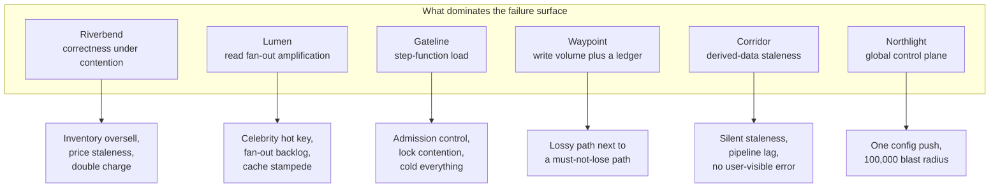

# Points of Failure in Microservices — Where Systems Break, Why, and What to Do About It

A staff-level collection on the **points of failure (POF)** in microservice architectures: every
place a request can die, stall, duplicate, or silently return the wrong answer; the mechanism
behind each one; how the same failure behaves at 200 requests per second versus 500,000; and
which technology choice makes each failure more or less likely.

The organising idea is this. A *point of failure* is not the same thing as a *component*. A
component is a box on your architecture diagram. A point of failure is a **place where one thing
going wrong changes the behaviour a user sees**, and most of those places are not boxes — they
are the arrows between the boxes, the shared resources underneath the boxes, and the control
systems that decide where the arrows point. Teams draw the boxes, make each box redundant, and
are then astonished when the system falls over anyway. This collection is about everything that
is not the box.

The bias throughout: **almost nothing in a mature microservice system fails because a machine
died.** Machines dying is the failure mode you already handled; it is why you have three
replicas. The outages that actually happen are the ones where every machine was healthy the whole
time — a retry policy that amplified a small blip into a total one, a config push that was valid
YAML, a cache that expired all at once, a connection pool sized for a latency that stopped being
true. So every failure in this collection is explained by first showing the design working, then
showing the specific condition under which the same design turns against you.

## Who this is for

You should read this if two or more of these are true:

- You own a service that calls at least three other services, and you cannot currently state —
  from configuration, not memory — what happens to your service when the slowest of them takes
  ten seconds instead of fifty milliseconds.
- You have had an incident whose postmortem contains the phrase "retry storm", "thundering herd",
  "cache stampede", or "the service recovered on its own after we stopped traffic", and the
  explanation stopped there.
- You are asked in design reviews or interviews "what are the single points of failure here?" and
  you find yourself pointing at databases, because databases are the part that has an obvious
  answer.
- Your system has a control plane — a service registry, a mesh, a feature-flag service, a config
  service — and nobody has tested what happens when it is unavailable, because it is "just
  control plane."
- You are planning for 10× and want to know which of your current failure modes get worse
  linearly, which get worse quadratically, and which only appear past a threshold you have not
  crossed yet.

If you run three services behind one load balancer with one database and your traffic fits on a
single machine, you do not need this collection. Read
[00-what-is-a-point-of-failure.md](00-what-is-a-point-of-failure.md) for the vocabulary, set
timeouts and one retry with jitter, and stop there. Most of what follows is the cost of
distribution, and you have not paid for distribution yet.

## Start here, in this order

1. **[00-what-is-a-point-of-failure.md](00-what-is-a-point-of-failure.md)** — read this first even
   if you have run distributed systems for a decade. It defines the vocabulary the rest of the
   collection uses without re-explaining (blast radius, failure domain, correlated failure, gray
   failure, control plane versus data plane, static stability), and it sets out the **thirteen
   POF classes** that every later catalogue slots into.
2. **[01-the-request-path-and-where-it-breaks.md](01-the-request-path-and-where-it-breaks.md)** —
   the single request walked hop by hop from a phone's DNS resolver to a database page, with the
   failure points marked at each hop. This is the "different paths cause different failures" doc,
   and it is the map for everything after it.
3. **[04-cascading-and-metastable-failures.md](04-cascading-and-metastable-failures.md)** — if you
   read only one more doc, read this one. Most multi-hour outages are in here, and they are all
   the same shape.
4. Then read in whatever order matches your problem. Docs cross-reference rather than assuming
   you read them in sequence.

If you are here because **something is broken right now**, go to
[24-playbook-checklists-and-golden-defaults.md](24-playbook-checklists-and-golden-defaults.md) for
triage order, then to whichever catalogue owns the symptom. If you are here because you are
**choosing a stack**, go to
[22-tech-stack-choices-and-tradeoffs.md](22-tech-stack-choices-and-tradeoffs.md). If you are here
because you are **preparing for an interview or a design review**, read 00, 01, 04, then the case
study closest to your domain, then
[23-staff-interview-questions.md](23-staff-interview-questions.md).

## Topics

### Part 1 — Foundations

| Doc | Covers |
|-----|--------|
| [00-what-is-a-point-of-failure.md](00-what-is-a-point-of-failure.md) | Definitions built from scratch: failure domain, blast radius, correlated failure, gray failure, fail-fast versus fail-static, control plane versus data plane, the difference between availability and correctness failures; the thirteen-class POF taxonomy used by every later doc |
| [01-the-request-path-and-where-it-breaks.md](01-the-request-path-and-where-it-breaks.md) | `E-01…E-15`: the full path — client, DNS, anycast, CDN, TLS, L4 balancer, L7 gateway, mesh sidecar, service, data store — with the failure point at each hop, and the four *different* paths (read, write, async, streaming) that fail in four different ways |

### Part 2 — Service-to-service failure

| Doc | Covers |
|-----|--------|
| [02-synchronous-call-failures.md](02-synchronous-call-failures.md) | `R-01…R-16`: timeouts that are not budgets, the retry-amplification multiplier derived arithmetically, deadline propagation, connection pool exhaustion, head-of-line blocking in HTTP/2 and gRPC, hedged requests, the slow-dependency-becomes-your-outage path |
| [03-resilience-patterns-and-their-own-failures.md](03-resilience-patterns-and-their-own-failures.md) | `P-01…P-14`: circuit breakers, bulkheads, load shedding, rate limits, fallbacks, graceful degradation — each derived from the problem it solves, then the specific way each one *becomes* the point of failure it was installed to prevent |
| [04-cascading-and-metastable-failures.md](04-cascading-and-metastable-failures.md) | `F-01…F-12`: the feedback loops. Retry storms, thundering herds, queue collapse, the death spiral, congestive collapse, why a system that has entered a metastable failure state does not recover when you remove the trigger, and the three ways out |
| [05-service-discovery-and-the-control-plane.md](05-service-discovery-and-the-control-plane.md) | `D-01…D-13`: registries, health checks that lie, xDS and config push, the control plane as the largest hidden single point of failure, fail-static design, and the "control plane recovers, data plane stampedes" pattern |

### Part 3 — State and data

| Doc | Covers |
|-----|--------|
| [06-data-layer-failure-points.md](06-data-layer-failure-points.md) | `S-01…S-18`: shard hot spots, replication lag as a correctness bug, failover and the lost-write window, connection storms, pool exhaustion arithmetic, read-your-writes violations, the right-edge index contention problem, cross-shard queries |
| [07-transactions-sagas-and-dual-writes.md](07-transactions-sagas-and-dual-writes.md) | `T-01…T-14`: the dual-write problem stated precisely, outbox and CDC, sagas and their compensation failures, idempotency keys done right and done wrong, two-phase commit's real failure mode, the "exactly once" illusion and what you can actually buy |
| [08-caching-failure-points.md](08-caching-failure-points.md) | `C-01…C-15`: stampede and the three fixes, hot keys, negative caching, the cache that became load-bearing, cold-start capacity cliffs, TTL synchronisation, stale-write-back, and why cache invalidation failures are correctness bugs not performance bugs |
| [09-asynchronous-and-event-driven-failures.md](09-asynchronous-and-event-driven-failures.md) | `Q-01…Q-14`: queue depth as a leading indicator, poison messages, ordering guarantees that quietly are not, dead-letter queues nobody reads, the async path's unique failure — the *silent* backlog — and how it differs from the Kafka-specific material in [`../Kafka`](../Kafka/README.md) |
| [10-state-coordination-and-time.md](10-state-coordination-and-time.md) | `L-01…L-13`: distributed locks that are not locks, lease expiry and fencing tokens, leader election and split brain, clock skew as a correctness input, quorum loss, the "held lock, dead holder" problem, and why `SETNX` with a TTL is not mutual exclusion |

### Part 4 — Change, capacity, and isolation

| Doc | Covers |
|-----|--------|
| [11-deploys-config-and-schema-change.md](11-deploys-config-and-schema-change.md) | `G-01…G-16`: the biggest real cause of outages. Bad deploys, the global config push, feature flags as untested code paths, schema migrations and the expand-contract discipline, protocol and contract breakage, rollback that does not roll back |
| [12-capacity-autoscaling-and-noisy-neighbours.md](12-capacity-autoscaling-and-noisy-neighbours.md) | `N-01…N-15`: autoscaling that scales the wrong signal, scale-up lag versus failure speed, cold starts, CPU throttling and the CFS quota trap, memory limits and the OOMKill loop, noisy neighbours, resource quota exhaustion, and capacity as a correctness property |
| [13-isolation-cells-regions-and-blast-radius.md](13-isolation-cells-regions-and-blast-radius.md) | `I-01…I-14`: failure domains you actually have versus the ones on the diagram, cell-based architecture, shuffle sharding derived with the combinatorics, availability zones, multi-region and the partial-failover trap, gray failures, and the cost of every isolation boundary |

### Part 5 — Seeing and proving

| Doc | Covers |
|-----|--------|
| [14-observability-for-failure-points.md](14-observability-for-failure-points.md) | Which signal detects which POF class, the metrics that mislead during each failure, SLOs that fail correctly, dependency-aware alerting, and the "everything is green and the site is down" problem |
| [15-testing-for-failure-chaos-and-gamedays.md](15-testing-for-failure-chaos-and-gamedays.md) | Fault injection that proves something, the load test that finds the metastable point, dependency failure drills, region evacuation exercises, and a graded programme from "you have never done this" to continuous automated chaos |

### Part 6 — Case studies by domain

Each case study takes a real-shaped system, fixes its scale from the reference notes in
[`../../../system-design-notes`](../../../system-design-notes), maps its complete POF surface, walks
three to five incidents end to end, and argues the stack choices.

| Doc | System | Its defining failure problem |
|-----|--------|------------------------------|
| [16-case-ecommerce-riverbend.md](16-case-ecommerce-riverbend.md) | **Riverbend** — online marketplace | Correctness under contention: inventory, pricing, and payment must not be wrong even when everything is slow. The checkout path cannot degrade the way the browse path can. |
| [17-case-social-feed-lumen.md](17-case-social-feed-lumen.md) | **Lumen** — photo and video sharing, Instagram-shaped | Fan-out. 1.15M feed reads/s against a graph where one account has 400M followers, and the celebrity post is a self-inflicted denial of service. |
| [18-case-ticketing-gateline.md](18-case-ticketing-gateline.md) | **Gateline** — mega-event ticketing, Ticketmaster-shaped | The 100× step function: 5K QPS baseline to 500K QPS in ten seconds, against 100,000 seats that must each sell exactly once. Every POF fires simultaneously, on purpose, on a schedule. |
| [19-case-ride-hailing-waypoint.md](19-case-ride-hailing-waypoint.md) | **Waypoint** — ride hailing, Uber-shaped | 750,000 location writes/s that may be lossy, alongside a trip state machine and a money ledger that may not be. Two failure philosophies inside one request path. |
| [20-case-professional-network-corridor.md](20-case-professional-network-corridor.md) | **Corridor** — professional network, LinkedIn-shaped | Derived data. Hundreds of billions of tracking events/day feeding offline pipelines whose output serves online reads — so the failure point is a *stale artefact*, and it fails silently for hours. |
| [21-case-service-mesh-northlight.md](21-case-service-mesh-northlight.md) | **Northlight** — streaming platform with a 100,000-sidecar mesh, Netflix-shaped | The mesh removes a hundred failure points from application code and creates six new ones in the platform, all of them global. What it costs to make every service's resilience one team's problem. |

### Part 7 — Deciding and operating

| Doc | Covers |
|-----|--------|
| [22-tech-stack-choices-and-tradeoffs.md](22-tech-stack-choices-and-tradeoffs.md) | For each concern — protocol, gateway, mesh, datastore, cache, queue, coordination, deployment — the realistic options, the POF profile each one *buys* and each one *creates*, and a decision procedure for picking. Includes the cases where the correct answer is "fewer services" |
| [23-staff-interview-questions.md](23-staff-interview-questions.md) | A question bank with full model answers and the follow-ups a strong answer invites, organised by POF class and by system |
| [24-playbook-checklists-and-golden-defaults.md](24-playbook-checklists-and-golden-defaults.md) | Triage order under pressure, the annotated golden configuration for timeouts/retries/pools/breakers, a design-review checklist, a new-service checklist, and a three-tier model so a low-stakes service stays simple |

## The six running systems

Abstract examples make these docs harder, not easier. Every number below is fixed and reused
across every doc, so when doc 04 says "recall Gateline's 500,000 requests per second at sale
open", it is referring to this table, and the arithmetic in doc 04 will reconcile with the
arithmetic in doc 18.

Scale figures are taken from the system design notes in
[`../../../system-design-notes`](../../../system-design-notes) so that this collection and those notes
agree. The source file for each is named.

| System | Shape | Source notes | Scale that matters for failure analysis |
|---|---|---|---|
| **Riverbend** | Online marketplace | `ecommerce/`, `globalTrafficRouting.md`, plus this repo's [`K8s/cronJobs`](../K8s/cronJobs/README.md) and [`Observability`](../Observability/README.md) | 240 services, 38 namespaces, EKS. `checkout-api` 640 req/s steady → 3,400 req/s flash-sale peak. Catalogue reads 5,000/s steady, 42,000/s peak. Orders 67/s steady. Doc 16 also re-derives every failure at **Amazon scale**: 20M orders/day, 5,000 orders/s peak, 500K page views/s, 5M catalogue reads/s |
| **Lumen** | Photo and video sharing | `instagramHLD.md` | 2B MAU, 500M DAU, 50M peak concurrent. Feed reads **1.15M/s average, 3–5M/s peak**. 100M posts/day (1,150 writes/s), 58,000 likes/s, 5,800 comments/s. 400B follow edges. 1 TB/s peak egress. Feed p50 < 200 ms, p99 < 500 ms |
| **Gateline** | Mega-event ticketing | `ticketBookingHLD.md` | Baseline **5,000 QPS**. At sale open: 10M users in the first 2 minutes, **500,000 QPS in the first 10 seconds**, 333K req/s sustained for 30 s. 100,000 seats for 50M interested users. Seat-availability reads 200K/s. Post-waiting-room backend ~10K QPS |
| **Waypoint** | Ride hailing | `uberHLD.md` | 130M MAU, 25M trips/day. **750,000 GPS writes/s** (3M drivers × 1 per 4 s), 1.2M/s at rush hour. Trip requests 290/s average, **1,000/s peak**. 260,000 concurrent active trips. 6.5 TB/day of location data. Geo-index query p99 2.1 ms |
| **Corridor** | Professional network | `LinkedIn/` | 1B members, ~100M DAU. Feed loads: tens of thousands/s peak, hundreds of thousands of cards rendered/s. **Hundreds of billions of tracking events/day.** Median 50 followers, p90 500, influencers in the millions. Feed p99 500 ms server-side; publish-to-visible p99 < 60 s |
| **Northlight** | Streaming platform running a mesh | `serviceMeshNetflixScale.md` | **100,000+ Envoy sidecars**, each holding an xDS stream. ~2,500 services, 5–200 upstream clusters each. ~100 endpoint mutations/s fleet-wide. Sidecar adds < 5 ms at p99, ~0.3–0.5 ms typical. No xDS server serves more than ~50,000 sidecars |

The six are chosen because their failure profiles barely overlap:

## Conventions used across docs

**Scenario IDs.** Every failure gets an ID whose letter names the owning doc. They are the
cross-reference spine — case studies, the interview bank, and the playbook all cite them.

| Prefix | Owning doc | Class |
|---|---|---|
| `E-nn` | 01 | **E**dge and request path |
| `R-nn` | 02 | Synchronous **R**PC between services |
| `P-nn` | 03 | Resilience **P**atterns turning into failures |
| `F-nn` | 04 | **F**eedback loops: cascading and metastable failure |
| `D-nn` | 05 | **D**iscovery and control plane |
| `S-nn` | 06 | **S**torage and the data layer |
| `T-nn` | 07 | **T**ransactions, sagas, dual writes |
| `C-nn` | 08 | **C**aching |
| `Q-nn` | 09 | **Q**ueues and asynchronous processing |
| `L-nn` | 10 | **L**ocks, leaders, and time |
| `G-nn` | 11 | Chan**G**e: deploys, config, schema |
| `N-nn` | 12 | Capacity, autoscaling, **N**oisy neighbours |
| `I-nn` | 13 | **I**solation, cells, regions, blast radius |

Case-study incidents use a two-letter system prefix: `RB-n` (Riverbend), `LM-n` (Lumen), `GL-n`
(Gateline), `WP-n` (Waypoint), `CD-n` (Corridor), `NL-n` (Northlight).

**Each scenario follows the same five headings**, so you can skim to the one you need:

- **What you see** — the symptom, from the point of view of whoever gets paged.
- **Mechanism** — why it happens, derived rather than asserted.
- **Confirm it** — the query, command, or measurement that distinguishes this from the four
  things it looks like.
- **Recover** — what to do in the next ten minutes.
- **Prevent** — the design or configuration change, and what that change costs.

**Every doc ends with a numbered "What to take away."** If you are revisiting a doc, read that
first.

**Numbers are derived in visible steps.** Where a doc says a pool will exhaust in 4.2 seconds, the
multiplication that produced 4.2 is on the page. Check the arithmetic against your own numbers
rather than adopting the conclusion.

**⚠️ marks a step that can make an ongoing incident worse.** These appear in recovery procedures
where the obvious action is the wrong one.

## Related collections in this repo

This collection deliberately does not re-derive material that already exists elsewhere here. It
cites instead:

- [`../Kafka`](../Kafka/README.md) — broker, replication, producer, consumer, and delivery-
  semantics failures in depth. Doc 09 covers the *architectural* role of async messaging and
  points at the Kafka collection for the internals.
- [`../Observability`](../Observability/README.md) — RED, USE, SLOs, error budgets, cardinality.
  Doc 14 applies those methods to POF detection rather than re-teaching them.
- [`../K8s/cronJobs`](../K8s/cronJobs/README.md) — scheduled-work failures, which are a distinct
  class from request-driven and event-driven work. Doc 12 borrows its resource and eviction
  material.
- [`../ErrorHandling.md`](../ErrorHandling.md) — error taxonomy, propagation, and the discipline
  of turning silent failures into loud ones, which is the philosophy underneath this whole
  collection.
- [`../DataPlatform.md`](../DataPlatform.md) — analytical and pipeline failures, which doc 20
  (Corridor) depends on for the derived-data staleness case.
