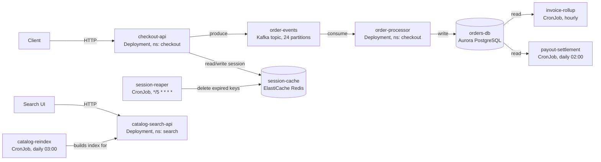

# Observability for Staff Engineers — RED, USE, and the Signals That Actually Page You

A staff-level primer on production observability, built around the two metric methodologies
that between them cover almost every component you will ever operate: **RED** (Rate, Errors,
Duration) for anything that serves requests, and **USE** (Utilization, Saturation, Errors) for
anything that is a finite resource. It is broken into numbered docs by **aspect** — the two
methods themselves, how to choose between them, turning metrics into SLOs, instrumenting them
without destroying your metrics backend, and alerting on the result — so each doc can be read on
its own and linked to from a review comment, a postmortem, or an onboarding doc.

The bias throughout: **a metric is only useful if you can say, in one sentence, what decision it
changes.** Most dashboards fail not because they lack metrics but because they have too many, and
nobody can say which ones would actually wake someone up correctly. So every method here is
introduced by first showing what a team measures naively, and what that naive measurement misses.

## Who this is for

You should read this if you can say yes to two or more of these:

- You have a dashboard with more than 20 panels and cannot say which four of them would tell you
  the service is actually broken.
- You have been paged by a CPU or memory alert that turned out not to matter, or missed an
  incident that a resource graph would have shown ten minutes earlier.
- You have designed an SLO, or been asked to, and were not sure where the target number should
  come from.
- You are about to instrument a new service and want to get the metric shape right the first
  time, rather than re-cutting it after a cardinality bill or a useless dashboard.

If you own one small service with one on-call engineer and a handful of alerts that have worked
fine for two years, you do not need this collection. Read doc 00 for the mental model and stop.

## Start here, in this order

1. **[00-observability-primer.md](00-observability-primer.md)** — start here even if you already
   know what RED and USE stand for. It builds the distinction between monitoring and
   observability, introduces the running example, and explains why request-driven components and
   finite resources need two different methods rather than one universal one.
2. **[01-the-red-method.md](01-the-red-method.md)** and
   **[02-the-use-method.md](02-the-use-method.md)** — the two methods in depth. Read both before
   doc 03, since doc 03 is about choosing between them.
3. Then read in whatever order matches your problem. The docs cross-reference rather than
   assuming you read them in sequence.

If you are here because you are about to instrument something, start at
**[05-instrumentation-and-cardinality.md](05-instrumentation-and-cardinality.md)**. If you are
here because you are designing alerts or an SLO, start at
**[04-slis-slos-and-error-budgets.md](04-slis-slos-and-error-budgets.md)**.

## Topics

| Doc | Covers |
|-----|--------|
| [00-observability-primer.md](00-observability-primer.md) | Monitoring vs. observability, the three pillars, why one universal method does not work, the running example architecture |
| [01-the-red-method.md](01-the-red-method.md) | Rate, Errors, Duration for request-driven services — definitions, derivation, PromQL, the averaging trap, where RED breaks down |
| [02-the-use-method.md](02-the-use-method.md) | Utilization, Saturation, Errors for finite resources — CPU, memory, disk, connection pools, queues; the utilization-is-not-saturation trap |
| [03-red-vs-use-and-golden-signals.md](03-red-vs-use-and-golden-signals.md) | A decision framework for which method fits which component, reconciling both with Google's four golden signals, one service instrumented both ways |
| [04-slis-slos-and-error-budgets.md](04-slis-slos-and-error-budgets.md) | Turning RED/USE metrics into SLIs, setting an SLO target, error budget math, multi-window multi-burn-rate alerting derived from first principles |
| [05-instrumentation-and-cardinality.md](05-instrumentation-and-cardinality.md) | Histograms vs. summaries, bucket selection, label cardinality and what it costs, exemplars linking metrics to traces |
| [06-alerting-and-dashboards.md](06-alerting-and-dashboards.md) | Cutting a metric surface down to a handful of alerts that earn a page, dashboard layout for RED and USE, alert fatigue |
| [07-case-studies.md](07-case-studies.md) | Five incidents at Riverbend, walked mechanism → signal → fix, including two RED and USE would have missed differently |
| [08-staff-level-interview-questions.md](08-staff-level-interview-questions.md) | A staff-level question bank on observability design, with full model answers and the follow-up questions a strong candidate invites |
| [09-best-practices-and-golden-template.md](09-best-practices-and-golden-template.md) | The annotated golden dashboard and alert set, a checklist for instrumenting a new service, and the anti-patterns that show up in every review |

## The running example used throughout

This collection extends **Riverbend**, the same online marketplace used in
[`K8s/cronJobs`](../K8s/cronJobs/README.md) — an EKS cluster (control plane 1.29) already running
412 CronJobs across 38 namespaces, including `session-reaper`, `invoice-rollup`, and
`payout-settlement`. Those three exist because *something upstream* generates the sessions,
orders, and payouts they process. This collection is that upstream: the request-driven services
and the resources behind them.

| Component | Kind | Namespace | What it does | Numbers that recur across these docs |
|---|---|---|---|---|
| `checkout-api` | Deployment (request-driven) | `checkout` | Accepts and validates orders at the point of purchase | Steady ~640 req/s, peaks at 3,400 req/s during flash sales; p50 38ms, p99 310ms, p99.9 900ms; SLO 99.9% success with p99 < 500ms |
| `catalog-search-api` | Deployment (request-driven) | `search` | Serves product search against the index `catalog-reindex` rebuilds nightly | Steady ~210 req/s; p50 22ms, p99 140ms |
| `order-processor` | Deployment (consumer, resource-oriented) | `checkout` | Consumes `orders.created` off Kafka and writes confirmed orders to `orders-db` | 12 pods steady state, consumer group `order-processor-group`, partition count 24 |
| `orders-db` | Aurora PostgreSQL primary | — (managed) | System of record `order-processor` writes to, and `invoice-rollup`/`payout-settlement` read from | db.r6g.4xlarge, 16 vCPU / 128 GiB, `max_connections` 600, steady ~180 in use |
| `session-cache` | ElastiCache Redis, cluster mode | — (managed) | Backs login sessions; the thing `session-reaper` is cleaning up every 5 minutes | 3 × cache.r6g.xlarge, ~9.4 GiB usable per node |
| `order-events` | MSK (Kafka) topic `orders.created` | — (managed) | Decouples `checkout-api` from `order-processor` | 24 partitions, retention 72h |

When a doc says "recall `checkout-api`'s p99 is 310ms", it is referring to this table. Numbers
stay consistent across docs — and across the two collections — so you can follow one request from
`checkout-api` through `order-events`, into `order-processor`, into `orders-db`, and out the other
side as one of the 240,000 orders `invoice-rollup` aggregates per hour at peak.

## Conventions used across docs

- PromQL assumes Prometheus 2.4x+ with `kube-state-metrics` and standard client-library exporters
  (the Prometheus Go/Java/Python clients, or an OpenTelemetry collector remote-writing into
  Prometheus). Where a function needs a specific version, the doc says so.
- ⚠️ marks a foot-gun that regularly burns experienced engineers.
- "Signal" means a time series you would actually look at or alert on. "Metric" means the raw
  exported series it is built from — a signal is usually a PromQL expression over one or more
  metrics, not a 1:1 mapping.
- Latency numbers are always stated with a percentile (p50, p99, p99.9). A latency number with no
  percentile attached is treated in these docs as a bug in the dashboard that produced it — see
  doc 01 for why.
- Where a metric name is shown, it is a real Prometheus exposition-format name you could grep for
  in a live `/metrics` endpoint, not a placeholder.
