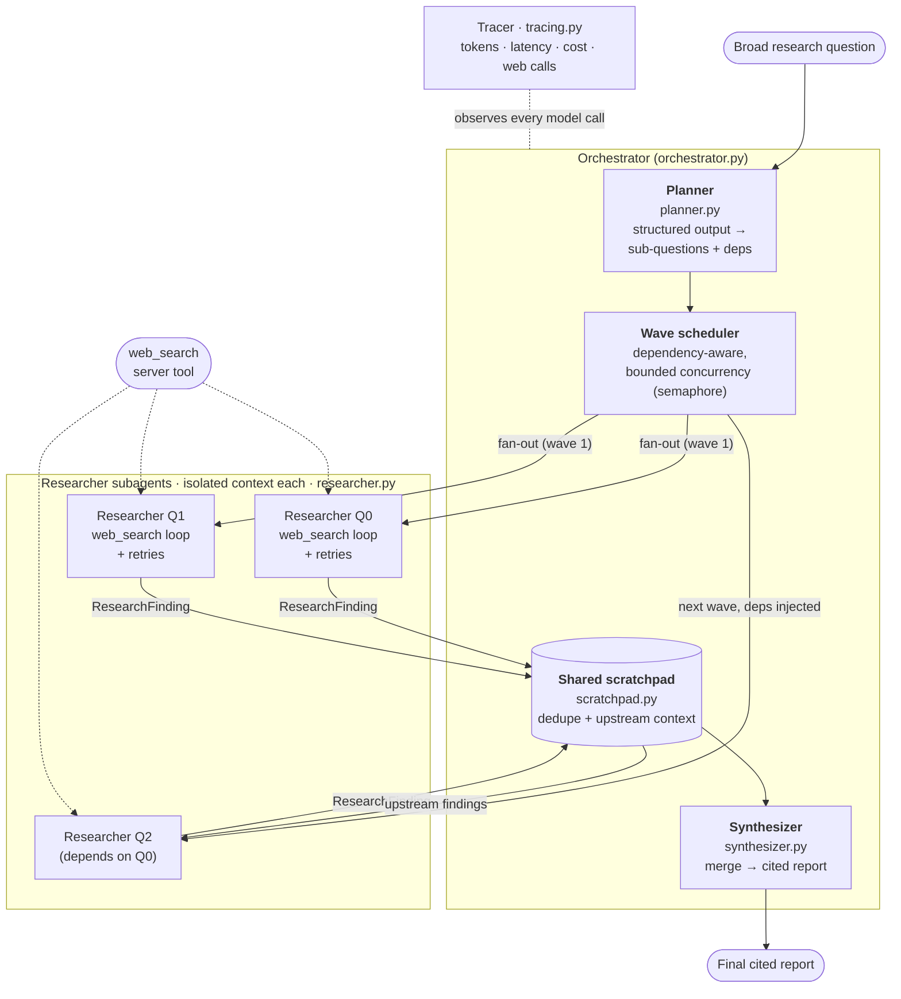

# Architecture — Fan-out Research Agent

A single orchestrator decomposes a broad question, fans it out to parallel
researcher subagents (each in an **isolated context**, each with server-side web
search), collects their structured findings into a shared scratchpad, and hands
the whole set to a separate synthesizer that produces one cited report.

## The pipeline, stage by stage

| Stage | File | Model call | What crosses the boundary |
|---|---|---|---|
| **Plan** | `planner.py` | `messages.parse` (structured output) | `ResearchPlan` = interpretation + `SubQuestion[]` with `depends_on` |
| **Schedule + fan-out** | `orchestrator.py` | — | dispatches ready sub-questions per wave under a concurrency semaphore |
| **Research** (×N, parallel) | `researcher.py` | `messages.create` + `web_search` tool, adaptive thinking | in: one sub-question (+ upstream context); out: one `ResearchFinding` |
| **Collect** | `scratchpad.py` | — | asyncio-safe `ResearchFinding` store, keyed by sub-question id |
| **Synthesize** | `synthesizer.py` | `messages.stream` | in: all findings; out: one cited report |

## The three decisions that make this staff-level

1. **Task decomposition** — the planner is told to prefer *independent*
   sub-questions and to add `depends_on` only for genuine information
   dependencies. Independence is what makes the fan-out actually parallel; the
   scheduler runs each dependency wave in turn.

2. **The interface contract** — a researcher's *entire* return value is one
   `ResearchFinding` (`contracts.py`). The orchestrator never sees a subagent's
   searches or scratch reasoning, only its structured summary + sources. That
   narrow boundary is precisely what lets each subagent hold an isolated
   context.

3. **Failure / re-delegation policy** — each researcher gets bounded retries
   with exponential backoff. A researcher that still fails yields a `FAILED`
   finding (not an exception): the run continues and the synthesizer is told the
   gap exists. A dependency cycle can't deadlock the schedule — the scheduler
   detects "nothing is ready" and breaks it by running the remainder.

## Avoiding redundant research

The shared scratchpad is the dedup mechanism. Independent sub-questions can't
see each other (they run simultaneously), but a **dependent** sub-question
receives its upstream findings as context before it starts, so it builds on them
instead of re-discovering the same facts. The synthesizer reads the whole set
once.

## Observability

Every model call records a `Span` (tokens in/out, cache reads, web searches,
duration, ok/failed). The tracer rolls these up into a per-stage cost/latency
table and reports the parallel speedup (summed model time ÷ wall clock) — the
concrete payoff of the fan-out.
